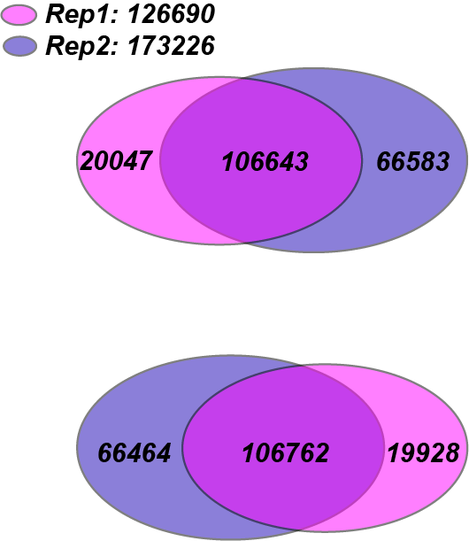

```{css, echo=FALSE}
body .main-container {
  max-width: 1200px !important;
  width: 1200px !important;
}
body {
  max-width: 1200px !important;
}

pre {
  max-height: 600px;
  overflow-y: auto;
}

pre[class] {
  max-height: 600px;
}
```

```{css, echo=FALSE}
.watch-out {
  background-color: lightcyan;
  border: 3px solid lightgrey;
  font-weight: bold;
}

.revision {
  background-color: #FFF4F2;
  border: 3px solid lightgrey;
  font-weight: bold;
}

.highlighted
{
   color:red;
}

.highlighted2
{
   color:blue;
}
```

```{r engine='R', eval=TRUE, echo=F}
knitr::opts_chunk$set(class.source = "watch-out")
```


# Install required packages
Install `bigWig` and `latticeExtra` package \
```{r engine='R', eval=F, echo=T}
install.packages("devtools", quiet = TRUE)
library(devtools)
devtools::install_github('andrelmartins/bigWig',
              subdir='bigWig')
library(bigWig)

install.packages("DESeq2", quiet = TRUE)
install.packages("dplyr", quiet = TRUE)
```

Install `bedtools` \
```{r engine='bash', eval=F, echo=T}
/bin/bash -c "$(curl -fsSL https://raw.githubusercontent.com/Homebrew/install/HEAD/install.sh)"
brew install bedtools
```

Install `Biostrings` \
```{r engine='R', eval=F, echo=T}
if (!requireNamespace("Biostrings", quietly = TRUE)) {
  if (!requireNamespace("BiocManager", quietly = TRUE))
    install.packages("BiocManager")
  BiocManager::install("Biostrings")
}
```

Install `latticeExtra` \
```{r engine='R', eval=TRUE, echo=T}
install.packages("latticeExtra", quiet = TRUE)
```

# April 18th

# Finalized Exhaustive de novo motif analysis for GATA3 ChIP-seq Data

Working directory: /home/FCAM/ssun/GATA3_ChIP_PRO_July2023/ChIP_final/final_Exhaustive_denovomotif_analysis_240418 \

## 3-ordered Markov Background Model

GATA3 TF binding sites are short, commonly seen as 4-mer GATA/GATC. \
To account for this fact, we want to generate the markov background model from the reference genome, which estimates the probability of a candidate motif appearing in the dataset by chance. \

I use `fasta-get-markov` with `-m 3` option to generate a 3-ordered Markov Background Model for hg38 ref genome. The output file defines all k-mer frequencies from 1-mer to 4-mer. \

```{r, engine='bash', eval=F, echo=TRUE}
module load meme/5.4.1
module load bedtools
module load R/4.1.2

genome=/home/FCAM/ssun/Genome/hg38.fa
sizes=/home/FCAM/ssun/Genome/hg38.chrom.sizes

fasta-get-markov -m 3 $genome > hg38_bkgrnd.txt
```

MEME also provide a internal parameter `-markov_order 3` that will creates a 3-order Markov model using an add-one prior from the input primary sequences. \

## Updated parse_mast_to_coordinates.R

Path to file: /home/FCAM/ssun/scripts/updated_parse_mast_to_coordinates.R \

```{r engine='R', eval=F, echo=TRUE}
#!/usr/bin/env Rscript
args = commandArgs(trailingOnly=TRUE)

file = args[[1]]

#the latest version of mast output changes a bit, so I updated this function:
parse.mast <- function(file, motif.num = 1) {
  mast.data = read.table(file, colClasses = c('character','character','character','character', 'integer','integer','numeric','numeric'))
  filename = paste(strsplit(file, '.txt')[[1]][1], '.bed', sep='')
  print(filename)
  chrom = vector(mode="character", length = nrow(mast.data))
  start = vector(mode="integer", length = nrow(mast.data))
  end = vector(mode="integer", length = nrow(mast.data))
  strand.motif = vector(mode="integer", length = nrow(mast.data))
  score = vector(mode="numeric", length = nrow(mast.data))
  pval = vector(mode="numeric", length = nrow(mast.data))

  for (j in 1:nrow(mast.data)) {
    chrom[j] = strsplit(mast.data[j,1], ":")[[1]][1]
    start[j] = as.numeric(strsplit(strsplit(mast.data[j,1], ":")[[1]][2], "-")[[1]][1]) + mast.data[j,5] -1
    end[j] = as.numeric(strsplit(strsplit(mast.data[j,1], ":")[[1]][2], "-")[[1]][1]) + mast.data[j,6]
    strand.motif[j] = as.character(mast.data[j,2])
    score[j] = mast.data[j,7]
    pval[j] = mast.data[j,8]
  }
  
  arg = data.frame(cbind(chrom, start, end, score, pval, strand.motif))
  arg = arg[arg$strand.motif == paste('+', motif.num, sep='') | arg$strand.motif ==  paste('-', motif.num, sep=''),]

  strand = vector(mode="character", length = nrow(arg))
  motif = vector(mode="character", length = nrow(arg))
  for (j in 1:nrow(arg)) {
    strand[j] = strsplit(as.character(arg[j,6]), "")[[1]][1]
    motif[j] = strsplit(as.character(arg[j,6]), "")[[1]][2]
  }
  res = cbind(arg[,c(T,T,T,T,T,F)], strand, motif)
  colnames(res) = c('chr', 'start', 'end', 'score', 'pval', 'strand', 'motif')
  res$start = as.numeric(as.character(res$start))
  res$end = as.numeric(as.character(res$end))

  write.table(res, file=filename, sep='\t', quote=F, row.names=F, col.names=F)
  return(res)
}

parse.mast(file)
```

When parsing the MAST output to the BED file, we calculate the motif coordinates from the TXT file using some hard-coded R scripts. The output BED file from the current `parse_mast_to_coordinates.R` script generates a BED file with motif coordinates. However, there is a discrepancy of one base when transforming the output BED to the FASTA format with `fastaFromBed`. \

What I changed is that while calculating the start of motif coordinates, I added a `-1` to the original script:\
```{r engine='R', eval=F, echo=TRUE}
start[j] = as.numeric(strsplit(strsplit(mast.data[j,1], ":")[[1]][2], "-")[[1]][1]) + mast.data[j,5] -1
```

Now, the output BED file will be one base ahead.\
The updated parse_mast_to_coordinates1.R file correctly reflect the actual coordinates of the motifs. \

## Input sequences: GATA3 ChIP-seq data in MCF7 cells

These peak regions are generated from `MACS3 peak calling` using the default stringency and have removed peaks on contigs and within blacklisted regions. The peak intensity is normalized with DeSeq2. \
Peaks are centered at the summit/center of the peak with a 161bp window flanking the center. \

```{r engine='bash', eval=F, echo=TRUE}
#cd /home/FCAM/ssun/GATA3_ChIP_PRO_July2023/ChIP_final/final_Exhaustive_denovomotif_analysis_240418 
module load bedtools
sizes=/home/FCAM/ssun/Genome/hg38.chrom.sizes
genome=/home/FCAM/ssun/Genome/hg38.fa
dir=/home/FCAM/ssun/GATA3_ChIP_PRO_July2023/ChIP_final/peak_Intensity/GATA_Deseq2/

# extend the peak region to 161bp window centered on the summit
slopBed -b 80 -i ${dir}GATA_ChIP_summits_final_DESeq2_ranked_intensity.bed -g $sizes  | sort -k1,1 -k2,2n > GATA_ChIP_summits_final_DESeq2_ranked_intensity_161bpwindow.bed #96868

# convert to FASTA
fastaFromBed -fi $genome -bed GATA_ChIP_summits_final_DESeq2_ranked_intensity_161bpwindow.bed -fo GATA_ChIP_summits_final_DESeq2_ranked_intensity_161bpwindow.fasta #193736
```

```{r engine='bash', eval=F, echo=TRUE}
head -5 GATA_ChIP_summits_final_DESeq2_ranked_intensity_161bpwindow.bed
#chr1	827300	827461	45.324686100056
#chr1	845716	845877	530.34195637027
#chr1	869417	869578	18.626318257943
#chr1	916689	916850	36.6999257213148
#chr1	917454	917615	124.645017626695
```

The first three columns in the bed file are the peak coordinates, notice that they are all 161bp width. The forth column is the peak intensity normaloized via DeSeq2. \
The total number of GATA3 peaks is 96868. \

## MEME-round1:

**Generation of the top 5000 peak set with 161bp window** \

Sort peaks by intensity, and select top 5000 peaks. \
```{r engine='bash', eval=F, echo=TRUE}
sort -nrk4,4 GATA_ChIP_summits_final_DESeq2_ranked_intensity_161bpwindow.bed | head -n 5000 > GATA_ChIP_top5000_161window.bed #5000
```

Convert this top 5000 peak BED file to a FASTA file with `fastaFromBed`. \
```{r engine='bash', eval=F, echo=TRUE}
module load bedtools
genome=/home/FCAM/ssun/Genome/hg38.fa
fastaFromBed -fi $genome -bed GATA_ChIP_top5000_161window.bed -fo GATA_ChIP_top5000_161window.fasta
```

**Perform MEME on top 5000 GATA3 peaks (161win) with -minw 4, -maxw 35, the 3-ordered Markov Background Model and the default wg/ws setting**: \
```{r engine='bash', eval=F, echo=TRUE}
module load meme/5.4.1

meme -p 72 GATA_ChIP_top5000_161window.fasta -oc GATA_ChIP_top5000_161window_meme_output -nmotifs 10 -csites 20000 -objfun classic -searchsize 0 -minw 4 -maxw 35 -revcomp -dna -bfile hg38_bkgrnd.txt -maxsize 10000000
```

MEME identifies 4 GATA3-like motifs. \

### MAST (p<0.0005)

Here we are performing MAST against all peaks with 161 window to find peaks with the top GATA3-like motifs of the four. \

**Extract MEME PWM** \

First isolate the PWM associated with each GATA-like motif. There are four GATA-like motifs in the first round of MEME, but we only took the most significant one (smallest E-value) to perform MAST. \

```{r engine='bash', eval=F, echo=TRUE}
wget https://raw.githubusercontent.com/sysunn/siyu_daily_update/main/December_2023/MEME_individual_from_db_python3.py
python MEME_individual_from_db_python3.py -i GATA_ChIP_top5000_161window_meme_output/meme.txt
#WGATAAVATCW_meme.txt -- top enriched GATA-like motif in round1 (E-value: 3.8e-740)
#GATAADVATCW_meme.txt                                           (E-value: 5.8e-397)
#HTTATCTNYHHATCT_meme.txt                                       (E-value: 1.0e-134)
#ATCWGATAAVN_meme.txt                                           (E-value: 1.0e-083)


mkdir individual_meme
cp WGATAAVATCW_meme.txt individual_meme/GATAmotif1_meme.txt
rm *meme.txt
```

```{r  out.width = "80%", echo=F, fig.align = "center", fig.cap="GATA3 motif 1"}
library(knitr)
 
```


```{r engine='bash', eval=F, echo=F}
MEME version 5.4.1 (Release date: Sat Aug 21 19:23:23 2021 -0700)

ALPHABET= ACGT

strands: + -

A 0.295 C 0.205 G 0.205 T 0.295

MOTIF	WGATAAVATCW
letter-probability matrix: alength= 4 w= 11 nsites= 1090 E= 3.8e-740 
 0.600000  0.044954  0.046789  0.308257 
 0.000000  0.000000  1.000000  0.000000 
 1.000000  0.000000  0.000000  0.000000 
 0.000000  0.000000  0.000000  1.000000 
 0.837615  0.000000  0.000000  0.162385 
 0.555046  0.131193  0.185321  0.128440 
 0.273394  0.363303  0.238532  0.124771 
 1.000000  0.000000  0.000000  0.000000 
 0.000000  0.000000  0.000000  1.000000 
 0.000000  1.000000  0.000000  0.000000 
 0.433945  0.000917  0.023853  0.541284 
```

We will MAST only the top enriched motif, with a P-value<0.0005, against the 161bp window peaks. \
```{r engine='bash', eval=F, echo=TRUE}
module load meme/5.4.1
module load R/4.1.2
mast -mt 0.0005 -hit_list -best individual_meme/GATAmotif1_meme.txt GATA_ChIP_summits_final_DESeq2_ranked_intensity_161bpwindow.fasta > mast_GATA3_PSWM_in_peaks_round1.txt #27756
Rscript /home/FCAM/ssun/scripts/updated_parse_mast_to_coordinates.R mast_GATA3_PSWM_in_peaks_round1.txt

wc -l mast_GATA3_PSWM_in_peaks_round1.bed 
#27753
```

Use `intersectBed` to find GATA3 peaks without motif 1. \
And convert to FASTA \
```{r engine='bash', eval=F, echo=TRUE}
module load bedtools
genome=/home/FCAM/ssun/Genome/hg38.fa
# From all peaks (161win) exclude peaks with motif1 
intersectBed -v -a GATA_ChIP_summits_final_DESeq2_ranked_intensity_161bpwindow.bed -b mast_GATA3_PSWM_in_peaks_round1.bed > without_motifs_1.bed #69112
fastaFromBed -fi $genome -bed without_motifs_1.bed -fo without_motifs_1.fasta
```


## MEME-round2:
sort by normalized intensity and select top 5000 from peaks without motif 1. \
```{r engine='bash', eval=F, echo=TRUE}
# select top 5000
sort -nrk4,4 without_motifs_1.bed | head -n 5000 > without_motifs_1_top5000.bed
fastaFromBed -fi $genome -bed without_motifs_1_top5000.bed -fo without_motifs_1_top5000.fasta
```

Perform MEME on top 5000 GATA3 peaks without motif1 with -minw 4, -maxw 35 and the 3-ordered Markov Background Model. \
**And the default wg/ws setting**: \
```{r engine='bash', eval=F, echo=TRUE}
module load meme/5.4.1
meme -p 72 without_motifs_1_top5000.fasta -oc GATA_ChIP_without_motifs_1_top5000_161window_meme_output -nmotifs 10 -csites 20000 -objfun classic -searchsize 0 -minw 4 -maxw 35 -revcomp -dna -bfile hg38_bkgrnd.txt -maxsize 10000000
```

This time, the top enriched motif is the second GATA-like motif in round1. \

```{r  out.width = "80%", echo=F, fig.align = "center", fig.cap="GATA3 motif 2"}
#library(knitr)
 
```

### MAST (p<0.0005)

**Extract MEME PWM** \

First isolate the PWM associated with GATA-like motifs. \
```{r engine='bash', eval=F, echo=TRUE}
#wget https://raw.githubusercontent.com/sysunn/siyu_daily_update/main/December_2023/MEME_individual_from_db_python3.py
python MEME_individual_from_db_python3.py -i GATA_ChIP_without_motifs_1_top5000_161window_meme_output/meme.txt
#AGATBYTTATC_meme.txt -- top enriched GATA-like motif in round2 (E-value: 3.9e-629)

cp AGATBYTTATC_meme.txt individual_meme/GATAmotif2_meme.txt
rm *meme.txt
```


```{r engine='bash', eval=F, echo=F}
MEME version 5.4.1 (Release date: Sat Aug 21 19:23:23 2021 -0700)

ALPHABET= ACGT

strands: + -

A 0.295 C 0.205 G 0.205 T 0.295

MOTIF	AGATBYTTATC
letter-probability matrix: alength= 4 w= 11 nsites= 1080 E= 3.9e-629 
 0.652778  0.026852  0.000000  0.320370 
 0.000000  0.000000  1.000000  0.000000 
 0.999074  0.000926  0.000000  0.000000 
 0.000000  0.000000  0.000000  1.000000 
 0.092593  0.261111  0.248148  0.398148 
 0.180556  0.250000  0.179630  0.389815 
 0.069444  0.190741  0.086111  0.653704 
 0.224074  0.000000  0.019444  0.756481 
 1.000000  0.000000  0.000000  0.000000 
 0.000000  0.000000  0.000000  1.000000 
 0.000000  1.000000  0.000000  0.000000
```

We will MAST the motif against peaks (161win) without motif1, with a P-value<0.0005. \

```{r engine='bash', eval=F, echo=TRUE}
module load meme/5.4.1
module load R/4.1.2
mast -mt 0.0005 -hit_list -best individual_meme/GATAmotif2_meme.txt without_motifs_1.fasta > mast_GATA3_PSWM_in_peaks_round2.txt #16778
Rscript /home/FCAM/ssun/scripts/updated_parse_mast_to_coordinates.R mast_GATA3_PSWM_in_peaks_round2.txt

wc -l mast_GATA3_PSWM_in_peaks_round2.bed 
#16775
```

Use `intersectBed` to find GATA3 peaks without motif 12. \
And convert to FASTA \

```{r engine='bash', eval=F, echo=TRUE}
module load bedtools
genome=/home/FCAM/ssun/Genome/hg38.fa
# From peaks without motif1 exclude peaks with motif2
intersectBed -v -a without_motifs_1.bed -b mast_GATA3_PSWM_in_peaks_round2.bed > without_motifs_12.bed #52334
fastaFromBed -fi $genome -bed without_motifs_12.bed -fo without_motifs_12.fasta
```


## MEME-round3:

sort and select top 5000 from peaks without motif 1 and motif2. \
```{r engine='bash', eval=F, echo=TRUE}
# select top 5000
sort -nrk4,4 without_motifs_12.bed | head -n 5000 > without_motifs_12_top5000.bed
fastaFromBed -fi $genome -bed without_motifs_12_top5000.bed -fo without_motifs_12_top5000.fasta
```

Perform MEME on top 5000 GATA3 peaks without motif1 and motif2 with -minw 4, -maxw 35 and the 3-ordered Markov Background Model. \

```{r engine='bash', eval=F, echo=TRUE}
module load meme/5.4.1
meme -p 72 without_motifs_12_top5000.fasta -oc GATA_ChIP_without_motifs_12_top5000_161window_meme_output -nmotifs 10 -csites 20000 -objfun classic -searchsize 0 -minw 4 -maxw 35 -revcomp -dna -bfile hg38_bkgrnd.txt -maxsize 10000000
```

The second motif is the GATA-like motif, two GATA sites with 5 spacings. \

```{r  out.width = "80%", echo=F, fig.align = "center", fig.cap="GATA3 motif 3"}
#library(knitr)
knitr::include_graphics("./GATAmotif3_meme.png") 
```

### MAST (p<0.0005)

Here we are performing MAST to find peaks with the top GATA3-like motifs of the three. \
**Extract MEME PSWMs** \
First isolate the PSWMs associated with GATA-like motifs. There are four GATA-like motifs in first round MEME: \
```{r engine='bash', eval=F, echo=TRUE}
#wget https://raw.githubusercontent.com/sysunn/siyu_daily_update/main/December_2023/MEME_individual_from_db_python3.py
python MEME_individual_from_db_python3.py -i GATA_ChIP_without_motifs_12_top5000_161window_meme_output/meme.txt
#AGATDDDNAGATAAD_meme.txt -- top enriched GATA-like motif in round3 (E-value: 3.6e-259)

cp AGATDDDNAGATAAD_meme.txt individual_meme/GATAmotif3_meme.txt
rm *meme.txt
```

We will MAST only the top enriched motif, with a P-value<0.0005. \
```{r engine='bash', eval=F, echo=TRUE}
module load meme/5.4.1
module load R/4.1.2
mast -mt 0.0005 -hit_list -best individual_meme/GATAmotif3_meme.txt without_motifs_12.fasta > mast_GATA3_PSWM_in_peaks_round3.txt #9430
Rscript /home/FCAM/ssun/scripts/updated_parse_mast_to_coordinates.R mast_GATA3_PSWM_in_peaks_round3.txt

wc -l mast_GATA3_PSWM_in_peaks_round3.bed 
#9427
```

Use `intersectBed` to find GATA3 peaks without motif 123. \
And convert to .fasta \
```{r engine='bash', eval=F, echo=TRUE}
module load bedtools
genome=/home/FCAM/ssun/Genome/hg38.fa
# From peaks without motif12 exclude peaks with motif3
intersectBed -v -a without_motifs_12.bed -b mast_GATA3_PSWM_in_peaks_round3.bed > without_motifs_123.bed #42904
fastaFromBed -fi $genome -bed without_motifs_123.bed -fo without_motifs_123.fasta
```


## MEME-round4:
sort and select the top 5000 peaks from peaks without motif 1, 2, 3. \
```{r engine='bash', eval=F, echo=TRUE}
# select top 5000
sort -nrk4,4 without_motifs_123.bed | head -n 5000 > without_motifs_123_top5000.bed
fastaFromBed -fi $genome -bed without_motifs_123_top5000.bed -fo without_motifs_123_top5000.fasta
```

Perform MEME on top 5000 GATA3 peaks without motif123 with -minw 4, -maxw 35 and the 3-ordered Markov Background Model. \
```{r engine='bash', eval=F, echo=TRUE}
module load meme/5.4.1
meme -p 72 without_motifs_123_top5000.fasta -oc GATA_ChIP_without_motifs_123_top5000_161window_meme_output -nmotifs 10 -csites 20000 -objfun classic -searchsize 0 -minw 4 -maxw 35 -revcomp -dna -bfile hg38_bkgrnd.txt -maxsize 10000000
```

The ninth motif is a GATA-like motif which is GAT-GAT with 6 spacings. \
```{r  out.width = "80%", echo=F, fig.align = "center", fig.cap="GATA3 motif 4"}
#library(knitr)
 
```


### MAST (p<0.0005)

**Extract MEME PWM** \
First isolate the PWM associated with the GATA-like motifs. \
```{r engine='bash', eval=F, echo=TRUE}
#wget https://raw.githubusercontent.com/sysunn/siyu_daily_update/main/December_2023/MEME_individual_from_db_python3.py
python MEME_individual_from_db_python3.py -i GATA_ChIP_without_motifs_123_top5000_161window_meme_output/meme.txt
#TTATCTBYNNVATCT_meme.txt -- top enriched GATA-like motif in round4 (E-value:5.3e-232)

cp TTATCTBYNNVATCT_meme.txt individual_meme/GATAmotif4_meme.txt
rm *meme.txt
```

We will MAST the motif against peaks (161win) without motifs 123, with a P-value<0.0005. \
```{r engine='bash', eval=F, echo=TRUE}
module load meme/5.4.1
module load R/4.1.2
mast -mt 0.0005 -hit_list -best individual_meme/GATAmotif4_meme.txt without_motifs_123.fasta > mast_GATA3_PSWM_in_peaks_round4.txt #7434
Rscript /home/FCAM/ssun/scripts/updated_parse_mast_to_coordinates.R mast_GATA3_PSWM_in_peaks_round4.txt

wc -l mast_GATA3_PSWM_in_peaks_round4.bed 
#7431
```

Use `intersectBed` to find GATA3 peaks without motif 1234. \
And convert to FASTA. \
```{r engine='bash', eval=F, echo=TRUE}
module load bedtools
genome=/home/FCAM/ssun/Genome/hg38.fa
# From peaks without motif123 exclude peaks with motif4
intersectBed -v -a without_motifs_123.bed -b mast_GATA3_PSWM_in_peaks_round4.bed > without_motifs_1234.bed #35473
fastaFromBed -fi $genome -bed without_motifs_1234.bed -fo without_motifs_1234.fasta
```

## MEME-round5:

sort and select top 5000 from peaks without motif 1, 2, 3, 4. \
```{r engine='bash', eval=F, echo=TRUE}
# select top 5000
sort -nrk4,4 without_motifs_1234.bed | head -n 5000 > without_motifs_1234_top5000.bed
fastaFromBed -fi $genome -bed without_motifs_1234_top5000.bed -fo without_motifs_1234_top5000.fasta
```

Perform MEME on top 5000 GATA3 peaks without motif1234 with -minw 4, -maxw 35 and the 3-ordered Markov Background Model. \

**default wg/ws setting, search for 20 motifs**: \
```{r engine='bash', eval=F, echo=TRUE}
module load meme/5.4.1

meme -p 72 without_motifs_1234_top5000.fasta -oc GATA_ChIP_without_motifs_1234_top5000_161window_20_meme_output -nmotifs 20 -csites 20000 -objfun classic -searchsize 0 -minw 4 -maxw 35 -revcomp -dna -bfile hg38_bkgrnd.txt -maxsize 10000000
```


Initially, the top 10 motifs did not yield a GATA-like motif. Therefore, I increased the motif search number from 10 to 20 and also conducted additional MEME analysis with a small wg/ws parameter (-wg 1 -ws 1). However, the small wg/ws parameter did not generate any GATA-like motifs. Fortunately, the default MEME search for 20 motifs revealed the 14th motif to be GATA-like: GAT-ATC with 1 spacing. Its E-value is 1.2e-065, indicating its significance. \

```{r  out.width = "80%", echo=F, fig.align = "center", fig.cap="GATA3 motif 5"}
#library(knitr)
 
```


### MAST (p<0.0005)

**Extract MEME PWM** \
First isolate the PWM associated with GATA-like motifs. \
```{r engine='bash', eval=F, echo=TRUE}
#wget https://raw.githubusercontent.com/sysunn/siyu_daily_update/main/December_2023/MEME_individual_from_db_python3.py
python MEME_individual_from_db_python3.py -i GATA_ChIP_without_motifs_1234_top5000_161window_20_meme_output/meme.txt
#NCTTATCWGAT_meme.txt -- top enriched GATA-like motif in round5 (E-value: 1.2e-065)

cp NCTTATCWGAT_meme.txt individual_meme/GATAmotif5_meme.txt
rm *meme.txt
```

We will MAST only the top enriched motif, with a P-value<0.0005. \
```{r engine='bash', eval=F, echo=TRUE}
module load meme/5.4.1
module load R/4.1.2
mast -mt 0.0005 -hit_list -best individual_meme/GATAmotif5_meme.txt without_motifs_1234.fasta > mast_GATA3_PSWM_in_peaks_round5.txt #4654
Rscript /home/FCAM/ssun/scripts/updated_parse_mast_to_coordinates.R mast_GATA3_PSWM_in_peaks_round5.txt

wc -l mast_GATA3_PSWM_in_peaks_round5.bed 
#4651
```

Use `intersectBed` to find GATA3 peaks without motif 12345. \
And convert to FASTA \
```{r engine='bash', eval=F, echo=TRUE}
module load bedtools
genome=/home/FCAM/ssun/Genome/hg38.fa
# From peaks without motif1234 exclude peaks with motif
intersectBed -v -a without_motifs_1234.bed -b mast_GATA3_PSWM_in_peaks_round5.bed > without_motifs_12345.bed #30822
fastaFromBed -fi $genome -bed without_motifs_12345.bed -fo without_motifs_12345.fasta
```

## MEME-round6:
sort and select top 5000 from peaks without motif 1, 2, 3, 4, 5. \
```{r engine='bash', eval=F, echo=TRUE}
# select top 5000
sort -nrk4,4 without_motifs_12345.bed | head -n 5000 > without_motifs_12345_top5000.bed
fastaFromBed -fi $genome -bed without_motifs_12345_top5000.bed -fo without_motifs_12345_top5000.fasta
```

I attempted to use MEME to search for 20 motifs on the top 5000 GATA3 peaks without motifs 12345, employing the 3-ordered Markov Background Model, with motif widths ranging from 4 to 35 (-minw 4, -maxw 35). I conducted trials with both default ws/wg settings and smaller ws/wg (-wg 1 -ws 1), but none of these attempts generated GATA-like motifs. \

Subsequently, I widened the motif search range from 4-35 to 10-35 and increased the motif count to 25, still using both default and smaller ws/wg settings. Fortunately, the default MEME search for 25 motifs with motif widths ranging from 10 to 35 revealed the 19th motif to be GATA-like: GAT-ATC with a spacing of 13. Its E-value is 2.7e-218, indicating its significance. \

```{r engine='bash', eval=F, echo=TRUE}
module load meme/5.4.1

#meme -p 72 without_motifs_12345_top5000.fasta -oc GATA_ChIP_without_motifs_12345_top5000_161window_20_meme_output -nmotifs 20 -csites 20000 -objfun classic -searchsize 0 -minw 4 -maxw 35 -revcomp -dna -bfile hg38_bkgrnd.txt -maxsize 10000000
#meme -p 72 without_motifs_12345_top5000.fasta -oc GATA_ChIP_without_motifs_12345_top5000_161window_20ws1_meme_output -nmotifs 20 -csites 20000 -objfun classic -searchsize 0 -minw 4 -maxw 35 -revcomp -dna -bfile hg38_bkgrnd.txt -maxsize 10000000 -wg 1 -ws 1
#meme -p 72 without_motifs_12345_top5000.fasta -oc GATA_ChIP_without_motifs_12345_top5000_161window_25ws1_meme_output -nmotifs 25 -csites 20000 -objfun classic -searchsize 0 -minw 10 -maxw 35 -revcomp -dna -bfile hg38_bkgrnd.txt -maxsize 10000000 -wg 1 -ws 1

meme -p 72 without_motifs_12345_top5000.fasta -oc GATA_ChIP_without_motifs_12345_top5000_161window_25_meme_output -nmotifs 25 -csites 20000 -objfun classic -searchsize 0 -minw 10 -maxw 35 -revcomp -dna -bfile hg38_bkgrnd.txt -maxsize 10000000
```

The 19th is the GAT-GAT with 13 spacings. \

```{r  out.width = "80%", echo=F, fig.align = "center", fig.cap="GATA3 motif 6"}
#library(knitr)
 
```

### MAST (p<0.0005)

**Extract MEME PWM** \
First isolate the PWM associated with GATA-like motifs. \
```{r engine='bash', eval=F, echo=TRUE}
#wget https://raw.githubusercontent.com/sysunn/siyu_daily_update/main/December_2023/MEME_individual_from_db_python3.py
python MEME_individual_from_db_python3.py -i GATA_ChIP_without_motifs_12345_top5000_161window_25_meme_output/meme.txt
#AGATBNNNNNNVNWGATAA_meme.txt -- top enriched GATA-like motif in round6

cp AGATBNNNNNNVNWGATAA_meme.txt individual_meme/GATAmotif6_meme.txt
rm *meme.txt
```

We will MAST only the top enriched motif, with a P-value<0.0005. \
```{r engine='bash', eval=F, echo=TRUE}
module load meme/5.4.1
module load R/4.1.2
mast -mt 0.0005 -hit_list -best individual_meme/GATAmotif6_meme.txt without_motifs_12345.fasta > mast_GATA3_PSWM_in_peaks_round6.txt #3810
Rscript /home/FCAM/ssun/scripts/updated_parse_mast_to_coordinates.R mast_GATA3_PSWM_in_peaks_round6.txt

wc -l mast_GATA3_PSWM_in_peaks_round6.bed 
#3807
```

Use `intersectBed` to find GATA3 peaks without motif 12345. \
And convert to .fasta \
```{r engine='bash', eval=F, echo=TRUE}
module load bedtools
genome=/home/FCAM/ssun/Genome/hg38.fa
# From peaks without motif12345 exclude peaks with motif
intersectBed -v -a without_motifs_12345.bed -b mast_GATA3_PSWM_in_peaks_round6.bed > without_motifs_123456.bed #27014
fastaFromBed -fi $genome -bed without_motifs_123456.bed -fo without_motifs_123456.fasta

```


## MEME-round7:

sort and select top 5000 from peaks without motif 1, 2, 3, 4, 5, 6. \
```{r engine='bash', eval=F, echo=TRUE}
# select top 5000
sort -nrk4,4 without_motifs_123456.bed | head -n 5000 > without_motifs_123456_top5000.bed
fastaFromBed -fi $genome -bed without_motifs_123456_top5000.bed -fo without_motifs_123456_top5000.fasta
```

Perform MEME on top 5000 GATA3 peaks without motif123456 with -minw 15, -maxw 30 and the 3-ordered Markov Background Model. \
Increase the search number to 25, and -wg 1 -ws 0.1 \
```{r engine='bash', eval=F, echo=TRUE}
module load meme/5.4.1

meme -p 72 without_motifs_123456_top5000.fasta -oc try16_72_meme_output -nmotifs 25 -csites 20000 -objfun classic -searchsize 0 -minw 15 -maxw 30 -revcomp -dna -bfile hg38_bkgrnd.txt -maxsize 10000000 -wg 1 -ws 0.1
```


The 16th motif is a GATA-like motif with 12bp relative distance. \
7.2e-075, 496/5000 sites. \

```{r  out.width = "80%", echo=F, fig.align = "center", fig.cap="GATA3 motif 7"}
#library(knitr)
knitr::include_graphics("./GATAmotif7_meme.png") 
```

### MAST (p<0.0005)

**Extract MEME PWMs** \
First isolate the PSWMs associated with GATA-like motifs. \
```{r engine='bash', eval=F, echo=TRUE}
#wget https://raw.githubusercontent.com/sysunn/siyu_daily_update/main/December_2023/MEME_individual_from_db_python3.py
python MEME_individual_from_db_python3.py -i try16_72_meme_output/meme.txt
#NAGATBNNARNNVWGATA_meme.txt -- top enriched GATA-like motif in round7

cp NAGATBNNARNNVWGATA_meme.txt individual_meme/GATAmotif7_meme.txt
rm *meme.txt
```

We will MAST only the top enriched motif, with a P-value<0.0005. \
```{r engine='bash', eval=F, echo=TRUE}
module load meme/5.4.1
module load R/4.1.2
mast -mt 0.0005 -hit_list -best individual_meme/GATAmotif7_meme.txt without_motifs_123456.fasta > mast_GATA3_PSWM_in_peaks_round7.txt #3022
Rscript /home/FCAM/ssun/scripts/updated_parse_mast_to_coordinates.R mast_GATA3_PSWM_in_peaks_round7.txt

wc -l mast_GATA3_PSWM_in_peaks_round7.bed 
#3019
```

Use `intersectBed` to find GATA3 peaks without motif 123456. \
And convert to .fasta \
```{r engine='bash', eval=F, echo=TRUE}
module load bedtools
genome=/home/FCAM/ssun/Genome/hg38.fa
# From peaks without motif123456 exclude peaks with motif7
intersectBed -v -a without_motifs_123456.bed -b mast_GATA3_PSWM_in_peaks_round7.bed > without_motifs_1234567.bed #23994
fastaFromBed -fi $genome -bed without_motifs_1234567.bed -fo without_motifs_1234567.fasta

```


## MEME-round8:

To enhance sensitivity and reduce software running time, I intend to select the top 2000 peaks instead of the top 5000. I will then conduct MEME analysis with various parameters, including zoops/opps, different objective functions, different combinations of ws/wg settings and using either hg38_3/2_order or shuffling the input data. \

Sort and select top 2000 from peaks without motif 1, 2, 3, 4, 5, 6, 7. \
```{r engine='bash', eval=F, echo=TRUE}
# select top 2000
module load bedtools
genome=/home/FCAM/ssun/Genome/hg38.fa
sort -nrk4,4 without_motifs_1234567.bed | head -n 2000 > without_motifs_1234567_top2000.bed
fastaFromBed -fi $genome -bed without_motifs_1234567_top2000.bed -fo without_motifs_1234567_top2000.fasta
```

Initially I was trying the 161bp window peaks, but the results are not ideal. I then tried the 81bp window around peak summit to identify motifs. \

```{r engine='R', eval=F, echo=TRUE}
module load R/4.1.2
R
library(bigWig)
options(scipen = 999)
GATA3_peak_summits=center.bed(read.table("without_motifs_1234567_top2000.bed", header=FALSE), upstreamWindow = 0, downstreamWindow = 0)
GATA3_peak_81win=center.bed(GATA3_peak_summits, upstreamWindow = 40, downstreamWindow = 40)
write.table(GATA3_peak_81win,file= "without_motifs_1234567_81win_top2000.bed", quote=F,sep="\t",col.names=F,row.names=F)
```

Convert to FASTA. \
```{r engine='bash', eval=F, echo=TRUE}
module load bedtools
genome=/home/FCAM/ssun/Genome/hg38.fa
fastaFromBed -fi $genome -bed without_motifs_1234567_81win_top2000.bed -fo without_motifs_1234567_81win_top2000.fasta
```

I found the 10-spacings GATA3-like motif (E-value: 7.0e-017) with the setting of: \
```{r engine='bash', eval=F, echo=TRUE}
meme -oc GATA3_without_mot_81bp_top2000_ws_0.5_wg_11_classic_zoops_input3_meme_output -nmotifs 20 -evt 0.05 -objfun classic -csites 20000 -searchsize 0 -minw 4 -maxw 20 -ws 0.5 -wg 11 -revcomp -dna -markov_order 3 -maxsize 100000000 without_motifs_1234567_81win_top2000.fasta
```

```{r  out.width = "80%", echo=F, fig.align = "center", fig.cap="GATA3 motif 8"}
#library(knitr)
 
```

### MAST (p<0.0005)

**Extract MEME PWM** \
First isolate the PSWMs associated with GATA-like motifs. \
```{r engine='bash', eval=F, echo=TRUE}
#wget https://raw.githubusercontent.com/sysunn/siyu_daily_update/main/December_2023/MEME_individual_from_db_python3.py
python MEME_individual_from_db_python3.py -i GATA3_without_mot_81bp_top2000_ws_0.5_wg_11_classic_zoops_input3_meme_output/meme.txt
#YTTATCTYYNNHVATCT_meme.txt -- top enriched GATA-like motif in round8 

cp YTTATCTYYNNHVATCT_meme.txt individual_meme/GATAmotif8_meme.txt
rm *meme.txt
```

**MAST against the 161bp peaks** \
Although we have identified the motif in 81bp-window peaks, we intend to apply the motif PWM to 161bp-window peaks using `MAST`. This aligns with our previous workflow. \

```{r engine='bash', eval=F, echo=TRUE}
module load meme/5.4.1
module load R/4.1.2
mast -mt 0.0005 -hit_list -best individual_meme/GATAmotif8_meme.txt without_motifs_1234567.fasta > mast_GATA3_PSWM_in_peaks_round8.txt #1639
Rscript /home/FCAM/ssun/scripts/updated_parse_mast_to_coordinates.R mast_GATA3_PSWM_in_peaks_round8.txt

wc -l mast_GATA3_PSWM_in_peaks_round8.bed 
#1636
```


Use `intersectBed` to find GATA3 peaks without motif 12345678. \

And convert to FASTA \
```{r engine='bash', eval=F, echo=TRUE}
module load bedtools
genome=/home/FCAM/ssun/Genome/hg38.fa
# From peaks without motif123456 exclude peaks with motif7
intersectBed -v -a without_motifs_1234567.bed -b mast_GATA3_PSWM_in_peaks_round8.bed > without_motifs_12345678.bed #22358
fastaFromBed -fi $genome -bed without_motifs_12345678.bed -fo without_motifs_12345678.fasta
```


## MEME-round9:

### 161win
sort and select top 2000 from peaks without motif 1, 2, 3, 4, 5, 6, 7, 8. \
```{r engine='bash', eval=F, echo=TRUE}
# select top 2000
sort -nrk4,4 without_motifs_12345678.bed | head -n 2000 > without_motifs_12345678_top2000.bed # 161win
```

3-ordered input sequences: \
default setting with `cd` found a GATAA single AGATAA site (E-value: 8.6e-003). \

2-ordered input sequences: \
default setting with `se` found a AGATAA single site (E-value: 1.1e-003) \
default setting with `ce` found a AGATAA single site (E-value: 7.6e-003) \
default setting with `cd` found a AGATAA single site (E-value: 4.1e-003) \
default setting with `de` found a AGATAA single site (not good though) (E-value: 4.5e-002) \

### 81win
```{r engine='R', eval=F, echo=TRUE}
#module load R/4.1.2
#R
library(bigWig)
options(scipen = 999)
GATA3_peak_summits=center.bed(read.table("without_motifs_12345678_top2000.bed", header=FALSE), upstreamWindow = 0, downstreamWindow = 0)
GATA3_peak_81win=center.bed(GATA3_peak_summits, upstreamWindow = 40, downstreamWindow = 40)
write.table(GATA3_peak_81win,file= "without_motifs_12345678_81win_top2000.bed", quote=F,sep="\t",col.names=F,row.names=F)
```

```{r engine='bash', eval=F, echo=TRUE}
module load bedtools
genome=/home/FCAM/ssun/Genome/hg38.fa
fastaFromBed -fi $genome -bed without_motifs_12345678_81win_top2000.bed -fo without_motifs_12345678_81win_top2000.fasta
```

3-ordered input sequence as background: \
default setting with `se` model identified a single AGATAA site. (E-value: 2.1e-007) \
default setting with `de` model also identified a single GATAA site. (E-value: 1.3e-002) \

2-ordered input sequence as background: \
default setting with `de` model identified a single GATAA site. (2.2e-004) \
default setting with `se` model identified a single AGATAA site. (9.7e-009) \

**It seems that in round9, MEME no longer find GATA3-like motifs that have various spacing between two single GATA sites.** I will confirm by employing a customized k-mer analysis. \

# ENCODE DHS data
To better control for the background noise, we further include ENCODE data for DHS (DNase I hypersensitive sites) regions as a control for ChIP-seq data. DHS regions are indicative of open chromatin regions, which are accessible for transcription factor binding and regulatory protein interactions. \
## Retrive and Process the ENCODE DNAse-seq data for MCF7 cells (Refer to GSE29692)

Stam_MCF-7_1: https://www.ncbi.nlm.nih.gov/geo/query/acc.cgi?acc=GSM736581 \
Stam_MCF-7_2: https://www.ncbi.nlm.nih.gov/geo/query/acc.cgi?acc=GSM736588 \

**IMPORTANT** \
1) Notice that these data are using hg19 genome, we need to use UCSC liftover to convert data to hg38. \
2) While processing the negative control (DHS regions), we want to remove the 8 motifs first, use same window (161bp) and same mast p value. \

```{r engine='bash', eval=F, echo=TRUE}
# 173277 MCF7-DS12619.peaks.fdr0.01.hg19.bed
head -5 MCF7-DS12619.peaks.fdr0.01.hg19.bed
#chr1   10180   10330   .   0   .   12  5.68855 -1  -1
#chr1   16160   16310   .   0   .   11  4.49825 -1  -1
#chr1   237660  237810  .   0   .   41  33.423  -1  -1
#chr1   521440  521590  .   0   .   66  76.4085 -1  -1
#chr1   565560  565710  .   0   .   91  20.8239 -1  -1

#126717 MCF7-DS9445.peaks.fdr0.01.hg19.bed
head -5 MCF7-DS9445.peaks.fdr0.01.hg19.bed
#chr1   237720  237870  .   0   .   11  7.10762 -1  -1
#chr1   521440  521590  .   0   .   16  15.6231 -1  -1
#chr1   565280  565430  .   0   .   41  11.9262 -1  -1
#chr1   565540  565690  .   0   .   54  39.9645 -1  -1
#chr1   565860  566010  .   0   .   95  39.9645 -1  -1
```

Process the file, keep only the coordinates info. (liftover has format requirements). \
```{r engine='bash', eval=F, echo=TRUE}
awk '{OFS="\t"} {print $1, $2, $3}' MCF7-DS12619.peaks.fdr0.01.hg19.bed > MCF7_hg19_Encode_DHS_Rep2.bed
awk '{OFS="\t"} {print $1, $2, $3}' MCF7-DS9445.peaks.fdr0.01.hg19.bed > MCF7_hg19_Encode_DHS_Rep1.bed
head -5 MCF7_hg19_Encode_DHS_Rep2.bed #173277
#chr1   10180   10330
#chr1   16160   16310
#chr1   237660  237810
#chr1   521440  521590
#chr1   565560  565710

head -5 MCF7_hg19_Encode_DHS_Rep1.bed #126717
#chr1   237720  237870
#chr1   521440  521590
#chr1   565280  565430
#chr1   565540  565690
#chr1   565860  566010
```

Then we go to the UCSC liftover online tool to convert the hg19 regions to hg38 regions. \
https://genome.ucsc.edu/cgi-bin/hgLiftOver \

```{r engine='bash', eval=F, echo=TRUE}
head -5 MCF7_hg38_Encode_DHS_Rep2.bed # 173226
#chr1   10180   10330   chr1:10181-10330    1
#chr1   16160   16310   chr1:16161-16310    1
#chr1   267909  268059  chr1:237661-237810  1
#chr1   586060  586210  chr1:521441-521590  1
#chr1   630180  630330  chr1:565561-565710  1

head -5 MCF7_hg38_Encode_DHS_Rep1.bed # 126690
#chr1   267969  268119  chr1:237721-237870  1
#chr1   586060  586210  chr1:521441-521590  1
#chr1   629900  630050  chr1:565281-565430  1
#chr1   630160  630310  chr1:565541-565690  1
#chr1   630480  630630  chr1:565861-566010  1
```

Notice that, during liftover process, there are chance to lose some regions. \

Remove the original hg19 coordinates info, and keep only the hg38 coordinates. \
```{r engine='bash', eval=F, echo=TRUE}
awk '{OFS="\t"} {print $1, $2, $3}' MCF7_hg38_Encode_DHS_Rep2.bed > MCF7_hg38_Encode_DHS_Rep2_peak.bed
awk '{OFS="\t"} {print $1, $2, $3}' MCF7_hg38_Encode_DHS_Rep1.bed > MCF7_hg38_Encode_DHS_Rep1_peak.bed

wc -l MCF7_hg38_Encode_DHS_Rep2.bed #173226
wc -l MCF7_hg38_Encode_DHS_Rep2_peak.bed #173226
head -5 MCF7_hg38_Encode_DHS_Rep2_peak.bed
#chr1   10180   10330
#chr1   16160   16310
#chr1   267909  268059
#chr1   586060  586210
#chr1   630180  630330

wc -l MCF7_hg38_Encode_DHS_Rep1.bed #126690
wc -l MCF7_hg38_Encode_DHS_Rep1_peak.bed #126690
head -5 MCF7_hg38_Encode_DHS_Rep1_peak.bed
#chr1   267969  268119
#chr1   586060  586210
#chr1   629900  630050
#chr1   630160  630310
#chr1   630480  630630
```

Make alternative bed files that keep the original intensity info. \
Notice that the original file from ENCODE is in bigNarrowPeak format with 10 columns, the 7th column is the signalValue: “Measurement of average enrichment for the region”. \

```{r engine='bash', eval=F, echo=TRUE}
#files contains intensity info with hg19 coordinates
#to match with the converted hg38 file, add 1bp to the start coordinates.
awk '{print $1":"$2+1"-"$3, $7}' MCF7-DS9445.peaks.fdr0.01.hg19.bed > hg19.rep1.intensity.bed
awk '{print $1":"$2+1"-"$3, $7}' MCF7-DS12619.peaks.fdr0.01.hg19.bed > hg19.rep2.intensity.bed
#files contains intensity info with hg19 coordinates
hg19.rep1=read.table('hg19.rep1.intensity.bed', sep = "", header=FALSE)  #rep1
hg19.rep2=read.table('hg19.rep2.intensity.bed', sep = "", header=FALSE) #rep2

colnames(hg19.rep1)[1]="hg19"
colnames(hg19.rep2)[1]="hg19"


#files contains intensity info with hg38 coordinates
hg38.rep1=read.table('MCF7_hg38_Encode_DHS_Rep1.bed', sep = "\t", header=FALSE)
hg38.rep2=read.table('MCF7_hg38_Encode_DHS_Rep2.bed', sep = "\t", header=FALSE) 
colnames(hg38.rep1)[4]="hg19"
colnames(hg38.rep2)[4]="hg19"

merged.hg38.rep1.intensity <- merge(hg38.rep1, hg19.rep1, by = 'hg19', all.x = TRUE)
merged.hg38.rep2.intensity <- merge(hg38.rep2, hg19.rep2, by = 'hg19', all.x = TRUE)

write.table(merged.hg38.rep1.intensity[, c(2,3,4,6)],file= 'hg38.rep1.intensity.bed', quote=F,sep="\t",col.names=F,row.names=F)
write.table(merged.hg38.rep2.intensity[, c(2,3,4,6)],file= 'hg38.rep2.intensity.bed', quote=F,sep="\t",col.names=F,row.names=F)
```

## Analysis of ENCODE DHS data in MCF7 cells

The original ENCODE data comprises two biological replicates, each exhibiting variations in the identified DHS regions. We will initially analyze these differences to ascertain whether it is reasonable to consider the intersecting regions as our consensus negative control. \

**DHS peak intensity append from original data** \
```{r engine='bash', eval=F, echo=TRUE}
dir=/home/FCAM/ssun/GATA3_ChIP_PRO_July2023/ChIP_final/GAT_3mer_analaysis/ENCODE_DHS_GSE29692/
head -5 ${dir}hg38.rep1.intensity.bed
#chr1	99534644	99534794	11
#chr1	9942462	9942612	14
#chr1	99560724	99560874	13
#chr1	9942982	9943132	42
#chr1	9943342	9943492	25
wc -l ${dir}hg38.rep1.intensity.bed #126690

head -5 ${dir}hg38.rep2.intensity.bed
#chr1	99544544	99544694	17
#chr1	99559364	99559514	14
#chr1	9942462	9942612	36
#chr1	9943022	9943172	158
#chr1	9943322	9943472	225
wc -l ${dir}hg38.rep2.intensity.bed #173226
```

Previously, we have retrieved the ENCODE DNAse-seq data for MCF7 cells (Refer to GSE29692), and use the center as summit and make them 161bp window. \

```{r engine='bash', eval=F, echo=TRUE}
mkdir ENCODE_DHS_GSE29692
cd ENCODE_DHS_GSE29692/
cp /home/FCAM/ssun/GATA3_ChIP_PRO_July2023/ChIP_final/GAT_3mer_analaysis/ENCODE_DHS_GSE29692/MCF7_hg38_Encode_DHS_Rep*_161bp_peak.bed .
```

Assign the intensity to full neg control rep1 and rep2: \
Intersect with peaks that extend to 161bp \
```{r engine='bash', eval=F, echo=TRUE}
module load bedtools
intersectBed -wa -wb -a MCF7_hg38_Encode_DHS_Rep1_161bp_peak.bed -b ${dir}hg38.rep1.intensity.bed | head -5  
#chr1	267964	268125	chr1	267969	268119	11
#chr1	586055	586216	chr1	586060	586210	16
#chr1	629895	630056	chr1	629900	630050	41
#chr1	630155	630316	chr1	630160	630310	54
#chr1	630475	630636	chr1	630480	630630	95

intersectBed -wa -wb -a MCF7_hg38_Encode_DHS_Rep1_161bp_peak.bed -b ${dir}hg38.rep1.intensity.bed | awk '{print $1, $2, $3, $7}' | uniq | wc -l   #126700
intersectBed -wa -wb -a MCF7_hg38_Encode_DHS_Rep1_161bp_peak.bed -b ${dir}hg38.rep1.intensity.bed | awk '{print $1, $2, $3}' | uniq | wc -l #126690

#There are 10 peaks with multiple regions assigned (and with more than one intensity value assigned)
intersectBed -wa -wb -a MCF7_hg38_Encode_DHS_Rep1_161bp_peak.bed -b ${dir}hg38.rep1.intensity.bed | awk '{print $1, $2, $3}' | uniq -d
#chr1 143972158 143972319
#chr21 8811634 8811795
#chr1 143972221 143972382
#chr1 120851115 120851276
#chr1 120850576 120850737
#chr1 120850664 120850825
#chr1 120851163 120851324
#chr21 8811482 8811643
#chr9 40992171 40992332
#chr9 40992166 40992327

intersectBed -wa -wb -a MCF7_hg38_Encode_DHS_Rep1_161bp_peak.bed -b ${dir}hg38.rep1.intensity.bed | grep 143972158
#chr1    143972158   143972319   chr1    143972163   143972313   252
#chr1    143972158   143972319   chr1    143972226   143972376   915
# the original DHS file, after liftover, it has some regions partially overlapped and has different intensity.


intersectBed -wa -wb -a MCF7_hg38_Encode_DHS_Rep2_161bp_peak.bed -b ${dir}hg38.rep2.intensity.bed | head -5 
#chr1	10175	10336	chr1	10180	10330	12
#chr1	16155	16316	chr1	16160	16310	11
#chr1	267904	268065	chr1	267909	268059	41
#chr1	586055	586216	chr1	586060	586210	66
#chr1	630175	630336	chr1	630180	630330	91

intersectBed -wa -wb -a MCF7_hg38_Encode_DHS_Rep2_161bp_peak.bed -b ${dir}hg38.rep2.intensity.bed | awk '{print $1, $2, $3, $7}' | uniq | wc -l   #173239
intersectBed -wa -wb -a MCF7_hg38_Encode_DHS_Rep2_161bp_peak.bed -b ${dir}hg38.rep2.intensity.bed | awk '{print $1, $2, $3}' | uniq | wc -l #173226

intersectBed -wa -wb -a MCF7_hg38_Encode_DHS_Rep2_161bp_peak.bed -b ${dir}hg38.rep2.intensity.bed | awk '{print $1, $2, $3}' | uniq -d
#chr1 143972158 143972319
#chr21 8811634 8811795
#chr1 143972221 143972382
#chr1 120851075 120851236
#chr1 120850835 120850996
#chr1 120850744 120850905
#chr1 120851183 120851344
#chr14 105999444 105999605
#chr2 87396672 87396833
#chr2 87396751 87396912
#chr21 8811482 8811643
#chr9 40992171 40992332
#chr9 40992166 40992327
# 13 peak has multiple region/intensity assigned 
intersectBed -wa -wb -a MCF7_hg38_Encode_DHS_Rep2_161bp_peak.bed -b ${dir}hg38.rep2.intensity.bed | grep 143972158
#chr1    143972158   143972319   chr1    143972163   143972313   377
#chr1    143972158   143972319   chr1    143972226   143972376   1352
```

```{r engine='bash', eval=F, echo=TRUE}
# rep1 with intensity
intersectBed -wa -wb -a MCF7_hg38_Encode_DHS_Rep1_161bp_peak.bed -b ${dir}hg38.rep1.intensity.bed | awk '{print $1, $2, $3, $7}' OFS="\t"| uniq > MCF7_hg38_Encode_DHS_Rep1_161bp_peak_with_intensity.bed
wc -l MCF7_hg38_Encode_DHS_Rep1_161bp_peak_with_intensity.bed
#126700
head -5 MCF7_hg38_Encode_DHS_Rep1_161bp_peak_with_intensity.bed
#chr1	267964	268125	11
#chr1	586055	586216	16
#chr1	629895	630056	41
#chr1	630155	630316	54
#chr1	630475	630636	95


# rep2 with intensity
intersectBed -wa -wb -a MCF7_hg38_Encode_DHS_Rep2_161bp_peak.bed -b ${dir}hg38.rep2.intensity.bed | awk '{print $1, $2, $3, $7}' OFS="\t" | uniq > MCF7_hg38_Encode_DHS_Rep2_161bp_peak_with_intensity.bed
wc -l MCF7_hg38_Encode_DHS_Rep2_161bp_peak_with_intensity.bed
#173239
head -5 MCF7_hg38_Encode_DHS_Rep2_161bp_peak_with_intensity.bed
#chr1	10175	10336	12
#chr1	16155	16316	11
#chr1	267904	268065	41
#chr1	586055	586216	66
#chr1	630175	630336	91
```

### Venn plot
```{r engine='bash', eval=F, echo=TRUE}
# rep1 peak (overlapped with rep2)
module load bedtools
intersectBed -wa -a MCF7_hg38_Encode_DHS_Rep1_161bp_peak_with_intensity.bed -b MCF7_hg38_Encode_DHS_Rep2_161bp_peak_with_intensity.bed | awk '{print $1, $2, $3}' OFS="\t"| uniq | wc -l #106643
# rep1 peak (non-overlapped with rep2)
intersectBed -v -wa -a MCF7_hg38_Encode_DHS_Rep1_161bp_peak_with_intensity.bed -b MCF7_hg38_Encode_DHS_Rep2_161bp_peak_with_intensity.bed | awk '{print $1, $2, $3}' OFS="\t"| uniq | wc -l #20047

# total number of regions in Rep1
#20047+106643
#[1] 126690

173226-106643=66583

# rep2 peak (overlapped with rep1)
intersectBed -wa -a MCF7_hg38_Encode_DHS_Rep2_161bp_peak_with_intensity.bed -b MCF7_hg38_Encode_DHS_Rep1_161bp_peak_with_intensity.bed | awk '{print $1, $2, $3}' OFS="\t"| uniq | wc -l #106762
# rep2 peak (non-overlapped with rep1)
intersectBed -v -wa -a MCF7_hg38_Encode_DHS_Rep2_161bp_peak_with_intensity.bed -b MCF7_hg38_Encode_DHS_Rep1_161bp_peak_with_intensity.bed | awk '{print $1, $2, $3}' OFS="\t"| uniq | wc -l #66464

# total number of regions in Rep2
#106762+66464
#[1] 173226

126690-106762=19928
```

```{r  fig.align = "center", out.width="80%", out.height="80%", echo=F, fig.align = "center", fig.cap="venn plot for the two DHS replicates"}
#library(knitr)
 
```

The top venn plot is showing the intersected regions while intersecting rep1 vs. rep2 (count the original entry in rep1 for each overlap); the bottom venn plot is showing the intersected regions while intersecting rep2 vs. rep1 (count the original entry in rep2 for each overlap). \

Overall, the venn plot is showing that: **The intersection of rep1 and rep2 comprises the majority of each replicate**. \


### bw plot - original/full DHS regions

```{r engine='bash', eval=F, echo=TRUE}
# rep1 peak (overlapped with rep2)
module load bedtools
intersectBed -wa -a MCF7_hg38_Encode_DHS_Rep1_161bp_peak_with_intensity.bed -b MCF7_hg38_Encode_DHS_Rep2_161bp_peak_with_intensity.bed | uniq > ori_overlap_rep1.bed 
# rep1 peak (non-overlapped with rep2)
intersectBed -v -wa -a MCF7_hg38_Encode_DHS_Rep1_161bp_peak_with_intensity.bed -b MCF7_hg38_Encode_DHS_Rep2_161bp_peak_with_intensity.bed | uniq > ori_non_overlap_rep1.bed 


# rep2 peak (overlapped with rep1)
intersectBed -wa -a MCF7_hg38_Encode_DHS_Rep2_161bp_peak_with_intensity.bed -b MCF7_hg38_Encode_DHS_Rep1_161bp_peak_with_intensity.bed | uniq > ori_overlap_rep2.bed 
# rep2 peak (non-overlapped with rep1)
intersectBed -v -wa -a MCF7_hg38_Encode_DHS_Rep2_161bp_peak_with_intensity.bed -b MCF7_hg38_Encode_DHS_Rep1_161bp_peak_with_intensity.bed | uniq > ori_non_overlap_rep2.bed 
```


```{r engine='R', eval=F, echo=TRUE}
library(lattice)
library(latticeExtra)
bw.df = data.frame(matrix(nrow = 0, ncol = 5))     
for (DHS.peak in Sys.glob(file.path("./ori_*overlap_rep*.bed"))) {
    print(DHS.peak)
    status=strsplit(strsplit(DHS.peak, "/")[[1]][2], ".bed")[[1]]
    print(status)
    temp = cbind(read.table(DHS.peak,header=F, comment.char=''), status)
    bw.df = rbind(bw.df, temp)
}

colnames(bw.df) = c("V1","V2","v3", "intensity", "status")
bw.df$status = factor(bw.df$status, levels = c("ori_non_overlap_rep1", "ori_overlap_rep1", "ori_overlap_rep2", "ori_non_overlap_rep2"))
str(bw.df)
unique(bw.df$status)
bw.df$rep <- apply(bw.df, 1, function(row) sub(".*_(rep\\d+)", "\\1", row["status"]))
unique(bw.df$rep)
bw.df$supp <- apply(bw.df, 1, function(row) sub("^(.*)_rep\\d+$", "\\1", row["status"]))

pdf('bwplot_original_DHS_reps_intensity.pdf',width=3,height=5)
print(bwplot((log(intensity, base = 10)) ~ supp | rep, #
             horizontal = F,
             do.out=FALSE,
             data=bw.df,
             #ylim=c(-2, 8),
             #groups = motif, 
             layout=c(1,2),
             pch="|",
             fill=c("grey", "pink"),
             lty = 1, cex = 1.5,
             scales=list(x=list(cex=0.8,relation = "free", rot = 45), 
                         y =list(cex=0.8, relation="free")),
             par.settings = list(superpose.line = list(col=c("grey", "pink"), lwd=3), strip.background=list(col="grey85")),
             #main = "position p-value of the motif hit",
             ylab = "log10 Intensity"
             #panel = function(x, ...) {
             #                          panel.violin(x,...)
                                      #panel.abline(h = log10quantiles, col = "red", lty = 2)
      # }
             )
)
dev.off()

png('bwplot_original_DHS_reps_intensity.png')
print(bwplot((log(intensity, base = 10)) ~ supp | rep, #
             horizontal = F,
             do.out=FALSE,
             data=bw.df,
             #ylim=c(-2, 8),
             #groups = motif, 
             layout=c(1,2),
             pch="|",
             fill=c("grey", "pink"),
             lty = 1, cex = 1.5,
             scales=list(x=list(cex=0.8,relation = "free", rot = 45), 
                         y =list(cex=0.8, relation="free")),
             par.settings = list(superpose.line = list(col=c("grey", "pink"), lwd=3), strip.background=list(col="grey85")),
             #main = "position p-value of the motif hit",
             ylab = "log10 Intensity"
             #panel = function(x, ...) {
             #                          panel.violin(x,...)
                                      #panel.abline(h = log10quantiles, col = "red", lty = 2)
      # }
             )
)
dev.off()

pdf('violinplot_original_DHS_reps_intensity.pdf',width=3,height=5)
print(bwplot((log(intensity, base = 10)) ~ supp | rep, #
             horizontal = F,
             do.out=FALSE,
             data=bw.df,
             #ylim=c(-2, 8),
             #groups = motif, 
             layout=c(1,2),
             pch="|",
             fill=c("grey", "pink"),
             lty = 1, cex = 1.5,
             scales=list(x=list(cex=0.8,relation = "free", rot = 45), 
                         y =list(cex=0.8, relation="free")),
             par.settings = list(superpose.line = list(col=c("grey", "pink"), lwd=3), strip.background=list(col="grey85")),
             #main = "position p-value of the motif hit",
             ylab = "log10 Intensity",
             panel = function(x, ...) {
                                       panel.violin(x,col = c("grey", "pink"),...)
                                      #panel.abline(h = log10quantiles, col = "red", lty = 2)
       }
             )
)
dev.off()
```

```{r  fig.align = "center", out.width="80%", out.height="80%", echo=F, fig.align = "center", fig.cap="bw plot for the two DHS replicates"}
#library(knitr)
 
```

**t-test** \
```{r engine='R', eval=F, echo=TRUE}
bw.rep1=bw.df[bw.df$rep=="rep1",]
t.test(bw.rep1[bw.rep1$supp=="ori_overlap",]$intensity, bw.rep1[bw.rep1$supp=="ori_non_overlap",]$intensity)
bw.rep2=bw.df[bw.df$rep=="rep2",]
t.test(bw.rep2[bw.rep2$supp=="ori_overlap",]$intensity, bw.rep2[bw.rep2$supp=="ori_non_overlap",]$intensity)
```

**The intersection of rep1 and rep2 comprises the majority of each replicate and exhibits higher intensity than the regions outside the intersection. ** \

## Making consensus negative control

```{r engine='bash', eval=F, echo=TRUE}
#cd /home/FCAM/ssun/GATA3_ChIP_PRO_July2023/ChIP_final/final_Exhaustive_denovomotif_analysis_240418/ENCODE_DHS_GSE29692
# "full DHS"
head -5 MCF7_hg38_Encode_DHS_Rep1_161bp_peak.bed  #126690
#chr1	267964	268125
#chr1	586055	586216
#chr1	629895	630056
#chr1	630155	630316
#chr1	630475	630636

head -5 MCF7_hg38_Encode_DHS_Rep2_161bp_peak.bed  #173226
#chr1	10175	10336
#chr1	16155	16316
#chr1	267904	268065
#chr1	586055	586216
#chr1	630175	630336


# consensus DHS control-full
module load bedtools
intersectBed -wa -a MCF7_hg38_Encode_DHS_Rep1_161bp_peak.bed -b MCF7_hg38_Encode_DHS_Rep2_161bp_peak.bed > MCF7_hg38_Encode_DHS_consensus_161bp_peak.bed

wc -l MCF7_hg38_Encode_DHS_consensus_161bp_peak.bed #106881
head -5 MCF7_hg38_Encode_DHS_consensus_161bp_peak.bed
#chr1	267964	268125
#chr1	586055	586216
#chr1	630155	630316
#chr1	630475	630636
#chr1	631375	631536

```


## Making Independent Negative Control
**Independent control – remove GATA3 peak regions from the DHS regions** \

To make an independent control, we can remove all overlapped GATA3 ChIP-seq peak regions from the consensus DHS regions. Then we will MAST against the remaining DHS regions, and see what is the random odds we could get GATA3 binding region. \

```{r engine='bash', eval=F, echo=TRUE}
#mkdir Independent
#cd Independent
module load bedtools
sizes=/home/FCAM/ssun/Genome/hg38.chrom.sizes
dir=/home/FCAM/ssun/GATA3_ChIP_PRO_July2023/ChIP_final/peak_call/

slopBed -b 80 -i ${dir}GATA_ChIP_summits_final.bed -g $sizes  | sort -k1,1 -k2,2n > GATA_ChIP_summit_161window.bed

#remove overlapped GATA3 peak regions from DHS regions
intersectBed -v -a ../MCF7_hg38_Encode_DHS_consensus_161bp_peak.bed -b GATA_ChIP_summit_161window.bed > MCF7_hg38_Encode_DHS_consensus_161bp_noGATA_peak.bed #70915

```

Convert to FASTA. \

```{r engine='bash', eval=F, echo=TRUE}
module load bedtools
genome=/home/FCAM/ssun/Genome/hg38.fa

fastaFromBed -fi $genome -bed MCF7_hg38_Encode_DHS_consensus_161bp_noGATA_peak.bed -fo MCF7_hg38_Encode_DHS_consensus_161bp_noGATA_peak.fasta
```

### MCF7_hg38_Encode_DHS_consensus_161bp_noGATA_peak.fasta

MEME (mast uses default p-value: 0.0005) \
```{r engine='bash', eval=F, echo=TRUE}
module load meme/5.4.1
module load R/4.1.2
module load bedtools
genome=/home/FCAM/ssun/Genome/hg38.fa
dir=/home/FCAM/ssun/GATA3_ChIP_PRO_July2023/ChIP_final/final_Exhaustive_denovomotif_analysis_240418/individual_meme/

#round1
mast -mt 0.0005 -hit_list -best ${dir}GATAmotif1_meme.txt MCF7_hg38_Encode_DHS_consensus_161bp_noGATA_peak.fasta > mast_GATA3_PSWM_in_MCF7_DHS_consensus_noGATA_round1.txt
Rscript /home/FCAM/ssun/scripts/updated_parse_mast_to_coordinates.R mast_GATA3_PSWM_in_MCF7_DHS_consensus_noGATA_round1.txt
wc -l mast_GATA3_PSWM_in_MCF7_DHS_consensus_noGATA_round1.bed #5567
intersectBed -v -a MCF7_hg38_Encode_DHS_consensus_161bp_noGATA_peak.bed -b mast_GATA3_PSWM_in_MCF7_DHS_consensus_noGATA_round1.bed > MCF7DHS_consensus_161bp_noGATA_without_motifs_1.bed
wc -l MCF7DHS_consensus_161bp_noGATA_without_motifs_1.bed #65348

#round2
fastaFromBed -fi $genome -bed MCF7DHS_consensus_161bp_noGATA_without_motifs_1.bed -fo MCF7DHS_consensus_161bp_noGATA_without_motifs_1.fasta
mast -mt 0.0005 -hit_list -best ${dir}GATAmotif2_meme.txt MCF7DHS_consensus_161bp_noGATA_without_motifs_1.fasta > mast_GATA3_PSWM_in_MCF7_DHS_consensus_noGATA_round2.txt
Rscript /home/FCAM/ssun/scripts/updated_parse_mast_to_coordinates.R mast_GATA3_PSWM_in_MCF7_DHS_consensus_noGATA_round2.txt
wc -l mast_GATA3_PSWM_in_MCF7_DHS_consensus_noGATA_round2.bed #4361
intersectBed -v -a MCF7DHS_consensus_161bp_noGATA_without_motifs_1.bed -b mast_GATA3_PSWM_in_MCF7_DHS_consensus_noGATA_round2.bed > MCF7DHS_consensus_161bp_noGATA_without_motifs_12.bed
wc -l MCF7DHS_consensus_161bp_noGATA_without_motifs_12.bed #60987

#round3
fastaFromBed -fi $genome -bed MCF7DHS_consensus_161bp_noGATA_without_motifs_12.bed -fo MCF7DHS_consensus_161bp_noGATA_without_motifs_12.fasta
mast -mt 0.0005 -hit_list -best ${dir}GATAmotif3_meme.txt MCF7DHS_consensus_161bp_noGATA_without_motifs_12.fasta > mast_GATA3_PSWM_in_MCF7_DHS_consensus_noGATA_round3.txt
Rscript /home/FCAM/ssun/scripts/updated_parse_mast_to_coordinates.R mast_GATA3_PSWM_in_MCF7_DHS_consensus_noGATA_round3.txt
wc -l mast_GATA3_PSWM_in_MCF7_DHS_consensus_noGATA_round3.bed #4625
intersectBed -v -a MCF7DHS_consensus_161bp_noGATA_without_motifs_12.bed -b mast_GATA3_PSWM_in_MCF7_DHS_consensus_noGATA_round3.bed > MCF7DHS_consensus_161bp_noGATA_without_motifs_123.bed
wc -l MCF7DHS_consensus_161bp_noGATA_without_motifs_123.bed #56362

#round4
fastaFromBed -fi $genome -bed MCF7DHS_consensus_161bp_noGATA_without_motifs_123.bed -fo MCF7DHS_consensus_161bp_noGATA_without_motifs_123.fasta
mast -mt 0.0005 -hit_list -best ${dir}GATAmotif4_meme.txt MCF7DHS_consensus_161bp_noGATA_without_motifs_123.fasta > mast_GATA3_PSWM_in_MCF7_DHS_consensus_noGATA_round4.txt
Rscript /home/FCAM/ssun/scripts/updated_parse_mast_to_coordinates.R mast_GATA3_PSWM_in_MCF7_DHS_consensus_noGATA_round4.txt
wc -l mast_GATA3_PSWM_in_MCF7_DHS_consensus_noGATA_round4.bed #3642
intersectBed -v -a MCF7DHS_consensus_161bp_noGATA_without_motifs_123.bed -b mast_GATA3_PSWM_in_MCF7_DHS_consensus_noGATA_round4.bed > MCF7DHS_consensus_161bp_noGATA_without_motifs_1234.bed
wc -l MCF7DHS_consensus_161bp_noGATA_without_motifs_1234.bed #52720

#round5
fastaFromBed -fi $genome -bed MCF7DHS_consensus_161bp_noGATA_without_motifs_1234.bed -fo MCF7DHS_consensus_161bp_noGATA_without_motifs_1234.fasta
mast -mt 0.0005 -hit_list -best ${dir}GATAmotif5_meme.txt MCF7DHS_consensus_161bp_noGATA_without_motifs_1234.fasta > mast_GATA3_PSWM_in_MCF7_DHS_consensus_noGATA_round5.txt
Rscript /home/FCAM/ssun/scripts/updated_parse_mast_to_coordinates.R mast_GATA3_PSWM_in_MCF7_DHS_consensus_noGATA_round5.txt
wc -l mast_GATA3_PSWM_in_MCF7_DHS_consensus_noGATA_round5.bed #2932
intersectBed -v -a MCF7DHS_consensus_161bp_noGATA_without_motifs_1234.bed -b mast_GATA3_PSWM_in_MCF7_DHS_consensus_noGATA_round5.bed > MCF7DHS_consensus_161bp_noGATA_without_motifs_12345.bed
wc -l MCF7DHS_consensus_161bp_noGATA_without_motifs_12345.bed #49788


#round6
fastaFromBed -fi $genome -bed MCF7DHS_consensus_161bp_noGATA_without_motifs_12345.bed -fo MCF7DHS_consensus_161bp_noGATA_without_motifs_12345.fasta
mast -mt 0.0005 -hit_list -best ${dir}GATAmotif6_meme.txt MCF7DHS_consensus_161bp_noGATA_without_motifs_12345.fasta > mast_GATA3_PSWM_in_MCF7_DHS_consensus_noGATA_round6.txt
Rscript /home/FCAM/ssun/scripts/updated_parse_mast_to_coordinates.R mast_GATA3_PSWM_in_MCF7_DHS_consensus_noGATA_round6.txt
wc -l mast_GATA3_PSWM_in_MCF7_DHS_consensus_noGATA_round6.bed #2522
intersectBed -v -a MCF7DHS_consensus_161bp_noGATA_without_motifs_12345.bed -b mast_GATA3_PSWM_in_MCF7_DHS_consensus_noGATA_round6.bed > MCF7DHS_consensus_161bp_noGATA_without_motifs_123456.bed
wc -l MCF7DHS_consensus_161bp_noGATA_without_motifs_123456.bed #47266

#round7
fastaFromBed -fi $genome -bed MCF7DHS_consensus_161bp_noGATA_without_motifs_123456.bed -fo MCF7DHS_consensus_161bp_noGATA_without_motifs_123456.fasta
mast -mt 0.0005 -hit_list -best ${dir}GATAmotif7_meme.txt MCF7DHS_consensus_161bp_noGATA_without_motifs_123456.fasta > mast_GATA3_PSWM_in_MCF7_DHS_consensus_noGATA_round7.txt
Rscript /home/FCAM/ssun/scripts/updated_parse_mast_to_coordinates.R mast_GATA3_PSWM_in_MCF7_DHS_consensus_noGATA_round7.txt
wc -l mast_GATA3_PSWM_in_MCF7_DHS_consensus_noGATA_round7.bed #2740
intersectBed -v -a MCF7DHS_consensus_161bp_noGATA_without_motifs_123456.bed -b mast_GATA3_PSWM_in_MCF7_DHS_consensus_noGATA_round7.bed > MCF7DHS_consensus_161bp_noGATA_without_motifs_1234567.bed
wc -l MCF7DHS_consensus_161bp_noGATA_without_motifs_1234567.bed #44526

#round8
fastaFromBed -fi $genome -bed MCF7DHS_consensus_161bp_noGATA_without_motifs_1234567.bed -fo MCF7DHS_consensus_161bp_noGATA_without_motifs_1234567.fasta
mast -mt 0.0005 -hit_list -best ${dir}GATAmotif8_meme.txt MCF7DHS_consensus_161bp_noGATA_without_motifs_1234567.fasta > mast_GATA3_PSWM_in_MCF7_DHS_consensus_noGATA_round8.txt
Rscript /home/FCAM/ssun/scripts/updated_parse_mast_to_coordinates.R mast_GATA3_PSWM_in_MCF7_DHS_consensus_noGATA_round8.txt
wc -l mast_GATA3_PSWM_in_MCF7_DHS_consensus_noGATA_round8.bed #1757
intersectBed -v -a MCF7DHS_consensus_161bp_noGATA_without_motifs_1234567.bed -b mast_GATA3_PSWM_in_MCF7_DHS_consensus_noGATA_round8.bed > MCF7DHS_consensus_161bp_noGATA_without_motifs_12345678.bed
wc -l MCF7DHS_consensus_161bp_noGATA_without_motifs_12345678.bed #42769
```


# Customized K-mer Analysis

## DHS regions --GAT-GAT/ATC-ATC

**Independent DHS control**: MCF7DHS_consensus_161bp_noGATA_without_motifs_12345678.bed \
42769 DHS regions. \

step1: find the 3mer coordinates (on hg38 genome) that are closest to each peak summit with `closestBed`. \
step2: remove the closest 3mer coordinates from the whole genome 3mer coordinates on the same strand with `bedtools subtract`. \
step3: find the second closest 3mer relative to the closest one. \

My list of 3mer: GAT, ATC. \

### STEP1: Closest 3mer to peak summits
240422_closestBed.R: \
(cd /home/FCAM/ssun/GATA3_ChIP_PRO_July2023/ChIP_final/final_Exhaustive_denovomotif_analysis_240418/ENCODE_DHS_GSE29692/kmer_GAT_ATC/) \

```{r engine='R', eval=F, echo=TRUE}
#!/usr/bin/env Rscript

Args=commandArgs(TRUE)
# closestBed function
bedTools.closest.mod <- function(functionstring="/home/FCAM/ssun/packages/bedtools2/bin/closestBed",bed1,bed2,opt.string="") {
  
  options(scipen =99) # not use scientific notation when writing out
  
  #write bed formatted data.frames to tempfile
  write.table(bed1,file= 'a.file.bed', quote=F,sep="\t",col.names=F,row.names=F)
  write.table(bed2,file= 'b.file.sorted.bed', quote=F,sep="\t",col.names=F,row.names=F)
  
  # create the command string and call the command using system()
  # the command sort a and b file by coordinates
  command1=paste('sort -k1,1 -k2,2n', 'a.file.bed', '> a.file.sorted.bed')
  cat(command1,"\n") #sort -k1,1 -k2,2n a.file.bed > a.file.sorted.bed
  try(system(command1))
  #command2=paste('sort -k1,1 -k2,2n', 'b.file.bed', '> b.file.sorted.bed')
  #cat(command2,"\n")
  #try(system(command2))
  
  # the command call closestBed on bed1 and bed2
  command=paste(functionstring, opt.string,"-a",'a.file.sorted.bed',"-b",'b.file.sorted.bed',">",'out.file.bed',sep=" ")
  cat(command,"\n")
  try(system(command))
  
  res=read.table('out.file.bed',header=F, comment.char='')
  
  # remove intermediate files
  command3=paste('rm', 'a.file.bed', 'a.file.sorted.bed', 'b.file.sorted.bed', 'out.file.bed')
  cat(command3,"\n")
  try(system(command3))
  
  colnames(res) = c(colnames(bed1), colnames(bed2), 'dis' )
  return(res)
}

dir1="/labs/Guertin/siyu/Sathyan_GATA3_ChIP_pool1_pool2/overrep_3mer/hg38_full_kmer3_rs1000/seqdump/"
dir2="/home/FCAM/ssun/GATA3_ChIP_PRO_July2023/ChIP_final/final_Exhaustive_denovomotif_analysis_240418/ENCODE_DHS_GSE29692/Independent/"

prioritized_triplets = c("GAT", "ATC")

library(bigWig)

for (triplet in prioritized_triplets){
  print(triplet)
  # 3mer genome coordinates
  plus.triplet.file=read.table(file = Sys.glob(file.path(paste0(dir1,"hg38.3.3.3plus.*_",triplet, ".sorted.bed"))), sep="\t", header=FALSE)

    # peak summits
    indep.DHS.control.consensus.summit=center.bed(read.table(paste0(dir2, "MCF7DHS_consensus_161bp_noGATA_without_motifs_12345678.bed"), header=FALSE), upstreamWindow = 0, downstreamWindow = 0)
  
    # closestBed--1st closest plus

    closest.1st.plus.triplet.to.peak=bedTools.closest.mod(bed1 = indep.DHS.control.consensus.summit[,1:3], bed2 = plus.triplet.file, opt.string = '-d -t first')
    write.table(closest.1st.plus.triplet.to.peak,file= paste0('closest.1st.plus.',triplet,'.to.indep.DHS.control.consensus.bed'), quote=F,sep="\t",col.names=F,row.names=F)
    
}
```

runR.sh \
```{r engine='bash', eval=F, echo=TRUE}
#!/bin/bash
#SBATCH --job-name=runR.sh     # name for job
#SBATCH -N 1
#SBATCH -n 1
#SBATCH -c 8
#SBATCH -p general
#SBATCH --qos=general
#SBATCH --mem=128G
#SBATCH --mail-type=ALL
#SBATCH --mail-user=ssun@uchc.edu
#SBATCH -o runR.sh_%j.out
#SBATCH -e runR.sh_%j.err

module load R/4.1.2
Rscript 240422_closestBed.R
```

### STEP2: remove the closest 3mer coordinates from the whole genome 3mer coordinates on the same strand with `bedtools subtract`.

```{r engine='bash', eval=F, echo=TRUE}
#!/bin/bash
#SBATCH --job-name=remove_1st_3mer.sh     # name for job
#SBATCH -N 1
#SBATCH -n 1
#SBATCH -c 8
#SBATCH -p general
#SBATCH --qos=general
#SBATCH --mem=20G
#SBATCH --mail-type=ALL
#SBATCH --mail-user=ssun@uchc.edu
#SBATCH -o remove_1st_3mer.sh_%j.out
#SBATCH -e remove_1st_3mer.sh_%j.err


input_dir1=/labs/Guertin/siyu/Sathyan_GATA3_ChIP_pool1_pool2/overrep_3mer/hg38_full_kmer3_rs1000/seqdump/
input_dir2=/home/FCAM/ssun/GATA3_ChIP_PRO_July2023/ChIP_final/final_Exhaustive_denovomotif_analysis_240418/ENCODE_DHS_GSE29692/kmer_GAT_ATC/


prioritized_triplets=("GAT" "ATC")

module load bedtools 

for triplet in "${prioritized_triplets[@]}"
do
  echo $triplet
  
    # plus
    awk '{print $4, $5, $6, $7, $8, $9, $10}' ${input_dir2}closest.1st.plus.${triplet}.to.indep.DHS.control.consensus.bed | awk '{$1=$1}1' OFS="\t" | uniq | sort -k1,1 -k2,2n > closest.1st.plus.${triplet}.to.indep.DHS.control.consensus.uniq.sorted.bed
    
    bedtools subtract -a ${input_dir1}hg38.3.3.3plus.*${triplet}.sorted.bed -b closest.1st.plus.${triplet}.to.indep.DHS.control.consensus.uniq.sorted.bed -f 1.00 -s > hg38.3.3.3plus.${triplet}_without_1st_plus_${triplet}_to_indep_DHS_control.bed 
  
    rm closest.1st.plus.${triplet}.to.indep.DHS.control.consensus.uniq.sorted.bed
  
done
```


### STEP3

240422_closestBed_DHS.R \
```{r engine='R', eval=F, echo=TRUE}
#!/usr/bin/env Rscript

Args=commandArgs(TRUE)

bedTools.closest.mod <- function(functionstring="/home/FCAM/ssun/packages/bedtools2/bin/closestBed",bed1,bed2,opt.string="") {
  
  options(scipen =99) # not use scientific notation when writing out
  
  #write bed formatted data.frames to tempfile
  write.table(bed1,file= 'a.file.bed', quote=F,sep="\t",col.names=F,row.names=F)
  write.table(bed2,file= 'b.file.sorted.bed', quote=F,sep="\t",col.names=F,row.names=F)
  
  # create the command string and call the command using system()
  # the command sort a and b file by coordinates
  command1=paste('sort -k1,1 -k2,2n', 'a.file.bed', '> a.file.sorted.bed')
  cat(command1,"\n") #sort -k1,1 -k2,2n a.file.bed > a.file.sorted.bed
  try(system(command1))
  #command2=paste('sort -k1,1 -k2,2n', 'b.file.bed', '> b.file.sorted.bed')
  #cat(command2,"\n")
  #try(system(command2))
  
  # the command call closestBed on bed1 and bed2
  command=paste(functionstring, opt.string,"-a",'a.file.sorted.bed',"-b",'b.file.sorted.bed',">",'out.file.bed',sep=" ")
  cat(command,"\n")
  try(system(command))
  
  res=read.table('out.file.bed',header=F, comment.char='')
  
  # remove intermediate files
  command3=paste('rm', 'a.file.bed', 'a.file.sorted.bed', 'b.file.sorted.bed', 'out.file.bed')
  cat(command3,"\n")
  try(system(command3))
  
  colnames(res) = c(colnames(bed1), colnames(bed2), 'dis' )
  return(res)
}

library(bigWig)

# List of prioritized triplets
prioritized_triplets <- c("GAT", "ATC")

# List to store non-redundant 6mers
all_6mers <- list()
for (i in 1:length(prioritized_triplets)) {
  for (j in 1:length(prioritized_triplets)) {
    pair <- c(prioritized_triplets[i], prioritized_triplets[j])
    # Combine triplets to form a 6mer
    sixmer <- paste(pair, collapse = "")
    all_6mers <- c(all_6mers, list(sixmer))
    
  }
}

# Create data frame with first 3 bases and last 3 bases
first_3_bases <- substr(all_6mers, 1, 3)
last_3_bases <- substr(all_6mers, 4, 6)
df <- data.frame(First_3_bases = first_3_bases, Last_3_bases = last_3_bases)


dir1="/home/FCAM/ssun/GATA3_ChIP_PRO_July2023/ChIP_final/final_Exhaustive_denovomotif_analysis_240418/ENCODE_DHS_GSE29692/kmer_GAT_ATC/"
dir2="/home/FCAM/ssun/GATA3_ChIP_PRO_July2023/ChIP_final/final_Exhaustive_denovomotif_analysis_240418/ENCODE_DHS_GSE29692/kmer_GAT_ATC/"


for (i in 1:nrow(df)){
    pattern1=df[i,1]
    pattern2=df[i,2]
    # anchor position: closest +/- pattern1 
    print(pattern1)
    closest_plus_3mer_to_peak=fiveprime.bed(read.table(paste0(dir1, "closest.1st.plus.", pattern1, ".to.indep.DHS.control.consensus.bed"), header=FALSE)[,4:11], upstreamWindow = 0, downstreamWindow = 0)
  
    # query 3mer coordinates on genome (without the overlapped closest 3mer coordinates) 
    print(pattern2)
    plus.3mer.file=fiveprime.bed(read.table(file = paste0(dir2, "hg38.3.3.3plus.", pattern2, "_without_1st_plus_", pattern2, "_to_indep_DHS_control.bed"), sep="\t", header=FALSE), upstreamWindow = 0, downstreamWindow = 0)
  
  # 2nd closest plus 3mer to closest plus 3mer
  closest.2nd.plus.3mer.to.1st.plus.3mer=bedTools.closest.mod(bed1 = closest_plus_3mer_to_peak[,1:3], bed2 = plus.3mer.file, opt.string = '-d -t first')

  
  write.table(closest.2nd.plus.3mer.to.1st.plus.3mer, file= paste0("closest.2nd.plus.", pattern2, ".to.1st.plus.", pattern1, ".to.indep_DHS_control.bed"), quote=F,sep="\t",col.names=F,row.names=F)
  }
```

runR_peak_DHS.sh
```{r engine='bash', eval=F, echo=TRUE}
#!/bin/bash
#SBATCH --job-name=runR_peak_DHS.sh    # name for job
#SBATCH -N 1
#SBATCH -n 1
#SBATCH -c 8
#SBATCH -p general
#SBATCH --qos=general
#SBATCH --mem=20G
#SBATCH --mail-type=ALL
#SBATCH --mail-user=ssun@uchc.edu
#SBATCH -o runR_peak_DHS.sh_%j.out
#SBATCH -e runR_peak_DHS.sh_%j.err

hostname
module load R/4.1.2
Rscript 240422_closestBed_DHS.R
```


## GATA3 peaks without motif12345678

**peaks (161bp window) without 8 GATA3-motif (that found by MEME)** \
```{r engine='bash', eval=F, echo=TRUE}
#cd /home/FCAM/ssun/GATA3_ChIP_PRO_July2023/ChIP_final/final_Exhaustive_denovomotif_analysis_240418/
wc -l without_motifs_12345678.bed #22358
head -5 without_motifs_12345678.bed
#chr1	827300	827461	45.324686100056
#chr1	924773	924934	30.4468389666785
#chr1	966573	966734	26.8701605998383
#chr1	999428	999589	21.2245532255625
#chr1	1000456	1000617	24.342633538906
```

### Parse peak based on Intensity

The fourth column in the BED file represents the DESeq2-normalized peak intensity. We will now rank the peaks by descending intensity and divide them into five files, each containing 20% of the total number of peaks. \

```{r engine='R', eval=F, echo=TRUE}
bed_without_motifs_12345678 <- read.table("../without_motifs_12345678.bed", sep="\t", header=FALSE)

# Sort by Intensity
bed_without_motifs_12345678_sorted <- bed_without_motifs_12345678[order(bed_without_motifs_12345678$V4),]

# Define the breakpoints for splitting
breakpoints <- rev(seq(1, nrow(bed_without_motifs_12345678_sorted), length.out = 6))

for (i in 1:5) {
  start_index <- breakpoints[i]
  end_index <- breakpoints[i+1] - 1
  chunk <- bed_without_motifs_12345678_sorted[start_index:end_index, ]
  output_file <- paste0("without_motifs_12345678_quantile", i, ".bed")
  write.table(chunk, output_file, quote=F,sep="\t",col.names=F,row.names=F) 
}
```

The initial BED file that contains 22358 peaks without MEME motif12345678, is now divided to five BED files each contains 4473 peak ranked by descending peak intensity. Among them, peaks within quantile1 BED have the highest peak intensity. \

```{r engine='R', eval=F, echo=TRUE}
wc -l *.bed
  4473 without_motifs_12345678_quantile1.bed
  4473 without_motifs_12345678_quantile2.bed
  4473 without_motifs_12345678_quantile3.bed
  4473 without_motifs_12345678_quantile4.bed
  4472 without_motifs_12345678_quantile5.bed
 22364 total
head -5  without_motifs_12345678_quantile1.bed
chr20	54456578	54456739	11926.1802605615
chr20	53866318	53866479	2720.93783045072
chr11	85828383	85828544	2412.15535433355
chr20	53621964	53622125	2282.42943884487
chr20	53748274	53748435	2268.5210563208
```


## GAT-GAT/ATC
step1: find the 3mer coordinates (on hg38 genome) that are closest to each peak summit with `closestBed`. \
step2: remove the closest 3mer coordinates from the whole genome 3mer coordinates on the same strand with `bedtools subtract`. \
step3: find the second closest 3mer relative to the closest one. \

My list of 3mer: GAT, ATC. \

### STEP1: Closest 3mer to peak summits
240422_closestBed.R: \
(cd /home/FCAM/ssun/GATA3_ChIP_PRO_July2023/ChIP_final/final_Exhaustive_denovomotif_analysis_240418/kmer_GAT_ATC_without_motifs_12345678) \

```{r engine='R', eval=F, echo=TRUE}
#!/usr/bin/env Rscript

Args=commandArgs(TRUE)
# closestBed function
bedTools.closest.mod <- function(functionstring="/home/FCAM/ssun/packages/bedtools2/bin/closestBed",bed1,bed2,opt.string="") {
  
  options(scipen =99) # not use scientific notation when writing out
  
  #write bed formatted data.frames to tempfile
  write.table(bed1,file= 'a.file.bed', quote=F,sep="\t",col.names=F,row.names=F)
  write.table(bed2,file= 'b.file.sorted.bed', quote=F,sep="\t",col.names=F,row.names=F)
  
  # create the command string and call the command using system()
  # the command sort a and b file by coordinates
  command1=paste('sort -k1,1 -k2,2n', 'a.file.bed', '> a.file.sorted.bed')
  cat(command1,"\n") #sort -k1,1 -k2,2n a.file.bed > a.file.sorted.bed
  try(system(command1))
  #command2=paste('sort -k1,1 -k2,2n', 'b.file.bed', '> b.file.sorted.bed')
  #cat(command2,"\n")
  #try(system(command2))
  
  # the command call closestBed on bed1 and bed2
  command=paste(functionstring, opt.string,"-a",'a.file.sorted.bed',"-b",'b.file.sorted.bed',">",'out.file.bed',sep=" ")
  cat(command,"\n")
  try(system(command))
  
  res=read.table('out.file.bed',header=F, comment.char='')
  
  # remove intermediate files
  command3=paste('rm', 'a.file.bed', 'a.file.sorted.bed', 'b.file.sorted.bed', 'out.file.bed')
  cat(command3,"\n")
  try(system(command3))
  
  colnames(res) = c(colnames(bed1), colnames(bed2), 'dis' )
  return(res)
}

dir1="/labs/Guertin/siyu/Sathyan_GATA3_ChIP_pool1_pool2/overrep_3mer/hg38_full_kmer3_rs1000/seqdump/"
dir2="/home/FCAM/ssun/GATA3_ChIP_PRO_July2023/ChIP_final/final_Exhaustive_denovomotif_analysis_240418/kmer_GAT_ATC_without_motifs_12345678/"

prioritized_triplets = c("GAT", "ATC")

library(bigWig)

for (triplet in prioritized_triplets){
  print(triplet)
  # 3mer genome coordinates
  plus.triplet.file=read.table(file = Sys.glob(file.path(paste0(dir1,"hg38.3.3.3plus.*_",triplet, ".sorted.bed"))), sep="\t", header=FALSE)

    # peak summits
    GATA3_peak_summits1=center.bed(read.table(paste0(dir2, "without_motifs_12345678_quantile1.bed"), header=FALSE), upstreamWindow = 0, downstreamWindow = 0)
    GATA3_peak_summits2=center.bed(read.table(paste0(dir2, "without_motifs_12345678_quantile2.bed"), header=FALSE), upstreamWindow = 0, downstreamWindow = 0)
    GATA3_peak_summits3=center.bed(read.table(paste0(dir2, "without_motifs_12345678_quantile3.bed"), header=FALSE), upstreamWindow = 0, downstreamWindow = 0)
    GATA3_peak_summits4=center.bed(read.table(paste0(dir2, "without_motifs_12345678_quantile4.bed"), header=FALSE), upstreamWindow = 0, downstreamWindow = 0)
    GATA3_peak_summits5=center.bed(read.table(paste0(dir2, "without_motifs_12345678_quantile5.bed"), header=FALSE), upstreamWindow = 0, downstreamWindow = 0)
  
    # closestBed--1st closest plus

    closest.1st.plus.triplet.to.peak1=bedTools.closest.mod(bed1 = GATA3_peak_summits1[,1:3], bed2 = plus.triplet.file, opt.string = '-d -t first')
    closest.1st.plus.triplet.to.peak2=bedTools.closest.mod(bed1 = GATA3_peak_summits2[,1:3], bed2 = plus.triplet.file, opt.string = '-d -t first')
    closest.1st.plus.triplet.to.peak3=bedTools.closest.mod(bed1 = GATA3_peak_summits3[,1:3], bed2 = plus.triplet.file, opt.string = '-d -t first')
    closest.1st.plus.triplet.to.peak4=bedTools.closest.mod(bed1 = GATA3_peak_summits4[,1:3], bed2 = plus.triplet.file, opt.string = '-d -t first')
    closest.1st.plus.triplet.to.peak5=bedTools.closest.mod(bed1 = GATA3_peak_summits5[,1:3], bed2 = plus.triplet.file, opt.string = '-d -t first')
    
    write.table(closest.1st.plus.triplet.to.peak1,file= paste0('closest.1st.plus.',triplet,'.to.GATA3_without_motifs_12345678_quantile1.bed'), quote=F,sep="\t",col.names=F,row.names=F)
    write.table(closest.1st.plus.triplet.to.peak2,file= paste0('closest.1st.plus.',triplet,'.to.GATA3_without_motifs_12345678_quantile2.bed'), quote=F,sep="\t",col.names=F,row.names=F)
    write.table(closest.1st.plus.triplet.to.peak3,file= paste0('closest.1st.plus.',triplet,'.to.GATA3_without_motifs_12345678_quantile3.bed'), quote=F,sep="\t",col.names=F,row.names=F)
    write.table(closest.1st.plus.triplet.to.peak4,file= paste0('closest.1st.plus.',triplet,'.to.GATA3_without_motifs_12345678_quantile4.bed'), quote=F,sep="\t",col.names=F,row.names=F)
    write.table(closest.1st.plus.triplet.to.peak5,file= paste0('closest.1st.plus.',triplet,'.to.GATA3_without_motifs_12345678_quantile5.bed'), quote=F,sep="\t",col.names=F,row.names=F)
    
}
```

runR.sh \
```{r engine='bash', eval=F, echo=TRUE}
#!/bin/bash
#SBATCH --job-name=runR.sh     # name for job
#SBATCH -N 1
#SBATCH -n 1
#SBATCH -c 8
#SBATCH -p general
#SBATCH --qos=general
#SBATCH --mem=20G
#SBATCH --mail-type=ALL
#SBATCH --mail-user=ssun@uchc.edu
#SBATCH -o runR.sh_%j.out
#SBATCH -e runR.sh_%j.err

module load R/4.1.2
Rscript 240422_closestBed.R
```


### STEP2: remove the closest 3mer coordinates from the whole genome 3mer coordinates on the same strand with bedtools subtract.

```{r engine='bash', eval=F, echo=TRUE}
#!/bin/bash
#SBATCH --job-name=remove_1st_3mer.sh     # name for job
#SBATCH -N 1
#SBATCH -n 1
#SBATCH -c 8
#SBATCH -p general
#SBATCH --qos=general
#SBATCH --mem=20G
#SBATCH --mail-type=ALL
#SBATCH --mail-user=ssun@uchc.edu
#SBATCH -o remove_1st_3mer.sh_%j.out
#SBATCH -e remove_1st_3mer.sh_%j.err


input_dir1=/labs/Guertin/siyu/Sathyan_GATA3_ChIP_pool1_pool2/overrep_3mer/hg38_full_kmer3_rs1000/seqdump/
input_dir2=/home/FCAM/ssun/GATA3_ChIP_PRO_July2023/ChIP_final/final_Exhaustive_denovomotif_analysis_240418/kmer_GAT_ATC_without_motifs_12345678/


prioritized_triplets=("GAT" "ATC")
my_quantiles=("quantile1" "quantile2" "quantile3" "quantile4" "quantile5")

module load bedtools 
for quantile in "${my_quantiles[@]}"
do
  echo $quantile
  
  for triplet in "${prioritized_triplets[@]}"
  do
    echo $triplet
  
      # plus
      awk '{print $4, $5, $6, $7, $8, $9, $10}' ${input_dir2}closest.1st.plus.${triplet}.to.GATA3_without_motifs_12345678_${quantile}.bed | awk '{$1=$1}1' OFS="\t" | uniq | sort -k1,1 -k2,2n > closest.1st.plus.${triplet}.to.GATA3_without_motifs_12345678_${quantile}.uniq.sorted.bed
    
      bedtools subtract -a ${input_dir1}hg38.3.3.3plus.*${triplet}.sorted.bed -b closest.1st.plus.${triplet}.to.GATA3_without_motifs_12345678_${quantile}.uniq.sorted.bed -f 1.00 -s > hg38.3.3.3plus.${triplet}_without_1st_plus_${triplet}_to_GATA3_without_motifs_12345678_${quantile}.bed
  
      rm closest.1st.plus.${triplet}.to.GATA3_without_motifs_12345678_${quantile}.uniq.sorted.bed
  done
done
```


### STEP3

240422_closestBed_peak_without_mot.R \
```{r engine='R', eval=F, echo=TRUE}
#!/usr/bin/env Rscript

Args=commandArgs(TRUE)

bedTools.closest.mod <- function(functionstring="/home/FCAM/ssun/packages/bedtools2/bin/closestBed",bed1,bed2,opt.string="") {
  
  options(scipen =99) # not use scientific notation when writing out
  
  #write bed formatted data.frames to tempfile
  write.table(bed1,file= 'a.file.bed', quote=F,sep="\t",col.names=F,row.names=F)
  write.table(bed2,file= 'b.file.sorted.bed', quote=F,sep="\t",col.names=F,row.names=F)
  
  # create the command string and call the command using system()
  # the command sort a and b file by coordinates
  command1=paste('sort -k1,1 -k2,2n', 'a.file.bed', '> a.file.sorted.bed')
  cat(command1,"\n") #sort -k1,1 -k2,2n a.file.bed > a.file.sorted.bed
  try(system(command1))
  #command2=paste('sort -k1,1 -k2,2n', 'b.file.bed', '> b.file.sorted.bed')
  #cat(command2,"\n")
  #try(system(command2))
  
  # the command call closestBed on bed1 and bed2
  command=paste(functionstring, opt.string,"-a",'a.file.sorted.bed',"-b",'b.file.sorted.bed',">",'out.file.bed',sep=" ")
  cat(command,"\n")
  try(system(command))
  
  res=read.table('out.file.bed',header=F, comment.char='')
  
  # remove intermediate files
  command3=paste('rm', 'a.file.bed', 'a.file.sorted.bed', 'b.file.sorted.bed', 'out.file.bed')
  cat(command3,"\n")
  try(system(command3))
  
  colnames(res) = c(colnames(bed1), colnames(bed2), 'dis' )
  return(res)
}

library(bigWig)

# List of prioritized triplets
prioritized_triplets <- c("GAT", "ATC")

# List to store non-redundant 6mers
all_6mers <- list()
for (i in 1:length(prioritized_triplets)) {
  for (j in 1:length(prioritized_triplets)) {
    pair <- c(prioritized_triplets[i], prioritized_triplets[j])
    # Combine triplets to form a 6mer
    sixmer <- paste(pair, collapse = "")
    all_6mers <- c(all_6mers, list(sixmer))
    
  }
}

# Create data frame with first 3 bases and last 3 bases
first_3_bases <- substr(all_6mers, 1, 3)
last_3_bases <- substr(all_6mers, 4, 6)
df <- data.frame(First_3_bases = first_3_bases, Last_3_bases = last_3_bases)


dir1="/home/FCAM/ssun/GATA3_ChIP_PRO_July2023/ChIP_final/final_Exhaustive_denovomotif_analysis_240418/kmer_GAT_ATC_without_motifs_12345678/"
dir2="/home/FCAM/ssun/GATA3_ChIP_PRO_July2023/ChIP_final/final_Exhaustive_denovomotif_analysis_240418/kmer_GAT_ATC_without_motifs_12345678/"


for (i in 1:nrow(df)){
    pattern1=df[i,1]
    pattern2=df[i,2]
    # anchor position: closest +/- pattern1 
    print(pattern1)
    closest_plus_3mer_to_peak1=fiveprime.bed(read.table(paste0(dir1, "closest.1st.plus.", pattern1, ".to.GATA3_without_motifs_12345678_quantile1.bed"), header=FALSE)[,4:11], upstreamWindow = 0, downstreamWindow = 0)
    closest_plus_3mer_to_peak2=fiveprime.bed(read.table(paste0(dir1, "closest.1st.plus.", pattern1, ".to.GATA3_without_motifs_12345678_quantile2.bed"), header=FALSE)[,4:11], upstreamWindow = 0, downstreamWindow = 0)
    closest_plus_3mer_to_peak3=fiveprime.bed(read.table(paste0(dir1, "closest.1st.plus.", pattern1, ".to.GATA3_without_motifs_12345678_quantile3.bed"), header=FALSE)[,4:11], upstreamWindow = 0, downstreamWindow = 0)
    closest_plus_3mer_to_peak4=fiveprime.bed(read.table(paste0(dir1, "closest.1st.plus.", pattern1, ".to.GATA3_without_motifs_12345678_quantile4.bed"), header=FALSE)[,4:11], upstreamWindow = 0, downstreamWindow = 0)
    closest_plus_3mer_to_peak5=fiveprime.bed(read.table(paste0(dir1, "closest.1st.plus.", pattern1, ".to.GATA3_without_motifs_12345678_quantile5.bed"), header=FALSE)[,4:11], upstreamWindow = 0, downstreamWindow = 0)
  
    # query 3mer coordinates on genome (without the overlapped closest 3mer coordinates) 
    print(pattern2)
    plus.3mer.file1=fiveprime.bed(read.table(file = paste0(dir2, "hg38.3.3.3plus.", pattern2, "_without_1st_plus_", pattern2, "_to_GATA3_without_motifs_12345678_quantile1.bed"), sep="\t", header=FALSE), upstreamWindow = 0, downstreamWindow = 0)
    plus.3mer.file2=fiveprime.bed(read.table(file = paste0(dir2, "hg38.3.3.3plus.", pattern2, "_without_1st_plus_", pattern2, "_to_GATA3_without_motifs_12345678_quantile2.bed"), sep="\t", header=FALSE), upstreamWindow = 0, downstreamWindow = 0)
    plus.3mer.file3=fiveprime.bed(read.table(file = paste0(dir2, "hg38.3.3.3plus.", pattern2, "_without_1st_plus_", pattern2, "_to_GATA3_without_motifs_12345678_quantile3.bed"), sep="\t", header=FALSE), upstreamWindow = 0, downstreamWindow = 0)
    plus.3mer.file4=fiveprime.bed(read.table(file = paste0(dir2, "hg38.3.3.3plus.", pattern2, "_without_1st_plus_", pattern2, "_to_GATA3_without_motifs_12345678_quantile4.bed"), sep="\t", header=FALSE), upstreamWindow = 0, downstreamWindow = 0)
    plus.3mer.file5=fiveprime.bed(read.table(file = paste0(dir2, "hg38.3.3.3plus.", pattern2, "_without_1st_plus_", pattern2, "_to_GATA3_without_motifs_12345678_quantile5.bed"), sep="\t", header=FALSE), upstreamWindow = 0, downstreamWindow = 0)
  
  # 2nd closest plus 3mer to closest plus 3mer
  closest.2nd.plus.3mer.to.1st.plus.3mer1=bedTools.closest.mod(bed1 = closest_plus_3mer_to_peak1[,1:3], bed2 = plus.3mer.file1, opt.string = '-d -t first')
  closest.2nd.plus.3mer.to.1st.plus.3mer2=bedTools.closest.mod(bed1 = closest_plus_3mer_to_peak2[,1:3], bed2 = plus.3mer.file2, opt.string = '-d -t first')
  closest.2nd.plus.3mer.to.1st.plus.3mer3=bedTools.closest.mod(bed1 = closest_plus_3mer_to_peak3[,1:3], bed2 = plus.3mer.file3, opt.string = '-d -t first')
  closest.2nd.plus.3mer.to.1st.plus.3mer4=bedTools.closest.mod(bed1 = closest_plus_3mer_to_peak4[,1:3], bed2 = plus.3mer.file4, opt.string = '-d -t first')
  closest.2nd.plus.3mer.to.1st.plus.3mer5=bedTools.closest.mod(bed1 = closest_plus_3mer_to_peak5[,1:3], bed2 = plus.3mer.file5, opt.string = '-d -t first')
  

  
  write.table(closest.2nd.plus.3mer.to.1st.plus.3mer1, file= paste0("closest.2nd.plus.", pattern2, ".to.1st.plus.", pattern1, ".to.GATA3_without_motifs_12345678_quantile1.bed"), quote=F,sep="\t",col.names=F,row.names=F)
  write.table(closest.2nd.plus.3mer.to.1st.plus.3mer2, file= paste0("closest.2nd.plus.", pattern2, ".to.1st.plus.", pattern1, ".to.GATA3_without_motifs_12345678_quantile2.bed"), quote=F,sep="\t",col.names=F,row.names=F)
  write.table(closest.2nd.plus.3mer.to.1st.plus.3mer3, file= paste0("closest.2nd.plus.", pattern2, ".to.1st.plus.", pattern1, ".to.GATA3_without_motifs_12345678_quantile3.bed"), quote=F,sep="\t",col.names=F,row.names=F)
  write.table(closest.2nd.plus.3mer.to.1st.plus.3mer4, file= paste0("closest.2nd.plus.", pattern2, ".to.1st.plus.", pattern1, ".to.GATA3_without_motifs_12345678_quantile4.bed"), quote=F,sep="\t",col.names=F,row.names=F)
  write.table(closest.2nd.plus.3mer.to.1st.plus.3mer5, file= paste0("closest.2nd.plus.", pattern2, ".to.1st.plus.", pattern1, ".to.GATA3_without_motifs_12345678_quantile5.bed"), quote=F,sep="\t",col.names=F,row.names=F)
  }
```

runR_peak_without_mot.sh
```{r engine='bash', eval=F, echo=TRUE}
#!/bin/bash
#SBATCH --job-name=runR_peak_without_mot.sh    # name for job
#SBATCH -N 1
#SBATCH -n 1
#SBATCH -c 4
#SBATCH -p general
#SBATCH --qos=general
#SBATCH --mem=20G
#SBATCH --mail-type=ALL
#SBATCH --mail-user=ssun@uchc.edu
#SBATCH -o runR_peak_without_mot.sh_%j.out
#SBATCH -e runR_peak_without_mot.sh_%j.err

hostname
module load R/4.1.2
Rscript 240422_closestBed_peak_without_mot.R
```

# Enrichment Plot

## GAT-GAT: density plot/xy plot
**GATA3 peaks without motifs:** \

```{r engine='R', eval=F, echo=TRUE}
calculate_actual_frequency <- function(data) {
  # Use table() to create a frequency table
  actual_frequencies <- table(data)/length(data)
  result <- data.frame(value = names(actual_frequencies), actual_freq = as.vector(actual_frequencies))
  return(result)
}


df.peak.nomotif = data.frame(matrix(nrow = 0, ncol = 5))     
colnames(df.peak.nomotif) = c("dis","anchor_3mer", "query_3mer","abs.dis", "actual_freq")
for (closest_2nd_dis in Sys.glob(file.path("./closest.2nd.plus*.to.1st.plus.*.to.GATA3_without_motifs_12345678_quantile1.bed"))) {
    print(closest_2nd_dis)
    anchor_3mer =strsplit((strsplit(strsplit(closest_2nd_dis, "/")[[1]][length(strsplit(closest_2nd_dis, "/")[[1]])], 'closest.2nd.plus.*.to.1st.plus.')[[1]][2]), ".to.GATA3_without_motifs_12345678_quantile1.bed")[[1]][1]
    print(anchor_3mer)
    query_3mer =strsplit((strsplit(strsplit(closest_2nd_dis, "/")[[1]][length(strsplit(closest_2nd_dis, "/")[[1]])], 'closest.2nd.plus.')[[1]][2]), ".to.1st.plus.")[[1]][1]
    print(query_3mer)
    temp = as.data.frame(cbind(read.table(closest_2nd_dis, header=F, comment.char='')[,11], anchor_3mer, query_3mer)) 
    colnames(temp) = c("dis", "anchor_3mer", "query_3mer")
    temp$dis=as.integer(temp$dis)
    temp$abs.dis=abs(temp$dis)
    actual_frequencies = calculate_actual_frequency(temp$abs.dis)
    temp1= merge(temp, actual_frequencies, by.x = "abs.dis", by.y = "value", all.x = TRUE)
    df.peak.nomotif = rbind(df.peak.nomotif,temp1)
}

str(df.peak.nomotif)
unique(df.peak.nomotif$anchor_3mer)
unique(df.peak.nomotif$query_3mer)
nrow(df.peak.nomotif)
head(df.peak.nomotif)
df.peak.nomotif$status="GATA3_peak_without_motifs"
```

**DHS regions (neg ctrl):** \

```{r engine='R', eval=F, echo=TRUE}
dir="/home/FCAM/ssun/GATA3_ChIP_PRO_July2023/ChIP_final/final_Exhaustive_denovomotif_analysis_240418/ENCODE_DHS_GSE29692/kmer_GAT_ATC/"
df.ctrl = data.frame(matrix(nrow = 0, ncol = 5))     
colnames(df.ctrl) = c("dis","anchor_3mer", "query_3mer","abs.dis", "actual_freq")
for (closest_2nd_dis in Sys.glob(file.path(paste0(dir, "closest.2nd.plus*.to.1st.plus.*.to.indep_DHS_control.bed")))) {
    print(closest_2nd_dis)
    anchor_3mer =strsplit((strsplit(strsplit(closest_2nd_dis, "/")[[1]][length(strsplit(closest_2nd_dis, "/")[[1]])], 'closest.2nd.plus.*.to.1st.plus.')[[1]][2]), ".to.indep_DHS_control.bed")[[1]][1]
    print(anchor_3mer)
    query_3mer =strsplit((strsplit(strsplit(closest_2nd_dis, "/")[[1]][length(strsplit(closest_2nd_dis, "/")[[1]])], 'closest.2nd.plus.')[[1]][2]), ".to.1st.plus.*.to.indep_DHS_control.bed")[[1]][1]
    print(query_3mer)
    temp = as.data.frame(cbind(read.table(closest_2nd_dis, header=F, comment.char='')[,11], anchor_3mer, query_3mer)) 
    colnames(temp) = c("dis", "anchor_3mer", "query_3mer")
    temp$dis=as.integer(temp$dis)
    temp$abs.dis=abs(temp$dis)
    actual_frequencies = calculate_actual_frequency(temp$abs.dis)
    temp1= merge(temp, actual_frequencies, by.x = "abs.dis", by.y = "value", all.x = TRUE)
    df.ctrl = rbind(df.ctrl,temp1)
}

str(df.ctrl)
unique(df.ctrl$anchor_3mer)
unique(df.ctrl$query_3mer)
nrow(df.ctrl)
head(df.ctrl)
df.ctrl$status="MCF7_DHS_regions"
```

```{r engine='R', eval=F, echo=TRUE}
df.plot=rbind(df.peak.nomotif, df.ctrl)
df.plot$pattern = paste0(df.plot$anchor_3mer, "-", df.plot$query_3mer)

df.plot$pattern = factor(df.plot$pattern, levels = c("ATC-ATC", "GAT-ATC", "ATC-GAT", "GAT-GAT"))
df.plot$status = factor(df.plot$status, levels = c("GATA3_peak_without_motifs", "MCF7_DHS_regions"))

nrow(df.plot)
#[1] 188968
nrow(df.plot[!duplicated(df.plot), ])
#[1] 3947
summary(df.plot[!duplicated(df.plot), ])
 #    abs.dis           dis        anchor_3mer         query_3mer       
 #Min.   :    1   Min.   :    1   Length:3947        Length:3947       
 #1st Qu.:  125   1st Qu.:  125   Class :character   Class :character  
 #Median :  249   Median :  249   Mode  :character   Mode  :character  
 #Mean   :  286   Mean   :  286                                        
 #3rd Qu.:  394   3rd Qu.:  394                                        
 #Max.   :17667   Max.   :17667                                        
 # actual_freq                              status        pattern    
 #Min.   :2.338e-05   GATA3_peak_without_motifs:1600   ATC-ATC: 953  
 #1st Qu.:1.870e-04   MCF7_DHS_regions         :2347   GAT-ATC:1044  
 #Median :6.707e-04                                    ATC-GAT:1024  
 #Mean   :2.027e-03                                    GAT-GAT: 926  
 #3rd Qu.:3.130e-03                                                  
 #Max.   :1.033e-01                            
```

```{r engine='R', eval=F, echo=TRUE}
library(lattice)
library(latticeExtra)
pdf('xy_closest_2nd_3mer_to_closest_1st_3mer_to_GATA3_peaks_without_motifs_quantile1.pdf', width=15,height=5)
print(
  xyplot(actual_freq ~ abs.dis | pattern, 
         #data = df.plot[!duplicated(df.plot), ],
         data = df.plot, 
         groups = status,
         auto.key = list(space = "right", lines=TRUE, points=FALSE, cex = 1),
         aspect = 1,
         xlim=c(0,50),
         ylim=c(0, 0.15),
         layout=c(4,1),
         #type = c('p', 'smooth'),
         xlab = "relative distance (bp) between zinc finger (anchor at G/C)",
         ylab="Frequency",
         main="GATA3 peaks without motifs (1-8) quantile1",
         between=list(y=1.0),
         scales = list(x = list(relation="free", rot = 45, at = seq(from = 0, to = 50, by = 5))),
         par.settings = list(superpose.line = list(col=c("red", "black"), lwd=2), strip.background=list(col="grey85")),
         panel = function(x,y,...) {panel.abline(v=c(seq(1, 12, 1)), col = "grey90")
                                    panel.xyplot(x, y, 
                                                   col=c("red","black"), 
                                                   pch=18, 
                                                   cex=0.6,...)
                                      
                                      
  })
)
dev.off()
```

```{r  out.width = "80%", echo=F, fig.align = "center", fig.cap="Enrichment plot (xy plot) for 3mer-3mer in GATA3 peaks without motif 1 to 8 (quantile1)"}
#library(knitr)
 
```

There are GAT-GAT/ATC-ATC with 7bp or 11bp distance identified to be enriched in GATA3 peaks without motif1-8 (top20%) with the customized kmer analysis. This indicates that we may not have exhausted the MEME settings yet, and we should expect to find a GAT-GAT with an 7bp or 11bp distance before the single GATA site. \

# MEME-round9 - change background model

Previously, we have ran MEME with either a background model of 2 or 3. However, since GATA motif is a relative small motif, a 3-ordered or 2-ordered background model might mask the real biology of GAT/GATA enrichment. \

Try a 0-ordered background model instead: \
```{r engine='bash', eval=F, echo=TRUE}
#!/bin/bash
#SBATCH --job-name=meme.sh    
#SBATCH -N 1
#SBATCH -n 1
#SBATCH -c 4
#SBATCH -p general
#SBATCH --qos=general
#SBATCH --mem=20G
#SBATCH --mail-type=ALL
#SBATCH --mail-user=ssun@uchc.edu
#SBATCH -o meme.sh_%j.out
#SBATCH -e meme.sh_%j.err

hostname
export TMPDIR="${HOME}/temp"
module load meme/5.4.1

meme -p 4 -oc GATA3_without_mot12345678_81bp_top2000_meme_output -nmotifs 25 -objfun classic -csites 20000 -searchsize 0 -minw 4 -maxw 20 -ws 0.1 -wg 0.5 -revcomp -dna -maxsize 100000000 without_motifs_12345678_81win_top2000.fasta

# shuf 1
meme -p 4 -oc GATA3_without_mot12345678_81bp_top2000_meme_output1 -nmotifs 25 -objfun classic -shuf 1 -csites 20000 -searchsize 0 -minw 4 -maxw 20 -ws 0.1 -wg 0.5 -revcomp -dna -maxsize 100000000 without_motifs_12345678_81win_top2000.fasta

# shuf 1 minw maxw
meme -p 4 -oc GATA3_without_mot12345678_81bp_top2000_meme_output2 -nmotifs 25 -objfun classic -shuf 1 -csites 20000 -searchsize 0 -minw 13 -maxw 16 -ws 0.1 -wg 0.5 -revcomp -dna -maxsize 100000000 without_motifs_12345678_81win_top2000.fasta
```

Only the third MEME command, with both a 0-order Markov model, and motif width restricted to 13-16, gives GATA3-like motifs. \
This motif is what we expected to see based on the kmer analysis, a ATC-ATC with 11bp distance. \

```{r  out.width = "80%", echo=F, fig.align = "center", fig.cap="GATA3 motif 9"}
#library(knitr)
 
```

### MAST (p<0.0005)

**Extract MEME PWM** \
First isolate the PSWMs associated with GATA-like motifs. \
```{r engine='bash', eval=F, echo=TRUE}
#wget https://raw.githubusercontent.com/sysunn/siyu_daily_update/main/December_2023/MEME_individual_from_db_python3.py
python MEME_individual_from_db_python3.py -i GATA3_without_mot12345678_81bp_top2000_meme_output2/meme.txt
#TATCTBNNDDMVATCT_meme.txt -- top enriched GATA-like motif in round9 (E-value: 1.7e-013) 

cp TATCTBNNDDMVATCT_meme.txt individual_meme/GATAmotif9_meme.txt
rm *meme.txt
```

**MAST against the 161bp peaks** \
Although we have identified the motif in 81bp-window peaks, we intend to apply the motif PWM to 161bp-window peaks using `MAST`. This aligns with our previous workflow. \

```{r engine='bash', eval=F, echo=TRUE}
module load meme/5.4.1
module load R/4.1.2
mast -mt 0.0005 -hit_list -best individual_meme/GATAmotif9_meme.txt without_motifs_12345678.fasta > mast_GATA3_PSWM_in_peaks_round9.txt #1657
Rscript /home/FCAM/ssun/scripts/updated_parse_mast_to_coordinates.R mast_GATA3_PSWM_in_peaks_round9.txt

wc -l mast_GATA3_PSWM_in_peaks_round9.bed 
#1654
```


Use `intersectBed` to find GATA3 peaks without motif 123456789. \

And convert to FASTA \
```{r engine='bash', eval=F, echo=TRUE}
module load bedtools
genome=/home/FCAM/ssun/Genome/hg38.fa
# From peaks without motif12345678 exclude peaks with motif9
intersectBed -v -a without_motifs_12345678.bed -b mast_GATA3_PSWM_in_peaks_round9.bed > without_motifs_123456789.bed #20704
fastaFromBed -fi $genome -bed without_motifs_123456789.bed -fo without_motifs_123456789.fasta
```

sort and select top 2000 from peaks without motif 1, 2, 3, 4, 5, 6, 7, 8, 9. \
```{r engine='bash', eval=F, echo=TRUE}
# select top 2000
sort -nrk4,4 without_motifs_123456789.bed | head -n 2000 > without_motifs_123456789_top2000.bed # 161win
```

### 81win
```{r engine='R', eval=F, echo=TRUE}
#module load R/4.1.2
#R
library(bigWig)
options(scipen = 999)
GATA3_peak_summits=center.bed(read.table("without_motifs_123456789_top2000.bed", header=FALSE), upstreamWindow = 0, downstreamWindow = 0)
GATA3_peak_81win=center.bed(GATA3_peak_summits, upstreamWindow = 40, downstreamWindow = 40)
write.table(GATA3_peak_81win,file= "without_motifs_123456789_81win_top2000.bed", quote=F,sep="\t",col.names=F,row.names=F)
```

```{r engine='bash', eval=F, echo=TRUE}
module load bedtools
genome=/home/FCAM/ssun/Genome/hg38.fa
fastaFromBed -fi $genome -bed without_motifs_123456789_81win_top2000.bed -fo without_motifs_123456789_81win_top2000.fasta
```

## MEME-round10:
```{r engine='bash', eval=F, echo=TRUE}
#!/bin/bash
#SBATCH --job-name=meme10_2.sh    
#SBATCH -N 1
#SBATCH -n 1
#SBATCH -c 8
#SBATCH -p general
#SBATCH --qos=general
#SBATCH --mem=20G
#SBATCH --mail-type=ALL
#SBATCH --mail-user=ssun@uchc.edu
#SBATCH -o meme10_2.sh_%j.out
#SBATCH -e meme10_2.sh_%j.err

hostname
export TMPDIR="${HOME}/temp"
module load meme/5.4.1

meme -p 8 -oc GATA3_without_mot123456789_81bp_top2000_meme_output -nmotifs 25 -objfun classic -shuf 1 -csites 20000 -searchsize 0 -minw 13 -maxw 16 -ws 0.1 -wg 0.5 -revcomp -dna -maxsize 100000000 without_motifs_123456789_81win_top2000.fasta

meme -p 8 -oc GATA3_without_mot123456789_81bp_top2000_meme_output1 -nmotifs 25 -objfun classic -shuf 1 -csites 20000 -searchsize 0 -minw 8 -maxw 12 -ws 0.1 -wg 0.5 -revcomp -dna -maxsize 100000000 without_motifs_123456789_81win_top2000.fasta

meme -p 8 -oc GATA3_without_mot123456789_81bp_top2000_meme_output2 -nmotifs 25 -objfun classic -shuf 1 -csites 20000 -searchsize 0 -minw 10 -maxw 12 -ws 0.1 -wg 0.5 -revcomp -dna -maxsize 100000000 without_motifs_123456789_81win_top2000.fasta
```


