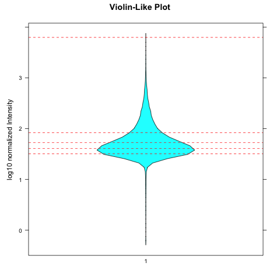
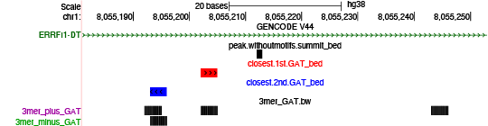
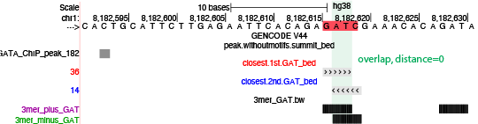
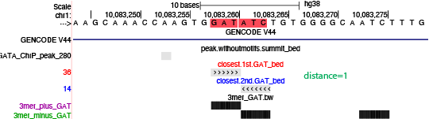
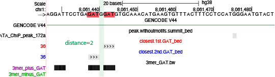
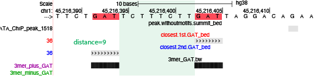
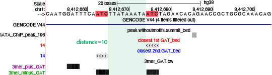

```{css, echo=FALSE}
body .main-container {
  max-width: 1200px !important;
  width: 1200px !important;
}
body {
  max-width: 1200px !important;
}

pre {
  max-height: 600px;
  overflow-y: auto;
}

pre[class] {
  max-height: 600px;
}
```

```{css, echo=FALSE}
.watch-out {
  background-color: lightcyan;
  border: 3px solid lightgrey;
  font-weight: bold;
}

.revision {
  background-color: #FFF4F2;
  border: 3px solid lightgrey;
  font-weight: bold;
}

.highlighted
{
   color:red;
}

.highlighted2
{
   color:blue;
}
```

```{r engine='R', eval=TRUE, echo=F}
knitr::opts_chunk$set(class.source = "watch-out")
```


# Install required packages
Install `bigWig` and `latticeExtra` package \
```{r engine='R', eval=TRUE, echo=T}
install.packages("devtools", quiet = TRUE)
library(devtools)
devtools::install_github('andrelmartins/bigWig',
              subdir='bigWig')
library(bigWig)

install.packages("latticeExtra", quiet = TRUE)
install.packages("DESeq2", quiet = TRUE)
```

Install `bedtools` \
```{r engine='bash', eval=F, echo=T}
/bin/bash -c "$(curl -fsSL https://raw.githubusercontent.com/Homebrew/install/HEAD/install.sh)"
brew install bedtools
```

# Dec 1st

## Goal: 

<span class="highlighted2">In previous analysis, we have showed that using a subset of GATA3-peak with known enriched GATA3 motif (GAT----ATC), we can successfully generate a composite profile with expected GAT to ATC 3mer distribution. --This is answering if we could build a pipeline to successfully demonstrate a known 3mer-3mer structure (two 3mer sites with fixed number of spacing in between).</span> \

<span class="highlighted2">With this analysis pipeline in hand, the real question we want to ask is:</span> \

<span class="highlighted2">**1) Is our GATA3 ChIP-seq library has predominant enrichment of such 3mer-3mer (GAT-GAT or GAT-ATC) structure compared to any other library that are not ChIPed by GATA3?**</span> \

<span class="highlighted2">**2) Is this GAT-GAT or GAT-ATC structure more common to be observed than any other 3mer combinations?**</span> \


## GATA3 ChIP peak without MEME/STREME found GATA3 motif

**Background**: we have GATA3 peak that have exhaustively searched for GATA3-like motif with MEME/STREME software. However, there are ~40% peak failed in finding a GATA3-like motif. Even for peak subset that have relatively high peak intensity (top5%), we still have ~20% peaks that MEME/STREME cannot find a GATA3-like motif. \

Generally, we would expect to find binding sequences within the peak region, so that the ChIPed transcription factor (in our case, GATA3) can bind to. This is even more true for peaks with relatively high intensity. \

Our question now became, is MEME/STREME limited in finding binding sequences patterned like GATA3 (that has fixed spacings between two 3mer)? Can we find the 3mer-3mer sequences in GATA3 peaks that do not contain the MEME/STREME found GATA3-like motifs? \


**peaks without 9 GATA3-motif** (that found by MEME/STREME) \

```{r engine='bash', eval=TRUE, echo=TRUE}
wc -l without_motifs_123456_789.bed
head -5 without_motifs_123456_789.bed
```
**Peak Intensity** \
In the above file, the last column is the peak intensity reported by MACS3. \
Notice that a peak with high MACS3-intensity is not necessarily a intense peak. There are two things we need to consider regarding peak intensities. The first is **peak region**; the second is **dynamic range**. Imaging a peak that is very intense but within a narrow range, the other peak is not so intense but can span its signals across a very long distance. We need to consider this region differences while calling any peak to be intense or not. \

First use `Sam Flag 0x3`(reads paired and mapped in proper pair) to calculate the **read depth** for each GATA library. \
```{r, engine='bash', eval=F, echo=TRUE}
# calculate the size factors 
module load samtools/1.12

dir=/home/FCAM/ssun/GATA3_ChIP_PRO_July2023/ChIP_final/sorted.bam_final/
for i in GATA
do
  echo $i
  > ${i}_header.txt
  > ${i}_reads.txt
  for j in ${dir}MCF7_dTAGGATA522*_${i}_*.sorted.bam
  do
    echo $j
    name=$(echo $j | awk -F $dir '{print $2}' | awk -F".sorted.bam" '{print $1}')
    echo $name | paste ${i}_header.txt - > ${i}_tmp.txt 
    mv ${i}_tmp.txt ${i}_header.txt
    reads=`samtools view -c -f 0x3 $j` #count the reads paired and mapped in proper pair
    echo $reads | paste ${i}_reads.txt - > ${i}_tmp.txt 
    mv ${i}_tmp.txt ${i}_reads.txt
  done  
  cat ${i}_header.txt ${i}_reads.txt > ${i}_tmp.txt
  mv ${i}_tmp.txt ${i}_reads.txt
  rm ${i}_header.txt
done 
```

```{r, engine='bash',eval=TRUE, echo=TRUE}
cat GATA_reads.txt
```
**bargraph** \
```{r, engine='R',eval=TRUE, echo=TRUE}
library(lattice)
df=as.data.frame(t(read.table("GATA_reads.txt", header=F)))
colnames(df)=c("library", "aligned_reads")
df$libraey=as.factor(df$library)
df$aligned_reads=as.numeric((df$aligned_reads))

barchart(aligned_reads ~ library, 
         data = df,
         ylim=c(0, max(df$aligned_reads)*1.04),
         col = "skyblue",
         scales = list(x = list(rot = 45)),
         xlab = "GATA3 ChIP library", 
         ylab = "concordantly aligned reads"
         )
```

This bar graph represents the read depth in each GATA3 ChIP-seq library. In the downstream analysis, we will need to use `DESeq2` to normalize the counts in each library with **size factor** to account for this **read depth difference**. \ 

**Get peak intensity within 400bp window with`Deseq2`** for peaks without MEME/STREME found motifs 12345678. \

load peaks without motif 12345678. \
```{r, engine='R',eval=TRUE, echo=TRUE}
a =  read.table('without_motifs_123456_789.bed', sep = "\t", header=FALSE) 
nrow(a)
head(a)
```
Increase the width to 400bp window. \
```{r, engine='R',eval=TRUE, echo=TRUE}
library(bigWig)
peak.region.400win=center.bed(a, upstreamWindow = 200, downstreamWindow = 200)
nrow(peak.region.400win)
head(peak.region.400win)
```


In the below chunk, we define a function to get raw counts from each sample/reps. This function uses `bed.region.bpQuery.bigWig` from `bigWig` package. It requires a bed region file that has the peak region that we want to analysis (right now we want to analyse peak without motifs 123456789); it also requires non-normalized, raw bigWig files (generated directly from `seqOutbias`) to allow `bed.region.bpQuery.bigWig` to query the counts information from. The output from this function will be: rows will be the same as bed file, columns will be each bigWig library, entries will be the raw counts. \

```{r, engine='R',eval=F, echo=TRUE}
#functions on github
source('https://raw.githubusercontent.com/mjg54/znf143_pro_seq_analysis/master/docs/ZNF143_functions.R')

#function
get.counts.interval <- function(df, path.to.bigWig, file.prefix = 'H') {
    vec.names = c()
    inten.df=data.frame(matrix(ncol = 0, nrow = nrow(df)))
    
    for (mod.bigWig in Sys.glob(file.path(path.to.bigWig, paste(file.prefix, "*.bigWig", sep ='')))) {
        factor.name = strsplit(strsplit(mod.bigWig, "/")[[1]][length(strsplit(mod.bigWig, "/")[[1]])], '.bigWig')[[1]][1]
        print(factor.name)
        vec.names = c(vec.names, factor.name)
        loaded.bw = load.bigWig(mod.bigWig)
        print(mod.bigWig)
        mod.inten = bed.region.bpQuery.bigWig(loaded.bw, df, abs.value = TRUE)
        inten.df = cbind(inten.df, mod.inten)
    }
    colnames(inten.df) = vec.names
    r.names = paste(df[,1], ':', df[,2], '-', df[,3], sep='')
    row.names(inten.df) = r.names
    return(inten.df)
}
```

We will first use the defined function to query raw counts from each non-normalized bigWig files of GATA ChIP-seq use peak region info loaded before (data frame "peak.region.400win"). \
```{r, engine='R', eval=F, echo=TRUE}
library(bigWig)
#non-normalized counts
GATA.counts.df= get.counts.interval(peak.region.400win, "/home/FCAM/ssun/GATA3_ChIP_PRO_July2023/ChIP_final/bigWigs/Seqoutbias_bw","MCF") #25 libraries
#nrow(peak.region.400win)
#[1] 38980
#nrow(GATA.counts.df)
#[1] 38980
#head(GATA.counts.df)
#colnames(GATA.counts.df)


GATA.analysis.regions=GATA.counts.df[,grepl("_GATA_",colnames(GATA.counts.df))] # get non-normalized counts from "GATA" libraries
#colnames(GATA.analysis.regions)
#[1] "MCF7_dTAGGATA522_GATA_CC_rep1" "MCF7_dTAGGATA522_GATA_CC_rep2"
#[3] "MCF7_dTAGGATA522_GATA_CC_rep3" "MCF7_dTAGGATA522_GATA_CE_rep1"
#[5] "MCF7_dTAGGATA522_GATA_CE_rep2" "MCF7_dTAGGATA522_GATA_CE_rep3"
#[7] "MCF7_dTAGGATA522_GATA_dE_rep1" "MCF7_dTAGGATA522_GATA_dE_rep2"
#[9] "MCF7_dTAGGATA522_GATA_dE_rep3"
identical(rownames(GATA.analysis.regions),rownames(GATA.counts.df)) # [1] TRUE
```

Then we use the `DESeq2` package to make a counts matrix (`DESeqDataSetFromMatrix`) and calculate size factors for each library (`estimateSizeFactorsForMatrix`) use the previously calculated read depth for each library ("GATA_reads.txt"); We use this size factor to normalize the counts (`sizeFactors`). \
Then we use `rowMeans` to average the normalized counts for the three GATA_CC reps, and save it as "peak.intensities"; this normalized counts now can be use to determine if a peak is intense or not. \

```{r, engine='R',eval=F, echo=TRUE}
library(DESeq2)
sample.conditions = factor(sapply(strsplit(colnames(GATA.analysis.regions), '_rep'), '[', 1))
#[1] MCF7_dTAGGATA522_GATA_CC MCF7_dTAGGATA522_GATA_CC MCF7_dTAGGATA522_GATA_CC
#[4] MCF7_dTAGGATA522_GATA_CE MCF7_dTAGGATA522_GATA_CE MCF7_dTAGGATA522_GATA_CE
#[7] MCF7_dTAGGATA522_GATA_dE MCF7_dTAGGATA522_GATA_dE MCF7_dTAGGATA522_GATA_dE
#3 Levels: MCF7_dTAGGATA522_GATA_CC ... MCF7_dTAGGATA522_GATA_dE
deseq.counts.table = DESeqDataSetFromMatrix(countData = GATA.analysis.regions, # DESeqDataSet needs countData to be non-negative integers; non-normalized counts are integer, normalized signals has decimals.
                colData = as.data.frame(sample.conditions),
                design = ~ sample.conditions)


GATA.SF <- read.table("GATA_reads.txt", sep = '\t', header = TRUE)[,-1] # GATA size factors from read depth
#MCF7_dTAGGATA522_GATA_CC_rep1 MCF7_dTAGGATA522_GATA_CC_rep2
#                      33948616                      32585396
#  MCF7_dTAGGATA522_GATA_CC_rep3 MCF7_dTAGGATA522_GATA_CE_rep1
#                      34475586                      51112588
#  MCF7_dTAGGATA522_GATA_CE_rep2 MCF7_dTAGGATA522_GATA_CE_rep3
#                     147834968                     136838760
#  MCF7_dTAGGATA522_GATA_dE_rep1 MCF7_dTAGGATA522_GATA_dE_rep2
#                      34136142                     136271358
#  MCF7_dTAGGATA522_GATA_dE_rep3
#                      85665512
GATA.size.factors = estimateSizeFactorsForMatrix(GATA.SF) # read depth transformed to size factor 
#MCF7_dTAGGATA522_GATA_CC_rep1 MCF7_dTAGGATA522_GATA_CC_rep2 
#                    0.5385594                     0.5169334 
#MCF7_dTAGGATA522_GATA_CC_rep3 MCF7_dTAGGATA522_GATA_CE_rep1 
#                    0.5469193                     0.8108480 
#MCF7_dTAGGATA522_GATA_CE_rep2 MCF7_dTAGGATA522_GATA_CE_rep3 
#                    2.3452478                     2.1708044 
#MCF7_dTAGGATA522_GATA_dE_rep1 MCF7_dTAGGATA522_GATA_dE_rep2 
#                    0.5415343                     2.1618032 
#MCF7_dTAGGATA522_GATA_dE_rep3 
#                    1.3589941


                                       
sizeFactors(deseq.counts.table) <- GATA.size.factors # assign to each column of the count matrix (deseq.counts.table) the size factor to bring each column to a common scale
dds <- DESeq(deseq.counts.table)
normalized.counts.GATA3 = counts(dds, normalized=TRUE)
head(normalized.counts.GATA3)
peak.intensities = rowMeans(normalized.counts.GATA3[,1:3]) # we want to get the average read counts for CC groups
names(peak.intensities) = rownames(normalized.counts.GATA3)
save.image('231205_GATA3_ChIP_deseq.Rdata') 
```

**Subset peaks without the 8 GATA3-motifs, in top20% intensity quantile** \

We can load the saved Rdata and look at each dataframe. \
```{r engine='R', eval=TRUE, echo=TRUE}
load('231205_GATA3_ChIP_deseq.Rdata')
```

Read this .bed file into R, and use `DeSeq2` to count read size and parse into different quantile
```{r, engine='R', eval=TRUE, echo=TRUE}
head(peak.intensities)
quantile(peak.intensities, probs = seq(.25, 1.00, by = .25))
quantile(peak.intensities, probs = seq(.20, 1.00, by = .20))
```
**violin plot** \

This violin plot is showing the distribution of peak intensity (log10). \

```{r, engine='R', eval=TRUE, echo=TRUE}
library(lattice)
log10quantiles <- quantile(log(abs(peak.intensities), base = 10), probs = seq(.20, 1.00, by = .20))

png('violinplot_GATA3_ChIP_peak_normalized_intensity.png')
print(bwplot(log(abs(peak.intensities), base = 10) ~ factor("1"), 
       main = "Violin-Like Plot",
       panel = function(x, ...) {
         panel.violin(x, ...)
         panel.abline(h = log10quantiles, col = "red", lty = 2)
       },
       xlab = "", ylab = "log10 normalized Intensity")
)
```

```{r  fig.align = "center", out.width="80%", out.height="80%", echo=F, fig.align = "center", fig.cap="normalized GATA3 ChIP peak intensity"}
library(knitr)
 
```

This violin plot represents the distribution and probability density of **(log10) normalized peak intensity** (for peak without motif 1~9). Each red dotted line indicates the quantile cutoff of 20%, which can help us to visualize the peak intensity distribution **across different quantile**. \ 


Parse peaks into 5 intensity quantile by 20%. \
```{r, engine='R', eval=TRUE, echo=TRUE}
chr = sapply(strsplit(names(peak.intensities), ":"), "[", 1)
rnge = sapply(strsplit(names(peak.intensities), ":"), "[", 2)
start = as.numeric(sapply(strsplit(rnge, "-"), "[", 1)) + 200
end = as.numeric(sapply(strsplit(rnge, "-"), "[", 2)) - 200

quantile(peak.intensities, probs = seq(.20, 1.00, by = .20))


# 1bp summit quantile file
j =0 
q=seq(.20, 1.00, by = .20)
count=0
for (i in quantile(peak.intensities, probs = seq(.20, 1.00, by = .20))){
count = count +1

write.table(file = paste0('quantile', as.character(q[count]), '_summits.bed'), data.frame(chr[peak.intensities > j & peak.intensities <= i], start[peak.intensities > j & peak.intensities <= i], end[peak.intensities > j & peak.intensities <= i], peak.intensities[peak.intensities > j & peak.intensities <= i]), sep = '\t', quote=FALSE, col.names=FALSE, row.names=FALSE )
j = i
}
```

```{r, engine='bash', eval=TRUE, echo=TRUE}
for i in *quantile*.bed
do
wc -l $i
done
```


Now working on the top 20% quantile peaks: \
```{r engine='bash', eval=F, echo=TRUE}
wc -l quantile1_summits.bed
head quantile1_summits.bed
```

### Find closest GAT to peak
In this section, we use `bedtools closestBed` (refer to: https://bedtools.readthedocs.io/en/latest/content/tools/closest.html) to find the closest GAT to each provided peak summit. \
Input: \
`-a` is the sorted peak summit file (centered 1bp); \
`-b` is the sorted, and concatenated GAT coordinates file (both plus and minus); \

**Input1 -a**: peak: quantile1_summits.bed : peaks without motif 123456789, top20% intensity \

```{r engine='bash', eval=F, echo=TRUE}
dir=/home/FCAM/ssun/GATA3_ChIP_PRO_July2023/ChIP_final/overrep_3mer/peak_without_123456789/
head ${dir}quantile1_summits.bed
```

**Input2 -b**: GAT coordinates on full hg38 use read size==30 \
```{r engine='bash', eval=F, echo=TRUE}
dir=/labs/Guertin/siyu/Sathyan_GATA3_ChIP_pool1_pool2/overrep_3mer/hg38_full_kmer3_rs30/seqdump/
head ${dir}hg38.3.3.3minus.14_GAT.bed  
head ${dir}hg38.3.3.3plus.36_GAT.bed

head ${dir}hg38.3.3.3minus.36_ATC.bed  
head ${dir}hg38.3.3.3plus.14_ATC.bed
```

These files are very large, here are the headed version: \
```{r engine='bash', eval=TRUE, echo=TRUE}
head head2000_hg38.3.3.3plus.36_GAT.bed
echo ""
head head2000_hg38.3.3.3minus.14_GAT.bed
echo ""
head head2000_hg38.3.3.3plus.14_ATC.bed
echo ""
head head2000_hg38.3.3.3minus.36_ATC.bed

```

we will concatanate the plus and minus 3mer file together. \
```{r engine='bash', eval=F, echo=TRUE}
cat ${dir}hg38.3.3.3minus.14_GAT.bed ${dir}hg38.3.3.3plus.36_GAT.bed > hg38.3.3.3.30_plus_minus_GAT.bed
cat ${dir}hg38.3.3.3minus.36_ATC.bed ${dir}hg38.3.3.3plus.14_ATC.bed > hg38.3.3.3.30_plus_minus_ATC.bed

wc -l ${dir}hg38.3.3.3minus.14_GAT.bed #32096009
wc -l ${dir}hg38.3.3.3plus.36_GAT.bed #32147038
wc -l hg38.3.3.3.30_plus_minus_GAT.bed #64243047
echo ""
wc -l ${dir}hg38.3.3.3minus.36_ATC.bed #32081985
wc -l ${dir}hg38.3.3.3plus.14_ATC.bed #32035017
wc -l hg38.3.3.3.30_plus_minus_ATC.bed #64117002
```


**load files** \

load files contains selected ChIP peak summit info \
```{r engine='R', eval=TRUE, echo=TRUE}
chip.peak.summit=read.table("quantile1_summits.bed", header=FALSE)
nrow(chip.peak.summit)
head(chip.peak.summit)
```
load files contains 3mer coordinates info \
```{r engine='R', eval=F, echo=TRUE}
#concatenate the plus and minus file together
all.GAT.file=read.table(file = "hg38.3.3.3.30_plus_minus_GAT.bed", sep="\t", header=FALSE)
head(all.GAT.file)
#    V1    V2    V3 V4 V5 V6  V7
#1 chr1 11145 11148 14 14  - GAT
#2 chr1 11160 11163 14 14  - GAT
#3 chr1 11576 11579 14 14  - GAT
#4 chr1 13315 13318 14 14  - GAT
#5 chr1 19797 19800 14 14  - GAT
#6 chr1 27023 27026 14 14  - GAT
tail(all.GAT.file)
#                             V1    V2    V3 V4 V5 V6  V7
#64243042 chrY_KI270740v1_random 33028 33031 36 36  + GAT
#64243043 chrY_KI270740v1_random 35533 35536 36 36  + GAT
#64243044 chrY_KI270740v1_random 35543 35546 36 36  + GAT
#64243045 chrY_KI270740v1_random 35912 35915 36 36  + GAT
#64243046 chrY_KI270740v1_random 36540 36543 36 36  + GAT
#64243047 chrY_KI270740v1_random 36913 36916 36 36  + GAT

nrow(all.GAT.file)
#[1] 64243047
```

**bedtools closestBed** \
The below function will sort input bed1 and bed2 first, then run `bedtools closestBed` between bed1 and bed2. \
```{r engine='R', eval=F, echo=TRUE}
# define function 
bedTools.closest <- function(functionstring="/home/FCAM/ssun/packages/bedtools2/bin/closestBed",bed1,bed2,opt.string="") {
  
  options(scipen =99) # not use scientific notation when writing out
  
  #write bed formatted data.frames to tempfile
  write.table(bed1,file= 'a.file.bed', quote=F,sep="\t",col.names=F,row.names=F)
  write.table(bed2,file= 'b.file.bed', quote=F,sep="\t",col.names=F,row.names=F)
  
  # create the command string and call the command using system()
  # the command sort a and b file by coordinates
  command1=paste('sort -k1,1 -k2,2n', 'a.file.bed', '> a.file.sorted.bed')
  cat(command1,"\n") #sort -k1,1 -k2,2n a.file.bed > a.file.sorted.bed
  try(system(command1))
  command2=paste('sort -k1,1 -k2,2n', 'b.file.bed', '> b.file.sorted.bed')
  cat(command2,"\n")
  try(system(command2))
  
  # the command call closestBed on bed1 and bed2
  command=paste(functionstring, opt.string,"-a",'a.file.sorted.bed',"-b",'b.file.sorted.bed',">",'out.file.bed',sep=" ")
  cat(command,"\n")
  try(system(command))
  
  res=read.table('out.file.bed',header=F, comment.char='')
  
  # remove intermediate files
  command3=paste('rm', 'a.file.bed', 'b.file.bed', 'a.file.sorted.bed', 'b.file.sorted.bed', 'out.file.bed')
  cat(command3,"\n")
  try(system(command3))
  
  colnames(res) = c(colnames(bed1), colnames(bed2), 'dis' )
  return(res)
}
```

Parameter `-d` will report the distance from the closest GAT to the peak summit. \
Parameter `-t last` or `-t first` will only report either the last or the first entry in bed2 file if tied distance occurred. \
Here we choose to use `-t first` to report the first coordinates when tie occurred. \

Find the closest GAT to peak summit regardless of GAT strandedness \
```{r engine='R', eval=F, echo=TRUE}
all.distance=bedTools.closest(bed1 = chip.peak.summit[,1:3], bed2 = all.GAT.file, opt.string = '-d -t first')
write.table(all.distance,file= 'all.distance.bed', quote=F,sep="\t",col.names=F,row.names=F)
save.image('231205_GATA3_ChIP_clsestbed.Rdata') 
```


In this "all.distance' data frame, V1 to V3 are peak summit coordinates, V4 to V9 are `closestBed` reported **closest motif** to each peak summit. The last column (V11) is the distance from closest motif to peak summit. \
```{r engine='R', eval=TRUE, echo=TRUE}
all.distance=read.table('all.distance.bed',header=F, comment.char='')
head(all.distance)
```


**coherence check 1**: the number of the closest minus GAT is comparable to the number of the closest plus GAT. \

```{r engine='R', eval=TRUE, echo=TRUE}
nrow(all.distance)
nrow(all.distance[all.distance$V9=="+",])
nrow(all.distance[all.distance$V9=="-",])
```

**coherence check 2**: Since we have use `-t first` to take care of the tie, now we have equal number of unique peak with their closest plus or minus or both GAT. \
```{r engine='R', eval=TRUE, echo=TRUE}
nrow(chip.peak.summit) # there are 8571 unique peak 
nrow(all.distance)  
```


### making composite profile

## A unioin peak set as control

To answer the first big question, we also need to prepare a control peak set. We want to know the 3mer distribution of GAT/ATC in this random peak set, and compare it with our GATA3 ChIP peaks. \

Here we are using the ENCODE union DNase HS sites: \
Reference: Amaral, M. L., Erikson, G. A., & Shokhirev, M. N. (2018). BART: bioinformatics array research tool. BMC bioinformatics, 19(1), 1-6. \
These union DHS regions represent the whole repertoire of regulatory elements in the human genome. These are regions of chromatin that are sensitive to cleavage by the DNase. \
<!--
The full .bed file contains 2723010 regulatory regions. The below command uses a combination of `awk`, `sort`, and `shuf` in Linux to:  \
Extracts unique chromosome names from the first column ($1) of input_regions.bed. \
Iterates through each chromosome using a while loop. \
For each chromosome, it uses `grep` to filter the peaks by chromosome name. \
Then, it uses `shuf` to randomly select a specified number of peaks (`-n <desired_number_of_peaks>`) from each chromosome and appends them to randomized_subset.bed. \


Here I am using this command to randomly pick single region from each chromosome to make this randomized_subset.bed. \
```{r engine='bash', eval=F, echo=TRUE}
awk '{print $1}' hg38_unionDHS_fc4_50merge.bed | sort -u | while read chrom; do
    grep "^$chrom" hg38_unionDHS_fc4_50merge.bed | shuf -n 1 >> hg38_unionDHS_fc4_50merge_randomized_subset.bed
done
```

The file has information of "chr-start-end-index-signal-strand" \
```{r engine='bash', eval=F, echo=TRUE}
cat hg38_unionDHS_fc4_50merge_randomized_subset.bed 
```
-->

**remove GATA3 motifs with `MAST`** \

The full .bed file contains 2723010 regulatory regions. To make this file a proper control for our peak set, we use `MAST` to remove  regulatory regions that contains GATA3-like motif 123456789 (use same p-value stringency). \

We have 9 motifs that found by MEME/STREME software. \

```{r engine='bash', eval=T, echo=TRUE}
ls GATA3_MEME_STREME_motifs/
#cat GATA3_MEME_STREME_motifs/meme_1.txt
```
First convert regulatory region file from .bed to .fasta. \

```{r engine='bash', eval=F, echo=TRUE}
module load bedtools
genome=/home/FCAM/ssun/Genome/hg38.fa

fastaFromBed -fi $genome -bed hg38_unionDHS_fc4_50merge.bed -fo hg38_unionDHS_fc4_50merge.fasta
```

MEME (`mast` uses default p-value: 0.0001) \
```{r engine='bash', eval=F, echo=TRUE}
module load meme/5.4.1
module load R/4.1.2
module load bedtools
genome=/home/FCAM/ssun/Genome/hg38.fa

#round1
mast -hit_list -best ../GATA3_MEME_STREME_motifs/meme_1.txt hg38_unionDHS_fc4_50merge.fasta > mast_GATA3_PSWM_in_unionDHS_round1.txt
Rscript /home/FCAM/ssun/scripts/parse_mast_to_coordinates.R mast_GATA3_PSWM_in_unionDHS_round1.txt
wc -l mast_GATA3_PSWM_in_unionDHS_round1.bed #34324
intersectBed -v -a hg38_unionDHS_fc4_50merge.bed -b mast_GATA3_PSWM_in_unionDHS_round1.bed > unionDHS_without_motifs_1.bed
wc -l unionDHS_without_motifs_1.bed #2688686

#round2
fastaFromBed -fi $genome -bed unionDHS_without_motifs_1.bed -fo unionDHS_without_motifs_1.fasta
mast -hit_list -best ../GATA3_MEME_STREME_motifs/meme_2.txt unionDHS_without_motifs_1.fasta > mast_GATA3_PSWM_in_unionDHS_round2.txt
Rscript /home/FCAM/ssun/scripts/parse_mast_to_coordinates.R mast_GATA3_PSWM_in_unionDHS_round2.txt
wc -l mast_GATA3_PSWM_in_unionDHS_round2.bed #38803
intersectBed -v -a unionDHS_without_motifs_1.bed -b mast_GATA3_PSWM_in_unionDHS_round2.bed > unionDHS_without_motifs_12.bed
wc -l unionDHS_without_motifs_12.bed #2649883

#round3
fastaFromBed -fi $genome -bed unionDHS_without_motifs_12.bed -fo unionDHS_without_motifs_12.fasta
mast -hit_list -best ../GATA3_MEME_STREME_motifs/meme_3.txt unionDHS_without_motifs_12.fasta > mast_GATA3_PSWM_in_unionDHS_round3.txt
Rscript /home/FCAM/ssun/scripts/parse_mast_to_coordinates.R mast_GATA3_PSWM_in_unionDHS_round3.txt
wc -l mast_GATA3_PSWM_in_unionDHS_round3.bed #35361
intersectBed -v -a unionDHS_without_motifs_12.bed -b mast_GATA3_PSWM_in_unionDHS_round3.bed > unionDHS_without_motifs_123.bed
wc -l unionDHS_without_motifs_123.bed #2614522

#round4
fastaFromBed -fi $genome -bed unionDHS_without_motifs_123.bed -fo unionDHS_without_motifs_123.fasta
mast -hit_list -best ../GATA3_MEME_STREME_motifs/AGATNDWNAGATARN_meme.txt_meme_4.txt unionDHS_without_motifs_123.fasta > mast_GATA3_PSWM_in_unionDHS_round4.txt 
Rscript /home/FCAM/ssun/scripts/parse_mast_to_coordinates.R mast_GATA3_PSWM_in_unionDHS_round4.txt
wc -l mast_GATA3_PSWM_in_unionDHS_round4.bed #40994
intersectBed -v -a unionDHS_without_motifs_123.bed -b mast_GATA3_PSWM_in_unionDHS_round4.bed > unionDHS_without_motifs_1234.bed
wc -l unionDHS_without_motifs_1234.bed #2573528

#round5
fastaFromBed -fi $genome -bed unionDHS_without_motifs_1234.bed -fo unionDHS_without_motifs_1234.fasta
mast -hit_list -best ../GATA3_MEME_STREME_motifs/BTTATCWGATB_meme_5.txt_meme.txt unionDHS_without_motifs_1234.fasta > mast_GATA3_PSWM_in_unionDHS_round5.txt
Rscript /home/FCAM/ssun/scripts/parse_mast_to_coordinates.R mast_GATA3_PSWM_in_unionDHS_round5.txt
wc -l mast_GATA3_PSWM_in_unionDHS_round5.bed #29331
intersectBed -v -a unionDHS_without_motifs_1234.bed -b mast_GATA3_PSWM_in_unionDHS_round5.bed > unionDHS_without_motifs_12345.bed
wc -l unionDHS_without_motifs_12345.bed #2544197


#round6
fastaFromBed -fi $genome -bed unionDHS_without_motifs_12345.bed -fo unionDHS_without_motifs_12345.fasta
mast -hit_list -best ../GATA3_MEME_STREME_motifs/WGATBDHRVAGATAA_meme.txt_meme_6.txt unionDHS_without_motifs_12345.fasta > mast_GATA3_PSWM_in_unionDHS_round6.txt
Rscript /home/FCAM/ssun/scripts/parse_mast_to_coordinates.R mast_GATA3_PSWM_in_unionDHS_round6.txt
wc -l mast_GATA3_PSWM_in_unionDHS_round6.bed #42590 
intersectBed -v -a unionDHS_without_motifs_12345.bed -b mast_GATA3_PSWM_in_unionDHS_round6.bed > unionDHS_without_motifs_123456.bed 
wc -l unionDHS_without_motifs_123456.bed #2501607
```

STREME (`mast` uses p-value of 0.0005) \
```{r engine='bash', eval=F, echo=TRUE}
#round7
fastaFromBed -fi $genome -bed unionDHS_without_motifs_123456.bed -fo unionDHS_without_motifs_123456.fasta
mast -mt 0.0005 -hit_list -best ../GATA3_MEME_STREME_motifs/AGATAAM_streme.txt unionDHS_without_motifs_123456.fasta > mast_GATA3_PSWM_in_unionDHS_round7.txt
Rscript /home/FCAM/ssun/scripts/parse_mast_to_coordinates.R mast_GATA3_PSWM_in_unionDHS_round7.txt
wc -l mast_GATA3_PSWM_in_unionDHS_round7.bed #163724
intersectBed -v -a unionDHS_without_motifs_123456.bed -b mast_GATA3_PSWM_in_unionDHS_round7.bed > unionDHS_without_motifs_123456_7.bed
wc -l unionDHS_without_motifs_123456_7.bed #2337883


#round8
fastaFromBed -fi $genome -bed unionDHS_without_motifs_123456_7.bed -fo unionDHS_without_motifs_123456_7.fasta
mast -mt 0.0005 -hit_list -best ../GATA3_MEME_STREME_motifs/TGATAA_streme.txt unionDHS_without_motifs_123456_7.fasta > mast_GATA3_PSWM_in_unionDHS_round8.txt 
Rscript /home/FCAM/ssun/scripts/parse_mast_to_coordinates.R mast_GATA3_PSWM_in_unionDHS_round8.txt
wc -l mast_GATA3_PSWM_in_unionDHS_round8.bed #101810
intersectBed -v -a unionDHS_without_motifs_123456_7.bed -b mast_GATA3_PSWM_in_unionDHS_round8.bed > unionDHS_without_motifs_123456_78.bed 
wc -l unionDHS_without_motifs_123456_78.bed  #2236073

#round9
fastaFromBed -fi $genome -bed unionDHS_without_motifs_123456_78.bed -fo unionDHS_without_motifs_123456_78.fasta
mast -mt 0.0005 -hit_list -best ../GATA3_MEME_STREME_motifs/AGATDNHATCT_streme.txt unionDHS_without_motifs_123456_78.fasta > mast_GATA3_PSWM_in_unionDHS_round9.txt
Rscript /home/FCAM/ssun/scripts/parse_mast_to_coordinates.R mast_GATA3_PSWM_in_unionDHS_round9.txt
wc -l mast_GATA3_PSWM_in_unionDHS_round9.bed #61162
intersectBed -v -a unionDHS_without_motifs_123456_78.bed -b mast_GATA3_PSWM_in_unionDHS_round9.bed > unionDHS_without_motifs_123456_789.bed
wc -l unionDHS_without_motifs_123456_789.bed #2174911
```

**Randomly subset the union regulatory region** \
After the removal of the 9 GATA3 motifs with `mast`, the unionDHS peak set now remains 2174911 regions (originally 2723010, removed ~20% regions). \

Here I am using `shuf` to randomly select 7800 regulatory region to match with the GATA peak subset (quantile1: 7796 peaks) I am going to compare with. \
```{r engine='bash', eval=F, echo=TRUE}
shuf -n 7800 unionDHS_without_motifs_123456_789.bed > random_7800_unionDHS_without_motifs_123456_789.bed 
```

```{r engine='bash', eval=TRUE, echo=TRUE}
wc -l random_7800_unionDHS_without_motifs_123456_789.bed  
head random_7800_unionDHS_without_motifs_123456_789.bed  
```

Read the file in and use the center as regulatory region summit: \
```{r engine='R', eval=TRUE, echo=TRUE}
library(bigWig)
chip.peak=read.table("random_7800_unionDHS_without_motifs_123456_789.bed", header=FALSE)
nrow(chip.peak)
head(chip.peak)

chip.peak.summit=center.bed(chip.peak, upstreamWindow=0, downstreamWindow=0)
nrow(chip.peak.summit)
head(chip.peak.summit)
```
find the closest GAT to summit of unionDHS with `closestBed`. \
```{r engine='bash', eval=F, echo=TRUE}
ctrl.distance=bedTools.closest(bed1 = chip.peak.summit[,1:3], bed2 = all.GAT.file, opt.string = '-d -t first')
write.table(ctrl.distance,file= 'ctrl.distance.bed', quote=F,sep="\t",col.names=F,row.names=F)
save.image('231205_GATA3_ChIP_clsestbed2.Rdata') 
```

In this "ctrl.distance' data frame, V1 to V3 are peak summit coordinates, V4 to V9 are `closestBed` reported **closest motif** to each peak summit. The last column (V11) is the distance from closest motif to peak summit. \
```{r engine='R', eval=TRUE, echo=TRUE}
ctrl.distance=read.table('ctrl.distance.bed',header=F, comment.char='')
head(ctrl.distance)
nrow(ctrl.distance)
nrow(ctrl.distance[ctrl.distance$V9=="+",])
nrow(ctrl.distance[ctrl.distance$V9=="-",])
```

### Cumulative distribution function (CDF) plot

```{r engine='R', eval=TRUE, echo=TRUE}
all.distance=read.table('all.distance.bed',header=F, comment.char='')
ctrl.distance=read.table('ctrl.distance.bed',header=F, comment.char='')
head(all.distance)
head(ctrl.distance)

nrow(all.distance)
nrow(ctrl.distance)
```

```{r engine='R', eval=TRUE, echo=TRUE}
df.chip = cbind(all.distance[,c(1:3, 11)], "GATA3_peak")
df.ctrl = cbind(ctrl.distance[,c(1:3, 11)], "ctrl")
colnames(df.chip) = c(colnames(all.distance)[1:3], "dis", "status")
colnames(df.ctrl) = c(colnames(ctrl.distance)[1:3], "dis", "status")
head(df.chip)
head(df.ctrl)
```

```{r engine='R', eval=TRUE, echo=TRUE}
df.all = rbind(df.chip, df.ctrl)
df.all$status = factor(df.all$status, levels = c("GATA3_peak", "ctrl"))
head(df.all)
nrow(df.all)
```
**plot CDF** \

<!--
```{r engine='R', eval=TRUE, echo=TRUE}
second_min <- function(vec) {
  # Find the first minimum
  first_min_index <- which.min(vec)
  
  # Remove the first minimum value
  vec_without_first_min <- vec[-first_min_index]
  
  # Find the index of the minimum in the updated vector
  second_min_index <- which.min(vec_without_first_min)
  
  # Return the second minimum value
  return(vec_without_first_min[second_min_index])
}
```
-->
We are plotting the cumulative distribution function to evaluate whether a 3mer GAT are closer to the summit of GATA3 ChIP peaks (that might use 3mer GAT as a binding sequence) than they are to the summit of a random subset of union DHS regions (ctrl). \


We can also determine the distance at which the CDFs' difference between GATA3 peak set and ctrl peak set reach the plateaus (where CDF traces became parallel or converging). \

```{r engine='R', eval=TRUE, echo=TRUE}
# Specify categories to compare within df.all
match = ecdf(abs(df.all$dis)[df.all$status == 'ctrl'])
rep = ecdf(abs(df.all$dis)[df.all$status == 'GATA3_peak'])
match.y = seq(0, 7800, by=1) # creating indices
rep.y = seq(0, 7800, by=1)

spl = smooth.spline(rep.y, rep(rep.y) - match(match.y))
pred = predict(spl)
pred1 = predict(spl, deriv=1)

print('The distance that CDFs are parallel or converge:')
print(rep.y[min(which(pred1$y<=0)) - 1]) # 15; 

# Plot graph depicting the distance determination
plot(rep.y, rep(rep.y) - match(match.y),
     xlim = c(0,60),
     cex=0.7,
     xlab = '3mer-GAT Distance from peak summit (bp)',
     ylab = 'GATA3 peak CDF - ctrl(unionDHS) CDF')
     abline(v = rep.y[min(which(pred1$y<=0)) - 1], col =2, lty =2)
      lines(pred[[1]], pred[[2]], col = 'blue')

# this is the same plot as above but with a longer x-axis limit
plot(rep.y, rep(rep.y) - match(match.y),
     xlim = c(0,300),
     cex=0.7,
     xlab = '3mer-GAT Distance from peak summit (bp)',
     ylab = 'GATA3 peak CDF - ctrl(unionDHS) CDF')
     abline(v = rep.y[min(which(pred1$y<=0)) - 1], col =2, lty =2)
      lines(pred[[1]], pred[[2]], col = 'blue')

```
```{r engine='R', eval=F, echo=F}
pdf('empirical_distance_determination_20_GATA_wo_motifs.pdf', width=5,height=5)
plot(rep.y, rep(rep.y) - match(match.y),
     xlim = c(0,60),
     cex=0.7,
     xlab = '3mer-GAT Distance from peak summit (bp)',
     ylab = 'GATA3 peak CDF - ctrl(unionDHS) CDF')
     abline(v = rep.y[min(which(pred1$y<=0)) - 1], col =2, lty =2)
      lines(pred[[1]], pred[[2]], col = 'blue')
dev.off()
```


The above plot plots CDFs' difference between GATA3 peak set and ctrl peak set. At 15bp, two CDFs start to be parallel/converged. \


```{r engine='R', eval=TRUE, echo=TRUE}
library(lattice)
library(latticeExtra)

ecdfplot(~log(abs(dis), base = 10), groups = status, data = df.all,
         auto.key = list(space = "right", lines=TRUE, points=FALSE, cex = 1),
         col =  c("#ce228e", "grey60"),
         aspect = 1,
        #xlim = c(0, 50000),
         scales=list(relation="free",alternating=c(1,1,1,1)),
         ylab = 'Cumulative Distribution Function',
         xlab = expression('log'[10]~'3mer-GAT Distance from peak summit'),
                                        #index.cond = list(c(2,1)),
         between=list(y=1.0),
         type = 'a',
         xlim = c(0,3.5),
         lwd=2,
         lty=c(1),
         par.settings = list(superpose.line = list(col =  c("#ce228e", "grey60"), lwd=3), strip.background=list(col="grey85")),
         panel = function(...) {
             panel.abline(v= 1.176, lty =2)
             panel.ecdfplot(...)
         })
    
```

The above cumulative distribution function (PDF) plot is showing the distance between 3mer-GAT to the summit of GATA3 ChIP peak (red), or summit of the ctrl peak set (gray, random subset from the union DHS regions). \

The left-shift of the red curve suggests that the 3mer-GAT are closer to the GATA3 ChIP peak set then the ctrl peak set. \

The vertical dashed line indicates at which distance (log10 of 15bp) the two CDF traces became parallel. This suggests that the 3mer-GAT often binds within 15 bp of the GATA3 peak summit. \


```{r engine='R', eval=TRUE, echo=TRUE}
ecdfplot(~dis, groups = status, data = df.all,
         auto.key = list(space = "right", lines=TRUE, points=FALSE, cex = 1),
         col =  c("#ce228e", "grey60"),
         aspect = 1,
        #xlim = c(0, 50000),
         scales=list(relation="free",alternating=c(1,1,1,1)),
         ylab = 'Cumulative Distribution Function',
         xlab = '3mer-GAT Distance (bp) from peak summit',
                                        #index.cond = list(c(2,1)),
         between=list(y=1.0),
         type = 'a',
         xlim = c(0,100),
         lwd=2,
         lty=c(1),
         par.settings = list(superpose.line = list(col =  c("#ce228e", "grey60"), lwd=3), strip.background=list(col="grey85")),
         panel = function(...) {
             panel.abline(v= 15, lty =2)
             panel.ecdfplot(...)
         })
```

The difference between this CDF with the previous one is: The above one is plotting actual distance in bp, the previous one is plotting log10 of the distance. The two CDF plots are essentially communicating the same thing. \


## Second closest GAT

**Expectation**: see spike of the second GAT at fixed position. \

**Plan**: \

-Input1: all GAT coordinates .bed file \
-Input2: closest GAT (to GATA3 peak summit -without GATA3-like motifs 123456789) coordinates .bed file \
-Input3: closest GAT (to unionDHS summit) coordinates .bed file \


First, use `bedtools subtract` to subtract input 1 and 2 (or in ctrl set: subtract input 1 and 3), the output will be GAT coordinates without the 1st closest GAT. \
Then, \
Use `bedtools closestBed` to find the **second closest GAT** to the **1st closest GAT** use the output from `bedtools subtract`. \
Plot PDF plot of distances between 1st and 2nd GAT. \

#### all GAT coordinates .bed file
**Input1** \
This is the 3mer GAT coordinates on hg38 genome (both plus and minus strand) generated with `SeqOutbias` use read size==30. \

```{r engine='bash', eval=F, echo=TRUE}
wc -l hg38.3.3.3.30_plus_minus_GAT.bed #64243047
head -5 hg38.3.3.3.30_plus_minus_GAT.bed
#chr1	11145	11148	14	14	-	GAT
#chr1	11160	11163	14	14	-	GAT
#chr1	11576	11579	14	14	-	GAT
#chr1	13315	13318	14	14	-	GAT
#chr1	19797	19800	14	14	-	GAT
```

#### GATA3 peak subset (without the 9 GATA3-like motifs)   

**Input2** \
This `all.distance.bed` file is searching for closest 3mer GAT to the peak summit (top 20% intense peak without motif 123456789). \
Use `awk` to select 3mer-GAT's coordinates from the file. \

```{r engine='bash', eval=F, echo=TRUE}
wc -l all.distance.bed #7796
head -5 all.distance.bed
#chr1	5598187	5598188	chr1	5598164	5598167	36	36	+	GAT	21
#chr1	8017660	8017661	chr1	8017663	8017666	36	36	+	GAT	3
#chr1	8020178	8020179	chr1	8020170	8020173	14	14	-	GAT	6
#chr1	8055212	8055213	chr1	8055202	8055205	36	36	+	GAT	8
#chr1	8061475	8061476	chr1	8061441	8061444	36	36	+	GAT	32

awk '{print $4, $5, $6, $7, $8, $9, $10}' all.distance.bed | awk '{$1=$1}1' OFS="\t"> closest_1st_GAT_to_GATA_peak.bed
wc -l closest_1st_GAT_to_GATA_peak.bed #7796

# remove duplicated lines with `uniq`
awk '{print $4, $5, $6, $7, $8, $9, $10}' all.distance.bed | awk '{$1=$1}1' OFS="\t" | sort | uniq> closest_1st_GAT_to_GATA_uniq_peak.bed
wc -l closest_1st_GAT_to_GATA_uniq_peak.bed #7791
```


```{r engine='bash', eval=TRUE, echo=TRUE}
head -5 closest_1st_GAT_to_GATA_uniq_peak.bed
awk '$6 == "+" {count++} END {print "Positive strand count:", count}' closest_1st_GAT_to_GATA_uniq_peak.bed
awk '$6 == "-" {count++} END {print "Positive strand count:", count}' closest_1st_GAT_to_GATA_uniq_peak.bed
```

**`Bedtools subtract`** \

`-f` Requiring a minimal overlap fraction before subtracting. Here we define `-f 1.00` to make sure of a 100% overlap between two file before subtracting. \
`-s` Enforcing same “strandedness” while scanning for features in `-b file` that should be subtracted from `-a file`. \
```{r engine='bash', eval=F, echo=TRUE}
module load bedtools 
sort -k1,1 -k2,2n hg38.3.3.3.30_plus_minus_GAT.bed > hg38.3.3.3.30_plus_minus_GAT.sorted.bed
head -5 hg38.3.3.3.30_plus_minus_GAT.sorted.bed
#chr1	11145	11148	14	14	-	GAT
#chr1	11160	11163	14	14	-	GAT
#chr1	11521	11524	36	36	+	GAT
#chr1	11576	11579	14	14	-	GAT
#chr1	12188	12191	36	36	+	GAT

sort -k1,1 -k2,2n closest_1st_GAT_to_GATA_uniq_peak.bed > closest_1st_GAT_to_GATA_uniq_peak.sorted.bed 
head -5 closest_1st_GAT_to_GATA_uniq_peak.sorted.bed
#chr1	5598164	5598167	36	36	+	GAT
#chr1	8017663	8017666	36	36	+	GAT
#chr1	8020170	8020173	14	14	-	GAT
#chr1	8055202	8055205	36	36	+	GAT
#chr1	8061441	8061444	36	36	+	GAT

bedtools subtract -a hg38.3.3.3.30_plus_minus_GAT.sorted.bed -b closest_1st_GAT_to_GATA_uniq_peak.sorted.bed -f 1.00 -s > hg38.3.3.3.30_plus_minus_GAT_without_1st_closest_GAT.bed

wc -l hg38.3.3.3.30_plus_minus_GAT.sorted.bed #64243047
wc -l closest_1st_GAT_to_GATA_uniq_peak.sorted.bed #7791
wc -l hg38.3.3.3.30_plus_minus_GAT_without_1st_closest_GAT.bed #64235256

#64243047-7791
#[1] 64235256
```


#### unionDHS set (without the 9 GATA3-like motifs)

**Input3** \
This `ctrl.distance.bed` file is searching for closest 3mer GAT to the unionDHS peak summit (ramdom 7800 regions without motif 123456789). \
Use `awk` to select 3mer-GAT's coordinates from the file. \
```{r engine='bash', eval=TRUE, echo=TRUE}
wc -l ctrl.distance.bed 
head -5 all.distance.bed

awk '{print $4, $5, $6, $7, $8, $9, $10}' ctrl.distance.bed | awk '{$1=$1}1' OFS="\t"> closest_1st_GAT_to_unionDHS_peak.bed
wc -l closest_1st_GAT_to_unionDHS_peak.bed 

awk '{print $4, $5, $6, $7, $8, $9, $10}' ctrl.distance.bed | awk '{$1=$1}1' OFS="\t" | sort | uniq> closest_1st_GAT_to_unionDHS_uniq_peak.bed
wc -l closest_1st_GAT_to_unionDHS_uniq_peak.bed 
```

```{r engine='bash', eval=TRUE, echo=TRUE}
head -5 closest_1st_GAT_to_unionDHS_uniq_peak.bed
awk '$6 == "+" {count++} END {print "Positive strand count:", count}' closest_1st_GAT_to_unionDHS_uniq_peak.bed
awk '$6 == "-" {count++} END {print "Positive strand count:", count}' closest_1st_GAT_to_unionDHS_uniq_peak.bed
```

**`bedtools subtract`** \

`-f` Requiring a minimal overlap fraction before subtracting. Here we define `-f 1.00` to make sure of a 100% overlap between two file before subtracting. \
`-s` Enforcing same “strandedness” while scanning for features in `-b file` that should be subtracted from `-a file`. \

```{r engine='bash', eval=F, echo=TRUE}
module load bedtools 
sort -k1,1 -k2,2n hg38.3.3.3.30_plus_minus_GAT.bed > hg38.3.3.3.30_plus_minus_GAT.sorted.bed
head -5 hg38.3.3.3.30_plus_minus_GAT.sorted.bed
#chr1	11145	11148	14	14	-	GAT
#chr1	11160	11163	14	14	-	GAT
#chr1	11521	11524	36	36	+	GAT
#chr1	11576	11579	14	14	-	GAT
#chr1	12188	12191	36	36	+	GAT

sort -k1,1 -k2,2n closest_1st_GAT_to_unionDHS_uniq_peak.bed > closest_1st_GAT_to_unionDHS_uniq_peak.sorted.bed 
head -5 closest_1st_GAT_to_unionDHS_uniq_peak.sorted.bed
#chr1	191000	191003	14	14	-	GAT
#chr1	1183537	1183540	14	14	-	GAT
#chr1	1207290	1207293	14	14	-	GAT
#chr1	1548964	1548967	36	36	+	GAT
#chr1	1666192	1666195	36	36	+	GAT

bedtools subtract -a hg38.3.3.3.30_plus_minus_GAT.sorted.bed -b closest_1st_GAT_to_unionDHS_uniq_peak.sorted.bed -f 1.00 -s > hg38.3.3.3.30_plus_minus_GAT_without_1st_closest_GAT_unionDHS.bed

wc -l hg38.3.3.3.30_plus_minus_GAT.sorted.bed #64243047
wc -l closest_1st_GAT_to_unionDHS_uniq_peak.sorted.bed #7800
wc -l hg38.3.3.3.30_plus_minus_GAT_without_1st_closest_GAT_unionDHS.bed #64235247

#64243047-7800
#[1] 64235247
```


#### Find the 2nd closest GAT to the 1st closest GAT with `bedtools closestBed`

**GATA3 peak subset** \

Read the file (1st closest GAT to GATA3 peak subset summit) in.  \

```{r engine='R', eval=TRUE, echo=TRUE}
closest_1st_GAT_to_GATA=read.table("closest_1st_GAT_to_GATA_uniq_peak.sorted.bed", header=FALSE)
nrow(closest_1st_GAT_to_GATA)
head(closest_1st_GAT_to_GATA)
```

Read the GAT coorrdinates file without the 1st closest GAT to GATA3 peak summit (subset of top20% peaks without GATA3-like motifs 123456789). \

```{r engine='R', eval=F, echo=TRUE}
all.GAT.without.1st.closest.file=read.table(file = "hg38.3.3.3.30_plus_minus_GAT_without_1st_closest_GAT.bed", sep="\t", header=FALSE)
nrow(all.GAT.without.1st.closest.file)
#[1] 64235256
head(all.GAT.without.1st.closest.file)
#    V1    V2    V3 V4 V5 V6  V7
#1 chr1 11145 11148 14 14  - GAT
#2 chr1 11160 11163 14 14  - GAT
#3 chr1 11521 11524 36 36  + GAT
#4 chr1 11576 11579 14 14  - GAT
#5 chr1 12188 12191 36 36  + GAT
#6 chr1 13274 13277 36 36  + GAT
tail(all.GAT.without.1st.closest.file)
#                             V1    V2    V3 V4 V5 V6  V7
#64235251 chrY_KI270740v1_random 33149 33152 14 14  - GAT
#64235252 chrY_KI270740v1_random 35533 35536 36 36  + GAT
#64235253 chrY_KI270740v1_random 35543 35546 36 36  + GAT
#64235254 chrY_KI270740v1_random 35912 35915 36 36  + GAT
#64235255 chrY_KI270740v1_random 36540 36543 36 36  + GAT
#64235256 chrY_KI270740v1_random 36913 36916 36 36  + GAT

```

Use `bedtools closestBed` to find the **2nd closest GAT** to the **1st closest GAT** use the output from `bedtools subtract`. \
  
```{r engine='R', eval=F, echo=TRUE}
closest.2nd.distance=bedTools.closest(bed1 = closest_1st_GAT_to_GATA[,1:3], bed2 = all.GAT.without.1st.closest.file, opt.string = '-d -t first')
write.table(closest.2nd.distance,file= 'closest.2nd.distance.bed', quote=F,sep="\t",col.names=F,row.names=F)
save.image('231206_GATA3_ChIP_2nd_clsestbed.Rdata') 
```


**UnionDHS regions** \

Read the file (1st closest GAT to unionHDS summit) in: \

```{r engine='R', eval=TRUE, echo=TRUE}
closest_1st_GAT_to_unionDHS=read.table("closest_1st_GAT_to_unionDHS_uniq_peak.sorted.bed", header=FALSE)
nrow(closest_1st_GAT_to_unionDHS)
head(closest_1st_GAT_to_unionDHS)
```

Read the GAT coorrdinates file without the 1st closest GAT. \

```{r engine='R', eval=F, echo=TRUE}
all.GAT.without.1st.closest.ctrl.file=read.table(file = "hg38.3.3.3.30_plus_minus_GAT_without_1st_closest_GAT_unionDHS.bed", sep="\t", header=FALSE)
nrow(all.GAT.without.1st.closest.ctrl.file) 
#[1] 64235247
head(all.GAT.without.1st.closest.ctrl.file)
#    V1    V2    V3 V4 V5 V6  V7
#1 chr1 11145 11148 14 14  - GAT
#2 chr1 11160 11163 14 14  - GAT
#3 chr1 11521 11524 36 36  + GAT
#4 chr1 11576 11579 14 14  - GAT
#5 chr1 12188 12191 36 36  + GAT
#6 chr1 13274 13277 36 36  + GAT
```


Use `bedtools closestBed` to find the **2nd closest GAT** to the **1st closest GAT** use the output from `bedtools subtract`. \
  
```{r engine='R', eval=F, echo=TRUE}
closest.2nd.distance.unionDHS=bedTools.closest(bed1 = closest_1st_GAT_to_unionDHS[,1:3], bed2 = all.GAT.without.1st.closest.ctrl.file, opt.string = '-d -t first')
write.table(closest.2nd.distance.unionDHS, file= 'closest.2nd.distance.unionDHS.bed', quote=F,sep="\t",col.names=F,row.names=F)
save.image('231206_GATA3_ChIP_2nd_clsestbed2.Rdata') 
```


#### Probability Density Function Plot

In the previous section, we have found the 2nd closest GAT to the 1st closest GAT to either GATA3peak subset summits or unionDHS summits. \

```{r engine='R', eval=TRUE, echo=TRUE}
#GATA3 peak subset
closest.2nd.distance=read.table('closest.2nd.distance.bed',header=F, comment.char='')
nrow(closest.2nd.distance) #7791
nrow(closest.2nd.distance[closest.2nd.distance$V9=="+",]) #3839
nrow(closest.2nd.distance[closest.2nd.distance$V9=="-",]) #3952
head(closest.2nd.distance)
#unionDHS
closest.2nd.distance.unionDHS=read.table('closest.2nd.distance.unionDHS.bed',header=F, comment.char='')
nrow(closest.2nd.distance.unionDHS) # 7800
nrow(closest.2nd.distance.unionDHS[closest.2nd.distance.unionDHS$V9=="+",]) #3858
nrow(closest.2nd.distance.unionDHS[closest.2nd.distance.unionDHS$V9=="-",]) #3942
head(closest.2nd.distance.unionDHS)
```
Subset two data.frames to contain information of the 2nd closest 3mer-GAT info (chr-start-end-strand-dis); \
Then add the 'status' info and rbind the two dataframe. \
```{r engine='R', eval=TRUE, echo=TRUE}
df.chip = cbind(closest.2nd.distance[,c(1:3, 9, 11)], "GATA3_peak")
df.ctrl = cbind(closest.2nd.distance.unionDHS[,c(1:3, 9, 11)], "ctrl")
colnames(df.chip) = c(colnames(closest.2nd.distance)[1:3], "strand", "dis", "status")
colnames(df.ctrl) = c(colnames(closest.2nd.distance.unionDHS)[1:3], "strand", "dis", "status")
df.all = rbind(df.chip, df.ctrl)
head(df.all)
nrow(df.all)
df.all$dis=as.numeric(df.all$dis)
df.all$strand=as.factor(df.all$strand)
df.all$status=as.factor(df.all$status)
head(df.all)
tail(df.all)
```

Plot PDF: \

```{r engine='R', eval=TRUE, echo=TRUE}
# interaction variable
df.all$interaction_var <- interaction(df.all$strand, df.all$status)
library(lattice)
library(latticeExtra)

myColors <- ifelse(df.all$strand == "+", "red", "blue")
densityplot( ~ abs(dis) | status,
            groups = strand,
            key = list(text = list(as.character(unique(df.all$strand))), 
                       space="top",
                       lines=list(col=c("red","blue")),
                       columns=nlevels(df.all$strand)),
            data = df.all,
            xlim=c(0,40),
            from=0,
            to=40,
            xlab = "distance (bp) from 2nd GAT to 1st GAT",
            type = "count",
            col = myColors,
            lty = 1,
            main = "ctrl vs. GATA3 peaks",
            par.settings=list(par.xlab.text=list(cex=1.1,font=2), 
                                 par.ylab.text=list(cex=1.1,font=2))
)
```


In this plot, we use probability density function to plot the relative likelihood at different distances of observing a second closest 3mer GAT to the 1st closest GAT. \

The left panel is plotting within the control sets and the right panel is plotting the GATA3 peak subset. In each panel, it shows the distances of 2nd GAT on minus strand (blue) or the distances of the 2nd GAT on plus strand (red) to the 1st closest GAT. \

In GATA3 peak subset, most 2nd closest GAT are found at ~9bp distance to the 1st closest GAT. On the other hand, in the control set, we did not see such spike at any fixed position.  \

This suggest that in GATA ChIP peaks, 3mer GAT-GAT are often found to have fixed spacings between them. \


## peaks in other quantiles

In the above analysis we analyzed peak set that are 1) without MEME/STREME found motifs; and 2) in top 20% peak intensity quantile. \

In this analysis, we want to include the other 4 lower quantile peaks that without MEME/STREME found motifs. \

**load files** \

load files contains selected ChIP peak summit info \
```{r engine='R', eval=TRUE, echo=TRUE}
chip.peak.summit.quantile1=read.table("quantile1_summits.bed", header=FALSE)
nrow(chip.peak.summit.quantile1)
head(chip.peak.summit.quantile1)
```

```{r engine='R', eval=TRUE, echo=TRUE}
chip.peak.summit.quantile0.8=read.table("quantile0.8_summits.bed", header=FALSE)
chip.peak.summit.quantile0.6=read.table("quantile0.6_summits.bed", header=FALSE)
chip.peak.summit.quantile0.4=read.table("quantile0.4_summits.bed", header=FALSE)
chip.peak.summit.quantile0.2=read.table("quantile0.2_summits.bed", header=FALSE)
nrow(chip.peak.summit.quantile0.8)
head(chip.peak.summit.quantile0.8)
summary(chip.peak.summit.quantile0.8$V4)
nrow(chip.peak.summit.quantile0.6)
head(chip.peak.summit.quantile0.6)
summary(chip.peak.summit.quantile0.6$V4)
nrow(chip.peak.summit.quantile0.4)
head(chip.peak.summit.quantile0.4)
summary(chip.peak.summit.quantile0.4$V4)
nrow(chip.peak.summit.quantile0.2)
head(chip.peak.summit.quantile0.2)
summary(chip.peak.summit.quantile0.2$V4)
```


load files contains 3mer coordinates info \
```{r engine='R', eval=F, echo=TRUE}
#concatenate the plus and minus file together
all.GAT.file=read.table(file = "hg38.3.3.3.30_plus_minus_GAT.bed", sep="\t", header=FALSE)
head(all.GAT.file)
#    V1    V2    V3 V4 V5 V6  V7
#1 chr1 11145 11148 14 14  - GAT
#2 chr1 11160 11163 14 14  - GAT
#3 chr1 11576 11579 14 14  - GAT
#4 chr1 13315 13318 14 14  - GAT
#5 chr1 19797 19800 14 14  - GAT
#6 chr1 27023 27026 14 14  - GAT
tail(all.GAT.file)
#                             V1    V2    V3 V4 V5 V6  V7
#64243042 chrY_KI270740v1_random 33028 33031 36 36  + GAT
#64243043 chrY_KI270740v1_random 35533 35536 36 36  + GAT
#64243044 chrY_KI270740v1_random 35543 35546 36 36  + GAT
#64243045 chrY_KI270740v1_random 35912 35915 36 36  + GAT
#64243046 chrY_KI270740v1_random 36540 36543 36 36  + GAT
#64243047 chrY_KI270740v1_random 36913 36916 36 36  + GAT

nrow(all.GAT.file)
#[1] 64243047
```

**bedtools closestBed** \
The below function will sort input bed1 and bed2 first, then run `bedtools closestBed` between bed1 and bed2. \
```{r engine='R', eval=F, echo=TRUE}
# define function 
bedTools.closest <- function(functionstring="/home/FCAM/ssun/packages/bedtools2/bin/closestBed",bed1,bed2,opt.string="") {
  
  options(scipen =99) # not use scientific notation when writing out
  
  #write bed formatted data.frames to tempfile
  write.table(bed1,file= 'a.file.bed', quote=F,sep="\t",col.names=F,row.names=F)
  write.table(bed2,file= 'b.file.bed', quote=F,sep="\t",col.names=F,row.names=F)
  
  # create the command string and call the command using system()
  # the command sort a and b file by coordinates
  command1=paste('sort -k1,1 -k2,2n', 'a.file.bed', '> a.file.sorted.bed')
  cat(command1,"\n") #sort -k1,1 -k2,2n a.file.bed > a.file.sorted.bed
  try(system(command1))
  command2=paste('sort -k1,1 -k2,2n', 'b.file.bed', '> b.file.sorted.bed')
  cat(command2,"\n")
  try(system(command2))
  
  # the command call closestBed on bed1 and bed2
  command=paste(functionstring, opt.string,"-a",'a.file.sorted.bed',"-b",'b.file.sorted.bed',">",'out.file.bed',sep=" ")
  cat(command,"\n")
  try(system(command))
  
  res=read.table('out.file.bed',header=F, comment.char='')
  
  # remove intermediate files
  command3=paste('rm', 'a.file.bed', 'b.file.bed', 'a.file.sorted.bed', 'b.file.sorted.bed', 'out.file.bed')
  cat(command3,"\n")
  try(system(command3))
  
  colnames(res) = c(colnames(bed1), colnames(bed2), 'dis' )
  return(res)
}
```

Parameter `-d` will report the distance from the closest GAT to the peak summit. \
Parameter `-t last` or `-t first` will only report either the last or the first entry in bed2 file if tied distance occurred. \
Here we choose to use `-t first` to report the first coordinates when tie occurred. \

Find the closest GAT to peak summit regardless of GAT strandedness \
```{r engine='R', eval=F, echo=TRUE}
all.distance.quantile1=bedTools.closest(bed1 = chip.peak.summit.quantile1[,1:3], bed2 = all.GAT.file, opt.string = '-d -t first')
all.distance.quantile0.8=bedTools.closest(bed1 = chip.peak.summit.quantile0.8[,1:3], bed2 = all.GAT.file, opt.string = '-d -t first')
all.distance.quantile0.6=bedTools.closest(bed1 = chip.peak.summit.quantile0.6[,1:3], bed2 = all.GAT.file, opt.string = '-d -t first')
all.distance.quantile0.4=bedTools.closest(bed1 = chip.peak.summit.quantile0.4[,1:3], bed2 = all.GAT.file, opt.string = '-d -t first')
all.distance.quantile0.2=bedTools.closest(bed1 = chip.peak.summit.quantile0.2[,1:3], bed2 = all.GAT.file, opt.string = '-d -t first')


write.table(all.distance.quantile1,file= 'all.distance.quantile1.bed', quote=F,sep="\t",col.names=F,row.names=F)
write.table(all.distance.quantile0.8,file= 'all.distance.quantile0.8.bed', quote=F,sep="\t",col.names=F,row.names=F)
write.table(all.distance.quantile0.6,file= 'all.distance.quantile0.6.bed', quote=F,sep="\t",col.names=F,row.names=F)
write.table(all.distance.quantile0.4,file= 'all.distance.quantile0.4.bed', quote=F,sep="\t",col.names=F,row.names=F)
write.table(all.distance.quantile0.2,file= 'all.distance.quantile0.2.bed', quote=F,sep="\t",col.names=F,row.names=F)


save.image('231211_GATA3_ChIP_clsestbed.Rdata') 
```


In these "all.distance.quantileX' data frames, V1 to V3 are peak summit coordinates, V4 to V9 are `closestBed` reported **closest motif** to each peak summit. The last column (V11) is the distance from closest motif to peak summit. \
```{r engine='R', eval=TRUE, echo=TRUE}
all.distance.quantile1=read.table('all.distance.quantile1.bed',header=F, comment.char='')
head(all.distance.quantile1)
```

```{r engine='R',eval=TRUE, echo=TRUE}
all.distance.quantile0.8=read.table('all.distance.quantile0.8.bed',header=F, comment.char='')
head(all.distance.quantile1)
all.distance.quantile0.6=read.table('all.distance.quantile0.6.bed',header=F, comment.char='')
head(all.distance.quantile1)
all.distance.quantile0.4=read.table('all.distance.quantile0.4.bed',header=F, comment.char='')
head(all.distance.quantile1)
all.distance.quantile0.2=read.table('all.distance.quantile0.2.bed',header=F, comment.char='')
head(all.distance.quantile1)
```

**coherence check 1**: the number of the closest minus GAT is comparable to the number of the closest plus GAT. \

```{r engine='R', eval=TRUE, echo=TRUE}
nrow(all.distance.quantile0.8)
nrow(all.distance.quantile0.8[all.distance.quantile0.8$V9=="+",])
nrow(all.distance.quantile0.8[all.distance.quantile0.8$V9=="-",])
```

```{r engine='R', eval=TRUE, echo=TRUE}
nrow(all.distance.quantile0.6)
nrow(all.distance.quantile0.6[all.distance.quantile0.6$V9=="+",])
nrow(all.distance.quantile0.6[all.distance.quantile0.6$V9=="-",])
```

```{r engine='R', eval=TRUE, echo=TRUE}
nrow(all.distance.quantile0.4)
nrow(all.distance.quantile0.4[all.distance.quantile0.4$V9=="+",])
nrow(all.distance.quantile0.4[all.distance.quantile0.4$V9=="-",])
```

```{r engine='R', eval=TRUE, echo=TRUE}
nrow(all.distance.quantile0.2)
nrow(all.distance.quantile0.2[all.distance.quantile0.2$V9=="+",])
nrow(all.distance.quantile0.2[all.distance.quantile0.2$V9=="-",])
```

**coherence check 2**: Since we have use `-t first` to take care of the tie, now we have equal number of unique peak with their closest plus or minus or both GAT. \
```{r engine='R', eval=TRUE, echo=TRUE}
nrow(chip.peak.summit.quantile0.8) # there are 7796 unique peak 
nrow(all.distance.quantile0.8)  
```

```{r engine='R', eval=TRUE, echo=TRUE}
nrow(chip.peak.summit.quantile0.6) # there are 7796 unique peak 
nrow(all.distance.quantile0.6)  
```
```{r engine='R', eval=TRUE, echo=TRUE}
nrow(chip.peak.summit.quantile0.4) # there are 7796 unique peak 
nrow(all.distance.quantile0.4)  
```
```{r engine='R',  eval=TRUE, echo=TRUE}
nrow(chip.peak.summit.quantile0.2) # there are 7594 unique peak 
nrow(all.distance.quantile0.2)  
```


### Cumulative distribution function (CDF) plot

```{r engine='R', eval=TRUE, echo=TRUE}
df.chip = data.frame(matrix(nrow = 0, ncol = 5))     
colnames(df.chip) = c("V1","V2","v3", "dis", "status")
for (chip.peak in Sys.glob(file.path("./all.distance.quantile*.bed"))) {
    print(chip.peak)
    quantile.name =strsplit((strsplit(strsplit(chip.peak, "/")[[1]][length(strsplit(chip.peak, "/")[[1]])], 'all.distance.')[[1]][2]), ".bed")[[1]][1]
    print(quantile.name)
    all.distance = cbind(read.table(chip.peak,header=F, comment.char='')[,c(1:3, 11)], quantile.name)
    df.chip = rbind(df.chip, all.distance)
}
str(df.chip)
unique(df.chip$quantile.name)
```


combine all single quantile plot into one plot \

```{r engine='R', eval=TRUE, echo=TRUE}
colnames(df.chip) = c("V1","V2","V3", "dis", "status")
ctrl.distance=read.table('ctrl.distance.bed',header=F, comment.char='')
df.ctrl = cbind(ctrl.distance[,c(1:3, 11)], "ctrl")
colnames(df.ctrl) = c(colnames(ctrl.distance)[1:3], "dis", "status")
head(df.chip)
head(df.ctrl)

df.all=rbind(df.chip, df.ctrl)
df.all$status = factor(df.all$status, levels = c("quantile0.2", "quantile0.4", "quantile0.6", "quantile0.8", "quantile1", "ctrl"))
head(df.all)
nrow(df.all)
```


**plot CDF** \

<!--
```{r engine='R', eval=TRUE, echo=TRUE}
second_min <- function(vec) {
  # Find the first minimum
  first_min_index <- which.min(vec)
  
  # Remove the first minimum value
  vec_without_first_min <- vec[-first_min_index]
  
  # Find the index of the minimum in the updated vector
  second_min_index <- which.min(vec_without_first_min)
  
  # Return the second minimum value
  return(vec_without_first_min[second_min_index])
}
```
-->

We are plotting the cumulative distribution function to evaluate whether a 3mer GAT are closer to the summit of GATA3 ChIP peaks (that might use 3mer GAT as a binding sequence) than they are to the summit of a random subset of union DHS regions (ctrl). \

```{r engine='R',  eval=TRUE, echo=TRUE}
library(lattice)
library(latticeExtra)

ecdfplot(~log(abs(dis), base = 10), groups = status, data = df.all,
         auto.key = list(space = "right", lines=TRUE, points=FALSE, cex = 1),
         col=c(colorRampPalette(c("pink","red"))(4), "#ce228e", "grey60"),
         aspect = 1,
        #xlim = c(0, 50000),
         scales=list(relation="free",alternating=c(1,1,1,1)),
         ylab = 'Cumulative Distribution Function',
         xlab = expression('log'[10]~'3mer-GAT Distance from peak summit'),
                                        #index.cond = list(c(2,1)),
         between=list(y=1.0),
         type = 'a',
         xlim = c(0,3.5),
         lwd=2,
         lty=c(1),
         par.settings = list(superpose.line = list(col=c(colorRampPalette(c("pink","red"))(4), "#ce228e","grey60"), lwd=3), strip.background=list(col="grey85")),
         panel = function(...) {
             panel.abline(v= 1.176, lty =2)
             panel.ecdfplot(...)
         })
    
```

The above cumulative distribution function (PDF) plot is showing the distance between 3mer-GAT to the summit of GATA3 ChIP peak (red), or summit of the ctrl peak set (gray, random subset from the union DHS regions). \

The left-shift of the red curve suggests that the 3mer-GAT are closer to the GATA3 ChIP peak set then the ctrl peak set. \

The vertical dashed line indicates at which distance (log10 of 15bp) the two CDF traces became parallel. This suggests that the 3mer-GAT often binds within 15 bp of the GATA3 peak summit. \


```{r engine='R', eval=TRUE, echo=TRUE}
ecdfplot(~dis, groups = status, data = df.all,
         auto.key = list(space = "right", lines=TRUE, points=FALSE, cex = 1),
         col=c(colorRampPalette(c("pink","red"))(4), "#ce228e","grey60"),
         aspect = 1,
        #xlim = c(0, 50000),
         scales=list(relation="free",alternating=c(1,1,1,1)),
         ylab = 'Cumulative Distribution Function',
         xlab = '3mer-GAT Distance (bp) from peak summit',
                                        #index.cond = list(c(2,1)),
         between=list(y=1.0),
         type = 'a',
         xlim = c(0,100),
         lwd=2,
         lty=c(1),
         par.settings = list(superpose.line = list(col=c(colorRampPalette(c("pink","red"))(4), "#ce228e","grey60"), lwd=3), strip.background=list(col="grey85")),
         panel = function(...) {
             panel.abline(v= 15, lty =2)
             panel.ecdfplot(...)
         })
```

The difference between this CDF with the previous one is: The above one is plotting actual distance in bp, the previous one is plotting log10 of the distance. The two CDF plots are essentially communicating the same thing. \

# for each quantile, at which point they converge?

### Probability Density Function Plot

#### all GAT coordinates .bed file
**Input1** \
This is the 3mer GAT coordinates on hg38 genome (both plus and minus strand) generated with `SeqOutbias` use read size==30. \

```{r engine='bash', eval=F, echo=TRUE}
wc -l hg38.3.3.3.30_plus_minus_GAT.bed #64243047
head -5 hg38.3.3.3.30_plus_minus_GAT.bed
#chr1	11145	11148	14	14	-	GAT
#chr1	11160	11163	14	14	-	GAT
#chr1	11576	11579	14	14	-	GAT
#chr1	13315	13318	14	14	-	GAT
#chr1	19797	19800	14	14	-	GAT
```

#### GATA3 peak subset (without the 9 GATA3-like motifs)   

**Input2** \
This `all.distance.quantileX.bed` file is searching for closest 3mer GAT to the peak summit (quantile1: top 20% intense peak without motif 123456789; quantile 0.8: second 20%......). \
Use `awk` to select 3mer-GAT's coordinates from the file. \

```{r engine='bash',  eval=F, echo=TRUE}
for i in all.distance.quantile*.bed
do
 nm=$(echo $i | awk -F"all.distance." '{print $2}' | awk -F".bed" '{print $1}')
 echo $nm
 wc -l $i
 head -5 $i
 awk '{print $4, $5, $6, $7, $8, $9, $10}' $i | awk '{$1=$1}1' OFS="\t" > closest_1st_GAT_to_GATA_peak_${nm}.bed
 wc -l closest_1st_GAT_to_GATA_peak_${nm}.bed
 awk '{print $4, $5, $6, $7, $8, $9, $10}' $i | awk '{$1=$1}1' OFS="\t" | sort | uniq > closest_1st_GAT_to_GATA_uniq_peak_${nm}.bed
 wc -l closest_1st_GAT_to_GATA_uniq_peak_${nm}.bed
 head -5 closest_1st_GAT_to_GATA_uniq_peak_${nm}.bed
 awk '$6 == "+" {count++} END {print "Positive strand count:", count}' closest_1st_GAT_to_GATA_uniq_peak_${nm}.bed
 awk '$6 == "-" {count++} END {print "Negative strand count:", count}' closest_1st_GAT_to_GATA_uniq_peak_${nm}.bed
done 2>&1 | tee -a closest_1st_GAT_to_GATA_sort_uniq_log.txt
```

```{r engine='bash',  eval=TRUE, echo=TRUE}
cat closest_1st_GAT_to_GATA_sort_uniq_log.txt
```


**`Bedtools subtract`** \

`-f` Requiring a minimal overlap fraction before subtracting. Here we define `-f 1.00` to make sure of a 100% overlap between two file before subtracting. \
`-s` Enforcing same “strandedness” while scanning for features in `-b file` that should be subtracted from `-a file`. \
```{r engine='bash',  eval=F, echo=TRUE}
module load bedtools 
#sort -k1,1 -k2,2n hg38.3.3.3.30_plus_minus_GAT.bed > hg38.3.3.3.30_plus_minus_GAT.sorted.bed
#head -5 hg38.3.3.3.30_plus_minus_GAT.sorted.bed
#chr1	11145	11148	14	14	-	GAT
#chr1	11160	11163	14	14	-	GAT
#chr1	11521	11524	36	36	+	GAT
#chr1	11576	11579	14	14	-	GAT
#chr1	12188	12191	36	36	+	GAT


for i in closest_1st_GAT_to_GATA_uniq_peak_quantile*.bed
do
  nm=$(echo $i | awk -F"closest_1st_GAT_to_GATA_uniq_peak_" '{print $2}' | awk -F".bed" '{print $1}')
  echo $nm
  sort -k1,1 -k2,2n $i > closest_1st_GAT_to_GATA_uniq_peak_${nm}.sorted.bed 
  head -5 closest_1st_GAT_to_GATA_uniq_peak_${nm}.sorted.bed 
  bedtools subtract -a hg38.3.3.3.30_plus_minus_GAT.sorted.bed -b closest_1st_GAT_to_GATA_uniq_peak_${nm}.sorted.bed -f 1.00 -s > hg38.3.3.3.30_plus_minus_GAT_without_1st_closest_GAT_${nm}.bed
  wc -l hg38.3.3.3.30_plus_minus_GAT.sorted.bed #64243047
  wc -l closest_1st_GAT_to_GATA_uniq_peak_${nm}.sorted.bed 
  wc -l hg38.3.3.3.30_plus_minus_GAT_without_1st_closest_GAT_${nm}.bed 
done 2>&1 | tee -a closest_1st_GAT_to_GATA_Bedsubtract_log.txt
```

```{r engine='bash', eval=TRUE, echo=TRUE}
cat closest_1st_GAT_to_GATA_Bedsubtract_log.txt
```

#### unionDHS set (without the 9 GATA3-like motifs)

**Input3** \

**`bedtools subtract`** \

```{r engine='bash',  eval=F, echo=TRUE}
wc -l hg38.3.3.3.30_plus_minus_GAT.sorted.bed #64243047
wc -l closest_1st_GAT_to_unionDHS_uniq_peak.sorted.bed #7800
wc -l hg38.3.3.3.30_plus_minus_GAT_without_1st_closest_GAT_unionDHS.bed #64235247

#64243047-7800
#[1] 64235247
```


#### Find the 2nd closest GAT to the 1st closest GAT with `bedtools closestBed`

**GATA3 peak subset** \

Read the file (1st closest GAT to GATA3 peak subset summit) in.  \
Read the GAT coorrdinates file without the 1st closest GAT to GATA3 peak summit (5 quantile subsets that ranked by intensity of peaks without GATA3-like motifs 123456789). \
Use `bedtools closestBed` to find the **2nd closest GAT** to the **1st closest GAT** use the output from `bedtools subtract`. \
```{r engine='R', eval=F, echo=TRUE}
#load the bedTools.closest function first
for (closest_1st_GAT in Sys.glob(file.path("./closest_1st_GAT_to_GATA_uniq_peak_quantile*sorted.bed"))) {
    print(closest_1st_GAT)
    quantile.name =strsplit((strsplit(strsplit(closest_1st_GAT, "/")[[1]][length(strsplit(closest_1st_GAT, "/")[[1]])], 'closest_1st_GAT_to_GATA_uniq_peak_')[[1]][2]), ".sorted.bed")[[1]][1]
    print(quantile.name)
    
    closest_1st_GAT_to_GATA=read.table(closest_1st_GAT, header=FALSE)
    all.GAT.without.1st.closest.file=read.table(file = paste0("hg38.3.3.3.30_plus_minus_GAT_without_1st_closest_GAT_", quantile.name, '.bed'), sep="\t", header=FALSE)
    
    closest.2nd.distance=bedTools.closest(bed1 = closest_1st_GAT_to_GATA[,1:3], bed2 = all.GAT.without.1st.closest.file, opt.string = '-d -t first')
    write.table(closest.2nd.distance,file=paste0("closest.2nd.distance.", quantile.name, '.bed'), quote=F,sep="\t",col.names=F,row.names=F)
}
save.image('231211_GATA3_ChIP_2nd_clsestbed.Rdata') 
```


**UnionDHS regions** \

This part has already completed in previous analysis, file is saved in 'closest.2nd.distance.unionDHS.bed'. \


#### Probability Density Function Plot

In the previous section, we have found the 2nd closest GAT to the 1st closest GAT to either GATA3peak subset summits or unionDHS summits. \

```{r engine='bash',  eval=F, echo=TRUE}
for i in closest.2nd.distance.quantile*.bed
do
 echo $i
 wc -l $i
 head -5 $i
 awk '$9 == "+" {count++} END {print "Positive strand count:", count}' $i
 awk '$9 == "-" {count++} END {print "Negative strand count:", count}' $i
done 2>&1 | tee -a closest_2nd_distance_log.txt
```

```{r engine='bash',  eval=TRUE, echo=TRUE}
cat closest_2nd_distance_log.txt
```


Subset two data.frames to contain information of the 2nd closest 3mer-GAT info (chr-start-end-strand-dis); \
Then add the 'status' info and rbind the two dataframe. \

```{r engine='R',  eval=TRUE, echo=TRUE}
df.chip = data.frame(matrix(nrow = 0, ncol = 6))     
for (chip.peak in Sys.glob(file.path("./closest.2nd.distance.quantile*.bed"))) {
    print(chip.peak)
    quantile.name =strsplit((strsplit(strsplit(chip.peak, "/")[[1]][length(strsplit(chip.peak, "/")[[1]])], 'closest.2nd.distance.')[[1]][2]), ".bed")[[1]][1]
    print(quantile.name)
    
    all.distance = cbind(read.table(chip.peak,header=F, comment.char='')[,c(4:6, 9, 11)], quantile.name)
    df.chip = rbind(df.chip, all.distance)
}
str(df.chip)
unique(df.chip$quantile.name)
```


combine all single quantile plot into one plot \

```{r engine='R',  eval=TRUE, echo=TRUE}
colnames(df.chip) = c("V1","V2","v3", "strand", "dis", "status")
closest.2nd.distance.unionDHS=read.table('closest.2nd.distance.unionDHS.bed',header=F, comment.char='')
df.ctrl = cbind(closest.2nd.distance.unionDHS[,c(4:6, 9, 11)], "ctrl")
colnames(df.ctrl) = c("V1","V2","v3", "strand", "dis", "status")
head(df.chip)
head(df.ctrl)

df.all=rbind(df.chip, df.ctrl)
df.all$status = factor(df.all$status, levels = c("quantile1", "quantile0.8", "quantile0.6",  "quantile0.4", "quantile0.2", "ctrl"))
df.all$dis=as.integer(df.all$dis)
df.all$strand=as.factor(df.all$strand)
head(df.all)
nrow(df.all)
```


Plot PDF: \

```{r engine='R', eval=TRUE, echo=TRUE}
library(lattice)
library(latticeExtra)

densityplot( ~ abs(dis) | status,
            groups = strand,
            auto.key = list(space = "right", lines=TRUE, points=FALSE, cex = 1),
            data = df.all,
            col=c("blue", "red"),
            aspect = 2.5,
            xlim=c(0,50),
            from=0,
            to=50,
            layout=c(6,1),
            xlab = "distance (bp) from 2nd GAT to 1st GAT",
            main = "ctrl vs. GATA3 peaks",
            #between=list(y=1.0),
            type = "count",
            lty = c(1),
            lwd=2,
            par.settings = list(superpose.line = list(col=c("blue", "red"), lwd=3), strip.background=list(col="grey85")),
         panel = function(...) {
             panel.abline(v= 9, lty =2)
             panel.abline(v= 2, lty =2)
             panel.densityplot(...)
         })
```


In this plot, we use probability density function to plot the relative likelihood at different distances of observing a second closest 3mer GAT to the 1st closest GAT. \

It is showing a dosage effect when we decreased peak intensity (from quantile 1 to quantile 0.2). The best set is quantile 1. \


**make a single plot** \

```{r engine='R', eval=TRUE, echo=TRUE}
library(lattice)
library(latticeExtra)

densityplot( ~ abs(dis),
            groups = status,
            data = df.all,
            auto.key = list(space = "right", lines=TRUE, points=FALSE, cex = 1),
            col=c("#ce228e", colorRampPalette(c("red","pink"))(4), "grey60"),
            aspect = 1,
            xlim=c(0,50),
            from=0,
            to=50,
            #layout=c(1,2),
            xlab = "distance (bp) from 2nd GAT to 1st GAT",
            main = "ctrl vs. GATA3 peaks",
            between=list(y=1.0),
            type = "count",
            lty = c(1),
            lwd=2,
            par.settings = list(superpose.line = list(col=c("#ce228e", colorRampPalette(c("red","pink"))(4),"grey60"), lwd=3), strip.background=list(col="grey85")),
         panel = function(...) {
             panel.abline(v= 9, lty =2)
             panel.abline(v= 2, lty =2)
             panel.densityplot(...)
         })
```


In the above PDF plot, the spike is at 2bp distance and 9bp distance. It is important to know that this is repoting the likelihood, not the actual counts at this two location. \

If we count and compare how many entries has 0, 1, 2, 9, 10, 11bp distance, we would see that the counts is apparently higher in 0 and 10bp than in 2 and 9bp. \

```{r engine='bash', eval=TRUE, echo=TRUE}
head closest.2nd.distance.quantile1.bed
wc -l closest.2nd.distance.quantile1.bed
awk '$11 == 0' closest.2nd.distance.quantile1.bed | wc -l
awk '$11 == 1' closest.2nd.distance.quantile1.bed | wc -l
awk '$11 == 2' closest.2nd.distance.quantile1.bed | wc -l
awk '$11 == 9' closest.2nd.distance.quantile1.bed | wc -l
awk '$11 == 10' closest.2nd.distance.quantile1.bed | wc -l
awk '$11 == 11' closest.2nd.distance.quantile1.bed | wc -l
```


Probability density plot is reporting the likelihood (y axis) of observing an event (in our case, have a 2nd closest GAT at n position) in a defined range (this is defined by from and to, in the above plot it is 50). \
It is important to set `from` and `to` arguments inside `density()`. Because by default, density will extend the range so that the density curve approaches 0 at the extreme. \

If I change the defined range from (0,50) to (0,1000), the plot would look different: \
```{r engine='R', eval=TRUE, echo=TRUE}
densityplot( ~ abs(dis),
            groups = status,
            data = df.all,
            auto.key = list(space = "right", lines=TRUE, points=FALSE, cex = 1),
            col=c("#ce228e", colorRampPalette(c("red","pink"))(4), "grey60"),
            aspect = 1,
            xlim=c(0,50),
            from=0,
            to=1000,
            #layout=c(1,2),
            xlab = "distance (bp) from 2nd GAT to 1st GAT",
            main = "ctrl vs. GATA3 peaks",
            between=list(y=1.0),
            type = "count",
            lty = c(1),
            lwd=2,
            par.settings = list(superpose.line = list(col=c("#ce228e", colorRampPalette(c("red","pink"))(4),"grey60"), lwd=3), strip.background=list(col="grey85")),
         panel = function(...) {
             panel.abline(v= 10, lty =2)
             panel.abline(v= 2, lty =2)
             panel.densityplot(...)
         })
```

Now the highest spike in quantile1 became 10bp distance. \


**histogram** \

The density plots are good to visualize the distribution of continuous numeric variables. The `densityplot()` uses **kernel density probability estimate** to calculate the density probability of numeric variables.  \
Since we have discrete distance (in single bp resolution), histogram might be more suitable.  \
Histograms are constructed by binning the data and counting the number of observations in each bin. We can set the binwidth to be 1bp. \

```{r engine='R', eval=TRUE, echo=TRUE}
str(df.all)
summary(df.all$dis)
histogram(~ abs(dis) | status,
            groups = strand,
            key = list(space = "right", text=list(c("- strand", "+ strand"), col=c("blue","red"), cex=1)),
            data = df.all,
            col=c("blue", "red"),
            aspect = 3,
            xlim=c(0,20),
            breaks=seq(from=0,to=24806, by=1),
            layout=c(6,1),
            xlab = "distance (bp) from 2nd GAT to 1st GAT",
            main = "ctrl vs. GATA3 peaks",
            between=list(y=1.0),
            type="density",
            lwd=2,
            par.settings = list(superpose.line = list(col=c("blue", "red"), lwd=3), strip.background=list(col="grey85")),
         panel = function(...) {
             panel.abline(v= 10, lty =2)
             panel.abline(v= 1, lty =2)
             panel.densityplot(...)
             panel.histogram(...)
         })
```

```{r engine='R', eval=TRUE, echo=TRUE}
str(df.all)
summary(df.all$dis)
histogram(~ abs(dis),
            groups = status,
            data=df.all,
            auto.key = list(space = "right", rectangles=FALSE, lines=TRUE, points=FALSE, cex = 1),
            #col=c("#ce228e", colorRampPalette(c("red","pink"))(4), "grey60"),
            aspect = 1,
            xlim=c(0,30),
            breaks=seq(from=0,to=max(df.all$dis), by=1),
            xlab = "distance (bp) from 2nd GAT to 1st GAT",
            main = "ctrl vs. GATA3 peaks",
            between=list(y=1.0),
            type="density",
            lwd=2,
            par.settings = list(superpose.line = list(col=c("#ce228e", colorRampPalette(c("red","pink"))(4),"grey60"), lwd=3), strip.background=list(col="grey85")),
            panel = function(...) {
             panel.abline(v= 10, lty =2, col="red")
             panel.abline(v= 1, lty =2, col="red")
             panel.histogram(...)
             panel.densityplot(...) #darg=list(bw = 0.5, kernel="gaussian"),
             panel.superpose(..., panel.groups=panel.histogram,
                          col=c("#ce228e", colorRampPalette(c("red","pink"))(4),"grey60"),alpha=0.4)
         })
    

```


**Conclusion**: I think, quantile1 (top 20% intensity) is where we could make the cutoff in the entire GATA3 ChIP peaks. These peaks are: 1) higher intensity; 2) more than 70% peaks has GATA-like motifs found by MEME/STREME; 3) for peaks lack MEME/STREME found motif, we have good enrichment of GAT near peak summit, and a good 3mer-3mer structure. \


## Genome browser
### visualize 3mer-GAT distribution relative to the defined "closest GAT" on Genome Browser

files to upload: \
-3mer-GAT coordinates file (+/-) (in .bigWig format); \
-several annotation bed files including: 1) peak summit files; 2) closest GAT to peak summit; 3) 2nd closest GAT to peak summit. \

```{r, engine='R', eval=F, echo=TRUE}
library(bigWig)
peak.region.summit=center.bed(read.table('/home/FCAM/ssun/GATA3_ChIP_PRO_July2023/ChIP_final/de_novo_motif/without_motifs_123456_789.bed', sep = "\t", header=FALSE), upstreamWindow = 0, downstreamWindow = 0)
write.table(peak.region.summit,file= 'without_motifs_123456_789_summits.bed', quote=F,sep="\t",col.names=F,row.names=F)
```

```{r engine='bash', eval=F, echo=TRUE}
# 1)
cat without_motifs_123456_789_summits.bed | sort -k1,1 -k2,2n > without_motifs_123456_789_summits.sorted.bed

# 2)
cat closest_1st_GAT_to_GATA_uniq_peak_quantile0.2.bed closest_1st_GAT_to_GATA_uniq_peak_quantile0.4.bed closest_1st_GAT_to_GATA_uniq_peak_quantile0.6.bed closest_1st_GAT_to_GATA_uniq_peak_quantile0.8.bed closest_1st_GAT_to_GATA_uniq_peak_quantile1.bed | sort -k1,1 -k2,2n > closest_1st_GAT_to_GATA_uniq_peak_quantile_all.sorted.bed

awk '{print $1, $2, $3, $4, $5, $6}' closest_1st_GAT_to_GATA_uniq_peak_quantile_all.sorted.bed | awk '{$1=$1}1' OFS="\t" > closest_1st_GAT_to_GATA_uniq_peak_quantile_all.sorted2.bed

# 3)
cat closest.2nd.distance.quantile1.bed closest.2nd.distance.quantile0.8.bed closest.2nd.distance.quantile0.2.bed closest.2nd.distance.quantile0.4.bed closest.2nd.distance.quantile0.6.bed | sort -k1,1 -k2,2n > closest.2nd.distance.quantile.all.sorted.bed

awk '{print $4, $5, $6, $7, $8, $9}' closest.2nd.distance.quantile.all.sorted.bed | awk '{$1=$1}1' OFS="\t" > closest.2nd.distance.quantile.all.sorted2.bed
```

Add trackline:
```{r engine='bash', eval=F, echo=TRUE}
awk 'BEGIN {print "browser position chr10:16,000-17,000" 
            print "track type=bed name=\"peak.withoutmotifs.summit.bed\" description=\"peak.withoutmotifs.summit_bed\" visibility=full autoScale=on useScore=1 color=0,0,0"
            } {print $0}' without_motifs_123456_789_summits.sorted.bed > without_motifs_123456_789_summits.sorted.header.bed
           
awk 'BEGIN {print "browser position chr10:16,000-17,000" 
            print "track type=bed name=\"closest.1st.GAT_bed\" description=\"closest.1st.GAT_bed\" visibility=full autoScale=on useScore=1 color=255,0,0"
            } {print $0}' closest_1st_GAT_to_GATA_uniq_peak_quantile_all.sorted2.bed > closest_1st_GAT_to_GATA_uniq_peak_quantile_all.sorted.header.bed
           
awk 'BEGIN {print "browser position chr10:16,000-17,000" 
            print "track type=bed name=\"closest.2nd.GAT_bed\" description=\"closest.2nd.GAT_bed\" visibility=full autoScale=on useScore=1 color=0,0,255"
            } {print $0}' closest.2nd.distance.quantile.all.sorted2.bed > closest.2nd.distance.quantile.all.sorted.header.bed
```

**convert to bigWig** \
sort the .bed file: \
```{r engine='bash', eval=F, echo=TRUE}
#GAT
dir=/labs/Guertin/siyu/Sathyan_GATA3_ChIP_pool1_pool2/overrep_3mer/hg38_full_kmer3_rs30/seqdump/
plus_file=${dir}hg38.3.3.3plus.36_GAT.bed
minus_file=${dir}hg38.3.3.3minus.14_GAT.bed  
echo "plus_GAT (.bed)"
wc -l ${plus_file}
head -5  ${plus_file}
echo "minus_GAT (.bed)"
wc -l ${minus_file}
head -5 ${minus_file}


sort -k1,1 -k2,2n ${plus_file} > hg38.3.3.3plus.36_GAT_sorted.bed
sort -k1,1 -k2,2n ${minus_file} > hg38.3.3.3minus.14_GAT_sorted.bed
wc -l hg38.3.3.3plus.36_GAT_sorted.bed
wc -l hg38.3.3.3minus.14_GAT_sorted.bed
```
Use `bedtools genomecov -bg` to convert .bed to .bedGraph. \
```{r engine='bash', eval=F, echo=TRUE}
module load bedtools
module load ucsc_genome/2012.05.22

sizes=/home/FCAM/ssun/Genome_pro/hg38.chrom.sizes
#bedtools genomecov tool
bedtools genomecov -bg -i hg38.3.3.3plus.36_GAT_sorted.bed -g ${sizes} > hg38.3.3.3plus.36_GAT.bedGraph 
bedtools genomecov -bg -i hg38.3.3.3minus.14_GAT_sorted.bed -g ${sizes} > hg38.3.3.3minus.14_GAT.bedGraph 
wc -l hg38.3.3.3plus.36_GAT.bedGraph 
wc -l hg38.3.3.3minus.14_GAT.bedGraph 
```

The final step is to convert .bedGraph to .bigWig with UCSC `bedGraphToBigWig` tool.
```{r engine='bash', eval=F, echo=TRUE}
#UCSC bedGraphToBigWig tool
bedGraphToBigWig hg38.3.3.3plus.36_GAT.bedGraph ${sizes} hg38.3.3.3plus.36_GAT.bigWig
bedGraphToBigWig hg38.3.3.3minus.14_GAT.bedGraph ${sizes} hg38.3.3.3minus.14_GAT.bigWig
```

```{r engine='bash', eval=TRUE, echo=TRUE}
cat UCSCGB.sh_7536738.out
```

**Note that the .bedGraph converted from .bed with `bedtools genomecov` has less genome coordinates entry. This is because the original .bed file contains adjacent regions, and `bedtools genomecov` collapse these regions into a single entry in the BEDGraph file by merging or summarizing the coverage data. \


**Trackhub link**: http://guertinlab.cam.uchc.edu/over3mer_hub/hub.txt \
The annotation BED files need to be upload via Custom Track. \

**Sved Section**: \

```{r  fig.align = "center", out.width="80%", out.height="80%", echo=F, fig.align = "center", fig.cap="UCSC Genome browser image"}
#library(knitr)
 
```


I want to locate regions where the distance between closest 1st and closest 2nd GAT are 0bp, 1bp, 2bp, 9bp and 10bp. \

```{r  fig.align = "center", out.width="80%", out.height="80%", echo=F, fig.align = "center", fig.cap="UCSC Genome browser image: the distance between closest 1st and closest 2nd GAT is 0bp. "}
#library(knitr)
 
```

```{r  fig.align = "center", out.width="80%", out.height="80%", echo=F, fig.align = "center", fig.cap="UCSC Genome browser image: the distance between closest 1st and closest 2nd GAT is 1bp."}
#library(knitr)
 
```

```{r  fig.align = "center", out.width="80%", out.height="80%", echo=F, fig.align = "center", fig.cap="UCSC Genome browser image: the distance between closest 1st and closest 2nd GAT is 2bp."}
#library(knitr)
 
```

```{r  fig.align = "center", out.width="80%", out.height="80%", echo=F, fig.align = "center", fig.cap="UCSC Genome browser image: the distance between closest 1st and closest 2nd GAT is 9bp."}
#library(knitr)
 
```


```{r  fig.align = "center", out.width="80%", out.height="80%", echo=F, fig.align = "center", fig.cap="UCSC Genome browser image: the distance between closest 1st and closest 2nd GAT is 10bp."}
#library(knitr)
 
```

**Notice that if `closestBed` found overlap features, the distance will be reported as 0; if no overlaps are found, `closestBed` will look for the feature in B that is closest (that is, least genomic distance to the start or end of A) to A.** \
If B is upstream of A, then it will use the start of A to subtract the end of B, then add 1; \
If B is downstream of A, then it will use the start of B to subtract the end of A, then add 1. \

Since `closestBed` is adding 1bp in its calculation of distance, the actual fixed spacings between two 3mer will be **distance -1**. \

## Other negative control

### CTCF peak sets

Besides the union DHS regions from ENCODE, we also performed CTCF ChIP-seq with MCF7 cells, which could serve as an alternative negative control for this analysis. \

Review of CTCF ChIP-seq: \

Using MACS3 and two biological replicates of  CTCF_CC libraries, we identified 94738 CTCF ChIP peaks. \
To make this a proper control for our GATA3 peak sets (that without MEME/STREME motifs), we use `MAST` to remove CTCF peaks regions that contains GATA3-like motif 123456789 (use same p-value stringency). \


We have 9 motifs that found by MEME/STREME software. \

```{r engine='bash', eval=T, echo=TRUE}
ls GATA3_MEME_STREME_motifs/
#cat GATA3_MEME_STREME_motifs/meme_1.txt
```

First convert CTCF ChIP-peak file (100bp window) from .bed to .fasta. \

```{r engine='bash', eval=F, echo=TRUE}
#cd /home/FCAM/ssun/GATA3_ChIP_PRO_July2023/ChIP_final/overrep_3mer/CTCF_peak_without_123456789
module load bedtools
genome=/home/FCAM/ssun/Genome/hg38.fa

dir=/home/FCAM/ssun/GATA3_ChIP_PRO_July2023/ChIP_final/peak_call/CTCF_peak/
fastaFromBed -fi $genome -bed ${dir}CTCF_ChIP_summit_100window.bed -fo CTCF_ChIP_summit_100window.fasta

wc -l ${dir}CTCF_ChIP_summit_100window.bed #94738
```


MEME (`mast` uses default p-value: 0.0001) \
```{r engine='bash', eval=F, echo=TRUE}
module load meme/5.4.1
module load R/4.1.2
module load bedtools
genome=/home/FCAM/ssun/Genome/hg38.fa

#round1
mast -hit_list -best ../GATA3_MEME_STREME_motifs/meme_1.txt CTCF_ChIP_summit_100window.fasta > mast_GATA3_PSWM_in_CTCF_round1.txt
Rscript /home/FCAM/ssun/scripts/parse_mast_to_coordinates.R mast_GATA3_PSWM_in_CTCF_round1.txt
wc -l mast_GATA3_PSWM_in_CTCF_round1.bed #584
intersectBed -v -a ${dir}CTCF_ChIP_summit_100window.bed -b mast_GATA3_PSWM_in_CTCF_round1.bed > CTCF_without_motifs_1.bed
wc -l CTCF_without_motifs_1.bed #94154

#round2
fastaFromBed -fi $genome -bed CTCF_without_motifs_1.bed -fo CTCF_without_motifs_1.fasta
mast -hit_list -best ../GATA3_MEME_STREME_motifs/meme_2.txt CTCF_without_motifs_1.fasta > mast_GATA3_PSWM_in_CTCF_round2.txt
Rscript /home/FCAM/ssun/scripts/parse_mast_to_coordinates.R mast_GATA3_PSWM_in_CTCF_round2.txt
wc -l mast_GATA3_PSWM_in_CTCF_round2.bed #675
intersectBed -v -a CTCF_without_motifs_1.bed -b mast_GATA3_PSWM_in_CTCF_round2.bed > CTCF_without_motifs_12.bed
wc -l CTCF_without_motifs_12.bed #93479

#round3
fastaFromBed -fi $genome -bed CTCF_without_motifs_12.bed -fo CTCF_without_motifs_12.fasta
mast -hit_list -best ../GATA3_MEME_STREME_motifs/meme_3.txt CTCF_without_motifs_12.fasta > mast_GATA3_PSWM_in_CTCF_round3.txt
Rscript /home/FCAM/ssun/scripts/parse_mast_to_coordinates.R mast_GATA3_PSWM_in_CTCF_round3.txt
wc -l mast_GATA3_PSWM_in_CTCF_round3.bed #541
intersectBed -v -a CTCF_without_motifs_12.bed -b mast_GATA3_PSWM_in_CTCF_round3.bed > CTCF_without_motifs_123.bed
wc -l CTCF_without_motifs_123.bed # 92938

#round4
fastaFromBed -fi $genome -bed CTCF_without_motifs_123.bed -fo CTCF_without_motifs_123.fasta
mast -hit_list -best ../GATA3_MEME_STREME_motifs/AGATNDWNAGATARN_meme.txt_meme_4.txt CTCF_without_motifs_123.fasta > mast_GATA3_PSWM_in_CTCF_round4.txt 
Rscript /home/FCAM/ssun/scripts/parse_mast_to_coordinates.R mast_GATA3_PSWM_in_CTCF_round4.txt
wc -l mast_GATA3_PSWM_in_CTCF_round4.bed #614
intersectBed -v -a CTCF_without_motifs_123.bed -b mast_GATA3_PSWM_in_CTCF_round4.bed > CTCF_without_motifs_1234.bed
wc -l CTCF_without_motifs_1234.bed #92324

#round5
fastaFromBed -fi $genome -bed CTCF_without_motifs_1234.bed -fo CTCF_without_motifs_1234.fasta
mast -hit_list -best ../GATA3_MEME_STREME_motifs/BTTATCWGATB_meme_5.txt_meme.txt CTCF_without_motifs_1234.fasta > mast_GATA3_PSWM_in_CTCF_round5.txt
Rscript /home/FCAM/ssun/scripts/parse_mast_to_coordinates.R mast_GATA3_PSWM_in_CTCF_round5.txt
wc -l mast_GATA3_PSWM_in_CTCF_round5.bed #490
intersectBed -v -a CTCF_without_motifs_1234.bed -b mast_GATA3_PSWM_in_CTCF_round5.bed > CTCF_without_motifs_12345.bed
wc -l CTCF_without_motifs_12345.bed #91834


#round6
fastaFromBed -fi $genome -bed CTCF_without_motifs_12345.bed -fo CTCF_without_motifs_12345.fasta
mast -hit_list -best ../GATA3_MEME_STREME_motifs/WGATBDHRVAGATAA_meme.txt_meme_6.txt CTCF_without_motifs_12345.fasta > mast_GATA3_PSWM_in_CTCF_round6.txt
Rscript /home/FCAM/ssun/scripts/parse_mast_to_coordinates.R mast_GATA3_PSWM_in_CTCF_round6.txt
wc -l mast_GATA3_PSWM_in_CTCF_round6.bed #653
intersectBed -v -a CTCF_without_motifs_12345.bed -b mast_GATA3_PSWM_in_CTCF_round6.bed > CTCF_without_motifs_123456.bed 
wc -l CTCF_without_motifs_123456.bed #91181
```

STREME (`mast` uses p-value of 0.0005) \
```{r engine='bash', eval=F, echo=TRUE}
#round7
fastaFromBed -fi $genome -bed CTCF_without_motifs_123456.bed -fo CTCF_without_motifs_123456.fasta
mast -mt 0.0005 -hit_list -best ../GATA3_MEME_STREME_motifs/AGATAAM_streme.txt CTCF_without_motifs_123456.fasta > mast_GATA3_PSWM_in_CTCF_round7.txt
Rscript /home/FCAM/ssun/scripts/parse_mast_to_coordinates.R mast_GATA3_PSWM_in_CTCF_round7.txt
wc -l mast_GATA3_PSWM_in_CTCF_round7.bed #2692
intersectBed -v -a CTCF_without_motifs_123456.bed -b mast_GATA3_PSWM_in_CTCF_round7.bed > CTCF_without_motifs_123456_7.bed
wc -l CTCF_without_motifs_123456_7.bed #88489 


#round8
fastaFromBed -fi $genome -bed CTCF_without_motifs_123456_7.bed -fo CTCF_without_motifs_123456_7.fasta
mast -mt 0.0005 -hit_list -best ../GATA3_MEME_STREME_motifs/TGATAA_streme.txt CTCF_without_motifs_123456_7.fasta > mast_GATA3_PSWM_in_CTCF_round8.txt 
Rscript /home/FCAM/ssun/scripts/parse_mast_to_coordinates.R mast_GATA3_PSWM_in_CTCF_round8.txt
wc -l mast_GATA3_PSWM_in_CTCF_round8.bed #1914
intersectBed -v -a CTCF_without_motifs_123456_7.bed -b mast_GATA3_PSWM_in_CTCF_round8.bed > CTCF_without_motifs_123456_78.bed 
wc -l CTCF_without_motifs_123456_78.bed  #86575

#round9
fastaFromBed -fi $genome -bed CTCF_without_motifs_123456_78.bed -fo CTCF_without_motifs_123456_78.fasta
mast -mt 0.0005 -hit_list -best ../GATA3_MEME_STREME_motifs/AGATDNHATCT_streme.txt CTCF_without_motifs_123456_78.fasta > mast_GATA3_PSWM_in_CTCF_round9.txt
Rscript /home/FCAM/ssun/scripts/parse_mast_to_coordinates.R mast_GATA3_PSWM_in_CTCF_round9.txt
wc -l mast_GATA3_PSWM_in_CTCF_round9.bed #1840
intersectBed -v -a CTCF_without_motifs_123456_78.bed -b mast_GATA3_PSWM_in_CTCF_round9.bed > CTCF_without_motifs_123456_789.bed
wc -l CTCF_without_motifs_123456_789.bed #84735
```

**Randomly subset the CTCF peaks** \
After the removal of the 9 GATA3 motifs with `mast`, the CTCF peak set now remains 84735 regions (originally 94738, removed ~10% regions). \

Here I am using `shuf` to randomly select 7800 CTCF peaks to match with the GATA peak subset (quantile1: 7796 peaks) I am going to compare with. \
```{r engine='bash', eval=F, echo=TRUE}
shuf -n 7800 CTCF_without_motifs_123456_789.bed > random_7800_CTCF_without_motifs_123456_789.bed
```

```{r engine='bash', eval=TRUE, echo=TRUE}
wc -l random_7800_CTCF_without_motifs_123456_789.bed 
head random_7800_CTCF_without_motifs_123456_789.bed
```

Read the file in and use the center as regulatory region summit: \
```{r engine='R', eval=TRUE, echo=TRUE}
library(bigWig)
chip.peak=read.table("random_7800_CTCF_without_motifs_123456_789.bed", header=FALSE)
nrow(chip.peak)
head(chip.peak)

chip.peak.summit=center.bed(chip.peak, upstreamWindow=0, downstreamWindow=0)
nrow(chip.peak.summit)
head(chip.peak.summit)
```
find the closest GAT to summit of unionDHS with `closestBed`. \
```{r engine='bash', eval=F, echo=TRUE}
all.GAT.file=read.table(file = "../peak_without_123456789/hg38.3.3.3.30_plus_minus_GAT.bed", sep="\t", header=FALSE)
CTCF.ctrl.distance=bedTools.closest(bed1 = chip.peak.summit[,1:3], bed2 = all.GAT.file, opt.string = '-d -t first')
write.table(CTCF.ctrl.distance,file= 'CTCF.ctrl.distance.bed', quote=F,sep="\t",col.names=F,row.names=F)
save.image('231214_GATA3_ChIP_clsestbed.Rdata') 
```


```{r engine='bash', eval=TRUE, echo=TRUE}
wc -l CTCF.ctrl.distance.bed
head -5 CTCF.ctrl.distance.bed

awk '{print $4, $5, $6, $7, $8, $9, $10}' CTCF.ctrl.distance.bed | awk '{$1=$1}1' OFS="\t"> closest_1st_GAT_to_CTCF_peak.bed
wc -l closest_1st_GAT_to_CTCF_peak.bed

awk '{print $4, $5, $6, $7, $8, $9, $10}' CTCF.ctrl.distance.bed | awk '{$1=$1}1' OFS="\t" | sort | uniq> closest_1st_GAT_to_CTCF_uniq_peak.bed
wc -l closest_1st_GAT_to_CTCF_uniq_peak.bed 
```

```{r engine='bash', eval=TRUE, echo=TRUE}
head -5 closest_1st_GAT_to_CTCF_uniq_peak.bed
awk '$6 == "+" {count++} END {print "Positive strand count:", count}' closest_1st_GAT_to_CTCF_uniq_peak.bed
awk '$6 == "-" {count++} END {print "Positive strand count:", count}' closest_1st_GAT_to_CTCF_uniq_peak.bed
```

**`bedtools subtract`** \
Subtract the 1st closest GAT from all.GAT, then find the closest 2nd GAT to the closest 1st GAT. \
`-f` Requiring a minimal overlap fraction before subtracting. Here we define `-f 1.00` to make sure of a 100% overlap between two file before subtracting. \
`-s` Enforcing same “strandedness” while scanning for features in `-b file` that should be subtracted from `-a file`. \

```{r engine='bash', eval=F, echo=TRUE}
module load bedtools 
sort -k1,1 -k2,2n ../peak_without_123456789/hg38.3.3.3.30_plus_minus_GAT.bed > hg38.3.3.3.30_plus_minus_GAT.sorted.bed
head -5 hg38.3.3.3.30_plus_minus_GAT.sorted.bed
#chr1	11145	11148	14	14	-	GAT
#chr1	11160	11163	14	14	-	GAT
#chr1	11521	11524	36	36	+	GAT
#chr1	11576	11579	14	14	-	GAT
#chr1	12188	12191	36	36	+	GAT

sort -k1,1 -k2,2n closest_1st_GAT_to_CTCF_uniq_peak.bed > closest_1st_GAT_to_CTCF_uniq_peak.sorted.bed 
head -5 closest_1st_GAT_to_CTCF_uniq_peak.sorted.bed
#chr1	826956	826959	36	36	+	GAT
#chr1	912992	912995	14	14	-	GAT
#chr1	1116512	1116515	14	14	-	GAT
#chr1	1247393	1247396	36	36	+	GAT
#chr1	1305387	1305390	14	14	-	GAT

bedtools subtract -a hg38.3.3.3.30_plus_minus_GAT.sorted.bed -b closest_1st_GAT_to_CTCF_uniq_peak.sorted.bed -f 1.00 -s > hg38.3.3.3.30_plus_minus_GAT_without_1st_closest_GAT_CTCF.bed

wc -l hg38.3.3.3.30_plus_minus_GAT.sorted.bed #64243047
wc -l closest_1st_GAT_to_CTCF_uniq_peak.sorted.bed #7788
wc -l hg38.3.3.3.30_plus_minus_GAT_without_1st_closest_GAT_CTCF.bed #64235259

#64243047-7788
#[1] 64235259
```

Read the file (1st closest GAT to CTCF summit) in: \
```{r engine='R', eval=TRUE, echo=TRUE}
closest_1st_GAT_to_CTCF=read.table("closest_1st_GAT_to_CTCF_uniq_peak.sorted.bed", header=FALSE)
nrow(closest_1st_GAT_to_CTCF)
head(closest_1st_GAT_to_CTCF)
```

Read the GAT coorrdinates file without the 1st closest GAT. \

```{r engine='R', eval=F, echo=TRUE}
all.GAT.without.1st.closest.ctrl.file=read.table(file = "hg38.3.3.3.30_plus_minus_GAT_without_1st_closest_GAT_CTCF.bed", sep="\t", header=FALSE)
nrow(all.GAT.without.1st.closest.ctrl.file) 
#64235259
head(all.GAT.without.1st.closest.ctrl.file)
#    V1    V2    V3 V4 V5 V6  V7
#1 chr1 11145 11148 14 14  - GAT
#2 chr1 11160 11163 14 14  - GAT
#3 chr1 11521 11524 36 36  + GAT
#4 chr1 11576 11579 14 14  - GAT
#5 chr1 12188 12191 36 36  + GAT
#6 chr1 13274 13277 36 36  + GAT
```


Use `bedtools closestBed` to find the **2nd closest GAT** to the **1st closest GAT** use the output from `bedtools subtract`. \
  
```{r engine='R', eval=F, echo=TRUE}
closest.2nd.distance.CTCF=bedTools.closest(bed1 = closest_1st_GAT_to_CTCF[,1:3], bed2 = all.GAT.without.1st.closest.ctrl.file, opt.string = '-d -t first')
write.table(closest.2nd.distance.CTCF, file= 'closest.2nd.distance.CTCF.bed', quote=F,sep="\t",col.names=F,row.names=F)
save.image('231214_GATA3_ChIP_2nd_clsestbed.Rdata') 
```

### CDF
### PDF

# goals and plans

**Goals**: \

-Look for software capable of searching for motifs with variable spacings. \
-Determine the criteria for identifying a GATA3 binding element (e.g., GATA3 can bind to 3mer-3mer instances with a non-fixed spacing range from x to y). \
-refine some details: 1) Define "spacing" as the relative position of one zinc finger to another. 2) Consider strand orientation:  distinguish between cases where 3mer-3mer instances on the same strand, with cases that one 3mer on the positive (+) and the other on the negative (-) strand. \
-Consider the creation of communication-oriented figures (e.g., PWMs of known enriched GATA3 motifs, histograms depicting 3mer-3mer distributions representing motif structure). \

**Plans**: \

1) Prioritize finding software capable of searching for motifs with variable spacings. \
2) Determine negative control: \
Extend 200bp to peak summit for local control; generate a CDF of the closest GAT distances and a PDF of the distance between the 2nd GAT to the 1st GAT. Compare this local control against the unionDHS control. \
Meanwhile, search for union DHS regions in MCF7 cells from ENCODE. \

3) Display 3mer-3mer distributions for positive controls using histograms (use peak sets with enriched motifs that have known 3mer-3mer structures). \

4) Analyze all 64 3mer bigWigs to find the closest 3mer to peak summit/control summit. Draw CDFs and prioritize a subset of 3mers based on proximity to the GATA3 peak summit compared to the control. \
5) \
For each prioritized 3mer, identify the second closest 3mer by looping through all 64 3mers. Present histogram/PDF of the distances. \
Consolidate the PDFs into a single plot, with each trace representing a 3mer-3mer pair showcasing the relative distance between their zinc finger binding sites compare to negative control. \
Use this data we could make criteria for the GATA3 binding element: 1) threshold of spacing; and 2) potential 3mer-3mer combinations. \

6) We could also perform the same analysis on spaced 3mer (i.e., GXTA) (seqOutbias). \


# Week of Dec 18th

### local control

Goal: add 200bp to the original peak summit, use this new locus as "control summit" to look for 1st and 2nd closest GAT. \

**peak summit files in quantiles**
These are the peak summit files that are ranked from high intensity to low intensity in 5 quantiles. \

```{r engine='bash', class.source = "revision", eval=TRUE, echo=TRUE}
for i in *quantile*summits.bed
do
  wc -l $i
  head -5 $i
done
```

These are all 1bp-centered region of GATA3 peaks without the MEMNE/STREME found motifs. \

We will add 200bp to the downstream of these peak summit as the "local control". \
```{r engine='R', class.source = "revision", eval=TRUE, echo=TRUE}
library(bigWig)
#quantile1
quantile1_summits.200bpctrl=center.bed(read.table(file="quantile1_summits.bed", sep="\t", header=FALSE), upstreamWindow=-200, downstreamWindow=200)
head(read.table(file="quantile1_summits.bed",sep="\t", header=FALSE))
head(quantile1_summits.200bpctrl)
#write.table(quantile1_summits.200bpctrl, file= 'quantile1_summits.200bpctrl.bed', quote=F,sep="\t",col.names=F,row.names=F)
#quantile0.8
quantile0.8_summits.200bpctrl=center.bed(read.table(file="quantile0.8_summits.bed", sep="\t", header=FALSE), upstreamWindow=-200, downstreamWindow=200)
head(read.table(file="quantile0.8_summits.bed",sep="\t", header=FALSE))
head(quantile0.8_summits.200bpctrl)
#write.table(quantile0.8_summits.200bpctrl, file= 'quantile0.8_summits.200bpctrl.bed', quote=F,sep="\t",col.names=F,row.names=F)
#quantile0.6
quantile0.6_summits.200bpctrl=center.bed(read.table(file="quantile0.6_summits.bed", sep="\t", header=FALSE), upstreamWindow=-200, downstreamWindow=200)
head(read.table(file="quantile0.6_summits.bed",sep="\t", header=FALSE))
head(quantile0.6_summits.200bpctrl)
#write.table(quantile0.6_summits.200bpctrl, file= 'quantile0.6_summits.200bpctrl.bed', quote=F,sep="\t",col.names=F,row.names=F)
#quantile0.4
quantile0.4_summits.200bpctrl=center.bed(read.table(file="quantile0.4_summits.bed", sep="\t", header=FALSE), upstreamWindow=-200, downstreamWindow=200)
head(read.table(file="quantile0.4_summits.bed",sep="\t", header=FALSE))
head(quantile0.4_summits.200bpctrl)
#write.table(quantile0.4_summits.200bpctrl, file= 'quantile0.4_summits.200bpctrl.bed', quote=F,sep="\t",col.names=F,row.names=F)
#quantile0.2
quantile0.2_summits.200bpctrl=center.bed(read.table(file="quantile0.2_summits.bed", sep="\t", header=FALSE), upstreamWindow=-200, downstreamWindow=200)
head(read.table(file="quantile0.2_summits.bed",sep="\t", header=FALSE))
head(quantile0.2_summits.200bpctrl)
#write.table(quantile0.2_summits.200bpctrl, file= 'quantile0.2_summits.200bpctrl.bed', quote=F,sep="\t",col.names=F,row.names=F)
```

### Find closest 1st GAT to local control peak summit

In this section, we use `bedtools closestBed` (refer to: https://bedtools.readthedocs.io/en/latest/content/tools/closest.html) to find the closest GAT to each provided peak summit. \
Input: \
`-a` is the sorted peak summit file (centered 1bp); \
`-b` is the sorted, and concatenated GAT coordinates file (both plus and minus); \

**Input1 -a**: peak: quantile1_summits.bed : peaks without motif 123456789, top20% intensity \

```{r engine='bash', class.source = "revision", eval=TRUE, echo=TRUE}
for i in *quantile*summits.200bpctrl.bed
do
  wc -l $i
  head -5 $i
done
```

**Input2 -b**: concatenated (plus and minus) GAT coordinates on full hg38 use read size==30 \
```{r engine='bash',  class.source = "revision", eval=F, echo=TRUE}
wc -l hg38.3.3.3.30_plus_minus_GAT.bed #64243047
head -5 hg38.3.3.3.30_plus_minus_GAT.bed
#chr1	11145	11148	14	14	-	GAT
#chr1	11160	11163	14	14	-	GAT
#chr1	11576	11579	14	14	-	GAT
#chr1	13315	13318	14	14	-	GAT
#chr1	19797	19800	14	14	-	GAT
```


**load files** \

load files contains 3mer coordinates info \
```{r engine='R', class.source = "revision", eval=F, echo=TRUE}
#concatenate the plus and minus file together
all.GAT.file=read.table(file = "hg38.3.3.3.30_plus_minus_GAT.bed", sep="\t", header=FALSE)
head(all.GAT.file)
#    V1    V2    V3 V4 V5 V6  V7
#1 chr1 11145 11148 14 14  - GAT
#2 chr1 11160 11163 14 14  - GAT
#3 chr1 11576 11579 14 14  - GAT
#4 chr1 13315 13318 14 14  - GAT
#5 chr1 19797 19800 14 14  - GAT
#6 chr1 27023 27026 14 14  - GAT
tail(all.GAT.file)
#                             V1    V2    V3 V4 V5 V6  V7
#64243042 chrY_KI270740v1_random 33028 33031 36 36  + GAT
#64243043 chrY_KI270740v1_random 35533 35536 36 36  + GAT
#64243044 chrY_KI270740v1_random 35543 35546 36 36  + GAT
#64243045 chrY_KI270740v1_random 35912 35915 36 36  + GAT
#64243046 chrY_KI270740v1_random 36540 36543 36 36  + GAT
#64243047 chrY_KI270740v1_random 36913 36916 36 36  + GAT

nrow(all.GAT.file)
#[1] 64243047
```

**bedtools closestBed** \

Parameter `-d` will report the distance from the closest GAT to the peak summit. \
Parameter `-t last` or `-t first` will only report either the last or the first entry in bed2 file if tied distance occurred. \
Here we choose to use `-t first` to report the first coordinates when tie occurred. \

Find the closest GAT to peak summit regardless of GAT strandedness \
```{r engine='R', class.source = "revision", eval=F, echo=TRUE}
# load closestBed function
localctrl.200.distance.quantile1=bedTools.closest(bed1 = quantile1_summits.200bpctrl.bed[,1:3], bed2 = all.GAT.file, opt.string = '-d -t first')
localctrl.200.distance.quantile0.8=bedTools.closest(bed1 = quantile0.8_summits.200bpctrl.bed[,1:3], bed2 = all.GAT.file, opt.string = '-d -t first')
localctrl.200.distance.quantile0.6=bedTools.closest(bed1 = quantile0.6_summits.200bpctrl.bed[,1:3], bed2 = all.GAT.file, opt.string = '-d -t first')
localctrl.200.distance.quantile0.4=bedTools.closest(bed1 = quantile0.4_summits.200bpctrl.bed[,1:3], bed2 = all.GAT.file, opt.string = '-d -t first')
localctrl.200.distance.quantile0.2=bedTools.closest(bed1 = quantile0.2_summits.200bpctrl.bed[,1:3], bed2 = all.GAT.file, opt.string = '-d -t first')


write.table(localctrl.200.distance.quantile1,file= 'localctrl.200.distance.quantile1.bed', quote=F,sep="\t",col.names=F,row.names=F)
write.table(localctrl.200.distance.quantile0.8,file= 'localctrl.200.distance.quantile0.8.bed', quote=F,sep="\t",col.names=F,row.names=F)
write.table(localctrl.200.distance.quantile0.6,file= 'localctrl.200.distance.quantile0.6.bed', quote=F,sep="\t",col.names=F,row.names=F)
write.table(localctrl.200.distance.quantile0.4,file= 'localctrl.200.distance.quantile0.4.bed', quote=F,sep="\t",col.names=F,row.names=F)
write.table(localctrl.200.distance.quantile0.2,file= 'localctrl.200.distance.quantile0.2.bed', quote=F,sep="\t",col.names=F,row.names=F)

save.image('231218_GATA3_ChIP_clsestbed.Rdata') 
```

### empirically determine binding distance for each quantile 

### CDF

### find closest 2nd GAT

In this section, we need to consider two things: \
One is to define spacing/distance as the relative position of two zinc finger; \
the other is to separate the cases with different strand orientation. \

```{r engine='bash', class.source = "revision", eval=F, echo=TRUE}


```

### PDF


## positive control
There are 9 GATA3 peak sets each with 1 known enriched GATA3-like motif found by MEME/STREME. \

## loop thourgh all bigWigs

sys.glob() \


