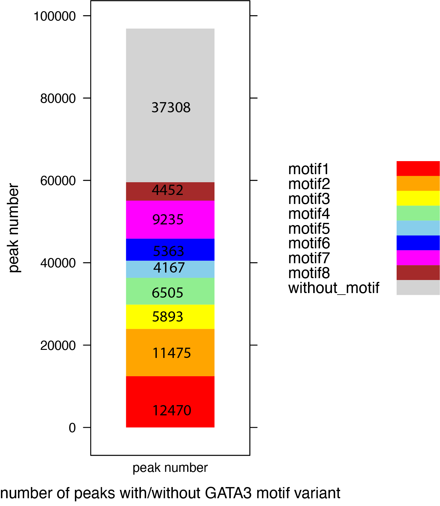
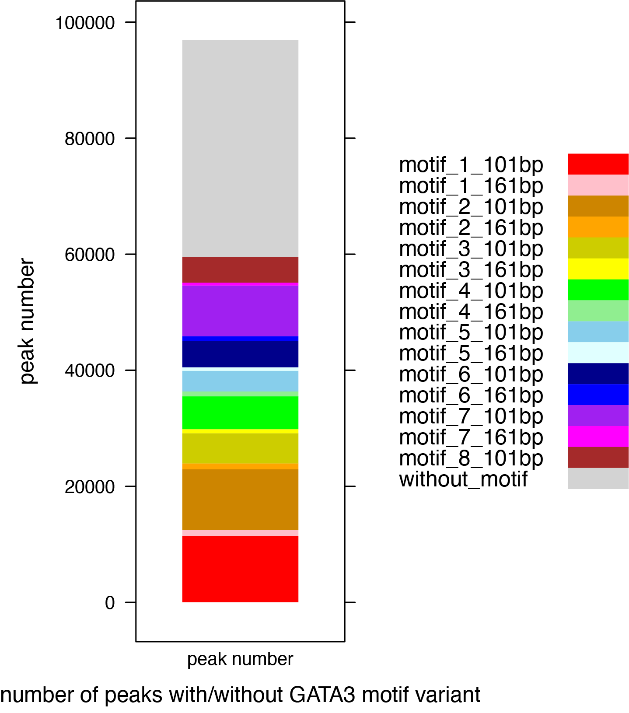

```{css, echo=FALSE}
body .main-container {
  max-width: 1200px !important;
  width: 1200px !important;
}
body {
  max-width: 1200px !important;
}

pre {
  max-height: 600px;
  overflow-y: auto;
}

pre[class] {
  max-height: 600px;
}
```

```{css, echo=FALSE}
.watch-out {
  background-color: lightcyan;
  border: 3px solid lightgrey;
  font-weight: bold;
}

.revision {
  background-color: #FFF4F2;
  border: 3px solid lightgrey;
  font-weight: bold;
}

.highlighted
{
   color:red;
}

.highlighted2
{
  color:blue
}
```

```{r engine='R', eval=TRUE, echo=F}
knitr::opts_chunk$set(class.source = "watch-out")
```


# Exhaustive MEME -MAST for GATA3

```{r engine='R', eval=TRUE, echo=F}
knitr::opts_chunk$set(class.source = "revision")
```

## Previous Workflow Summary

In previous analysis, I have used a 3-ordered Markov Background Model, which defined all k-mer frequencies up to 4-mer. \
Then I sort the top 10000 GATA peaks (with 101bp window centered around the peak summit). \
I use MEME to find the top 1 motif with `-minw 4` and `-maxw 20`. \
 \
If the de novo motif match to GATA3, I use `MAST` to query that single motif (meme.txt) from the complete GATA3 peak sets (101bp window), and find motif coordinates relative to peak regions. \
Then I use `intersectBed` with `-v` option to find peak regions without that motif. \
This new sets of peaks (without first GATA3-like motif) will then be used to do another round of MEME analysis. (sorting 10000, MEME, MAST, intersectBed) \
... \
... \
In the case that the top de novo motif do not match with GATA3, I will first increase number of motif we ask MEME to search for (`-nmotifs` from 1 to 2/3). If the second or third motif match to GATA3, we repeat the same analysis; if we still not see GATA3-like motifs, we move to the software **STREME**. \
... \
... \

When we are sure of we have exhaustive the MEME analysis to GATA3 peaks, and could not find more de novo motifs that match with GATA3, we use **`STREME`**, which is typically good for searching short de novo sequences. \
STREME can work with larger amount of sequences with a fast speed (compared to MEME), so for each round of STREME, we use all peaks (without the already found GATA3-like motifs) and search for top 10 enriched motifs. \
Similar as in MEME analysis, if any de novo motif in that 10 enriched STREME motifs match to GATA3, I use `MAST` to query that single motif (meme.txt) from the GATA3 peak sets (101bp window), and find motif coordinates relative to peak regions. \

If at a point, we could not find GATA3-like motifs use STREME in central 101bp window, we will try find motifs at the spanned region. \
... \
... \

Besides these, I also tried to use the 2-ordered Markov Background Model, and see if this could increase the chance MEME or STREME find GATA3-like de novo motifs. \

## New workflow

```{r  out.width = "80%", echo=F, fig.align = "center", fig.cap="GATA3 motif analysis workflow"}
library(knitr)
knitr::include_graphics("./Exhaustive_MEME_MAST_round1to8/workflow_GATA3_motif_analysis.png") 
```


# 3-ordered Markov Background Model

GATA3 TF binding sites are short, commonly seen are 3-mer GAT/ATC or 4-mer GATA/GATC. \
To account for this fact, we want to generate the markov background model from the reference genome, which estimates the probability of a candidate motif appearing in the dataset by chance. \

I use `fasta-get-markov` with `-m 3` option to generate a 3-ordered Markov Background Model for hg38 ref genome. The output file defines all k-mer frequencies from 1-mer to 4-mer. \

```{r, engine='bash', eval=F, echo=TRUE}
module load meme/5.4.1
module load bedtools
module load R/4.1.2

genome=/home/FCAM/ssun/Genome/hg38.fa
sizes=/home/FCAM/ssun/Genome/hg38.chrom.sizes

fasta-get-markov -m 3 $genome > hg38_bkgrnd.txt
```

```{r, engine='bash', eval=TRUE, echo=TRUE}
head Exhaustive_MEME_MAST_round1to8/hg38_bkgrnd.txt
tail Exhaustive_MEME_MAST_round1to8/hg38_bkgrnd.txt
```

### load packages
```{r, engine='bash', eval=F, echo=TRUE}
module load deeptools/3.5.0
module load meme/5.4.1
module load bedtools
module load R/4.1.2
genome=/home/FCAM/ssun/Genome/hg38.fa
sizes=/home/FCAM/ssun/Genome/hg38.chrom.sizes
dir=/home/FCAM/ssun/GATA3_ChIP_PRO_July2023/ChIP_final/peak_call/
```


## MEME-round1:

### find de novo motifs
**Sort** peaks by intensity, and select top 10,000 peaks. \
```{r, engine='bash', eval=F, echo=TRUE}
name=GATA_ChIP
# sort out the top 10000 GATA peaks and search for top 1 motif
sort -nrk5,5 ${dir}${name}_summit_100window.bed | head -n 10000 > ${name}_top10000_summit_100window.bed
```

```{r, engine='bash', eval=TRUE, echo=TRUE}
wc -l Exhaustive_MEME_MAST_round1to8/GATA_ChIP_summit_100window.bed
head -5 Exhaustive_MEME_MAST_round1to8/GATA_ChIP_summit_100window.bed
wc -l Exhaustive_MEME_MAST_round1to8/GATA_ChIP_top10000_summit_100window.bed
head Exhaustive_MEME_MAST_round1to8/GATA_ChIP_top10000_summit_100window.bed
```

Convert this top 10,000 peak bed file to **.fasta** file with `fastaFromBed`. \
```{r, engine='bash', eval=F, echo=TRUE}
name=${name}_top10000
fastaFromBed -fi $genome -bed ${name}_summit_100window.bed -fo ${name}_summit_100window.fasta
```

```{r, engine='bash', eval=TRUE, echo=TRUE}
wc -l Exhaustive_MEME_MAST_round1to8/GATA_ChIP_top10000_summit_100window.fasta
head -5 Exhaustive_MEME_MAST_round1to8/GATA_ChIP_top10000_summit_100window.fasta
```

Perform **MEME** on top 10,000 GATA3 peaks with `-minw 4`, `-maxw 20` and the 3-ordered Markov Background Model. \
```{r, engine='bash', eval=F, echo=TRUE}
# MEME
meme -p 48 -oc ${name}_motif.meme_output -nmotifs 1 -objfun classic -csites 20000 -searchsize 0 -minw 4 -maxw 20 -revcomp -dna -bfile hg38_bkgrnd.txt -maxsize 100000000 ${name}_summit_100window.fasta
```

The top enriched de novo motif found in the top 10,000 GATA3 peaks match to GATA3. \

```{r  out.width = "60%", echo=F, fig.align = "center", fig.cap="GATA3 motif variants 1"}
#library(knitr)
knitr::include_graphics("./Exhaustive_MEME_MAST_round1to8/GATA_ChIP_top10000_motif.meme_output/logo1.png") 
```

### MAST

After the finding of GATA3-like de novo motif, we will then perform `MAST` to query this motif in all GATA3 peak regions (101bp window), and look for motif coordinates within the peak regions. \
First convert bed filr for all GATA3 peak regions to fasta. \
```{r, engine='bash', eval=F, echo=TRUE}
fastaFromBed -fi $genome -bed ${dir}GATA_ChIP_summit_100window.bed -fo GATA_ChIP_summit_100window.fasta
```

```{r, engine='bash', eval=TRUE, echo=TRUE}
wc -l Exhaustive_MEME_MAST_round1to8/GATA_ChIP_summit_100window.fasta
head -6 Exhaustive_MEME_MAST_round1to8/GATA_ChIP_summit_100window.fasta
```

MAST: \
```{r, engine='bash', eval=F, echo=TRUE}
mast -hit_list -best GATA_ChIP_top10000_motif.meme_output/meme.txt GATA_ChIP_summit_100window.fasta > mast_GATA3_PSWM_in_peaks_round1.txt

Rscript /home/FCAM/ssun/scripts/parse_mast_to_coordinates.R mast_GATA3_PSWM_in_peaks_round1.txt
```

```{r, engine='bash', eval=TRUE, echo=TRUE}
wc -l Exhaustive_MEME_MAST_round1to8/mast_GATA3_PSWM_in_peaks_round1.txt
head -5 Exhaustive_MEME_MAST_round1to8/mast_GATA3_PSWM_in_peaks_round1.txt
wc -l Exhaustive_MEME_MAST_round1to8/mast_GATA3_PSWM_in_peaks_round1.bed 
head -5 Exhaustive_MEME_MAST_round1to8/mast_GATA3_PSWM_in_peaks_round1.bed
```


Then we use `intersectBed` with `-v` option to find GATA3 peaks without GATA3-like motif1 (use the queried motif1 coordinates). \
```{r, engine='bash', eval=F, echo=TRUE}
#peaks without motif1
intersectBed -v -a ${dir}GATA_ChIP_summit_100window.bed -b mast_GATA3_PSWM_in_peaks_round1.bed > without_motifs_1.bed #85440
fastaFromBed -fi $genome -bed without_motifs_1.bed -fo without_motifs_1.fasta
```

```{r, engine='bash', eval=TRUE, echo=TRUE}
wc -l Exhaustive_MEME_MAST_round1to8/without_motifs_1.bed
head -3 Exhaustive_MEME_MAST_round1to8/without_motifs_1.bed
wc -l Exhaustive_MEME_MAST_round1to8/without_motifs_1.fasta
head -6 Exhaustive_MEME_MAST_round1to8/without_motifs_1.fasta
```


## MEME-Round2:

### find de novo motifs

**Sort** and select the top 10,000 peaks from **GATA3 peaks without motif1**. \
```{r, engine='bash', eval=F, echo=TRUE}
# select top 10000
sort -nrk5,5 without_motifs_1.bed | head -n 10000 > without_motifs_1_top10000.bed
fastaFromBed -fi $genome -bed without_motifs_1_top10000.bed -fo without_motifs_1_top10000.fasta
```

```{r, engine='bash', eval=TRUE, echo=TRUE}
wc -l Exhaustive_MEME_MAST_round1to8/without_motifs_1_top10000.bed
head -3 Exhaustive_MEME_MAST_round1to8/without_motifs_1_top10000.bed
wc -l Exhaustive_MEME_MAST_round1to8/without_motifs_1_top10000.fasta
head -6 Exhaustive_MEME_MAST_round1to8/without_motifs_1_top10000.fasta
```

Perform **MEME** to find most enriched de novo motif in top 10,000 GATA3 peaks without motif1. \

```{r, engine='bash', eval=F, echo=TRUE}
# MEME-classic
meme -p 48 -oc GATA3_without_motif1_top10000_output -nmotifs 1 -objfun classic -csites 20000 -searchsize 0 -minw 4 -maxw 20 -revcomp -dna -bfile hg38_bkgrnd.txt -maxsize 100000000 without_motifs_1_top10000.fasta 
```

The top enriched de novo motif found in the top 10,000 GATA3 peaks (without motif1) match to GATA3. \
```{r  out.width = "60%", echo=F, fig.align = "center", fig.cap="GATA3 motif variants 2"}
library(knitr)
knitr::include_graphics("./Exhaustive_MEME_MAST_round1to8/GATA3_without_motif1_top10000_output/logo1.png") 
```

### MAST

Now we want to use `MAST` to query the 2nd GATA-3 like de novo motif from all GATA3 peaks that do not have GATA3-like motif1. \

```{r, engine='bash', eval=F, echo=TRUE}
mast -hit_list -best GATA3_without_motif1_top10000_output/meme.txt without_motifs_1.fasta > mast_GATA3_PSWM_in_peaks_round2.txt

Rscript /home/FCAM/ssun/scripts/parse_mast_to_coordinates.R mast_GATA3_PSWM_in_peaks_round2.txt
```

```{r, engine='bash', eval=TRUE, echo=TRUE}
wc -l Exhaustive_MEME_MAST_round1to8/mast_GATA3_PSWM_in_peaks_round2.txt
head -5 Exhaustive_MEME_MAST_round1to8/mast_GATA3_PSWM_in_peaks_round2.txt
wc -l Exhaustive_MEME_MAST_round1to8/mast_GATA3_PSWM_in_peaks_round2.bed #10460
head -5 Exhaustive_MEME_MAST_round1to8/mast_GATA3_PSWM_in_peaks_round2.bed
```

Then we use `intersectBed` with `-v` option to exclude peaks contains GATA3-like motif2 from peaks contains GATA3-like motif1. \

The output file will be GATA3 peak regions (101bp) that do not contain GATA3-like motif 1 and 2. \

```{r, engine='bash', eval=F, echo=TRUE}
#peaks without motif1 and motif2
intersectBed -v -a without_motifs_1.bed -b mast_GATA3_PSWM_in_peaks_round2.bed > without_motifs_12.bed #74979

fastaFromBed -fi $genome -bed without_motifs_12.bed -fo without_motifs_12.fasta
```

```{r, engine='bash', eval=TRUE, echo=TRUE}
wc -l Exhaustive_MEME_MAST_round1to8/without_motifs_12.bed
head -5 Exhaustive_MEME_MAST_round1to8/without_motifs_12.bed
wc -l Exhaustive_MEME_MAST_round1to8/without_motifs_12.fasta
head -5 Exhaustive_MEME_MAST_round1to8/without_motifs_12.fasta
```


## MEME-Round3:

### find denovo motif with MEME

Again, **sort** and **select** the top 10,000 peaks from GATA3 peaks without motif 1 and 2 (101bp window). \
Then convert .bed to .fasta. \

```{r, engine='bash', eval=F, echo=TRUE}
# select top 10000
sort -nrk5,5 without_motifs_12.bed | head -n 10000 > without_motifs_12_top10000.bed
fastaFromBed -fi $genome -bed without_motifs_12_top10000.bed -fo without_motifs_12_top10000.fasta
```

```{r, engine='bash', eval=TRUE, echo=TRUE}
wc -l Exhaustive_MEME_MAST_round1to8/without_motifs_12_top10000.bed
head -5 Exhaustive_MEME_MAST_round1to8/without_motifs_12_top10000.bed
wc -l Exhaustive_MEME_MAST_round1to8/without_motifs_12_top10000.fasta
head -5 Exhaustive_MEME_MAST_round1to8/without_motifs_12_top10000.fasta
```

Perform `MEME`. \
```{r, engine='bash', eval=F, echo=TRUE}
# MEME-classic
meme -p 64 -oc GATA3_without_motif12_top10000_output -nmotifs 1 -objfun classic -csites 20000 -searchsize 0 -minw 4 -maxw 20 -revcomp -dna -bfile hg38_bkgrnd.txt -maxsize 100000000 without_motifs_12_top10000.fasta 
```

Top motif enriched in top 10,000 peak (exclude the first round and second round GATA motif) match to GATA3 (single sites) \
```{r  out.width = "60%", echo=F, fig.align = "center", fig.cap="GATA3 motif variants 3"}
#library(knitr)
knitr::include_graphics("./Exhaustive_MEME_MAST_round1to8/GATA3_without_motif12_top10000_output/logo1.png") 
```

### MAST 

Query the GATA3-like motif3 from GATA3 peaks without motif 1 and 2 (101bp window) and find motif3 coordinates in peak regions. \
```{r, engine='bash', eval=F, echo=TRUE}
mast -hit_list -best GATA3_without_motif12_top10000_output/meme.txt without_motifs_12.fasta > mast_GATA3_PSWM_in_peaks_round3.txt
Rscript /home/FCAM/ssun/scripts/parse_mast_to_coordinates.R mast_GATA3_PSWM_in_peaks_round3.txt
wc -l mast_GATA3_PSWM_in_peaks_round3.bed #5202
```

```{r, engine='bash', eval=TRUE, echo=TRUE}
wc -l Exhaustive_MEME_MAST_round1to8/mast_GATA3_PSWM_in_peaks_round3.txt
head -5 Exhaustive_MEME_MAST_round1to8/mast_GATA3_PSWM_in_peaks_round3.txt
wc -l Exhaustive_MEME_MAST_round1to8/mast_GATA3_PSWM_in_peaks_round3.bed
head -5 Exhaustive_MEME_MAST_round1to8/mast_GATA3_PSWM_in_peaks_round3.bed
```

Use `intersectBed` with `-v` to find GATA3 peaks without motif 123. \
```{r, engine='bash', eval=F, echo=TRUE}
#peaks without motif1 and motif2 and motif3
intersectBed -v -a without_motifs_12.bed -b mast_GATA3_PSWM_in_peaks_round3.bed > without_motifs_123.bed #69777
fastaFromBed -fi $genome -bed without_motifs_123.bed -fo without_motifs_123.fasta
```

```{r, engine='bash', eval=TRUE, echo=TRUE}
wc -l Exhaustive_MEME_MAST_round1to8/without_motifs_123.bed
head -5 Exhaustive_MEME_MAST_round1to8/without_motifs_123.bed
wc -l Exhaustive_MEME_MAST_round1to8/without_motifs_123.fasta
head -5 Exhaustive_MEME_MAST_round1to8/without_motifs_123.fasta
```

## brief summary:

In the first 3 rounds of MEME analysis, we are asking MEME to find only 1 de novo motif, and these top enriched motifs match to GATA3. \
 \
In the next few rounds, we will see cases where the top enriched de novo motif found by MEME do not match to GATA3. \
In these cases, we would increase the number of de novo motif we ask MEME to find use `nmotifs` option, and see if the second or third enriched de novo motif match to GATA3. \

## MEME-Round4:

### find 1st de novo motif
Sort and select top 10,000 peaks from GATA3 peaks without GATA3-like motif123. \
```{r, engine='bash', eval=F, echo=TRUE}
# select top 10000
sort -nrk5,5 without_motifs_123.bed | head -n 10000 > without_motifs_123_top10000.bed
fastaFromBed -fi $genome -bed without_motifs_123_top10000.bed -fo without_motifs_123_top10000.fasta
```

```{r, engine='bash', eval=F, echo=TRUE}
# MEME-classic
meme -p 64 -oc GATA3_without_motif123_top10000_output -nmotifs 1 -objfun classic -csites 20000 -searchsize 0 -minw 4 -maxw 20 -revcomp -dna -bfile hg38_bkgrnd.txt -maxsize 100000000 without_motifs_123_top10000.fasta 
```

Top motif in top 10,000 peak (exclude the first/second/third round GATA motifs) match to **FOX**. \
```{r  out.width = "60%", echo=F, fig.align = "center", fig.cap="GATA3 motif variants 3"}
#library(knitr)
knitr::include_graphics("./Exhaustive_MEME_MAST_round1to8/GATA3_without_motif123_top10000_output/logo1.png") 
```

### find 2nd de novo motif

repeat previous MEME-classic with `-nmotifs` set to 2. \
```{r, engine='bash', eval=F, echo=TRUE}
# MEME-classic
meme -p 64 -oc GATA3_without_motif123_top10000_output_1 -nmotifs 2 -objfun classic -csites 20000 -searchsize 0 -minw 4 -maxw 20 -revcomp -dna -bfile hg38_bkgrnd.txt -maxsize 100000000 without_motifs_123_top10000.fasta
```

Second motif in top 10,000 peak (exclude the first/second/third round GATA motifs) match to GATA3 (4 spaces between half sites) \
```{r  out.width = "60%", echo=F, fig.align = "center", fig.cap="GATA3 motif variants 4"}
#library(knitr)
knitr::include_graphics("./Exhaustive_MEME_MAST_round1to8/GATA3_without_motif123_top10000_output_1/logo2.png") 
```

### MAST

First isolate individual memes from the MEME output meme.txt file. \

```{r, engine='bash', eval=F, echo=TRUE}
wget https://raw.githubusercontent.com/sysunn/siyu_daily_update/main/December_2023/MEME_individual_from_db_python3.py
python MEME_individual_from_db_python3.py -i GATA3_without_motif123_top10000_output_1/meme.txt
        # output: # AGATNDWNAGATARN_meme.txt ---motif4 (match to GATA3)
                  # TRTTTRCTYWD_meme.txt ---FOX

mkdir individual_meme
#MEME-round1 motif1
cp GATA_ChIP_top10000_motif.meme_output/meme.txt individual_meme/GATAmotif1_meme.txt
#MEME-round2 motif2
cp GATA3_without_motif1_top10000_output/meme.txt individual_meme/GATAmotif2_meme.txt
#MEME-round3 motif3
cp GATA3_without_motif12_top10000_output/meme.txt individual_meme/GATAmotif3_meme.txt
#MEME-round4 motif4
cp AGATNDWNAGATARN_meme.txt individual_meme/GATAmotif4_meme.txt

rm *meme.txt
```

```{r, engine='bash', eval=TRUE, echo=TRUE}
cat Exhaustive_MEME_MAST_round1to8/individual_meme/GATAmotif4_meme.txt
```


Use `MAST` to query this GATA3-like motif4 from GATA3 peaks without motif123. \

```{r, engine='bash', eval=F, echo=TRUE}
mast -hit_list -best individual_meme/GATAmotif4_meme.txt without_motifs_123.fasta > mast_GATA3_PSWM_in_peaks_round4.txt #5668

Rscript /home/FCAM/ssun/scripts/parse_mast_to_coordinates.R mast_GATA3_PSWM_in_peaks_round4.txt #5665
```

```{r, engine='bash', eval=TRUE, echo=TRUE}
wc -l Exhaustive_MEME_MAST_round1to8/mast_GATA3_PSWM_in_peaks_round4.txt
head -5 Exhaustive_MEME_MAST_round1to8/mast_GATA3_PSWM_in_peaks_round4.txt
wc -l Exhaustive_MEME_MAST_round1to8/mast_GATA3_PSWM_in_peaks_round4.bed #5665
head -5 Exhaustive_MEME_MAST_round1to8/mast_GATA3_PSWM_in_peaks_round4.bed 
```

Use `intersectBed` to exclude peaks that contains motif4 from GATA3 peaks without motif 123. \
Then convert to fasta. \

```{r, engine='bash', eval=F, echo=TRUE}
# From peaks (without motif1, 2, 3), exclude peaks with motif4
intersectBed -v -a without_motifs_123.bed -b mast_GATA3_PSWM_in_peaks_round4.bed > without_motifs_1234.bed #64112
fastaFromBed -fi $genome -bed without_motifs_1234.bed -fo without_motifs_1234.fasta
```

```{r, engine='bash', eval=TRUE, echo=TRUE}
wc -l Exhaustive_MEME_MAST_round1to8/without_motifs_1234.bed
head -5 Exhaustive_MEME_MAST_round1to8/without_motifs_1234.bed
wc -l Exhaustive_MEME_MAST_round1to8/without_motifs_1234.fasta
head -5 Exhaustive_MEME_MAST_round1to8/without_motifs_1234.fasta
```

## MEME-Round5:

### find de novo motif

**Sort** and **select** the top 10,000 peaks from peaks without motif1234. \
And convert to fasta. \

```{r, engine='bash', eval=F, echo=TRUE}
# select top 10000
sort -nrk5,5 without_motifs_1234.bed | head -n 10000 > without_motifs_1234_top10000.bed
fastaFromBed -fi $genome -bed without_motifs_1234_top10000.bed -fo without_motifs_1234_top10000.fasta
```

```{r, engine='bash', eval=TRUE, echo=TRUE}
wc -l Exhaustive_MEME_MAST_round1to8/without_motifs_1234_top10000.bed
head -5 Exhaustive_MEME_MAST_round1to8/without_motifs_1234_top10000.bed
wc -l Exhaustive_MEME_MAST_round1to8/without_motifs_1234_top10000.fasta
head -5 Exhaustive_MEME_MAST_round1to8/without_motifs_1234_top10000.fasta
```

In previous run, we have already found top enriched de novo motif match to factors other than GATA3. We would expect to see that FOX-like motif reappear in this round. \

Thus, we will search for more motifs (`-nmotifs`) with MEME.


```{r, engine='bash', eval=F, echo=TRUE}
#!/bin/bash
#SBATCH --job-name=meme4.sh    
#SBATCH -N 6
#SBATCH -n 6
#SBATCH -c 16
#SBATCH -p general
#SBATCH --qos=general
#SBATCH --mem=35G
#SBATCH --mail-type=ALL
#SBATCH --mail-user=ssun@uchc.edu
#SBATCH -o streme4.sh_%j.out
#SBATCH -e streme4.sh_%j.err

hostname
export TMPDIR="${HOME}/temp"
module load meme/5.4.1

# MEME-classic
meme -p 96 -oc GATA3_without_motif1234_top10000_output -nmotifs 3 -objfun classic -csites 20000 -searchsize 0 -minw 4 -maxw 20 -revcomp -dna -bfile hg38_bkgrnd.txt -maxsize 100000000 without_motifs_1234_top10000.fasta 
```

To confirm if use `nmotif==1`, the top motif will be factor not match with GATA3, I am running this top 10,000 peaks with `-nmotif 1` here. \
```{r, engine='bash', eval=F, echo=TRUE}
meme -p 96 -oc GATA3_without_motif1234_top10000_output_testsingle -nmotifs 1 -objfun classic -csites 20000 -searchsize 0 -minw 4 -maxw 20 -revcomp -dna -bfile hg38_bkgrnd.txt -maxsize 100000000 without_motifs_1234_top10000.fasta 
```


While finding only one motif with MEME, we are getting FOX again. \

The third de novo motif found in top 10,000 peak (exclude the 1234 round GATA motifs) match to GATA3. \
```{r  out.width = "60%", echo=F, fig.align = "center", fig.cap="GATA3 motif variants 5"}
#library(knitr)
knitr::include_graphics("./Exhaustive_MEME_MAST_round1to8/GATA3_without_motif1234_top10000_output/logo_rc3.png") 
```

### MAST

First, isolate individual memes from the MEME output meme.txt file. \

```{r, engine='R', eval=F, echo=TRUE}
#wget https://raw.githubusercontent.com/sysunn/siyu_daily_update/main/December_2023/MEME_individual_from_db_python3.py
python MEME_individual_from_db_python3.py -i GATA3_without_motif1234_top10000_output/meme.txt
        # BTTATCWGATB_meme.txt    ---motif5 (match to GATA3)
cp BTTATCWGATB_meme.txt individual_meme/GATAmotif5_meme.txt
rm *meme.txt
```

```{r, engine='bash', eval=TRUE, echo=TRUE}
cat Exhaustive_MEME_MAST_round1to8/individual_meme/GATAmotif5_meme.txt
```

Use `MAST` to query this GATA3-like motif5 from GATA3 peaks without motif 1234 (101bp window) and find the motif coordinates within peak regions. 
```{r, engine='bash', eval=F, echo=TRUE}
# Mast find peaks with motif5
mast -hit_list -best individual_meme/GATAmotif5_meme.txt without_motifs_1234.fasta > mast_GATA3_PSWM_in_peaks_round5.txt
Rscript /home/FCAM/ssun/scripts/parse_mast_to_coordinates.R mast_GATA3_PSWM_in_peaks_round5.txt
wc -l mast_GATA3_PSWM_in_peaks_round5.bed #3564 
```

```{r, engine='bash', eval=TRUE, echo=TRUE}
wc -l Exhaustive_MEME_MAST_round1to8/mast_GATA3_PSWM_in_peaks_round5.txt
head -5 Exhaustive_MEME_MAST_round1to8/mast_GATA3_PSWM_in_peaks_round5.txt
wc -l Exhaustive_MEME_MAST_round1to8/mast_GATA3_PSWM_in_peaks_round5.bed
head -5 Exhaustive_MEME_MAST_round1to8/mast_GATA3_PSWM_in_peaks_round5.bed
```

Use `intersectBed` to find peaks without GATA3-like motif 12345. \

```{r, engine='bash', eval=F, echo=TRUE}
# From peaks (without motif1, 2, 3,4), exclude peaks with motif5
intersectBed -v -a without_motifs_1234.bed -b mast_GATA3_PSWM_in_peaks_round5.bed > without_motifs_12345.bed #60548
fastaFromBed -fi $genome -bed without_motifs_12345.bed -fo without_motifs_12345.fasta
```

```{r, engine='bash', eval=TRUE, echo=TRUE}
wc -l Exhaustive_MEME_MAST_round1to8/without_motifs_12345.bed
head -5 Exhaustive_MEME_MAST_round1to8/without_motifs_12345.bed
wc -l Exhaustive_MEME_MAST_round1to8/without_motifs_12345.fasta
head -5 Exhaustive_MEME_MAST_round1to8/without_motifs_12345.fasta
```


## MEME-Round6:

### find de novo motifs

**sort** and **select** top 10,000 peaks from GATA3 peaks without motif12345. \
```{r, engine='bash', eval=F, echo=TRUE}
# select top 10000
sort -nrk5,5 without_motifs_12345.bed | head -n 10000 > without_motifs_12345_top10000.bed
fastaFromBed -fi $genome -bed without_motifs_12345_top10000.bed -fo without_motifs_12345_top10000.fasta
```

```{r, engine='bash', eval=TRUE, echo=TRUE}
wc -l Exhaustive_MEME_MAST_round1to8/without_motifs_12345_top10000.bed
head -5 Exhaustive_MEME_MAST_round1to8/without_motifs_12345_top10000.bed
wc -l Exhaustive_MEME_MAST_round1to8/without_motifs_12345_top10000.fasta
head -5 Exhaustive_MEME_MAST_round1to8/without_motifs_12345_top10000.fasta
```

Same reason as before, since we have found top enriched de novo motif no longer match to GATA3, we will loosen the `-nmotif` option to 3. \

```{r, engine='R', eval=F, echo=TRUE}
#!/bin/bash
#SBATCH --job-name=meme5.sh    
#SBATCH -N 6
#SBATCH -n 6
#SBATCH -c 16
#SBATCH -p general
#SBATCH --qos=general
#SBATCH --mem=35G
#SBATCH --mail-type=ALL
#SBATCH --mail-user=ssun@uchc.edu
#SBATCH -o meme5.sh_%j.out
#SBATCH -e meme5.sh_%j.err

hostname
export TMPDIR="${HOME}/temp"
module load meme/5.4.1
# MEME-classic
meme -p 96 -oc GATA3_without_motif12345_top10000_output -nmotifs 3 -objfun classic -csites 20000 -searchsize 0 -minw 4 -maxw 20 -revcomp -dna -bfile hg38_bkgrnd.txt -maxsize 100000000 without_motifs_12345_top10000.fasta
```

The third de novo motif found in top 10,000 peak (exclude the 12345 round GATA motifs) match to GATA3. \

```{r  out.width = "60%", echo=F, fig.align = "center", fig.cap="GATA3 motif variants 6"}
#library(knitr)
knitr::include_graphics("./Exhaustive_MEME_MAST_round1to8/GATA3_without_motif12345_top10000_output/logo3.png") 
```


### MAST 

First isolate individual memes from the MEME output meme.txt file, and move the GATA3-like motif to a separate folder. \

```{r, engine='bash', eval=F, echo=TRUE}
#wget https://raw.githubusercontent.com/sysunn/siyu_daily_update/main/December_2023/MEME_individual_from_db_python3.py
python MEME_individual_from_db_python3.py -i GATA3_without_motif12345_top10000_output/meme.txt
        # WGATBDHRVAGATAA_meme.txt    ---motif6 (match to GATA3)
cp WGATBDHRVAGATAA_meme.txt individual_meme/GATAmotif6_meme.txt
rm *meme.txt
```

```{r, engine='bash', eval=TRUE, echo=TRUE}
cat Exhaustive_MEME_MAST_round1to8/individual_meme/GATAmotif6_meme.txt
```


Then use `MAST` to query GATA3-like motif6 from GATA3 peaks without motif 12345. \
The output contains the motif coordinated within peak regions (101bp). \

```{r, engine='bash', eval=F, echo=TRUE}
# Mast find peaks with motif6
mast -hit_list -best individual_meme/GATAmotif6_meme.txt without_motifs_12345.fasta > mast_GATA3_PSWM_in_peaks_round6.txt
Rscript /home/FCAM/ssun/scripts/parse_mast_to_coordinates.R mast_GATA3_PSWM_in_peaks_round6.txt
wc -l mast_GATA3_PSWM_in_peaks_round6.bed #4510
```

```{r, engine='bash', eval=TRUE, echo=TRUE}
wc -l Exhaustive_MEME_MAST_round1to8/mast_GATA3_PSWM_in_peaks_round6.txt
head -5 Exhaustive_MEME_MAST_round1to8/mast_GATA3_PSWM_in_peaks_round6.txt
wc -l Exhaustive_MEME_MAST_round1to8/mast_GATA3_PSWM_in_peaks_round6.bed #4510
head -5 Exhaustive_MEME_MAST_round1to8/mast_GATA3_PSWM_in_peaks_round6.bed
```

Use `intersectBed` with `-v` option to find peaks without motif 123456. \

And convert to fasta. \

```{r, engine='bash', eval=F, echo=TRUE}
# From peaks (without motif1, 2, 3, 4, 5), exclude peaks with motif6
intersectBed -v -a without_motifs_12345.bed -b mast_GATA3_PSWM_in_peaks_round6.bed > without_motifs_123456.bed #56038
fastaFromBed -fi $genome -bed without_motifs_123456.bed -fo without_motifs_123456.fasta
```

```{r, engine='bash', eval=TRUE, echo=TRUE}
wc -l Exhaustive_MEME_MAST_round1to8/without_motifs_123456.bed
head -5 Exhaustive_MEME_MAST_round1to8/without_motifs_123456.bed
wc -l Exhaustive_MEME_MAST_round1to8/without_motifs_123456.fasta
head -5 Exhaustive_MEME_MAST_round1to8/without_motifs_123456.fasta
```

## MEME---find no GATA3-like motif

**sort** and select top 10000 from peaks without motif 12345. \

```{r, engine='bash', eval=F, echo=TRUE}
# select top 10000
sort -nrk5,5 without_motifs_123456.bed | head -n 10000 > without_motifs_123456_top10000.bed
fastaFromBed -fi $genome -bed without_motifs_123456_top10000.bed -fo without_motifs_123456_top10000.fasta
```

**-nmotifs 3**
```{r, engine='bash', eval=F, echo=TRUE}
# MEME-classic
meme -p 40 -oc GATA3_without_motif123456_top10000_output -nmotifs 3 -objfun classic -csites 20000 -searchsize 0 -minw 4 -maxw 20 -revcomp -dna -bfile hg38_bkgrnd.txt -maxsize 100000000 without_motifs_123456_top10000.fasta
```

`MEME` **did not** find de novo motif match to GATA3. I further increase number of `-nmotif` we ask MEME to find in central 101bp window, and did not get GATA3-like motifs.  \

**-nmotifs 5**
```{r, engine='bash', eval=F, echo=TRUE}
meme -p 40 -oc GATA3_without_motif123456_top10000_output_test -nmotifs 5 -objfun classic -csites 20000 -searchsize 0 -minw 4 -maxw 20 -revcomp -dna -bfile hg38_bkgrnd.txt -maxsize 100000000 without_motifs_123456_top10000.fasta

# top 5 motifs do not match with GATA
```


**At this point, MEME no longer reports de novo motifs that match to GATA3 in central 101bp window.** so I moved to the other software---**`STREME`**. \
 

# Exhaustive STREME -MAST for GATA3

## STREME-round7

### find de novo motifs at central 101bp window 

```{r, engine='bash', eval=F, echo=TRUE}
module load meme/5.4.1
# perform STREME on peaks (without motif 1,2,3,4,5,6) (101bp window)
streme --o GATA3_without_123456_streme_output --nmotifs 10 --objfun de --bfile hg38_bkgrnd.txt --dna --minw 4 --maxw 15 --p without_motifs_123456.fasta
```

**STREME found 1 motif (out of 10) that matches to GATA3.** \

```{r  out.width = "60%", echo=F, fig.align = "center", fig.cap="GATA3 motif variants 7"}
#library(knitr)
knitr::include_graphics("./Exhaustive_MEME_MAST_round1to8/GATA3_without_123456_streme_output/4-AGATAAM.png") 
```


### MAST

First, save the STREME-found GATA3-like motif file as `AGATAAM_streme.txt` in `individual_meme` folder. \
```{r, engine='bash', eval=F, echo=TRUE}
wget https://raw.githubusercontent.com/sysunn/siyu_daily_update/main/December_2023/STREME_individual_from_db_python3.py
python STREME_individual_from_db_python3.py -i GATA3_without_123456_streme_output/streme.txt
cp 4-AGATAAM_streme.txt individual_meme/AGATAAM_streme.txt
rm *streme.txt
```


Then use `MAST` to find GATA3-like motif7 (STREME-found) coordinated within peak regions (101bp window). \
Notice that from here, we have increase the p-value stringency to 0.0005 (default is p<0.0001) for `MAST`. \
```{r, engine='bash', eval=F, echo=TRUE}
mast -mt 0.0005 -hit_list -best individual_meme/AGATAAM_streme.txt without_motifs_123456.fasta > mast_GATA3_PSWM_in_peaks_round7.txt #8736
Rscript /home/FCAM/ssun/scripts/parse_mast_to_coordinates.R mast_GATA3_PSWM_in_peaks_round7.txt
wc -l mast_GATA3_PSWM_in_peaks_round7.bed #8733
```

```{r, engine='bash', eval=TRUE, echo=TRUE}
wc -l Exhaustive_MEME_MAST_round1to8/mast_GATA3_PSWM_in_peaks_round7.txt
head -5 Exhaustive_MEME_MAST_round1to8/mast_GATA3_PSWM_in_peaks_round7.txt
wc -l Exhaustive_MEME_MAST_round1to8/mast_GATA3_PSWM_in_peaks_round7.bed
head -5 Exhaustive_MEME_MAST_round1to8/mast_GATA3_PSWM_in_peaks_round7.bed
```

Use `intersectBed` to find GATA3 peaks without motif 123456 and the STREME-found motif7. \
```{r, engine='bash', eval=F, echo=TRUE}
# From peaks (without motif1, 2, 3, 4, 5, 6), exclude peaks with motif7 (STREME)
intersectBed -v -a without_motifs_123456.bed -b mast_GATA3_PSWM_in_peaks_round7.bed > without_motifs_123456_7.bed #47305
fastaFromBed -fi $genome -bed without_motifs_123456_7.bed -fo without_motifs_123456_7.fasta
```

```{r, engine='bash', eval=TRUE, echo=TRUE}
wc -l Exhaustive_MEME_MAST_round1to8/without_motifs_123456_7.bed
head -5 Exhaustive_MEME_MAST_round1to8/without_motifs_123456_7.bed
wc -l Exhaustive_MEME_MAST_round1to8/without_motifs_123456_7.fasta
head -5 Exhaustive_MEME_MAST_round1to8/without_motifs_123456_7.fasta
```

## STREME-round8

### find de novo motifs at central 101bp window

Perform `STREME` to peaks without motif 1234567 (central 101bp window). \
```{r, engine='R', eval=F, echo=TRUE}
module load meme/5.4.1
# perform STREME on peaks (without motif 1,2,3,4,5,6, 7) (101bp central window)
streme --oc GATA3_without_123456_7_streme_output --nmotifs 10 --objfun de --bfile hg38_bkgrnd.txt --dna --minw 4 --maxw 15 --p without_motifs_123456_7.fasta
```

**One of the 10 enriched de novo motif match to GATA3.** \

```{r  out.width = "60%", echo=F, fig.align = "center", fig.cap="GATA3 motif variants 8"}
#library(knitr)
knitr::include_graphics("./Exhaustive_MEME_MAST_round1to8/GATA3_without_123456_7_streme_output/6-TGATAA.png") 
```

### MAST
First save the streme motif file as TGATAA_streme.txt in individual_meme folder. \
```{r, engine='bash', eval=F, echo=TRUE}
#wget https://raw.githubusercontent.com/sysunn/siyu_daily_update/main/December_2023/STREME_individual_from_db_python3.py
python STREME_individual_from_db_python3.py -i GATA3_without_123456_7_streme_output/streme.txt
cp 6-TGATAA_streme.txt individual_meme/TGATAA_streme.txt
rm *streme.txt
```


Then use `MAST` to query this motif from all GATA3 peaks without motif 1234567 (101bp window) to find motif coodinates within peak regions. \
```{r, engine='bash', eval=F, echo=TRUE}
# Mast find peaks with motif8 (Streme)
mast -mt 0.0005 -hit_list -best individual_meme/TGATAA_streme.txt without_motifs_123456_7.fasta > mast_GATA3_PSWM_in_peaks_round8.txt
Rscript /home/FCAM/ssun/scripts/parse_mast_to_coordinates.R mast_GATA3_PSWM_in_peaks_round8.txt
wc -l mast_GATA3_PSWM_in_peaks_round8.bed #4452
```

```{r, engine='bash', eval=TRUE, echo=TRUE}
wc -l Exhaustive_MEME_MAST_round1to8/mast_GATA3_PSWM_in_peaks_round8.txt
head -5 Exhaustive_MEME_MAST_round1to8/mast_GATA3_PSWM_in_peaks_round8.txt
wc -l Exhaustive_MEME_MAST_round1to8/mast_GATA3_PSWM_in_peaks_round8.bed
head -5 Exhaustive_MEME_MAST_round1to8/mast_GATA3_PSWM_in_peaks_round8.bed
```

Use `intersectBed` with `-v` option to find GATA3 peaks without motif 12345678. \
And convert to fasta. \
```{r, engine='bash', eval=F, echo=TRUE}
# From peaks (without motif1, 2, 3, 4, 5, 6, 7), exclude peaks with motif8 (STREME)
intersectBed -v -a without_motifs_123456_7.bed -b mast_GATA3_PSWM_in_peaks_round8.bed > without_motifs_123456_78.bed #42853
fastaFromBed -fi $genome -bed without_motifs_123456_78.bed -fo without_motifs_123456_78.fasta
```

```{r, engine='bash', eval=TRUE, echo=TRUE}
wc -l Exhaustive_MEME_MAST_round1to8/without_motifs_123456_78.bed
head -5 Exhaustive_MEME_MAST_round1to8/without_motifs_123456_78.bed
wc -l Exhaustive_MEME_MAST_round1to8/without_motifs_123456_78.fasta
head -5 Exhaustive_MEME_MAST_round1to8/without_motifs_123456_78.fasta
```

## STREME---find no GATA3-like motif

For peaks without MEME-found motif 1 to 6, and STREME found motif 7,8, we again perform `STREME` to the central 101bp window looking for top 10 de novo motifs. \
```{r, engine='R', eval=F, echo=TRUE}
module load meme/5.4.1
# perform STREME on peaks (without motif 1,2,3,4,5,6, 7, 8) (101bp central window)
streme --oc GATA3_without_123456_78_streme_output --nmotifs 10 --objfun de --bfile hg38_bkgrnd.txt --dna --minw 4 --maxw 15 --p without_motifs_123456_78.fasta
```

**At this point, none of the top 10 de novo motifs found by STREME match to GATA3.** \


# 2-ordered Markov Background Model 

To further increase power of MEME/STREME software finding de novo motifs of our candidate factor GATA3, we also generated a 2-ordered Markov Background Model. \
```{r, engine='bash', eval=F, echo=TRUE}
module load meme/5.4.1
module load bedtools
module load R/4.1.2

genome=/home/FCAM/ssun/Genome/hg38.fa
sizes=/home/FCAM/ssun/Genome/hg38.chrom.sizes

fasta-get-markov -m 2 $genome > hg38_bkgrnd_2mer.txt
```

```{r, engine='bash', eval=TRUE, echo=TRUE}
head Exhaustive_MEME_MAST_round1to8/hg38_bkgrnd_2mer.txt
tail Exhaustive_MEME_MAST_round1to8/hg38_bkgrnd_2mer.txt
```


### MEME with 2-ordered Markov Background Model 


First, **sort** and **select** the top 10,000 peaks from GATA3 peaks without motif12345678 (101bp central window). \

```{r, engine='bash', eval=F, echo=TRUE}
module load meme/5.4.1
# select top 10000
sort -nrk5,5 without_motifs_123456_78.bed | head -n 10000 > without_motifs_123456_78_top10000.bed
fastaFromBed -fi $genome -bed without_motifs_123456_78_top10000.bed -fo without_motifs_123456_78_top10000.fasta
```

```{r, engine='bash', eval=TRUE, echo=TRUE}
wc -l Exhaustive_MEME_MAST_round1to8/without_motifs_123456_78_top10000.bed
head -5 Exhaustive_MEME_MAST_round1to8/without_motifs_123456_78_top10000.bed
wc -l Exhaustive_MEME_MAST_round1to8/without_motifs_123456_78_top10000.fasta
head -5 Exhaustive_MEME_MAST_round1to8/without_motifs_123456_78_top10000.fasta
```

Then perform `MEME` to find top enriched de novo motif use the 2-ordered Markov Background Model. \
```{r, engine='bash', eval=F, echo=TRUE}
# MEME-classic
meme -p 32 -o  bkgrnd_2mer_GATA3_without_123456_78_top10000_output -nmotifs 1 -objfun classic -csites 20000 -searchsize 0 -minw 3 -maxw 20 -revcomp -dna -bfile hg38_bkgrnd_2mer.txt -maxsize 100000000 without_motifs_123456_78_top10000.fasta
```

The above MEME generates the top enriched motif using 2mer background, minwidth==3, and top 10000 peaks without 12345678 gives FOS::JUN-like motif. \

**Increase the `nmotif` search to 5**: \

```{r, engine='bash', eval=F, echo=TRUE}
module load meme/5.4.1
# MEME-classic
meme -p 32 -o  bkgrnd_2mer_GATA3_without_123456_78_top10000_output2 -nmotifs 5 -objfun classic -csites 20000 -searchsize 0 -minw 3 -maxw 20 -revcomp -dna -bfile hg38_bkgrnd_2mer.txt -maxsize 100000000 without_motifs_123456_78_top10000.fasta
```

**the top 5 enriched motifs found by MEME do not match GATA3 motifs**. \


### STREME with 2-ordered Markov Background Model 

Perform `STREME` on all peak without 12345678 at central 101bp window with the 2-ordered Markov Background Model . \

```{r, engine='bash', eval=F, echo=TRUE}
module load meme/5.4.1
# perform STREME on peaks (without motif 1,2,3,4,5,6, 7,8) (101bp window)
streme --o bkgrnd_2mer_GATA3_without_123456_78_streme_output --nmotifs 10 --objfun de --bfile hg38_bkgrnd_2mer.txt --dna --minw 4 --maxw 15 --p without_motifs_123456_78.fasta
```


To increase the chance of finding candidate motif, with consideration of a 3mer might be sufficient for GATA3 binding, I change the searching criteria to `--minw 3` and `--maxw 20`. \
```{r, engine='bash', eval=F, echo=TRUE}
module load meme/5.4.1
#streme -oc ZNF143_no_12345.streme_output --maxw 29 --nmotifs 10 --p without_motifs_12345_wide_NNN.fasta
# perform STREME on peaks (without motif 1,2,3,4,5,6, 7,8) (101bp window)
streme --o bkgrnd_2mer_GATA3_without_123456_78_streme_output2 --nmotifs 10 --objfun de --bfile hg38_bkgrnd_2mer.txt --dna --minw 3 --maxw 20 --p without_motifs_123456_78.fasta
```

**the top 10 enriched motifs found by STREME do not match GATA3 motifs**. \

# Increase Width-161

In our previous analysis, we exhaustively conducted MEME/STREME on the central 100bp window of the peak summit to discover de novo motifs matching GATA3. Having identified 6 motifs using MEME and 2 with STREME, we encountered no further GATA-like de novo motifs. \

At this point, we aim to expand the width to 161 total bases, replacing the central 81 bases with 'NNNs', followed by a classic MEME analysis. This adjustment will enable MEME to explore potential GATA3 binding sites in the flanking regions without compromising sensitivity, considering we have thoroughly examined the central sequences and identified no additional GATA-like motifs. \

We chose to replace only 81 bases instead of the full 100bp to maintain a 10bp buffer at each end. This approach allows for potential binding sites that partially overlap the edges of the 100bp window to be accounted for.

```{r, engine='bash', eval=F, echo=TRUE}
module load bedtools
sizes=/home/FCAM/ssun/Genome/hg38.chrom.sizes
genome=/home/FCAM/ssun/Genome/hg38.fa

slopBed -b 30 -i without_motifs_123456_78.bed -g $sizes  | sort -k1,1 -k2,2n > without_motifs_123456_78_161bpwindow.bed

fastaFromBed -fi $genome -bed without_motifs_123456_78_161bpwindow.bed -fo without_motifs_123456_78_161bpwindow.fasta
```

```{r, engine='bash', eval=TRUE, echo=TRUE}
wc -l Exhaustive_MEME_MAST_round1to8/without_motifs_123456_78.bed
head -5 Exhaustive_MEME_MAST_round1to8/without_motifs_123456_78.bed

wc -l Exhaustive_MEME_MAST_round1to8/without_motifs_123456_78_161bpwindow.bed
head -5 Exhaustive_MEME_MAST_round1to8/without_motifs_123456_78_161bpwindow.bed
```

## MEME on full 161 window

Even though we've conducted multiple exhaustive rounds of MEME/STREME, ensuring thorough exploration for all de novo motifs matching GATA3 within the central 100bp peak region, simply widening the MEME search window might not enhance the probability of discovering potential GATA3 motifs across the extended region. This is because expanding the window could reduce MEME's sensitivity in identifying additional motifs at the edges, given the focus on the central 100bp. \

To increase the chance MEME found new binding sites on edges, we could swap the central sequences to Ns (in later analysis). Still, we want to first confirm that we will not getting more GATA3-like de novo motifs at the full increased window (161bp). \

Perform MEME on top 10,000 peaks (full 161bp extended window). \
```{r, engine='bash', eval=F, echo=TRUE}
# select top 10000
sort -nrk5,5 without_motifs_123456_78_161bpwindow.bed | head -n 10000 > without_motifs_123456_78_161bpwindow_top10000.bed
fastaFromBed -fi $genome -bed without_motifs_123456_78_161bpwindow_top10000.bed -fo without_motifs_123456_78_161bpwindow_top10000.fasta
```

```{r, engine='bash', eval=F, echo=TRUE}
#!/bin/bash
#SBATCH --job-name=meme161.sh    
#SBATCH -N 8
#SBATCH -n 8
#SBATCH -c 12
#SBATCH -p general
#SBATCH --qos=general
#SBATCH --mem=30G
#SBATCH --mail-type=ALL
#SBATCH --mail-user=ssun@uchc.edu
#SBATCH -o meme161.sh_%j.out
#SBATCH -e meme161.sh_%j.err

hostname
export TMPDIR="${HOME}/temp"
module load meme/5.4.1

# MEME-classic
meme -p 96 -oc GATA3_without_motifs_123456_78_161bpwindow_top10000_meme_output -nmotifs 5 -objfun classic -csites 20000 -searchsize 0 -minw 4 -maxw 20 -revcomp -dna -bfile hg38_bkgrnd.txt -maxsize 100000000 without_motifs_123456_78_161bpwindow_top10000.fasta
```

The top 5 enriched motifs do not match to GATA3 while finding in full 161bp window with MEME. \

## MEME-10,000 peaks-on flanking region

As we discussed earlier, we want to increase MEME's sensitivity in finding motifs at spanned region by replacing the central 81 bp sequences to 50 Ns. \

```{r, engine='bash', eval=F, echo=TRUE}
#161window flank with central 81bp substituted with 50 Ns. 
awk '!/^>/ { mid = int(length($0) / 2); $0 = substr($0, 1, mid - 41) "NNNNNNNNNNNNNNNNNNNNNNNNNNNNNNNNNNNNNNNNNNNNNNNNNN" substr($0, mid + 41); } 1' without_motifs_123456_78_161bpwindow.fasta > without_motifs_123456_78_161bpwindow_81NNN.fasta
```

```{r, engine='bash', eval=TRUE, echo=TRUE}
head -8 Exhaustive_MEME_MAST_round1to8/without_motifs_123456_78_161bpwindow.fasta
head -8 Exhaustive_MEME_MAST_round1to8/without_motifs_123456_78_161bpwindow_81NNN.fasta
```

```{r, engine='bash', eval=F, echo=TRUE}
#!/bin/bash
#SBATCH --job-name=streme8N_1.sh    
#SBATCH -N 12
#SBATCH -n 12
#SBATCH -c 8
#SBATCH -p general
#SBATCH --qos=general
#SBATCH --mem=20G
#SBATCH --mail-type=ALL
#SBATCH --mail-user=ssun@uchc.edu
#SBATCH -o streme8N_1.sh_%j.out
#SBATCH -e streme8N_1.sh_%j.err

hostname
export TMPDIR="${HOME}/temp"
module load meme/5.4.1

# MEME-classic
meme -p 96 -oc GATA3_without_motifs_123456_78_161bpwindow_81NNN_top10000_meme_output -nmotifs 5 -objfun classic -csites 20000 -searchsize 0 -minw 4 -maxw 20 -revcomp -dna -bfile hg38_bkgrnd.txt -maxsize 100000000 without_motifs_123456_78_161bpwindow_81NNN_top10000.fasta
```

MEME did not find GATA3-like motifs in the top 10,000 peaks' flanking region as well. \

## STREME---full 161 window

```{r, engine='bash', eval=F, echo=TRUE}
#!/bin/bash
#SBATCH --job-name=streme161.sh    
#SBATCH -N 1
#SBATCH -n 1
#SBATCH -c 32
#SBATCH -p himem
#SBATCH --qos=himem
#SBATCH --mem=128G
#SBATCH --mail-type=ALL
#SBATCH --mail-user=ssun@uchc.edu
#SBATCH -o streme161.sh_%j.out
#SBATCH -e streme161.sh_%j.err

hostname
export TMPDIR="${HOME}/temp"
module load meme/5.4.1

streme --o GATA3_without_motifs_123456_78_161bpwindow_streme_output --nmotifs 10 --objfun de --bfile hg38_bkgrnd.txt --dna --minw 4 --maxw 20 --p without_motifs_123456_78_161bpwindow.fasta
```

STREME did not find GATA3-like motifs using the full 161 window. \

## STREME---flanking region
```{r, engine='bash', eval=F, echo=TRUE}
#!/bin/bash
#SBATCH --job-name=streme81N.sh    
#SBATCH -N 1
#SBATCH -n 1
#SBATCH -c 32
#SBATCH -p himem
#SBATCH --qos=himem
#SBATCH --mem=128G
#SBATCH --mail-type=ALL
#SBATCH --mail-user=ssun@uchc.edu
#SBATCH -o streme81N.sh_%j.out
#SBATCH -e streme81N.sh_%j.err

hostname
export TMPDIR="${HOME}/temp"
module load meme/5.4.1

streme --o GATA3_without_motifs_123456_78_161bpwindow_81NNN_streme_output --nmotifs 10 --objfun de --bfile hg38_bkgrnd.txt --dna --minw 4 --maxw 20 --p without_motifs_123456_78_161bpwindow_81NNN.fasta
```

```{r  out.width = "60%", echo=F, fig.align = "center", fig.cap="GATA3 motif variants at flanking--STREME"}
#library(knitr)
knitr::include_graphics("./Exhaustive_MEME_MAST_round1to8/GATA3_without_motifs_123456_78_161bpwindow_81NNN_streme_output/8-WGATDWHATCW.png") 
```

```{r  out.width = "60%", echo=F, fig.align = "center", fig.cap="GATA3 motif variants at flanking--STREME"}
#library(knitr)
knitr::include_graphics("./Exhaustive_MEME_MAST_round1to8/GATA3_without_motifs_123456_78_161bpwindow_81NNN_streme_output/9-GAGATAA.png") 
```

While running STREME on the flanking region, we got similar motifs out on the spanned region. This indicates that the previous 100bp window is not sufficient for finding all potential binding sites. Thus, we will `MAST` on the extended 161bp window (full) for all 8 motifs we found previously and see how many peaks remains. \

# Concatenate files

```{r, engine='bash', eval=F, echo=TRUE}
mkdir individual_meme
#MEME-round1 motif1
cp ../GATA_ChIP_top10000_motif.meme_output/meme.txt individual_meme/GATAmotif1_meme.txt
#MEME-round2 motif2
cp ../GATA3_without_motif1_top10000_output/meme.txt individual_meme/GATAmotif2_meme.txt
#MEME-round3 motif3
cp ../GATA3_without_motif12_top10000_output/meme.txt individual_meme/GATAmotif3_meme.txt
#MEME-round4 motif4
wget https://raw.githubusercontent.com/sysunn/siyu_daily_update/main/December_2023/MEME_individual_from_db_python3.py

python MEME_individual_from_db_python3.py -i ../GATA3_without_motif123_top10000_output_1/meme.txt
        # output: # AGATNDWNAGATARN_meme.txt ---motif4 (match to GATA3)
                  # TRTTTRCTYWD_meme.txt ---FOX
cp AGATNDWNAGATARN_meme.txt individual_meme/GATAmotif4_meme.txt

#MEME-round5 motif5
python MEME_individual_from_db_python3.py -i ../GATA3_without_motif1234_top10000_output/meme.txt
        # BTTATCWGATB_meme.txt    ---motif5 (match to GATA3)
cp BTTATCWGATB_meme.txt individual_meme/GATAmotif5_meme.txt

#MEME-round6 motif6
python MEME_individual_from_db_python3.py -i ../GATA3_without_motif12345_top10000_output/meme.txt
        # WGATBDHRVAGATAA_meme.txt    ---motif6 (match to GATA3)
cp WGATBDHRVAGATAA_meme.txt individual_meme/GATAmotif6_meme.txt


#STREME-round1 motif7
wget https://raw.githubusercontent.com/sysunn/siyu_daily_update/main/December_2023/STREME_individual_from_db_python3.py
python STREME_individual_from_db_python3.py -i ../GATA3_without_123456_streme_output/streme.txt
cp 4-AGATAAM_streme.txt individual_meme/AGATAAM_streme.txt
#STREME-round2 motif8
python STREME_individual_from_db_python3.py -i ../GATA3_without_123456_7_streme_output/streme.txt
cp 6-TGATAA_streme.txt individual_meme/TGATAA_streme.txt

rm *.txt #remove the non-used individual motifs
```


```{r, engine='bash', eval=TRUE, echo=TRUE}
ls Exhaustive_MEME_MAST_round1to8/individual_meme
```

This python script will concatenate all files in your directory, with common headers and each motif's PSWMs. \

```{r, engine='bash', eval=F, echo=TRUE}
wget https://raw.githubusercontent.com/sysunn/siyu_daily_update/main/December_2023/MEME_concatenate_motifs_to_db_python3.py
python MEME_concatenate_motifs_to_db_python3.py individual_meme/ 
```

```{r, engine='bash', eval=TRUE, echo=TRUE}
head -20 Exhaustive_MEME_MAST_round1to8/combined_output_meme.txt
```

## MAST--161bp window

```{r, engine='bash', eval=F, echo=TRUE}
mast -hit_list -best combined_output_meme.txt without_motifs_123456_78_161bpwindow.fasta > mast_GATA3_PSWM_in_peaks_round9.txt 

wget https://raw.githubusercontent.com/sysunn/siyu_daily_update/main/December_2023/parse_multi_mast_to_coordinates.R
Rscript parse_multi_mast_to_coordinates.R mast_GATA3_PSWM_in_peaks_round9.txt 8
```

```{r, engine='bash', eval=TRUE, echo=TRUE}
wc -l Exhaustive_MEME_MAST_round1to8/mast_GATA3_PSWM_in_peaks_round9.txt 
head -5 Exhaustive_MEME_MAST_round1to8/mast_GATA3_PSWM_in_peaks_round9.txt 
wc -l Exhaustive_MEME_MAST_round1to8/mast_GATA3_PSWM_in_peaks_round9.bed #6002
head -5 Exhaustive_MEME_MAST_round1to8/mast_GATA3_PSWM_in_peaks_round9.bed
tail -5 Exhaustive_MEME_MAST_round1to8/mast_GATA3_PSWM_in_peaks_round9.bed
awk '{print $7}' Exhaustive_MEME_MAST_round1to8/mast_GATA3_PSWM_in_peaks_round9.bed | sort | uniq
```
**Notice that here the motif indices 12345678 is following the motif's PSWMs order in the concatenated database file.**


Use `intersectBed` with `-v` option to find peaks (161bp window) without motif 12345678. \
And convert to fasta. \

```{r, engine='bash', eval=F, echo=TRUE}
# From peaks (without motif1, 2, 3, 4, 5, 6, 7, 8) (101bp window), exclude peaks with any of the motifs found in 161bp window
intersectBed -v -a without_motifs_123456_78_161bpwindow.bed -b mast_GATA3_PSWM_in_peaks_round9.bed > without_motifs_123456_78_161bp_mast.bed #37308 
fastaFromBed -fi $genome -bed without_motifs_123456_78_161bp_mast.bed -fo without_motifs_123456_78_161bp_mast.fasta
```

```{r, engine='bash', eval=TRUE, echo=TRUE}
wc -l Exhaustive_MEME_MAST_round1to8/without_motifs_123456_78_161bp_mast.bed
head -3 Exhaustive_MEME_MAST_round1to8/without_motifs_123456_78_161bp_mast.bed
wc -l Exhaustive_MEME_MAST_round1to8/without_motifs_123456_78_161bp_mast.fasta
head -6 Exhaustive_MEME_MAST_round1to8/without_motifs_123456_78_161bp_mast.fasta
```

# Increase Width-181

In the previous analysis, we exhaustively ran MEME/STREME in a 101 bp window and found no GATA3-like motifs. We then extended the window from 101 bp to 161 bp and discovered similar motifs in the flanking region. This indicates that the previous 101 bp window was not large enough to find all possible binding sites of GATA3. \

Now, after using `MAST` on all MEME/STREME found motifs in the 161 bp window, we are extending the width to 181 bp. Our aim is to perform a similar analysis to see if increasing the width to a 181 bp window will enable MEME/STREME to discover more possible binding sites. \

```{r, engine='bash', eval=F, echo=TRUE}
module load bedtools
sizes=/home/FCAM/ssun/Genome/hg38.chrom.sizes
genome=/home/FCAM/ssun/Genome/hg38.fa

slopBed -b 10 -i without_motifs_123456_78_161bp_mast.bed -g $sizes  | sort -k1,1 -k2,2n > without_motifs_123456_78_181bpwindow.bed

fastaFromBed -fi $genome -bed without_motifs_123456_78_181bpwindow.bed -fo without_motifs_123456_78_181bpwindow.fasta
```

```{r, engine='bash', eval=TRUE, echo=TRUE}
wc -l Exhaustive_MEME_MAST_round1to8/without_motifs_123456_78_181bpwindow.bed
head -5 Exhaustive_MEME_MAST_round1to8/without_motifs_123456_78_181bpwindow.bed

wc -l Exhaustive_MEME_MAST_round1to8/without_motifs_123456_78_181bpwindow.fasta
head -5 Exhaustive_MEME_MAST_round1to8/without_motifs_123456_78_181bpwindow.fasta
```

## MEME-10,000 peaks on full 181 window

Perform MEME on top 10,000 peaks (full 181bp extended window). \
```{r, engine='bash', eval=F, echo=TRUE}
# select top 10000
sort -nrk5,5 without_motifs_123456_78_181bpwindow.bed | head -n 10000 > without_motifs_123456_78_181bpwindow_top10000.bed
fastaFromBed -fi $genome -bed without_motifs_123456_78_181bpwindow_top10000.bed -fo without_motifs_123456_78_181bpwindow_top10000.fasta
```

```{r, engine='bash', eval=F, echo=TRUE}
#!/bin/bash
#SBATCH --job-name=meme181_1.sh    
#SBATCH -N 8
#SBATCH -n 8
#SBATCH -c 25
#SBATCH -p general
#SBATCH --qos=general
#SBATCH --mem=50G
#SBATCH --mail-type=ALL
#SBATCH --mail-user=ssun@uchc.edu
#SBATCH -o meme181_1.sh_%j.out
#SBATCH -e meme181_1.sh_%j.err

hostname
export TMPDIR="${HOME}/temp"
module load meme/5.4.1

# MEME-classic
meme -p 200 -oc GATA3_without_motifs_123456_78_181bpwindow_top10000_meme_output1 -nmotifs 5 -objfun classic -csites 20000 -searchsize 0 -minw 4 -maxw 20 -revcomp -dna -bfile hg38_bkgrnd.txt -maxsize 100000000 without_motifs_123456_78_181bpwindow_top10000.fasta
```


## MEME-10,000 peaks-on flanking region

As we discussed earlier, we want to increase MEME's sensitivity in finding motifs at spanned region by replacing the central 141 bp sequences to 50 Ns. \

```{r, engine='bash', eval=F, echo=TRUE}
#181window flank with central 141bp substituted with 50 Ns. 
awk '!/^>/ { mid = int(length($0) / 2); $0 = substr($0, 1, mid - 71) "NNNNNNNNNNNNNNNNNNNNNNNNNNNNNNNNNNNNNNNNNNNNNNNNNN" substr($0, mid + 71); } 1' without_motifs_123456_78_181bpwindow_top10000.fasta > without_motifs_123456_78_181bpwindow_top10000_141NNN.fasta
```

```{r, engine='bash', eval=TRUE, echo=TRUE}
head -8 Exhaustive_MEME_MAST_round1to8/without_motifs_123456_78_181bpwindow_top10000.fasta
head -8 Exhaustive_MEME_MAST_round1to8/without_motifs_123456_78_181bpwindow_top10000_141NNN.fasta
```

```{r, engine='bash', eval=F, echo=TRUE}
#!/bin/bash
#SBATCH --job-name=meme181_N1.sh    
#SBATCH -N 8
#SBATCH -n 8
#SBATCH -c 20
#SBATCH -p general
#SBATCH --qos=general
#SBATCH --mem=40G
#SBATCH --mail-type=ALL
#SBATCH --mail-user=ssun@uchc.edu
#SBATCH -o meme181_N1.sh_%j.out
#SBATCH -e meme181_N1.sh_%j.err

hostname
export TMPDIR="${HOME}/temp"
module load meme/5.4.1

# MEME-classic
meme -p 160 -oc GATA3_without_motifs_123456_78_181bpwindow_141NNN_top10000_meme_output1 -nmotifs 5 -objfun classic -csites 20000 -searchsize 0 -minw 4 -maxw 20 -revcomp -dna -bfile hg38_bkgrnd.txt -maxsize 100000000 without_motifs_123456_78_181bpwindow_top10000_141NNN.fasta
```

No GATA3-like motifs found. \

*While trying to search for `nmotifs 10` with parallel running, sbatch job failure: "Fatal error in PMPI_Allreduce". But use `nmotifs 5` is fine. \

## STREME---full 181bp

```{r, engine='bash', eval=F, echo=TRUE}
#!/bin/bash
#SBATCH --job-name=streme181.sh    
#SBATCH -N 1
#SBATCH -n 1
#SBATCH -c 32
#SBATCH -p general
#SBATCH --qos=general
#SBATCH --mem=128G
#SBATCH --mail-type=ALL
#SBATCH --mail-user=ssun@uchc.edu
#SBATCH -o streme181.sh_%j.out
#SBATCH -e streme181.sh_%j.err

hostname
export TMPDIR="${HOME}/temp"
module load meme/5.4.1

streme --o GATA3_without_motifs_123456_78_181bpwindow_streme_output --nmotifs 10 --objfun de --bfile hg38_bkgrnd.txt --dna --minw 4 --maxw 20 --p without_motifs_123456_78_181bpwindow.fasta
```

## STREME---flanking

```{r, engine='bash', eval=F, echo=TRUE}
#181window flank with central 141bp substituted with 50 Ns. 
awk '!/^>/ { mid = int(length($0) / 2); $0 = substr($0, 1, mid - 71) "NNNNNNNNNNNNNNNNNNNNNNNNNNNNNNNNNNNNNNNNNNNNNNNNNN" substr($0, mid + 71); } 1' without_motifs_123456_78_181bpwindow.fasta > without_motifs_123456_78_181bpwindow_141NNN.fasta
```

```{r, engine='bash', eval=TRUE, echo=TRUE}
head -8 Exhaustive_MEME_MAST_round1to8/without_motifs_123456_78_181bpwindow.fasta
head -8 Exhaustive_MEME_MAST_round1to8/without_motifs_123456_78_181bpwindow_141NNN.fasta
```

```{r, engine='bash', eval=F, echo=TRUE}
#!/bin/bash
#SBATCH --job-name=streme181_N.sh    
#SBATCH -N 1
#SBATCH -n 1
#SBATCH -c 32
#SBATCH -p general
#SBATCH --qos=general
#SBATCH --mem=128G
#SBATCH --mail-type=ALL
#SBATCH --mail-user=ssun@uchc.edu
#SBATCH -o streme181_N.sh_%j.out
#SBATCH -e streme181_N.sh_%j.err

hostname
export TMPDIR="${HOME}/temp"
module load meme/5.4.1

streme --o GATA3_without_motifs_123456_78_181bpwindow_141NNN_streme_output --nmotifs 10 --objfun de --bfile hg38_bkgrnd.txt --dna --minw 4 --maxw 20 --p without_motifs_123456_78_181bpwindow_141NNN.fasta
```


STREME for the full 181 window and flanking region (central 141bp swapped to N) both found a motif with a "GAT" in it. But we do not think this is a potential binding site. \

<span class="highlighted2">At this point, we can conclude that: GATA3 can bind **within 161bp** window around peak summit. Among the 96868 peaks called by MACS3, we have **~38.5%** GATA3 peaks do not contain MEME/STREME found GATA3 motifs.</span> \
<span class="highlighted2">Then we can perform the kmer analysis to these 38.5% peaks and see if we can find specific GATA3 binding elements.</span> \


# 1 peak 1 motif
For peak in 101window, In each round, we have assigned each peak with one most enriched motif. For the remaining peaks, we have extended the window to 161bp, then mast for full 8 motifs' database, and get 5545 more peaks with motifs. \
However, the `mast -best`, sometimes it will assign one peak with more than 1 different motif. \
In this analysis, the goal is to assign the best and only one motif for each peak. For peak assigned with more than 1 motif, we will select the "best" motif based on its distance to peak summit (and choose the more centered one). \

A coherence check will be: test if the "best" motifs are not on central region, only on spanned region. \


## get peak in 161win with motifs

```{r, engine='bash', eval=F, echo=TRUE}
#mast -hit_list -best combined_output_meme.txt without_motifs_123456_78_161bpwindow.fasta > mast_GATA3_PSWM_in_peaks_round9.txt 

#wget https://raw.githubusercontent.com/sysunn/siyu_daily_update/main/December_2023/parse_multi_mast_to_coordinates.R
#Rscript parse_multi_mast_to_coordinates.R mast_GATA3_PSWM_in_peaks_round9.txt 8
```

`mast` output file is peak sequences (161bp) with the best motif assigned. \
```{r, engine='bash', eval=TRUE, echo=TRUE}
head Exhaustive_MEME_MAST_round1to8/mast_GATA3_PSWM_in_peaks_round9.txt 
```
Notice that there are peaks with more than one motif assigned (less unique peak regions than total peak regions). \
```{r, engine='bash', eval=TRUE, echo=TRUE}
cat Exhaustive_MEME_MAST_round1to8/mast_GATA3_PSWM_in_peaks_round9.txt | wc -l
cat Exhaustive_MEME_MAST_round1to8/mast_GATA3_PSWM_in_peaks_round9.txt | cut -f1 -d' ' | sort | uniq | wc -l
```

The parse_multi_mast_to_coordinates.R generates the motif coordinates associated the 161bp peak sequences. \
```{r, engine='bash', eval=TRUE, echo=TRUE}
head Exhaustive_MEME_MAST_round1to8/mast_GATA3_PSWM_in_peaks_round9.bed
```
We can use `intersectBed` to get peaks regions as well as the motif assigned to it. \
```{r, engine='bash', eval=F, echo=TRUE}
module load bedtools
# From peaks (without motif1, 2, 3, 4, 5, 6, 7, 8) (101bp window), find peaks with any of the motifs found in 161bp window
intersectBed -wa -wb -a without_motifs_123456_78_161bpwindow.bed -b mast_GATA3_PSWM_in_peaks_round9.bed > without_motifs_123456_78_101bp_with_motifs_161bp_mast.bed

wc -l without_motifs_123456_78_101bp_with_motifs_161bp_mast.bed
#6005 
head -5 without_motifs_123456_78_101bp_with_motifs_161bp_mast.bed
#chr1	1859356	1859517	GATA_ChIP_peak_75b	62.1909	chr1	1859381	18593951504.05	1.48e-05	+	5
#chr1	4649639	4649800	GATA_ChIP_peak_101	12.5259	chr1	4649770	46497801752.5	1.54e-06	+	7
#chr1	6815710	6815871	GATA_ChIP_peak_134	5.02874	chr1	6815856	68158701541.45	1.14e-05	+	5
#chr1	6820004	6820165	GATA_ChIP_peak_135a	88.3707	chr1	6820128	68201381538.49	1.08e-05	+	7
#chr1	6820319	6820480	GATA_ChIP_peak_135b	6.37157	chr1	6820469	68204791441.21	2.2e-05	+	7
```

## isolate peaks that with more than one motif
get the set of peaks that has only 1 motif assigned. \
```{r, engine='bash', eval=F, echo=TRUE}
awk 'NR==FNR{count[$4]++; next} count[$4]==1' without_motifs_123456_78_101bp_with_motifs_161bp_mast.bed without_motifs_123456_78_101bp_with_motifs_161bp_mast.bed > unique_without_motifs_123456_78_101bp_with_motifs_161bp_mast.bed
```


```{r, engine='bash', eval=TRUE, echo=TRUE}
awk 'NR==FNR{count[$4]++; next} count[$4]==1' Exhaustive_MEME_MAST_round1to8/without_motifs_123456_78_101bp_with_motifs_161bp_mast.bed Exhaustive_MEME_MAST_round1to8/without_motifs_123456_78_101bp_with_motifs_161bp_mast.bed | wc -l
```

get the set of peaks that has more than 1 motif assigned. \
```{r, engine='bash', eval=F, echo=TRUE}
awk 'NR==FNR{count[$4]++; next} count[$4]>1' without_motifs_123456_78_101bp_with_motifs_161bp_mast.bed without_motifs_123456_78_101bp_with_motifs_161bp_mast.bed > dup_without_motifs_123456_78_101bp_with_motifs_161bp_mast.bed
```

```{r, engine='bash', eval=TRUE, echo=TRUE}
awk 'NR==FNR{count[$4]++; next} count[$4]>1' Exhaustive_MEME_MAST_round1to8/without_motifs_123456_78_101bp_with_motifs_161bp_mast.bed Exhaustive_MEME_MAST_round1to8/without_motifs_123456_78_101bp_with_motifs_161bp_mast.bed | wc -l
```


```{r, engine='R', eval=F, echo=TRUE}
duplicated_peak <- read.table("Exhaustive_MEME_MAST_round1to8/dup_without_motifs_123456_78_101bp_with_motifs_161bp_mast.bed", header = FALSE, stringsAsFactors = FALSE)

head(duplicated_peak)
nrow(duplicated_peak)
```


## for peak more than one motif, check the distance to peak summit (for each peak); then choose the motif that closer to peak summit as a better represented motif winthin that peak region
coherence check: the distances should all >50bp \

Calculate the absolute distance between peak summits and motif summits, and keep only the one that the distance is smaller. \
```{r, engine='R', eval=F, echo=TRUE}
calculate_distance <- function(peak_coords, motif_coords) {
  # Extract summit coordinates (assuming they are in the middle of the given ranges)
  peak_summit <- (peak_coords[, 2] + peak_coords[, 3]) / 2
  motif_summit <- (motif_coords[, 2] + motif_coords[, 3]) / 2
  
  # Calculate absolute distance
  abs_distance <- abs(peak_summit - motif_summit)
  
  return(abs_distance)
}


find_closest_motif <- function(peak_indices, df) {
  closest_rows <- list()
  
  for (peak_index in peak_indices) {
    # Filter rows based on the peak index
    subset_df <- df[df[, 4] == peak_index, ]
    
    if (nrow(subset_df) > 0) {
      # Calculate distances using the function
      distances <- calculate_distance(subset_df[, c(1, 2, 3)], subset_df[, c(6, 7, 8)])
      
      # Find the row with the smallest absolute distance
      closest_row <- subset_df[which.min(distances), ]
      # Add an extra column for the distance
      closest_row$distance <- min(distances)
      
      # Store the closest row in the list
      closest_rows[[as.character(peak_index)]] <- closest_row
    }
  }
  
  return(do.call(rbind, closest_rows))
}

closest_motif_rows <- find_closest_motif(unique(duplicated_peak$V4), duplicated_peak)
```

coherence check: \
```{r, engine='R', eval=F, echo=TRUE}
summary(closest_motif_rows$distance)
```

There are 11 peaks with distance range from 1bp to 28bp, all associated with mast motif indice 8 (round2 motif 2). \
These peaks were not found when `mast` in the 101bp window peaks in round 2. \

## change mast motif indice to reflect the same indice as in round 1 to 8

```{r, engine='R', eval=F, echo=TRUE}
motif_round1=closest_motif_rows[closest_motif_rows$V12=="7", ]
motif_round2=closest_motif_rows[closest_motif_rows$V12=="8", ]
motif_round3=closest_motif_rows[closest_motif_rows$V12=="1", ]
motif_round4=closest_motif_rows[closest_motif_rows$V12=="5", ]
motif_round5=closest_motif_rows[closest_motif_rows$V12=="3", ]
motif_round6=closest_motif_rows[closest_motif_rows$V12=="2", ]
motif_round7=closest_motif_rows[closest_motif_rows$V12=="4", ]

nrow(motif_round1)
nrow(motif_round2)
nrow(motif_round3)
nrow(motif_round4)
nrow(motif_round5)
nrow(motif_round6)
nrow(motif_round7)

```

combine with the peaks (161bp) that uniquely assigned with only one motif. \
```{r, engine='R', eval=F, echo=TRUE}
unique_peak <- read.table("Exhaustive_MEME_MAST_round1to8/unique_without_motifs_123456_78_101bp_with_motifs_161bp_mast.bed", header = FALSE, stringsAsFactors = FALSE)

head(unique_peak)
nrow(unique_peak)

#coherence check:
length(unique(unique_peak$V4))
```
```{r, engine='R', eval=F, echo=TRUE}
unique_motif_round1=unique_peak[unique_peak$V12=="7", ]
unique_motif_round2=unique_peak[unique_peak$V12=="8", ]
unique_motif_round3=unique_peak[unique_peak$V12=="1", ]
unique_motif_round4=unique_peak[unique_peak$V12=="5", ]
unique_motif_round5=unique_peak[unique_peak$V12=="3", ]
unique_motif_round6=unique_peak[unique_peak$V12=="2", ]
unique_motif_round7=unique_peak[unique_peak$V12=="4", ]

nrow(unique_motif_round1)
nrow(unique_motif_round2)
nrow(unique_motif_round3)
nrow(unique_motif_round4)
nrow(unique_motif_round5)
nrow(unique_motif_round6)
nrow(unique_motif_round7)

```

```{r, engine='R', eval=F, echo=TRUE}
motif_round1_161bp=rbind(unique_motif_round1, motif_round1[, 1:12])
motif_round2_161bp=rbind(unique_motif_round2, motif_round2[, 1:12])
motif_round3_161bp=rbind(unique_motif_round3, motif_round3[, 1:12])
motif_round4_161bp=rbind(unique_motif_round4, motif_round4[, 1:12])
motif_round5_161bp=rbind(unique_motif_round5, motif_round5[, 1:12])
motif_round6_161bp=rbind(unique_motif_round6, motif_round6[, 1:12])
motif_round7_161bp=rbind(unique_motif_round7, motif_round7[, 1:12])

nrow(motif_round1_161bp)
nrow(motif_round2_161bp)
nrow(motif_round3_161bp)
nrow(motif_round4_161bp)
nrow(motif_round5_161bp)
nrow(motif_round6_161bp)
nrow(motif_round7_161bp)


#coherence check:
nrow(rbind(motif_round1_161bp, motif_round2_161bp, motif_round3_161bp, motif_round4_161bp, motif_round5_161bp, motif_round6_161bp, motif_round7_161bp))
```
```{r, engine='R', eval=F, echo=TRUE}
write.table(motif_round1_161bp,file= 'with_motifs_1_161bp_mast.bed', quote=F,sep="\t",col.names=F,row.names=F)
write.table(motif_round2_161bp,file= 'with_motifs_2_161bp_mast.bed', quote=F,sep="\t",col.names=F,row.names=F)
write.table(motif_round3_161bp,file= 'with_motifs_3_161bp_mast.bed', quote=F,sep="\t",col.names=F,row.names=F)
write.table(motif_round4_161bp,file= 'with_motifs_4_161bp_mast.bed', quote=F,sep="\t",col.names=F,row.names=F)
write.table(motif_round5_161bp,file= 'with_motifs_5_161bp_mast.bed', quote=F,sep="\t",col.names=F,row.names=F)
write.table(motif_round6_161bp,file= 'with_motifs_6_161bp_mast.bed', quote=F,sep="\t",col.names=F,row.names=F)
write.table(motif_round7_161bp,file= 'with_motifs_7_161bp_mast.bed', quote=F,sep="\t",col.names=F,row.names=F)
```

## 101bp window peak with motif in round 1 to 8.

mast_GATA3_PSWM_in_peaks_round1.bed  mast_GATA3_PSWM_in_peaks_round4.bed  mast_GATA3_PSWM_in_peaks_round7.bed \
mast_GATA3_PSWM_in_peaks_round2.bed  mast_GATA3_PSWM_in_peaks_round5.bed  mast_GATA3_PSWM_in_peaks_round8.bed \
mast_GATA3_PSWM_in_peaks_round3.bed  mast_GATA3_PSWM_in_peaks_round6.bed \

These mast BED files store motif coordinates in 101bp peak window. \
```{r, engine='bash', eval=TRUE, echo=TRUE}
head -5 Exhaustive_MEME_MAST_round1to8/mast_GATA3_PSWM_in_peaks_round1.bed
```
We can use `intersectBed` to get peaks with motifs in 101bp window in the first 8 rounds. \

Round1: \
```{r, engine='bash', eval=F, echo=TRUE}
dir=/home/FCAM/ssun/GATA3_ChIP_PRO_July2023/ChIP_final/peak_call/
module load bedtools
# From peaks (without motif1, 2, 3, 4, 5, 6, 7, 8) (101bp window), find peaks with any of the motifs found in 161bp window
intersectBed -wa -wb -a ${dir}GATA_ChIP_summit_100window.bed -b mast_GATA3_PSWM_in_peaks_round1.bed > with_motifs_1_101bp_mast.bed

wc -l with_motifs_1_101bp_mast.bed
#11428
head -5 with_motifs_1_101bp_mast.bed
#chr1	1080506	1080607	GATA_ChIP_peak_45	6.37157	chr1	1080566	1080576	840.25	9.55e-05	+	1
#chr1	1238187	1238288	GATA_ChIP_peak_51	16.8938	chr1	1238219	1238229	1413	9.62e-06	-	1
#chr1	1686381	1686482	GATA_ChIP_peak_63	35.0463	chr1	1686405	1686415	1176	3.73e-05	-	1
#chr1	1741080	1741181	GATA_ChIP_peak_68	11.6965	chr1	1741170	1741180	1176	3.73e-05	-	1
#chr1	2001971	2002072	GATA_ChIP_peak_77	7.79887	chr1	2002016	2002026	1176	3.73e-05	+	1

#coherence check:
awk '{OFS="\t"} {print $1, $2, $3, $4}' with_motifs_1_101bp_mast.bed | sort | uniq | wc -l #11428
```

Round2: \
```{r, engine='bash', eval=F, echo=TRUE}
intersectBed -wa -wb -a without_motifs_1.bed -b mast_GATA3_PSWM_in_peaks_round2.bed > with_motifs_2_101bp_mast.bed

wc -l with_motifs_2_101bp_mast.bed
#11467
head -5 with_motifs_2_101bp_mast.bed
#chr1	996099	996200	GATA_ChIP_peak_35	38.3686	chr1	996149	996160	1256.25	2.21e-05	+	1
#chr1	3213828	3213929	GATA_ChIP_peak_87	118.864	chr1	3213875	3213886	1455.15	5.8e-06	-	1
#chr1	5603406	5603507	GATA_ChIP_peak_106	2.64066	chr1	5603417	5603428	977.79	8.07e-05	-	1
#chr1	5688597	5688698	GATA_ChIP_peak_109	93.8407	chr1	5688630	5688641	1236.36	2.5e-05	+	1
#chr1	5959780	5959881	GATA_ChIP_peak_110	65.9829	chr1	5959797	5959808	1276.14	1.96e-05	-	1


#coherence check:
awk '{OFS="\t"} {print $1, $2, $3, $4}' with_motifs_2_101bp_mast.bed | sort | uniq | wc -l #10461

#there are peaks with more than one motif2 assigned
```

Round3: \
```{r, engine='bash', eval=F, echo=TRUE}
intersectBed -wa -wb -a without_motifs_12.bed -b mast_GATA3_PSWM_in_peaks_round3.bed > with_motifs_3_101bp_mast.bed

wc -l with_motifs_3_101bp_mast.bed
#5202
head -5 with_motifs_3_101bp_mast.bed
#chr1	7912015	7912116	GATA_ChIP_peak_158	10.8826	chr1	7912050	7912057	1207.4	2.16e-05	-	1
#chr1	8395017	8395118	GATA_ChIP_peak_195	6.37157	chr1	8395075	8395082	1186.58	3.93e-05	+	1
#chr1	8571689	8571790	GATA_ChIP_peak_201b	18.377	chr1	8571741	8571748	1165.76	5.7e-05	-	1
#chr1	8635931	8636032	GATA_ChIP_peak_207	7.79887	chr1	8635951	8635958	1207.4	2.16e-05	-	1
#chr1	10507853	10507954	GATA_ChIP_peak_299b	10.0853	chr1	10507886	10507893	1207.4	2.16e-05	+	1


#coherence check:
awk '{OFS="\t"} {print $1, $2, $3, $4}' with_motifs_3_101bp_mast.bed | sort | uniq | wc -l #5202
```

Round4: \
```{r, engine='bash', eval=F, echo=TRUE}
intersectBed -wa -wb -a without_motifs_123.bed -b mast_GATA3_PSWM_in_peaks_round4.bed > with_motifs_4_101bp_mast.bed

wc -l with_motifs_4_101bp_mast.bed
#5666
head -5 with_motifs_4_101bp_mast.bed
#chr1	869447	869548	GATA_ChIP_peak_30	3.78065	chr1	869468	869482	1223.57	5.03e-05	-	1
#chr1	917484	917585	GATA_ChIP_peak_32	75.0238	chr1	917504	917518	1111.37	7.37e-05	+	1
#chr1	3927027	3927128	GATA_ChIP_peak_98	14.2308	chr1	3927062	3927076	1691.04	2.59e-06	-	1
#chr1	4659215	4659316	GATA_ChIP_peak_102	54.7665	chr1	4659255	4659269	1691.04	2.59e-06	+	1
#chr1	5406545	5406646	GATA_ChIP_peak_103	3.78065	chr1	5406564	5406578	1747.14	1.19e-06	+	1


#coherence check:
awk '{OFS="\t"} {print $1, $2, $3, $4}' with_motifs_4_101bp_mast.bed | sort | uniq | wc -l #5665

#there are peaks with more than one motif4 assigned
```

Round5: \
```{r, engine='bash', eval=F, echo=TRUE}
intersectBed -wa -wb -a without_motifs_1234.bed -b mast_GATA3_PSWM_in_peaks_round5.bed > with_motifs_5_101bp_mast.bed

wc -l with_motifs_5_101bp_mast.bed
#3564
head -5 with_motifs_5_101bp_mast.bed
#chr1	1858856	1858957	GATA_ChIP_peak_75a	32.8724	chr1	1858925	1858935	1196.17	5.23e-05	+	1
#chr1	3948545	3948646	GATA_ChIP_peak_99	53.5507	chr1	3948619	3948629	1469.94	1.62e-05	-	1
#chr1	6317549	6317650	GATA_ChIP_peak_118	14.2308	chr1	6317632	6317642	1433.43	2.15e-05	+	1
#chr1	8121132	8121233	GATA_ChIP_peak_179b	16.8938	chr1	8121183	8121193	1013.66	8.51e-05	-	1
#chr1	8137785	8137886	GATA_ChIP_peak_181	39.6542	chr1	8137811	8137821	1634.2	6.22e-06	+	1

#coherence check:
awk '{OFS="\t"} {print $1, $2, $3, $4}' with_motifs_5_101bp_mast.bed | sort | uniq | wc -l #3564

```

Round6: \
```{r, engine='bash', eval=F, echo=TRUE}
intersectBed -wa -wb -a without_motifs_12345.bed -b mast_GATA3_PSWM_in_peaks_round6.bed > with_motifs_6_101bp_mast.bed

wc -l with_motifs_6_101bp_mast.bed
#4510
head -5 with_motifs_6_101bp_mast.bed
#chr1	6800878	6800979	GATA_ChIP_peak_133	261.961	chr1	6800916	6800930	1076.4	8.4e-05	-	1
#chr1	6959598	6959699	GATA_ChIP_peak_137	253.515	chr1	6959683	6959697	1644.31	4.74e-06	-	1
#chr1	8015116	8015217	GATA_ChIP_peak_161	378.26	chr1	8015155	8015169	1845.83	8.64e-07	-	1
#chr1	8312136	8312237	GATA_ChIP_peak_191	21.5896	chr1	8312221	8312235	1369.52	2.22e-05	+	1
#chr1	8421170	8421271	GATA_ChIP_peak_197	10.8826	chr1	8421203	8421217	1131.36	6.68e-05	-	1

#coherence check:
awk '{OFS="\t"} {print $1, $2, $3, $4}' with_motifs_6_101bp_mast.bed | sort | uniq | wc -l #4510
```

Round7: \
```{r, engine='bash', eval=F, echo=TRUE}
intersectBed -wa -wb -a without_motifs_123456.bed -b mast_GATA3_PSWM_in_peaks_round7.bed > with_motifs_7_101bp_mast.bed

wc -l with_motifs_7_101bp_mast.bed
#8735
head -5 with_motifs_7_101bp_mast.bed
#chr1	845746	845847	GATA_ChIP_peak_29	541.83	chr1	845781	845787	1169.98	0.00027	+	1
#chr1	1504971	1505072	GATA_ChIP_peak_56	16.8938	chr1	1505049	1505055	1284.91	9.58e-05	+	1
#chr1	1746897	1746998	GATA_ChIP_peak_70	4.46672	chr1	1746948	1746954	724.65	0.000445	+	1
#chr1	3186510	3186611	GATA_ChIP_peak_86	15.1046	chr1	3186512	3186518	1284.91	9.58e-05	-	1
#chr1	6623397	6623498	GATA_ChIP_peak_126	26.5697	chr1	6623440	6623446	1241.81	0.000175	+	1


#coherence check:
awk '{OFS="\t"} {print $1, $2, $3, $4}' with_motifs_7_101bp_mast.bed | sort | uniq | wc -l #8733

#there are peaks with more than one motif7 assigned
```

Round8: \
```{r, engine='bash', eval=F, echo=TRUE}
intersectBed -wa -wb -a without_motifs_123456_7.bed -b mast_GATA3_PSWM_in_peaks_round8.bed > with_motifs_8_101bp_mast.bed

wc -l with_motifs_8_101bp_mast.bed
#4454
head -5 with_motifs_8_101bp_mast.bed
#chr1	1775793	1775894	GATA_ChIP_peak_72	24.5459	chr1	1775856	1775861	1142.66	0.000349	+	1
#chr1	1855841	1855942	GATA_ChIP_peak_74	3.19627	chr1	1855920	1855925	1142.66	0.000349	+	1
#chr1	1883543	1883644	GATA_ChIP_peak_76	36.5894	chr1	1883563	1883568	1142.66	0.000349	-	1
#chr1	2135560	2135661	GATA_ChIP_peak_79	18.7357	chr1	2135607	2135612	1142.66	0.000349	-	1
#chr1	3613537	3613638	GATA_ChIP_peak_90	27.5967	chr1	3613592	3613597	1142.66	0.000349	-	1


#coherence check:
awk '{OFS="\t"} {print $1, $2, $3, $4}' with_motifs_8_101bp_mast.bed | sort | uniq | wc -l #4452

#there are peaks with more than one motif8 assigned
```


## bar plot
Two bar plots: one is peak with motif 1, motif 2, ..., motif 8; one is bar plot with more details (i.e., further separate peaks with motif1 to motif1 found in 101bp window, and motif1 found in 161 flanking regions). \

```{r, engine='bash', eval=F, echo=TRUE}
touch peak.with.motif.240116.sum.txt
for i in with_motifs*_101bp_mast.bed
do
 nm=$(echo $i | awk -F"_101bp_mast.bed" '{print $1}' | awk -F"with_motifs_" '{print $2}' )
 p=$(awk '{OFS="\t"} {print $1, $2, $3, $4}' $i | sort | uniq | wc -l)
 echo "motif_${nm}_101bp" "" $p >> peak.with.motif.240116.sum.txt
done

for i in with_motifs*_161bp_mast.bed
do
 nm=$(echo $i | awk -F"_161bp_mast.bed" '{print $1}' | awk -F"with_motifs_" '{print $2}' )
 p=$(awk '{OFS="\t"} {print $1, $2, $3, $4}' $i | sort | uniq | wc -l)
 echo "motif_${nm}_161bp" "" $p >> peak.with.motif.240116.sum.txt
done

# peak withour motifs
wc -l without_motifs_123456_78_161bp_mast.bed
#37308 without_motifs_123456_78_161bp_mast.bed
head -5 without_motifs_123456_78_161bp_mast.bed
#chr1	827300	827461	GATA_ChIP_peak_28	9.30478
#chr1	916689	916850	GATA_ChIP_peak_31	7.79887
#chr1	924773	924934	GATA_ChIP_peak_33	3.78065
#chr1	966573	966734	GATA_ChIP_peak_34	3.78065
#chr1	999428	999589	GATA_ChIP_peak_36	2.11515

echo "without_motif" "" "37308" >> peak.with.motif.240116.sum.txt

```

```{r, engine='bash', eval=TRUE, echo=TRUE}
cat peak.with.motif.240116.sum.txt 
```

```{r, engine='R', eval=F, echo=TRUE}
#module load R/4.1.2 
#R 
library("lattice") 
bar=read.table('peak.with.motif.240116.sum.txt', sep = "", header=F)
colnames(bar)=c("enriched_motifs", "peak_numbers")
bar$dum.x="peak number"
bar$enriched_motif<- factor(bar$enriched_motif, levels = c("motif_1_101bp", "motif_1_161bp", "motif_2_101bp", "motif_2_161bp", "motif_3_101bp", "motif_3_161bp", "motif_4_101bp", "motif_4_161bp", "motif_5_101bp", "motif_5_161bp", "motif_6_101bp", "motif_6_161bp", "motif_7_101bp",  "motif_7_161bp", "motif_8_101bp", "without_motif"))

#coherence check
sum(bar$peak_numbers) #96868

pdf('240116_peak_number_with_or_without_GATA3_motif_variant.pdf', width=5,height=6)
my.settings <- list(
  #superpose.polygon=list(col=c(colorRampPalette(c("red","pink"))(6),colorRampPalette(c("blue","light blue"))(3), "light grey"), border="transparent"),
  superpose.polygon=list(col=c("red","pink","orange3","orange","yellow3","yellow","green","lightgreen","skyblue","lightcyan","blue4","blue","purple","#FF00FF","brown","lightgrey"), border="transparent"),
  strip.background=list(col="grey80", cex = 0.6),
  strip.border=list(col="black")
)
print(barchart(peak_numbers ~ dum.x,         
         data = bar,
         groups = enriched_motif,
         stack = TRUE,
         auto.key=list(space="right"),
         #scales = list(x = list(rot = 45)),
         ylab = "peak number",
         xlab = "number of peaks with/without GATA3 motif variant",
         par.settings = my.settings)
)
dev.off()

bar2=data.frame(matrix(ncol = 2, nrow = 9))
colnames(bar2)=c("enriched_motifs", "peak_numbers")
bar2$enriched_motifs=c("motif1","motif2","motif3","motif4","motif5","motif6","motif7","motif8","without_motif")
bar2$peak_numbers=c("12470","11475","5893","6505","4167","5363","9235","4452", "37308")
bar2$peak_numbers=as.numeric(bar2$peak_numbers)
bar2$dum.x="peak number"
bar2$enriched_motifs<- factor(bar2$enriched_motifs, levels = c("motif1","motif2","motif3","motif4","motif5","motif6","motif7","motif8","without_motif"))
    

pdf('240116_peak_number_with_or_without_GATA3_motif_variant2.pdf', width=5,height=6)
my.settings <- list(
  #superpose.polygon=list(col=c(colorRampPalette(c("red","pink"))(6),colorRampPalette(c("blue","light blue"))(3), "light grey"), border="transparent"),
  superpose.polygon=list(col=c("red","orange","yellow","lightgreen","skyblue","blue","#FF00FF","brown","lightgrey"), border="transparent"),
  strip.background=list(col="grey80", cex = 0.6),
  strip.border=list(col="black")
)
print(barchart(peak_numbers ~ dum.x,         
         data = bar2,
         groups = enriched_motifs,
         stack = TRUE,
         auto.key=list(space="right"),
         #scales = list(x = list(rot = 45)),
         ylab = "peak number",
         xlab = "number of peaks with/without GATA3 motif variant",
         par.settings = my.settings)
)
dev.off()
```

```{r  out.width = "80%", out.height="80%", echo=F, fig.align = "center", fig.cap="number of peaks with or without GATA3 motif variants"}
library(knitr)
 
```


```{r  out.width = "80%", out.height="80%", echo=F, fig.align = "center", fig.cap="number of peaks with or without GATA3 motif variants"}
#library(knitr)
 
```


