```{css, echo=FALSE}
body .main-container {
  max-width: 1200px !important;
  width: 1200px !important;
}
body {
  max-width: 1200px !important;
}

pre {
  max-height: 600px;
  overflow-y: auto;
}

pre[class] {
  max-height: 600px;
}
```

```{css, echo=FALSE}
.watch-out {
  background-color: lightcyan;
  border: 3px solid lightgrey;
  font-weight: bold;
}

.revision {
  background-color: #FFF4F2;
  border: 3px solid lightgrey;
  font-weight: bold;
}

.highlighted
{
   color:red;
}

.highlighted2
{
   color:blue;
}
```

```{r engine='R', eval=TRUE, echo=F}
knitr::opts_chunk$set(class.source = "watch-out")
```


# Install required packages
Install `bigWig` and `latticeExtra` package \
```{r engine='R', eval=F, echo=T}
install.packages("devtools", quiet = TRUE)
library(devtools)
devtools::install_github('andrelmartins/bigWig',
              subdir='bigWig')
library(bigWig)

install.packages("DESeq2", quiet = TRUE)
install.packages("dplyr", quiet = TRUE)
```

Install `bedtools` \
```{r engine='bash', eval=F, echo=T}
/bin/bash -c "$(curl -fsSL https://raw.githubusercontent.com/Homebrew/install/HEAD/install.sh)"
brew install bedtools
```

Install `Biostrings` \
```{r engine='R', eval=TRUE, echo=T}
if (!requireNamespace("Biostrings", quietly = TRUE)) {
  if (!requireNamespace("BiocManager", quietly = TRUE))
    install.packages("BiocManager")
  BiocManager::install("Biostrings")
}
```

Install `latticeExtra` \
```{r engine='R', eval=TRUE, echo=T}
install.packages("latticeExtra", quiet = TRUE)
```

# Feb 5th

# RSAT - DYAD analysis

In the previous analysis, I ran the RSAT-dyad analysis, using the ENCODE DHS regions as a control for calculating the expected 3mer dyad occurrence, and generated these files with dyad patterns and the corresponding statistics. \
Command that I used: \

```{r engine='bash', eval=F, echo=TRUE}
rsat dyad-analysis -o GATA3_peak_161win_with_motif_1_RSAT_dyad.txt -i GATA3_peak_161win_with_motif_1.fasta -format FastA -l 3 -sp 0-20 -expfreq ENCODE.MCF7.DHS.background4.txt -return exp_occ,occ,ratio -sort -seqtype dna 


# -1str	single strand count; only the direct strand is considered for oligonucleotide and dyad occurrence counting.
# -2str	count on oth strands
		#The occurrences of each oligonucleotide are summed on both strands. This allows to detect elements which act in an orientation-insensitive way (as is generally the case for yeast upstream elements).
		
# -type dyad_type (dr|ir|any) any	(default)
		#In order to fasten execution, the program can be asked to restrict its analysis to symmetric dyads.
		#Three types are accepted
		   #dr	direct repeats: the second element is the same as the first one
		   #ir	inverted repeats: the second element is the reverse complement of the first one.
		   #rep  repeats: direct and inverted repeats are evaluated
		   #any	(default)
			 #When selecting the option any, the analysis is performed on all non-symmetric dyads as well.
```


The input .fasta file has 12470 sequences, the output .txt file identified 43680 patterns. \

## coherence check -- single input sequence
If we only input one sequence, what will the output look like? \

```{r engine='bash', eval=F, echo=TRUE}
source ~/miniconda3/bin/activate
conda activate rsat
cat test_single_input.fasta
#>chr10:100072622-100072723
#CAGATTTTATCATTTATTTGCTCATGTATTCACTCACTCATTAGGTCatctatttagtcaaccaacatttacttaagtccttctctattcagagctctcag

rsat dyad-analysis -o test_single_input_RSAT_dyad.txt -i test_single_input.fasta -format FastA -l 3 -sp 0-20 -expfreq ENCODE.MCF7.DHS.background4.txt -return exp_occ,occ,ratio -sort -seqtype dna 
```

For this single sequence input, it generates 25662 patterns. \

And if we look for cat-tca pattern, it identifies several cat-tca 3mer pair with different spacings. This is different than our customized analysis. In customized analysis, for each provided sequence, we only find one specific pattern that are closest to the peak summit. If I am looking for cat-tca pattern, then it will only give my one output. \
```{r engine='bash', eval=TRUE, echo=TRUE}
#head test_single_input_RSAT_dyad.txt
awk -F'\t' '$1 ~ /^cat.*tca/' test_single_input_RSAT_dyad.txt | sort -k8,8nr
```


Refer to the help menu. \
```{r engine='bash', eval=F, echo=TRUE}
cd /home/FCAM/ssun/GATA3_ChIP_PRO_July2023/ChIP_final/GAT_3mer_analaysis/RSAT/
source ~/miniconda3/bin/activate
conda activate rsat
#rsat --help
rsat oligo-analysis -h
rsat create-background-model -h
rsat dyad-analysis -h
```


Files generated: \
GATA3_peak_161win_with_motif_1_RSAT_dyad.txt \
GATA3_peak_161win_with_motif_2_RSAT_dyad.txt \
GATA3_peak_161win_with_motif_4_RSAT_dyad.txt \
GATA3_peak_161win_with_motif_5_RSAT_dyad.txt \
GATA3_peak_161win_with_motif_6_RSAT_dyad.txt \

```{r engine='bash', eval=F, echo=TRUE}
head -6 GATA3_peak_161win_with_motif_1_RSAT_dyad.txt
#sequence  	identifier             	expected_freq	occ	exp_occ	ovl_occall_occ	ratio
#gatn{3}atc	gatn{3}atc|gatn{3}atc	0.0000716460535	  12482	  85.98	36	12518	 145.17
#agan{4}atc	agan{4}atc|gatn{4}tct	0.0003298219842	  10904	 390.07	4445	15349	  27.95
#atan{2}atc	atan{2}atc|gatn{2}tat	0.0001616794646	  10453	 196.05	1460	11913	  53.32
#gatn{4}tca	gatn{4}tca|tgan{4}atc	0.0003742452755	   7872	 442.61	1728	9600	  17.79
#agan{3}tat	agan{3}tat|atan{3}tct	0.0002979478048	   7425	 357.56	613	8038	  20.77

```

The first column is the sequence pattern RSAT-dyad analysis found. **Notice that the n{x} is the spacing between the elements of the dyad. The spacing is the number of bases between the end of the first element and the start of the second one.. This is different with the way we refer to as "relative distance" anchor at the G of two 3mer.** We will modify this while processing the data. \

The second column is all identifier for that specific pattern. Notice that while running the dyad analysis, we specified the parameter `-1str` to only count the direct strand. Thus, only the main structure and its reverse compliment (for both 3mer) is unquely listed in the result files. This is convenient for downstream analysis. \

The final column represents the ratio of observed occurrences to expected occurrences (occ/exp_occ), which can serve as a rough "enrichment score". I plan to extract patterns linked to GAT/ATC and create a bar chart or xyplot to visually depict their frequencies. \
**Notice that using this ratio may overestimate some patterns** \

```{r engine='bash', eval=F, echo=TRUE}
awk -F'\t' '$1 ~ /^gat.*atc/' GATA3_peak_161win_with_motif_1_RSAT_dyad.txt | wc -l
#21

awk -F'\t' '$1 ~ /^atc.*gat/' GATA3_peak_161win_with_motif_1_RSAT_dyad.txt  | wc -l
#21
```


**In RSAT-dyad analysis, gat-atc and atc-gat means two different structure**. \
```{r engine='bash', eval=TRUE, echo=TRUE}
awk -F'\t' '$1 ~ /^gat.*atc/' GATA3_peak_161win_with_motif_1_RSAT_dyad.txt | sort -k8,8nr
echo " "
awk -F'\t' '$1 ~ /^atc.*gat/' GATA3_peak_161win_with_motif_1_RSAT_dyad.txt | sort -k8,8nr
```

**Notice that:** \
1) the x value of n{x} (spacings) in RSAT is defined differently than in the customized analysis. For instance, gatn{3}atc has what we define in customized analysis as a 8bp relative distance between the G in gat and C in atc. \
2) Notice the second column--"identifier". \


**On the other hand, gat-gat and atc-atc means same structure**. \
```{r engine='bash', eval=TRUE, echo=TRUE}
awk -F'\t' '$1 ~ /^gat.*gat/' GATA3_peak_161win_with_motif_1_RSAT_dyad.txt | sort -k8,8nr
```

```{r engine='bash', eval=TRUE, echo=TRUE}
awk -F'\t' '$1 ~ /^atc.*atc/' GATA3_peak_161win_with_motif_1_RSAT_dyad.txt | sort -k8,8nr
```

Extract the pattern info we need. \
```{r engine='R', eval=TRUE, echo=TRUE}
library(Biostrings)

process_and_subset_RSAT <- function(file_path, pattern1, pattern2, number) {
  # Read the file
  input_data <- read.table(file_path, header = FALSE, sep = "\t")

  # Split the first column into components
  components_list <- strsplit(input_data$V1, "n\\{|\\}")

  processed_data <- data.frame(
    first = sapply(components_list, function(x) x[1]),
    dyad_distance = as.numeric(sapply(components_list, function(x) x[2])),
    second = sapply(components_list, function(x) x[3]),
    ratio = input_data$V8 # ratio
  )
  # patterns to DNAstring
  pattern1<-DNAString(pattern1)
  pattern2<-DNAString(pattern2)
  # Get the reverse complement of the patterns
  rc_pattern1 <- reverseComplement(pattern1)
  rc_pattern2 <- reverseComplement(pattern2)

  # Subset the dataframe based on the specified patterns and their reverse complements
  if (pattern1 == pattern2) {
    # Get the reverse complement of the patterns
    rc_pattern1 <- reverseComplement(pattern1)
    rc_pattern2 <- reverseComplement(pattern2)

    # Subset the dataframe based on the specified patterns and their reverse complements
    dyad_structure <- processed_data[grepl(pattern1, processed_data$first, ignore.case = TRUE) & grepl(pattern2, processed_data$second, ignore.case = TRUE), ]
    dyad_structure_rc <- processed_data[grepl(rc_pattern1, processed_data$first, ignore.case = TRUE) & grepl(rc_pattern2, processed_data$second, ignore.case = TRUE), ]
    
    output_data <- rbind(dyad_structure, dyad_structure_rc)
  } else {
    # If patterns are not the same, only subset based on pattern1 and pattern2
    output_data <- processed_data[grepl(pattern1, processed_data$first, ignore.case = TRUE) & grepl(pattern2, processed_data$second, ignore.case = TRUE), ]
  }
    
  # Order by descending ratio
  output_data <- output_data[order(-output_data$ratio), ]

  # Add the relative distance column
  output_data$relative_distance <- output_data$dyad_distance + number

  return(output_data)
}


GAT_GAT <- process_and_subset_RSAT("./GATA3_peak_161win_with_motif_1_RSAT_dyad.txt", "GAT", "GAT", 3)
GAT_ATC <- process_and_subset_RSAT("./GATA3_peak_161win_with_motif_1_RSAT_dyad.txt", "GAT", "ATC", 5)

nrow(GAT_GAT)
head(GAT_GAT)
nrow(GAT_ATC)
head(GAT_ATC)
```

The GAT_GAT will be the red trace, since the second GAT is on same strand relative to the first GAT; Similarly, the GAT_ATC will be the blue trace,as the second ATC is on opposite strand relative to the first GAT. \

```{r engine='R', eval=TRUE, echo=TRUE}
GAT_GAT$query_status="same_strand_GAT"
GAT_ATC$query_status="opposite_strand_GAT"
df.plot=rbind(GAT_GAT, GAT_ATC)
str(df.plot)

unique(df.plot$query_status)
#[1] "same_strand_GAT"     "opposite_strand_GAT"
head(df.plot)
df.plot$query_status = factor(df.plot$query_status, levels = c("same_strand_GAT", "opposite_strand_GAT"))
nrow(df.plot)
#42
summary(df.plot)
```

xyplot \
```{r engine='R', eval=TRUE, echo=TRUE}
library(lattice)
library(latticeExtra)
  xyplot(ratio ~ relative_distance,
         data = df.plot, 
         groups = query_status,
         #auto.key=TRUE,
         #auto.key = list(space = "right", lines=F, points=TRUE, cex = 1),
         auto.key=list(space="right", points=TRUE),
                       #title="2nd 3mer relative to the anchor", cex.title=1),
         aspect = 1,
         xlim=c(0,30),
         ylim=c(0, 200),
         #type = c('p', 'smooth'),
         xlab = "distance (bp) from 2nd closest GAT to closest GAT",
         ylab="RSAT obs/exp Ratio",
         main="GATA3 peak with motif1",
         between=list(y=1.0),
         scales = list(x = list(rot = 45, at = seq(from = 0, to = 50, by = 5))),
         par.settings = list(superpose.symbol = list(col=c("orange", "darkgreen"), pch=18, lwd=2), strip.background=list(col="grey85")),
         panel = function(x,y,...) {panel.abline(v=c(seq(1, 10, 1)), col = "grey90")
           
                                      panel.xyplot(x, y, 
                                                   col=c("orange","darkgreen"), 
                                                   pch=18, 
                                                   cex=0.6,...)
                                      #panel.barchart(x,y, horizontal = FALSE, col=c("red", "blue"), alpha=0.4)
                                      
                                      
  })


```


Loop through RSAT results use the other positive controls, extract the relative dyad patterns and make a xy/barchart: \
```{r engine='R', eval=F, echo=TRUE}
library(Biostrings)
library(lattice)
library(latticeExtra)

#function
process_and_subset_RSAT <- function(file_path, pattern1, pattern2, number) {
  # Read the file
  input_data <- read.table(file_path, header = FALSE, sep = "\t")

  # Split the first column into components
  components_list <- strsplit(input_data$V1, "n\\{|\\}")

  processed_data <- data.frame(
    first = sapply(components_list, function(x) x[1]),
    dyad_distance = as.numeric(sapply(components_list, function(x) x[2])),
    second = sapply(components_list, function(x) x[3]),
    ratio = input_data$V8 # ratio
  )
  # patterns to DNAstring
  pattern1<-DNAString(pattern1)
  pattern2<-DNAString(pattern2)
  # Get the reverse complement of the patterns
  rc_pattern1 <- reverseComplement(pattern1)
  rc_pattern2 <- reverseComplement(pattern2)

  # Subset the dataframe based on the specified patterns and their reverse complements
  if (pattern1 == pattern2) {
    # Get the reverse complement of the patterns
    rc_pattern1 <- reverseComplement(pattern1)
    rc_pattern2 <- reverseComplement(pattern2)

    # Subset the dataframe based on the specified patterns and their reverse complements
    dyad_structure <- processed_data[grepl(pattern1, processed_data$first, ignore.case = TRUE) & grepl(pattern2, processed_data$second, ignore.case = TRUE), ]
    dyad_structure_rc <- processed_data[grepl(rc_pattern1, processed_data$first, ignore.case = TRUE) & grepl(rc_pattern2, processed_data$second, ignore.case = TRUE), ]
    
    output_data <- rbind(dyad_structure, dyad_structure_rc)
  } else {
    # If patterns are not the same, only subset based on pattern1 and pattern2
    output_data <- processed_data[grepl(pattern1, processed_data$first, ignore.case = TRUE) & grepl(pattern2, processed_data$second, ignore.case = TRUE), ]
  }
    
  # Order by descending ratio
  output_data <- output_data[order(-output_data$ratio), ]

  # Add the relative distance column
  output_data$relative_distance <- output_data$dyad_distance + number

  return(output_data)
}

#loop through files
for (dyad.results in Sys.glob(file.path("./GATA3_peak_161win_with_motif_*_RSAT_dyad.txt")))  {
    print(dyad.results)
    motif.name = paste0("motif", strsplit((strsplit(strsplit(dyad.results, "/")[[1]][length(strsplit(dyad.results, "/")[[1]])], 'GATA3_peak_161win_with_motif_')[[1]][2]), "_RSAT_dyad.txt")[[1]][1])
    print(motif.name)
    GAT_GAT <- process_and_subset_RSAT(dyad.results, "GAT", "GAT", 3)
    GAT_ATC <- process_and_subset_RSAT(dyad.results, "GAT", "ATC", 5)
    nrow(GAT_GAT)
    head(GAT_GAT)
    nrow(GAT_ATC)
    head(GAT_ATC)
    GAT_GAT$query_status="same_strand_GAT"
    GAT_ATC$query_status="opposite_strand_GAT"
    df.plot=rbind(GAT_GAT, GAT_ATC)
    str(df.plot)

    unique(df.plot$query_status)
    #[1] "same_strand_GAT"     "opposite_strand_GAT"
    head(df.plot)
    df.plot$query_status = factor(df.plot$query_status, levels = c("same_strand_GAT", "opposite_strand_GAT"))
    nrow(df.plot)

    summary(df.plot)
    pdf(paste0('xy_RSAT_dyad_closest_2nd_GAT_to_closest_1st_GAT_GATA3_peak_with_', motif.name, '.pdf'), width=15,height=5)
print(
  xyplot(ratio ~ relative_distance,
         data = df.plot, 
         groups = query_status,
         #auto.key=TRUE,
         #auto.key = list(space = "right", lines=F, points=TRUE, cex = 1),
         auto.key=list(space="right", points=TRUE),
                       #title="2nd 3mer relative to the anchor", cex.title=1),
         aspect = 1,
         xlim=c(0,30),
         ylim=c(0, 200),
         #type = c('p', 'smooth'),
         xlab = "distance (bp) from 2nd closest GAT to closest GAT",
         ylab="RSAT obs/exp Ratio",
         main=paste0("GATA3 peak with ", motif.name),
         between=list(y=1.0),
         scales = list(x = list(rot = 45, at = seq(from = 0, to = 50, by = 5))),
         par.settings = list(superpose.symbol = list(col=c("orange", "darkgreen"), pch=18, lwd=2), strip.background=list(col="grey85")),
         panel = function(x,y,...) {panel.abline(v=c(seq(1, 10, 1)), col = "grey90")
           
                                      panel.xyplot(x, y, 
                                                   col=c("orange","darkgreen"), 
                                                   pch=18, 
                                                   cex=0.6,...)
                                      #panel.barchart(x,y, horizontal = FALSE, col=c("red", "blue"), alpha=0.4)
                                      
                                      
  })
)
dev.off()
}
```


### RSAT--motif5
In the previous analysis, we extracted dyad structures anchored at "GAT." However, we have discussed the sensitivity of RSAT analysis to structures with two reverse-complement dyads. For motif5 analysis, we aim to focus on structures anchored specifically at "ATC" to ensure we identify the correct structure. \
```{r engine='R', eval=TRUE, echo=TRUE}
library(Biostrings)

process_and_subset_RSAT <- function(file_path, pattern1, pattern2, number) {
  # Read the file
  input_data <- read.table(file_path, header = FALSE, sep = "\t")

  # Split the first column into components
  components_list <- strsplit(input_data$V1, "n\\{|\\}")

  processed_data <- data.frame(
    first = sapply(components_list, function(x) x[1]),
    dyad_distance = as.numeric(sapply(components_list, function(x) x[2])),
    second = sapply(components_list, function(x) x[3]),
    ratio = input_data$V8 # ratio
  )
  # patterns to DNAstring
  pattern1<-DNAString(pattern1)
  pattern2<-DNAString(pattern2)
  # Get the reverse complement of the patterns
  rc_pattern1 <- reverseComplement(pattern1)
  rc_pattern2 <- reverseComplement(pattern2)

  # Subset the dataframe based on the specified patterns and their reverse complements
  if (pattern1 == pattern2) {
    # Get the reverse complement of the patterns
    rc_pattern1 <- reverseComplement(pattern1)
    rc_pattern2 <- reverseComplement(pattern2)

    # Subset the dataframe based on the specified patterns and their reverse complements
    dyad_structure <- processed_data[grepl(pattern1, processed_data$first, ignore.case = TRUE) & grepl(pattern2, processed_data$second, ignore.case = TRUE), ]
    dyad_structure_rc <- processed_data[grepl(rc_pattern1, processed_data$first, ignore.case = TRUE) & grepl(rc_pattern2, processed_data$second, ignore.case = TRUE), ]
    
    output_data <- rbind(dyad_structure, dyad_structure_rc)
  } else {
    # If patterns are not the same, only subset based on pattern1 and pattern2
    output_data <- processed_data[grepl(pattern1, processed_data$first, ignore.case = TRUE) & grepl(pattern2, processed_data$second, ignore.case = TRUE), ]
  }
    
  # Order by descending ratio
  output_data <- output_data[order(-output_data$ratio), ]

  # Add the relative distance column
  output_data$relative_distance <- output_data$dyad_distance + number

  return(output_data)
}


ATC_GAT <- process_and_subset_RSAT("./GATA3_peak_161win_with_motif_5_RSAT_dyad.txt", "ATC", "GAT", 1)
ATC_ATC <- process_and_subset_RSAT("./GATA3_peak_161win_with_motif_5_RSAT_dyad.txt", "ATC", "ATC", 3)

nrow(ATC_GAT)
head(ATC_GAT)
nrow(ATC_ATC)
head(ATC_ATC)
```

```{r engine='R', eval=TRUE, echo=TRUE}
ATC_ATC$query_status="same_strand_ATC"
ATC_GAT$query_status="opposite_strand_ATC"
df.plot=rbind(ATC_ATC, ATC_GAT)
str(df.plot)

unique(df.plot$query_status)

head(df.plot)
df.plot$query_status = factor(df.plot$query_status, levels = c("same_strand_ATC", "opposite_strand_ATC"))
nrow(df.plot)
#42
summary(df.plot)
```

xyplot \
```{r engine='R', eval=TRUE, echo=TRUE}
library(lattice)
library(latticeExtra)
#pdf(paste0('xy_RSAT_dyad_closest_2nd_ATC_to_closest_1st_ATC_GATA3_peak_with_motif5.pdf'), width=10,height=5)
#print(
  xyplot(ratio ~ relative_distance,
         data = df.plot, 
         groups = query_status,
         #auto.key=TRUE,
         #auto.key = list(space = "right", lines=F, points=TRUE, cex = 1),
         auto.key=list(space="right", points=TRUE),
                       #title="2nd 3mer relative to the anchor", cex.title=1),
         aspect = 1,
         xlim=c(0,30),
         ylim=c(0, 300),
         #type = c('p', 'smooth'),
         xlab = "distance (bp) from 2nd closest ATC to closest ATC",
         ylab="RSAT obs/exp Ratio",
         main="GATA3 peak with motif5",
         between=list(y=1.0),
         scales = list(x = list(rot = 45, at = seq(from = 0, to = 50, by = 5))),
         par.settings = list(superpose.symbol = list(col=c("#8B4513", "#145A8C"), pch=18, lwd=2), strip.background=list(col="grey85")),
         panel = function(x,y,...) {panel.abline(v=c(seq(1, 10, 1)), col = "grey90")
           
                                      panel.xyplot(x, y, 
                                                   col=c("#8B4513", "#145A8C"), 
                                                   pch=18, 
                                                   cex=0.6,...)
                                      #panel.barchart(x,y, horizontal = FALSE, col=c("red", "blue"), alpha=0.4)
                                      
                                      
  })
#)
#dev.off()

```


# Comparison between RSAT and customized analysis

For the customized analysis: \

1) Merge the occurrences of the anchored GAT on both the plus and minus strands. \

2) Determine the second closest GAT relative to the strandedness of the anchored GAT. For example, if anchoring at GAT (regardless of its strand), the "minus-GAT" trace should be the sum of the occurrences of "+GAT" anchored at -GAT and "-GAT" anchored at +GAT. \

3) Calculate the relative frequencies (y-axis in plots) as the actual occurrences of the pattern minus the frequencies from the DHS negative control. \

```{r engine='R', eval=F, echo=TRUE}
# define function
calculate_actual_frequency <- function(data) {
  # Use table() to create a frequency table
  actual_frequencies <- table(data)/length(data)
  result <- data.frame(value = names(actual_frequencies), actual_freq = as.vector(actual_frequencies))
  return(result)
}


my_motifs = c("motif1", "motif4","motif2", "motif6", "motif5")
for (motif in my_motifs) {
  print(motif)
  #GATA peaks
  df.plot.GATA = data.frame(matrix(nrow = 0, ncol = 5))     
  colnames(df.plot.GATA) = c("dis","anchor_status", "query_status","abs.dis", "actual_freq")
  for (closest_2nd_dis in Sys.glob(file.path(paste0("./closest.2nd*GAT.to.1st*GAT.GATA3.", motif, ".bed")))) {
    print(closest_2nd_dis)
    anchor_status =strsplit((strsplit(strsplit(closest_2nd_dis, "/")[[1]][length(strsplit(closest_2nd_dis, "/")[[1]])], 'closest.2nd.*.to.1st.')[[1]][2]), paste0(".GATA3.", motif, ".bed"))[[1]][1]
    print(anchor_status)
    query_status =strsplit((strsplit(strsplit(closest_2nd_dis, "/")[[1]][length(strsplit(closest_2nd_dis, "/")[[1]])], 'closest.2nd.')[[1]][2]), paste0(".to.1st.*.GATA3.", motif, ".bed"))[[1]][1]
    print(query_status)
    temp = as.data.frame(cbind(read.table(closest_2nd_dis, header=F, comment.char='')[,11], anchor_status, query_status)) 
    colnames(temp) = c("dis", "anchor_status", "query_status")
    temp$dis=as.integer(temp$dis)
    temp$abs.dis=abs(temp$dis)
    actual_frequencies = calculate_actual_frequency(temp$abs.dis)
    temp1= merge(temp, actual_frequencies, by.x = "abs.dis", by.y = "value", all.x = TRUE)
    df.plot.GATA = rbind(df.plot.GATA,temp1)
  }
  df.plot.GATA$anchor_status = factor(df.plot.GATA$anchor_status, levels = c("plus.GAT", "minus.GAT"))
  df.plot.GATA$query_status = factor(df.plot.GATA$query_status, levels = c("plus.GAT", "minus.GAT"))
  uniq.df.plot.GATA=df.plot.GATA[!duplicated(df.plot.GATA), ]
  
  
  #DHS regions
  df.plot.DHS = data.frame(matrix(nrow = 0, ncol = 5))     
colnames(df.plot.DHS) = c("dis","anchor_status", "query_status","abs.dis", "actual_freq_neg")
for (closest_2nd_dis in Sys.glob(file.path("./closest.2nd*GAT.to.1st*GAT.indep.DHS.bed"))) {
    print(closest_2nd_dis)
    anchor_status =strsplit((strsplit(strsplit(closest_2nd_dis, "/")[[1]][length(strsplit(closest_2nd_dis, "/")[[1]])], 'closest.2nd.*.to.1st.')[[1]][2]), ".indep.DHS.bed")[[1]][1]
    print(anchor_status)
    query_status =strsplit((strsplit(strsplit(closest_2nd_dis, "/")[[1]][length(strsplit(closest_2nd_dis, "/")[[1]])], 'closest.2nd.')[[1]][2]), ".to.1st.*.indep.DHS.bed")[[1]][1]
    print(query_status)
    temp = as.data.frame(cbind(read.table(closest_2nd_dis, header=F, comment.char='')[,11], anchor_status, query_status)) 
    colnames(temp) = c("dis", "anchor_status", "query_status")
    temp$dis=as.integer(temp$dis)
    temp$abs.dis=abs(temp$dis)
    actual_frequency = calculate_actual_frequency(temp$abs.dis)
    temp1= merge(temp, actual_frequency, by.x = "abs.dis", by.y = "value", all.x = TRUE)
    df.plot.DHS = rbind(df.plot.DHS, temp1)
}
    colnames(df.plot.DHS)[5]="actual_freq_DHS"
    df.plot.DHS$anchor_status = factor(df.plot.DHS$anchor_status, levels = c("plus.GAT", "minus.GAT"))
    df.plot.DHS$query_status = factor(df.plot.DHS$query_status, levels = c("plus.GAT", "minus.GAT"))
    uniq.df.plot.DHS=df.plot.DHS[!duplicated(df.plot.DHS), ]
    #nrow(uniq.df.plot.DHS) #[1] 2859
  
  #calculate the relative frequency
    #by subtraction of actual frequency between GATA3 peaks and DHS regions
    df.plot=merge(uniq.df.plot.GATA, uniq.df.plot.DHS, by=c("abs.dis", "dis", "anchor_status", "query_status"), all.x = TRUE)
    df.plot$rel_freq <- ifelse(is.na(df.plot$actual_freq_DHS), NA, df.plot$actual_freq - df.plot$actual_freq_DHS)
    df.plot$strand_relationship <- ifelse(df.plot$anchor_status == df.plot$query_status,
                                              "same_strand_GAT", "opposite_strand_GAT")
    
    df.plot$strand_relationship = factor(df.plot$strand_relationship, levels = c("same_strand_GAT", "opposite_strand_GAT"))
    
library(lattice)
library(latticeExtra)
pdf(paste0('xy_closest_2nd_GAT_to_closest_1st_GAT_to_GATA3_pos_', motif, '_compare_to_DHS.pdf'), width=15,height=5)
print(xyplot(rel_freq ~ abs.dis, 
         data = df.plot, 
         groups = strand_relationship,
         auto.key = list(space = "right", lines=TRUE, points=FALSE, cex = 1),
         aspect = 1,
         xlim=c(0,50),
         ylim=c(0, 0.3),
         #type = c('p', 'smooth'),
         xlab = "distance (bp) from 2nd closest GAT to closest GAT",
         ylab="Frequency relative to DHS regions",
         main=paste0("GATA3 peak with ", motif),
         between=list(y=1.0),
         scales = list(x = list(rot = 45, at = seq(from = 0, to = 50, by = 5))),
         par.settings = list(superpose.line = list(col=c("pink", "skyblue"), lwd=2), strip.background=list(col="grey85")),
         panel = function(x,y,...) {panel.densityplot(x, data = df.plot, 
                                                        from=0, 
                                                        to=50, 
                                                        lty = c(1),
                                                        lwd=2, 
                                                        darg=list(bw = "nrd0", kernel="gaussian"),
                                                        type = "count",
                                                        col=c("pink","skyblue"), ...)
                                      panel.xyplot(x, y, 
                                                   col=c("red","blue"), 
                                                   pch=18, 
                                                   cex=0.6,...)
                                      panel.abline(v=c(seq(1, 10, 1)), col = "grey90")
                                      
  })
)
dev.off()

png(paste0('xy_closest_2nd_GAT_to_closest_1st_GAT_to_GATA3_pos_', motif, '_compare_to_DHS.png'))
print(xyplot(rel_freq ~ abs.dis | anchor_status, 
         #data = df.plot[!duplicated(df.plot), ],
         data = df.plot, 
         groups = query_status,
         auto.key = list(space = "right", lines=TRUE, points=FALSE, cex = 1),
         aspect = 1,
         xlim=c(0,50),
         ylim=c(0, 0.3),
         #type = c('p', 'smooth'),
         xlab = "distance (bp) from 2nd closest GAT to closest GAT",
         ylab="Frequency relative to DHS regions",
         main=paste0("GATA3 peak with ", motif),
         between=list(y=1.0),
         scales = list(x = list(rot = 45, at = seq(from = 0, to = 50, by = 5))),
         par.settings = list(superpose.line = list(col=c("pink", "skyblue"), lwd=2), strip.background=list(col="grey85")),
         panel = function(x,y,...) {panel.densityplot(x, data = df.plot, 
                                                        from=0, 
                                                        to=50, 
                                                        lty = c(1),
                                                        lwd=2, 
                                                        darg=list(bw = "nrd0", kernel="gaussian"),
                                                        type = "count",
                                                        col=c("pink","skyblue"), ...)
                                      panel.xyplot(x, y, 
                                                   col=c("red","blue"), 
                                                   pch=18, 
                                                   cex=0.6,...)
                                      panel.abline(v=c(seq(1, 10, 1)), col = "grey90")
                                      
  })
)
dev.off()
}


```


```{r  fig.align = "center", out.width="80%", out.height="80%", echo=F, fig.align = "center", fig.cap="xy plot of GATA3 peak with motif1 relative to the DHS regions: 3mer structure"}
library(knitr)
knitr::include_graphics("./xy_closest_2nd_GAT_to_closest_1st_GAT_to_GATA3_pos_motif1_compare_to_DHS.png") 
```
The plot generated using the above code has double points at the same distance with same strand info. This is because the plus.GAT-minus.GAT and minus.GAT-plus.GAT are both labeled as "opposite_strand_GAT" and the relative frequency is slightly different (although pretty close). \

See the plotting data frame below: \

```{r engine='R', eval=F, echo=TRUE}
abs.dis dis anchor_status query_status  actual_freq actual_freq_DHS
1       1   1      plus.GAT    minus.GAT 0.0008025682    0.0008209464
2       1   1     minus.GAT     plus.GAT 0.0009630046    0.0008557308
3       2   2      plus.GAT    minus.GAT 0.0119582665    0.0027248432
4       2   2     minus.GAT     plus.GAT 0.0127598106    0.0026021201
5       3   3      plus.GAT     plus.GAT 0.0300938929    0.0162763486
6       3   3      plus.GAT    minus.GAT 0.0760032103    0.1039283157
       rel_freq strand_relationship
1 -1.837814e-05 opposite_strand_GAT
2  1.072738e-04 opposite_strand_GAT
3  9.233423e-03 opposite_strand_GAT
4  1.015769e-02 opposite_strand_GAT
5  1.381754e-02     same_strand_GAT
6 -2.792511e-02 opposite_strand_GAT
```

This is not ideal. So I will modify the code: instead of calculating the actual frequency for each files, I will combine the file together, create the label relative to strand info, then calculate the actual frequency. \

```{r engine='R', eval=F, echo=TRUE}
# define function
calculate_actual_frequency <- function(data) {
  # Use table() to create a frequency table
  actual_frequencies <- table(data)/length(data)
  result <- data.frame(value = names(actual_frequencies), actual_freq = as.vector(actual_frequencies))
  return(result)
}


my_motifs = c("motif1", "motif4","motif2", "motif6", "motif5")
for (motif in my_motifs) {
  print(motif)
  #GATA peaks
  df.plot.GATA = data.frame(matrix(nrow = 0, ncol = 4))     
  colnames(df.plot.GATA) = c("dis","anchor_status", "query_status","abs.dis")
  for (closest_2nd_dis in Sys.glob(file.path(paste0("./closest.2nd*GAT.to.1st*GAT.GATA3.", motif, ".bed")))) {
    print(closest_2nd_dis)
    anchor_status =strsplit((strsplit(strsplit(closest_2nd_dis, "/")[[1]][length(strsplit(closest_2nd_dis, "/")[[1]])], 'closest.2nd.*.to.1st.')[[1]][2]), paste0(".GATA3.", motif, ".bed"))[[1]][1]
    print(anchor_status)
    query_status =strsplit((strsplit(strsplit(closest_2nd_dis, "/")[[1]][length(strsplit(closest_2nd_dis, "/")[[1]])], 'closest.2nd.')[[1]][2]), paste0(".to.1st.*.GATA3.", motif, ".bed"))[[1]][1]
    print(query_status)
    temp = as.data.frame(cbind(read.table(closest_2nd_dis, header=F, comment.char='')[,11], anchor_status, query_status)) 
    colnames(temp) = c("dis", "anchor_status", "query_status")
    temp$dis=as.integer(temp$dis)
    temp$abs.dis=abs(temp$dis)
    df.plot.GATA = rbind(df.plot.GATA,temp)
  }
 
  df.plot.GATA$anchor_status = factor(df.plot.GATA$anchor_status, levels = c("plus.GAT", "minus.GAT"))
  df.plot.GATA$query_status = factor(df.plot.GATA$query_status, levels = c("plus.GAT", "minus.GAT"))
  df.plot.GATA$strand_relationship <- ifelse(df.plot.GATA$anchor_status == df.plot.GATA$query_status,
                                              "same_strand_GAT", "opposite_strand_GAT")
  df.plot.GATA$strand_relationship = factor(df.plot.GATA$strand_relationship, levels = c("same_strand_GAT", "opposite_strand_GAT"))
  
  temp.g1=df.plot.GATA[df.plot.GATA$strand_relationship=="same_strand_GAT",]
  actual_frequency_same_strand = calculate_actual_frequency(temp.g1$abs.dis)
  temp.g2=df.plot.GATA[df.plot.GATA$strand_relationship=="opposite_strand_GAT",]
  actual_frequency_oppo_strand = calculate_actual_frequency(temp.g2$abs.dis)
  
  df.plot.GATA1=rbind(merge(temp.g1, actual_frequency_same_strand, by.x = "abs.dis", by.y = "value", all.x = TRUE), merge(temp.g2, actual_frequency_oppo_strand, by.x = "abs.dis", by.y = "value", all.x = TRUE))
  uniq.df.plot.GATA=df.plot.GATA1[!duplicated(df.plot.GATA1), ]
  

  
  #DHS regions
  df.plot.DHS = data.frame(matrix(nrow = 0, ncol = 4))     
colnames(df.plot.DHS) = c("dis","anchor_status", "query_status","abs.dis")
for (closest_2nd_dis in Sys.glob(file.path("./closest.2nd*GAT.to.1st*GAT.indep.DHS.bed"))) {
    print(closest_2nd_dis)
    anchor_status =strsplit((strsplit(strsplit(closest_2nd_dis, "/")[[1]][length(strsplit(closest_2nd_dis, "/")[[1]])], 'closest.2nd.*.to.1st.')[[1]][2]), ".indep.DHS.bed")[[1]][1]
    print(anchor_status)
    query_status =strsplit((strsplit(strsplit(closest_2nd_dis, "/")[[1]][length(strsplit(closest_2nd_dis, "/")[[1]])], 'closest.2nd.')[[1]][2]), ".to.1st.*.indep.DHS.bed")[[1]][1]
    print(query_status)
    temp = as.data.frame(cbind(read.table(closest_2nd_dis, header=F, comment.char='')[,11], anchor_status, query_status)) 
    colnames(temp) = c("dis", "anchor_status", "query_status")
    temp$dis=as.integer(temp$dis)
    temp$abs.dis=abs(temp$dis)
    df.plot.DHS = rbind(df.plot.DHS, temp)
}

  df.plot.DHS$anchor_status = factor(df.plot.DHS$anchor_status, levels = c("plus.GAT", "minus.GAT"))
  df.plot.DHS$query_status = factor(df.plot.DHS$query_status, levels = c("plus.GAT", "minus.GAT"))
  df.plot.DHS$strand_relationship <- ifelse(df.plot.DHS$anchor_status == df.plot.DHS$query_status,
                                              "same_strand_GAT", "opposite_strand_GAT")
  df.plot.DHS$strand_relationship = factor(df.plot.DHS$strand_relationship, levels = c("same_strand_GAT", "opposite_strand_GAT"))
  
  temp.g1=df.plot.DHS[df.plot.DHS$strand_relationship=="same_strand_GAT",]
  actual_frequency_same_strand = calculate_actual_frequency(temp.g1$abs.dis)
  temp.g2=df.plot.DHS[df.plot.DHS$strand_relationship=="opposite_strand_GAT",]
  actual_frequency_oppo_strand = calculate_actual_frequency(temp.g2$abs.dis)
  
  df.plot.DHS1=rbind(merge(temp.g1, actual_frequency_same_strand, by.x = "abs.dis", by.y = "value", all.x = TRUE), merge(temp.g2, actual_frequency_oppo_strand, by.x = "abs.dis", by.y = "value", all.x = TRUE))
  uniq.df.plot.DHS=df.plot.DHS1[!duplicated(df.plot.DHS1), ] #nrow(uniq.df.plot.DHS) #[1] 2859
  colnames(uniq.df.plot.DHS)[6]="actual_freq_DHS"
  
  #calculate the relative frequency
    #by subtraction of actual frequency between GATA3 peaks and DHS regions
    df.plot1=merge(uniq.df.plot.GATA, uniq.df.plot.DHS, by=c("abs.dis", "dis", "anchor_status", "query_status", "strand_relationship"), all.x = TRUE)
    df.plot1$rel_freq <- ifelse(is.na(df.plot1$actual_freq_DHS), NA, df.plot1$actual_freq - df.plot1$actual_freq_DHS)
   
    df.plot=df.plot1[, c(1,2,5,6,7,8)] #1104
    df.plot=df.plot[!duplicated(df.plot), ] #658
    
    
library(lattice)
library(latticeExtra)
pdf(paste0('xy2_closest_2nd_GAT_to_closest_1st_GAT_to_GATA3_pos_', motif, '_compare_to_DHS.pdf'), width=15,height=5)
print(xyplot(rel_freq ~ abs.dis, 
         data = df.plot, 
         groups = strand_relationship,
         auto.key=list(space="right", points=TRUE),
         aspect = 1,
         xlim=c(0,50),
         ylim=c(0, 0.3),
         #type = c('p', 'smooth'),
         xlab = "distance (bp) from 2nd closest GAT to closest GAT",
         ylab="Frequency relative to DHS regions",
         main=paste0("GATA3 peak with ", motif),
         between=list(y=1.0),
         scales = list(x = list(rot = 45, at = seq(from = 0, to = 50, by = 5))),
         par.settings = list(superpose.symbol = list(col=c("red", "blue"), pch=18, lwd=2), strip.background=list(col="grey85")),
         panel = function(x,y,...) {panel.abline(v=c(seq(1, 10, 1)), col = "grey90")
           
                                      panel.densityplot(x, data = df.plot, 
                                                        from=0, 
                                                        to=50, 
                                                        lty = c(1),
                                                        lwd=2, 
                                                        darg=list(bw = "nrd0", kernel="gaussian"),
                                                        type = "count",
                                                        col=c("pink","skyblue"), ...)
                                      panel.xyplot(x, y, 
                                                   col=c("red","blue"), 
                                                   pch=18, 
                                                   cex=0.6,...)
                                      
                                      
  })
)
dev.off()


png(paste0('xy2_closest_2nd_GAT_to_closest_1st_GAT_to_GATA3_pos_', motif, '_compare_to_DHS.png'))
print(xyplot(rel_freq ~ abs.dis, 
         data = df.plot, 
         groups = strand_relationship,
         auto.key=list(space="right", points=TRUE),
         aspect = 1,
         xlim=c(0,50),
         ylim=c(0, 0.3),
         #type = c('p', 'smooth'),
         xlab = "distance (bp) from 2nd closest GAT to closest GAT",
         ylab="Frequency relative to DHS regions",
         main=paste0("GATA3 peak with ", motif),
         between=list(y=1.0),
         scales = list(x = list(rot = 45, at = seq(from = 0, to = 50, by = 5))),
         par.settings = list(superpose.symbol = list(col=c("red", "blue"), pch=18, lwd=2), strip.background=list(col="grey85")),
         panel = function(x,y,...) { panel.abline(v=c(seq(1, 10, 1)), col = "grey90")
                                     panel.densityplot(x, data = df.plot, 
                                                        from=0, 
                                                        to=50, 
                                                        lty = c(1),
                                                        lwd=2, 
                                                        darg=list(bw = "nrd0", kernel="gaussian"),
                                                        type = "count",
                                                        col=c("pink","skyblue"), ...)
                                      panel.xyplot(x, y, 
                                                   col=c("red","blue"), 
                                                   pch=18, 
                                                   cex=0.6,...)
                                      
                                      
  })
)
dev.off()
}
```

Now the plotting data frame contains only single relative frequency value grouped by strand relationship. \
```{r engine='R', eval=F, echo=TRUE}
 abs.dis dis strand_relationship  actual_freq actual_freq_DHS      rel_freq
1        1   1 opposite_strand_GAT 0.0008827896    0.0008383401  4.444953e-05
3        2   2 opposite_strand_GAT 0.0123590546    0.0026634763  9.695578e-03
5        3   3     same_strand_GAT 0.0286505357    0.0162428392  1.240770e-02
6        3   3 opposite_strand_GAT 0.0796516994    0.1027927204 -2.314102e-02
9        4   4     same_strand_GAT 0.0108743630    0.0088636999  2.010663e-03
10       4   4 opposite_strand_GAT 0.0085871353    0.0040607098  4.526426e-03
```

```{r  fig.align = "center", out.width="80%", out.height="80%", echo=F, fig.align = "center", fig.cap="xy plot of GATA3 peak with motif1 relative to the DHS regions: 3mer structure"}
#library(knitr)
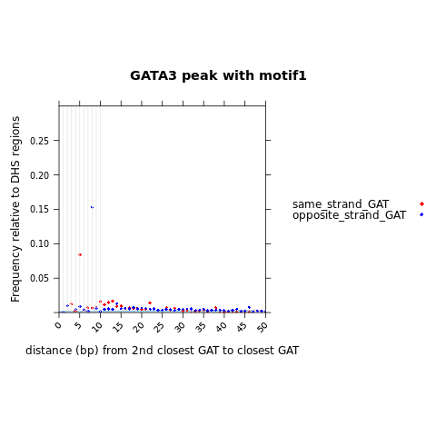 
```

```{r  fig.align = "center", out.width="80%", out.height="80%", echo=F, fig.align = "center", fig.cap="xy plot of GATA3 peak with motif2 relative to the DHS regions: 3mer structure"}
#library(knitr)
 
```

```{r  fig.align = "center", out.width="80%", out.height="80%", echo=F, fig.align = "center", fig.cap="xy plot of GATA3 peak with motif4 relative to the DHS regions: 3mer structure"}
#library(knitr)
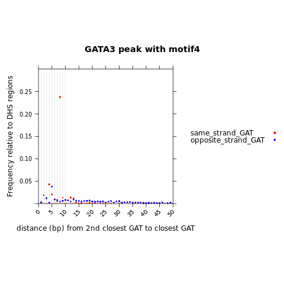 
```

```{r  fig.align = "center", out.width="80%", out.height="80%", echo=F, fig.align = "center", fig.cap="xy plot of GATA3 peak with motif5 relative to the DHS regions: 3mer structure"}
#library(knitr)
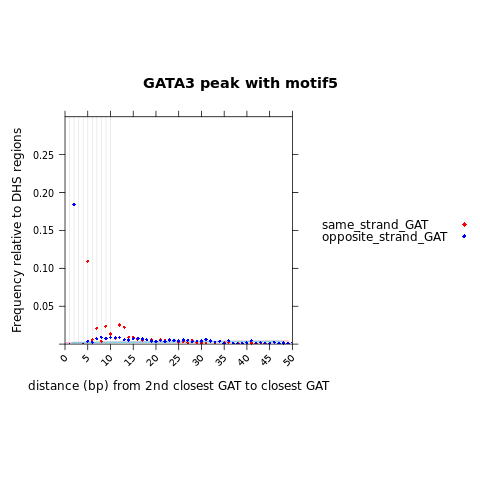 
```

```{r  fig.align = "center", out.width="80%", out.height="80%", echo=F, fig.align = "center", fig.cap="xy plot of GATA3 peak with motif6 relative to the DHS regions: 3mer structure"}
#library(knitr)
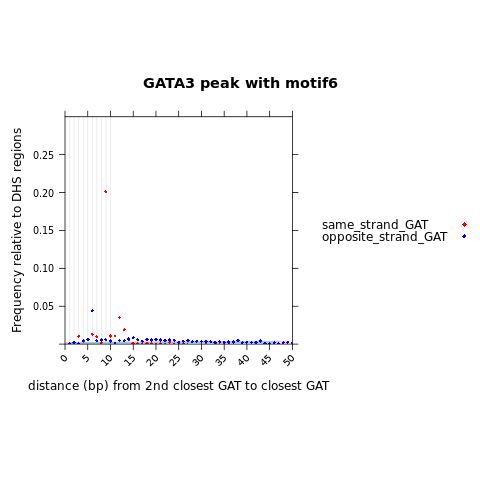 
```


# Automate analysis to go through the prioritized 3mers

In our previous analysis, we placed emphasis on certain 3-mers by assessing their enrichment in GATA3 peaks relative to DHS regions. This enrichment was determined by calculating the differences in cumulative distribution function (CDF) fractions at a specified "closed" distance (both 16bp and 20bp yield the same 3-mer cluster). \

These prioritized 3mer includes "AAA" "TAA" "ATA" "TTA" "AAT" "TAT" "GAT" "ATT" "TTT" "ATC". \

Here, I want to \
1) Extract patterns from RSAT analysis that related to these 3mer combination and compare with the above analysis. \

2) Automate customized analysis to go through the prioritized 3mers to measure the 2nd 3mer distance to the anchored 3mer.  \

First use GATA3 peaks with motif1 to do some test run, then perform the analysis to all 5 positive peak sets. Finally we want to apply to the peaks without motifs. \


## RSAT-dyad analysis -- prioritized 3mer

### Enrichment xy plot

Load the package, and the function to process the RSAT results file: \
```{r engine='R', eval=F, echo=TRUE}
library(Biostrings)
process_and_subset_RSAT <- function(file_path, pattern1, pattern2, number) {
  # Read the file
  input_data <- read.table(file_path, header = FALSE, sep = "\t")

  # Split the first column into components
  components_list <- strsplit(input_data$V1, "n\\{|\\}")

  processed_data <- data.frame(
    first = sapply(components_list, function(x) x[1]),
    dyad_distance = as.numeric(sapply(components_list, function(x) x[2])),
    second = sapply(components_list, function(x) x[3]),
    ratio = input_data$V8 # ratio
  )
  # patterns to DNAstring
  pattern1<-DNAString(pattern1)
  pattern2<-DNAString(pattern2)
  # Get the reverse complement of the patterns
  rc_pattern1 <- reverseComplement(pattern1)
  rc_pattern2 <- reverseComplement(pattern2)

  # Subset the dataframe based on the specified patterns and their reverse complements
  if (pattern1 == pattern2) {
    # Get the reverse complement of the patterns
    rc_pattern1 <- reverseComplement(pattern1)
    rc_pattern2 <- reverseComplement(pattern2)

    # Subset the dataframe based on the specified patterns and their reverse complements
    dyad_structure <- processed_data[grepl(pattern1, processed_data$first, ignore.case = TRUE) & grepl(pattern2, processed_data$second, ignore.case = TRUE), ]
    dyad_structure_rc <- processed_data[grepl(rc_pattern1, processed_data$first, ignore.case = TRUE) & grepl(rc_pattern2, processed_data$second, ignore.case = TRUE), ]
    
    output_data <- rbind(dyad_structure, dyad_structure_rc)
  } else {
    # If patterns are not the same, only subset based on pattern1 and pattern2
    output_data <- processed_data[grepl(pattern1, processed_data$first, ignore.case = TRUE) & grepl(pattern2, processed_data$second, ignore.case = TRUE), ]
  }
    
  # Order by descending ratio
  output_data <- output_data[order(-output_data$ratio), ]

  # Add the relative distance column
  output_data$relative_distance <- output_data$dyad_distance + number

  return(output_data)
}
```

In the provided function, **pattern1** represents the anchored dyad, **pattern2** denotes the other half dyad, and **number** signifies the user-defined distance (representing the relative separation between two zinc fingers, with "G" serving as the single resolution) when there is no spacing between each dyad. \

For AAT and ATT, there is two possible relative "G/C". One is (gat)AAT/ATT(atc), one is AAT(c)/(g)ATT. \
I have examined the Information Content (IC) in all Sequence logos of the Information Content Matrix, and examined the letter-probability matrix to determine which configiration is more common/more likely to observe. \
Overall, AAT(c)/(g)ATT have higher IC compared to (gat)AAT/ATT(atc). \
I will use AAT(c)/(g)ATT to anchor at the 'G/C' base for measuring the relative distance between the two zinc fingers. \


I've created a file that simplifies the computation of the 'number' for any given pair of dyads. It operates by adding the corresponding numbers associated with the anchor (pattern1) or query (pattern2) pattern. \
```{r engine='R', eval=TRUE, echo=TRUE}
#pattern_anchor_at_G_compute_dis.csv
read.csv('pattern_anchor_at_G_compute_dis.csv')
```


```{r engine='R', eval=F, echo=TRUE}
library(lattice)
library(latticeExtra)
library(Biostrings)

my_motifs = c("motif_1", "motif_4","motif_2", "motif_6", "motif_5")
Anchor_dyad = c("AAA", "TAA" ,"ATA" ,"TTA", "AAT", "TAT", "GAT", "ATT", "TTT", "ATC")
Query_dyad =c("AAA", "TAA" ,"ATA" ,"TTA", "AAT", "TAT", "GAT", "ATT", "TTT", "ATC")

compute_dis_df=read.csv('pattern_anchor_at_G_compute_dis.csv')

for (motif in my_motifs) {
  print(motif)
  rsat_results=paste0("GATA3_peak_161win_with_", motif, "_RSAT_dyad.txt")
  for (pattern1 in Anchor_dyad){
    print(pattern1)
    for (pattern2 in Query_dyad){
      print(pattern2)
      number1=compute_dis_df[compute_dis_df$pattern==pattern1, "anchor"] + compute_dis_df[compute_dis_df$pattern==pattern2, "query"]
      rc_pattern2=reverseComplement(DNAString(pattern2))
      print(rc_pattern2)
      number2=compute_dis_df[compute_dis_df$pattern==pattern1, "anchor"] + compute_dis_df[compute_dis_df$pattern==as.character(rc_pattern2), "query"]
        
      ss <- process_and_subset_RSAT(rsat_results, pattern1, pattern2, number1)
      os <- process_and_subset_RSAT(rsat_results, pattern1, rc_pattern2, number2)
      
      if(nrow(ss) > 0) {
                        ss$query_status <- paste0("same_strand_", pattern2)
                        } else {
                        ss <- data.frame(matrix(NA, ncol = ncol(ss), nrow = 1)) # Fill ss dataframe with NA values for all columns
                        colnames(ss) <- c("first", "dyad_distance", "second", "ratio","relative_distance")
                        ss$query_status <- paste0("same_strand_", pattern2)
                        }

      if(nrow(os) > 0) {
                        os$query_status <- paste0("opposite_strand_", pattern2)
                        } else {
                        os <- data.frame(matrix(NA, ncol = ncol(os), nrow = 1)) # Fill os dataframe with NA values for all columns
                        colnames(os) <- c("first", "dyad_distance", "second", "ratio","relative_distance")
                        os$query_status <- paste0("opposite_strand_", pattern2)
                        }
      
      df.plot=rbind(ss, os)
      df.plot$query_status = factor(df.plot$query_status, levels = c(paste0("same_strand_", pattern2), paste0("opposite_strand_", pattern2)))
      
      # xy plot
      pdf(paste0('test_xy_RSAT_dyad_closest_2nd_', pattern2, '_to_closest_1st_', pattern1, '_to_GATA3_pos_', motif, '_compare_to_DHS.pdf'), width=10,height=6)
      print(xyplot(ratio ~ relative_distance,
                   data = df.plot, 
                   groups = query_status,
                   auto.key=list(space="right", points=TRUE),
                   aspect = 1,
                   xlim=c(0,30),
                   ylim=c(0, 500),
                   xlab = paste0("distance (bp) from 2nd closest ",pattern2, " to closest ", pattern1),
                   ylab="RSAT obs/exp Ratio",
                   main=paste0("GATA3 peak with ", motif),
                   between=list(y=1.0),
                   scales = list(x = list(rot = 45, at = seq(from = 0, to = 50, by = 5))),
                   par.settings = list(superpose.symbol = list(col=c("orange", "darkgreen"), pch=18, lwd=2), strip.background=list(col="grey85")),
                   panel = function(x,y,...) {panel.abline(v=c(seq(1, 10, 1)), col = "grey90")
                                              panel.xyplot(x, y, 
                                                           col=c("orange","darkgreen"), 
                                                           pch=18, 
                                                           cex=0.6,...)
                                              #panel.barchart(x,y, horizontal = FALSE, col=c("red", "blue"), alpha=0.4)
                                      
                                      
                 }))
     dev.off()
    }  
  } 
}
```

test: \
```{r engine='R', eval=F, echo=TRUE}
library(lattice)
library(latticeExtra)
library(Biostrings)
my_motifs = c("motif_1")
Anchor_dyad = c("GAT")
Query_dyad =c("GAT")
compute_dis_df=read.csv('pattern_anchor_at_G_compute_dis.csv')

for (motif in my_motifs) {
  print(motif)
  rsat_results=paste0("GATA3_peak_161win_with_", motif, "_RSAT_dyad.txt")
  for (pattern1 in Anchor_dyad){
    print(pattern1)
    for (pattern2 in Query_dyad){
      print(pattern2)
      number1=compute_dis_df[compute_dis_df$pattern==pattern1, "anchor"] + compute_dis_df[compute_dis_df$pattern==pattern2, "query"]
      rc_pattern2=reverseComplement(DNAString(pattern2))
      print(rc_pattern2)
      number2=compute_dis_df[compute_dis_df$pattern==pattern1, "anchor"] + compute_dis_df[compute_dis_df$pattern==as.character(rc_pattern2), "query"]
        
      ss <- process_and_subset_RSAT(rsat_results, pattern1, pattern2, number1)
      os <- process_and_subset_RSAT(rsat_results, pattern1, rc_pattern2, number2)
      
      if(nrow(ss) > 0) {
                        ss$query_status <- paste0("same_strand_", pattern2)
                        } else {
                        ss <- data.frame(matrix(NA, ncol = ncol(ss), nrow = 1)) # Fill ss dataframe with NA values for all columns
                        colnames(ss) <- c("first", "dyad_distance", "second", "ratio","relative_distance")
                        ss$query_status <- paste0("same_strand_", pattern2)
                        }

      if(nrow(os) > 0) {
                        os$query_status <- paste0("opposite_strand_", pattern2)
                        } else {
                        os <- data.frame(matrix(NA, ncol = ncol(os), nrow = 1)) # Fill os dataframe with NA values for all columns
                        colnames(os) <- c("first", "dyad_distance", "second", "ratio","relative_distance")
                        os$query_status <- paste0("opposite_strand_", pattern2)
                        }
      
      df.plot=rbind(ss, os)
      df.plot$query_status = factor(df.plot$query_status, levels = c(paste0("same_strand_", pattern2), paste0("opposite_strand_", pattern2)))
      
      # xy plot
      pdf(paste0('test_xy_RSAT_dyad_closest_2nd_', pattern2, '_to_closest_1st_', pattern1, '_to_GATA3_pos_', motif, '_compare_to_DHS.pdf'), width=10,height=6)
      print(xyplot(ratio ~ relative_distance,
                   data = df.plot, 
                   groups = query_status,
                   auto.key=list(space="right", points=TRUE),
                   aspect = 1,
                   xlim=c(0,30),
                   ylim=c(0, 500),
                   xlab = paste0("distance (bp) from 2nd closest ",pattern2, " to closest ", pattern1),
                   ylab="RSAT obs/exp Ratio",
                    main=paste0("GATA3 peak with ", motif),
                   between=list(y=1.0),
                   scales = list(x = list(rot = 45, at = seq(from = 0, to = 50, by = 5))),
                   par.settings = list(superpose.symbol = list(col=c("orange", "darkgreen"), pch=18, lwd=2), strip.background=list(col="grey85")),
                   panel = function(x,y,...) {panel.abline(v=c(seq(1, 10, 1)), col = "grey90")
                                              panel.xyplot(x, y, 
                                                           col=c("orange","darkgreen"), 
                                                           pch=18, 
                                                           cex=0.6,...)
                                              #panel.barchart(x,y, horizontal = FALSE, col=c("red", "blue"), alpha=0.4)
                                      
                                      
                 }))
     dev.off()
    }  
  } 
}
```
test2: \
```{r engine='R', eval=F, echo=TRUE}
library(lattice)
library(latticeExtra)
library(Biostrings)
my_motifs = c("motif_1")
Anchor_dyad = c("TAA")
Query_dyad =c("AAA")
compute_dis_df=read.csv('pattern_anchor_at_G_compute_dis.csv')

for (motif in my_motifs) {
  print(motif)
  rsat_results=paste0("GATA3_peak_161win_with_", motif, "_RSAT_dyad.txt")
  for (pattern1 in Anchor_dyad){
    print(pattern1)
    for (pattern2 in Query_dyad){
      print(pattern2)
      number1=compute_dis_df[compute_dis_df$pattern==pattern1, "anchor"] + compute_dis_df[compute_dis_df$pattern==pattern2, "query"]
      rc_pattern2=reverseComplement(DNAString(pattern2))
      print(rc_pattern2)
      number2=compute_dis_df[compute_dis_df$pattern==pattern1, "anchor"] + compute_dis_df[compute_dis_df$pattern==as.character(rc_pattern2), "query"]
        
      ss <- process_and_subset_RSAT(rsat_results, pattern1, pattern2, number1)
      os <- process_and_subset_RSAT(rsat_results, pattern1, rc_pattern2, number2)
      
      if(nrow(ss) > 0) {
                        ss$query_status <- paste0("same_strand_", pattern2)
                        } else {
                        ss <- data.frame(matrix(NA, ncol = ncol(ss), nrow = 1)) # Fill ss dataframe with NA values for all columns
                        colnames(ss) <- c("first", "dyad_distance", "second", "ratio","relative_distance")
                        ss$query_status <- paste0("same_strand_", pattern2)
                        }

      if(nrow(os) > 0) {
                        os$query_status <- paste0("opposite_strand_", pattern2)
                        } else {
                        os <- data.frame(matrix(NA, ncol = ncol(os), nrow = 1)) # Fill os dataframe with NA values for all columns
                        colnames(os) <- c("first", "dyad_distance", "second", "ratio","relative_distance")
                        os$query_status <- paste0("opposite_strand_", pattern2)
                        }
      
      df.plot=rbind(ss, os)
      df.plot$query_status = factor(df.plot$query_status, levels = c(paste0("same_strand_", pattern2), paste0("opposite_strand_", pattern2)))
      
      # xy plot
      pdf(paste0('test_xy_RSAT_dyad_closest_2nd_', pattern2, '_to_closest_1st_', pattern1, '_to_GATA3_pos_', motif, '_compare_to_DHS.pdf'), width=10,height=6)
      print(xyplot(ratio ~ relative_distance,
                   data = df.plot, 
                   groups = query_status,
                   auto.key=list(space="right", points=TRUE),
                   aspect = 1,
                   xlim=c(0,30),
                   ylim=c(0, 500),
                   xlab = paste0("distance (bp) from 2nd closest ",pattern2, " to closest ", pattern1),
                   ylab="RSAT obs/exp Ratio",
                    main=paste0("GATA3 peak with ", motif),
                   between=list(y=1.0),
                   scales = list(x = list(rot = 45, at = seq(from = 0, to = 50, by = 5))),
                   par.settings = list(superpose.symbol = list(col=c("orange", "darkgreen"), pch=18, lwd=2), strip.background=list(col="grey85")),
                   panel = function(x,y,...) {panel.abline(v=c(seq(1, 10, 1)), col = "grey90")
                                              panel.xyplot(x, y, 
                                                           col=c("orange","darkgreen"), 
                                                           pch=18, 
                                                           cex=0.6,...)
                                              #panel.barchart(x,y, horizontal = FALSE, col=c("red", "blue"), alpha=0.4)
                                      
                                      
                 }))
     dev.off()
    }  
  } 
}
```

Anchor at one of the top 10 prioritized 3-mers, then query the remaining 10 3-mers on either the same strand or the opposite strand. This generates a 10x10=100 enrichment graph for each of the five peak data sets, resulting in a total of 500 enrichment graphs. \

### Ranking dyad-structure

Another method to identify the most enriched structure within each peak dataset is by ranking the files (from the 5 peak sets) based on the observed-to-expected (obs/exp) ratio. This allows us to determine which structural motif is enriched, followed by a search for the corresponding enrichment graph. \

Files generated: \
GATA3_peak_161win_with_motif_1_RSAT_dyad.txt \
GATA3_peak_161win_with_motif_2_RSAT_dyad.txt \
GATA3_peak_161win_with_motif_4_RSAT_dyad.txt \
GATA3_peak_161win_with_motif_5_RSAT_dyad.txt \
GATA3_peak_161win_with_motif_6_RSAT_dyad.txt \

**GATA3 peak with motif1** \

```{r engine='bash', eval=TRUE, echo=TRUE}
cat GATA3_peak_161win_with_motif_1_RSAT_dyad.txt | sort -k8,8nr | head -3
```


**GATA3 peak with motif2** \

```{r engine='bash', eval=TRUE, echo=TRUE}
cat GATA3_peak_161win_with_motif_2_RSAT_dyad.txt | sort -k8,8nr | head -3
```

**GATA3 peak with motif4** \
```{r engine='bash', eval=TRUE, echo=TRUE}
cat GATA3_peak_161win_with_motif_4_RSAT_dyad.txt | sort -k8,8nr | head -8
```
**GATA3 peak with motif5** \
```{r engine='bash', eval=TRUE, echo=TRUE}
cat GATA3_peak_161win_with_motif_5_RSAT_dyad.txt | sort -k8,8nr | head -10

```

```{r engine='bash', eval=TRUE, echo=TRUE}
awk -F'\t' '$1 ~ /^gat.*gat/' GATA3_peak_161win_with_motif_5_RSAT_dyad.txt | head
awk -F'\t' '$1 ~ /^atc.*atc/' GATA3_peak_161win_with_motif_5_RSAT_dyad.txt | head
echo ""
awk -F'\t' '$1 ~ /^gat.*atc/' GATA3_peak_161win_with_motif_5_RSAT_dyad.txt | head

echo ""
awk -F'\t' '$1 ~ /^atc.*gat/' GATA3_peak_161win_with_motif_5_RSAT_dyad.txt | head
```

**GATA3 peak with motif6** \
```{r engine='bash', eval=TRUE, echo=TRUE}
cat GATA3_peak_161win_with_motif_6_RSAT_dyad.txt | sort -k8,8nr | head -3
```

In the above 5 GATA3 peak data sets, it seems that **AGA-TAA**, **GAT-ATC**, **ATA-ATC**, **ATC-ATC**, **TAG-ATA**, **ATC-GAT**, **ATC-ATA** and **GAT-ATA** are enriched in GATA3 peaks contains GATA3 motifs. \

#### AGA-TAA
Unfortunately, **AGA** is not included in our prioritized list, but it is ranked just after TTT/AAA. Therefore, we can include an analysis of this 3-mer here. \
And in our customized analysis, we might also include AGA/TCT to our prioritized 3mer list. \

```{r engine='R', eval=TRUE, echo=TRUE}
library(lattice)
library(latticeExtra)
library(Biostrings)
my_motifs = c("motif_1", "motif_4","motif_2", "motif_6", "motif_5")
Anchor_dyad = c("AGA")
Query_dyad =c("TAA")
compute_dis_df=read.csv('pattern_anchor_at_G_compute_dis.csv')

for (motif in my_motifs) {
  print(motif)
  rsat_results=paste0("GATA3_peak_161win_with_", motif, "_RSAT_dyad.txt")
  for (pattern1 in Anchor_dyad){
    print(pattern1)
    for (pattern2 in Query_dyad){
      print(pattern2)
      number1=compute_dis_df[compute_dis_df$pattern==pattern1, "anchor"] + compute_dis_df[compute_dis_df$pattern==pattern2, "query"]
      rc_pattern2=reverseComplement(DNAString(pattern2))
      print(rc_pattern2)
      number2=compute_dis_df[compute_dis_df$pattern==pattern1, "anchor"] + compute_dis_df[compute_dis_df$pattern==as.character(rc_pattern2), "query"]
        
      ss <- process_and_subset_RSAT(rsat_results, pattern1, pattern2, number1)
      os <- process_and_subset_RSAT(rsat_results, pattern1, rc_pattern2, number2)
      
      if(nrow(ss) > 0) {
                        ss$query_status <- paste0("same_strand_", pattern2)
                        } else {
                        ss <- data.frame(matrix(NA, ncol = ncol(ss), nrow = 1)) # Fill ss dataframe with NA values for all columns
                        colnames(ss) <- c("first", "dyad_distance", "second", "ratio","relative_distance")
                        ss$query_status <- paste0("same_strand_", pattern2)
                        }

      if(nrow(os) > 0) {
                        os$query_status <- paste0("opposite_strand_", pattern2)
                        } else {
                        os <- data.frame(matrix(NA, ncol = ncol(os), nrow = 1)) # Fill os dataframe with NA values for all columns
                        colnames(os) <- c("first", "dyad_distance", "second", "ratio","relative_distance")
                        os$query_status <- paste0("opposite_strand_", pattern2)
                        }
      
      df.plot=rbind(ss, os)
      df.plot$query_status = factor(df.plot$query_status, levels = c(paste0("same_strand_", pattern2), paste0("opposite_strand_", pattern2)))
      
      # xy plot
      pdf(paste0('xy_RSAT_dyad_closest_2nd_', pattern2, '_to_closest_1st_', pattern1, '_to_GATA3_pos_', motif, '_compare_to_DHS.pdf'), width=10,height=6)
      print(xyplot(ratio ~ relative_distance,
                   data = df.plot, 
                   groups = query_status,
                   auto.key=list(space="right", points=TRUE),
                   aspect = 1,
                   xlim=c(-1,30),
                   ylim=c(0, 500),
                   xlab = paste0("distance (bp) from 2nd closest ",pattern2, " to closest ", pattern1),
                   ylab="RSAT obs/exp Ratio",
                    main=paste0("GATA3 peak with ", motif),
                   between=list(y=1.0),
                   scales = list(x = list(rot = 45, at = seq(from = 0, to = 50, by = 5))),
                   par.settings = list(superpose.symbol = list(col=c("orange", "darkgreen"), pch=18, lwd=2), strip.background=list(col="grey85")),
                   panel = function(x,y,...) {panel.abline(v=c(seq(1, 10, 1)), col = "grey90")
                                              panel.xyplot(x, y, 
                                                           col=c("orange","darkgreen"), 
                                                           pch=18, 
                                                           cex=0.6,...)
                                              #panel.barchart(x,y, horizontal = FALSE, col=c("red", "blue"), alpha=0.4)
                                      
                                      
                 }))
     dev.off()
    }  
  } 
}

```

```{r  fig.align = "center", out.width="80%", out.height="80%", echo=F, fig.align = "center", fig.cap="xy plot of rsat analysis for GATA3 peak with motif4: 3mer structure"}
#library(knitr)
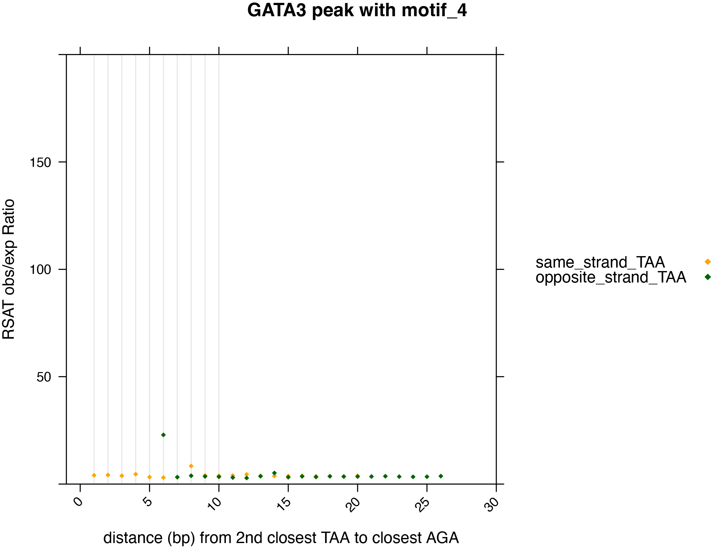 
```

All enrichment graphs show enrichment of a dyad structure with AGA 6bp distal from the opposite strand TAA, which is a [AGA][TTA]TC. With a relative distance from G to C being 6bp. \

We did not observe enrichment at a relative distance of 0 between AGA and TAA on the same strand. This is because a relative distance of 0 between two zinc fingers implies that only one zinc finger is binding in that location, indicating the absence of a dyad structure. Similarly, when we did not observe enrichment for the AGATAA structure in our graph, it's because AGATAA is considered a single binding site, rather than two separate motifs. \


#### GAT-ATC

```{r engine='R', eval=TRUE, echo=TRUE}
library(lattice)
library(latticeExtra)
library(Biostrings)
my_motifs = c("motif_1", "motif_4","motif_2", "motif_6", "motif_5")
Anchor_dyad = c("GAT")
Query_dyad =c("ATC")
compute_dis_df=read.csv('pattern_anchor_at_G_compute_dis.csv')

for (motif in my_motifs) {
  print(motif)
  rsat_results=paste0("GATA3_peak_161win_with_", motif, "_RSAT_dyad.txt")
  for (pattern1 in Anchor_dyad){
    print(pattern1)
    for (pattern2 in Query_dyad){
      print(pattern2)
      number1=compute_dis_df[compute_dis_df$pattern==pattern1, "anchor"] + compute_dis_df[compute_dis_df$pattern==pattern2, "query"]
      rc_pattern2=reverseComplement(DNAString(pattern2))
      print(rc_pattern2)
      number2=compute_dis_df[compute_dis_df$pattern==pattern1, "anchor"] + compute_dis_df[compute_dis_df$pattern==as.character(rc_pattern2), "query"]
        
      ss <- process_and_subset_RSAT(rsat_results, pattern1, pattern2, number1)
      os <- process_and_subset_RSAT(rsat_results, pattern1, rc_pattern2, number2)
      
      if(nrow(ss) > 0) {
                        ss$query_status <- paste0("same_strand_", pattern2)
                        } else {
                        ss <- data.frame(matrix(NA, ncol = ncol(ss), nrow = 1)) # Fill ss dataframe with NA values for all columns
                        colnames(ss) <- c("first", "dyad_distance", "second", "ratio","relative_distance")
                        ss$query_status <- paste0("same_strand_", pattern2)
                        }

      if(nrow(os) > 0) {
                        os$query_status <- paste0("opposite_strand_", pattern2)
                        } else {
                        os <- data.frame(matrix(NA, ncol = ncol(os), nrow = 1)) # Fill os dataframe with NA values for all columns
                        colnames(os) <- c("first", "dyad_distance", "second", "ratio","relative_distance")
                        os$query_status <- paste0("opposite_strand_", pattern2)
                        }
      
      df.plot=rbind(ss, os)
      df.plot$query_status = factor(df.plot$query_status, levels = c(paste0("same_strand_", pattern2), paste0("opposite_strand_", pattern2)))
      
      # xy plot
      png(paste0('xy_RSAT_dyad_closest_2nd_', pattern2, '_to_closest_1st_', pattern1, '_to_GATA3_pos_', motif, '_compare_to_DHS.png'))
      print(xyplot(ratio ~ relative_distance,
                   data = df.plot, 
                   groups = query_status,
                   auto.key=list(space="right", points=TRUE),
                   aspect = 1,
                   xlim=c(-1,30),
                   ylim=c(0, 500),
                   xlab = paste0("distance (bp) from 2nd closest ",pattern2, " to closest ", pattern1),
                   ylab="RSAT obs/exp Ratio",
                    main=paste0("GATA3 peak with ", motif),
                   between=list(y=1.0),
                   scales = list(x = list(rot = 45, at = seq(from = 0, to = 50, by = 5))),
                   par.settings = list(superpose.symbol = list(col=c("orange", "darkgreen"), pch=18, lwd=2), strip.background=list(col="grey85")),
                   panel = function(x,y,...) {panel.abline(v=c(seq(1, 10, 1)), col = "grey90")
                                              panel.xyplot(x, y, 
                                                           col=c("orange","darkgreen"), 
                                                           pch=18, 
                                                           cex=0.6,...)
                                              #panel.barchart(x,y, horizontal = FALSE, col=c("red", "blue"), alpha=0.4)
                                      
                                      
                 }))
     dev.off()
    }  
  } 
}

```

**GATA3 peak with motif1** \
```{r  fig.align = "center", out.width="80%", out.height="80%", echo=F, fig.align = "center", fig.cap="xy plot of rsat analysis for GATA3 peak with motif1: 3mer structure"}
#library(knitr)
 
```
For GATA3 peaks with motif1, we have seen an enriched dyad structure of a GAT with 8bp relative distance to its same strand ATC. \
This is same as the RSAT defined GATn{3}ATC which rank as second highest ratio. And also match the motif1 PWMs/seqlogo. \


**GATA3 peak with motif2** \

```{r  fig.align = "center", out.width="80%", out.height="80%", echo=F, fig.align = "center", fig.cap="xy plot of rsat analysis for GATA3 peak with motif2: 3mer structure"}
#library(knitr)
 
```
For GATA3 peaks with motif2, we have seen an enriched dyad structure of a GAT with 9bp relative distance to its same strand ATC. \
This is same as the RSAT defined GATn{4}ATC which rank as second highest ratio. And also match the motif2 PWMs/seqlogo. \


**GATA3 peak with motif4** \
```{r  fig.align = "center", out.width="80%", out.height="80%", echo=F, fig.align = "center", fig.cap="xy plot of rsat analysis for GATA3 peak with motif4: 3mer structure"}
#library(knitr)
 
```

For GATA3 peaks with motif4, we have seen an enriched dyad structure of a GAT with 8bp relative distance to its opposite strand ATC (same as the same strand GAT). \
This is same as the RSAT defined atcn{5}atc/gatn{5}gat which rank as second highest ratio. And also match the motif4 PWMs/seqlogo. \

**GATA3 peak with motif6** \
```{r  fig.align = "center", out.width="80%", out.height="80%", echo=F, fig.align = "center", fig.cap="xy plot of rsat analysis for GATA3 peak with motif6: 3mer structure"}
#library(knitr)
 
```
For GATA3 peaks with motif6, we have seen an enriched dyad structure of a GAT with 9bp relative distance to its opposite strand ATC. \
This is same as the RSAT defined atcn{6}atc|gatn{6}gat which rank as second highest ratio. And also match the motif2 PWMs/seqlogo. \


**GATA3 peak with motif5** \
```{r  fig.align = "center", out.width="80%", out.height="80%", echo=F, fig.align = "center", fig.cap="xy plot of rsat analysis for GATA3 peak with motif5: 3mer structure"}
#library(knitr)
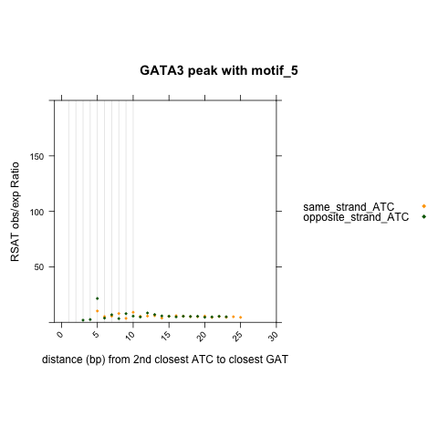 
```
For GATA3 peaks with motif5, we did not see a very enriched dyad structure for GAT relative to +/- ATC. The relative distance at 5bp may or may not be enriched (afterall the ratio seems to be below 25). This is expected, because motif5 has a specific structure of ATCn{1}GAT, which ranked as 2nd highest ratio in the rsat results. This structure is different than GAT relative to +/- ATC. \


#### ATC-GAT

```{r engine='R', eval=TRUE, echo=TRUE}
library(lattice)
library(latticeExtra)
library(Biostrings)
my_motifs = c("motif_1", "motif_4","motif_2", "motif_6", "motif_5")
Anchor_dyad = c("ATC")
Query_dyad =c("GAT")
compute_dis_df=read.csv('pattern_anchor_at_G_compute_dis.csv')

for (motif in my_motifs) {
  print(motif)
  rsat_results=paste0("GATA3_peak_161win_with_", motif, "_RSAT_dyad.txt")
  for (pattern1 in Anchor_dyad){
    print(pattern1)
    for (pattern2 in Query_dyad){
      print(pattern2)
      number1=compute_dis_df[compute_dis_df$pattern==pattern1, "anchor"] + compute_dis_df[compute_dis_df$pattern==pattern2, "query"]
      rc_pattern2=reverseComplement(DNAString(pattern2))
      print(rc_pattern2)
      number2=compute_dis_df[compute_dis_df$pattern==pattern1, "anchor"] + compute_dis_df[compute_dis_df$pattern==as.character(rc_pattern2), "query"]
        
      ss <- process_and_subset_RSAT(rsat_results, pattern1, pattern2, number1)
      os <- process_and_subset_RSAT(rsat_results, pattern1, rc_pattern2, number2)
      
      if(nrow(ss) > 0) {
                        ss$query_status <- paste0("same_strand_", pattern2)
                        } else {
                        ss <- data.frame(matrix(NA, ncol = ncol(ss), nrow = 1)) # Fill ss dataframe with NA values for all columns
                        colnames(ss) <- c("first", "dyad_distance", "second", "ratio","relative_distance")
                        ss$query_status <- paste0("same_strand_", pattern2)
                        }

      if(nrow(os) > 0) {
                        os$query_status <- paste0("opposite_strand_", pattern2)
                        } else {
                        os <- data.frame(matrix(NA, ncol = ncol(os), nrow = 1)) # Fill os dataframe with NA values for all columns
                        colnames(os) <- c("first", "dyad_distance", "second", "ratio","relative_distance")
                        os$query_status <- paste0("opposite_strand_", pattern2)
                        }
      
      df.plot=rbind(ss, os)
      df.plot$query_status = factor(df.plot$query_status, levels = c(paste0("same_strand_", pattern2), paste0("opposite_strand_", pattern2)))
      
      # xy plot
      png(paste0('xy_RSAT_dyad_closest_2nd_', pattern2, '_to_closest_1st_', pattern1, '_to_GATA3_pos_', motif, '_compare_to_DHS.png'))
      print(xyplot(ratio ~ relative_distance,
                   data = df.plot, 
                   groups = query_status,
                   auto.key=list(space="right", points=TRUE),
                   aspect = 1,
                   xlim=c(-1,30),
                   ylim=c(0, 500),
                   xlab = paste0("distance (bp) from 2nd closest ",pattern2, " to closest ", pattern1),
                   ylab="RSAT obs/exp Ratio",
                    main=paste0("GATA3 peak with ", motif),
                   between=list(y=1.0),
                   scales = list(x = list(rot = 45, at = seq(from = 0, to = 50, by = 5))),
                   par.settings = list(superpose.symbol = list(col=c("orange", "darkgreen"), pch=18, lwd=2), strip.background=list(col="grey85")),
                   panel = function(x,y,...) {panel.abline(v=c(seq(1, 10, 1)), col = "grey90")
                                              panel.xyplot(x, y, 
                                                           col=c("orange","darkgreen"), 
                                                           pch=18, 
                                                           cex=0.6,...)
                                              #panel.barchart(x,y, horizontal = FALSE, col=c("red", "blue"), alpha=0.4)
                                      
                                      
                 }))
     dev.off()
    }  
  } 
}

```

**GATA3 peak with motif5** \
```{r  fig.align = "center", out.width="80%", out.height="80%", echo=F, fig.align = "center", fig.cap="xy plot of rsat analysis for GATA3 peak with motif6: 3mer structure"}
#library(knitr)
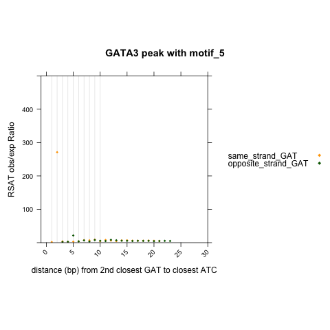 
```

As previous mentioned, now we see an enriched dyad structure of a ATC with 2bp relative distance to its opposite strand GAT, for peaks with motif5. \

This is same as the RSAT defined atcn{1}gat which rank as second highest ratio. And also match the motif5 PWMs/seqlogo. \

#### ATA-ATC
This structure is only enriched in GATA3 peaks with motif1 and motif2 according to RSAT results. \

```{r engine='R', eval=TRUE, echo=TRUE}
library(lattice)
library(latticeExtra)
library(Biostrings)
my_motifs = c("motif_1", "motif_4","motif_2", "motif_6", "motif_5")
Anchor_dyad = c("ATA")
Query_dyad =c("ATC")
compute_dis_df=read.csv('pattern_anchor_at_G_compute_dis.csv')

for (motif in my_motifs) {
  print(motif)
  rsat_results=paste0("GATA3_peak_161win_with_", motif, "_RSAT_dyad.txt")
  for (pattern1 in Anchor_dyad){
    print(pattern1)
    for (pattern2 in Query_dyad){
      print(pattern2)
      number1=compute_dis_df[compute_dis_df$pattern==pattern1, "anchor"] + compute_dis_df[compute_dis_df$pattern==pattern2, "query"]
      rc_pattern2=reverseComplement(DNAString(pattern2))
      print(rc_pattern2)
      number2=compute_dis_df[compute_dis_df$pattern==pattern1, "anchor"] + compute_dis_df[compute_dis_df$pattern==as.character(rc_pattern2), "query"]
        
      ss <- process_and_subset_RSAT(rsat_results, pattern1, pattern2, number1)
      os <- process_and_subset_RSAT(rsat_results, pattern1, rc_pattern2, number2)
      
      if(nrow(ss) > 0) {
                        ss$query_status <- paste0("same_strand_", pattern2)
                        } else {
                        ss <- data.frame(matrix(NA, ncol = ncol(ss), nrow = 1)) # Fill ss dataframe with NA values for all columns
                        colnames(ss) <- c("first", "dyad_distance", "second", "ratio","relative_distance")
                        ss$query_status <- paste0("same_strand_", pattern2)
                        }

      if(nrow(os) > 0) {
                        os$query_status <- paste0("opposite_strand_", pattern2)
                        } else {
                        os <- data.frame(matrix(NA, ncol = ncol(os), nrow = 1)) # Fill os dataframe with NA values for all columns
                        colnames(os) <- c("first", "dyad_distance", "second", "ratio","relative_distance")
                        os$query_status <- paste0("opposite_strand_", pattern2)
                        }
      
      df.plot=rbind(ss, os)
      df.plot$query_status = factor(df.plot$query_status, levels = c(paste0("same_strand_", pattern2), paste0("opposite_strand_", pattern2)))
      
      # xy plot
      png(paste0('xy_RSAT_dyad_closest_2nd_', pattern2, '_to_closest_1st_', pattern1, '_to_GATA3_pos_', motif, '_compare_to_DHS.png'))
      print(xyplot(ratio ~ relative_distance,
                   data = df.plot, 
                   groups = query_status,
                   auto.key=list(space="right", points=TRUE),
                   aspect = 1,
                   xlim=c(-1,30),
                   ylim=c(0, 500),
                   xlab = paste0("distance (bp) from 2nd closest ",pattern2, " to closest ", pattern1),
                   ylab="RSAT obs/exp Ratio",
                    main=paste0("GATA3 peak with ", motif),
                   between=list(y=1.0),
                   scales = list(x = list(rot = 45, at = seq(from = 0, to = 50, by = 5))),
                   par.settings = list(superpose.symbol = list(col=c("orange", "darkgreen"), pch=18, lwd=2), strip.background=list(col="grey85")),
                   panel = function(x,y,...) {panel.abline(v=c(seq(1, 10, 1)), col = "grey90")
                                              panel.xyplot(x, y, 
                                                           col=c("orange","darkgreen"), 
                                                           pch=18, 
                                                           cex=0.6,...)
                                              #panel.barchart(x,y, horizontal = FALSE, col=c("red", "blue"), alpha=0.4)
                                      
                                      
                 }))
     dev.off()
    }  
  } 
}

```

```{r  fig.align = "center", out.width="80%", out.height="80%", echo=F, fig.align = "center", fig.cap="xy plot of rsat analysis for GATA3 peak with motif12456: 3mer structure"}
#library(knitr)
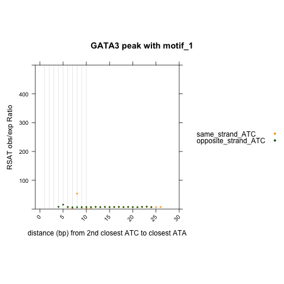 
 
 
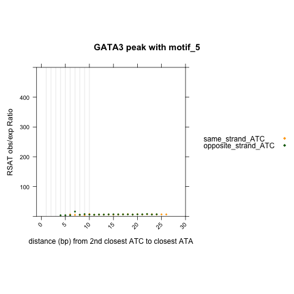 
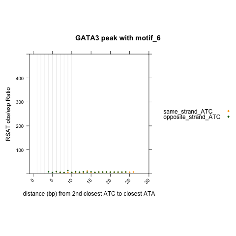 
```

It is clear in the enrichment graph that GATA3 peaks with motif1 has an enriched dyad structure of ATAn{2}ATC (relative distance of two zinc fingers is 8bp); GATA3 peaks with motif2 has an enriched dyad structure of ATAn{3}ATC (relative distance of two zinc finger is 9bp). \
For GATA3 peaks with motif4, ATAn{0}GAT and ATA{4}GAT are enriched. The relative distances of two zinc fingers are at 4bp and 8bp. \
No remarkable enrichment of dyad structure related to ATA and ATC for GATA3 peaks with motif5 and motif6. \


#### ATC-ATC
Notice that this is anchoring at ATC and looking for ATC on same strand or opposite strand. \
```{r engine='R', eval=TRUE, echo=TRUE}
library(lattice)
library(latticeExtra)
library(Biostrings)
my_motifs = c("motif_1", "motif_4","motif_2", "motif_6", "motif_5")
Anchor_dyad = c("ATC")
Query_dyad =c("ATC")
compute_dis_df=read.csv('pattern_anchor_at_G_compute_dis.csv')

for (motif in my_motifs) {
  print(motif)
  rsat_results=paste0("GATA3_peak_161win_with_", motif, "_RSAT_dyad.txt")
  for (pattern1 in Anchor_dyad){
    print(pattern1)
    for (pattern2 in Query_dyad){
      print(pattern2)
      number1=compute_dis_df[compute_dis_df$pattern==pattern1, "anchor"] + compute_dis_df[compute_dis_df$pattern==pattern2, "query"]
      rc_pattern2=reverseComplement(DNAString(pattern2))
      print(rc_pattern2)
      number2=compute_dis_df[compute_dis_df$pattern==pattern1, "anchor"] + compute_dis_df[compute_dis_df$pattern==as.character(rc_pattern2), "query"]
        
      ss <- process_and_subset_RSAT(rsat_results, pattern1, pattern2, number1)
      os <- process_and_subset_RSAT(rsat_results, pattern1, rc_pattern2, number2)
      
      if(nrow(ss) > 0) {
                        ss$query_status <- paste0("same_strand_", pattern2)
                        } else {
                        ss <- data.frame(matrix(NA, ncol = ncol(ss), nrow = 1)) # Fill ss dataframe with NA values for all columns
                        colnames(ss) <- c("first", "dyad_distance", "second", "ratio","relative_distance")
                        ss$query_status <- paste0("same_strand_", pattern2)
                        }

      if(nrow(os) > 0) {
                        os$query_status <- paste0("opposite_strand_", pattern2)
                        } else {
                        os <- data.frame(matrix(NA, ncol = ncol(os), nrow = 1)) # Fill os dataframe with NA values for all columns
                        colnames(os) <- c("first", "dyad_distance", "second", "ratio","relative_distance")
                        os$query_status <- paste0("opposite_strand_", pattern2)
                        }
      
      df.plot=rbind(ss, os)
      df.plot$query_status = factor(df.plot$query_status, levels = c(paste0("same_strand_", pattern2), paste0("opposite_strand_", pattern2)))
      
      # xy plot
      png(paste0('xy_RSAT_dyad_closest_2nd_', pattern2, '_to_closest_1st_', pattern1, '_to_GATA3_pos_', motif, '_compare_to_DHS.png'))
      print(xyplot(ratio ~ relative_distance,
                   data = df.plot, 
                   groups = query_status,
                   auto.key=list(space="right", points=TRUE),
                   aspect = 1,
                   xlim=c(-1,30),
                   ylim=c(0, 500),
                   xlab = paste0("distance (bp) from 2nd closest ",pattern2, " to closest ", pattern1),
                   ylab="RSAT obs/exp Ratio",
                    main=paste0("GATA3 peak with ", motif),
                   between=list(y=1.0),
                   scales = list(x = list(rot = 45, at = seq(from = 0, to = 50, by = 5))),
                   par.settings = list(superpose.symbol = list(col=c("orange", "darkgreen"), pch=18, lwd=2), strip.background=list(col="grey85")),
                   panel = function(x,y,...) {panel.abline(v=c(seq(1, 10, 1)), col = "grey90")
                                              panel.xyplot(x, y, 
                                                           col=c("orange","darkgreen"), 
                                                           pch=18, 
                                                           cex=0.6,...)
                                              #panel.barchart(x,y, horizontal = FALSE, col=c("red", "blue"), alpha=0.4)
                                      
                                      
                 }))
     dev.off()
    }  
  } 
}

```

```{r  fig.align = "center", out.width="80%", out.height="80%", echo=F, fig.align = "center", fig.cap="xy plot of rsat analysis for GATA3 peak with motif12456: 3mer structure"}
#library(knitr)
 
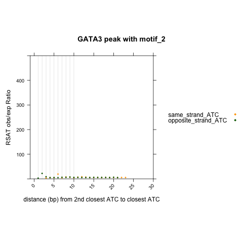 
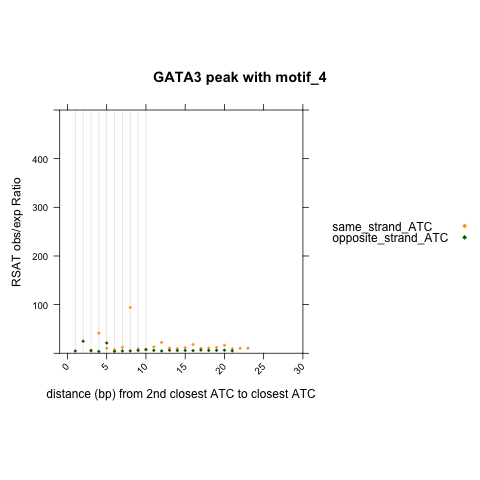 
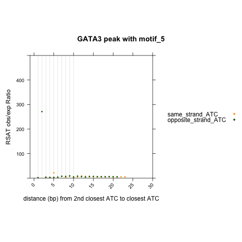 
 
```
As expected, GATA3 peak with motif 1 and motif 2 do not show enrichment for dyad structure made of this pair of 3mer. \
GATA3 peak with motif4 has enrichment at relative distance 8bp for ATC and same strand ATC; \
GATA3 peak with motif6 has enrichment at relative distance 9bp for ATC and same strand ATC; \
GATA3 peak with motif5 has enrichment at relative distance 2bp for ATC and opposite strand ATC. \

These all match with the defined motif structure for each peak set. \


#### TAG-ATA
Unfortunately, **TAG** is not included in our prioritized list. It is ranked even after AGA/TCT. We can include an analysis of this 3-mer here. \
And in our customized analysis, we might also include TAG/CTA to our prioritized 3mer list. \

```{r engine='R', eval=TRUE, echo=TRUE}
library(lattice)
library(latticeExtra)
library(Biostrings)
my_motifs = c("motif_1", "motif_4","motif_2", "motif_6", "motif_5")
Anchor_dyad = c("TAG")
Query_dyad =c("ATA")
compute_dis_df=read.csv('pattern_anchor_at_G_compute_dis.csv')

for (motif in my_motifs) {
  print(motif)
  rsat_results=paste0("GATA3_peak_161win_with_", motif, "_RSAT_dyad.txt")
  for (pattern1 in Anchor_dyad){
    print(pattern1)
    for (pattern2 in Query_dyad){
      print(pattern2)
      number1=compute_dis_df[compute_dis_df$pattern==pattern1, "anchor"] + compute_dis_df[compute_dis_df$pattern==pattern2, "query"]
      rc_pattern2=reverseComplement(DNAString(pattern2))
      print(rc_pattern2)
      number2=compute_dis_df[compute_dis_df$pattern==pattern1, "anchor"] + compute_dis_df[compute_dis_df$pattern==as.character(rc_pattern2), "query"]
        
      ss <- process_and_subset_RSAT(rsat_results, pattern1, pattern2, number1)
      os <- process_and_subset_RSAT(rsat_results, pattern1, rc_pattern2, number2)
      
      if(nrow(ss) > 0) {
                        ss$query_status <- paste0("same_strand_", pattern2)
                        } else {
                        ss <- data.frame(matrix(NA, ncol = ncol(ss), nrow = 1)) # Fill ss dataframe with NA values for all columns
                        colnames(ss) <- c("first", "dyad_distance", "second", "ratio","relative_distance")
                        ss$query_status <- paste0("same_strand_", pattern2)
                        }

      if(nrow(os) > 0) {
                        os$query_status <- paste0("opposite_strand_", pattern2)
                        } else {
                        os <- data.frame(matrix(NA, ncol = ncol(os), nrow = 1)) # Fill os dataframe with NA values for all columns
                        colnames(os) <- c("first", "dyad_distance", "second", "ratio","relative_distance")
                        os$query_status <- paste0("opposite_strand_", pattern2)
                        }
      
      df.plot=rbind(ss, os)
      df.plot$query_status = factor(df.plot$query_status, levels = c(paste0("same_strand_", pattern2), paste0("opposite_strand_", pattern2)))
      
      # xy plot
      png(paste0('xy_RSAT_dyad_closest_2nd_', pattern2, '_to_closest_1st_', pattern1, '_to_GATA3_pos_', motif, '_compare_to_DHS.png'))
      print(xyplot(ratio ~ relative_distance,
                   data = df.plot, 
                   groups = query_status,
                   auto.key=list(space="right", points=TRUE),
                   aspect = 1,
                   xlim=c(-1,30),
                   ylim=c(0, 500),
                   xlab = paste0("distance (bp) from 2nd closest ",pattern2, " to closest ", pattern1),
                   ylab="RSAT obs/exp Ratio",
                    main=paste0("GATA3 peak with ", motif),
                   between=list(y=1.0),
                   scales = list(x = list(rot = 45, at = seq(from = 0, to = 50, by = 5))),
                   par.settings = list(superpose.symbol = list(col=c("orange", "darkgreen"), pch=18, lwd=2), strip.background=list(col="grey85")),
                   panel = function(x,y,...) {panel.abline(v=c(seq(1, 10, 1)), col = "grey90")
                                              panel.xyplot(x, y, 
                                                           col=c("orange","darkgreen"), 
                                                           pch=18, 
                                                           cex=0.6,...)
                                              #panel.barchart(x,y, horizontal = FALSE, col=c("red", "blue"), alpha=0.4)
                                      
                                      
                 }))
     dev.off()
    }  
  } 
}

```

```{r  fig.align = "center", out.width="80%", out.height="80%", echo=F, fig.align = "center", fig.cap="xy plot of rsat analysis for GATA3 peak with motif12456: 3mer structure"}
#library(knitr)
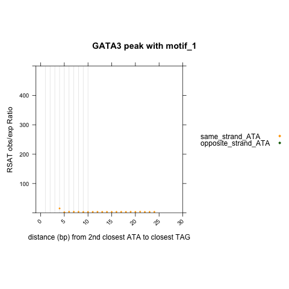 
 
 
 
 
```
It is interesting to see that for all peak set, we did not have dyad structure of TAG{}TAT on the same strand. \
And for TAG-ATA on the same strand, we only see enrichment for GATA3 peaks with motif4 (rsat calculate the ratio is 68.72 ranked the third for tagn{0}ata). The relative distance between two zinc finger is 4. The binding element has to look like this: GATAGATA.  \

#### ATC-ATA
```{r engine='R', eval=TRUE, echo=TRUE}
library(lattice)
library(latticeExtra)
library(Biostrings)
my_motifs = c("motif_1", "motif_4","motif_2", "motif_6", "motif_5")
Anchor_dyad = c("ATC")
Query_dyad =c("ATA")
compute_dis_df=read.csv('pattern_anchor_at_G_compute_dis.csv')

for (motif in my_motifs) {
  print(motif)
  rsat_results=paste0("GATA3_peak_161win_with_", motif, "_RSAT_dyad.txt")
  for (pattern1 in Anchor_dyad){
    print(pattern1)
    for (pattern2 in Query_dyad){
      print(pattern2)
      number1=compute_dis_df[compute_dis_df$pattern==pattern1, "anchor"] + compute_dis_df[compute_dis_df$pattern==pattern2, "query"]
      rc_pattern2=reverseComplement(DNAString(pattern2))
      print(rc_pattern2)
      number2=compute_dis_df[compute_dis_df$pattern==pattern1, "anchor"] + compute_dis_df[compute_dis_df$pattern==as.character(rc_pattern2), "query"]
        
      ss <- process_and_subset_RSAT(rsat_results, pattern1, pattern2, number1)
      os <- process_and_subset_RSAT(rsat_results, pattern1, rc_pattern2, number2)
      
      if(nrow(ss) > 0) {
                        ss$query_status <- paste0("same_strand_", pattern2)
                        } else {
                        ss <- data.frame(matrix(NA, ncol = ncol(ss), nrow = 1)) # Fill ss dataframe with NA values for all columns
                        colnames(ss) <- c("first", "dyad_distance", "second", "ratio","relative_distance")
                        ss$query_status <- paste0("same_strand_", pattern2)
                        }

      if(nrow(os) > 0) {
                        os$query_status <- paste0("opposite_strand_", pattern2)
                        } else {
                        os <- data.frame(matrix(NA, ncol = ncol(os), nrow = 1)) # Fill os dataframe with NA values for all columns
                        colnames(os) <- c("first", "dyad_distance", "second", "ratio","relative_distance")
                        os$query_status <- paste0("opposite_strand_", pattern2)
                        }
      
      df.plot=rbind(ss, os)
      df.plot$query_status = factor(df.plot$query_status, levels = c(paste0("same_strand_", pattern2), paste0("opposite_strand_", pattern2)))
      
      # xy plot
      png(paste0('xy_RSAT_dyad_closest_2nd_', pattern2, '_to_closest_1st_', pattern1, '_to_GATA3_pos_', motif, '_compare_to_DHS.png'))
      print(xyplot(ratio ~ relative_distance,
                   data = df.plot, 
                   groups = query_status,
                   auto.key=list(space="right", points=TRUE),
                   aspect = 1,
                   xlim=c(-1,30),
                   ylim=c(0, 500),
                   xlab = paste0("distance (bp) from 2nd closest ",pattern2, " to closest ", pattern1),
                   ylab="RSAT obs/exp Ratio",
                    main=paste0("GATA3 peak with ", motif),
                   between=list(y=1.0),
                   scales = list(x = list(rot = 45, at = seq(from = 0, to = 50, by = 5))),
                   par.settings = list(superpose.symbol = list(col=c("orange", "darkgreen"), pch=18, lwd=2), strip.background=list(col="grey85")),
                   panel = function(x,y,...) {panel.abline(v=c(seq(1, 10, 1)), col = "grey90")
                                              panel.xyplot(x, y, 
                                                           col=c("orange","darkgreen"), 
                                                           pch=18, 
                                                           cex=0.6,...)
                                              #panel.barchart(x,y, horizontal = FALSE, col=c("red", "blue"), alpha=0.4)
                                      
                                      
                 }))
     dev.off()
    }  
  } 
}

```


```{r  fig.align = "center", out.width="80%", out.height="80%", echo=F, fig.align = "center", fig.cap="xy plot of rsat analysis for GATA3 peak with motif12456: 3mer structure"}
#library(knitr)
 
 
knitr::include_graphics("./xy_RSAT_dyad_closest_2nd_ATA_to_closest_1st_ATC_to_GATA3_pos_motif_4_compare_to_DHS.png") 
knitr::include_graphics("./xy_RSAT_dyad_closest_2nd_ATA_to_closest_1st_ATC_to_GATA3_pos_motif_5_compare_to_DHS.png") 
 
```
In these graph, we also did not see structure of ATC-TAT(opposite strand ATA). And only see one enriched structure for ATC-ATA at relative distance==2bp. This structure must be ATCxGATA, which match with motif5. \


#### GAT-ATA

```{r engine='R', eval=TRUE, echo=TRUE}
library(lattice)
library(latticeExtra)
library(Biostrings)
my_motifs = c("motif_1", "motif_4","motif_2", "motif_6", "motif_5")
Anchor_dyad = c("GAT")
Query_dyad =c("ATA")
compute_dis_df=read.csv('pattern_anchor_at_G_compute_dis.csv')

for (motif in my_motifs) {
  print(motif)
  rsat_results=paste0("GATA3_peak_161win_with_", motif, "_RSAT_dyad.txt")
  for (pattern1 in Anchor_dyad){
    print(pattern1)
    for (pattern2 in Query_dyad){
      print(pattern2)
      number1=compute_dis_df[compute_dis_df$pattern==pattern1, "anchor"] + compute_dis_df[compute_dis_df$pattern==pattern2, "query"]
      rc_pattern2=reverseComplement(DNAString(pattern2))
      print(rc_pattern2)
      number2=compute_dis_df[compute_dis_df$pattern==pattern1, "anchor"] + compute_dis_df[compute_dis_df$pattern==as.character(rc_pattern2), "query"]
        
      ss <- process_and_subset_RSAT(rsat_results, pattern1, pattern2, number1)
      os <- process_and_subset_RSAT(rsat_results, pattern1, rc_pattern2, number2)
      
      if(nrow(ss) > 0) {
                        ss$query_status <- paste0("same_strand_", pattern2)
                        } else {
                        ss <- data.frame(matrix(NA, ncol = ncol(ss), nrow = 1)) # Fill ss dataframe with NA values for all columns
                        colnames(ss) <- c("first", "dyad_distance", "second", "ratio","relative_distance")
                        ss$query_status <- paste0("same_strand_", pattern2)
                        }

      if(nrow(os) > 0) {
                        os$query_status <- paste0("opposite_strand_", pattern2)
                        } else {
                        os <- data.frame(matrix(NA, ncol = ncol(os), nrow = 1)) # Fill os dataframe with NA values for all columns
                        colnames(os) <- c("first", "dyad_distance", "second", "ratio","relative_distance")
                        os$query_status <- paste0("opposite_strand_", pattern2)
                        }
      
      df.plot=rbind(ss, os)
      df.plot$query_status = factor(df.plot$query_status, levels = c(paste0("same_strand_", pattern2), paste0("opposite_strand_", pattern2)))
      
      # xy plot
      png(paste0('xy_RSAT_dyad_closest_2nd_', pattern2, '_to_closest_1st_', pattern1, '_to_GATA3_pos_', motif, '_compare_to_DHS.png'))
      print(xyplot(ratio ~ relative_distance,
                   data = df.plot, 
                   groups = query_status,
                   auto.key=list(space="right", points=TRUE),
                   aspect = 1,
                   xlim=c(-1,30),
                   ylim=c(0, 500),
                   xlab = paste0("distance (bp) from 2nd closest ",pattern2, " to closest ", pattern1),
                   ylab="RSAT obs/exp Ratio",
                    main=paste0("GATA3 peak with ", motif),
                   between=list(y=1.0),
                   scales = list(x = list(rot = 45, at = seq(from = 0, to = 50, by = 5))),
                   par.settings = list(superpose.symbol = list(col=c("orange", "darkgreen"), pch=18, lwd=2), strip.background=list(col="grey85")),
                   panel = function(x,y,...) {panel.abline(v=c(seq(1, 10, 1)), col = "grey90")
                                              panel.xyplot(x, y, 
                                                           col=c("orange","darkgreen"), 
                                                           pch=18, 
                                                           cex=0.6,...)
                                              #panel.barchart(x,y, horizontal = FALSE, col=c("red", "blue"), alpha=0.4)
                                      
                                      
                 }))
     dev.off()
    }  
  } 
}

```

```{r  fig.align = "center", out.width="80%", out.height="80%", echo=F, fig.align = "center", fig.cap="xy plot of rsat analysis for GATA3 peak with motif12456: 3mer structure"}
#library(knitr)
 
 
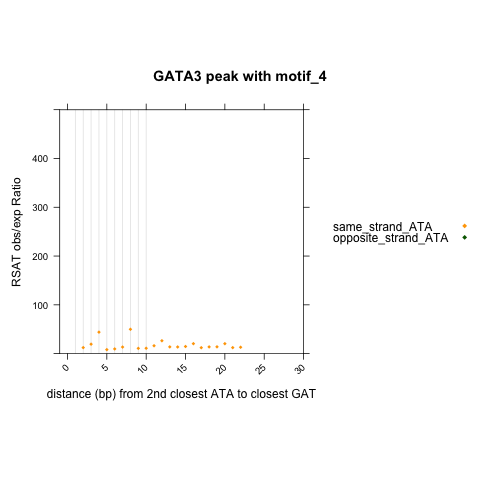 
 
 
```

Notice that we again did not see dyad structures of GAT-TAT(opposite stand ATA), but has identified enriched structure of GAT-ATA for GATA3 peaks with motif4 and motif6. \

For GATA3 peaks with motif4, we see gatn{6}ata and gatn{2}ata enriched. The relative distance between two zinc fingers is 8bp and 4bp. The 8bp one match with moyif4, the 4bp one match with GATAGATA. \
For GATA3 peaks with motif6, we see gatn{7}ata enriched, the relative distance between two zinc fingers is 9bp. This match with motif6 PWMs. \

**For the added 2 pairs of 3mer**: \

I have add the relative distance to the pattern_anchor_at_G_compute_dis.csv file. \
```{r engine='bash', eval=F, echo=TRUE}
pattern identifier anchor query
AGA	AGA(t)	2	1
TCT	(a)TCT	2	1
TAG	(ga)TAG	5	-2
CTA	CTA(tc)	-1	4
```


### Summary

Overall, RSAT-dyad analysis proves effective in identifying enriched binding elements within a set of peak regions, with proper controls and parameter settings. \

Enriched dyad structures can be discerned through various combinations of 3-mers. Establishing the relative distance between zinc fingers serves as a valuable method to determine if a structure arises from the same binding element. \


## Customized analysis -- prioritized 3mer

### Closest 3mer to peak summits

**Goal: given a prioritized 3mer list, we can generate the closest 3mer coordinates to a given sets of peak summits.** \

240208_closestBed.R: \

(cd /home/FCAM/ssun/GATA3_ChIP_PRO_July2023/ChIP_final/GAT_3mer_analaysis/closest_other_3mer) \
```{r engine='R', eval=F, echo=TRUE}
#!/usr/bin/env Rscript

Args=commandArgs(TRUE)
# closestBed function
bedTools.closest <- function(functionstring="/home/FCAM/ssun/packages/bedtools2/bin/closestBed",bed1,bed2,opt.string="") {
  
  options(scipen =99) # not use scientific notation when writing out
  
  #write bed formatted data.frames to tempfile
  write.table(bed1,file= 'a.file.bed', quote=F,sep="\t",col.names=F,row.names=F)
  write.table(bed2,file= 'b.file.bed', quote=F,sep="\t",col.names=F,row.names=F)
  
  # create the command string and call the command using system()
  # the command sort a and b file by coordinates
  command1=paste('sort -k1,1 -k2,2n', 'a.file.bed', '> a.file.sorted.bed')
  cat(command1,"\n") #sort -k1,1 -k2,2n a.file.bed > a.file.sorted.bed
  try(system(command1))
  command2=paste('sort -k1,1 -k2,2n', 'b.file.bed', '> b.file.sorted.bed')
  cat(command2,"\n")
  try(system(command2))
  
  # the command call closestBed on bed1 and bed2
  command=paste(functionstring, opt.string,"-a",'a.file.sorted.bed',"-b",'b.file.sorted.bed',">",'out.file.bed',sep=" ")
  cat(command,"\n")
  try(system(command))
  
  res=read.table('out.file.bed',header=F, comment.char='')
  
  # remove intermediate files
  command3=paste('rm', 'a.file.bed', 'b.file.bed', 'a.file.sorted.bed', 'b.file.sorted.bed', 'out.file.bed')
  cat(command3,"\n")
  try(system(command3))
  
  colnames(res) = c(colnames(bed1), colnames(bed2), 'dis' )
  return(res)
}

dir1="/labs/Guertin/siyu/Sathyan_GATA3_ChIP_pool1_pool2/overrep_3mer/hg38_full_kmer3_rs1000/seqdump/"
dir2="/home/FCAM/ssun/GATA3_ChIP_PRO_July2023/ChIP_final/GAT_3mer_analaysis/MAST_positive_control/"
dir3="/home/FCAM/ssun/GATA3_ChIP_PRO_July2023/ChIP_final/GAT_3mer_analaysis/ENCODE_DHS_GSE29692/"
my_motifs = c("motif_1", "motif_4","motif_2", "motif_6", "motif_5")
prioritized_triplets = c("AAA", "TAA" ,"ATA" ,"TTA", "AAT", "TAT", "GAT", "ATT", "TTT", "ATC", "AGA", "TCT", "TAG", "CTA")
library(bigWig)

for (triplet in prioritized_triplets){
  print(triplet)
  # 3mer genome coordinates
  plus.triplet.file=read.table(file = Sys.glob(file.path(paste0(dir1,"hg38.3.3.3plus.*_",triplet, ".bed"))), sep="\t", header=FALSE)
  minus.triplet.file=read.table(file = Sys.glob(file.path(paste0(dir1,"hg38.3.3.3minus.*_",triplet ,".bed"))), sep="\t", header=FALSE)
  for (motif in my_motifs){
    print(motif)
    # peak summits
    GATA3_peak_summits=center.bed(read.table(paste0(dir2, "GATA3_peak_161win_with_",motif, ".bed"), header=FALSE), upstreamWindow = 0, downstreamWindow = 0)
    # consensus neg
    indep.DHS.control.consensus=center.bed(read.table(paste0(dir3, "MCF7DHS_consensus_noGATA_without_motifs_123456_78.bed"), header=FALSE), upstreamWindow = 0, downstreamWindow = 0)
    
    # closestBed--1st closest plus
    
    ##
    closest.1st.plus.triplet.to.peak=bedTools.closest(bed1 = GATA3_peak_summits[,1:3], bed2 = plus.triplet.file, opt.string = '-d -t first')
    write.table(closest.1st.plus.triplet.to.peak,file= paste0('closest.1st.plus.',triplet,'.to.GATA3.with.', motif,'.bed'), quote=F,sep="\t",col.names=F,row.names=F)
    
    ##
    closest.1st.plus.triplet.to.indep.DHS.control.consensus=bedTools.closest(bed1 = indep.DHS.control.consensus[,1:3], bed2 = plus.triplet.file, opt.string = '-d -t first')
    write.table(closest.1st.plus.triplet.to.indep.DHS.control.consensus,file= paste0('closest.1st.plus.',triplet,'.to.indep.DHS.control.consensus.bed'), quote=F,sep="\t",col.names=F,row.names=F)


     # closestBed--1st closest minus
     
     ##
     closest.1st.minus.triplet.to.peak=bedTools.closest(bed1 = GATA3_peak_summits[,1:3], bed2 =minus.triplet.file, opt.string = '-d -t first')
     write.table(closest.1st.minus.triplet.to.peak,file= paste0('closest.1st.minus.',triplet,'.to.GATA3.with.', motif,'.bed'), quote=F,sep="\t",col.names=F,row.names=F)
     
     ##
     closest.1st.minus.triplet.to.indep.DHS.control.consensus=bedTools.closest(bed1 = indep.DHS.control.consensus[,1:3], bed2 = minus.triplet.file, opt.string = '-d -t first')
    write.table(closest.1st.minus.triplet.to.indep.DHS.control.consensus,file= paste0('closest.1st.minus.',triplet,'.to.indep.DHS.control.consensus.bed'), quote=F,sep="\t",col.names=F,row.names=F)

  }
  
}
```

runR.sh \
```{r engine='bash', eval=F, echo=TRUE}
#!/bin/bash
#SBATCH --job-name=runR.sh     # name for job
#SBATCH -N 1
#SBATCH -n 1
#SBATCH -c 8
#SBATCH -p general
#SBATCH --qos=general
#SBATCH --mem=200G
#SBATCH --mail-type=ALL
#SBATCH --mail-user=ssun@uchc.edu
#SBATCH -o runR.sh_%j.out
#SBATCH -e runR.sh_%j.err

module load R/4.1.2
Rscript 240208_closestBed.R
```


### 2nd closest 3mer to the anchor 3mer
**Overall Goal: given the closest 3mer coordinates file, we can loop through a set of 3mer list and generate the 2nd closest 3mer coordinates to the provided closest 3mer coordinates.** \

#### For each 3mer genome coordinates, remove the identified closest 3mer on the same strand 

**Remove the first closest GAT with `bedtools subtract`** \
Subtract the 1st closest GAT from all.GAT, then find the closest 2nd GAT to the closest 1st GAT. \
`-f` Requiring a minimal overlap fraction before subtracting. Here we define `-f 1.00` to make sure of a 100% overlap between two file before subtracting. \
`-s` Enforcing same “strandedness” while scanning for features in `-b file` that should be subtracted from `-a file`. \

```{r engine='bash', eval=F, echo=TRUE}
#!/bin/bash
#SBATCH --job-name=remove_1st_3mer.sh     # name for job
#SBATCH -N 1
#SBATCH -n 1
#SBATCH -c 16
#SBATCH -p general
#SBATCH --qos=general
#SBATCH --mem=200G
#SBATCH --mail-type=ALL
#SBATCH --mail-user=ssun@uchc.edu
#SBATCH -o remove_1st_3mer.sh_%j.out
#SBATCH -e remove_1st_3mer.sh_%j.err


input_dir1=/labs/Guertin/siyu/Sathyan_GATA3_ChIP_pool1_pool2/overrep_3mer/hg38_full_kmer3_rs1000/seqdump/
input_dir2=/home/FCAM/ssun/GATA3_ChIP_PRO_July2023/ChIP_final/GAT_3mer_analaysis/closest_other_3mer/

#output_dir=/home/FCAM/ssun/GATA3_ChIP_PRO_July2023/ChIP_final/GAT_3mer_analaysis/closest_other_3mer/closest_2nd_other_3mer/

my_motifs=("motif_1" "motif_2" "motif_4" "motif_5" "motif_6")
prioritized_triplets=("AAA" "TAA" "ATA" "TTA" "AAT" "TAT" "GAT" "ATT" "TTT" "ATC" "AGA" "TCT" "TAG" "CTA")

# Use a for loop to iterate over the 
module load bedtools 
for triplet in "${prioritized_triplets[@]}"
do
  echo $triplet
  
  for motif in "${my_motifs[@]}"
  do
    echo $motif
    # plus
    sort -k1,1 -k2,2n ${input_dir1}hg38.3.3.3plus*${triplet}.bed > hg38.3.3.3plus.${triplet}.sorted.bed
    awk '{print $4, $5, $6, $7, $8, $9, $10}' ${input_dir2}closest.1st.plus.${triplet}.to.GATA3.with.${motif}.bed  | awk '{$1=$1}1' OFS="\t" | uniq | sort -k1,1 -k2,2n > closest.1st.plus.${triplet}.to.GATA3.with.${motif}.uniq.sorted.bed
    bedtools subtract -a hg38.3.3.3plus.${triplet}.sorted.bed -b closest.1st.plus.${triplet}.to.GATA3.with.${motif}.uniq.sorted.bed -f 1.00 -s > hg38.3.3.3plus.${triplet}_without_1st_plus_${triplet}_to_GATA3_with_${motif}.bed
    rm hg38.3.3.3plus.${triplet}.sorted.bed
    rm closest.1st.plus.${triplet}.to.GATA3.with.${motif}.uniq.sorted.bed
    
    # minus
    sort -k1,1 -k2,2n ${input_dir1}hg38.3.3.3minus*${triplet}.bed > hg38.3.3.3minus.${triplet}.sorted.bed
    awk '{print $4, $5, $6, $7, $8, $9, $10}' ${input_dir2}closest.1st.minus.${triplet}.to.GATA3.with.${motif}.bed  | awk '{$1=$1}1' OFS="\t" | uniq | sort -k1,1 -k2,2n > closest.1st.minus.${triplet}.to.GATA3.with.${motif}.uniq.sorted.bed
    bedtools subtract -a hg38.3.3.3minus.${triplet}.sorted.bed -b closest.1st.minus.${triplet}.to.GATA3.with.${motif}.uniq.sorted.bed -f 1.00 -s > hg38.3.3.3minus.${triplet}_without_1st_minus_${triplet}_to_GATA3_with_${motif}.bed
    rm hg38.3.3.3minus.${triplet}.sorted.bed
    rm closest.1st.minus.${triplet}.to.GATA3.with.${motif}.uniq.sorted.bed
  done
done

# independent DHS control
for triplet in "${prioritized_triplets[@]}"
do
  echo $triplet
  # plus
  sort -k1,1 -k2,2n ${input_dir1}hg38.3.3.3plus*${triplet}.bed > hg38.3.3.3plus.${triplet}.sorted.bed
  awk '{print $4, $5, $6, $7, $8, $9, $10}' ${input_dir2}closest.1st.plus.${triplet}.to.indep.DHS.control.consensus.bed | awk '{$1=$1}1' OFS="\t" | uniq | sort -k1,1 -k2,2n > closest.1st.plus.${triplet}.to.indep.DHS.control.consensus.uniq.sorted.bed
  bedtools subtract -a hg38.3.3.3plus.${triplet}.sorted.bed -b closest.1st.plus.${triplet}.to.indep.DHS.control.consensus.uniq.sorted.bed -f 1.00 -s > hg38.3.3.3plus.36_${triplet}_without_1st_plus_${triplet}_to_indep_DHS_control.bed
   rm hg38.3.3.3plus.${triplet}.sorted.bed
   rm closest.1st.plus.${triplet}.to.indep.DHS.control.consensus.uniq.sorted.bed
   
  # minus
  sort -k1,1 -k2,2n ${input_dir1}hg38.3.3.3minus*${triplet}.bed > hg38.3.3.3minus.${triplet}.sorted.bed
  awk '{print $4, $5, $6, $7, $8, $9, $10}' ${input_dir2}closest.1st.minus.${triplet}.to.indep.DHS.control.consensus.bed | awk '{$1=$1}1' OFS="\t" | uniq | sort -k1,1 -k2,2n > closest.1st.minus.${triplet}.to.indep.DHS.control.consensus.uniq.sorted.bed
  bedtools subtract -a hg38.3.3.3minus.${triplet}.sorted.bed -b closest.1st.minus.${triplet}.to.indep.DHS.control.consensus.uniq.sorted.bed -f 1.00 -s > hg38.3.3.3minus.36_${triplet}_without_1st_minus_${triplet}_to_indep_DHS_control.bed
   rm hg38.3.3.3minus.${triplet}.sorted.bed
   rm closest.1st.minus.${triplet}.to.indep.DHS.control.consensus.uniq.sorted.bed
done

```

#### find the closest 2nd 3mer to peak summits

**Identify redundant spaced 3mers, avoid showing duplicated results.** \

In our prioritized list, we have 14 unique 3mers, which can be described as 7 pairs consisting of a 3mer and its reverse complement. \
Pairing them individually would yield 196 combinations. However, this approach conveys redundant information already captured by their same strand's reverse complement. For instance, the plus strand ATC-TTT is equivalent to plus strand AAA-GAT, and AAA-AAA is equivalent to TTT-TTT on the same strand. \

It is important to list all unique combinations of spaced 3-mers so that we do not show redundant information in the downstream analysis. \

Additionally, in our calculation of relative distances, it's essential to account for the upstream and downstream orientation of the 3mers. For example, (gat)AAA-TTA(tc) and TTA(tc)-(gat)AAA represent distinct configurations. \

```{r engine='R', eval=TRUE, echo=TRUE}
# function to convert the plus strand 6mer to its reverse compliment then convert to same strand
convert_plus_strand_6mer <- function(sequence) {
  # Define a dictionary to store complementary base pairs
  complement <- c("A" = "T", "T" = "A", "G" = "C", "C" = "G")
  
  # Reverse the input sequence
  reversed_sequence <- rev(strsplit(sequence, "")[[1]])
  
  # Get the complementary bases
  complementary_sequence <- sapply(reversed_sequence, function(base) complement[base])
  
  # Combine the complementary bases into a string
  converted_sequence <- paste(complementary_sequence, collapse = "")
  
  return(converted_sequence)
}

# List of prioritized triplets
prioritized_triplets <- c("AAA", "TAA", "ATA", "TTA", "AAT", "TAT", "GAT", "ATT", "TTT", "ATC", "AGA", "TCT", "TAG", "CTA")

# List to store non-redundant 6mers
non_redundant_6mers <- list()
# Loop through each pair of triplets
for (i in 1:length(prioritized_triplets)) {
  for (j in 1:length(prioritized_triplets)) {
    pair <- c(prioritized_triplets[i], prioritized_triplets[j])
    # Combine triplets to form a 6mer
    sixmer <- paste(pair, collapse = "")
    
    # Find reverse complement of the 6mer
    converted_reverse_complement_sixmer <- convert_plus_strand_6mer(sixmer)
  
    # Check if the reverse complement exists in the 6mer itself
   if (!converted_reverse_complement_sixmer  %in% non_redundant_6mers) {
      non_redundant_6mers <- c(non_redundant_6mers, list(sixmer))
    }
  }
}

# Create dataframe with first 3 bases and last 3 bases
first_3_bases <- substr(non_redundant_6mers, 1, 3)
last_3_bases <- substr(non_redundant_6mers, 4, 6)
df <- data.frame(First_3_bases = first_3_bases, Last_3_bases = last_3_bases)
nrow(df)
```

The above R code aims to generate non-redundant 6-mers from prioritized triplets and then creating a dataframe to represent them. \

First, we define a convert_plus_strand_6mer function to reverse the input DNA sequence, finds the complementary bases for each base, and then combines them into a string representing the reverse complement. \
Then we perform a nested loop, which iterates through each pair of prioritized triplets. \
For each pair, it concatenates them to form a 6-mer, and then finds the reverse complement of the 6-mer using the convert_plus_strand_6mer function. If the reverse complement is already in non_redundant_6mers, we do not include the 6mer to the final output. \

Through running this code, we identified 105 combinations of 3mer pairs. These pairs are unique while considering them to be on the same strand. \


*However*, when considering the identification of 3mer combinations on both the plus and minus strands, it's crucial to account for these combinations. If we limit our focus solely to 3mer-3mer pairs on the same strand, specifically the plus strand, each of the 196 combinations will be distinct from one another. \

**Notice that the relative distance here need to be carefully defined according to different 3mer**. \
I am using the bigWig package to anchor at the specific G/C base for each 3mer. The `fiveprime.bed()` defines the anchor point based on the strand information: \
**If `strand = '+'` while using fiveprime.bed** \
anchor point = original `start` \
start = anchor point - `upstreamwindow` \
end = anchor point + 1 + `downstreamwindow` \
**If `strand = '-'` while using fiveprime.bed** \
anchor point = original `end` \
start = anchor point - `downstreamwindow` \
end = anchor point + 1 + `upstreamwindow` \

I have defined the upstream/downstream window value for each 3mer in the prioritized set, in this .csv file: \
```{r engine='R', eval=TRUE, echo=TRUE}
#pattern_anchor_at_GorC_for_bigWig_pkg.csv
read.csv('pattern_anchor_at_GorC_for_bigWig_pkg.csv')
```

Automate analysis on all prioritized 3mers: find the closest 2nd 3mer. \

Anchor at plus strand closest 3mer, find the 2nd closest plus strand 3mer relative to the closest 3mer. \

240215_closestBed.R \

```{r engine='R', eval=F, echo=TRUE}
#!/usr/bin/env Rscript

Args=commandArgs(TRUE)

bedTools.closest <- function(functionstring="/home/FCAM/ssun/packages/bedtools2/bin/closestBed",bed1,bed2,opt.string="") {
  
  options(scipen =99) # not use scientific notation when writing out
  
  #write bed formatted data.frames to tempfile
  write.table(bed1,file= 'a.file.bed', quote=F,sep="\t",col.names=F,row.names=F)
  write.table(bed2,file= 'b.file.bed', quote=F,sep="\t",col.names=F,row.names=F)
  
  # create the command string and call the command using system()
  # the command sort a and b file by coordinates
  command1=paste('sort -k1,1 -k2,2n', 'a.file.bed', '> a.file.sorted.bed')
  cat(command1,"\n") #sort -k1,1 -k2,2n a.file.bed > a.file.sorted.bed
  try(system(command1))
  command2=paste('sort -k1,1 -k2,2n', 'b.file.bed', '> b.file.sorted.bed')
  cat(command2,"\n")
  try(system(command2))
  
  # the command call closestBed on bed1 and bed2
  command=paste(functionstring, opt.string,"-a",'a.file.sorted.bed',"-b",'b.file.sorted.bed',">",'out.file.bed',sep=" ")
  cat(command,"\n")
  try(system(command))
  
  res=read.table('out.file.bed',header=F, comment.char='')
  
  # remove intermediate files
  command3=paste('rm', 'a.file.bed', 'b.file.bed', 'a.file.sorted.bed', 'b.file.sorted.bed', 'out.file.bed')
  cat(command3,"\n")
  try(system(command3))
  
  colnames(res) = c(colnames(bed1), colnames(bed2), 'dis' )
  return(res)
}


#library(lattice)
#library(latticeExtra)
#library(Biostrings)
library(bigWig)

# List of prioritized triplets
prioritized_triplets <- c("AAA", "TAA", "ATA", "TTA", "AAT", "TAT", "GAT", "ATT", "TTT", "ATC", "AGA", "TCT", "TAG", "CTA")

# List to store non-redundant 6mers
all_6mers <- list()
for (i in 1:length(prioritized_triplets)) {
  for (j in 1:length(prioritized_triplets)) {
    pair <- c(prioritized_triplets[i], prioritized_triplets[j])
    # Combine triplets to form a 6mer
    sixmer <- paste(pair, collapse = "")
    all_6mers <- c(all_6mers, list(sixmer))
    
  }
}

# Create data frame with first 3 bases and last 3 bases
first_3_bases <- substr(all_6mers, 1, 3)
last_3_bases <- substr(all_6mers, 4, 6)
df <- data.frame(First_3_bases = first_3_bases, Last_3_bases = last_3_bases)


# nested loop
dir1="/home/FCAM/ssun/GATA3_ChIP_PRO_July2023/ChIP_final/GAT_3mer_analaysis/closest_other_3mer/"
dir2="/home/FCAM/ssun/GATA3_ChIP_PRO_July2023/ChIP_final/GAT_3mer_analaysis/closest_other_3mer/closest_2nd_other_3mer/"
my_motifs = c("motif_1", "motif_2","motif_4", "motif_5", "motif_6")
win=read.csv(paste0(dir2, 'pattern_anchor_at_GorC_for_bigWig_pkg.csv'))

# GATA3 peaks with motif1,2,4,5,6
for (motif in my_motifs) {
  print(motif)
  for (i in 1:nrow(df)){
    pattern1=df[i,1]
    pattern2=df[i,2]
    # anchor position: closest +/- pattern1 relative to G/C
    print(pattern1)
    closest_plus_3mer_to_GATA3_peak_summits=fiveprime.bed(read.table(paste0(dir1, "closest.1st.plus.",pattern1, ".to.GATA3.with.", motif, ".bed"), header=FALSE)[,4:11], upstreamWindow = win[win$pattern==pattern1, "plus_upstream"] , downstreamWindow = win[win$pattern==pattern1, "plus_downstream"])
  
    # query 3mer coordinates on genome (without the overlapped closest 3mer coordinates) - relative to G/C
    print(pattern2)
    plus.3mer.file=fiveprime.bed(read.table(file = paste0(dir2, "hg38.3.3.3plus.", pattern2, "_without_1st_plus_", pattern2, "_to_GATA3_with_", motif,".bed"), sep="\t", header=FALSE), upstreamWindow = win[win$pattern==pattern2, "plus_upstream"] , downstreamWindow = win[win$pattern==pattern2, "plus_downstream"])
  
  # 2nd closest plus 3mer to closest plus 3mer
  closest.2nd.plus.3mer.to.1st.plus.3mer.GATA3.with.motif=bedTools.closest(bed1 = closest_plus_3mer_to_GATA3_peak_summits[,1:3], bed2 = plus.3mer.file, opt.string = '-d -t first')

  
  write.table(closest.2nd.plus.3mer.to.1st.plus.3mer.GATA3.with.motif, file= paste0("closest.2nd.plus.", pattern2, ".to.1st.plus.", pattern1, ".GATA3.with.", motif, ".bed"), quote=F,sep="\t",col.names=F,row.names=F)
  }
}

# DHS regions
for (i in 1:nrow(df)){
    pattern1=df[i,1]
    pattern2=df[i,2]
    # anchor position: closest +/- pattern1 relative to G/C
    print(pattern1)
    closest_plus_3mer_to_DHS=fiveprime.bed(read.table(paste0(dir1, "closest.1st.plus.", pattern1, ".to.indep.DHS.control.consensus.bed"), header=FALSE)[,4:11], upstreamWindow = win[win$pattern==pattern1, "plus_upstream"] , downstreamWindow = win[win$pattern==pattern1, "plus_downstream"])
  
    # query 3mer coordinates on genome (without the overlapped closest 3mer coordinates) - relative to G/C
    print(pattern2)
    plus.3mer.file=fiveprime.bed(read.table(file = paste0(dir2, "hg38.3.3.3plus.36_", pattern2, "_without_1st_plus_", pattern2, "_to_indep_DHS_control.bed"), sep="\t", header=FALSE), upstreamWindow = win[win$pattern==pattern2, "plus_upstream"] , downstreamWindow = win[win$pattern==pattern2, "plus_downstream"])
  
  # 2nd closest plus 3mer to closest plus 3mer
  closest.2nd.plus.3mer.to.1st.plus.3mer.DHS=bedTools.closest(bed1 = closest_plus_3mer_to_DHS[,1:3], bed2 = plus.3mer.file, opt.string = '-d -t first')

  
  write.table(closest.2nd.plus.3mer.to.1st.plus.3mer.DHS, file= paste0("closest.2nd.plus.", pattern2, ".to.1st.plus.", pattern1, ".indep.DHS.control.bed"), quote=F,sep="\t",col.names=F,row.names=F)
  }
```

runR.sh \
```{r engine='bash', eval=F, echo=TRUE}
#!/bin/bash
#SBATCH --job-name=runR.sh     # name for job
#SBATCH -N 1
#SBATCH -n 1
#SBATCH -c 16
#SBATCH -p general
#SBATCH --qos=general
#SBATCH --mem=200G
#SBATCH --mail-type=ALL
#SBATCH --mail-user=ssun@uchc.edu
#SBATCH -o runR.sh_%j.out
#SBATCH -e runR.sh_%j.err

module load R/4.1.2
Rscript 240215_closestBed.R
```

<!--
```{r engine='R', eval=F, echo=TRUE}
#!/usr/bin/env Rscript

Args=commandArgs(TRUE)

bedTools.closest <- function(functionstring="/home/FCAM/ssun/packages/bedtools2/bin/closestBed",bed1,bed2,opt.string="") {
  
  options(scipen =99) # not use scientific notation when writing out
  
  #write bed formatted data.frames to tempfile
  write.table(bed1,file= 'a.file.bed', quote=F,sep="\t",col.names=F,row.names=F)
  write.table(bed2,file= 'b.file.bed', quote=F,sep="\t",col.names=F,row.names=F)
  
  # create the command string and call the command using system()
  # the command sort a and b file by coordinates
  command1=paste('sort -k1,1 -k2,2n', 'a.file.bed', '> a.file.sorted.bed')
  cat(command1,"\n") #sort -k1,1 -k2,2n a.file.bed > a.file.sorted.bed
  try(system(command1))
  command2=paste('sort -k1,1 -k2,2n', 'b.file.bed', '> b.file.sorted.bed')
  cat(command2,"\n")
  try(system(command2))
  
  # the command call closestBed on bed1 and bed2
  command=paste(functionstring, opt.string,"-a",'a.file.sorted.bed',"-b",'b.file.sorted.bed',">",'out.file.bed',sep=" ")
  cat(command,"\n")
  try(system(command))
  
  res=read.table('out.file.bed',header=F, comment.char='')
  
  # remove intermediate files
  command3=paste('rm', 'a.file.bed', 'b.file.bed', 'a.file.sorted.bed', 'b.file.sorted.bed', 'out.file.bed')
  cat(command3,"\n")
  try(system(command3))
  
  colnames(res) = c(colnames(bed1), colnames(bed2), 'dis' )
  return(res)
}


#library(lattice)
#library(latticeExtra)
#library(Biostrings)
library(bigWig)

# function to convert the plus strand 6mer to its reverse compliment then convert to same strand
convert_plus_strand_6mer <- function(sequence) {
  complement <- c("A" = "T", "T" = "A", "G" = "C", "C" = "G")
  reversed_sequence <- rev(strsplit(sequence, "")[[1]])
  complementary_sequence <- sapply(reversed_sequence, function(base) complement[base])
  converted_sequence <- paste(complementary_sequence, collapse = "")
  return(converted_sequence)
}

# List of prioritized triplets
prioritized_triplets <- c("AAA", "TAA", "ATA", "TTA", "AAT", "TAT", "GAT", "ATT", "TTT", "ATC", "AGA", "TCT", "TAG", "CTA")

# List to store non-redundant 6mers
non_redundant_6mers <- list()
# Loop through each pair of triplets
for (i in 1:length(prioritized_triplets)) {
  for (j in 1:length(prioritized_triplets)) {
    pair <- c(prioritized_triplets[i], prioritized_triplets[j])
    # Combine triplets to form a 6mer
    sixmer <- paste(pair, collapse = "")
    
    # Find reverse complement of the 6mer
    converted_reverse_complement_sixmer <- convert_plus_strand_6mer(sixmer)
  
    # Check if the reverse complement exists in non_redundant_6mers list
   if (!converted_reverse_complement_sixmer  %in% non_redundant_6mers) {
      non_redundant_6mers <- c(non_redundant_6mers, list(sixmer))
    }
  }
}

# Create data frame with first 3 bases and last 3 bases
first_3_bases <- substr(non_redundant_6mers, 1, 3)
last_3_bases <- substr(non_redundant_6mers, 4, 6)
df <- data.frame(First_3_bases = first_3_bases, Last_3_bases = last_3_bases)

dir1="/home/FCAM/ssun/GATA3_ChIP_PRO_July2023/ChIP_final/GAT_3mer_analaysis/closest_other_3mer/"
dir2="/home/FCAM/ssun/GATA3_ChIP_PRO_July2023/ChIP_final/GAT_3mer_analaysis/closest_other_3mer/closest_2nd_other_3mer/"
my_motifs = c("motif_1", "motif_2","motif_4", "motif_5", "motif_6")
win=read.csv(paste0(dir2, 'pattern_anchor_at_GorC_for_bigWig_pkg.csv'))

# GATA3 peaks with motif1,2,4,5,6
for (motif in my_motifs) {
  print(motif)
  for (i in 1:nrow(df)){
    pattern1=df[i,1]
    pattern2=df[i,2]
    # anchor position: closest +/- pattern1 relative to G/C
    print(pattern1)
    closest_plus_3mer_to_GATA3_peak_summits=fiveprime.bed(read.table(paste0(dir1, "closest.1st.plus.",pattern1, ".to.GATA3.with.", motif, ".bed"), header=FALSE)[,4:11], upstreamWindow = win[win$pattern==pattern1, "plus_upstream"] , downstreamWindow = win[win$pattern==pattern1, "plus_downstream"])
  
    # query 3mer coordinates on genome (without the overlapped closest 3mer coordinates) - relative to G/C
    print(pattern2)
    plus.3mer.file=fiveprime.bed(read.table(file = paste0(dir2, "hg38.3.3.3plus.", pattern2, "_without_1st_plus_", pattern2, "_to_GATA3_with_", motif,".bed"), sep="\t", header=FALSE), upstreamWindow = win[win$pattern==pattern2, "plus_upstream"] , downstreamWindow = win[win$pattern==pattern2, "plus_downstream"])
  
  # 2nd closest plus 3mer to closest plus 3mer
  closest.2nd.plus.3mer.to.1st.plus.3mer.GATA3.with.motif=bedTools.closest(bed1 = closest_plus_3mer_to_GATA3_peak_summits[,1:3], bed2 = plus.3mer.file, opt.string = '-d -t first')

  
  write.table(closest.2nd.plus.3mer.to.1st.plus.3mer.GATA3.with.motif, file= paste0("closest.2nd.plus.", pattern2, ".to.1st.plus.", pattern1, ".GATA3.with.", motif, ".bed"), quote=F,sep="\t",col.names=F,row.names=F)
  }
}

# DHS regions
for (i in 1:nrow(df)){
    pattern1=df[i,1]
    pattern2=df[i,2]
    # anchor position: closest +/- pattern1 relative to G/C
    print(pattern1)
    closest_plus_3mer_to_DHS=fiveprime.bed(read.table(paste0(dir1, "closest.1st.plus.", pattern1, ".to.indep.DHS.control.consensus.bed"), header=FALSE)[,4:11], upstreamWindow = win[win$pattern==pattern1, "plus_upstream"] , downstreamWindow = win[win$pattern==pattern1, "plus_downstream"])
  
    # query 3mer coordinates on genome (without the overlapped closest 3mer coordinates) - relative to G/C
    print(pattern2)
    plus.3mer.file=fiveprime.bed(read.table(file = paste0(dir2, "hg38.3.3.3plus.36_", pattern2, "_without_1st_plus_", pattern2, "_to_indep_DHS_control.bed"), sep="\t", header=FALSE), upstreamWindow = win[win$pattern==pattern2, "plus_upstream"] , downstreamWindow = win[win$pattern==pattern2, "plus_downstream"])
  
  # 2nd closest plus 3mer to closest plus 3mer
  closest.2nd.plus.3mer.to.1st.plus.3mer.DHS=bedTools.closest(bed1 = closest_plus_3mer_to_DHS[,1:3], bed2 = plus.3mer.file, opt.string = '-d -t first')

  
  write.table(closest.2nd.plus.3mer.to.1st.plus.3mer.DHS, file= paste0("closest.2nd.plus.", pattern2, ".to.1st.plus.", pattern1, ".indep.DHS.control.bed"), quote=F,sep="\t",col.names=F,row.names=F)
  }
```

runR.sh \
```{r engine='bash', eval=F, echo=TRUE}
#!/bin/bash
#SBATCH --job-name=runR.sh     # name for job
#SBATCH -N 1
#SBATCH -n 1
#SBATCH -c 8
#SBATCH -p general
#SBATCH --qos=general
#SBATCH --mem=200G
#SBATCH --mail-type=ALL
#SBATCH --mail-user=ssun@uchc.edu
#SBATCH -o runR.sh_%j.out
#SBATCH -e runR.sh_%j.err

module load R/4.1.2
Rscript 240215_closestBed.R
```

```{r engine='R', eval=F, echo=TRUE}
convert_plus_strand_6mer <- function(sequence) {
  complement <- c("A" = "T", "T" = "A", "G" = "C", "C" = "G")
  reversed_sequence <- rev(strsplit(sequence, "")[[1]])
  complementary_sequence <- sapply(reversed_sequence, function(base) complement[base])
  converted_sequence <- paste(complementary_sequence, collapse = "")
  return(converted_sequence)
}

# List of prioritized triplets
prioritized_triplets <- c("AAA", "TAA", "ATA", "TTA", "AAT", "TAT", "GAT", "ATT", "TTT", "ATC", "AGA", "TCT", "TAG", "CTA")

# List to store non-redundant 6mers
non_redundant_6mers <- list()
# Loop through each pair of triplets
for (i in 1:length(prioritized_triplets)) {
  for (j in 1:length(prioritized_triplets)) {
    pair <- c(prioritized_triplets[i], prioritized_triplets[j])
    # Combine triplets to form a 6mer
    sixmer <- paste(pair, collapse = "")
    
    # Find reverse complement of the 6mer
    converted_reverse_complement_sixmer <- convert_plus_strand_6mer(sixmer)
  
    # Check if the reverse complement exists in non_redundant_6mers list
   if (!converted_reverse_complement_sixmer  %in% non_redundant_6mers) {
      non_redundant_6mers <- c(non_redundant_6mers, list(sixmer))
    }
  }
}


all_6mers <- list()
for (i in 1:length(prioritized_triplets)) {
  for (j in 1:length(prioritized_triplets)) {
    pair <- c(prioritized_triplets[i], prioritized_triplets[j])
    # Combine triplets to form a 6mer
    sixmer <- paste(pair, collapse = "")
    all_6mers <- c(all_6mers, list(sixmer))
    
  }
}

unique_to_all_6mers <- setdiff(all_6mers, non_redundant_6mers)

# Create data frame with first 3 bases and last 3 bases
first_3_bases <- substr(unique_to_all_6mers, 1, 3)
last_3_bases <- substr(unique_to_all_6mers, 4, 6)
df2 <- data.frame(First_3_bases = first_3_bases, Last_3_bases = last_3_bases)
```

-->

**coherence check**:
check some coordinates on UCSC genome browser, making sure that we are anchoring at the correct G/C. \

For some 3mers, we are empirically determine a relative G/C considering the GATA3 PWMs. So it is normal to see that some of the anchorred positions are not exactly an G or an C. \

#### plot the enrichement frequencies 
Make minimal plots to communicate results. \

For each peak set, (5 positive GATA3 peak sets and one DHS independent regions), there are 196 unique 3mer pairs with different relative distances. \
Since these 3mer pairs are prioritized based on their potential enrichment in GATA3 peak sets, they might convey similar enrichment information. Thus we could plot bw plots at different distances, showing which distance they all prefer. \

A density plot will have 105 traces for each peak set. \

Or you anchor at 1st closest GAT, for instance, then plot traces of 2nd closest 3mer relative to this GAT \

A heatmap with 14 3mer as x and y axies, and color code the density at different distances. \
A heatmap, y axies is all peaks ranked by intensity, then plot the 1st 3mer and 2nd 3mer coordinates for each peak. \

Summarize the analysis steps and present these steps at the next meeting. \


**Heatmap** \

"heatmap_test.txt" stores a subset of data with distance info from closest +GAT for peaks with motif1 summit, and distance info from 2nd to 1st closest GAT for peaks with motif1. \
```{r engine='R', eval=TRUE, echo=TRUE}
df <- read.table("heatmap_test.txt", header=T)[,c(1,3)]

create_matrix=function(df, dis.bound){
  df.in.bound=df[!(rowSums(df > dis.bound | df < -dis.bound) > 0), ]
  nrows=nrow(df.in.bound)
  df.in.bound=df.in.bound[order(rank(-abs(df.in.bound[,1]))), ]
  matrix=matrix(0, nrow = nrows, ncol =(2*dis.bound+1))
  for (i in 1:nrow(df.in.bound)){
    distance1=df.in.bound[i, 1]
    distance2=df.in.bound[i, 2]
    index1=distance1+dis.bound
    index2=distance2+dis.bound
    matrix[i, index1]=1
    matrix[i, index2]=0.6
  }
  return(matrix)
}

mat=create_matrix(df, 100)
```

```{r engine='R', eval=TRUE, echo=TRUE}
mat_df <- as.data.frame(as.table(mat))
names(mat_df) <- c( "Peak", "Distance", "Value")

# Plot
#pdf("test_heatmap_spaced_GAT_distance_to_peak_summit.pdf")
#print(
levelplot(Value ~ Distance * Peak, data = mat_df,
          col.regions = colorRampPalette(c( "white","blue", "red")),
          aspect=2,
          at = seq(0, 1, length=150),
          axes = FALSE,
          sub="",
          colorkey = FALSE,
          region = TRUE,
          scales = list(draw = FALSE),
          xlab = "Distance to peak summit", ylab = "GATA3 Peaks with motif1", main = "closest GAT (red) and 2nd closest GAT (blue) Distances to peak summit",
          newpage = FALSE,
          panel = function(...) {panel.levelplot(...)
            panel.abline(v=100, col = "black")}
         )
#)
#dev.off()
```


RSAT: \
Confirm how the software counts the observed spaced 3mer. Will they count twice if seeing 2 spaced 3mer at different locus on one sequence? -- yes, see the coherence check section under RSAT. \
Combine results regardless of upstream or downstream orientation. \


## GATA3 peaks without motifs

### GAT-GAT/ATC
without_motifs_123456_78_161bp_mast.bed \
37308 peaks. \

step1: find the 3mer coordinates (on hg38 genome) that are closest to each peak summit with `closestBed`. \
step2: remove the closest 3mer coordinates from the whole genome 3mer coordinates on the same strand with `bedtools subtract`. \
step3: find the second closest 3mer relative to the closest one. \

My list of 3mer: GAT, ATC. \

#### STEP1: 
240218_closestBed.R: \

(cd /home/FCAM/ssun/GATA3_ChIP_PRO_July2023/ChIP_final/GAT_3mer_analaysis/peak_161_without_motifs_12345678/GAT_ATC_240218) \
```{r engine='R', eval=F, echo=TRUE}
#!/usr/bin/env Rscript

Args=commandArgs(TRUE)
# closestBed function
bedTools.closest <- function(functionstring="/home/FCAM/ssun/packages/bedtools2/bin/closestBed",bed1,bed2,opt.string="") {
  
  options(scipen =99) # not use scientific notation when writing out
  
  #write bed formatted data.frames to tempfile
  write.table(bed1,file= 'a.file.bed', quote=F,sep="\t",col.names=F,row.names=F)
  write.table(bed2,file= 'b.file.bed', quote=F,sep="\t",col.names=F,row.names=F)
  
  # create the command string and call the command using system()
  # the command sort a and b file by coordinates
  command1=paste('sort -k1,1 -k2,2n', 'a.file.bed', '> a.file.sorted.bed')
  cat(command1,"\n") #sort -k1,1 -k2,2n a.file.bed > a.file.sorted.bed
  try(system(command1))
  command2=paste('sort -k1,1 -k2,2n', 'b.file.bed', '> b.file.sorted.bed')
  cat(command2,"\n")
  try(system(command2))
  
  # the command call closestBed on bed1 and bed2
  command=paste(functionstring, opt.string,"-a",'a.file.sorted.bed',"-b",'b.file.sorted.bed',">",'out.file.bed',sep=" ")
  cat(command,"\n")
  try(system(command))
  
  res=read.table('out.file.bed',header=F, comment.char='')
  
  # remove intermediate files
  command3=paste('rm', 'a.file.bed', 'b.file.bed', 'a.file.sorted.bed', 'b.file.sorted.bed', 'out.file.bed')
  cat(command3,"\n")
  try(system(command3))
  
  colnames(res) = c(colnames(bed1), colnames(bed2), 'dis' )
  return(res)
}

dir1="/labs/Guertin/siyu/Sathyan_GATA3_ChIP_pool1_pool2/overrep_3mer/hg38_full_kmer3_rs1000/seqdump/"
dir2="/home/FCAM/ssun/GATA3_ChIP_PRO_July2023/ChIP_final/GAT_3mer_analaysis/peak_161_without_motifs_12345678/"
dir3="/home/FCAM/ssun/GATA3_ChIP_PRO_July2023/ChIP_final/GAT_3mer_analaysis/ENCODE_DHS_GSE29692/"

prioritized_triplets = c("GAT", "ATC")
library(bigWig)

for (triplet in prioritized_triplets){
  print(triplet)
  # 3mer genome coordinates
  plus.triplet.file=read.table(file = Sys.glob(file.path(paste0(dir1,"hg38.3.3.3plus.*_",triplet, ".bed"))), sep="\t", header=FALSE)
  minus.triplet.file=read.table(file = Sys.glob(file.path(paste0(dir1,"hg38.3.3.3minus.*_",triplet ,".bed"))), sep="\t", header=FALSE)

    # peak summits
    GATA3_peak_summits=center.bed(read.table(paste0(dir2, "without_motifs_123456_78_161bp_mast.bed"), header=FALSE), upstreamWindow = 0, downstreamWindow = 0)
    # consensus neg
    indep.DHS.control.consensus=center.bed(read.table(paste0(dir3, "MCF7DHS_consensus_noGATA_without_motifs_123456_78.bed"), header=FALSE), upstreamWindow = 0, downstreamWindow = 0)
    
    # closestBed--1st closest plus
    
    ##
    closest.1st.plus.triplet.to.peak=bedTools.closest(bed1 = GATA3_peak_summits[,1:3], bed2 = plus.triplet.file, opt.string = '-d -t first')
    write.table(closest.1st.plus.triplet.to.peak,file= paste0('closest.1st.plus.',triplet,'.to.GATA3_without_motifs_123456_78_161bp_mast.bed'), quote=F,sep="\t",col.names=F,row.names=F)
    
    ##
    closest.1st.plus.triplet.to.indep.DHS.control.consensus=bedTools.closest(bed1 = indep.DHS.control.consensus[,1:3], bed2 = plus.triplet.file, opt.string = '-d -t first')
    write.table(closest.1st.plus.triplet.to.indep.DHS.control.consensus,file= paste0('closest.1st.plus.',triplet,'.to.indep.DHS.control.consensus.bed'), quote=F,sep="\t",col.names=F,row.names=F)


     # closestBed--1st closest minus
     
     ##
     closest.1st.minus.triplet.to.peak=bedTools.closest(bed1 = GATA3_peak_summits[,1:3], bed2 =minus.triplet.file, opt.string = '-d -t first')
     write.table(closest.1st.minus.triplet.to.peak,file= paste0('closest.1st.minus.',triplet,'.to.GATA3_without_motifs_123456_78_161bp_mast.bed'), quote=F,sep="\t",col.names=F,row.names=F)
     
     ##
     closest.1st.minus.triplet.to.indep.DHS.control.consensus=bedTools.closest(bed1 = indep.DHS.control.consensus[,1:3], bed2 = minus.triplet.file, opt.string = '-d -t first')
    write.table(closest.1st.minus.triplet.to.indep.DHS.control.consensus,file= paste0('closest.1st.minus.',triplet,'.to.indep.DHS.control.consensus.bed'), quote=F,sep="\t",col.names=F,row.names=F)

  
}
```

runR.sh \
```{r engine='bash', eval=F, echo=TRUE}
#!/bin/bash
#SBATCH --job-name=runR.sh     # name for job
#SBATCH -N 1
#SBATCH -n 1
#SBATCH -c 8
#SBATCH -p general
#SBATCH --qos=general
#SBATCH --mem=200G
#SBATCH --mail-type=ALL
#SBATCH --mail-user=ssun@uchc.edu
#SBATCH -o runR.sh_%j.out
#SBATCH -e runR.sh_%j.err

module load R/4.1.2
Rscript 240218_closestBed.R
```


#### STEP2: remove the closest 3mer coordinates from the whole genome 3mer coordinates on the same strand with `bedtools subtract`. 

```{r engine='bash', eval=F, echo=TRUE}
#!/bin/bash
#SBATCH --job-name=remove_1st_3mer.sh     # name for job
#SBATCH -N 1
#SBATCH -n 1
#SBATCH -c 16
#SBATCH -p general
#SBATCH --qos=general
#SBATCH --mem=200G
#SBATCH --mail-type=ALL
#SBATCH --mail-user=ssun@uchc.edu
#SBATCH -o remove_1st_3mer.sh_%j.out
#SBATCH -e remove_1st_3mer.sh_%j.err


input_dir1=/labs/Guertin/siyu/Sathyan_GATA3_ChIP_pool1_pool2/overrep_3mer/hg38_full_kmer3_rs1000/seqdump/
input_dir2=/home/FCAM/ssun/GATA3_ChIP_PRO_July2023/ChIP_final/GAT_3mer_analaysis/peak_161_without_motifs_12345678/GAT_ATC_240218/


prioritized_triplets=("GAT" "ATC")

# Use a for loop to iterate over the 
module load bedtools 
for triplet in "${prioritized_triplets[@]}"
do
  echo $triplet
  
    # plus
    sort -k1,1 -k2,2n ${input_dir1}hg38.3.3.3plus*${triplet}.bed > hg38.3.3.3plus.${triplet}.sorted.bed
    awk '{print $4, $5, $6, $7, $8, $9, $10}' ${input_dir2}closest.1st.plus.${triplet}.to.GATA3_without_motifs_123456_78_161bp_mast.bed  | awk '{$1=$1}1' OFS="\t" | uniq | sort -k1,1 -k2,2n > closest.1st.plus.${triplet}.to.GATA3_without_motifs_123456_78_161bp_mast.uniq.sorted.bed
    bedtools subtract -a hg38.3.3.3plus.${triplet}.sorted.bed -b closest.1st.plus.${triplet}.to.GATA3_without_motifs_123456_78_161bp_mast.uniq.sorted.bed -f 1.00 -s > hg38.3.3.3plus.${triplet}_without_1st_plus_${triplet}_to_GATA3_without_motifs_123456_78_161bp_mast.bed
    rm hg38.3.3.3plus.${triplet}.sorted.bed
    rm closest.1st.plus.${triplet}.to.GATA3_without_motifs_123456_78_161bp_mast.uniq.sorted.bed
    
    # minus
    sort -k1,1 -k2,2n ${input_dir1}hg38.3.3.3minus*${triplet}.bed > hg38.3.3.3minus.${triplet}.sorted.bed
    awk '{print $4, $5, $6, $7, $8, $9, $10}' ${input_dir2}closest.1st.minus.${triplet}.to.GATA3_without_motifs_123456_78_161bp_mast.bed  | awk '{$1=$1}1' OFS="\t" | uniq | sort -k1,1 -k2,2n > closest.1st.minus.${triplet}.to.GATA3_without_motifs_123456_78_161bp_mast.uniq.sorted.bed
    bedtools subtract -a hg38.3.3.3minus.${triplet}.sorted.bed -b closest.1st.minus.${triplet}.to.GATA3_without_motifs_123456_78_161bp_mast.uniq.sorted.bed -f 1.00 -s > hg38.3.3.3minus.${triplet}_without_1st_minus_${triplet}_to_GATA3_without_motifs_123456_78_161bp_mast.bed
    rm hg38.3.3.3minus.${triplet}.sorted.bed
    rm closest.1st.minus.${triplet}.to.GATA3_without_motifs_123456_78_161bp_mast.uniq.sorted.bed

done

# independent DHS control
for triplet in "${prioritized_triplets[@]}"
do
  echo $triplet
  # plus
  sort -k1,1 -k2,2n ${input_dir1}hg38.3.3.3plus*${triplet}.bed > hg38.3.3.3plus.${triplet}.sorted.bed
  awk '{print $4, $5, $6, $7, $8, $9, $10}' ${input_dir2}closest.1st.plus.${triplet}.to.indep.DHS.control.consensus.bed | awk '{$1=$1}1' OFS="\t" | uniq | sort -k1,1 -k2,2n > closest.1st.plus.${triplet}.to.indep.DHS.control.consensus.uniq.sorted.bed
  bedtools subtract -a hg38.3.3.3plus.${triplet}.sorted.bed -b closest.1st.plus.${triplet}.to.indep.DHS.control.consensus.uniq.sorted.bed -f 1.00 -s > hg38.3.3.3plus.36_${triplet}_without_1st_plus_${triplet}_to_indep_DHS_control.bed
   rm hg38.3.3.3plus.${triplet}.sorted.bed
   rm closest.1st.plus.${triplet}.to.indep.DHS.control.consensus.uniq.sorted.bed
   
  # minus
  sort -k1,1 -k2,2n ${input_dir1}hg38.3.3.3minus*${triplet}.bed > hg38.3.3.3minus.${triplet}.sorted.bed
  awk '{print $4, $5, $6, $7, $8, $9, $10}' ${input_dir2}closest.1st.minus.${triplet}.to.indep.DHS.control.consensus.bed | awk '{$1=$1}1' OFS="\t" | uniq | sort -k1,1 -k2,2n > closest.1st.minus.${triplet}.to.indep.DHS.control.consensus.uniq.sorted.bed
  bedtools subtract -a hg38.3.3.3minus.${triplet}.sorted.bed -b closest.1st.minus.${triplet}.to.indep.DHS.control.consensus.uniq.sorted.bed -f 1.00 -s > hg38.3.3.3minus.36_${triplet}_without_1st_minus_${triplet}_to_indep_DHS_control.bed
   rm hg38.3.3.3minus.${triplet}.sorted.bed
   rm closest.1st.minus.${triplet}.to.indep.DHS.control.consensus.uniq.sorted.bed
done

```

#### STEP3

240218_closestBed2.R \

```{r engine='R', eval=F, echo=TRUE}
#!/usr/bin/env Rscript

Args=commandArgs(TRUE)

bedTools.closest <- function(functionstring="/home/FCAM/ssun/packages/bedtools2/bin/closestBed",bed1,bed2,opt.string="") {
  
  options(scipen =99) # not use scientific notation when writing out
  
  #write bed formatted data.frames to tempfile
  write.table(bed1,file= 'a.file.bed', quote=F,sep="\t",col.names=F,row.names=F)
  write.table(bed2,file= 'b.file.bed', quote=F,sep="\t",col.names=F,row.names=F)
  
  # create the command string and call the command using system()
  # the command sort a and b file by coordinates
  command1=paste('sort -k1,1 -k2,2n', 'a.file.bed', '> a.file.sorted.bed')
  cat(command1,"\n") #sort -k1,1 -k2,2n a.file.bed > a.file.sorted.bed
  try(system(command1))
  command2=paste('sort -k1,1 -k2,2n', 'b.file.bed', '> b.file.sorted.bed')
  cat(command2,"\n")
  try(system(command2))
  
  # the command call closestBed on bed1 and bed2
  command=paste(functionstring, opt.string,"-a",'a.file.sorted.bed',"-b",'b.file.sorted.bed',">",'out.file.bed',sep=" ")
  cat(command,"\n")
  try(system(command))
  
  res=read.table('out.file.bed',header=F, comment.char='')
  
  # remove intermediate files
  command3=paste('rm', 'a.file.bed', 'b.file.bed', 'a.file.sorted.bed', 'b.file.sorted.bed', 'out.file.bed')
  cat(command3,"\n")
  try(system(command3))
  
  colnames(res) = c(colnames(bed1), colnames(bed2), 'dis' )
  return(res)
}


#library(lattice)
#library(latticeExtra)
#library(Biostrings)
library(bigWig)

# List of prioritized triplets
prioritized_triplets <- c("GAT", "ATC")

# List to store non-redundant 6mers
all_6mers <- list()
for (i in 1:length(prioritized_triplets)) {
  for (j in 1:length(prioritized_triplets)) {
    pair <- c(prioritized_triplets[i], prioritized_triplets[j])
    # Combine triplets to form a 6mer
    sixmer <- paste(pair, collapse = "")
    all_6mers <- c(all_6mers, list(sixmer))
    
  }
}

# Create data frame with first 3 bases and last 3 bases
first_3_bases <- substr(all_6mers, 1, 3)
last_3_bases <- substr(all_6mers, 4, 6)
df <- data.frame(First_3_bases = first_3_bases, Last_3_bases = last_3_bases)


# nested loop

dir="/home/FCAM/ssun/GATA3_ChIP_PRO_July2023/ChIP_final/GAT_3mer_analaysis/peak_161_without_motifs_12345678/GAT_ATC_240218/"

win=read.csv(paste0('/home/FCAM/ssun/GATA3_ChIP_PRO_July2023/ChIP_final/GAT_3mer_analaysis/closest_other_3mer/closest_2nd_other_3mer/pattern_anchor_at_GorC_for_bigWig_pkg.csv'))

# GATA3 peaks with motif1,2,4,5,6
  for (i in 1:nrow(df)){
    pattern1=df[i,1]
    pattern2=df[i,2]
    # anchor position: closest +/- pattern1 relative to G/C
    print(pattern1)
    closest_plus_3mer_to_GATA3_peak_summits=fiveprime.bed(read.table(paste0(dir, "closest.1st.plus.", pattern1, ".to.GATA3_without_motifs_123456_78_161bp_mast.bed"), header=FALSE)[,4:11], upstreamWindow = win[win$pattern==pattern1, "plus_upstream"] , downstreamWindow = win[win$pattern==pattern1, "plus_downstream"])
  
    # query 3mer coordinates on genome (without the overlapped closest 3mer coordinates) - relative to G/C
    print(pattern2)
    plus.3mer.file=fiveprime.bed(read.table(file = paste0(dir, "hg38.3.3.3plus.", pattern2, "_without_1st_plus_", pattern2, "_to_GATA3_without_motifs_123456_78_161bp_mast.bed"), sep="\t", header=FALSE), upstreamWindow = win[win$pattern==pattern2, "plus_upstream"] , downstreamWindow = win[win$pattern==pattern2, "plus_downstream"])
  
  # 2nd closest plus 3mer to closest plus 3mer
  closest.2nd.plus.3mer.to.1st.plus.3mer.GATA3.without.motif=bedTools.closest(bed1 = closest_plus_3mer_to_GATA3_peak_summits[,1:3], bed2 = plus.3mer.file, opt.string = '-d -t first')

  
  write.table(closest.2nd.plus.3mer.to.1st.plus.3mer.GATA3.without.motif, file= paste0("closest.2nd.plus.", pattern2, ".to.1st.plus.", pattern1, ".GATA3_without_motifs_123456_78_161bp_mast.bed"), quote=F,sep="\t",col.names=F,row.names=F)
  }


# DHS regions
for (i in 1:nrow(df)){
    pattern1=df[i,1]
    pattern2=df[i,2]
    # anchor position: closest +/- pattern1 relative to G/C
    print(pattern1)
    closest_plus_3mer_to_DHS=fiveprime.bed(read.table(paste0(dir, "closest.1st.plus.", pattern1, ".to.indep.DHS.control.consensus.bed"), header=FALSE)[,4:11], upstreamWindow = win[win$pattern==pattern1, "plus_upstream"] , downstreamWindow = win[win$pattern==pattern1, "plus_downstream"])
  
    # query 3mer coordinates on genome (without the overlapped closest 3mer coordinates) - relative to G/C
    print(pattern2)
    plus.3mer.file=fiveprime.bed(read.table(file = paste0(dir, "hg38.3.3.3plus.36_", pattern2, "_without_1st_plus_", pattern2, "_to_indep_DHS_control.bed"), sep="\t", header=FALSE), upstreamWindow = win[win$pattern==pattern2, "plus_upstream"] , downstreamWindow = win[win$pattern==pattern2, "plus_downstream"])
  
  # 2nd closest plus 3mer to closest plus 3mer
  closest.2nd.plus.3mer.to.1st.plus.3mer.DHS=bedTools.closest(bed1 = closest_plus_3mer_to_DHS[,1:3], bed2 = plus.3mer.file, opt.string = '-d -t first')

  
  write.table(closest.2nd.plus.3mer.to.1st.plus.3mer.DHS, file= paste0("closest.2nd.plus.", pattern2, ".to.1st.plus.", pattern1, ".indep.DHS.control.bed"), quote=F,sep="\t",col.names=F,row.names=F)
  }
```

runR.sh \
```{r engine='bash', eval=F, echo=TRUE}
#!/bin/bash
#SBATCH --job-name=runR.sh     # name for job
#SBATCH -N 1
#SBATCH -n 1
#SBATCH -c 16
#SBATCH -p general
#SBATCH --qos=general
#SBATCH --mem=200G
#SBATCH --mail-type=ALL
#SBATCH --mail-user=ssun@uchc.edu
#SBATCH -o runR.sh_%j.out
#SBATCH -e runR.sh_%j.err

module load R/4.1.2
Rscript 240218_closestBed2.R
```


**coherence check** \
```{r engine='bash', eval=F, echo=TRUE}
wc -l closest.2nd.plus.ATC.to.1st.plus.ATC.GATA3_without_motifs_123456_78_161bp_mast.bed
#37308 closest.2nd.plus.ATC.to.1st.plus.ATC.GATA3_without_motifs_123456_78_161bp_mast.bed

wc -l ../without_motifs_123456_78_161bp_mast.bed
#37308 ../without_motifs_123456_78_161bp_mast.bed

```

Also randomly selected a few coordinates and checked on UCSC genome browser to check the bases. \


#### Plots

```{r engine='bash', eval=TRUE, echo=TRUE}
ls closest.2nd*.bed
```


**density plot** \
**xy plot** \

GATA3 peaks without motifs: \
```{r engine='R', eval=TRUE, echo=TRUE}
calculate_actual_frequency <- function(data) {
  # Use table() to create a frequency table
  actual_frequencies <- table(data)/length(data)
  result <- data.frame(value = names(actual_frequencies), actual_freq = as.vector(actual_frequencies))
  return(result)
}


df.peak.nomotif = data.frame(matrix(nrow = 0, ncol = 5))     
colnames(df.peak.nomotif) = c("dis","anchor_3mer", "query_3mer","abs.dis", "actual_freq")
for (closest_2nd_dis in Sys.glob(file.path("./closest.2nd.plus*.to.1st.plus.*.GATA3_without_motifs_123456_78_161bp_mast.bed"))) {
    print(closest_2nd_dis)
    anchor_3mer =strsplit((strsplit(strsplit(closest_2nd_dis, "/")[[1]][length(strsplit(closest_2nd_dis, "/")[[1]])], 'closest.2nd.plus.*.to.1st.plus.')[[1]][2]), ".GATA3_without_motifs_123456_78_161bp_mast.bed")[[1]][1]
    print(anchor_3mer)
    query_3mer =strsplit((strsplit(strsplit(closest_2nd_dis, "/")[[1]][length(strsplit(closest_2nd_dis, "/")[[1]])], 'closest.2nd.plus.')[[1]][2]), ".to.1st.plus.*.GATA3_without_motifs_123456_78_161bp_mast.bed")[[1]][1]
    print(query_3mer)
    temp = as.data.frame(cbind(read.table(closest_2nd_dis, header=F, comment.char='')[,11], anchor_3mer, query_3mer)) 
    colnames(temp) = c("dis", "anchor_3mer", "query_3mer")
    temp$dis=as.integer(temp$dis)
    temp$abs.dis=abs(temp$dis)
    actual_frequencies = calculate_actual_frequency(temp$abs.dis)
    temp1= merge(temp, actual_frequencies, by.x = "abs.dis", by.y = "value", all.x = TRUE)
    df.peak.nomotif = rbind(df.peak.nomotif,temp1)
}

str(df.peak.nomotif)

unique(df.peak.nomotif$anchor_3mer)
unique(df.peak.nomotif$query_3mer)
nrow(df.peak.nomotif)
head(df.peak.nomotif)

df.peak.nomotif$status="GATA3_peak_without_motifs"
```


DHS regions (neg ctrl): \
```{r engine='R', eval=TRUE, echo=TRUE}
df.ctrl = data.frame(matrix(nrow = 0, ncol = 5))     
colnames(df.ctrl) = c("dis","anchor_3mer", "query_3mer","abs.dis", "actual_freq")
for (closest_2nd_dis in Sys.glob(file.path("./closest.2nd.plus*.to.1st.plus.*.indep.DHS.control.bed"))) {
    print(closest_2nd_dis)
    anchor_3mer =strsplit((strsplit(strsplit(closest_2nd_dis, "/")[[1]][length(strsplit(closest_2nd_dis, "/")[[1]])], 'closest.2nd.plus.*.to.1st.plus.')[[1]][2]), ".indep.DHS.control.bed")[[1]][1]
    print(anchor_3mer)
    query_3mer =strsplit((strsplit(strsplit(closest_2nd_dis, "/")[[1]][length(strsplit(closest_2nd_dis, "/")[[1]])], 'closest.2nd.plus.')[[1]][2]), ".to.1st.plus.*.indep.DHS.control.bed")[[1]][1]
    print(query_3mer)
    temp = as.data.frame(cbind(read.table(closest_2nd_dis, header=F, comment.char='')[,11], anchor_3mer, query_3mer)) 
    colnames(temp) = c("dis", "anchor_3mer", "query_3mer")
    temp$dis=as.integer(temp$dis)
    temp$abs.dis=abs(temp$dis)
    actual_frequencies = calculate_actual_frequency(temp$abs.dis)
    temp1= merge(temp, actual_frequencies, by.x = "abs.dis", by.y = "value", all.x = TRUE)
    df.ctrl = rbind(df.ctrl,temp1)
}

str(df.ctrl)

unique(df.ctrl$anchor_3mer)
unique(df.ctrl$query_3mer)
nrow(df.ctrl)
head(df.ctrl)
df.ctrl$status="MCF7_DHS_regions"

```

```{r engine='R', eval=TRUE, echo=TRUE}
df.plot=rbind(df.peak.nomotif, df.ctrl)
df.plot$pattern = paste0(df.plot$anchor_3mer, "-", df.plot$query_3mer)

df.plot$pattern = factor(df.plot$pattern, levels = c("ATC-ATC", "GAT-ATC", "ATC-GAT", "GAT-GAT"))
df.plot$status = factor(df.plot$status, levels = c("GATA3_peak_without_motifs", "MCF7_DHS_regions"))

nrow(df.plot)
nrow(df.plot[!duplicated(df.plot), ])
summary(df.plot[!duplicated(df.plot), ])
```


```{r engine='R', eval=TRUE, echo=TRUE}
library(lattice)
library(latticeExtra)
pdf('xy_closest_2nd_3mer_to_closest_1st_3mer_to_GATA3_peaks_without_motifs.pdf', width=15,height=5)
print(
  xyplot(actual_freq ~ abs.dis | pattern, 
         #data = df.plot[!duplicated(df.plot), ],
         data = df.plot, 
         groups = status,
         auto.key = list(space = "right", lines=TRUE, points=FALSE, cex = 1),
         aspect = 1,
         xlim=c(0,50),
         ylim=c(0, 0.15),
         layout=c(4,1),
         #type = c('p', 'smooth'),
         xlab = "relative distance (bp) between zinc finger (anchor at G/C)",
         ylab="Frequency",
         #main="Independent DHS Regions",
         between=list(y=1.0),
         scales = list(x = list(relation="free", rot = 45, at = seq(from = 0, to = 50, by = 5))),
         par.settings = list(superpose.line = list(col=c("red", "black"), lwd=2), strip.background=list(col="grey85")),
         panel = function(x,y,...) {panel.abline(v=c(seq(1, 10, 1)), col = "grey90")
                                    panel.densityplot(x, data = df.plot, 
                                                        from=0, 
                                                        to=50, 
                                                        lty = c(1),
                                                        lwd=2, 
                                                        darg=list(bw = "nrd0", kernel="gaussian"),
                                                        type = "count",
                                                        col=c("pink","grey"), ...)
                                    panel.xyplot(x, y, 
                                                   col=c("red","black"), 
                                                   pch=18, 
                                                   cex=0.6,...)
                                      
                                      
  })
)
dev.off()
```

We can also demonstrate the relative enrichment by subtracting the actual frequency of GATA3 peaks from that of the DHS regions at each relative distance. \

```{r engine='R', eval=TRUE, echo=TRUE}
# GATA3 peaks
uniq.df.peak.nomotif=df.peak.nomotif[!duplicated(df.peak.nomotif), 1:5]
  
#DHS regions
uniq.df.ctrl=df.ctrl[!duplicated(df.ctrl), 1:5]
colnames(uniq.df.ctrl)[5]="actual_freq_DHS"
  
#calculate the relative frequency
  #by subtraction of actual frequency between GATA3 peaks and DHS regions
df.plot2=merge(uniq.df.peak.nomotif, uniq.df.ctrl, by=c("abs.dis", "dis", "anchor_3mer", "query_3mer"), all.x = TRUE)
df.plot2$rel_freq <- ifelse(is.na(df.plot2$actual_freq_DHS), NA, df.plot2$actual_freq - df.plot2$actual_freq_DHS)
df.plot2$pattern = paste0(df.plot2$anchor_3mer, "-", df.plot2$query_3mer)
    
df.plot2$pattern = factor(df.plot2$pattern, levels = c("ATC-ATC", "GAT-ATC", "ATC-GAT", "GAT-GAT"))
    
library(lattice)
library(latticeExtra)
pdf(paste0('xy_closest_2nd_3mer_to_closest_1st_3mer_to_GATA3_peaks_without_motifs_compare_to_DHS.pdf'), width=15,height=5)
print(xyplot(rel_freq ~ abs.dis | pattern, 
         data = df.plot2, 
         #groups = pattern,
         #auto.key = list(space = "right", lines=TRUE, points=FALSE, cex = 1),
         aspect = 1,
         xlim=c(0,50),
         ylim=c(0, 0.1),
         layout=c(4,1),
         #type = c('p', 'smooth'),
         xlab = "relative distance (bp) between zinc finger (anchor at G/C)",
         ylab="Relative Frequency (GATA3 peaks - DHS regions)",
         #main=paste0("GATA3 peak with ", motif),
         between=list(y=1.0),
         scales = list(x = list(relation="free", rot = 45, at = seq(from = 0, to = 50, by = 5))),
         #par.settings = list(superpose.line = list(col=c("pink", "skyblue"), lwd=2), strip.background=list(col="grey85")),
         panel = function(x,y,...) {panel.abline(v=c(seq(1, 15, 1)), col = "grey90")
                                    panel.densityplot(x, data = df.plot2, 
                                                        from=0, 
                                                        to=50, 
                                                        lty = c(1),
                                                        lwd=2, 
                                                        darg=list(bw = "nrd0", kernel="gaussian"),
                                                        type = "count",
                                                        col="pink", ...)
                                      panel.xyplot(x, y, 
                                                   col="red", 
                                                   pch=18, 
                                                   cex=0.6,...)
                                      
                                      
  })
)
dev.off()


```

It seems that these peaks have fewer enriched spaced-3mers; however, they could still be enriched by single sites as GATA binding elements. \


### GAT/ATC single site

```{r engine='bash', eval=TRUE, echo=TRUE}
ls closest.1st*.bed
head closest.1st.minus.ATC.to.GATA3_without_motifs_123456_78_161bp_mast.bed
wc -l closest.1st.minus.ATC.to.GATA3_without_motifs_123456_78_161bp_mast.bed
wc -l closest.1st.minus.GAT.to.GATA3_without_motifs_123456_78_161bp_mast.bed
```
**xy plot** \

GATA3 peaks without motifs: \
```{r engine='R', eval=TRUE, echo=TRUE}
calculate_actual_frequency <- function(data) {
  # Use table() to create a frequency table
  actual_frequencies <- table(data)/length(data)
  result <- data.frame(value = names(actual_frequencies), actual_freq = as.vector(actual_frequencies))
  return(result)
}


df.peak.nomotif = data.frame(matrix(nrow = 0, ncol = 5))     
colnames(df.peak.nomotif) = c("dis","closest_3mer", "abs.dis", "actual_freq")
for (closest_1st_dis in Sys.glob(file.path("./closest.1st.*.to.GATA3_without_motifs_123456_78_161bp_mast.bed"))) {
    print(closest_1st_dis)
    closest_3mer =strsplit((strsplit(strsplit(closest_1st_dis, "/")[[1]][length(strsplit(closest_1st_dis, "/")[[1]])], 'closest.1st.')[[1]][2]), ".to.GATA3_without_motifs_123456_78_161bp_mast.bed")[[1]][1]
    print(closest_3mer)
    
    temp = as.data.frame(cbind(read.table(closest_1st_dis, header=F, comment.char='')[,11], closest_3mer)) 
    colnames(temp) = c("dis", "closest_3mer")
    temp$dis=as.integer(temp$dis)
    temp$abs.dis=abs(temp$dis)
    actual_frequencies = calculate_actual_frequency(temp$abs.dis)
    temp1= merge(temp, actual_frequencies, by.x = "abs.dis", by.y = "value", all.x = TRUE)
    df.peak.nomotif = rbind(df.peak.nomotif,temp1)
}

str(df.peak.nomotif)

unique(df.peak.nomotif$closest_3mer)
nrow(df.peak.nomotif)
head(df.peak.nomotif)

df.peak.nomotif$status="GATA3_peak_without_motifs"
```

DHS regions (neg ctrl): \
```{r engine='R', eval=TRUE, echo=TRUE}
df.ctrl = data.frame(matrix(nrow = 0, ncol = 5))     
colnames(df.ctrl) = c("dis","closest_3mer", "abs.dis", "actual_freq")
for (closest_1st_dis in Sys.glob(file.path("./closest.1st.*.to.indep.DHS.control.consensus.bed"))) {
    print(closest_1st_dis)
    closest_3mer =strsplit((strsplit(strsplit(closest_1st_dis, "/")[[1]][length(strsplit(closest_1st_dis, "/")[[1]])], 'closest.1st.')[[1]][2]), ".to.indep.DHS.control.consensus.bed")[[1]][1]
    print(closest_3mer)
  
    temp = as.data.frame(cbind(read.table(closest_1st_dis, header=F, comment.char='')[,11], closest_3mer)) 
    colnames(temp) = c("dis", "closest_3mer")
    temp$dis=as.integer(temp$dis)
    temp$abs.dis=abs(temp$dis)
    actual_frequencies = calculate_actual_frequency(temp$abs.dis)
    temp1= merge(temp, actual_frequencies, by.x = "abs.dis", by.y = "value", all.x = TRUE)
    df.ctrl = rbind(df.ctrl,temp1)
}

str(df.ctrl)

unique(df.ctrl$closest_3mer)
nrow(df.ctrl)
head(df.ctrl)
df.ctrl$status="MCF7_DHS_regions"

```


```{r engine='R', eval=TRUE, echo=TRUE}
df.plot=rbind(df.peak.nomotif, df.ctrl)

df.plot$closest_3mer = factor(df.plot$closest_3mer, levels = c("plus.GAT", "minus.ATC" , "minus.GAT", "plus.ATC"))
df.plot$status = factor(df.plot$status, levels = c("GATA3_peak_without_motifs", "MCF7_DHS_regions"))

nrow(df.plot)
nrow(df.plot[!duplicated(df.plot), ])
summary(df.plot[!duplicated(df.plot), ])
```

```{r engine='R', eval=TRUE, echo=TRUE}
library(lattice)
library(latticeExtra)
pdf('xy_closest_1st_3mer_to_peaks_without_motifs.pdf', width=15,height=5)
print(
  xyplot(actual_freq ~ abs.dis | closest_3mer, 
         #data = df.plot[!duplicated(df.plot), ],
         data = df.plot, 
         groups = status,
         auto.key = list(space = "right", lines=TRUE, points=FALSE, cex = 1),
         aspect = 1,
         xlim=c(0,50),
         ylim=c(0, 0.15),
         layout=c(4,1),
         #type = c('p', 'smooth'),
         xlab = "relative distance (bp) between zinc finger (anchor at G/C)",
         ylab="Frequency",
         #main="Independent DHS Regions",
         between=list(y=1.0),
         scales = list(x = list(relation="free", rot = 45, at = seq(from = 0, to = 50, by = 5))),
         par.settings = list(superpose.line = list(col=c("red", "black"), lwd=2), strip.background=list(col="grey85")),
         panel = function(x,y,...) {panel.abline(v=c(seq(1, 10, 1)), col = "grey90")
                                    panel.densityplot(x, data = df.plot, 
                                                        from=0, 
                                                        to=50, 
                                                        lty = c(1),
                                                        lwd=2, 
                                                        darg=list(bw = "nrd0", kernel="gaussian"),
                                                        type = "count",
                                                        col=c("pink","grey"), ...)
                                    panel.xyplot(x, y, 
                                                   col=c("red","black"), 
                                                   pch=18, 
                                                   cex=0.6,...)
                                      
                                      
  })
)
dev.off()
```

Again, we can demonstrate the relative enrichment of closest 3mer by subtracting the actual frequency of GATA3 peaks from that of the DHS regions at each relative distance. \

```{r engine='R', eval=TRUE, echo=TRUE}
# GATA3 peaks
uniq.df.peak.nomotif=df.peak.nomotif[!duplicated(df.peak.nomotif), 1:4]
  
#DHS regions
uniq.df.ctrl=df.ctrl[!duplicated(df.ctrl), 1:4]
colnames(uniq.df.ctrl)[4]="actual_freq_DHS"
  
#calculate the relative frequency
  #by subtraction of actual frequency between GATA3 peaks and DHS regions
df.plot2=merge(uniq.df.peak.nomotif, uniq.df.ctrl, by=c("abs.dis", "dis", "closest_3mer"), all.x = TRUE)
df.plot2$rel_freq <- ifelse(is.na(df.plot2$actual_freq_DHS), NA, df.plot2$actual_freq - df.plot2$actual_freq_DHS)
df.plot2$closest_3mer = factor(df.plot2$closest_3mer, levels = c("plus.GAT", "minus.ATC" , "minus.GAT", "plus.ATC"))

    
library(lattice)
library(latticeExtra)
pdf(paste0('xy_closest_1st_3mer_GATA3_peaks_without_motifs_compare_to_DHS.pdf'), width=15,height=5)
print(xyplot(rel_freq ~ abs.dis | closest_3mer, 
         data = df.plot2, 
         #groups = pattern,
         #auto.key = list(space = "right", lines=TRUE, points=FALSE, cex = 1),
         aspect = 1,
         xlim=c(0,50),
         ylim=c(0, 0.1),
         layout=c(4,1),
         #type = c('p', 'smooth'),
         xlab = "relative distance (bp) between zinc finger (anchor at G/C)",
         ylab="Relative Frequency (GATA3 peaks - DHS regions)",
         #main=paste0("GATA3 peak with ", motif),
         between=list(y=1.0),
         scales = list(x = list(relation="free", rot = 45, at = seq(from = 0, to = 50, by = 5))),
         #par.settings = list(superpose.line = list(col=c("pink", "skyblue"), lwd=2), strip.background=list(col="grey85")),
         panel = function(x,y,...) {panel.abline(v=c(seq(0, 15, 1)), col = "grey90")
                                    panel.densityplot(x, data = df.plot2, 
                                                        from=0, 
                                                        to=50, 
                                                        lty = c(1),
                                                        lwd=2, 
                                                        darg=list(bw = "nrd0", kernel="gaussian"),
                                                        type = "count",
                                                        col="pink", ...)
                                      panel.xyplot(x, y, 
                                                   col="red", 
                                                   pch=18, 
                                                   cex=0.6,...)
                                      
                                      
  })
)
dev.off()


```

We can observe the enrichment, but the frequency of this enrichment is low. This could be attributed to some low-intensity peaks that are not bound by GATA3; they were labeled as GATA3 peaks because the MACS3 peak calling software identified peaks based on the p-value we set. These peaks could saturate the enrichment frequency because they increase the denominator when calculating the frequency. \

When we divide these GATA3 peaks (without motifs) into five quantiles based on their intensity, it becomes evident that peaks with higher intensity also exhibit stronger enrichment in observing GAT/ATC close to the peak summit. \

## GATA3 peaks without motifs--quantiles

We have divided the GATA3 peaks without motifs into 5 quantiles based on the ranked intensity in January_updates 3.2.2. We have previously made CDF plots to visualize the enrichment. \


quantile0.2_summits.bed  \
quantile0.6_summits.bed  \
quantile1_summits.bed \
quantile0.4_summits.bed  \
quantile0.8_summits.bed \

#### STEP1: 
240218_closestBed3.R: \

(cd /home/FCAM/ssun/GATA3_ChIP_PRO_July2023/ChIP_final/GAT_3mer_analaysis/peak_161_without_motifs_12345678/GAT_ATC_240218/quantiles) \
```{r engine='R', eval=F, echo=TRUE}
#!/usr/bin/env Rscript

Args=commandArgs(TRUE)
# closestBed function
bedTools.closest <- function(functionstring="/home/FCAM/ssun/packages/bedtools2/bin/closestBed",bed1,bed2,opt.string="") {
  
  options(scipen =99) # not use scientific notation when writing out
  
  #write bed formatted data.frames to tempfile
  write.table(bed1,file= 'a.file.bed', quote=F,sep="\t",col.names=F,row.names=F)
  write.table(bed2,file= 'b.file.bed', quote=F,sep="\t",col.names=F,row.names=F)
  
  # create the command string and call the command using system()
  # the command sort a and b file by coordinates
  command1=paste('sort -k1,1 -k2,2n', 'a.file.bed', '> a.file.sorted.bed')
  cat(command1,"\n") #sort -k1,1 -k2,2n a.file.bed > a.file.sorted.bed
  try(system(command1))
  command2=paste('sort -k1,1 -k2,2n', 'b.file.bed', '> b.file.sorted.bed')
  cat(command2,"\n")
  try(system(command2))
  
  # the command call closestBed on bed1 and bed2
  command=paste(functionstring, opt.string,"-a",'a.file.sorted.bed',"-b",'b.file.sorted.bed',">",'out.file.bed',sep=" ")
  cat(command,"\n")
  try(system(command))
  
  res=read.table('out.file.bed',header=F, comment.char='')
  
  # remove intermediate files
  command3=paste('rm', 'a.file.bed', 'b.file.bed', 'a.file.sorted.bed', 'b.file.sorted.bed', 'out.file.bed')
  cat(command3,"\n")
  try(system(command3))
  
  colnames(res) = c(colnames(bed1), colnames(bed2), 'dis' )
  return(res)
}

dir1="/labs/Guertin/siyu/Sathyan_GATA3_ChIP_pool1_pool2/overrep_3mer/hg38_full_kmer3_rs1000/seqdump/"
dir2="/home/FCAM/ssun/GATA3_ChIP_PRO_July2023/ChIP_final/GAT_3mer_analaysis/peak_161_without_motifs_12345678/"
#dir3="/home/FCAM/ssun/GATA3_ChIP_PRO_July2023/ChIP_final/GAT_3mer_analaysis/ENCODE_DHS_GSE29692/"

prioritized_triplets = c("GAT", "ATC")
library(bigWig)

quantiles = c("quantile1", "quantile0.8","quantile0.6","quantile0.4","quantile0.2")

  for (triplet in prioritized_triplets){
  print(triplet)
  # 3mer genome coordinates
  plus.triplet.file=read.table(file = Sys.glob(file.path(paste0(dir1,"hg38.3.3.3plus.*_",triplet, ".bed"))), sep="\t", header=FALSE)
  minus.triplet.file=read.table(file = Sys.glob(file.path(paste0(dir1,"hg38.3.3.3minus.*_",triplet ,".bed"))), sep="\t", header=FALSE)

  for (quantile in quantiles) {
    print(quantile)
    # peak summits
    GATA3_peak_summits=center.bed(read.table(paste0(dir2, quantile, "_summits.bed"), header=FALSE), upstreamWindow = 0, downstreamWindow = 0)
   
    # closestBed--1st closest plus
    closest.1st.plus.triplet.to.peak=bedTools.closest(bed1 = GATA3_peak_summits[,1:3], bed2 = plus.triplet.file, opt.string = '-d -t first')
    write.table(closest.1st.plus.triplet.to.peak,file= paste0('closest.1st.plus.',triplet,'.to.GATA3_without_motifs_', quantile, '.bed'), quote=F,sep="\t",col.names=F,row.names=F)
    
     # closestBed--1st closest minus
     closest.1st.minus.triplet.to.peak=bedTools.closest(bed1 = GATA3_peak_summits[,1:3], bed2 =minus.triplet.file, opt.string = '-d -t first')
     write.table(closest.1st.minus.triplet.to.peak,file= paste0('closest.1st.minus.',triplet,'.to.GATA3_without_motifs_', quantile, '.bed'), quote=F,sep="\t",col.names=F,row.names=F)
     
  }
}
```

runR.sh \
```{r engine='bash', eval=F, echo=TRUE}
#!/bin/bash
#SBATCH --job-name=runR.sh     # name for job
#SBATCH -N 1
#SBATCH -n 1
#SBATCH -c 8
#SBATCH -p general
#SBATCH --qos=general
#SBATCH --mem=200G
#SBATCH --mail-type=ALL
#SBATCH --mail-user=ssun@uchc.edu
#SBATCH -o runR.sh_%j.out
#SBATCH -e runR.sh_%j.err

module load R/4.1.2
Rscript 240218_closestBed3.R
```

#### STEP2: remove the closest 3mer coordinates from the whole genome 3mer coordinates on the same strand with `bedtools subtract`. 

```{r engine='bash', eval=F, echo=TRUE}
#!/bin/bash
#SBATCH --job-name=remove_1st_3mer.sh     # name for job
#SBATCH -N 1
#SBATCH -n 1
#SBATCH -c 16
#SBATCH -p general
#SBATCH --qos=general
#SBATCH --mem=200G
#SBATCH --mail-type=ALL
#SBATCH --mail-user=ssun@uchc.edu
#SBATCH -o remove_1st_3mer.sh_%j.out
#SBATCH -e remove_1st_3mer.sh_%j.err


input_dir1=/labs/Guertin/siyu/Sathyan_GATA3_ChIP_pool1_pool2/overrep_3mer/hg38_full_kmer3_rs1000/seqdump/
input_dir2=/home/FCAM/ssun/GATA3_ChIP_PRO_July2023/ChIP_final/GAT_3mer_analaysis/peak_161_without_motifs_12345678/GAT_ATC_240218/quantiles/


prioritized_triplets=("GAT" "ATC")
quantiles=("quantile1" "quantile0.8" "quantile0.6" "quantile0.4" "quantile0.2")


# Use a for loop to iterate over the list
module load bedtools 
for triplet in "${prioritized_triplets[@]}"
do
  echo $triplet
  
  for quantile in "${quantiles[@]}"
  do
    echo $quantile
    # plus
    sort -k1,1 -k2,2n ${input_dir1}hg38.3.3.3plus*${triplet}.bed > hg38.3.3.3plus.${triplet}.sorted.bed
    awk '{print $4, $5, $6, $7, $8, $9, $10}' ${input_dir2}closest.1st.plus.${triplet}.to.GATA3_without_motifs_${quantile}.bed  | awk '{$1=$1}1' OFS="\t" | uniq | sort -k1,1 -k2,2n > closest.1st.plus.${triplet}.to.GATA3_without_motifs_${quantile}.uniq.sorted.bed
    bedtools subtract -a hg38.3.3.3plus.${triplet}.sorted.bed -b closest.1st.plus.${triplet}.to.GATA3_without_motifs_${quantile}.uniq.sorted.bed -f 1.00 -s > hg38.3.3.3plus.${triplet}_without_1st_plus_${triplet}_to_GATA3_without_motifs_${quantile}.bed
    rm hg38.3.3.3plus.${triplet}.sorted.bed
    rm closest.1st.plus.${triplet}.to.GATA3_without_motifs_${quantile}.uniq.sorted.bed
    
    # minus
    sort -k1,1 -k2,2n ${input_dir1}hg38.3.3.3minus*${triplet}.bed > hg38.3.3.3minus.${triplet}.sorted.bed
    awk '{print $4, $5, $6, $7, $8, $9, $10}' ${input_dir2}closest.1st.minus.${triplet}.to.GATA3_without_motifs_${quantile}.bed  | awk '{$1=$1}1' OFS="\t" | uniq | sort -k1,1 -k2,2n > closest.1st.minus.${triplet}.to.GATA3_without_motifs_${quantile}.uniq.sorted.bed
    bedtools subtract -a hg38.3.3.3minus.${triplet}.sorted.bed -b closest.1st.minus.${triplet}.to.GATA3_without_motifs_${quantile}.uniq.sorted.bed -f 1.00 -s > hg38.3.3.3minus.${triplet}_without_1st_minus_${triplet}_to_GATA3_without_motifs_${quantile}.bed
    rm hg38.3.3.3minus.${triplet}.sorted.bed
    rm closest.1st.minus.${triplet}.to.GATA3_without_motifs_${quantile}.uniq.sorted.bed
  done
done

```

#### STEP3

240218_closestBed4.R \

```{r engine='R', eval=F, echo=TRUE}
#!/usr/bin/env Rscript

Args=commandArgs(TRUE)

bedTools.closest <- function(functionstring="/home/FCAM/ssun/packages/bedtools2/bin/closestBed",bed1,bed2,opt.string="") {
  
  options(scipen =99) # not use scientific notation when writing out
  
  #write bed formatted data.frames to tempfile
  write.table(bed1,file= 'a.file.bed', quote=F,sep="\t",col.names=F,row.names=F)
  write.table(bed2,file= 'b.file.bed', quote=F,sep="\t",col.names=F,row.names=F)
  
  # create the command string and call the command using system()
  # the command sort a and b file by coordinates
  command1=paste('sort -k1,1 -k2,2n', 'a.file.bed', '> a.file.sorted.bed')
  cat(command1,"\n") #sort -k1,1 -k2,2n a.file.bed > a.file.sorted.bed
  try(system(command1))
  command2=paste('sort -k1,1 -k2,2n', 'b.file.bed', '> b.file.sorted.bed')
  cat(command2,"\n")
  try(system(command2))
  
  # the command call closestBed on bed1 and bed2
  command=paste(functionstring, opt.string,"-a",'a.file.sorted.bed',"-b",'b.file.sorted.bed',">",'out.file.bed',sep=" ")
  cat(command,"\n")
  try(system(command))
  
  res=read.table('out.file.bed',header=F, comment.char='')
  
  # remove intermediate files
  command3=paste('rm', 'a.file.bed', 'b.file.bed', 'a.file.sorted.bed', 'b.file.sorted.bed', 'out.file.bed')
  cat(command3,"\n")
  try(system(command3))
  
  colnames(res) = c(colnames(bed1), colnames(bed2), 'dis' )
  return(res)
}


#library(lattice)
#library(latticeExtra)
#library(Biostrings)
library(bigWig)

# List of prioritized triplets
prioritized_triplets <- c("GAT", "ATC")

# List to store non-redundant 6mers
all_6mers <- list()
for (i in 1:length(prioritized_triplets)) {
  for (j in 1:length(prioritized_triplets)) {
    pair <- c(prioritized_triplets[i], prioritized_triplets[j])
    # Combine triplets to form a 6mer
    sixmer <- paste(pair, collapse = "")
    all_6mers <- c(all_6mers, list(sixmer))
    
  }
}

# Create data frame with first 3 bases and last 3 bases
first_3_bases <- substr(all_6mers, 1, 3)
last_3_bases <- substr(all_6mers, 4, 6)
df <- data.frame(First_3_bases = first_3_bases, Last_3_bases = last_3_bases)


# nested loop
dir="/home/FCAM/ssun/GATA3_ChIP_PRO_July2023/ChIP_final/GAT_3mer_analaysis/peak_161_without_motifs_12345678/GAT_ATC_240218/quantiles/"
quantiles = c("quantile1", "quantile0.8","quantile0.6","quantile0.4","quantile0.2")
win=read.csv(paste0('/home/FCAM/ssun/GATA3_ChIP_PRO_July2023/ChIP_final/GAT_3mer_analaysis/closest_other_3mer/closest_2nd_other_3mer/pattern_anchor_at_GorC_for_bigWig_pkg.csv'))

# GATA3 peaks without motifs
for (quantile in quantiles) {
  print(quantile)
  for (i in 1:nrow(df)){
    pattern1=df[i,1]
    pattern2=df[i,2]
    # anchor position: closest +/- pattern1 relative to G/C
    print(pattern1)
    closest_plus_3mer_to_GATA3_peak_summits=fiveprime.bed(read.table(paste0(dir, "closest.1st.plus.", pattern1, ".to.GATA3_without_motifs_", quantile, ".bed"), header=FALSE)[,4:11], upstreamWindow = win[win$pattern==pattern1, "plus_upstream"] , downstreamWindow = win[win$pattern==pattern1, "plus_downstream"])
  
    # query 3mer coordinates on genome (without the overlapped closest 3mer coordinates) - relative to G/C
    print(pattern2)
    plus.3mer.file=fiveprime.bed(read.table(file = paste0(dir, "hg38.3.3.3plus.", pattern2, "_without_1st_plus_", pattern2, "_to_GATA3_without_motifs_", quantile, ".bed"), sep="\t", header=FALSE), upstreamWindow = win[win$pattern==pattern2, "plus_upstream"] , downstreamWindow = win[win$pattern==pattern2, "plus_downstream"])
  
  # 2nd closest plus 3mer to closest plus 3mer
  closest.2nd.plus.3mer.to.1st.plus.3mer.GATA3.without.motif=bedTools.closest(bed1 = closest_plus_3mer_to_GATA3_peak_summits[,1:3], bed2 = plus.3mer.file, opt.string = '-d -t first')

  
  write.table(closest.2nd.plus.3mer.to.1st.plus.3mer.GATA3.without.motif, file= paste0("closest.2nd.plus.", pattern2, ".to.1st.plus.", pattern1, ".GATA3.without.motifs.", quantile, ".bed"), quote=F,sep="\t",col.names=F,row.names=F)
  }
}

```

runR.sh \
```{r engine='bash', eval=F, echo=TRUE}
#!/bin/bash
#SBATCH --job-name=runR.sh     # name for job
#SBATCH -N 1
#SBATCH -n 1
#SBATCH -c 16
#SBATCH -p general
#SBATCH --qos=general
#SBATCH --mem=200G
#SBATCH --mail-type=ALL
#SBATCH --mail-user=ssun@uchc.edu
#SBATCH -o runR.sh_%j.out
#SBATCH -e runR.sh_%j.err

module load R/4.1.2
Rscript 240218_closestBed4.R
```

#### spaced 3mer plots

CDF plots already made. \

**xy plots** \
GATA3 peaks without motifs in quantile 1: \
```{r engine='R', eval=TRUE, echo=TRUE}
calculate_actual_frequency <- function(data) {
  # Use table() to create a frequency table
  actual_frequencies <- table(data)/length(data)
  result <- data.frame(value = names(actual_frequencies), actual_freq = as.vector(actual_frequencies))
  return(result)
}


df.peak.nomotif = data.frame(matrix(nrow = 0, ncol = 5))     
colnames(df.peak.nomotif) = c("dis","anchor_3mer", "query_3mer","abs.dis", "actual_freq")
for (closest_2nd_dis in Sys.glob(file.path("./closest.2nd.plus*.to.1st.plus.*.GATA3.without.motifs.quantile1.bed"))) {
    print(closest_2nd_dis)
    anchor_3mer =strsplit((strsplit(strsplit(closest_2nd_dis, "/")[[1]][length(strsplit(closest_2nd_dis, "/")[[1]])], 'closest.2nd.plus.*.to.1st.plus.')[[1]][2]), ".GATA3.without.motifs.quantile1.bed")[[1]][1]
    print(anchor_3mer)
    query_3mer =strsplit((strsplit(strsplit(closest_2nd_dis, "/")[[1]][length(strsplit(closest_2nd_dis, "/")[[1]])], 'closest.2nd.plus.')[[1]][2]), ".to.1st.plus.*.GATA3.without.motifs.quantile1.bed")[[1]][1]
    print(query_3mer)
    temp = as.data.frame(cbind(read.table(closest_2nd_dis, header=F, comment.char='')[,11], anchor_3mer, query_3mer)) 
    colnames(temp) = c("dis", "anchor_3mer", "query_3mer")
    temp$dis=as.integer(temp$dis)
    temp$abs.dis=abs(temp$dis)
    actual_frequencies = calculate_actual_frequency(temp$abs.dis)
    temp1= merge(temp, actual_frequencies, by.x = "abs.dis", by.y = "value", all.x = TRUE)
    df.peak.nomotif = rbind(df.peak.nomotif,temp1)
}

str(df.peak.nomotif)

unique(df.peak.nomotif$anchor_3mer)
unique(df.peak.nomotif$query_3mer)
nrow(df.peak.nomotif)
head(df.peak.nomotif)

df.peak.nomotif$status="GATA3_peak_without_motifs_quantile1"
```


DHS regions (neg ctrl): \
```{r engine='R', eval=TRUE, echo=TRUE}
df.ctrl = data.frame(matrix(nrow = 0, ncol = 5))     
colnames(df.ctrl) = c("dis","anchor_3mer", "query_3mer","abs.dis", "actual_freq")
for (closest_2nd_dis in Sys.glob(file.path("./closest.2nd.plus*.to.1st.plus.*.indep.DHS.control.bed"))) {
    print(closest_2nd_dis)
    anchor_3mer =strsplit((strsplit(strsplit(closest_2nd_dis, "/")[[1]][length(strsplit(closest_2nd_dis, "/")[[1]])], 'closest.2nd.plus.*.to.1st.plus.')[[1]][2]), ".indep.DHS.control.bed")[[1]][1]
    print(anchor_3mer)
    query_3mer =strsplit((strsplit(strsplit(closest_2nd_dis, "/")[[1]][length(strsplit(closest_2nd_dis, "/")[[1]])], 'closest.2nd.plus.')[[1]][2]), ".to.1st.plus.*.indep.DHS.control.bed")[[1]][1]
    print(query_3mer)
    temp = as.data.frame(cbind(read.table(closest_2nd_dis, header=F, comment.char='')[,11], anchor_3mer, query_3mer)) 
    colnames(temp) = c("dis", "anchor_3mer", "query_3mer")
    temp$dis=as.integer(temp$dis)
    temp$abs.dis=abs(temp$dis)
    actual_frequencies = calculate_actual_frequency(temp$abs.dis)
    temp1= merge(temp, actual_frequencies, by.x = "abs.dis", by.y = "value", all.x = TRUE)
    df.ctrl = rbind(df.ctrl,temp1)
}

str(df.ctrl)

unique(df.ctrl$anchor_3mer)
unique(df.ctrl$query_3mer)
nrow(df.ctrl)
head(df.ctrl)
df.ctrl$status="MCF7_DHS_regions"

```


```{r engine='R', eval=TRUE, echo=TRUE}
df.plot=rbind(df.peak.nomotif, df.ctrl)
df.plot$pattern = paste0(df.plot$anchor_3mer, "-", df.plot$query_3mer)

df.plot$pattern = factor(df.plot$pattern, levels = c("ATC-ATC", "GAT-ATC", "ATC-GAT", "GAT-GAT"))
df.plot$status = factor(df.plot$status, levels = c("GATA3_peak_without_motifs_quantile1", "MCF7_DHS_regions"))

nrow(df.plot)
nrow(df.plot[!duplicated(df.plot), ])
summary(df.plot[!duplicated(df.plot), ])
```

```{r engine='R', eval=TRUE, echo=TRUE}
library(lattice)
library(latticeExtra)
pdf('xy_closest_2nd_3mer_to_closest_1st_3mer_to_GATA3_peaks_without_motifs_quantile1.pdf', width=15,height=5)
print(
  xyplot(actual_freq ~ abs.dis | pattern, 
         #data = df.plot[!duplicated(df.plot), ],
         data = df.plot, 
         groups = status,
         auto.key = list(space = "right", lines=TRUE, points=FALSE, cex = 1),
         aspect = 1,
         xlim=c(0,50),
         ylim=c(0, 0.15),
         layout=c(4,1),
         #type = c('p', 'smooth'),
         xlab = "relative distance (bp) between zinc finger (anchor at G/C)",
         ylab="Frequency",
         #main="Independent DHS Regions",
         between=list(y=1.0),
         scales = list(x = list(relation="free", rot = 45, at = seq(from = 0, to = 50, by = 5))),
         par.settings = list(superpose.line = list(col=c("red", "black"), lwd=2), strip.background=list(col="grey85")),
         panel = function(x,y,...) {panel.abline(v=c(seq(1, 10, 1)), col = "grey90")
                                    panel.densityplot(x, data = df.plot, 
                                                        from=0, 
                                                        to=50, 
                                                        lty = c(1),
                                                        lwd=2, 
                                                        darg=list(bw = "nrd0", kernel="gaussian"),
                                                        type = "count",
                                                        col=c("pink","grey"), ...)
                                    panel.xyplot(x, y, 
                                                   col=c("red","black"), 
                                                   pch=18, 
                                                   cex=0.6,...)
                                      
                                      
  })
)
dev.off()
```

Relative enrichment by subtracting the actual frequency of GATA3 peaks from that of the DHS regions at each relative distance. \

```{r engine='R', eval=TRUE, echo=TRUE}
# GATA3 peaks
uniq.df.peak.nomotif=df.peak.nomotif[!duplicated(df.peak.nomotif), 1:5]
  
#DHS regions
uniq.df.ctrl=df.ctrl[!duplicated(df.ctrl), 1:5]
colnames(uniq.df.ctrl)[5]="actual_freq_DHS"
  
#calculate the relative frequency
  #by subtraction of actual frequency between GATA3 peaks and DHS regions
df.plot2=merge(uniq.df.peak.nomotif, uniq.df.ctrl, by=c("abs.dis", "dis", "anchor_3mer", "query_3mer"), all.x = TRUE)
df.plot2$rel_freq <- ifelse(is.na(df.plot2$actual_freq_DHS), NA, df.plot2$actual_freq - df.plot2$actual_freq_DHS)
df.plot2$pattern = paste0(df.plot2$anchor_3mer, "-", df.plot2$query_3mer)
    
df.plot2$pattern = factor(df.plot2$pattern, levels = c("ATC-ATC", "GAT-ATC", "ATC-GAT", "GAT-GAT"))
    
library(lattice)
library(latticeExtra)
pdf(paste0('xy_closest_2nd_3mer_to_closest_1st_3mer_to_GATA3_peaks_without_motifs_quantile1_compare_to_DHS.pdf'), width=15,height=5)
print(xyplot(rel_freq ~ abs.dis | pattern, 
         data = df.plot2, 
         #groups = pattern,
         #auto.key = list(space = "right", lines=TRUE, points=FALSE, cex = 1),
         aspect = 1,
         xlim=c(0,50),
         ylim=c(0, 0.1),
         layout=c(4,1),
         #type = c('p', 'smooth'),
         xlab = "relative distance (bp) between zinc finger (anchor at G/C)",
         ylab="Relative Frequency (GATA3 peaks - DHS regions)",
         #main=paste0("GATA3 peak with ", motif),
         between=list(y=1.0),
         scales = list(x = list(relation="free", rot = 45, at = seq(from = 0, to = 50, by = 5))),
         #par.settings = list(superpose.line = list(col=c("pink", "skyblue"), lwd=2), strip.background=list(col="grey85")),
         panel = function(x,y,...) {panel.abline(v=c(seq(1, 15, 1)), col = "grey90")
                                    panel.densityplot(x, data = df.plot2, 
                                                        from=0, 
                                                        to=50, 
                                                        lty = c(1),
                                                        lwd=2, 
                                                        darg=list(bw = "nrd0", kernel="gaussian"),
                                                        type = "count",
                                                        col="pink", ...)
                                      panel.xyplot(x, y, 
                                                   col="red", 
                                                   pch=18, 
                                                   cex=0.6,...)
                                      panel.abline(h=0.04, col = "red")
                                      
  })
)
dev.off()
```


#### single 3mer plots

**xy plot** \

GATA3 peaks without motifs: \
```{r engine='R', eval=TRUE, echo=TRUE}
calculate_actual_frequency <- function(data) {
  # Use table() to create a frequency table
  actual_frequencies <- table(data)/length(data)
  result <- data.frame(value = names(actual_frequencies), actual_freq = as.vector(actual_frequencies))
  return(result)
}


df.peak.nomotif = data.frame(matrix(nrow = 0, ncol = 5))     
colnames(df.peak.nomotif) = c("dis","closest_3mer", "abs.dis", "actual_freq")
for (closest_1st_dis in Sys.glob(file.path("./closest.1st.*.to.GATA3_without_motifs_quantile1.bed"))) {
    print(closest_1st_dis)
    closest_3mer =strsplit((strsplit(strsplit(closest_1st_dis, "/")[[1]][length(strsplit(closest_1st_dis, "/")[[1]])], 'closest.1st.')[[1]][2]), ".to.GATA3_without_motifs_quantile1.bed")[[1]][1]
    print(closest_3mer)
    
    temp = as.data.frame(cbind(read.table(closest_1st_dis, header=F, comment.char='')[,11], closest_3mer)) 
    colnames(temp) = c("dis", "closest_3mer")
    temp$dis=as.integer(temp$dis)
    temp$abs.dis=abs(temp$dis)
    actual_frequencies = calculate_actual_frequency(temp$abs.dis)
    temp1= merge(temp, actual_frequencies, by.x = "abs.dis", by.y = "value", all.x = TRUE)
    df.peak.nomotif = rbind(df.peak.nomotif,temp1)
}

str(df.peak.nomotif)

unique(df.peak.nomotif$closest_3mer)
nrow(df.peak.nomotif)
head(df.peak.nomotif)

df.peak.nomotif$status="GATA3_peak_without_motifs_quantile1"
```

DHS regions (neg ctrl): \
```{r engine='R', eval=TRUE, echo=TRUE}
df.ctrl = data.frame(matrix(nrow = 0, ncol = 5))     
colnames(df.ctrl) = c("dis","closest_3mer", "abs.dis", "actual_freq")
for (closest_1st_dis in Sys.glob(file.path("./closest.1st.*.to.indep.DHS.control.consensus.bed"))) {
    print(closest_1st_dis)
    closest_3mer =strsplit((strsplit(strsplit(closest_1st_dis, "/")[[1]][length(strsplit(closest_1st_dis, "/")[[1]])], 'closest.1st.')[[1]][2]), ".to.indep.DHS.control.consensus.bed")[[1]][1]
    print(closest_3mer)
  
    temp = as.data.frame(cbind(read.table(closest_1st_dis, header=F, comment.char='')[,11], closest_3mer)) 
    colnames(temp) = c("dis", "closest_3mer")
    temp$dis=as.integer(temp$dis)
    temp$abs.dis=abs(temp$dis)
    actual_frequencies = calculate_actual_frequency(temp$abs.dis)
    temp1= merge(temp, actual_frequencies, by.x = "abs.dis", by.y = "value", all.x = TRUE)
    df.ctrl = rbind(df.ctrl,temp1)
}

str(df.ctrl)

unique(df.ctrl$closest_3mer)
nrow(df.ctrl)
head(df.ctrl)
df.ctrl$status="MCF7_DHS_regions"

```

```{r engine='R', eval=TRUE, echo=TRUE}
df.plot=rbind(df.peak.nomotif, df.ctrl)

df.plot$closest_3mer = factor(df.plot$closest_3mer, levels = c("plus.GAT", "minus.ATC" , "minus.GAT", "plus.ATC"))
df.plot$status = factor(df.plot$status, levels = c("GATA3_peak_without_motifs_quantile1", "MCF7_DHS_regions"))

nrow(df.plot)
nrow(df.plot[!duplicated(df.plot), ])
summary(df.plot[!duplicated(df.plot), ])
```

```{r engine='R', eval=TRUE, echo=TRUE}
library(lattice)
library(latticeExtra)
pdf('xy_closest_1st_3mer_to_peaks_without_motifs_quantile1.pdf', width=15,height=5)
print(
  xyplot(actual_freq ~ abs.dis | closest_3mer, 
         #data = df.plot[!duplicated(df.plot), ],
         data = df.plot, 
         groups = status,
         auto.key = list(space = "right", lines=TRUE, points=FALSE, cex = 1),
         aspect = 1,
         xlim=c(0,50),
         ylim=c(0, 0.15),
         layout=c(4,1),
         #type = c('p', 'smooth'),
         xlab = "relative distance (bp) between zinc finger (anchor at G/C)",
         ylab="Frequency",
         #main="Independent DHS Regions",
         between=list(y=1.0),
         scales = list(x = list(relation="free", rot = 45, at = seq(from = 0, to = 50, by = 5))),
         par.settings = list(superpose.line = list(col=c("red", "black"), lwd=2), strip.background=list(col="grey85")),
         panel = function(x,y,...) {panel.abline(v=c(seq(1, 10, 1)), col = "grey90")
                                    panel.densityplot(x, data = df.plot, 
                                                        from=0, 
                                                        to=50, 
                                                        lty = c(1),
                                                        lwd=2, 
                                                        darg=list(bw = "nrd0", kernel="gaussian"),
                                                        type = "count",
                                                        col=c("pink","grey"), ...)
                                    panel.xyplot(x, y, 
                                                   col=c("red","black"), 
                                                   pch=18, 
                                                   cex=0.6,...)
                                      
                                      
  })
)
dev.off()
```


Again, we can demonstrate the relative enrichment of closest 3mer by subtracting the actual frequency of GATA3 peaks from that of the DHS regions at each relative distance. \

```{r engine='R', eval=TRUE, echo=TRUE}
# GATA3 peaks
uniq.df.peak.nomotif=df.peak.nomotif[!duplicated(df.peak.nomotif), 1:4]
  
#DHS regions
uniq.df.ctrl=df.ctrl[!duplicated(df.ctrl), 1:4]
colnames(uniq.df.ctrl)[4]="actual_freq_DHS"
  
#calculate the relative frequency
  #by subtraction of actual frequency between GATA3 peaks and DHS regions
df.plot2=merge(uniq.df.peak.nomotif, uniq.df.ctrl, by=c("abs.dis", "dis", "closest_3mer"), all.x = TRUE)
df.plot2$rel_freq <- ifelse(is.na(df.plot2$actual_freq_DHS), NA, df.plot2$actual_freq - df.plot2$actual_freq_DHS)
df.plot2$closest_3mer = factor(df.plot2$closest_3mer, levels = c("plus.GAT", "minus.ATC" , "minus.GAT", "plus.ATC"))

    
library(lattice)
library(latticeExtra)
pdf(paste0('xy_closest_1st_3mer_GATA3_peaks_without_motifs_quantile1_compare_to_DHS.pdf'), width=15,height=5)
print(xyplot(rel_freq ~ abs.dis | closest_3mer, 
         data = df.plot2, 
         #groups = pattern,
         #auto.key = list(space = "right", lines=TRUE, points=FALSE, cex = 1),
         aspect = 1,
         xlim=c(0,50),
         ylim=c(0, 0.1),
         layout=c(4,1),
         #type = c('p', 'smooth'),
         xlab = "relative distance (bp) between zinc finger (anchor at G/C)",
         ylab="Relative Frequency (GATA3 peaks - DHS regions)",
         #main=paste0("GATA3 peak with ", motif),
         between=list(y=1.0),
         scales = list(x = list(relation="free", rot = 45, at = seq(from = 0, to = 50, by = 5))),
         #par.settings = list(superpose.line = list(col=c("pink", "skyblue"), lwd=2), strip.background=list(col="grey85")),
         panel = function(x,y,...) {panel.abline(v=c(seq(0, 15, 1)), col = "grey90")
                                    panel.densityplot(x, data = df.plot2, 
                                                        from=0, 
                                                        to=50, 
                                                        lty = c(1),
                                                        lwd=2, 
                                                        darg=list(bw = "nrd0", kernel="gaussian"),
                                                        type = "count",
                                                        col="pink", ...)
                                      panel.xyplot(x, y, 
                                                   col="red", 
                                                   pch=18, 
                                                   cex=0.6,...)
                                      
                                      
  })
)
dev.off()


```

## RSAT for GATA3 peaks without motifs

Input fasta: GATA3 peaks without motifs 12345678: \

(cd /home/FCAM/ssun/GATA3_ChIP_PRO_July2023/ChIP_final/GAT_3mer_analaysis/RSAT/peak_161_without_motifs_12345678) \
```{r engine='bash', eval=F, echo=TRUE}
module load bedtools
genome=/home/FCAM/ssun/Genome/hg38.fa
dir=/home/FCAM/ssun/GATA3_ChIP_PRO_July2023/ChIP_final/GAT_3mer_analaysis/peak_161_without_motifs_12345678/
fastaFromBed -fi $genome -bed ${dir}without_motifs_123456_78_161bp_mast.bed -fo without_motifs_123456_78_161bp_mast.fasta
```


Use the previously made background file. \
```{r engine='bash', eval=F, echo=TRUE}
source ~/miniconda3/bin/activate
conda activate rsat
rsat dyad-analysis -o GATA3_peaks_without_motifs_123456_78_161win_mast_RSAT_dyad.txt -i without_motifs_123456_78_161bp_mast.fasta -format FastA -l 3 -sp 0-20 -expfreq ../ENCODE.MCF7.DHS.background4.txt -return exp_occ,occ,ratio -sort -seqtype dna 


# -1str	single strand count; only the direct strand is considered for oligonucleotide and dyad occurrence counting.
# -2str	count on oth strands
		#The occurrences of each oligonucleotide are summed on both strands. This allows to detect elements which act in an orientation-insensitive way (as is generally the case for yeast upstream elements).
		
# -type dyad_type (dr|ir|any) any	(default)
		#In order to fasten execution, the program can be asked to restrict its analysis to symmetric dyads.
		#Three types are accepted
		   #dr	direct repeats: the second element is the same as the first one
		   #ir	inverted repeats: the second element is the reverse complement of the first one.
		   #rep  repeats: direct and inverted repeats are evaluated
		   #any	(default)
			 #When selecting the option any, the analysis is performed on all non-symmetric dyads as well.
```

View the top patterns ranked by obs/exp ratio: \

```{r engine='bash', eval=TRUE, echo=TRUE}
cat GATA3_peaks_without_motifs_123456_78_161win_mast_RSAT_dyad.txt | sort -k8,8nr | head
```
The top significant pattern is a single site AGATAA. \

## Is seqoutbias generated 3mer coordinates specific enough for us to detect all 3mer combinations?

In GATA3 peaks exhibiting motif 1 enrichment, we anticipate pinpointing peaks with a GAT sequence proximal to their summit, given their characterization as enriched with a GATA3-like motif 1. However, upon sorting the closest GAT sequences to the summit within the ".1st.plus.GAT.to.GATA3.with.motif_1.bed" file by their distances, we observed significant deviations in certain instances. \

For instance, consider GATA_ChIP_peak_24656, which was identified as enriched within a 101bp window containing motif 1. Surprisingly, the closest GAT sequence is positioned 581672bp away. Upon visual inspection using the UCSC genome browser, we observed a GAT sequence located 23bp downstream of the peak summit, followed by an ATC sequence at a spacing of 3bp, consistent with the expected pattern for motif 1-enriched peaks. \

The discrepancy in identifying these GAT coordinates by Seqoutbias, which utilizes a read size of 1000, suggests a potential limitation in its approach to searching within the given genome read size. Further investigation is warranted to understand the underlying reasons for this inconsistency. \

UCSC genome browser section: https://genome.ucsc.edu/s/ssun/3mer_coordinates_fail \

**It could due to the mappability of the sequence itself, so seqOutbias is not generating the coordinates for that sequences**. \

check if this region falls into the highly repetitive elements (RepeatMasker) \
Blat this sequence, and found the sequence map to two regions of the genome. Since this sequence is not uniquely mappable, it will not generate the 3mer. \


**Quantify how many peaks contain their closest GAT at distance >200bp from peak summit**. \
```{r engine='bash', eval=TRUE, echo=TRUE}
#abs.dis=200
awk '$11 > 200 || $11 < -200 {count++} END {print count}' closest.1st.plus.GAT.to.GATA3.with.motif_1.bed
awk '$11 > 200 || $11 < -200 {count++} END {print count}' closest.1st.plus.GAT.to.GATA3.with.motif_2.bed
awk '$11 > 200 || $11 < -200 {count++} END {print count}' closest.1st.plus.GAT.to.GATA3.with.motif_4.bed
awk '$11 > 200 || $11 < -200 {count++} END {print count}' closest.1st.plus.GAT.to.GATA3.with.motif_5.bed
awk '$11 > 200 || $11 < -200 {count++} END {print count}' closest.1st.plus.GAT.to.GATA3.with.motif_6.bed
awk '$11 > 200 || $11 < -200 {count++} END {print count}' closest.1st.plus.GAT.to.GATA3_without_motifs_123456_78_161bp_mast.bed
awk '$11 > 200 || $11 < -200 {count++} END {print count}' closest.1st.plus.GAT.to.GATA3_without_motifs_quantile1.bed
awk '$11 > 200 || $11 < -200 {count++} END {print count}' closest.1st.plus.GAT.to.indep.DHS.control.consensus.bed
```

```{r engine='bash', eval=TRUE, echo=TRUE}
wc -l closest.1st.plus.GAT.to.GATA3.with.motif_1.bed
wc -l closest.1st.plus.GAT.to.GATA3.with.motif_2.bed
wc -l closest.1st.plus.GAT.to.GATA3.with.motif_4.bed
wc -l closest.1st.plus.GAT.to.GATA3.with.motif_5.bed
wc -l closest.1st.plus.GAT.to.GATA3.with.motif_6.bed
wc -l closest.1st.plus.GAT.to.GATA3_without_motifs_123456_78_161bp_mast.bed
wc -l closest.1st.plus.GAT.to.GATA3_without_motifs_quantile1.bed
wc -l closest.1st.plus.GAT.to.indep.DHS.control.consensus.bed
```
67/12470=0.005372895 \
53/11475=0.004618736 \
90/6505=0.01383551 \
19/4167=0.004559635 \
50/5363=0.00932314 \

The occurrences of our positive control peak set having a closest GAT at a distance larger than 200bp from the peak summit are less than 1%. \

The occurrences of the negative control having a closest GAT outside the 400bp window around summit is 4.88%. \

The occurences of all peaks without motifs having a closest GAT outside the 400bp window around summit is 4.46%. \
The top 20% quantile of peaks without motifs that has a higher peak intensity is 1.6%. \

### stack bar
```{r engine='R', eval=TRUE, echo=TRUE}
df <- data.frame(
  peak_set = c("GATA3.with.motif_1", "GATA3.with.motif_2", "GATA3.with.motif_4", "GATA3.with.motif_5", "GATA3.with.motif_6", "GATA3_without_motifs", "GATA3_without_motifs_quantile1", "indep.DHS.control.consensus"),
  out_counts = c(67, 53, 90, 19, 50, 1664, 120, 2829),
  all_counts = c(12470, 11475, 6505, 4167, 5363, 37308, 7462, 57906)
)
df$in_counts=df$all_counts-df$out_counts
df$peak_set=factor(df$peak_set, levels = c("GATA3.with.motif_1", "GATA3.with.motif_2", "GATA3.with.motif_4", "GATA3.with.motif_5", "GATA3.with.motif_6", "GATA3_without_motifs", "GATA3_without_motifs_quantile1", "indep.DHS.control.consensus"))

library(lattice)
barchart(in_counts + out_counts ~ peak_set,
         stack=TRUE,
         data = df, 
         horizontal = FALSE, 
         col = c("lightblue", "pink"), 
         key = list(space = "right", rectangles=list(pch = c(15, 15), col = c("pink", "lightblue")), text=list(c("closest abs distance >200bp", "closest abs distance <200bp"), cex=1)),
         ylab="number of peaks",
         scales=list(x=list(rot=45, cex=0.6)))
```


### Violin/bw plot for 1st closest GAT distances
To see how often these deviations happen, we can quantify the 1st closest GAT distances to GATA3 peak with motifs (positive controls), and see how distances data distributed within each peak set: \

**plus-GAT** \

```{r engine='bash', eval=TRUE, echo=TRUE}
ls closest.1st.plus.GAT.*.bed
```
```{r engine='R', eval=TRUE, echo=TRUE}
df.plot = data.frame(matrix(nrow = 0, ncol = 4))     
colnames(df.plot) = c("dis","anchor_3mer", "peak_set","abs.dis")
for (closest_1st_dis in Sys.glob(file.path("./closest.1st.plus.GAT.to.*.bed"))) {
    print(closest_1st_dis)
    anchor_3mer ="plus.GAT"
    peak_set =strsplit((strsplit(strsplit(closest_1st_dis, "/")[[1]][length(strsplit(closest_1st_dis, "/")[[1]])], 'closest.1st.plus.GAT.to.')[[1]][2]), ".bed")[[1]][1]
    print(peak_set)
    temp = as.data.frame(cbind(read.table(closest_1st_dis, header=F, comment.char='')[,11], anchor_3mer, peak_set)) 
    colnames(temp) = c("dis", "anchor_3mer", "peak_set")
    temp$dis=as.integer(temp$dis)
    temp$abs.dis=abs(temp$dis)
    df.plot = rbind(df.plot,temp)
}
```

```{r engine='R', eval=TRUE, echo=TRUE}
df.plot$peak_set = factor(df.plot$peak_set, levels = c("GATA3.with.motif_1", "GATA3.with.motif_2", "GATA3.with.motif_4", "GATA3.with.motif_5", "GATA3.with.motif_6", "GATA3_without_motifs_123456_78_161bp_mast", "GATA3_without_motifs_quantile1", "indep.DHS.control.consensus"))
summary(df.plot)
str(df.plot)
```
```{r engine='R', eval=TRUE, echo=TRUE}
library(lattice)
library(latticeExtra)

my.settings <- list(
  superpose.polygon=list(col=c("black", "grey"), border="transparent"),
  strip.background=list(col="grey80", cex = 0.6),
  strip.border=list(col="black")
)

bwplot(log10(abs.dis) ~ peak_set,
       data=df.plot,
       do.out=FALSE,
       ylim=c(-1, 7),
       par.settings = my.settings,
       panel = function(...) {
             panel.abline(h= 1.9, lty =2, col="red") # log10(80)~1.9
             panel.abline(h= 1.3, lty =2, col="blue") # log10(20)~1.3
             panel.stripplot(...,jitter.data = T, pch=4, cex=0.4, col="grey")
             #panel.violin(..., col="transparent", varwidth = FALSE)
             panel.bwplot(...)},
       scales=list(x=list(rot=45, cex=0.6)),
       xlab = "peak set", 
       ylab = "closest plus GAT to peak summit log10(abs.dis)")
       
```

```{r engine='R', eval=TRUE, echo=TRUE}
my.settings <- list(
  superpose.polygon=list(col=c("black", "grey"), border="transparent"),
  strip.background=list(col="grey80", cex = 0.6),
  strip.border=list(col="black")
)
bwplot(log10(abs.dis) ~ peak_set,
       data=df.plot,
       do.out=FALSE,
       ylim=c(-1, 7),
       par.settings = my.settings,
       scales=list(x=list(rot=45, cex=0.6)),
       xlab = "peak set", 
       ylab = "closest plus GAT to peak summit log10(abs.dis)",
       panel = function(...) {
             #panel.bwplot(...)
             panel.abline(h= 2.3, lty =2, col="grey40") # log10(200)~2.3
             panel.abline(h= 1.9, lty =2, col="red") # log10(80)~1.9
             panel.abline(h= 1.3, lty =2, col="blue") # log10(20)~1.3
             panel.stripplot(..., jitter.data = TRUE, pch=4, cex=0.4, col="grey")
             panel.violin(..., col="transparent", border="black", do.out = FALSE, varwidth = FALSE)
             }
       )
```
```{r engine='R', eval=TRUE, echo=TRUE}

bwplot(log10(abs.dis) ~ peak_set,
       data=df.plot,
       #do.out=FALSE,
       ylim=c(-1, 7),
       panel = function(..., box.ratio) {
             panel.abline(h= 1.9, lty =2, col="red") # log10(80)~1.9
             panel.abline(h= 1.3, lty =2, col="blue") # log10(20)~1.3
             panel.stripplot(...,jitter.data = T, pch=4, cex=0.4, col="grey")
             panel.violin(..., col="pink", alpha=0.4, box.ratio = box.ratio, do.out = F, border="black", varwidth = TRUE)
             },
       scales=list(x=list(rot=45, cex=0.6)),
       xlab = "peak set", 
       ylab = "closest plus GAT to peak summit log10(abs.dis)")
```
```{r engine='R', eval=TRUE, echo=TRUE}
df.plot1=df.plot[df.plot$peak_set %in% c("GATA3.with.motif_1", "GATA3.with.motif_2", "GATA3.with.motif_4", "GATA3.with.motif_5", "GATA3.with.motif_6","indep.DHS.control.consensus"), ]

bwplot(log10(abs.dis) ~ peak_set,
       data=df.plot1,
       #do.out=FALSE,
       ylim=c(-1, 7),
       panel = function(..., box.ratio) {
             panel.abline(h= 2.3, lty =2, col="grey40") # log10(200)~2.3
             panel.abline(h= 1.9, lty =2, col="red") # log10(80)~1.9
             panel.abline(h= 1.3, lty =2, col="blue") # log10(20)~1.3
             panel.stripplot(...,jitter.data = T, pch=4, cex=0.4, col="grey")
             panel.violin(..., col="pink", alpha=0.4, box.ratio = box.ratio, do.out = F, border="black", varwidth = TRUE)
             },
       scales=list(x=list(rot=45, cex=0.6)),
       xlab = "peak set", 
       ylab = "closest plus GAT to peak summit log10(abs.dis)")
```


We can observe that for GATA3 peaks with motifs 1, 4, and 5, most peaks have a closest GAT within a 161bp window around the peak summit (log10(80)=1.9, marked by the red dashed line). Additionally, for all positive GATA3 peak sets, the majority of distances fall within a 40bp window around the summit (log10(20)=1.3, marked by the blue dashed line). \

In the negative control, the first GAT appears to be more distant from the peak summit. \

**plus-ATC (same as minus-GAT)** \

```{r engine='bash', eval=TRUE, echo=TRUE}
ls closest.1st.minus.GAT.*.bed
```

```{r engine='R', eval=TRUE, echo=TRUE}
df.plot = data.frame(matrix(nrow = 0, ncol = 4))     
colnames(df.plot) = c("dis","anchor_3mer", "peak_set","abs.dis")
for (closest_1st_dis in Sys.glob(file.path("./closest.1st.minus.GAT.to.*.bed"))) {
    print(closest_1st_dis)
    anchor_3mer ="minus.GAT"
    peak_set =strsplit((strsplit(strsplit(closest_1st_dis, "/")[[1]][length(strsplit(closest_1st_dis, "/")[[1]])], 'closest.1st.minus.GAT.to.')[[1]][2]), ".bed")[[1]][1]
    print(peak_set)
    temp = as.data.frame(cbind(read.table(closest_1st_dis, header=F, comment.char='')[,11], anchor_3mer, peak_set)) 
    colnames(temp) = c("dis", "anchor_3mer", "peak_set")
    temp$dis=as.integer(temp$dis)
    temp$abs.dis=abs(temp$dis)
    df.plot = rbind(df.plot,temp)
}
```

```{r engine='R', eval=TRUE, echo=TRUE}
df.plot$peak_set = factor(df.plot$peak_set, levels = c("GATA3.with.motif_1", "GATA3.with.motif_2", "GATA3.with.motif_4", "GATA3.with.motif_5", "GATA3.with.motif_6", "GATA3_without_motifs_123456_78_161bp_mast", "GATA3_without_motifs_quantile1", "indep.DHS.control.consensus"))
summary(df.plot)
str(df.plot)
```

```{r engine='R', eval=TRUE, echo=TRUE}

bwplot(log10(abs.dis) ~ peak_set,
       data=df.plot,
       #do.out=FALSE,
       ylim=c(-1, 7),
       panel = function(..., box.ratio) {
             panel.abline(h= 1.9, lty =2, col="red") # log10(80)~1.9
             panel.abline(h= 1.3, lty =2, col="blue") # log10(20)~1.3
             panel.stripplot(...,jitter.data = T, pch=4, cex=0.4, col="grey")
             panel.violin(...,col="lightblue", alpha=0.4, border="black", varwidth = TRUE)
             },
       scales=list(x=list(rot=45, cex=0.6)),
       xlab = "peak set", 
       ylab = "closest minus GAT to peak summit log10(abs.dis)")
```


```{r engine='R', eval=TRUE, echo=TRUE}
df.plot1=df.plot[df.plot$peak_set %in% c("GATA3.with.motif_1", "GATA3.with.motif_2", "GATA3.with.motif_4", "GATA3.with.motif_5", "GATA3.with.motif_6","indep.DHS.control.consensus"), ]

bwplot(log10(abs.dis) ~ peak_set,
       data=df.plot1,
       #do.out=FALSE,
       ylim=c(-1, 7),
       panel = function(..., box.ratio) {
             #panel.abline(h= 2.3, lty =2, col="grey40") # log10(200)~2.3
             panel.abline(h= 1.9, lty =2, col="red") # log10(80)~1.9
             panel.abline(h= 1.3, lty =2, col="blue") # log10(20)~1.3
             panel.stripplot(...,jitter.data = TRUE, pch=4, cex=0.4, col="grey")
             panel.violin(..., col="lightblue", alpha=0.4, box.ratio = box.ratio, do.out = FALSE, border="black", varwidth = FALSE)
             },
       scales=list(x=list(rot=45, cex=0.6)),
       xlab = "peak set", 
       ylab = "closest minus GAT to peak summit log10(abs.dis)")
```


# SeqOutbias 3mer coordinates generation

## hg38 with 10,000 read size

**3mer_df**: generating a .txt file where the first column are all 64 3mer, second column are the index, and the third column are the corresponding reversed 3mer’s index (indexrc). \

```{r engine='R', eval=F, echo=TRUE}
#define function to output the reverse compliment sequence
revcomp <- function(sequence) {
  complement_mapping <- c("A" = "T", "T" = "A", "C" = "G", "G" = "C")
  complemented_sequence <- sapply(strsplit(rev(strsplit(sequence, "")[[1]]), NULL), function(base) complement_mapping[base])
  complemented_sequence <- paste(complemented_sequence, collapse = "")
  return(complemented_sequence)
}

# 64 3mer with index
all.64 = expand.grid(rep(list(c('A','C','G','T')), 3))
all.64.df = data.frame(apply(all.64, 1 , paste, collapse = ""))
all.64.df[,1] = all.64.df[order(all.64.df[,1]),]
all.64.df[,2] = 1:64

# 64 reversed 3mer with indexrc
rev.df = data.frame(as.character(all.64.df[,1]))
rev.df[] = apply(rev.df, 1, revcomp)
rev.df[,2] = 1:64
colnames(rev.df)= c('rc', 'indexrc')


colnames(all.64.df) = c('three_mer', 'index')
all.64.df.rc = merge(all.64.df, rev.df, by.x = 'three_mer', by.y = 'rc')
write.table(all.64.df.rc, file = 'all_64_df.txt', quote=FALSE, row.names =FALSE, col.names = FALSE, sep = '\t')
```

Ref Genome is the full hg38 genome; \
Use read-size=10,000 –kmer-size=3 –plus-offset=3 –minus-offset=3 \

```{r engine='bash', eval=F, echo=TRUE}
#! /bin/sh

#SBATCH --job-name=getfull3mer_10000.sh     
#SBATCH -N 1                  
#SBATCH -n 1                 
#SBATCH -c 32                  
#SBATCH -p general           
#SBATCH --qos=general      
#SBATCH --mem=128G               
#SBATCH --mail-type=ALL 
#SBATCH --mail-user=ssun@uchc.edu
#SBATCH -o getfull3mer_10000.sh_%j.out
#SBATCH -e getfull3mer_10000.sh_%j.err

hostname
export PATH=$PATH:/home/FCAM/ssun/packages/://home/FCAM/ssun/scripts
module load genometools/1.5.10
module load ucsc_genome/2012.05.22
module load rust

genome=/home/FCAM/ssun/Genome/hg38.fa

seqOutBias seqtable ${genome} --read-size=10000 --kmer-size=3 --plus-offset=3 --minus-offset=3 --out=hg38.3.3.3.tbl
seqOutBias dump hg38.3.3.3.tbl > hg38.3.3.3.dump.txt
mkdir seqdump
mv hg38.3.3.3.dump.txt seqdump
mv all_64_df.txt seqdump
cd seqdump

while read line; do
 mer=$(echo $line | awk -F" " '{print $1}')
 idx=$(echo $line | awk -F" " '{print $2}')
 rcidx=$(echo $line | awk -F" " '{print $3}')
 echo $mer
 echo $idx
 echo $rcidx
 python /home/FCAM/ssun/scripts/dump_to_kmer.py -i hg38.3.3.3.dump.txt -p $idx -m $rcidx -s $mer
done <all_64_df.txt

```

## T2T with 10,000 read size

T2T-CHM13v2.0/hs1 genome as the input reference genome; \
```{r engine='bash', eval=F, echo=TRUE}
#cd /home/FCAM/ssun/Genome/
wget https://hgdownload.soe.ucsc.edu/goldenPath/hs1/bigZips/hs1.fa.gz
gunzip hs1.fa.gz
```

use read-size=10,000 –kmer-size=3 –plus-offset=3 –minus-offset=3 \
```{r engine='bash', eval=F, echo=TRUE}
#! /bin/sh

#SBATCH --job-name=T2T_getfull3mer_10000.sh     
#SBATCH -N 1                  
#SBATCH -n 1                 
#SBATCH -c 32                  
#SBATCH -p general           
#SBATCH --qos=general      
#SBATCH --mem=128G               
#SBATCH --mail-type=ALL 
#SBATCH --mail-user=ssun@uchc.edu
#SBATCH -o T2T_getfull3mer_10000.sh_%j.out
#SBATCH -e T2T_getfull3mer_10000.sh_%j.err

hostname
export PATH=$PATH:/home/FCAM/ssun/packages/://home/FCAM/ssun/scripts
module load genometools/1.5.10
module load ucsc_genome/2012.05.22
module load rust

genome=/home/FCAM/ssun/Genome/hs1.fa

seqOutBias seqtable ${genome} --read-size=10000 --kmer-size=3 --plus-offset=3 --minus-offset=3 --out=hs1.3.3.3.tbl
seqOutBias dump hs1.3.3.3.tbl > hs1.3.3.3.dump.txt
mkdir seqdump
mv hs1.3.3.3.dump.txt seqdump
mv all_64_df.txt seqdump
cd seqdump

while read line; do
 mer=$(echo $line | awk -F" " '{print $1}')
 idx=$(echo $line | awk -F" " '{print $2}')
 rcidx=$(echo $line | awk -F" " '{print $3}')
 echo $mer
 echo $idx
 echo $rcidx
 python /home/FCAM/ssun/scripts/dump_to_kmer.py -i hs1.3.3.3.dump.txt -p $idx -m $rcidx -s $mer
done <all_64_df.txt

```

