```{css, echo=FALSE}
body .main-container {
  max-width: 1200px !important;
  width: 1200px !important;
}
body {
  max-width: 1200px !important;
}

pre {
  max-height: 600px;
  overflow-y: auto;
}

pre[class] {
  max-height: 600px;
}
```

```{css, echo=FALSE}
.watch-out {
  background-color: lightcyan;
  border: 3px solid lightgrey;
  font-weight: bold;
}

.revision {
  background-color: #FFF4F2;
  border: 3px solid lightgrey;
  font-weight: bold;
}

.highlighted
{
   color:red;
}

.highlighted2
{
   color:blue;
}
```

```{r engine='R', eval=TRUE, echo=F}
knitr::opts_chunk$set(class.source = "watch-out")
```


# Install required packages
Install `bigWig` and `latticeExtra` package \
```{r engine='R', eval=TRUE, echo=T}
install.packages("devtools", quiet = TRUE)
library(devtools)
devtools::install_github('andrelmartins/bigWig',
              subdir='bigWig')
library(bigWig)

install.packages("latticeExtra", quiet = TRUE)
install.packages("DESeq2", quiet = TRUE)
```

Install `bedtools` \
```{r engine='bash', eval=F, echo=T}
/bin/bash -c "$(curl -fsSL https://raw.githubusercontent.com/Homebrew/install/HEAD/install.sh)"
brew install bedtools
```

# Jan 2nd

## Summary of Exhaustive MEME/STREM/MAST analysis: 

We begin by using a 101bp window centered around the peak summit and employ MEME/STREME software to identify potential GATA3 binding sites. MEME (classic) identified six GATA3 motifs within the GATA3 ChIP peak set. Subsequent MEME analysis revealed no additional GATA3-matched motifs in peaks without the initial 6 motifs discovered by MEME. \
On the other hand, STREME detected two GATA3 motifs in peaks where the 6 MEME-found motifs were absent. \
\
We then expanded the search window from 101bp to 161bp and used MEME and STREME to identify potential binding sites within the full 161bp window and the spanned region only (with the central 81bp swapped to N). \

With STREME, we discovered two motifs within the spanned region. These motifs resembled the previously found motifs within the 101bp window. As a result, we concluded that the 101bp window was insufficient for capturing all potential GATA3 binding sites. \

Subsequently, we employed MAST to locate peaks containing the previous 8 motifs within the 161bp window. For peaks that didn’t overlap with any motif coordinates, we increased their width from 161bp to 181bp and conducted the same MEME/STREME analysis. However, this time, no GATA3-like motifs were found. \

In my GATA3 peak set, GATA3 appears to preferentially bind to the central 161bp window. Despite this, MEME/STREME failed to identify GATA3 binding elements in 38.5% of the peaks. \

## Motif Occurence in GATA peaks 

**stack bar plot** \
a bar plot showing peaks contain GATA-like motifs, and other peaks
```{r, engine='bash', eval=F, echo=TRUE}
wc -l  *round*.bed
# 11427 mast_GATA3_PSWM_in_peaks_round1.bed
#  10460 mast_GATA3_PSWM_in_peaks_round2.bed
#   5202 mast_GATA3_PSWM_in_peaks_round3.bed
#   5665 mast_GATA3_PSWM_in_peaks_round4.bed
#   3564 mast_GATA3_PSWM_in_peaks_round5.bed
#   4510 mast_GATA3_PSWM_in_peaks_round6.bed
#   8733 mast_GATA3_PSWM_in_peaks_round7.bed
#   4452 mast_GATA3_PSWM_in_peaks_round8.bed
#   6002 mast_GATA3_PSWM_in_peaks_round9.bed --161bp window
#  60015 total

   
counts=$(wc -l without_motifs_123456_78_161bp_mast.bed | awk -F"without" '{print $1}')  #37308
label1='others'
echo $counts "" $label1 >> bar.csv
total_counts=$(wc -l /home/FCAM/ssun/GATA3_ChIP_PRO_July2023/ChIP_final/peak_call/GATA_ChIP_summit_100window.bed | awk -F"/" '{print $1}')  #96868
counts2=$(echo "$total_counts - $counts" | bc)
label2='GATA3-like'
echo $counts2 "" $label2 >> bar.csv
```

```{r, engine='R', eval=F, echo=TRUE}
#module load R/4.1.2 
#R 

library("lattice") 
bar=read.csv('bar.csv', sep = "", header=F)
colnames(bar)=c("peak_numbers", "enriched_motifs")
bar$dum.x="peak number"
bar$enriched_motif<- factor(bar$enriched_motif, levels = c("GATA3-like","others"))

pdf('240103_peak_number_with_or_without_GATA3_motif_variant.pdf', width=5,height=6)
my.settings <- list(
  #superpose.polygon=list(col=c(colorRampPalette(c("red","pink"))(6),colorRampPalette(c("blue","light blue"))(3), "light grey"), border="transparent"),
  superpose.polygon=list(col=c("red","light grey"), border="transparent"),
  strip.background=list(col="grey80", cex = 0.6),
  strip.border=list(col="black")
)
print(barchart(peak_numbers ~ dum.x,         
         data = bar,
         groups = enriched_motif,
         stack = TRUE,
         auto.key=list(space="right"),
         #scales = list(x = list(rot = 45)),
         ylab = "peak set within intensity quantile",
         xlab = "number of peaks with/without GATA3 motif variant",
         par.settings = my.settings)
)
dev.off()

png('240103_peak_number_with_or_without_GATA3_motif_variant.png')
my.settings <- list(
  #superpose.polygon=list(col=c(colorRampPalette(c("red","pink"))(6),colorRampPalette(c("blue","light blue"))(3), "light grey"), border="transparent"),
  superpose.polygon=list(col=c("red","light grey"), border="transparent"),
  strip.background=list(col="grey80", cex = 0.6),
  strip.border=list(col="black")
)
print(barchart(peak_numbers ~ dum.x,         
         data = bar,
         groups = enriched_motif,
         stack = TRUE,
         auto.key=list(space="right"),
         #scales = list(x = list(rot = 45)),
         ylab = "peak set within intensity quantile",
         xlab = "number of peaks with/without GATA3 motif variant",
         par.settings = my.settings)
)
dev.off()
```


```{r  out.width = "80%", out.height="80%", echo=F, fig.align = "center", fig.cap="percent peaks with or without GATA3 motif variants"}
library(knitr)
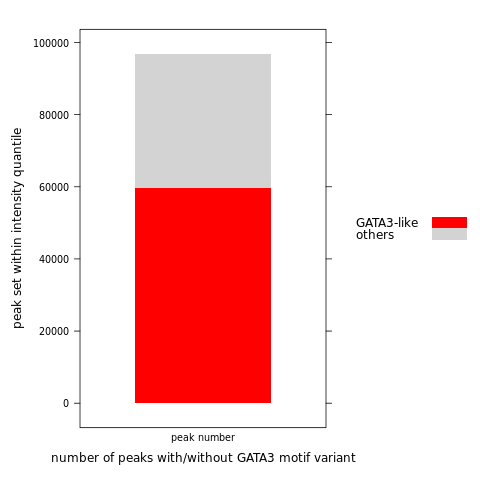 
```

```{r  out.width = "80%", out.height="80%", echo=F, fig.align = "center", fig.cap="number of peaks with or without GATA3 motif variants"}
#library(knitr)
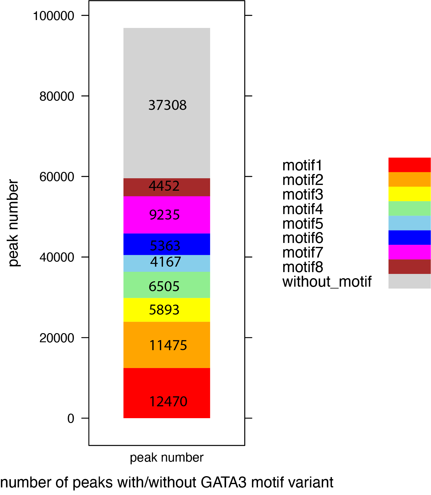 
```


```{r  out.width = "80%", out.height="80%", echo=F, fig.align = "center", fig.cap="number of peaks with or without GATA3 motif variants"}
#library(knitr)
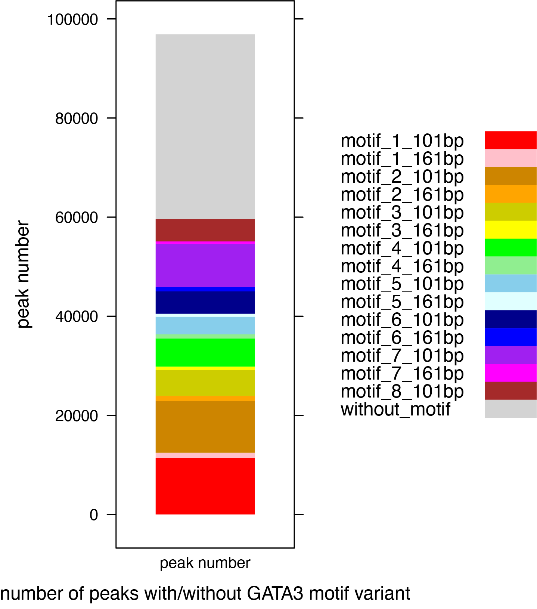 
```

**bar plot (group by peak intensity)** \
The fraction of peaks with MEME-found-motif 123456, as well as STREME-found motif78, in each quantile: \
```{r, engine='R' ,eval=F, echo=TRUE}
# quantile file is 1bp summit file, expanded to 161window
#module load R/4.1.2 
#R
library(bigWig)

for (chip.peak in Sys.glob(file.path("/home/FCAM/ssun/GATA3_ChIP_PRO_July2023/ChIP_final/peak_Intensity/GATA_Deseq2/quantile*summits.bed")))  {
    print(chip.peak)
    quantile.name = strsplit(strsplit(chip.peak, "/")[[1]][length(strsplit(chip.peak, "/")[[1]])], '_summits.bed')[[1]][1]
    print(quantile.name)
    chip.peaks=read.table(chip.peak, header=FALSE)
    chip.peak.161win=center.bed(chip.peaks, upstreamWindow=80, downstreamWindow=80)
    write.table(chip.peak.161win,file= paste0(quantile.name, '_summits_161window.bed'), quote=F,sep="\t",col.names=F,row.names=F)
    }
```


```{r, engine='bash' ,eval=F, echo=TRUE}
module load bedtools
dir="/home/FCAM/ssun/GATA3_ChIP_PRO_July2023/ChIP_final/peak_Intensity/GATA_Deseq2/"

# quantile peaks with individual motif
for i in ${dir}*quantile*161window.bed
do
  nm=$(echo $i | awk -F $dir '{print $2}' | awk -F "_summits_161window.bed" '{print $1}')
  intersectBed -wa -a $i -b ../without_motifs_123456_78_161bp_mast.bed | sort -k1,1 -k2,2n | uniq >${nm}_without_motifs_123456_78_161bp_mast.bed
done


touch quantile.240103.sum.161window.txt
for i in *quantile*_without_motifs*.bed
do
 nm=$(echo $i | awk -F"_without_motifs_123456_78_161bp_mast.bed" '{print $1}')
 p=$(wc -l $i | awk '{OFS="\t";} {print $1}')
 totalp=$(wc -l ${dir}${nm}_summits.bed | awk '{OFS="\t";} {print $1}')
 withoutMotif=$(bc <<< "scale=4 ; $p / $totalp")
 withMotif=$(bc <<< "scale=4 ; ($totalp- $p) / $totalp")
 echo $nm "" $withoutMotif "" $withMotif>> quantile.240103.sum.161window.txt
done
```

```{r, engine='R' ,eval=F, echo=TRUE}
#module load R/4.1.2 
#R 

library("lattice") 
library("reshape2")


df_sum=read.table('quantile.240103.sum.161window.txt', sep = "", header=FALSE)
colnames(df_sum)=c("quantile","without_Motif","with_Motif")
df_sum_long <- df_sum

df_sum_long <- melt(df_sum_long, id = "quantile")
df_sum_long$variable<- factor(df_sum_long$variable, levels = c("with_Motif", "without_Motif"))

pdf('240103_percent_peaks_withorwithout_GATA3_motif_variant.pdf',width=8,height=5)
my.settings <- list(
  superpose.polygon=list(col=c("black", "grey"), border="transparent"),
  strip.background=list(col="grey80", cex = 0.6),
  strip.border=list(col="black")
)
print(barchart(value ~ quantile,         
         data = df_sum_long,
         groups = variable,
         stack = TRUE,
         auto.key=list(space="right"),
         scales = list(x = list(rot = 45)),
         ylab = "peak set within intensity quantile",
         xlab = "fraction of peaks with/without GATA3 motif variant",
         par.settings = my.settings)
)
dev.off()

png('240103_percent_peaks_withorwithout_GATA3_motif_variant.png')
my.settings <- list(
  superpose.polygon=list(col=c("black", "grey"), border="transparent"),
  strip.background=list(col="grey80", cex = 0.6),
  strip.border=list(col="black")
)
print(barchart(value ~ quantile,         
         data = df_sum_long,
         groups = variable,
         stack = TRUE,
         auto.key=list(space="right"),
         scales = list(x = list(rot = 45)),
         ylab = "peak set within intensity quantile",
         xlab = "fraction of peaks with/without GATA3 motif variant",
         par.settings = my.settings)
)
dev.off()
```


percent peaks with or without GATA3 motif (variant 1,2,3,4,5,6,7,8,9): \
```{r  out.width = "100%", out.height="50%", echo=F, fig.align = "center", fig.cap="percent peaks with or without GATA3 motif variants"}
#library(knitr)
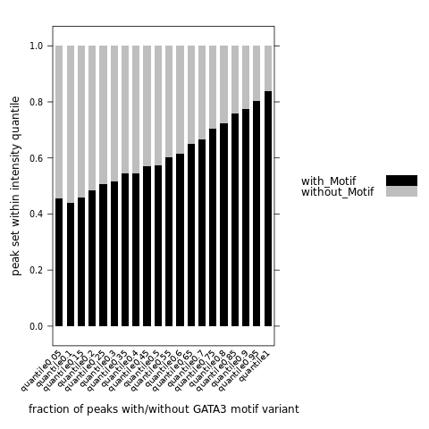 
```

For peaks in the top quantile intensity (top 5% highest intensity), we have ~16% peaks MEME/STREME are not able to find GATA3 binding elements. \


## ENCODE DHS in MCF7 cells


### Retrive the ENCODE DNAse-seq data for MCF7 cells (Refer to GSE29692) \

Stam_MCF-7_1: https://www.ncbi.nlm.nih.gov/geo/query/acc.cgi?acc=GSM736581 \
Stam_MCF-7_2: https://www.ncbi.nlm.nih.gov/geo/query/acc.cgi?acc=GSM736588 \

**IMPORTANT** \
1) Notice that these data are using hg19 genome, we need to use UCSC liftover to convert data to hg38. \
2) While processing the negative control (DHS regions), we want to remove the 8 motifs first, use same window (161bp) and same mast p value. \

```{r, engine='bash' ,eval=F, echo=TRUE}
# 173277 MCF7-DS12619.peaks.fdr0.01.hg19.bed
head -5 MCF7-DS12619.peaks.fdr0.01.hg19.bed
#chr1	10180	10330	.	0	.	12	5.68855	-1	-1
#chr1	16160	16310	.	0	.	11	4.49825	-1	-1
#chr1	237660	237810	.	0	.	41	33.423	-1	-1
#chr1	521440	521590	.	0	.	66	76.4085	-1	-1
#chr1	565560	565710	.	0	.	91	20.8239	-1	-1

#126717 MCF7-DS9445.peaks.fdr0.01.hg19.bed
head -5 MCF7-DS9445.peaks.fdr0.01.hg19.bed
#chr1	237720	237870	.	0	.	11	7.10762	-1	-1
#chr1	521440	521590	.	0	.	16	15.6231	-1	-1
#chr1	565280	565430	.	0	.	41	11.9262	-1	-1
#chr1	565540	565690	.	0	.	54	39.9645	-1	-1
#chr1	565860	566010	.	0	.	95	39.9645	-1	-1
```

Process the file, keep only the coordinates info. (liftover has format requirements). \
```{r, engine='bash' ,eval=F, echo=TRUE}
awk '{OFS="\t"} {print $1, $2, $3}' MCF7-DS12619.peaks.fdr0.01.hg19.bed > MCF7_hg19_Encode_DHS_Rep2.bed
awk '{OFS="\t"} {print $1, $2, $3}' MCF7-DS9445.peaks.fdr0.01.hg19.bed > MCF7_hg19_Encode_DHS_Rep1.bed
head -5 MCF7_hg19_Encode_DHS_Rep2.bed #173277
#chr1	10180	10330
#chr1	16160	16310
#chr1	237660	237810
#chr1	521440	521590
#chr1	565560	565710

head -5 MCF7_hg19_Encode_DHS_Rep1.bed #126717
#chr1	237720	237870
#chr1	521440	521590
#chr1	565280	565430
#chr1	565540	565690
#chr1	565860	566010
```

Then we go to the UCSC liftover online tool to convert the hg19 regions to hg38 regions. \
https://genome.ucsc.edu/cgi-bin/hgLiftOver \

```{r, engine='bash' ,eval=F, echo=TRUE}
head -5 MCF7_hg38_Encode_DHS_Rep2.bed # 173226
#chr1	10180	10330	chr1:10181-10330	1
#chr1	16160	16310	chr1:16161-16310	1
#chr1	267909	268059	chr1:237661-237810	1
#chr1	586060	586210	chr1:521441-521590	1
#chr1	630180	630330	chr1:565561-565710	1

head -5 MCF7_hg38_Encode_DHS_Rep1.bed # 126690
#chr1	267969	268119	chr1:237721-237870	1
#chr1	586060	586210	chr1:521441-521590	1
#chr1	629900	630050	chr1:565281-565430	1
#chr1	630160	630310	chr1:565541-565690	1
#chr1	630480	630630	chr1:565861-566010	1
```

Notice that, during liftover process, there are chance to lose some regions. \

Remove the original hg19 coordinates info, and keep only the hg38 coordinates. \
```{r, engine='bash' ,eval=F, echo=TRUE}
awk '{OFS="\t"} {print $1, $2, $3}' MCF7_hg38_Encode_DHS_Rep2.bed > MCF7_hg38_Encode_DHS_Rep2_peak.bed
awk '{OFS="\t"} {print $1, $2, $3}' MCF7_hg38_Encode_DHS_Rep1.bed > MCF7_hg38_Encode_DHS_Rep1_peak.bed

wc -l MCF7_hg38_Encode_DHS_Rep2.bed #173226
wc -l MCF7_hg38_Encode_DHS_Rep2_peak.bed #173226
head -5 MCF7_hg38_Encode_DHS_Rep2_peak.bed
#chr1	10180	10330
#chr1	16160	16310
#chr1	267909	268059
#chr1	586060	586210
#chr1	630180	630330

wc -l MCF7_hg38_Encode_DHS_Rep1.bed #126690
wc -l MCF7_hg38_Encode_DHS_Rep1_peak.bed #126690
head -5 MCF7_hg38_Encode_DHS_Rep1_peak.bed
#chr1	267969	268119
#chr1	586060	586210
#chr1	629900	630050
#chr1	630160	630310
#chr1	630480	630630
```

Make alternative bed files that keep the original intensity info. \
Notice that the original file from ENCODE is in bigNarrowPeak format with 10 columns, the 7th column is the signalValue: "Measurement of average enrichment for the region". \
```{r, engine='bash', class.source = "revision", eval=F, echo=TRUE}
#files contains intensity info with hg19 coordinates
#to match with the converted hg38 file, add 1bp to the start coordinates.
awk '{print $1":"$2+1"-"$3, $7}' MCF7-DS9445.peaks.fdr0.01.hg19.bed > hg19.rep1.intensity.bed
awk '{print $1":"$2+1"-"$3, $7}' MCF7-DS12619.peaks.fdr0.01.hg19.bed > hg19.rep2.intensity.bed
```


```{r, engine='R', class.source = "revision", eval=T, echo=TRUE}
#files contains intensity info with hg19 coordinates
hg19.rep1=read.table('hg19.rep1.intensity.bed', sep = "", header=FALSE)  #rep1
hg19.rep2=read.table('hg19.rep2.intensity.bed', sep = "", header=FALSE) #rep2

colnames(hg19.rep1)[1]="hg19"
colnames(hg19.rep2)[1]="hg19"


#files contains intensity info with hg38 coordinates
hg38.rep1=read.table('MCF7_hg38_Encode_DHS_Rep1.bed', sep = "\t", header=FALSE)
hg38.rep2=read.table('MCF7_hg38_Encode_DHS_Rep2.bed', sep = "\t", header=FALSE) 
colnames(hg38.rep1)[4]="hg19"
colnames(hg38.rep2)[4]="hg19"

merged.hg38.rep1.intensity <- merge(hg38.rep1, hg19.rep1, by = 'hg19', all.x = TRUE)
merged.hg38.rep2.intensity <- merge(hg38.rep2, hg19.rep2, by = 'hg19', all.x = TRUE)

write.table(merged.hg38.rep1.intensity[, c(2,3,4,6)],file= 'hg38.rep1.intensity.bed', quote=F,sep="\t",col.names=F,row.names=F)
write.table(merged.hg38.rep2.intensity[, c(2,3,4,6)],file= 'hg38.rep2.intensity.bed', quote=F,sep="\t",col.names=F,row.names=F)
```


### remove regions overlap with GATA3 binding sites

**make sure the DHS regions are 161bp window** \
```{r engine='R', eval=T, echo=TRUE}
library(bigWig)
peak.region.summit1=center.bed(read.table('MCF7_hg38_Encode_DHS_Rep1_peak.bed', sep = "\t", header=FALSE), upstreamWindow = 0, downstreamWindow = 0)
peak.region.summit2=center.bed(read.table('MCF7_hg38_Encode_DHS_Rep2_peak.bed', sep = "\t", header=FALSE), upstreamWindow = 0, downstreamWindow = 0)

peak.region.161bp.1=center.bed(peak.region.summit1, upstreamWindow = 80, downstreamWindow = 80)
peak.region.161bp.2=center.bed(peak.region.summit2, upstreamWindow = 80, downstreamWindow = 80)
head(peak.region.161bp.1)
head(peak.region.161bp.2)

write.table(peak.region.161bp.1,file= 'MCF7_hg38_Encode_DHS_Rep1_161bp_peak.bed', quote=F,sep="\t",col.names=F,row.names=F)
write.table(peak.region.161bp.2,file= 'MCF7_hg38_Encode_DHS_Rep2_161bp_peak.bed', quote=F,sep="\t",col.names=F,row.names=F)
```

**remove GATA3 motifs with `MAST`** \

The DHS regions contain all regulatory regions that are sensitive to DNAse. To make a independent negative control, we use `MAST` to remove  regulatory regions that overlap with GATA3-like motif 12345678 (use same p-value stringency). \

First convert regulatory region file from .bed to .fasta. \

```{r engine='bash', eval=F, echo=TRUE}
module load bedtools
genome=/home/FCAM/ssun/Genome/hg38.fa

fastaFromBed -fi $genome -bed MCF7_hg38_Encode_DHS_Rep1_161bp_peak.bed -fo MCF7_hg38_Encode_DHS_Rep1_161bp_peak.fasta
fastaFromBed -fi $genome -bed MCF7_hg38_Encode_DHS_Rep2_161bp_peak.bed -fo MCF7_hg38_Encode_DHS_Rep2_161bp_peak.fasta
```

```{r engine='bash', eval=T, echo=TRUE}
head -3 MCF7_hg38_Encode_DHS_Rep1_161bp_peak.bed
head -6 MCF7_hg38_Encode_DHS_Rep1_161bp_peak.fasta
head -3 MCF7_hg38_Encode_DHS_Rep2_161bp_peak.bed
head -6 MCF7_hg38_Encode_DHS_Rep2_161bp_peak.fasta
```


We have 8 motifs that found by MEME/STREME software. \

```{r engine='bash', eval=T, echo=TRUE}
ls individual_meme/
```
MCF7_hg38_Encode_DHS_Rep1_161bp_peak.fasta \

MEME (`mast` uses default p-value: 0.0001) \
```{r engine='bash', eval=F, echo=TRUE}
module load meme/5.4.1
module load R/4.1.2
module load bedtools
genome=/home/FCAM/ssun/Genome/hg38.fa
dir=/home/FCAM/ssun/GATA3_ChIP_PRO_July2023/ChIP_final/Exhaustive_MEME_MAST_round1to8/individual_meme/

#round1
mast -hit_list -best ${dir}GATAmotif1_meme.txt MCF7_hg38_Encode_DHS_Rep1_161bp_peak.fasta > mast_GATA3_PSWM_in_MCF7_DHS_Rep1_round1.txt
Rscript /home/FCAM/ssun/scripts/parse_mast_to_coordinates.R mast_GATA3_PSWM_in_MCF7_DHS_Rep1_round1.txt
wc -l mast_GATA3_PSWM_in_MCF7_DHS_Rep1_round1.bed #5836
intersectBed -v -a MCF7_hg38_Encode_DHS_Rep1_161bp_peak.bed -b mast_GATA3_PSWM_in_MCF7_DHS_Rep1_round1.bed > MCF7DHS_Rep1_161bp_without_motifs_1.bed
wc -l MCF7DHS_Rep1_161bp_without_motifs_1.bed #120854

#round2
fastaFromBed -fi $genome -bed MCF7DHS_Rep1_161bp_without_motifs_1.bed -fo MCF7DHS_Rep1_161bp_without_motifs_1.fasta
mast -hit_list -best ${dir}GATAmotif2_meme.txt MCF7DHS_Rep1_161bp_without_motifs_1.fasta > mast_GATA3_PSWM_in_MCF7_DHS_Rep1_round2.txt
Rscript /home/FCAM/ssun/scripts/parse_mast_to_coordinates.R mast_GATA3_PSWM_in_MCF7_DHS_Rep1_round2.txt
wc -l mast_GATA3_PSWM_in_MCF7_DHS_Rep1_round2.bed #4978
intersectBed -v -a MCF7DHS_Rep1_161bp_without_motifs_1.bed -b mast_GATA3_PSWM_in_MCF7_DHS_Rep1_round2.bed > MCF7DHS_Rep1_161bp_without_motifs_12.bed
wc -l MCF7DHS_Rep1_161bp_without_motifs_12.bed #115876

#round3
fastaFromBed -fi $genome -bed MCF7DHS_Rep1_161bp_without_motifs_12.bed -fo MCF7DHS_Rep1_161bp_without_motifs_12.fasta
mast -hit_list -best ${dir}GATAmotif3_meme.txt MCF7DHS_Rep1_161bp_without_motifs_12.fasta > mast_GATA3_PSWM_in_MCF7_DHS_Rep1_round3.txt
Rscript /home/FCAM/ssun/scripts/parse_mast_to_coordinates.R mast_GATA3_PSWM_in_MCF7_DHS_Rep1_round3.txt
wc -l mast_GATA3_PSWM_in_MCF7_DHS_Rep1_round3.bed #2263
intersectBed -v -a MCF7DHS_Rep1_161bp_without_motifs_12.bed -b mast_GATA3_PSWM_in_MCF7_DHS_Rep1_round3.bed > MCF7DHS_Rep1_161bp_without_motifs_123.bed
wc -l MCF7DHS_Rep1_161bp_without_motifs_123.bed #113613

#round4
fastaFromBed -fi $genome -bed MCF7DHS_Rep1_161bp_without_motifs_123.bed -fo MCF7DHS_Rep1_161bp_without_motifs_123.fasta
mast -hit_list -best ${dir}GATAmotif4_meme.txt MCF7DHS_Rep1_161bp_without_motifs_123.fasta > mast_GATA3_PSWM_in_MCF7_DHS_Rep1_round4.txt
Rscript /home/FCAM/ssun/scripts/parse_mast_to_coordinates.R mast_GATA3_PSWM_in_MCF7_DHS_Rep1_round4.txt
wc -l mast_GATA3_PSWM_in_MCF7_DHS_Rep1_round4.bed #3237
intersectBed -v -a MCF7DHS_Rep1_161bp_without_motifs_123.bed -b mast_GATA3_PSWM_in_MCF7_DHS_Rep1_round4.bed > MCF7DHS_Rep1_161bp_without_motifs_1234.bed
wc -l MCF7DHS_Rep1_161bp_without_motifs_1234.bed #110376

#round5
fastaFromBed -fi $genome -bed MCF7DHS_Rep1_161bp_without_motifs_1234.bed -fo MCF7DHS_Rep1_161bp_without_motifs_1234.fasta
mast -hit_list -best ${dir}GATAmotif5_meme.txt MCF7DHS_Rep1_161bp_without_motifs_1234.fasta > mast_GATA3_PSWM_in_MCF7_DHS_Rep1_round5.txt
Rscript /home/FCAM/ssun/scripts/parse_mast_to_coordinates.R mast_GATA3_PSWM_in_MCF7_DHS_Rep1_round5.txt
wc -l mast_GATA3_PSWM_in_MCF7_DHS_Rep1_round5.bed #2629
intersectBed -v -a MCF7DHS_Rep1_161bp_without_motifs_1234.bed -b mast_GATA3_PSWM_in_MCF7_DHS_Rep1_round5.bed > MCF7DHS_Rep1_161bp_without_motifs_12345.bed
wc -l MCF7DHS_Rep1_161bp_without_motifs_12345.bed #107747


#round6
fastaFromBed -fi $genome -bed MCF7DHS_Rep1_161bp_without_motifs_12345.bed -fo MCF7DHS_Rep1_161bp_without_motifs_12345.fasta
mast -hit_list -best ${dir}GATAmotif6_meme.txt MCF7DHS_Rep1_161bp_without_motifs_12345.fasta > mast_GATA3_PSWM_in_MCF7_DHS_Rep1_round6.txt
Rscript /home/FCAM/ssun/scripts/parse_mast_to_coordinates.R mast_GATA3_PSWM_in_MCF7_DHS_Rep1_round6.txt
wc -l mast_GATA3_PSWM_in_MCF7_DHS_Rep1_round6.bed #2800
intersectBed -v -a MCF7DHS_Rep1_161bp_without_motifs_12345.bed -b mast_GATA3_PSWM_in_MCF7_DHS_Rep1_round6.bed > MCF7DHS_Rep1_161bp_without_motifs_123456.bed
wc -l MCF7DHS_Rep1_161bp_without_motifs_123456.bed #104947
```

STREME (`mast` uses p-value of 0.0005) \
```{r engine='bash', eval=F, echo=TRUE}
#round7
fastaFromBed -fi $genome -bed MCF7DHS_Rep1_161bp_without_motifs_123456.bed -fo MCF7DHS_Rep1_161bp_without_motifs_123456.fasta
mast -mt 0.0005 -hit_list -best ${dir}AGATAAM_streme.txt MCF7DHS_Rep1_161bp_without_motifs_123456.fasta > mast_GATA3_PSWM_in_MCF7_DHS_Rep1_round7.txt
Rscript /home/FCAM/ssun/scripts/parse_mast_to_coordinates.R mast_GATA3_PSWM_in_MCF7_DHS_Rep1_round7.txt
wc -l mast_GATA3_PSWM_in_MCF7_DHS_Rep1_round7.bed #8176
intersectBed -v -a MCF7DHS_Rep1_161bp_without_motifs_123456.bed -b mast_GATA3_PSWM_in_MCF7_DHS_Rep1_round7.bed > MCF7DHS_Rep1_161bp_without_motifs_123456_7.bed
wc -l MCF7DHS_Rep1_161bp_without_motifs_123456_7.bed #96771


#round8
fastaFromBed -fi $genome -bed MCF7DHS_Rep1_161bp_without_motifs_123456_7.bed -fo MCF7DHS_Rep1_161bp_without_motifs_123456_7.fasta
mast -mt 0.0005 -hit_list -best ${dir}TGATAA_streme.txt MCF7DHS_Rep1_161bp_without_motifs_123456_7.fasta > mast_GATA3_PSWM_in_MCF7_DHS_Rep1_round8.txt 
Rscript /home/FCAM/ssun/scripts/parse_mast_to_coordinates.R mast_GATA3_PSWM_in_MCF7_DHS_Rep1_round8.txt 
wc -l mast_GATA3_PSWM_in_MCF7_DHS_Rep1_round8.bed #4383
intersectBed -v -a MCF7DHS_Rep1_161bp_without_motifs_123456_7.bed -b mast_GATA3_PSWM_in_MCF7_DHS_Rep1_round8.bed > MCF7DHS_Rep1_161bp_without_motifs_123456_78.bed
wc -l MCF7DHS_Rep1_161bp_without_motifs_123456_78.bed  #92388

```


MCF7_hg38_Encode_DHS_Rep2_161bp_peak.fasta \

MEME (`mast` uses default p-value: 0.0001) \
```{r engine='bash', eval=F, echo=TRUE}
module load meme/5.4.1
module load R/4.1.2
module load bedtools
genome=/home/FCAM/ssun/Genome/hg38.fa
dir=/home/FCAM/ssun/GATA3_ChIP_PRO_July2023/ChIP_final/Exhaustive_MEME_MAST_round1to8/individual_meme/

#round1
mast -hit_list -best ${dir}GATAmotif1_meme.txt MCF7_hg38_Encode_DHS_Rep2_161bp_peak.fasta > mast_GATA3_PSWM_in_MCF7_DHS_Rep2_round1.txt
Rscript /home/FCAM/ssun/scripts/parse_mast_to_coordinates.R mast_GATA3_PSWM_in_MCF7_DHS_Rep2_round1.txt
wc -l mast_GATA3_PSWM_in_MCF7_DHS_Rep2_round1.bed #5249
intersectBed -v -a MCF7_hg38_Encode_DHS_Rep2_161bp_peak.bed -b mast_GATA3_PSWM_in_MCF7_DHS_Rep2_round1.bed > MCF7DHS_Rep2_161bp_without_motifs_1.bed
wc -l MCF7DHS_Rep2_161bp_without_motifs_1.bed #167977

#round2
fastaFromBed -fi $genome -bed MCF7DHS_Rep2_161bp_without_motifs_1.bed -fo MCF7DHS_Rep2_161bp_without_motifs_1.fasta
mast -hit_list -best ${dir}GATAmotif2_meme.txt MCF7DHS_Rep2_161bp_without_motifs_1.fasta > mast_GATA3_PSWM_in_MCF7_DHS_Rep2_round2.txt
Rscript /home/FCAM/ssun/scripts/parse_mast_to_coordinates.R mast_GATA3_PSWM_in_MCF7_DHS_Rep2_round2.txt
wc -l mast_GATA3_PSWM_in_MCF7_DHS_Rep2_round2.bed #4249
intersectBed -v -a MCF7DHS_Rep2_161bp_without_motifs_1.bed -b mast_GATA3_PSWM_in_MCF7_DHS_Rep2_round2.bed > MCF7DHS_Rep2_161bp_without_motifs_12.bed
wc -l MCF7DHS_Rep2_161bp_without_motifs_12.bed #163728

#round3
fastaFromBed -fi $genome -bed MCF7DHS_Rep2_161bp_without_motifs_12.bed -fo MCF7DHS_Rep2_161bp_without_motifs_12.fasta
mast -hit_list -best ${dir}GATAmotif3_meme.txt MCF7DHS_Rep2_161bp_without_motifs_12.fasta > mast_GATA3_PSWM_in_MCF7_DHS_Rep2_round3.txt
Rscript /home/FCAM/ssun/scripts/parse_mast_to_coordinates.R mast_GATA3_PSWM_in_MCF7_DHS_Rep2_round3.txt
wc -l mast_GATA3_PSWM_in_MCF7_DHS_Rep2_round3.bed #1864
intersectBed -v -a MCF7DHS_Rep2_161bp_without_motifs_12.bed -b mast_GATA3_PSWM_in_MCF7_DHS_Rep2_round3.bed > MCF7DHS_Rep2_161bp_without_motifs_123.bed
wc -l MCF7DHS_Rep2_161bp_without_motifs_123.bed #161864

#round4
fastaFromBed -fi $genome -bed MCF7DHS_Rep2_161bp_without_motifs_123.bed -fo MCF7DHS_Rep2_161bp_without_motifs_123.fasta
mast -hit_list -best ${dir}GATAmotif4_meme.txt MCF7DHS_Rep2_161bp_without_motifs_123.fasta > mast_GATA3_PSWM_in_MCF7_DHS_Rep2_round4.txt
Rscript /home/FCAM/ssun/scripts/parse_mast_to_coordinates.R mast_GATA3_PSWM_in_MCF7_DHS_Rep2_round4.txt
wc -l mast_GATA3_PSWM_in_MCF7_DHS_Rep2_round4.bed #3075
intersectBed -v -a MCF7DHS_Rep2_161bp_without_motifs_123.bed -b mast_GATA3_PSWM_in_MCF7_DHS_Rep2_round4.bed > MCF7DHS_Rep2_161bp_without_motifs_1234.bed
wc -l MCF7DHS_Rep2_161bp_without_motifs_1234.bed #158789

#round5
fastaFromBed -fi $genome -bed MCF7DHS_Rep2_161bp_without_motifs_1234.bed -fo MCF7DHS_Rep2_161bp_without_motifs_1234.fasta
mast -hit_list -best ${dir}GATAmotif5_meme.txt MCF7DHS_Rep2_161bp_without_motifs_1234.fasta > mast_GATA3_PSWM_in_MCF7_DHS_Rep2_round5.txt
Rscript /home/FCAM/ssun/scripts/parse_mast_to_coordinates.R mast_GATA3_PSWM_in_MCF7_DHS_Rep2_round5.txt
wc -l mast_GATA3_PSWM_in_MCF7_DHS_Rep2_round5.bed #2510
intersectBed -v -a MCF7DHS_Rep2_161bp_without_motifs_1234.bed -b mast_GATA3_PSWM_in_MCF7_DHS_Rep2_round5.bed > MCF7DHS_Rep2_161bp_without_motifs_12345.bed
wc -l MCF7DHS_Rep2_161bp_without_motifs_12345.bed #156279


#round6
fastaFromBed -fi $genome -bed MCF7DHS_Rep2_161bp_without_motifs_12345.bed -fo MCF7DHS_Rep2_161bp_without_motifs_12345.fasta
mast -hit_list -best ${dir}GATAmotif6_meme.txt MCF7DHS_Rep2_161bp_without_motifs_12345.fasta > mast_GATA3_PSWM_in_MCF7_DHS_Rep2_round6.txt
Rscript /home/FCAM/ssun/scripts/parse_mast_to_coordinates.R mast_GATA3_PSWM_in_MCF7_DHS_Rep2_round6.txt
wc -l mast_GATA3_PSWM_in_MCF7_DHS_Rep2_round6.bed #2689
intersectBed -v -a MCF7DHS_Rep2_161bp_without_motifs_12345.bed -b mast_GATA3_PSWM_in_MCF7_DHS_Rep2_round6.bed > MCF7DHS_Rep2_161bp_without_motifs_123456.bed
wc -l MCF7DHS_Rep2_161bp_without_motifs_123456.bed #153590
```

STREME (`mast` uses p-value of 0.0005) \
```{r engine='bash', eval=F, echo=TRUE}
#round7
fastaFromBed -fi $genome -bed MCF7DHS_Rep2_161bp_without_motifs_123456.bed -fo MCF7DHS_Rep2_161bp_without_motifs_123456.fasta
mast -mt 0.0005 -hit_list -best ${dir}AGATAAM_streme.txt MCF7DHS_Rep2_161bp_without_motifs_123456.fasta > mast_GATA3_PSWM_in_MCF7_DHS_Rep2_round7.txt
Rscript /home/FCAM/ssun/scripts/parse_mast_to_coordinates.R mast_GATA3_PSWM_in_MCF7_DHS_Rep2_round7.txt
wc -l mast_GATA3_PSWM_in_MCF7_DHS_Rep2_round7.bed #8783
intersectBed -v -a MCF7DHS_Rep2_161bp_without_motifs_123456.bed -b mast_GATA3_PSWM_in_MCF7_DHS_Rep2_round7.bed > MCF7DHS_Rep2_161bp_without_motifs_123456_7.bed
wc -l MCF7DHS_Rep2_161bp_without_motifs_123456_7.bed #144807


#round8
fastaFromBed -fi $genome -bed MCF7DHS_Rep2_161bp_without_motifs_123456_7.bed -fo MCF7DHS_Rep2_161bp_without_motifs_123456_7.fasta
mast -mt 0.0005 -hit_list -best ${dir}TGATAA_streme.txt MCF7DHS_Rep2_161bp_without_motifs_123456_7.fasta > mast_GATA3_PSWM_in_MCF7_DHS_Rep2_round8.txt 
Rscript /home/FCAM/ssun/scripts/parse_mast_to_coordinates.R mast_GATA3_PSWM_in_MCF7_DHS_Rep2_round8.txt 
wc -l mast_GATA3_PSWM_in_MCF7_DHS_Rep2_round8.bed #4908
intersectBed -v -a MCF7DHS_Rep2_161bp_without_motifs_123456_7.bed -b mast_GATA3_PSWM_in_MCF7_DHS_Rep2_round8.bed > MCF7DHS_Rep2_161bp_without_motifs_123456_78.bed
wc -l MCF7DHS_Rep2_161bp_without_motifs_123456_78.bed  #139899

```


We have discovered 8 motifs using MEME/STREME software. Previously, we concatenated them into a single motif matrix database file ("combined_output_meme.txt"). Now, we aim to perform a **coherence check** by using MAST to scan this concatenated file against the remaining regions. \

```{r engine='bash', eval=F, echo=TRUE}
#rep1
mast -hit_list -best combined_output_meme.txt MCF7DHS_Rep1_161bp_without_motifs_123456_78.bed > mast_GATA3_PSWM_in_MCF7_DHS_Rep1_round9.txt 
#rep2
mast -hit_list -best combined_output_meme.txt MCF7DHS_Rep2_161bp_without_motifs_123456_78.bed > mast_GATA3_PSWM_in_MCF7_DHS_Rep2_round9.txt 
```

Mast the concatenated file against the remaining regions do not give overlapped regions. \


## Independent control -- remove GATA3 peak regions from the DHS regions

To make an independent control, we can remove all overlapped GATA3 ChIP-seq peak regions from the DHS regions. Then we will MAST against the remaining DHS regions, and see what is the random odds we could get GATA3 bindin region. \
```{r, engine='bash' ,eval=F, echo=TRUE}
module load bedtools
sizes=/home/FCAM/ssun/Genome/hg38.chrom.sizes
dir=/home/FCAM/ssun/GATA3_ChIP_PRO_July2023/ChIP_final/peak_call/

slopBed -b 80 -i ${dir}GATA_ChIP_summits_final.bed -g $sizes  | sort -k1,1 -k2,2n > GATA_ChIP_summit_161window.bed

#remove overlapped GATA3 peak regions from DHS regions
intersectBed -v -a MCF7_hg38_Encode_DHS_Rep1_161bp_peak.bed -b GATA_ChIP_summit_161window.bed > MCF7_hg38_Encode_DHS_Rep1_161bp_noGATA_peak.bed
intersectBed -v -a MCF7_hg38_Encode_DHS_Rep2_161bp_peak.bed -b GATA_ChIP_summit_161window.bed > MCF7_hg38_Encode_DHS_Rep2_161bp_noGATA_peak.bed
```

```{r, engine='bash' ,eval=F, echo=TRUE}
wc -l MCF7_hg38_Encode_DHS_Rep1_161bp_peak.bed #126690
wc -l MCF7_hg38_Encode_DHS_Rep1_161bp_noGATA_peak.bed #84362
wc -l MCF7_hg38_Encode_DHS_Rep2_161bp_peak.bed #173226
wc -l MCF7_hg38_Encode_DHS_Rep2_161bp_noGATA_peak.bed #131896
```

convert to fasta. \
```{r, engine='bash' ,eval=F, echo=TRUE}
module load bedtools
genome=/home/FCAM/ssun/Genome/hg38.fa

fastaFromBed -fi $genome -bed MCF7_hg38_Encode_DHS_Rep1_161bp_noGATA_peak.bed -fo MCF7_hg38_Encode_DHS_Rep1_161bp_noGATA_peak.fasta
fastaFromBed -fi $genome -bed MCF7_hg38_Encode_DHS_Rep2_161bp_noGATA_peak.bed -fo MCF7_hg38_Encode_DHS_Rep2_161bp_noGATA_peak.fasta
```

```{r engine='bash', eval=T, echo=TRUE}
head -3 MCF7_hg38_Encode_DHS_Rep1_161bp_noGATA_peak.bed
head -6 MCF7_hg38_Encode_DHS_Rep1_161bp_noGATA_peak.fasta
head -3 MCF7_hg38_Encode_DHS_Rep2_161bp_noGATA_peak.bed
head -6 MCF7_hg38_Encode_DHS_Rep2_161bp_noGATA_peak.fasta
```

MCF7_hg38_Encode_DHS_Rep1_161bp_noGATA_peak.fasta \

MEME (`mast` uses default p-value: 0.0001) \
```{r engine='bash', eval=F, echo=TRUE}
module load meme/5.4.1
module load R/4.1.2
module load bedtools
genome=/home/FCAM/ssun/Genome/hg38.fa
dir=/home/FCAM/ssun/GATA3_ChIP_PRO_July2023/ChIP_final/Exhaustive_MEME_MAST_round1to8/individual_meme/

#round1
mast -hit_list -best ${dir}GATAmotif1_meme.txt MCF7_hg38_Encode_DHS_Rep1_161bp_noGATA_peak.fasta > mast_GATA3_PSWM_in_MCF7_DHS_Rep1_noGATA_round1.txt
Rscript /home/FCAM/ssun/scripts/parse_mast_to_coordinates.R mast_GATA3_PSWM_in_MCF7_DHS_Rep1_noGATA_round1.txt
wc -l mast_GATA3_PSWM_in_MCF7_DHS_Rep1_noGATA_round1.bed #1739
intersectBed -v -a MCF7_hg38_Encode_DHS_Rep1_161bp_noGATA_peak.bed -b mast_GATA3_PSWM_in_MCF7_DHS_Rep1_noGATA_round1.bed > MCF7DHS_Rep1_161bp_noGATA_without_motifs_1.bed
wc -l MCF7DHS_Rep1_161bp_noGATA_without_motifs_1.bed #82623

#round2
fastaFromBed -fi $genome -bed MCF7DHS_Rep1_161bp_noGATA_without_motifs_1.bed -fo MCF7DHS_Rep1_161bp_noGATA_without_motifs_1.fasta
mast -hit_list -best ${dir}GATAmotif2_meme.txt MCF7DHS_Rep1_161bp_noGATA_without_motifs_1.fasta > mast_GATA3_PSWM_in_MCF7_DHS_Rep1_noGATA_round2.txt
Rscript /home/FCAM/ssun/scripts/parse_mast_to_coordinates.R mast_GATA3_PSWM_in_MCF7_DHS_Rep1_noGATA_round2.txt
wc -l mast_GATA3_PSWM_in_MCF7_DHS_Rep1_noGATA_round2.bed #1517
intersectBed -v -a MCF7DHS_Rep1_161bp_noGATA_without_motifs_1.bed -b mast_GATA3_PSWM_in_MCF7_DHS_Rep1_noGATA_round2.bed > MCF7DHS_Rep1_161bp_noGATA_without_motifs_12.bed
wc -l MCF7DHS_Rep1_161bp_noGATA_without_motifs_12.bed #81106

#round3
fastaFromBed -fi $genome -bed MCF7DHS_Rep1_161bp_noGATA_without_motifs_12.bed -fo MCF7DHS_Rep1_161bp_noGATA_without_motifs_12.fasta
mast -hit_list -best ${dir}GATAmotif3_meme.txt MCF7DHS_Rep1_161bp_noGATA_without_motifs_12.fasta > mast_GATA3_PSWM_in_MCF7_DHS_Rep1_noGATA_round3.txt
Rscript /home/FCAM/ssun/scripts/parse_mast_to_coordinates.R mast_GATA3_PSWM_in_MCF7_DHS_Rep1_noGATA_round3.txt
wc -l mast_GATA3_PSWM_in_MCF7_DHS_Rep1_noGATA_round3.bed #802
intersectBed -v -a MCF7DHS_Rep1_161bp_noGATA_without_motifs_12.bed -b mast_GATA3_PSWM_in_MCF7_DHS_Rep1_noGATA_round3.bed > MCF7DHS_Rep1_161bp_noGATA_without_motifs_123.bed
wc -l MCF7DHS_Rep1_161bp_noGATA_without_motifs_123.bed #80304

#round4
fastaFromBed -fi $genome -bed MCF7DHS_Rep1_161bp_noGATA_without_motifs_123.bed -fo MCF7DHS_Rep1_161bp_noGATA_without_motifs_123.fasta
mast -hit_list -best ${dir}GATAmotif4_meme.txt MCF7DHS_Rep1_161bp_noGATA_without_motifs_123.fasta > mast_GATA3_PSWM_in_MCF7_DHS_Rep1_noGATA_round4.txt
Rscript /home/FCAM/ssun/scripts/parse_mast_to_coordinates.R mast_GATA3_PSWM_in_MCF7_DHS_Rep1_noGATA_round4.txt
wc -l mast_GATA3_PSWM_in_MCF7_DHS_Rep1_noGATA_round4.bed #1479
intersectBed -v -a MCF7DHS_Rep1_161bp_noGATA_without_motifs_123.bed -b mast_GATA3_PSWM_in_MCF7_DHS_Rep1_noGATA_round4.bed > MCF7DHS_Rep1_161bp_noGATA_without_motifs_1234.bed
wc -l MCF7DHS_Rep1_161bp_noGATA_without_motifs_1234.bed #78825

#round5
fastaFromBed -fi $genome -bed MCF7DHS_Rep1_161bp_noGATA_without_motifs_1234.bed -fo MCF7DHS_Rep1_161bp_noGATA_without_motifs_1234.fasta
mast -hit_list -best ${dir}GATAmotif5_meme.txt MCF7DHS_Rep1_161bp_noGATA_without_motifs_1234.fasta > mast_GATA3_PSWM_in_MCF7_DHS_Rep1_noGATA_round5.txt
Rscript /home/FCAM/ssun/scripts/parse_mast_to_coordinates.R mast_GATA3_PSWM_in_MCF7_DHS_Rep1_noGATA_round5.txt
wc -l mast_GATA3_PSWM_in_MCF7_DHS_Rep1_noGATA_round5.bed #1219
intersectBed -v -a MCF7DHS_Rep1_161bp_noGATA_without_motifs_1234.bed -b mast_GATA3_PSWM_in_MCF7_DHS_Rep1_noGATA_round5.bed > MCF7DHS_Rep1_161bp_noGATA_without_motifs_12345.bed
wc -l MCF7DHS_Rep1_161bp_noGATA_without_motifs_12345.bed #77606


#round6
fastaFromBed -fi $genome -bed MCF7DHS_Rep1_161bp_noGATA_without_motifs_12345.bed -fo MCF7DHS_Rep1_161bp_noGATA_without_motifs_12345.fasta
mast -hit_list -best ${dir}GATAmotif6_meme.txt MCF7DHS_Rep1_161bp_noGATA_without_motifs_12345.fasta > mast_GATA3_PSWM_in_MCF7_DHS_Rep1_noGATA_round6.txt
Rscript /home/FCAM/ssun/scripts/parse_mast_to_coordinates.R mast_GATA3_PSWM_in_MCF7_DHS_Rep1_noGATA_round6.txt
wc -l mast_GATA3_PSWM_in_MCF7_DHS_Rep1_noGATA_round6.bed #1239
intersectBed -v -a MCF7DHS_Rep1_161bp_noGATA_without_motifs_12345.bed -b mast_GATA3_PSWM_in_MCF7_DHS_Rep1_noGATA_round6.bed > MCF7DHS_Rep1_161bp_noGATA_without_motifs_123456.bed
wc -l MCF7DHS_Rep1_161bp_noGATA_without_motifs_123456.bed #76367
```

STREME (`mast` uses p-value of 0.0005) \
```{r engine='bash', eval=F, echo=TRUE}
#round7
fastaFromBed -fi $genome -bed MCF7DHS_Rep1_161bp_noGATA_without_motifs_123456.bed -fo MCF7DHS_Rep1_161bp_noGATA_without_motifs_123456.fasta
mast -mt 0.0005 -hit_list -best ${dir}AGATAAM_streme.txt MCF7DHS_Rep1_161bp_noGATA_without_motifs_123456.fasta > mast_GATA3_PSWM_in_MCF7_DHS_Rep1_noGATA_round7.txt
Rscript /home/FCAM/ssun/scripts/parse_mast_to_coordinates.R mast_GATA3_PSWM_in_MCF7_DHS_Rep1_noGATA_round7.txt
wc -l mast_GATA3_PSWM_in_MCF7_DHS_Rep1_noGATA_round7.bed #4663
intersectBed -v -a MCF7DHS_Rep1_161bp_noGATA_without_motifs_123456.bed -b mast_GATA3_PSWM_in_MCF7_DHS_Rep1_noGATA_round7.bed > MCF7DHS_Rep1_161bp_noGATA_without_motifs_123456_7.bed
wc -l MCF7DHS_Rep1_161bp_noGATA_without_motifs_123456_7.bed #71704


#round8
fastaFromBed -fi $genome -bed MCF7DHS_Rep1_161bp_noGATA_without_motifs_123456_7.bed -fo MCF7DHS_Rep1_161bp_noGATA_without_motifs_123456_7.fasta
mast -mt 0.0005 -hit_list -best ${dir}TGATAA_streme.txt MCF7DHS_Rep1_161bp_noGATA_without_motifs_123456_7.fasta > mast_GATA3_PSWM_in_MCF7_DHS_Rep1_noGATA_round8.txt 
Rscript /home/FCAM/ssun/scripts/parse_mast_to_coordinates.R mast_GATA3_PSWM_in_MCF7_DHS_Rep1_noGATA_round8.txt 
wc -l mast_GATA3_PSWM_in_MCF7_DHS_Rep1_noGATA_round8.bed #2585
intersectBed -v -a MCF7DHS_Rep1_161bp_noGATA_without_motifs_123456_7.bed -b mast_GATA3_PSWM_in_MCF7_DHS_Rep1_noGATA_round8.bed > MCF7DHS_Rep1_161bp_noGATA_without_motifs_123456_78.bed
wc -l MCF7DHS_Rep1_161bp_noGATA_without_motifs_123456_78.bed  #69119

```


MCF7_hg38_Encode_DHS_Rep2_161bp_noGATA_peak.fasta \

MEME (`mast` uses default p-value: 0.0001) \
```{r engine='bash', eval=F, echo=TRUE}
module load meme/5.4.1
module load R/4.1.2
module load bedtools
genome=/home/FCAM/ssun/Genome/hg38.fa
dir=/home/FCAM/ssun/GATA3_ChIP_PRO_July2023/ChIP_final/Exhaustive_MEME_MAST_round1to8/individual_meme/

#round1
mast -hit_list -best ${dir}GATAmotif1_meme.txt MCF7_hg38_Encode_DHS_Rep2_161bp_noGATA_peak.fasta > mast_GATA3_PSWM_in_MCF7_DHS_Rep2_noGATA_round1.txt
Rscript /home/FCAM/ssun/scripts/parse_mast_to_coordinates.R mast_GATA3_PSWM_in_MCF7_DHS_Rep2_noGATA_round1.txt
wc -l mast_GATA3_PSWM_in_MCF7_DHS_Rep2_noGATA_round1.bed #1976
intersectBed -v -a MCF7_hg38_Encode_DHS_Rep2_161bp_noGATA_peak.bed -b mast_GATA3_PSWM_in_MCF7_DHS_Rep2_noGATA_round1.bed > MCF7DHS_Rep2_161bp_noGATA_without_motifs_1.bed
wc -l MCF7DHS_Rep2_161bp_noGATA_without_motifs_1.bed #129920

#round2
fastaFromBed -fi $genome -bed MCF7DHS_Rep2_161bp_noGATA_without_motifs_1.bed -fo MCF7DHS_Rep2_161bp_noGATA_without_motifs_1.fasta
mast -hit_list -best ${dir}GATAmotif2_meme.txt MCF7DHS_Rep2_161bp_noGATA_without_motifs_1.fasta > mast_GATA3_PSWM_in_MCF7_DHS_Rep2_noGATA_round2.txt
Rscript /home/FCAM/ssun/scripts/parse_mast_to_coordinates.R mast_GATA3_PSWM_in_MCF7_DHS_Rep2_noGATA_round2.txt
wc -l mast_GATA3_PSWM_in_MCF7_DHS_Rep2_noGATA_round2.bed #1556
intersectBed -v -a MCF7DHS_Rep2_161bp_noGATA_without_motifs_1.bed -b mast_GATA3_PSWM_in_MCF7_DHS_Rep2_noGATA_round2.bed > MCF7DHS_Rep2_161bp_noGATA_without_motifs_12.bed
wc -l MCF7DHS_Rep2_161bp_noGATA_without_motifs_12.bed #128364

#round3
fastaFromBed -fi $genome -bed MCF7DHS_Rep2_161bp_noGATA_without_motifs_12.bed -fo MCF7DHS_Rep2_161bp_noGATA_without_motifs_12.fasta
mast -hit_list -best ${dir}GATAmotif3_meme.txt MCF7DHS_Rep2_161bp_noGATA_without_motifs_12.fasta > mast_GATA3_PSWM_in_MCF7_DHS_Rep2_noGATA_round3.txt
Rscript /home/FCAM/ssun/scripts/parse_mast_to_coordinates.R mast_GATA3_PSWM_in_MCF7_DHS_Rep2_noGATA_round3.txt
wc -l mast_GATA3_PSWM_in_MCF7_DHS_Rep2_noGATA_round3.bed #818
intersectBed -v -a MCF7DHS_Rep2_161bp_noGATA_without_motifs_12.bed -b mast_GATA3_PSWM_in_MCF7_DHS_Rep2_noGATA_round3.bed > MCF7DHS_Rep2_161bp_noGATA_without_motifs_123.bed
wc -l MCF7DHS_Rep2_161bp_noGATA_without_motifs_123.bed #127546

#round4
fastaFromBed -fi $genome -bed MCF7DHS_Rep2_161bp_noGATA_without_motifs_123.bed -fo MCF7DHS_Rep2_161bp_noGATA_without_motifs_123.fasta
mast -hit_list -best ${dir}GATAmotif4_meme.txt MCF7DHS_Rep2_161bp_noGATA_without_motifs_123.fasta > mast_GATA3_PSWM_in_MCF7_DHS_Rep2_noGATA_round4.txt
Rscript /home/FCAM/ssun/scripts/parse_mast_to_coordinates.R mast_GATA3_PSWM_in_MCF7_DHS_Rep2_noGATA_round4.txt
wc -l mast_GATA3_PSWM_in_MCF7_DHS_Rep2_noGATA_round4.bed #1688
intersectBed -v -a MCF7DHS_Rep2_161bp_noGATA_without_motifs_123.bed -b mast_GATA3_PSWM_in_MCF7_DHS_Rep2_noGATA_round4.bed > MCF7DHS_Rep2_161bp_noGATA_without_motifs_1234.bed
wc -l MCF7DHS_Rep2_161bp_noGATA_without_motifs_1234.bed #125858

#round5
fastaFromBed -fi $genome -bed MCF7DHS_Rep2_161bp_noGATA_without_motifs_1234.bed -fo MCF7DHS_Rep2_161bp_noGATA_without_motifs_1234.fasta
mast -hit_list -best ${dir}GATAmotif5_meme.txt MCF7DHS_Rep2_161bp_noGATA_without_motifs_1234.fasta > mast_GATA3_PSWM_in_MCF7_DHS_Rep2_noGATA_round5.txt
Rscript /home/FCAM/ssun/scripts/parse_mast_to_coordinates.R mast_GATA3_PSWM_in_MCF7_DHS_Rep2_noGATA_round5.txt
wc -l mast_GATA3_PSWM_in_MCF7_DHS_Rep2_noGATA_round5.bed #1385
intersectBed -v -a MCF7DHS_Rep2_161bp_noGATA_without_motifs_1234.bed -b mast_GATA3_PSWM_in_MCF7_DHS_Rep2_noGATA_round5.bed > MCF7DHS_Rep2_161bp_noGATA_without_motifs_12345.bed
wc -l MCF7DHS_Rep2_161bp_noGATA_without_motifs_12345.bed #124473


#round6
fastaFromBed -fi $genome -bed MCF7DHS_Rep2_161bp_noGATA_without_motifs_12345.bed -fo MCF7DHS_Rep2_161bp_noGATA_without_motifs_12345.fasta
mast -hit_list -best ${dir}GATAmotif6_meme.txt MCF7DHS_Rep2_161bp_noGATA_without_motifs_12345.fasta > mast_GATA3_PSWM_in_MCF7_DHS_Rep2_noGATA_round6.txt
Rscript /home/FCAM/ssun/scripts/parse_mast_to_coordinates.R mast_GATA3_PSWM_in_MCF7_DHS_Rep2_noGATA_round6.txt
wc -l mast_GATA3_PSWM_in_MCF7_DHS_Rep2_noGATA_round6.bed #1443
intersectBed -v -a MCF7DHS_Rep2_161bp_noGATA_without_motifs_12345.bed -b mast_GATA3_PSWM_in_MCF7_DHS_Rep2_noGATA_round6.bed > MCF7DHS_Rep2_161bp_noGATA_without_motifs_123456.bed
wc -l MCF7DHS_Rep2_161bp_noGATA_without_motifs_123456.bed #123030
```

STREME (`mast` uses p-value of 0.0005) \
```{r engine='bash', eval=F, echo=TRUE}
#round7
fastaFromBed -fi $genome -bed MCF7DHS_Rep2_161bp_noGATA_without_motifs_123456.bed -fo MCF7DHS_Rep2_161bp_noGATA_without_motifs_123456.fasta
mast -mt 0.0005 -hit_list -best ${dir}AGATAAM_streme.txt MCF7DHS_Rep2_161bp_noGATA_without_motifs_123456.fasta > mast_GATA3_PSWM_in_MCF7_DHS_Rep2_noGATA_round7.txt
Rscript /home/FCAM/ssun/scripts/parse_mast_to_coordinates.R mast_GATA3_PSWM_in_MCF7_DHS_Rep2_noGATA_round7.txt
wc -l mast_GATA3_PSWM_in_MCF7_DHS_Rep2_noGATA_round7.bed #5859
intersectBed -v -a MCF7DHS_Rep2_161bp_noGATA_without_motifs_123456.bed -b mast_GATA3_PSWM_in_MCF7_DHS_Rep2_noGATA_round7.bed > MCF7DHS_Rep2_161bp_noGATA_without_motifs_123456_7.bed
wc -l MCF7DHS_Rep2_161bp_noGATA_without_motifs_123456_7.bed #117171


#round8
fastaFromBed -fi $genome -bed MCF7DHS_Rep2_161bp_noGATA_without_motifs_123456_7.bed -fo MCF7DHS_Rep2_161bp_noGATA_without_motifs_123456_7.fasta
mast -mt 0.0005 -hit_list -best ${dir}TGATAA_streme.txt MCF7DHS_Rep2_161bp_noGATA_without_motifs_123456_7.fasta > mast_GATA3_PSWM_in_MCF7_DHS_Rep2_noGATA_round8.txt 
Rscript /home/FCAM/ssun/scripts/parse_mast_to_coordinates.R mast_GATA3_PSWM_in_MCF7_DHS_Rep2_noGATA_round8.txt 
wc -l mast_GATA3_PSWM_in_MCF7_DHS_Rep2_noGATA_round8.bed #3397
intersectBed -v -a MCF7DHS_Rep2_161bp_noGATA_without_motifs_123456_7.bed -b mast_GATA3_PSWM_in_MCF7_DHS_Rep2_noGATA_round8.bed > MCF7DHS_Rep2_161bp_noGATA_without_motifs_123456_78.bed
wc -l MCF7DHS_Rep2_161bp_noGATA_without_motifs_123456_78.bed  #113774

```

### bar plot

**bar plot (group by peak intensity)** \
The fraction of peaks with MEME-found-motif 123456, as well as STREME-found motif78, in each quantile: \
```{r, engine='bash' ,eval=F, echo=TRUE}
cp /home/FCAM/ssun/GATA3_ChIP_PRO_July2023/ChIP_final/Exhaustive_MEME_MAST_round1to8/bar_plot/quantile.240103.sum.161window.txt .
```

We will add the two DHS file. \

```{r, engine='bash' ,eval=F, echo=TRUE}
#MCF7DHS_Rep1_161bp_without_motifs_123456_78.bed
#MCF7DHS_Rep2_161bp_without_motifs_123456_78.bed

for i in MCF7DHS*_161bp_without_motifs_123456_78.bed
do
 nm=$(echo $i | awk -F"_161bp_without_motifs_123456_78.bed" '{print $1}')
 rep=$(echo $i | awk -F"_161bp_without_motifs_123456_78.bed" '{print $1}' | awk -F"MCF7DHS_" '{print $2}')
 p=$(wc -l $i | awk '{OFS="\t";} {print $1}')
 totalp=$(wc -l MCF7_hg38_Encode_DHS_${rep}_161bp_peak.bed | awk '{OFS="\t";} {print $1}')
 withoutMotif=$(bc <<< "scale=4 ; $p / $totalp")
 withMotif=$(bc <<< "scale=4 ; ($totalp- $p) / $totalp")
 echo $nm "" $withoutMotif "" $withMotif>> quantile.240103.sum.161window.txt
done
```

```{r, engine='bash' ,eval=F, echo=TRUE}
#MCF7DHS_Rep1_161bp_noGATA_without_motifs_123456_78.bed
#MCF7DHS_Rep2_161bp_noGATA_without_motifs_123456_78.bed

for i in MCF7*_161bp_noGATA_without_motifs_123456_78.bed
do
 nm=$(echo $i | awk -F"_161bp_noGATA_without_motifs_123456_78.bed" '{print $1}')
 rep=$(echo $i | awk -F"_161bp_noGATA_without_motifs_123456_78.bed" '{print $1}' | awk -F"MCF7DHS_" '{print $2}')
 p=$(wc -l $i | awk '{OFS="\t";} {print $1}')
 totalp=$(wc -l MCF7_hg38_Encode_DHS_${rep}_161bp_noGATA_peak.bed | awk '{OFS="\t";} {print $1}')
 withoutMotif=$(bc <<< "scale=4 ; $p / $totalp")
 withMotif=$(bc <<< "scale=4 ; ($totalp- $p) / $totalp")
 echo "${nm}_noGATA" "" $withoutMotif "" $withMotif>> quantile.240103.sum.161window.txt
done
```


```{r, engine='R' ,eval=F, echo=TRUE}
module load R/4.1.2 
R 

library("lattice") 
library("reshape2")


df_sum=read.table('quantile.240103.sum.161window.txt', sep = "", header=FALSE)
colnames(df_sum)=c("quantile","without_Motif","with_Motif")
df_sum_long <- df_sum

df_sum_long <- melt(df_sum_long, id = "quantile")
df_sum_long$variable<- factor(df_sum_long$variable, levels = c("with_Motif", "without_Motif"))

pdf('240105_percent_peaks_withorwithout_GATA3_motif_variant.pdf',width=8,height=5)
my.settings <- list(
  superpose.polygon=list(col=c("black", "grey"), border="transparent"),
  strip.background=list(col="grey80", cex = 0.6),
  strip.border=list(col="black")
)
print(barchart(value ~ quantile,         
         data = df_sum_long,
         groups = variable,
         stack = TRUE,
         auto.key=list(space="right"),
         scales = list(x = list(rot = 45)),
         ylab = "peak set within intensity quantile",
         xlab = "fraction of peaks with/without GATA3 motif variant",
         par.settings = my.settings)
)
dev.off()

```


percent peaks with or without GATA3 motif (variant 1,2,3,4,5,6,7,8): \
```{r  out.width = "100%", out.height="50%", echo=F, fig.align = "center", fig.cap="percent peaks with or without GATA3 motif variants"}
#library(knitr)
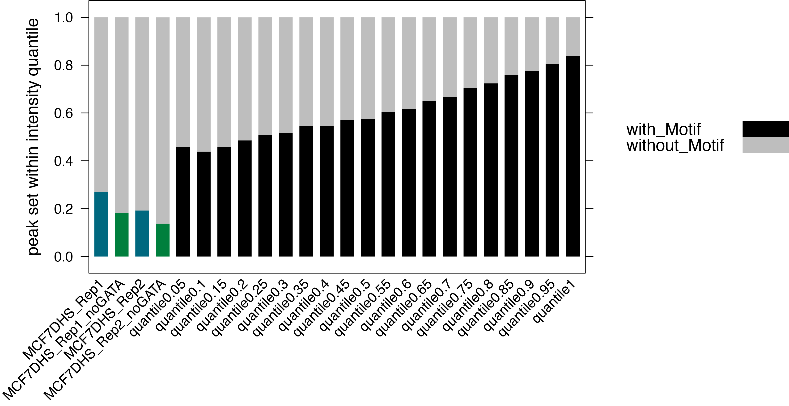 
```

For peaks in the top quantile intensity (top 5% highest intensity), we have ~16% peaks MEME/STREME are not able to find GATA3 binding elements. \

We have added full DHS control and an independent DHS control. \

**Analysis steps**: \
1) Retrieved MCF7 DHS data (rep1 & rep2) from GSE29692 and used UCSC liftover to convert the data from hg19 to hg38. \
2) Modified the DHS regions to 161bp windows. \
3) Full DHS control: Applied the same MAST stringency to eliminate regions that overlapped with the 8 MEME/STREME de novo GATA3-like motifs previously identified in GATA3 ChIP peaks. \
4) DHS regions removed GATA3 peak regions: use intersectBed to remove overlapped GATA3 ChIP-seq peak regions from the DHS regions, then applied the same MAST stringency to eliminate regions that overlapped with the 8 MEME/STREME de novo GATA3-like motifs previously identified in GATA3 ChIP peaks.  \
5) Coherence check: Employed MAST on the concatenated motif database against the regions with removed GATA3 motifs —no further regions were found. \
6) Counted the regions with and without GATA3 motifs and added them to the bar plot.

**Conclusion**: \
The left four bars are the MCF7 DHS controls. From left to right, they are full rep1 DHS regions, rep1 DHS regions that removed overlapped GATA3 ChIP peak regions, full rep2 DHS regions and rep2 DHS regions that removed overlapped GATA3 ChIPpeak regions. \
Among the GATA3 peaks in the lowest intensity quantile (quantile 0.05), over 45% of the peaks contain GATA3 binding elements as identified by MEME/STREME. \
The full DHS regions show a 27% overlap with GATA3 motifs in the 1st replicate and a 19% overlap in the 2nd replicate. \
The DHS regions removed overlapped GATA3 peak regions has 18% (rep1) and 13.7% (rep2) peaks with GATA3 motifs.  \

This indicates that randomly we would expect a 14~18% regions has GATA3 motifs found. And GATA3 binding is more specific to regions within the genome (represented by GATA3 ChIP-seq peaks) rather than being uniformly distributed across all accessible DNA regions (represented by the DHS regions).   \
Consequently, we can infer that even within the GATA3 peaks falling within the lowest quantile, there are significant and meaningful binding sites for GATA3. \


## GATA3 ChIP peak without MEME/STREME found GATA3 motif

**Background**: we have GATA3 peak that have exhaustively searched for GATA3-like motif with MEME/STREME software. However, there are ~38.5% peak failed in finding a GATA3-like motif. Even for peak subset that have relatively high peak intensity (top5%), we still have ~16% peaks that MEME/STREME cannot find a GATA3-like motif. \

Generally, we would expect to find binding sequences within the peak region, so that the ChIPed transcription factor (in our case, GATA3) can bind to. This is even more true for peaks with relatively high intensity. \

Our question now became, is MEME/STREME limited in finding binding sequences patterned like GATA3 (that has fixed spacings between two 3mer)? Can we find the 3mer-3mer sequences in GATA3 peaks that do not contain the MEME/STREME found GATA3-like motifs? \


## Process the negative control
### MCF7 DHS
There are four DHS negative controls: two reps of full MCF7 DHS regions (refer as "full DHS control"), two reps of MCF7 DHS regions without GATA3 ChIP peak regions (From here, I will refer this sets of control as "independent DHS control"). \
All DHS negative controls are removed of the 8 GATA3-like motifs, because we want to compare them to the GATA3 peaks that MEME/STREME failed to find GATA3-like de novo motifs.  \

- "full DHS control" \
```{r, engine='bash' ,eval=F, echo=TRUE}
MCF7DHS_Rep1_161bp_without_motifs_123456_78.bed  #92388
MCF7DHS_Rep2_161bp_without_motifs_123456_78.bed  #139899
```


- "independent DHS control"
```{r, engine='bash' ,eval=F, echo=TRUE}
MCF7DHS_Rep1_161bp_noGATA_without_motifs_123456_78.bed  #69119
MCF7DHS_Rep2_161bp_noGATA_without_motifs_123456_78.bed  #113774
```

<!--
### local control

Since now we know that GATA3 is likely to bind in an 161bp window around summit, we can add 250~300bp to the original peak summit, use this new locus as "control summit" to look for 1st and 2nd closest GAT. \
-->

## Process the positive control
There are 8 GATA3-like motifs found by MEME/STREME. Among them, 5 of them have GATA3 binding motifs that are formed by two GAT (or ATC) 3mer and various spacings. \

I will utilize `MAST` against the 161bp window peaks for all 8 motifs (the concatenated database file) to identify motif coordinates corresponding to each motif. Subsequently, I'll employ `intersectBed` to isolate the peak sets containing the best motif within the 161bp window. The peak sets characterized by the presence of the specific motif structures that we are insterested in will serve as positive controls. \


```{r, engine='bash', eval=F, echo=TRUE}
#GATA_ChIP_summit_161window.bed #the 161bp window around peak summit from the full GATA3 peak
module load meme/5.4.1
module load R/4.1.2
module load bedtools
genome=/home/FCAM/ssun/Genome/hg38.fa
dir=/home/FCAM/ssun/GATA3_ChIP_PRO_July2023/ChIP_final/peak_call/
dir2=/home/FCAM/ssun/GATA3_ChIP_PRO_July2023/ChIP_final/Exhaustive_MEME_MAST_round1to8/

fastaFromBed -fi $genome -bed ${dir}GATA_ChIP_summit_161window.bed -fo GATA_ChIP_summit_161window.fasta


mast -hit_list -best ${dir2}combined_output_meme.txt GATA_ChIP_summit_161window.fasta > mast_GATA3_PSWM_in_peaks_161win.txt 

wget https://raw.githubusercontent.com/sysunn/siyu_daily_update/main/December_2023/parse_multi_mast_to_coordinates.R
Rscript parse_multi_mast_to_coordinates.R mast_GATA3_PSWM_in_peaks_161win.txt  8
```

```{r, engine='bash', eval=TRUE, echo=TRUE}
wc -l mast_GATA3_PSWM_in_peaks_161win.bed
head -3 mast_GATA3_PSWM_in_peaks_161win.bed
tail -3 mast_GATA3_PSWM_in_peaks_161win.bed
awk '{print > ("mast_GATA3_PSWM_in_peak_161win_motif_" $7 ".bed")}' mast_GATA3_PSWM_in_peaks_161win.bed
ls mast_GATA3_PSWM_in_peak_161win_motif*.bed
```
Notice that the motif indices here is based on the PWM order in the concatenated database file: \
1: MOTIF AGATAARR --MEME-round3 motif3 \
2: MOTIF WGATBDHRVAGATAA --MEME-round6 motif6 \
3: MOTIF BTTATCWGATB --MEME-round5 motif5 \
4: MOTIF 4-AGATAAM. --STREME motif 1 \
5: MOTIF AGATNDWNAGATARN. --MEME-round4 motif4 \
6: MOTIF 6-TGATAA. --STREME motif 2 \
7: MOTIF WGATBTTATCW --MEME-round1 motif1 \
8: MOTIF WGATAARVATCW --MEME-round2 motif2 \

We don't have peaks assigned with motif indice==6, that means previously we have a set of peak assigned with STREME motif2 (motif8) are 1) no longer defined as contain motifs, or 2) now assigned with other motifs. \

<!--
- round1 motif: GAT---ATC \
```{r, engine='bash', class.source = "revision", eval=F, echo=TRUE}
#mast motif indice==7
intersectBed -wa -a ${dir}GATA_ChIP_summit_161window.bed -b mast_GATA3_PSWM_in_peak_161win_motif_7.bed | sort -k1,1 -k2,2n | uniq > GATA3_peak_161win_with_motif_1.bed
wc -l GATA3_peak_161win_with_motif_1.bed #13273 
head -5 GATA3_peak_161win_with_motif_1.bed
#chr1	1080476	1080637	GATA_ChIP_peak_45	6.37157
#chr1	1238157	1238318	GATA_ChIP_peak_51	16.8938
#chr1	1686351	1686512	GATA_ChIP_peak_63	35.0463
#chr1	1741050	1741211	GATA_ChIP_peak_68	11.6965
#chr1	2001941	2002102	GATA_ChIP_peak_77	7.79887
```

- round2 motif: GAT----ATC \
```{r, engine='bash', class.source = "revision", eval=F, echo=TRUE}
#mast motif indice==8
intersectBed -wa -a ${dir}GATA_ChIP_summit_161window.bed -b mast_GATA3_PSWM_in_peak_161win_motif_8.bed | sort -k1,1 -k2,2n | uniq > GATA3_peak_161win_with_motif_2.bed
wc -l GATA3_peak_161win_with_motif_2.bed #12373 
head -5 GATA3_peak_161win_with_motif_2.bed
#chr1	996069	996230	GATA_ChIP_peak_35	38.3686
#chr1	3213798	3213959	GATA_ChIP_peak_87	118.864
#chr1	3831729	3831890	GATA_ChIP_peak_96	162.768
#chr1	5688567	5688728	GATA_ChIP_peak_109	93.8407
#chr1	5959750	5959911	GATA_ChIP_peak_110	65.9829
```

- round4 motif: GAT-----GAT \
```{r, engine='bash', class.source = "revision", eval=F, echo=TRUE}
#mast motif indice==5
intersectBed -wa -a ${dir}GATA_ChIP_summit_161window.bed -b mast_GATA3_PSWM_in_peak_161win_motif_5.bed | sort -k1,1 -k2,2n | uniq > GATA3_peak_161win_with_motif_4.bed
wc -l GATA3_peak_161win_with_motif_4.bed #9180 
head -5 GATA3_peak_161win_with_motif_4.bed
#chr1	869417	869578	GATA_ChIP_peak_30	3.78065
#chr1	917454	917615	GATA_ChIP_peak_32	75.0238
#chr1	1859356	1859517	GATA_ChIP_peak_75b	62.1909
#chr1	3926997	3927158	GATA_ChIP_peak_98	14.2308
#chr1	4659185	4659346	GATA_ChIP_peak_102	54.7665
```

- round5 motif: ATC-GAT \
```{r, engine='bash', class.source = "revision", eval=F, echo=TRUE}
#mast motif indice==3
intersectBed -wa -a ${dir}GATA_ChIP_summit_161window.bed -b mast_GATA3_PSWM_in_peak_161win_motif_3.bed | sort -k1,1 -k2,2n | uniq > GATA3_peak_161win_with_motif_5.bed
wc -l GATA3_peak_161win_with_motif_5.bed #6703
head -5 GATA3_peak_161win_with_motif_5.bed
#chr1	1858826	1858987	GATA_ChIP_peak_75a	32.8724
#chr1	3948515	3948676	GATA_ChIP_peak_99	53.5507
#chr1	4597226	4597387	GATA_ChIP_peak_100	8.5429
#chr1	6317519	6317680	GATA_ChIP_peak_118	14.2308
#chr1	7320212	7320373	GATA_ChIP_peak_146	40.0204
```

- round6 motif: GAT------GAT \
```{r, engine='bash', class.source = "revision", eval=F, echo=TRUE}
#mast motif indice==2
intersectBed -wa -a ${dir}GATA_ChIP_summit_161window.bed -b mast_GATA3_PSWM_in_peak_161win_motif_2.bed | sort -k1,1 -k2,2n | uniq > GATA3_peak_161win_with_motif_6.bed
wc -l GATA3_peak_161win_with_motif_6.bed #9352
head -5 GATA3_peak_161win_with_motif_6.bed
#chr1	917454	917615	GATA_ChIP_peak_32	75.0238
#chr1	6719989	6720150	GATA_ChIP_peak_129	10.6294
#chr1	6800848	6801009	GATA_ChIP_peak_133	261.961
#chr1	6959568	6959729	GATA_ChIP_peak_137	253.515
#chr1	7266109	7266270	GATA_ChIP_peak_145	33.955
```

GATA3_peak_161win_with_motif_1.bed \
GATA3_peak_161win_with_motif_2.bed \
GATA3_peak_161win_with_motif_4.bed \
GATA3_peak_161win_with_motif_5.bed \
GATA3_peak_161win_with_motif_6.bed \
-->

### coherence check --barchart
When using `mast` to assess all 8 motifs concurrently, the `-best` option selectively assigns each peak region with only the most significant motif hit from the list of motif sites. \

Previously, STREME identified a set of peaks (n=4452) containing motif8 (STREME motif2), which are now either defined as not containing motifs or associated with motifs other than motif8. Illustrating the fraction of peaks assigned with alternative motifs in this peak set via a bar chart would offer a visual representation of this transition. \

```{r, engine='bash', eval=F, echo=TRUE}
module load meme/5.4.1
module load R/4.1.2
module load bedtools
dir=/home/FCAM/ssun/GATA3_ChIP_PRO_July2023/ChIP_final/Exhaustive_MEME_MAST_round1to8/

#101 bp window
intersectBed -wa -a ${dir}without_motifs_123456_7.bed -b ${dir}mast_GATA3_PSWM_in_peaks_round8.bed |uniq > peak_101win_with_motif8.bed #4452
head peak_101win_with_motif8.bed
#chr1	1775793	1775894	GATA_ChIP_peak_72	24.5459
#chr1	1855841	1855942	GATA_ChIP_peak_74	3.19627
#chr1	1883543	1883644	GATA_ChIP_peak_76	36.5894
#chr1	2135560	2135661	GATA_ChIP_peak_79	18.7357
#chr1	3613537	3613638	GATA_ChIP_peak_90	27.5967

#161bp window
sizes=/home/FCAM/ssun/Genome/hg38.chrom.sizes
slopBed -b 30 -i peak_101win_with_motif8.bed -g $sizes  | sort -k1,1 -k2,2n > peak_161win_with_motif8.bed #4452
```


When we `mast` with motif database, we have generated a bed file "mast_GATA3_PSWM_in_peaks_161win.bed" contains motif coordinates info. The 7th column is the motif indices. \
```{r, engine='bash', eval=F, echo=TRUE}
head -5 mast_GATA3_PSWM_in_peaks_161win.bed #63124
#chr1	1505049	1505056	1230.47	6.56e-05	+	1
#chr1	1883638	1883645	1230.47	6.56e-05	+	1
#chr1	5603508	5603515	1312.58	2.16e-05	-	1
#chr1	6795903	6795910	1312.58	2.16e-05	+	1
#chr1	7549563	7549570	1230.47	6.56e-05	+	1
```

We can use `intersectBed` to intersect these motif coordinates with the full GATA3 peaks (161window) and get all peaks that contains GATA3-like motifs. \
Notice that there are peaks containing more than 1 motifs. \
```{r, engine='bash', eval=F, echo=TRUE}
intersectBed -wa -wb -a ${dir}GATA_ChIP_summit_161window.bed -b mast_GATA3_PSWM_in_peaks_161win.bed | sort -k1,1 -k2,2n | uniq | head -5
#chr1	869417	869578	GATA_ChIP_peak_30	3.78065	chr1	869461	869467	1284.91	9.58e-05	-	4
#chr1	869417	869578	GATA_ChIP_peak_30	3.78065	chr1	869468	869482	1223.57	5.03e-05	-	5
#chr1	917454	917615	GATA_ChIP_peak_32	75.0238	chr1	917504	917518	1111.37	7.37e-05	+	5
#chr1	917454	917615	GATA_ChIP_peak_32	75.0238	chr1	917551	917565	1076.4	8.4e-05	+	2
#chr1	996069	996230	GATA_ChIP_peak_35	38.3686	chr1	996149	996160	1419.8	1.97e-05	+	8
```

We can calculate the number of non-duplicated peaks that contain at least one motif from the motif database (all 8 motifs) defined by `mast` use a stringency of 0.0001. \
```{r, engine='bash', eval=F, echo=TRUE}
intersectBed -wa -a ${dir}GATA_ChIP_summit_161window.bed -b mast_GATA3_PSWM_in_peaks_161win.bed | sort -k1,1 -k2,2n | awk '{OFS="\t"} {print $4}' | uniq | wc -l #51122
```

Recall that in the Exhaustive MEME/STREME analysis, each round we `mast` with single motif PMW against peaks. And for the last two round of STREME, we have loosen the `mast` stringency to 0.005. \
Therefore, we end up have more peaks defined as having motifs (n=59560) compare to here when we applied a global `mast` strincy of 0.0001 (n=51122). \

By simple math, there are 8438 peaks previously defined as containing motifs now are no longer having motifs. \
We can get this peak set: \

```{r, engine='bash', eval=F, echo=TRUE}
#new set of peak do not contain motifs
intersectBed -v -a ${dir}GATA_ChIP_summit_161window.bed -b mast_GATA3_PSWM_in_peaks_161win.bed | sort -k1,1 -k2,2n | uniq > without_motifs_all_161bp_mast_new.bed #45746
head -5 without_motifs_all_161bp_mast_new.bed
#chr1	827300	827461	GATA_ChIP_peak_28	9.30478
#chr1	845716	845877	GATA_ChIP_peak_29	541.83
#chr1	916689	916850	GATA_ChIP_peak_31	7.79887
#chr1	924773	924934	GATA_ChIP_peak_33	3.78065
#chr1	966573	966734	GATA_ChIP_peak_34	3.78065

#old set of peak do not contain motifs
dir2=/home/FCAM/ssun/GATA3_ChIP_PRO_July2023/ChIP_final/Exhaustive_MEME_MAST_round1to8/
head -5 ${dir2}without_motifs_123456_78_161bp_mast.bed #37308 peaks previously defined as not containing motif
#chr1	827300	827461	GATA_ChIP_peak_28	9.30478
#chr1	916689	916850	GATA_ChIP_peak_31	7.79887
#chr1	924773	924934	GATA_ChIP_peak_33	3.78065
#chr1	966573	966734	GATA_ChIP_peak_34	3.78065
#chr1	999428	999589	GATA_ChIP_peak_36	2.11515

#old set of peak contain motifs
intersectBed -v -f 1 -a ${dir}GATA_ChIP_summit_161window.bed -b ${dir2}without_motifs_123456_78_161bp_mast.bed > with_motifs_all_161bp_mast_old.bed #59560 (==96868-37308)

# get peaks that previously contain motifs now no longer contain motifs by mast with db
awk 'FNR==NR{peaks[$4]; next} $4 in peaks' with_motifs_all_161bp_mast_old.bed without_motifs_all_161bp_mast_new.bed > peak_no_longer_contain_motifs.bed #8439

head -5 peak_no_longer_contain_motifs.bed
#chr1	845716	845877	GATA_ChIP_peak_29	541.83
#chr1	1746867	1747028	GATA_ChIP_peak_70	4.46672
#chr1	1775763	1775924	GATA_ChIP_peak_72	24.5459
#chr1	1855811	1855972	GATA_ChIP_peak_74	3.19627
#chr1	2135530	2135691	GATA_ChIP_peak_79	18.7357
```

For our previous defined peak set that contain motif8 (STREME motif2) (n=4452): \

we expect 1) some peak no longer contain motifs: \
```{r, engine='bash', eval=F, echo=TRUE}
intersectBed -wa -wb -f 1 -F 1 -a peak_no_longer_contain_motifs.bed -b peak_161win_with_motif8.bed > peak_161win_with_motif8_no_longer_contain_motifs.bed #3528
head -5 peak_161win_with_motif8_no_longer_contain_motifs.bed
#chr1	1775763	1775924	GATA_ChIP_peak_72	24.5459	chr1	1775763	1775924	GATA_ChIP_peak_72	24.5459
#chr1	1855811	1855972	GATA_ChIP_peak_74	3.19627	chr1	1855811	1855972	GATA_ChIP_peak_74	3.19627
#chr1	2135530	2135691	GATA_ChIP_peak_79	18.7357	chr1	2135530	2135691	GATA_ChIP_peak_79	18.7357
#chr1	3613507	3613668	GATA_ChIP_peak_90	27.5967	chr1	3613507	3613668	GATA_ChIP_peak_90	27.5967
#chr1	6359876	6360037	GATA_ChIP_peak_119	32.8724	chr1	6359876	6360037	GATA_ChIP_peak_119	32.8724


${dir2}without_motifs_123456_78_161bp_mast.bed | uniq > peak_no_longer_contain_motifs.bed #8416
head -5 peak_no_longer_contain_motifs.bed
#chr1	845716	845877	GATA_ChIP_peak_29	541.83
#chr1	1746867	1747028	GATA_ChIP_peak_70	4.46672
#chr1	1775763	1775924	GATA_ChIP_peak_72	24.5459
#chr1	1855811	1855972	GATA_ChIP_peak_74	3.19627
#chr1	2135530	2135691	GATA_ChIP_peak_79	18.7357

intersectBed -wa -wb -a peak_no_longer_contain_motifs.bed -b peak_161win_with_motif8.bed | uniq > peak_161win_with_motif8_no_longer_contain_motifs.bed #3525
#coherence check
#there are peaks assigned with more than 1 motif
awk '{OFS="\t"} {print $4}' peak_161win_with_motif8_no_longer_contain_motifs.bed | uniq | wc -l #3524
```

Previously we have defined 4452 peaks contain motif8, now we have 3528 peaks no longer defined as containing motifs. \


2) some peak now assigned with other motifs \

To extract peak and motif information: we can use the peak indices and `awk` to filter the rows in `GATA3_peak_161win_with_all_mast_motif.bed` based on whether their peak index (in the fourth column) is present in `peak_161win_with_motif8.bed` (peaks that previously found to contain motif8). \
```{r, engine='bash', eval=F, echo=TRUE}
# all peaks that contain newly assigned motifs by mast to db
dir=/home/FCAM/ssun/GATA3_ChIP_PRO_July2023/ChIP_final/peak_call/
intersectBed -wa -wb -a ${dir}GATA_ChIP_summit_161window.bed -b mast_GATA3_PSWM_in_peaks_161win.bed | awk '{OFS="\t"} {print $1, $2, $3, $4, $12}' | uniq  > GATA3_peak_161win_with_all_mast_motif.bed #63127

awk 'FNR==NR{peaks[$4]; next} $4 in peaks' peak_161win_with_motif8.bed GATA3_peak_161win_with_all_mast_motif.bed > filtered_GATA3_peak_161win_with_all_mast_motif.bed #997
head -5 filtered_GATA3_peak_161win_with_all_mast_motif.bed
#chr1	1883513	1883674	GATA_ChIP_peak_76	1
#chr1	3831729	3831890	GATA_ChIP_peak_96	8
#chr1	4597226	4597387	GATA_ChIP_peak_100	3
#chr1	8875638	8875799	GATA_ChIP_peak_226	7
#chr1	10277773	10277934	GATA_ChIP_peak_290	5


#coherence check
#there are peaks assigned with more than 1 motif
awk '{OFS="\t"} {print $4}' filtered_GATA3_peak_161win_with_all_mast_motif.bed | uniq | wc -l #924
```

There are 924 unique peaks previously defined as containing motif8 (STREME motif2) now assigned with other motif(s) by `mast`. \

```{r, engine='R', eval=F, echo=TRUE}
#module load R/4.1.2 
#R 

library(lattice) 
bar=read.table(file = "bar.txt", header = T)
bar$dum.x="peak fraction"
bar$supp=factor(bar$supp, levels=c("new_motif","no_motif"))

pdf('240111_peaks_with_GATA3_motif8_change_by_new_mast.pdf', width=5,height=6)
my.settings <- list(
  #superpose.polygon=list(col=c(colorRampPalette(c("red","pink"))(6),colorRampPalette(c("blue","light blue"))(3), "light grey"), border="transparent"),
  superpose.polygon=list(col=c("blue","lightgrey"), border="transparent"),
  strip.background=list(col="grey80", cex = 0.6),
  strip.border=list(col="black")
)
print(barchart(fraction ~ dum.x,         
         data = bar,
         groups = supp,
         stack = TRUE,
         ylim=c(0,1),
         auto.key=list(space="right"),
         #scales = list(x = list(rot = 45)),
         ylab = "peak set previously contain motif8",
         xlab = "fration of peaks changed when mast with motif db",
         par.settings = my.settings)
)
dev.off()
```

```{r  fig.align = "center", out.width="80%", out.height="80%", echo=F, fig.align = "center", fig.cap="peak_with_motif8 either no longer defined as containing motifs or assigned with new motifs when mast with database"}
#library(knitr)
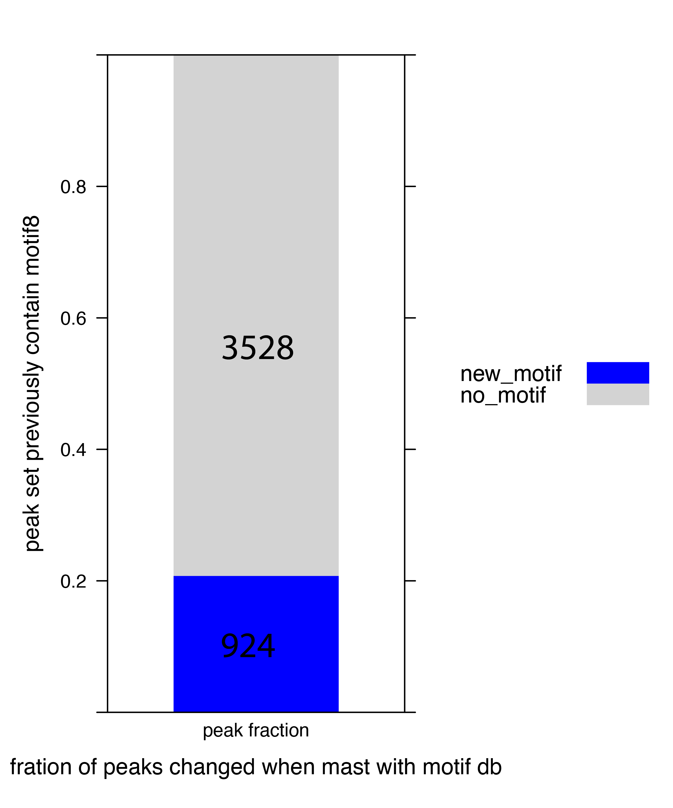 
```


```{r, engine='R', eval=F, echo=TRUE}
# Read the BED file
bed_data <- read.table("filtered_GATA3_peak_161win_with_all_mast_motif.bed", sep="\t", header=FALSE, stringsAsFactors=FALSE)

# Aggregate motif indices for each peak
aggregated_motifs <- aggregate(bed_data$V5, by = list(bed_data$V4), FUN = function(x) paste(unique(x), collapse = ","))

aggregated_motifs$nmotif <- sapply(aggregated_motifs$x, function(x) length(unlist(strsplit(x, ","))))
colnames(aggregated_motifs)=c("peak", "motif_indices", "nmotif")

head(aggregated_motifs)
#                   peak motif_indices nmotif
#1    GATA_ChIP_peak_100             3      1
#2  GATA_ChIP_peak_10048             1      1
#3 GATA_ChIP_peak_10198b           7,3      2
#4  GATA_ChIP_peak_10245             8      1
#5  GATA_ChIP_peak_10360             7      1
#6 GATA_ChIP_peak_10760a             2      1

nrow(aggregated_motifs)
#[1] 924
length(unique(aggregated_motifs$peak))
#[1] 924
str(aggregated_motifs)
#'data.frame':	924 obs. of  3 variables:
# $ peak         : chr  "GATA_ChIP_peak_100" "GATA_ChIP_peak_10048" "GATA_ChIP_peak_10198b" "GATA_ChIP_peak_10245" ...
# $ motif_indices: chr  "3" "1" "7,3" "8" ...
# $ nmotif       : int  1 1 2 1 1 1 2 1 1 1 ...
```

```{r, engine='R', eval=F, echo=TRUE}
library(lattice)
group_counts <- as.data.frame(table(aggregated_motifs$motif_indices))
names(group_counts) <- c('Group', 'Count')

summary(group_counts$Count)
#Min. 1st Qu.  Median    Mean 3rd Qu.    Max. 
 #     1       1       2      22       4     193

group_counts$Group=factor(group_counts$Group, levels=c( "1", "2", "3", "4", "5",  "7", "8", "1,2", "1,4", "1,5", "1,8",  "2,1", "2,3",    
 "2,7", "2,8", "3,1", "3,2",  "3,4", "3,7", "3,8", "4,2","4,3", "4,5", "4,8", "5,1","5,2", "5,3","5,4", "5,7", "5,8", "7,1", "7,2","7,3", "7,4", "7,5", "7,8", "8,1",  "8,2", "8,3", "8,4", "8,5", "8,7" ))

      

# Create the bar plot
pdf('240110_peaks_with_GATA3_motif_variant.pdf',width=15,height=10)
#custom_labels <- seq(1, 4000, by = 20)
print(barchart(Count ~ Group,
         data= group_counts, 
         col = "skyblue", 
         ylim=c(0, 200),
         xlab = "motif_indices", 
         ylab = "Number of Peaks",
         main = "Number of Peaks contain the motif",
         scales = list(x = list(rot = 45)), #y = list(at = custom_labels)
         horizontal = FALSE)
      )
dev.off()
```


```{r  fig.align = "center", out.width="80%", out.height="80%", echo=F, fig.align = "center", fig.cap="peak_with_motif6 assigned with new motifs when mast with database"}
#library(knitr)
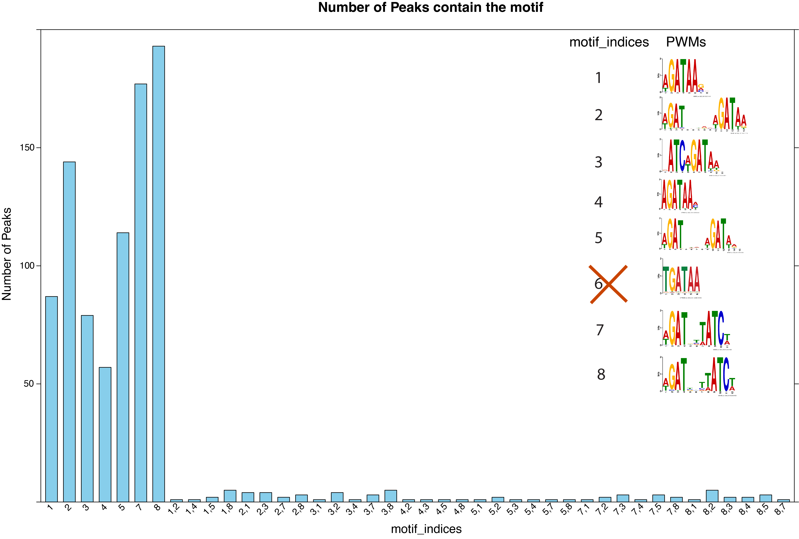 
```

The peak sets that used to defined as containing motif8 when `mast` single motif (motif8) against peaks without motif12345, are now assigned with other motifs when `mast` against entire GATA3 peak sets with all 8 motifs. \

**Summary** \

Peaks that were previously identified to contain motif8 through mast with a single motif PWM are no longer associated with motif8 when mast is applied to the motif database encompassing all eight motifs. This shift arises from two primary factors. \

Firstly, some peaks are now unassigned to any motif, attributed to the heightened stringency (0.0001) in the current analysis, as opposed to the less stringent criterion (0.0005) employed in the previous round. \

Conversely, certain peaks are now affiliated with alternative motifs. This shift can be attributed to the improved statistical calculations facilitated by mast using the -best option, enhancing motif assignments beyond the singular focus on motif8. \


### coherence check2
Prepare and upload these files to UCSC Genome browser: \
a BED for peak (subset, 924 peaks previously enriched with motif8 now have assigned with other motifs) coordinates (101bp or 161bp). \
```{r, engine='bash', eval=F, echo=TRUE}
peak_101win_with_motif8.bed #4452
peak_161win_with_motif8.bed #4452

awk '{OFS="\t"} {print $1, $2, $3, $4}' filtered_GATA3_peak_161win_with_all_mast_motif.bed | uniq > peak_161win_with_motif8_with_new_motifs.bed #924


head -5 peak_161win_with_motif8_with_new_motifs.bed #-161bp
#chr1	1883513	1883674	GATA_ChIP_peak_76
#chr1	3831729	3831890	GATA_ChIP_peak_96
#chr1	4597226	4597387	GATA_ChIP_peak_100
#chr1	8875638	8875799	GATA_ChIP_peak_226
#chr1	10277773	10277934	GATA_ChIP_peak_290
```

a BED for each newly assigned motif coordinates in the 161/101 window in the browser. \

```{r, engine='bash', eval=F, echo=TRUE}
# newly assigned motif coordinates for all peaks
7431 mast_GATA3_PSWM_in_peak_161win_motif_1.bed
   9352 mast_GATA3_PSWM_in_peak_161win_motif_2.bed
   6702 mast_GATA3_PSWM_in_peak_161win_motif_3.bed
   4815 mast_GATA3_PSWM_in_peak_161win_motif_4.bed
   9180 mast_GATA3_PSWM_in_peak_161win_motif_5.bed
  13271 mast_GATA3_PSWM_in_peak_161win_motif_7.bed
  12373 mast_GATA3_PSWM_in_peak_161win_motif_8.bed

#intersect with the 924 peaks previously contain motif8

intersectBed -wa -wb -a mast_GATA3_PSWM_in_peak_161win_motif_1.bed -b peak_161win_with_motif8_with_new_motifs.bed > motif_1_PSWM_in_peak_161win_previous_with_motif8.bed #104
intersectBed -wa -wb -a mast_GATA3_PSWM_in_peak_161win_motif_2.bed -b peak_161win_with_motif8_with_new_motifs.bed > motif_2_PSWM_in_peak_161win_previous_with_motif8.bed #173
intersectBed -wa -wb -a mast_GATA3_PSWM_in_peak_161win_motif_3.bed -b peak_161win_with_motif8_with_new_motifs.bed > motif_3_PSWM_in_peak_161win_previous_with_motif8.bed #104
intersectBed -wa -wb -a mast_GATA3_PSWM_in_peak_161win_motif_4.bed -b peak_161win_with_motif8_with_new_motifs.bed > motif_4_PSWM_in_peak_161win_previous_with_motif8.bed #67
intersectBed -wa -wb -a mast_GATA3_PSWM_in_peak_161win_motif_5.bed -b peak_161win_with_motif8_with_new_motifs.bed > motif_5_PSWM_in_peak_161win_previous_with_motif8.bed #130
intersectBed -wa -wb -a mast_GATA3_PSWM_in_peak_161win_motif_7.bed -b peak_161win_with_motif8_with_new_motifs.bed > motif_7_PSWM_in_peak_161win_previous_with_motif8.bed #196
intersectBed -wa -wb -a mast_GATA3_PSWM_in_peak_161win_motif_8.bed -b peak_161win_with_motif8_with_new_motifs.bed > motif_8_PSWM_in_peak_161win_previous_with_motif8.bed #224

head -5 motif_1_PSWM_in_peak_161win_previous_with_motif8.bed
#chr1	1883638	1883645	1230.47	6.56e-05	+	1	chr1	1883513	1883674	GATA_ChIP_peak_76
#chr1	20232820	20232827	1230.47	6.56e-05	-	1	chr1	20232679	20232840	GATA_ChIP_peak_603
#chr1	37484682	37484689	1230.47	6.56e-05	-	1	chr1	37484679	37484840	GATA_ChIP_peak_1230
#chr1	89045539	89045546	1230.47	6.56e-05	+	1	chr1	89045405	89045566	GATA_ChIP_peak_2681
#chr1	95084738	95084745	1312.58	2.16e-05	-	1	chr1	95084600	95084761	GATA_ChIP_peak_2867

```

a BED for the previous motif8 coordinates in 101 window in the browser. \
```{r, engine='bash', eval=F, echo=TRUE}
dir=/home/FCAM/ssun/GATA3_ChIP_PRO_July2023/ChIP_final/Exhaustive_MEME_MAST_round1to8/

#101 bp window
intersectBed -wa -wb -a ${dir}mast_GATA3_PSWM_in_peaks_round8.bed -b ${dir}without_motifs_123456_7.bed | uniq  > old_mast_motif_8_PSWM_in_peak_101win.bed #4454

head -5 old_mast_motif_8_PSWM_in_peak_101win.bed
#chr1	1775856	1775861	1142.66	0.000349	+	1	chr1	1775793	1775894	GATA_ChIP_peak_72	24.5459
#chr1	1855920	1855925	1142.66	0.000349	+	1	chr1	1855841	1855942	GATA_ChIP_peak_74	3.19627
#chr1	1883563	1883568	1142.66	0.000349	-	1	chr1	1883543	1883644	GATA_ChIP_peak_76	36.5894
#chr1	2135607	2135612	1142.66	0.000349	-	1	chr1	2135560	2135661	GATA_ChIP_peak_79	18.7357
#chr1	3613592	3613597	1142.66	0.000349	-	1	chr1	3613537	3613638	GATA_ChIP_peak_90	27.5967

awk 'FNR==NR{peaks[$4]; next} $11 in peaks' peak_161win_with_motif8_with_new_motifs.bed old_mast_motif_8_PSWM_in_peak_101win.bed > old_mast_motif_8_PSWM_in_peak_101win_with_new_motifs.bed #925

head -5 old_mast_motif_8_PSWM_in_peak_101win_with_new_motifs.bed
#chr1	1883563	1883568	1142.66	0.000349	-	1	chr1	1883543	1883644	GATA_ChIP_peak_76	36.5894
#chr1	3831836	3831841	1142.66	0.000349	-	1	chr1	3831759	3831860	GATA_ChIP_peak_96	162.768
#chr1	4597295	4597300	1142.66	0.000349	-	1	chr1	4597256	4597357	GATA_ChIP_peak_100	8.5429
#chr1	8875760	8875765	1142.66	0.000349	+	1	chr1	8875668	8875769	GATA_ChIP_peak_226	8.89252
#chr1	10277867	10277872	1142.66	0.000349	-	1	chr1	10277803	10277904	GATA_ChIP_peak_290	5.68898
```

Add trackline:
```{r engine='bash', eval=F, echo=TRUE}
#peak region
peak_101win_with_motif8.bed #4452
peak_161win_with_motif8.bed #4452
peak_161win_with_motif8_with_new_motifs.bed #924

#motifs-old
old_mast_motif_8_PSWM_in_peak_101win_with_new_motifs.bed #925

#motifs-new
motif_1_PSWM_in_peak_161win_previous_with_motif8.bed
motif_2_PSWM_in_peak_161win_previous_with_motif8.bed
motif_3_PSWM_in_peak_161win_previous_with_motif8.bed
motif_4_PSWM_in_peak_161win_previous_with_motif8.bed
motif_5_PSWM_in_peak_161win_previous_with_motif8.bed
motif_7_PSWM_in_peak_161win_previous_with_motif8.bed
motif_8_PSWM_in_peak_161win_previous_with_motif8.bed

awk 'BEGIN {print "browser position chr10:16,000-17,000" 
            print "track type=bed name=\"peak_101win_with_motif8.bed\" description=\"peak_101win_full\" visibility=full autoScale=on useScore=1 color=0,0,0"
            } {print $0}' peak_101win_with_motif8.bed > peak_101win_with_motif8.header.bed
            
awk 'BEGIN {print "browser position chr10:16,000-17,000" 
            print "track type=bed name=\"peak_161win_with_motif8.bed\" description=\"peak_161win_full\" visibility=full autoScale=on useScore=1 color=0,0,0"
            } {print $0}' peak_161win_with_motif8.bed > peak_161win_with_motif8.header.bed

awk 'BEGIN {print "browser position chr10:16,000-17,000" 
            print "track type=bed name=\"peak_161win_with_motif8_new.bed\" description=\"peak_161win_new\" visibility=full autoScale=on useScore=1 color=0,0,0"
            } {print $0}' peak_161win_with_motif8_with_new_motifs.bed > peak_161win_with_motif8_with_new_motifs.header.bed
           


awk 'BEGIN {print "browser position chr10:16,000-17,000" 
            print "track type=bed name=\"old_mast_motif_8_PSWM_in_peak_101win_with_new_motifs.bed\" description=\"motif8_101win_old\" visibility=full autoScale=on useScore=1 color=255,0,0"
            } {print $1, $2, $3}' old_mast_motif_8_PSWM_in_peak_101win_with_new_motifs.bed > old_mast_motif_8_PSWM_in_peak_101win_with_new_motifs.header.bed
           


awk 'BEGIN {print "browser position chr10:16,000-17,000" 
            print "track type=bed name=\"motif_1_PSWM_in_peak_161win_previous_with_motif8.bed\" description=\"motif1_161win_new\" visibility=full autoScale=on useScore=1 color=0,0,255"
            } {print $1, $2, $3}' motif_1_PSWM_in_peak_161win_previous_with_motif8.bed > motif_1_PSWM_in_peak_161win_previous_with_motif8.header.bed
          
awk 'BEGIN {print "browser position chr10:16,000-17,000" 
            print "track type=bed name=\"motif_2_PSWM_in_peak_161win_previous_with_motif8.bed\" description=\"motif2_161win_new\" visibility=full autoScale=on useScore=1 color=0,0,255"
            } {print $1, $2, $3}' motif_2_PSWM_in_peak_161win_previous_with_motif8.bed > motif_2_PSWM_in_peak_161win_previous_with_motif8.header.bed

awk 'BEGIN {print "browser position chr10:16,000-17,000" 
            print "track type=bed name=\"motif_3_PSWM_in_peak_161win_previous_with_motif8.bed\" description=\"motif3_161win_new\" visibility=full autoScale=on useScore=1 color=0,0,255"
            } {print $1, $2, $3}' motif_3_PSWM_in_peak_161win_previous_with_motif8.bed > motif_3_PSWM_in_peak_161win_previous_with_motif8.header.bed

awk 'BEGIN {print "browser position chr10:16,000-17,000" 
            print "track type=bed name=\"motif_4_PSWM_in_peak_161win_previous_with_motif8.bed\" description=\"motif4_161win_new\" visibility=full autoScale=on useScore=1 color=0,0,255"
            } {print $1, $2, $3}' motif_4_PSWM_in_peak_161win_previous_with_motif8.bed > motif_4_PSWM_in_peak_161win_previous_with_motif8.header.bed
            
            
awk 'BEGIN {print "browser position chr10:16,000-17,000" 
            print "track type=bed name=\"motif_5_PSWM_in_peak_161win_previous_with_motif8.bed\" description=\"motif5_161win_new\" visibility=full autoScale=on useScore=1 color=0,0,255"
            } {print $1, $2, $3}' motif_5_PSWM_in_peak_161win_previous_with_motif8.bed > motif_5_PSWM_in_peak_161win_previous_with_motif8.header.bed
            
            
            
awk 'BEGIN {print "browser position chr10:16,000-17,000" 
            print "track type=bed name=\"motif_7_PSWM_in_peak_161win_previous_with_motif8.bed\" description=\"motif7_161win_new\" visibility=full autoScale=on useScore=1 color=0,0,255"
            } {print $1, $2, $3}' motif_7_PSWM_in_peak_161win_previous_with_motif8.bed > motif_7_PSWM_in_peak_161win_previous_with_motif8.header.bed
            
            
awk 'BEGIN {print "browser position chr10:16,000-17,000" 
            print "track type=bed name=\"motif_8_PSWM_in_peak_161win_previous_with_motif8.bed\" description=\"motif8_161win_new\" visibility=full autoScale=on useScore=1 color=0,0,255"
            } {print $1, $2, $3}' motif_8_PSWM_in_peak_161win_previous_with_motif8.bed > motif_8_PSWM_in_peak_161win_previous_with_motif8.header.bed
```

### positive control: 1 peak with 1 best motif

- round1 motif: GAT---ATC \
```{r, engine='bash', eval=F, echo=TRUE}
#with_motifs_1_101bp_mast.bed
#with_motifs_1_161bp_mast.bed

awk '{OFS="\t"} {print $1, $2, $3, $4}' with_motifs_1_101bp_mast.bed | sort | uniq | wc -l #11428 
awk '{OFS="\t"} {print $1, $2, $3, $4}' with_motifs_1_161bp_mast.bed | sort | uniq | wc -l #1042

#keep the first 4 column (uniq)-the peak region info
awk '{OFS="\t"} {print $1, $2, $3, $4}' with_motifs_1_101bp_mast.bed | sort | uniq >temp_101bp.bed
awk '{OFS="\t"} {print $1, $2, $3, $4}' with_motifs_1_161bp_mast.bed | sort | uniq >temp_161bp.bed
#combine together
cat temp_101bp.bed temp_161bp.bed > GATA3_peak_161win_with_motif_1.bed
wc -l GATA3_peak_161win_with_motif_1.bed
#12470 GATA3_peak_161win_with_motif_1.bed
head -5 GATA3_peak_161win_with_motif_1.bed
#chr10	100072622	100072723	GATA_ChIP_peak_10714
#chr10	100522457	100522558	GATA_ChIP_peak_10733
#chr10	101380152	101380253	GATA_ChIP_peak_10758b
#chr10	101453866	101453967	GATA_ChIP_peak_10760b
#chr10	101892915	101893016	GATA_ChIP_peak_10774
```

- round2 motif: GAT----ATC \
```{r, engine='bash', eval=F, echo=TRUE}
#with_motifs_2_101bp_mast.bed
#with_motifs_2_161bp_mast.bed

awk '{OFS="\t"} {print $1, $2, $3, $4}' with_motifs_2_101bp_mast.bed | sort | uniq | wc -l #10461
awk '{OFS="\t"} {print $1, $2, $3, $4}' with_motifs_2_161bp_mast.bed | sort | uniq | wc -l #1014

#keep the first 4 column (uniq)-the peak region info
awk '{OFS="\t"} {print $1, $2, $3, $4}' with_motifs_2_101bp_mast.bed | sort | uniq >temp_101bp.bed
awk '{OFS="\t"} {print $1, $2, $3, $4}' with_motifs_2_161bp_mast.bed | sort | uniq >temp_161bp.bed
#combine together
cat temp_101bp.bed temp_161bp.bed > GATA3_peak_161win_with_motif_2.bed
wc -l GATA3_peak_161win_with_motif_2.bed
#11475 GATA3_peak_161win_with_motif_2.bed
head -5 GATA3_peak_161win_with_motif_2.bed
#chr10	100301265	100301366	GATA_ChIP_peak_10723
#chr10	100742525	100742626	GATA_ChIP_peak_10737
#chr10	100857059	100857160	GATA_ChIP_peak_10738
#chr10	101033052	101033153	GATA_ChIP_peak_10745
#chr10	101310780	101310881	GATA_ChIP_peak_10754
```


- round4 motif: GAT-----GAT \
```{r, engine='bash', eval=F, echo=TRUE}
#with_motifs_4_101bp_mast.bed
#with_motifs_4_161bp_mast.bed

awk '{OFS="\t"} {print $1, $2, $3, $4}' with_motifs_4_101bp_mast.bed | sort | uniq | wc -l #5665
awk '{OFS="\t"} {print $1, $2, $3, $4}' with_motifs_4_161bp_mast.bed | sort | uniq | wc -l #840

#keep the first 4 column (uniq)-the peak region info
awk '{OFS="\t"} {print $1, $2, $3, $4}' with_motifs_4_101bp_mast.bed | sort | uniq >temp_101bp.bed
awk '{OFS="\t"} {print $1, $2, $3, $4}' with_motifs_4_161bp_mast.bed | sort | uniq >temp_161bp.bed
#combine together
cat temp_101bp.bed temp_161bp.bed > GATA3_peak_161win_with_motif_4.bed
wc -l GATA3_peak_161win_with_motif_4.bed
#6505 GATA3_peak_161win_with_motif_4.bed
head -5 GATA3_peak_161win_with_motif_4.bed
#chr10	101454211	101454312	GATA_ChIP_peak_10760c
#chr10	101703087	101703188	GATA_ChIP_peak_10768a
#chr10	101716906	101717007	GATA_ChIP_peak_10770
#chr10	102509685	102509786	GATA_ChIP_peak_10791b
#chr10	1025897	1025998	GATA_ChIP_peak_7503
```

- round5 motif: ATC-GAT \
```{r, engine='bash', eval=F, echo=TRUE}
#with_motifs_5_101bp_mast.bed
#with_motifs_5_161bp_mast.bed

awk '{OFS="\t"} {print $1, $2, $3, $4}' with_motifs_5_101bp_mast.bed | sort | uniq | wc -l #3564
awk '{OFS="\t"} {print $1, $2, $3, $4}' with_motifs_5_161bp_mast.bed | sort | uniq | wc -l #603

#keep the first 4 column (uniq)-the peak region info
awk '{OFS="\t"} {print $1, $2, $3, $4}' with_motifs_5_101bp_mast.bed | sort | uniq >temp_101bp.bed
awk '{OFS="\t"} {print $1, $2, $3, $4}' with_motifs_5_161bp_mast.bed | sort | uniq >temp_161bp.bed
#combine together
cat temp_101bp.bed temp_161bp.bed > GATA3_peak_161win_with_motif_5.bed
wc -l GATA3_peak_161win_with_motif_5.bed
#4167 GATA3_peak_161win_with_motif_5.bed
head -5 GATA3_peak_161win_with_motif_5.bed
#chr10	100139100	100139201	GATA_ChIP_peak_10715
#chr10	100374094	100374195	GATA_ChIP_peak_10727b
#chr10	100413259	100413360	GATA_ChIP_peak_10729
#chr10	101355424	101355525	GATA_ChIP_peak_10756
#chr10	101402156	101402257	GATA_ChIP_peak_10759
```

- round6 motif: GAT------GAT \
```{r, engine='bash', eval=F, echo=TRUE}
#with_motifs_6_101bp_mast.bed
#with_motifs_6_161bp_mast.bed

awk '{OFS="\t"} {print $1, $2, $3, $4}' with_motifs_6_101bp_mast.bed | sort | uniq | wc -l #4510
awk '{OFS="\t"} {print $1, $2, $3, $4}' with_motifs_6_161bp_mast.bed | sort | uniq | wc -l #853

#keep the first 4 column (uniq)-the peak region info
awk '{OFS="\t"} {print $1, $2, $3, $4}' with_motifs_6_101bp_mast.bed | sort | uniq >temp_101bp.bed
awk '{OFS="\t"} {print $1, $2, $3, $4}' with_motifs_6_161bp_mast.bed | sort | uniq >temp_161bp.bed
#combine together
cat temp_101bp.bed temp_161bp.bed > GATA3_peak_161win_with_motif_6.bed
wc -l GATA3_peak_161win_with_motif_6.bed
#5363 GATA3_peak_161win_with_motif_6.bed
head -5 GATA3_peak_161win_with_motif_6.bed
#chr10	100015084	100015185	GATA_ChIP_peak_10709
#chr10	101986847	101986948	GATA_ChIP_peak_10777
#chr10	103188015	103188116	GATA_ChIP_peak_10826b
#chr10	103931753	103931854	GATA_ChIP_peak_10852
#chr10	103979874	103979975	GATA_ChIP_peak_10857b
```

GATA3_peak_161win_with_motif_1.bed \
GATA3_peak_161win_with_motif_2.bed \
GATA3_peak_161win_with_motif_4.bed \
GATA3_peak_161win_with_motif_5.bed \
GATA3_peak_161win_with_motif_6.bed \

# GAT-GAT/ATC 3mer analaysis

1) get all peaks (161bp window) without the 8 MEME/STREME motifs. Parse the peaks to 4 quantile based on peak intensity (use deseq2). \

2) for each quantile, as well as the two negative control (MCF7 DHS rep1, rep2), get the closest GAT to peak summit. \
3) find the second closest GAT. \
Make sure that the we want to use the relative distance between the two zinc fingers. \
and orientation. \


## Parse peak based on Intensity

**peaks (161bp window) without 8 GATA3-motif** (that found by MEME/STREME) \

```{r engine='bash', eval=F, echo=TRUE}
#cd /home/FCAM/ssun/GATA3_ChIP_PRO_July2023/ChIP_final/Exhaustive_MEME_MAST_round1to8
wc -l without_motifs_123456_78_161bp_mast.bed #37308 
head -5 without_motifs_123456_78_161bp_mast.bed
#chr1	827300	827461	GATA_ChIP_peak_28	9.30478
#chr1	916689	916850	GATA_ChIP_peak_31	7.79887
#chr1	924773	924934	GATA_ChIP_peak_33	3.78065
#chr1	966573	966734	GATA_ChIP_peak_34	3.78065
#chr1	999428	999589	GATA_ChIP_peak_36	2.11515
```

### Peak Intensity - bigWig and DEseq2
In the above file, the last column is the peak intensity reported by MACS3. \
Notice that a peak with high MACS3-intensity is not necessarily a intense peak. There are two things we need to consider regarding peak intensities. The first is **peak region**; the second is **dynamic range**. Imaging a peak that is very intense but within a narrow range, the other peak is not so intense but can span its signals across a very long distance. We need to consider this region differences while calling any peak to be intense or not. \

First use `Sam Flag 0x3`(reads paired and mapped in proper pair) to calculate the **read depth** for each GATA library. \
```{r, engine='bash', eval=F, echo=TRUE}
# calculate the size factors 
module load samtools/1.12

dir=/home/FCAM/ssun/GATA3_ChIP_PRO_July2023/ChIP_final/sorted.bam_final/
for i in GATA
do
  echo $i
  > ${i}_header.txt
  > ${i}_reads.txt
  for j in ${dir}MCF7_dTAGGATA522*_${i}_*.sorted.bam
  do
    echo $j
    name=$(echo $j | awk -F $dir '{print $2}' | awk -F".sorted.bam" '{print $1}')
    echo $name | paste ${i}_header.txt - > ${i}_tmp.txt 
    mv ${i}_tmp.txt ${i}_header.txt
    reads=`samtools view -c -f 0x3 $j` #count the reads paired and mapped in proper pair
    echo $reads | paste ${i}_reads.txt - > ${i}_tmp.txt 
    mv ${i}_tmp.txt ${i}_reads.txt
  done  
  cat ${i}_header.txt ${i}_reads.txt > ${i}_tmp.txt
  mv ${i}_tmp.txt ${i}_reads.txt
  rm ${i}_header.txt
done 
```

```{r, engine='bash',  eval=TRUE, echo=TRUE}
cat GATA_reads.txt
```
**bargraph** \
```{r, engine='R', eval=TRUE, echo=TRUE}
library(lattice)
df=as.data.frame(t(read.table("GATA_reads.txt", header=F)))
colnames(df)=c("library", "aligned_reads")
df$libraey=as.factor(df$library)
df$aligned_reads=as.numeric((df$aligned_reads))

barchart(aligned_reads ~ library, 
         data = df,
         ylim=c(0, max(df$aligned_reads)*1.04),
         col = "skyblue",
         scales = list(x = list(rot = 45)),
         xlab = "GATA3 ChIP library", 
         ylab = "concordantly aligned reads"
         )
```

This bar graph represents the read depth in each GATA3 ChIP-seq library. In the downstream analysis, we will need to use `DESeq2` to normalize the counts in each library with **size factor** to account for this **read depth difference**. \ 

**Get peak intensity within 400bp window with`Deseq2`** for peaks without MEME/STREME found motifs 12345678. \

load peaks without motif 12345678. \
```{r, engine='R', eval=TRUE, echo=TRUE}
#module load R/4.1.2
#R
a =  read.table('without_motifs_123456_78_161bp_mast.bed', sep = "\t", header=FALSE) 
nrow(a) #37308
head(a)
```
Increase the width to 400bp window. \
```{r, engine='R', eval=TRUE, echo=TRUE}
library(bigWig)
peak.region.400win=center.bed(a, upstreamWindow = 200, downstreamWindow = 200)
nrow(peak.region.400win)
head(peak.region.400win)
```


In the below chunk, we define a function to get raw counts from each sample/reps. This function uses `bed.region.bpQuery.bigWig` from `bigWig` package. It requires a bed region file that has the peak region that we want to analysis (right now we want to analyse peak without motifs 123456789); it also requires non-normalized, raw bigWig files (generated directly from `seqOutbias`) to allow `bed.region.bpQuery.bigWig` to query the counts information from. The output from this function will be: rows will be the same as bed file, columns will be each bigWig library, entries will be the raw counts. \

```{r, engine='R', eval=F, echo=TRUE}
#functions on github
source('https://raw.githubusercontent.com/mjg54/znf143_pro_seq_analysis/master/docs/ZNF143_functions.R')

#function
get.counts.interval <- function(df, path.to.bigWig, file.prefix = 'H') {
    vec.names = c()
    inten.df=data.frame(matrix(ncol = 0, nrow = nrow(df)))
    
    for (mod.bigWig in Sys.glob(file.path(path.to.bigWig, paste(file.prefix, "*.bigWig", sep ='')))) {
        factor.name = strsplit(strsplit(mod.bigWig, "/")[[1]][length(strsplit(mod.bigWig, "/")[[1]])], '.bigWig')[[1]][1]
        print(factor.name)
        vec.names = c(vec.names, factor.name)
        loaded.bw = load.bigWig(mod.bigWig)
        print(mod.bigWig)
        mod.inten = bed.region.bpQuery.bigWig(loaded.bw, df, abs.value = TRUE)
        inten.df = cbind(inten.df, mod.inten)
    }
    colnames(inten.df) = vec.names
    r.names = paste(df[,1], ':', df[,2], '-', df[,3], sep='')
    row.names(inten.df) = r.names
    return(inten.df)
}
```

We will first use the defined function to query raw counts from each non-normalized bigWig files of GATA ChIP-seq use peak region info loaded before (data frame "peak.region.400win"). \
```{r, engine='R', eval=F, echo=TRUE}
library(bigWig)
#non-normalized counts
GATA.counts.df= get.counts.interval(peak.region.400win, "/home/FCAM/ssun/GATA3_ChIP_PRO_July2023/ChIP_final/bigWigs/Seqoutbias_bw","MCF") #25 libraries
#nrow(peak.region.400win)
#[1] 37308
#nrow(GATA.counts.df)
#[1] 37308
#head(GATA.counts.df)
#colnames(GATA.counts.df)


GATA.analysis.regions=GATA.counts.df[,grepl("_GATA_",colnames(GATA.counts.df))] # get non-normalized counts from "GATA" libraries
#colnames(GATA.analysis.regions)
#[1] "MCF7_dTAGGATA522_GATA_CC_rep1" "MCF7_dTAGGATA522_GATA_CC_rep2"
#[3] "MCF7_dTAGGATA522_GATA_CC_rep3" "MCF7_dTAGGATA522_GATA_CE_rep1"
#[5] "MCF7_dTAGGATA522_GATA_CE_rep2" "MCF7_dTAGGATA522_GATA_CE_rep3"
#[7] "MCF7_dTAGGATA522_GATA_dE_rep1" "MCF7_dTAGGATA522_GATA_dE_rep2"
#[9] "MCF7_dTAGGATA522_GATA_dE_rep3"
identical(rownames(GATA.analysis.regions),rownames(GATA.counts.df)) # [1] TRUE
```

Then we use the `DESeq2` package to make a counts matrix (`DESeqDataSetFromMatrix`) and calculate size factors for each library (`estimateSizeFactorsForMatrix`) use the previously calculated read depth for each library ("GATA_reads.txt"); We use this size factor to normalize the counts (`sizeFactors`). \
Then we use `rowMeans` to average the normalized counts for the three GATA_CC reps, and save it as "peak.intensities"; this normalized counts now can be use to determine if a peak is intense or not. \

```{r, engine='R', eval=F, echo=TRUE}
library(DESeq2)
sample.conditions = factor(sapply(strsplit(colnames(GATA.analysis.regions), '_rep'), '[', 1))
#[1] MCF7_dTAGGATA522_GATA_CC MCF7_dTAGGATA522_GATA_CC MCF7_dTAGGATA522_GATA_CC
#[4] MCF7_dTAGGATA522_GATA_CE MCF7_dTAGGATA522_GATA_CE MCF7_dTAGGATA522_GATA_CE
#[7] MCF7_dTAGGATA522_GATA_dE MCF7_dTAGGATA522_GATA_dE MCF7_dTAGGATA522_GATA_dE
#3 Levels: MCF7_dTAGGATA522_GATA_CC ... MCF7_dTAGGATA522_GATA_dE
deseq.counts.table = DESeqDataSetFromMatrix(countData = GATA.analysis.regions, # DESeqDataSet needs countData to be non-negative integers; non-normalized counts are integer, normalized signals has decimals.
                colData = as.data.frame(sample.conditions),
                design = ~ sample.conditions)


GATA.SF <- read.table("GATA_reads.txt", sep = '\t', header = TRUE)[,-1] # GATA size factors from read depth
#MCF7_dTAGGATA522_GATA_CC_rep1 MCF7_dTAGGATA522_GATA_CC_rep2
#                      33948616                      32585396
#  MCF7_dTAGGATA522_GATA_CC_rep3 MCF7_dTAGGATA522_GATA_CE_rep1
#                      34475586                      51112588
#  MCF7_dTAGGATA522_GATA_CE_rep2 MCF7_dTAGGATA522_GATA_CE_rep3
#                     147834968                     136838760
#  MCF7_dTAGGATA522_GATA_dE_rep1 MCF7_dTAGGATA522_GATA_dE_rep2
#                      34136142                     136271358
#  MCF7_dTAGGATA522_GATA_dE_rep3
#                      85665512
GATA.size.factors = estimateSizeFactorsForMatrix(GATA.SF) # read depth transformed to size factor 
#MCF7_dTAGGATA522_GATA_CC_rep1 MCF7_dTAGGATA522_GATA_CC_rep2 
#                    0.5385594                     0.5169334 
#MCF7_dTAGGATA522_GATA_CC_rep3 MCF7_dTAGGATA522_GATA_CE_rep1 
#                    0.5469193                     0.8108480 
#MCF7_dTAGGATA522_GATA_CE_rep2 MCF7_dTAGGATA522_GATA_CE_rep3 
#                    2.3452478                     2.1708044 
#MCF7_dTAGGATA522_GATA_dE_rep1 MCF7_dTAGGATA522_GATA_dE_rep2 
#                    0.5415343                     2.1618032 
#MCF7_dTAGGATA522_GATA_dE_rep3 
#                    1.3589941


                                       
sizeFactors(deseq.counts.table) <- GATA.size.factors # assign to each column of the count matrix (deseq.counts.table) the size factor to bring each column to a common scale
dds <- DESeq(deseq.counts.table)
normalized.counts.GATA3 = counts(dds, normalized=TRUE)
head(normalized.counts.GATA3)
peak.intensities = rowMeans(normalized.counts.GATA3[,1:3]) # we want to get the average read counts for CC groups
names(peak.intensities) = rownames(normalized.counts.GATA3)
save.image('240108_GATA3_ChIP_deseq.Rdata') 
```


**Subset peaks without the 8 GATA3-motifs, each with 20% intensity quantile** \

We can load the saved Rdata and look at each dataframe. \
```{r engine='R', eval=F, echo=TRUE}
module load R/4.1.2 
R 
load('240108_GATA3_ChIP_deseq.Rdata')
```

Read this .bed file into R, and use `DeSeq2` to count read size and parse into different quantile
```{r, engine='R', eval=F, echo=TRUE}
head(peak.intensities)
#chr1:827180-827581   chr1:916569-916970   chr1:924653-925054 
#            45.32469             36.69993             30.44684 
#  chr1:966453-966854   chr1:999308-999709 chr1:1000336-1000737 
#            26.87016             21.22455             24.34263 
length(peak.intensities)
#[1] 37308
quantile(peak.intensities, probs = seq(.20, 1.00, by = .20))
# 20%        40%        60%        80%       100% 
#  31.78709   40.05304   51.95512   80.03307 6270.21535 
```


**violin plot** \

This violin plot is showing the distribution of peak intensity (log10). \

```{r, engine='R', eval=F, echo=TRUE}
library(lattice)
log10quantiles <- quantile(log(abs(peak.intensities), base = 10), probs = seq(.20, 1.00, by = .20))

png('violinplot_GATA3_ChIP_peak_normalized_intensity.png')
print(bwplot(log(abs(peak.intensities), base = 10) ~ factor("1"), 
       main = "Violin-Like Plot",
       panel = function(x, ...) {
         panel.violin(x, ...)
         panel.abline(h = log10quantiles, col = "red", lty = 2)
       },
       xlab = "", ylab = "log10 normalized Intensity")
)
dev.off()
```

```{r  fig.align = "center", out.width="80%", out.height="80%", echo=F, fig.align = "center", fig.cap="normalized GATA3 ChIP peak intensity"}
library(knitr)
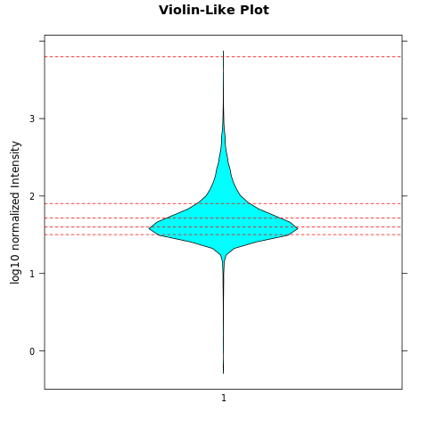 
```

This violin plot represents the distribution and probability density of **(log10) normalized peak intensity** (for peak without motif 1~8). Each red dotted line indicates the quantile cutoff of 20%, which can help us to visualize the peak intensity distribution **across different quantile**. \ 


Parse peaks into 5 intensity quantile by 20%. \
```{r, engine='R', eval=F, echo=TRUE}
chr = sapply(strsplit(names(peak.intensities), ":"), "[", 1)
rnge = sapply(strsplit(names(peak.intensities), ":"), "[", 2)
start = as.numeric(sapply(strsplit(rnge, "-"), "[", 1)) + 200
end = as.numeric(sapply(strsplit(rnge, "-"), "[", 2)) - 200

quantile(peak.intensities, probs = seq(.20, 1.00, by = .20))


# 1bp summit quantile file
j =0 
q=seq(.20, 1.00, by = .20)
count=0
for (i in quantile(peak.intensities, probs = seq(.20, 1.00, by = .20))){
count = count +1

write.table(file = paste0('quantile', as.character(q[count]), '_summits.bed'), data.frame(chr[peak.intensities > j & peak.intensities <= i], start[peak.intensities > j & peak.intensities <= i], end[peak.intensities > j & peak.intensities <= i], peak.intensities[peak.intensities > j & peak.intensities <= i]), sep = '\t', quote=FALSE, col.names=FALSE, row.names=FALSE )
j = i
}
```

```{r, engine='bash', eval=TRUE, echo=TRUE}
for i in quantile*.bed
do
wc -l $i
done
```


### Coherence check
See if the number of input samples will change the normalized reads. \
I am loading fewer samples (only two condition, GATA_CC and GATA_dE) \
```{r engine='R', eval=F, echo=TRUE}
GATA.analysis.regions2=GATA.analysis.regions[,c(1,2,3,7,8,9)]
colnames(GATA.analysis.regions2)
#[1] "MCF7_dTAGGATA522_GATA_CC_rep1" "MCF7_dTAGGATA522_GATA_CC_rep2"
#[3] "MCF7_dTAGGATA522_GATA_CC_rep3" "MCF7_dTAGGATA522_GATA_dE_rep1"
#[5] "MCF7_dTAGGATA522_GATA_dE_rep2" "MCF7_dTAGGATA522_GATA_dE_rep3"
library(DESeq2)
sample.conditions2 = factor(sapply(strsplit(colnames(GATA.analysis.regions2), '_rep'), '[', 1))
sample.conditions2
#[1] MCF7_dTAGGATA522_GATA_CC MCF7_dTAGGATA522_GATA_CC MCF7_dTAGGATA522_GATA_CC
#[4] MCF7_dTAGGATA522_GATA_dE MCF7_dTAGGATA522_GATA_dE MCF7_dTAGGATA522_GATA_dE
#Levels: MCF7_dTAGGATA522_GATA_CC MCF7_dTAGGATA522_GATA_dE

deseq.counts.table2 = DESeqDataSetFromMatrix(countData = GATA.analysis.regions2, # DESeqDataSet needs countData to be non-negative integers; non-normalized counts are integer, normalized signals has decimals.
                colData = as.data.frame(sample.conditions2),
                design = ~ sample.conditions2)


GATA.SF2 <- read.table("GATA_reads.txt", sep = '\t', header = TRUE)[,-1][,c(1,2,3,7,8,9)]
#MCF7_dTAGGATA522_GATA_CC_rep1 MCF7_dTAGGATA522_GATA_CC_rep2
#                      33948616                      32585396
#  MCF7_dTAGGATA522_GATA_CC_rep3 MCF7_dTAGGATA522_GATA_dE_rep1
#                      34475586                      34136142
#  MCF7_dTAGGATA522_GATA_dE_rep2 MCF7_dTAGGATA522_GATA_dE_rep3
#                     136271358                      85665512
GATA.size.factors2 = estimateSizeFactorsForMatrix(GATA.SF2)
#MCF7_dTAGGATA522_GATA_CC_rep1 MCF7_dTAGGATA522_GATA_CC_rep2 
#                    0.6821163                     0.6547257 
#MCF7_dTAGGATA522_GATA_CC_rep3 MCF7_dTAGGATA522_GATA_dE_rep1 
#                    0.6927045                     0.6858842 
#MCF7_dTAGGATA522_GATA_dE_rep2 MCF7_dTAGGATA522_GATA_dE_rep3 
#                    2.7380474                     1.7212438 

sizeFactors(deseq.counts.table2) <- GATA.size.factors2 # assign to each column of the count matrix (deseq.counts.table) the size factor to bring each column to a common scale
dds <- DESeq(deseq.counts.table2)
normalized.counts.GATA3.2 = counts(dds, normalized=TRUE)
head(normalized.counts.GATA3.2)
peak.intensities2 = rowMeans(normalized.counts.GATA3.2[,1:3])

head(peak.intensities)
#  chr1:827180-827581   chr1:916569-916970   chr1:924653-925054 
#            45.32469             36.69993             30.44684 
#  chr1:966453-966854   chr1:999308-999709 chr1:1000336-1000737 
#            26.87016             21.22455             24.34263 
head(peak.intensities2)
#  chr1:827180-827581   chr1:916569-916970   chr1:924653-925054 
#            35.78574             28.97613             24.03906 
#  chr1:966453-966854   chr1:999308-999709 chr1:1000336-1000737 
#            21.21512             16.75767             19.21953 

save.image('240108_GATA3_ChIP_deseq_test.Rdata') 
```

The alteration in input samples affected the size factor determined by DESeq2's `estimateSizeFactorsForMatrix` function, consequently impacting the normalized intensity of reads for each sample. However, I don't believe it is altering the relative differences within each sample—such as which peak exhibits the highest intensity and which exhibits less. \

**Coherence check-follow up:** \

```{r engine='R', eval=F, echo=TRUE}
module load R/4.1.2 
R 
load('240108_GATA3_ChIP_deseq_test.Rdata')
chr = sapply(strsplit(names(peak.intensities2), ":"), "[", 1)
rnge = sapply(strsplit(names(peak.intensities2), ":"), "[", 2)
start = as.numeric(sapply(strsplit(rnge, "-"), "[", 1)) + 200
end = as.numeric(sapply(strsplit(rnge, "-"), "[", 2)) - 200

quantile(peak.intensities2, probs = seq(.20, 1.00, by = .20))


# 1bp summit quantile file
j =0 
q=seq(.20, 1.00, by = .20)
count=0
for (i in quantile(peak.intensities2, probs = seq(.20, 1.00, by = .20))){
count = count +1

write.table(file = paste0('test_quantile', as.character(q[count]), '_summits.bed'), data.frame(chr[peak.intensities2 > j & peak.intensities2 <= i], start[peak.intensities2 > j & peak.intensities2 <= i], end[peak.intensities2 > j & peak.intensities2 <= i], peak.intensities2[peak.intensities2 > j & peak.intensities2 <= i]), sep = '\t', quote=FALSE, col.names=FALSE, row.names=FALSE )
j = i
}
```

See besides the normalized intensity, if peak coordinates assigned to each quantile is the same. \
```{r engine='R', eval=F, echo=TRUE}
for i in test_quantile*.bed
do
wc -l $i
done
#7269 test_quantile0.2_summits.bed
#7461 test_quantile0.4_summits.bed
#7462 test_quantile0.6_summits.bed
#7461 test_quantile0.8_summits.bed
#7462 test_quantile1_summits.bed

awk '{OFS="\t"} {print $1, $2, $3}' quantile1_summits.bed > test1.bed
awk '{OFS="\t"} {print $1, $2, $3}' test_quantile1_summits.bed > test2.bed
diff test1.bed test2.bed 
```

No difference between the peak regions assigned to each quantile files, despite the difference in the normalized counts. \

## Closest GAT to peak summit
In this section, we use `bedtools closestBed` (refer to: https://bedtools.readthedocs.io/en/latest/content/tools/closest.html) to find the closest GAT to each provided peak summit. \
Input: \
**Input2 -a** is the sorted peak summit file (centered 1bp); \
**Input2 -b** is the sorted, and concatenated GAT coordinates file (both plus and minus); \

### GAT coordinates file
GAT coordinates on full hg38 use **read size==1000**. \
```{r engine='bash', eval=F, echo=TRUE}
dir=/labs/Guertin/siyu/Sathyan_GATA3_ChIP_pool1_pool2/overrep_3mer/hg38_full_kmer3_rs1000/seqdump/
head ${dir}hg38.3.3.3minus.14_GAT.bed  
head ${dir}hg38.3.3.3plus.36_GAT.bed

head ${dir}hg38.3.3.3minus.36_ATC.bed  
head ${dir}hg38.3.3.3plus.14_ATC.bed
```

we will concatenate the plus and minus 3mer file together. \
```{r engine='bash', eval=F, echo=TRUE}
cat ${dir}hg38.3.3.3minus.14_GAT.bed ${dir}hg38.3.3.3plus.36_GAT.bed > hg38.3.3.3.30_plus_minus_GAT.bed
cat ${dir}hg38.3.3.3minus.36_ATC.bed ${dir}hg38.3.3.3plus.14_ATC.bed > hg38.3.3.3.30_plus_minus_ATC.bed

wc -l ${dir}hg38.3.3.3minus.14_GAT.bed #38717592
wc -l ${dir}hg38.3.3.3plus.36_GAT.bed #39090736
wc -l hg38.3.3.3.30_plus_minus_GAT.bed #77808328
#38717592+39090736
#[1] 77808328

wc -l ${dir}hg38.3.3.3minus.36_ATC.bed #39086237
wc -l ${dir}hg38.3.3.3plus.14_ATC.bed #38725373
wc -l hg38.3.3.3.30_plus_minus_ATC.bed #77811610

#39086237+38725373
#[1] 77811610
```


```{r engine='bash', eval=F, echo=TRUE}
wc -l hg38.3.3.3.30_plus_minus_GAT.bed #77808328
head -5 hg38.3.3.3.30_plus_minus_GAT.bed
#chr1	10545	10548	14	14	-	GAT
#chr1	11145	11148	14	14	-	GAT
#chr1	11160	11163	14	14	-	GAT
#chr1	11576	11579	14	14	-	GAT
#chr1	11597	11600	14	14	-	GAT
```

load files contains 3mer coordinates info \
```{r engine='R', eval=F, echo=TRUE}
#concatenate the plus and minus file together
all.GAT.file=read.table(file = "hg38.3.3.3.30_plus_minus_GAT.bed", sep="\t", header=FALSE)
head(all.GAT.file)
#    V1    V2    V3 V4 V5 V6  V7
#1 chr1 10545 10548 14 14  - GAT
#2 chr1 11145 11148 14 14  - GAT
#3 chr1 11160 11163 14 14  - GAT
#4 chr1 11576 11579 14 14  - GAT
#5 chr1 11597 11600 14 14  - GAT
#6 chr1 11846 11849 14 14  - GAT

tail(all.GAT.file)
# V1    V2    V3 V4 V5 V6  V7
#77808323 chrY_KI270740v1_random 36665 36668 36 36  + GAT
#77808324 chrY_KI270740v1_random 36790 36793 36 36  + GAT
#77808325 chrY_KI270740v1_random 36885 36888 36 36  + GAT
#77808326 chrY_KI270740v1_random 36913 36916 36 36  + GAT
#77808327 chrY_KI270740v1_random 37038 37041 36 36  + GAT
#77808328 chrY_KI270740v1_random 37163 37166 36 36  + GAT                            

nrow(all.GAT.file)
#[1] 77808328
```


### 20% quantile peaks without motifs 12345678

load files contains selected ChIP peak summit info \
```{r engine='R', eval=F, echo=TRUE}
chip.peak.summit.quantile1=read.table("quantile1_summits.bed", header=FALSE)
nrow(chip.peak.summit.quantile1)
#[1] 7462
head(chip.peak.summit.quantile1)
#V1      V2      V3        V4
#1 chr1 5598187 5598188 271.93122
#2 chr1 8017660 8017661 676.31362
#3 chr1 8020178 8020179 324.95549
#4 chr1 8055212 8055213 111.55874
#5 chr1 8061475 8061476  98.51927
#6 chr1 8120791 8120792 124.49564

chip.peak.summit.quantile0.8=read.table("quantile0.8_summits.bed", header=FALSE)
chip.peak.summit.quantile0.6=read.table("quantile0.6_summits.bed", header=FALSE)
chip.peak.summit.quantile0.4=read.table("quantile0.4_summits.bed", header=FALSE)
chip.peak.summit.quantile0.2=read.table("quantile0.2_summits.bed", header=FALSE)


nrow(chip.peak.summit.quantile0.8)
#[1] 7461
head(chip.peak.summit.quantile0.8)
#    V1      V2      V3       V4
#1 chr1 1073822 1073823 56.70255
#2 chr1 5637335 5637336 63.60992
#3 chr1 7019683 7019684 72.40249
#4 chr1 7494212 7494213 75.17251
#5 chr1 8026313 8026314 69.95015
#6 chr1 8070509 8070510 77.97241
summary(chip.peak.summit.quantile0.8$V4)
#Min. 1st Qu.  Median    Mean 3rd Qu.    Max. 
#  51.96   56.34   61.88   63.24   69.39   80.03


nrow(chip.peak.summit.quantile0.6)
#[1] 7462
head(chip.peak.summit.quantile0.6)
#    V1      V2      V3       V4
#1 chr1  827380  827381 45.32469
#2 chr1 1074184 1074185 48.18883
#3 chr1 1124966 1124967 45.46610
#4 chr1 1157747 1157748 44.19288
#5 chr1 3587455 3587456 51.91936
#6 chr1 3668981 3668982 40.55495
summary(chip.peak.summit.quantile0.6$V4)
# Min. 1st Qu.  Median    Mean 3rd Qu.    Max. 
#  40.05   42.60   45.44   45.63   48.55   51.95


nrow(chip.peak.summit.quantile0.4)
#[1] 7461
head(chip.peak.summit.quantile0.4)
#    V1      V2      V3       V4
#1 chr1  916769  916770 36.69993
#2 chr1 1013265 1013266 34.70221
#3 chr1 1013580 1013581 36.26922
#4 chr1 1021142 1021143 32.69951
#5 chr1 1158192 1158193 36.21743
#6 chr1 1208541 1208542 38.65084
summary(chip.peak.summit.quantile0.4$V4)
#   Min. 1st Qu.  Median    Mean 3rd Qu.    Max. 
#  31.79   33.73   35.71   35.85   37.98   40.05 


nrow(chip.peak.summit.quantile0.2)
#[1] 7269
head(chip.peak.summit.quantile0.2)
#    V1      V2      V3       V4
#1 chr1  924853  924854 30.44684
#2 chr1  966653  966654 26.87016
#3 chr1  999508  999509 21.22455
#4 chr1 1000536 1000537 24.34263
#5 chr1 1001891 1001892 25.52872
#6 chr1 1020187 1020188 20.63151
summary(chip.peak.summit.quantile0.2$V4)
#   Min. 1st Qu.  Median    Mean 3rd Qu.    Max. 
# 0.6095 24.2296 27.3925 26.2179 29.8468 31.7863 
```


**bedtools closestBed** \
The below function will sort input bed1 and bed2 first, then run `bedtools closestBed` between bed1 and bed2. \
```{r engine='R', eval=F, echo=TRUE}
# define function 
bedTools.closest <- function(functionstring="/home/FCAM/ssun/packages/bedtools2/bin/closestBed",bed1,bed2,opt.string="") {
  
  options(scipen =99) # not use scientific notation when writing out
  
  #write bed formatted data.frames to tempfile
  write.table(bed1,file= 'a.file.bed', quote=F,sep="\t",col.names=F,row.names=F)
  write.table(bed2,file= 'b.file.bed', quote=F,sep="\t",col.names=F,row.names=F)
  
  # create the command string and call the command using system()
  # the command sort a and b file by coordinates
  command1=paste('sort -k1,1 -k2,2n', 'a.file.bed', '> a.file.sorted.bed')
  cat(command1,"\n") #sort -k1,1 -k2,2n a.file.bed > a.file.sorted.bed
  try(system(command1))
  command2=paste('sort -k1,1 -k2,2n', 'b.file.bed', '> b.file.sorted.bed')
  cat(command2,"\n")
  try(system(command2))
  
  # the command call closestBed on bed1 and bed2
  command=paste(functionstring, opt.string,"-a",'a.file.sorted.bed',"-b",'b.file.sorted.bed',">",'out.file.bed',sep=" ")
  cat(command,"\n")
  try(system(command))
  
  res=read.table('out.file.bed',header=F, comment.char='')
  
  # remove intermediate files
  command3=paste('rm', 'a.file.bed', 'b.file.bed', 'a.file.sorted.bed', 'b.file.sorted.bed', 'out.file.bed')
  cat(command3,"\n")
  try(system(command3))
  
  colnames(res) = c(colnames(bed1), colnames(bed2), 'dis' )
  return(res)
}
```

Parameter `-d` will report the distance from the closest GAT to the peak summit. \
Parameter `-t last` or `-t first` will only report either the last or the first entry in bed2 file if tied distance occurred. \
Here we choose to use `-t first` to report the first coordinates when tie occurred. \

Find the closest GAT to peak summit regardless of GAT strandedness \
```{r engine='R', eval=F, echo=TRUE}
closest.1stGAT.to.GATA.peak.quantile1=bedTools.closest(bed1 = chip.peak.summit.quantile1[,1:3], bed2 = all.GAT.file, opt.string = '-d -t first')
closest.1stGAT.to.GATA.peak.quantile0.8=bedTools.closest(bed1 = chip.peak.summit.quantile0.8[,1:3], bed2 = all.GAT.file, opt.string = '-d -t first')
closest.1stGAT.to.GATA.peak.quantile0.6=bedTools.closest(bed1 = chip.peak.summit.quantile0.6[,1:3], bed2 = all.GAT.file, opt.string = '-d -t first')
closest.1stGAT.to.GATA.peak.quantile0.4=bedTools.closest(bed1 = chip.peak.summit.quantile0.4[,1:3], bed2 = all.GAT.file, opt.string = '-d -t first')
closest.1stGAT.to.GATA.peak.quantile0.2=bedTools.closest(bed1 = chip.peak.summit.quantile0.2[,1:3], bed2 = all.GAT.file, opt.string = '-d -t first')


write.table(closest.1stGAT.to.GATA.peak.quantile1,file= 'closest.1stGAT.to.GATA.peak.quantile1.bed', quote=F,sep="\t",col.names=F,row.names=F)
write.table(closest.1stGAT.to.GATA.peak.quantile0.8,file= 'closest.1stGAT.to.GATA.peak.quantile0.8.bed', quote=F,sep="\t",col.names=F,row.names=F)
write.table(closest.1stGAT.to.GATA.peak.quantile0.6,file= 'closest.1stGAT.to.GATA.peak.quantile0.6.bed', quote=F,sep="\t",col.names=F,row.names=F)
write.table(closest.1stGAT.to.GATA.peak.quantile0.4,file= 'closest.1stGAT.to.GATA.peak.quantile0.4.bed', quote=F,sep="\t",col.names=F,row.names=F)
write.table(closest.1stGAT.to.GATA.peak.quantile0.2,file= 'closest.1stGAT.to.GATA.peak.quantile0.2.bed', quote=F,sep="\t",col.names=F,row.names=F)


save.image('240108_GATA3_ChIP_clsestbed.Rdata') 
```

### DHS negative controls

load files contains the 4 MCF7 DHS negative controls. \

- **"full DHS control"** \
MCF7DHS_Rep1_161bp_without_motifs_123456_78.bed  #92388 \
MCF7DHS_Rep2_161bp_without_motifs_123456_78.bed  #139899 \

- **"independent DHS control"** \
MCF7DHS_Rep1_161bp_noGATA_without_motifs_123456_78.bed  #69119 \
MCF7DHS_Rep2_161bp_noGATA_without_motifs_123456_78.bed  #113774 \


```{r engine='R', eval=F, echo=TRUE}
# DHS negative ctrl (convert to 1bp summit at center)
library(bigWig)
full.DHS.control.rep1=center.bed(read.table("../ENCODE_DHS_GSE29692/MCF7DHS_Rep1_161bp_without_motifs_123456_78.bed", header=FALSE), upstreamWindow = 0, downstreamWindow = 0)
nrow(full.DHS.control.rep1)
#[1] 92388
head(full.DHS.control.rep1)
#    V1     V2     V3
#1 chr1 268044 268045
#2 chr1 586135 586136
#3 chr1 629975 629976
#4 chr1 630235 630236
#5 chr1 630555 630556
#6 chr1 631455 631456

full.DHS.control.rep2=center.bed(read.table("../ENCODE_DHS_GSE29692/MCF7DHS_Rep2_161bp_without_motifs_123456_78.bed", header=FALSE), upstreamWindow = 0, downstreamWindow = 0)
nrow(full.DHS.control.rep2)
#[1] 139899
head(full.DHS.control.rep2)
#    V1     V2     V3
#1 chr1  10255  10256
#2 chr1  16235  16236
#3 chr1 267984 267985
#4 chr1 586135 586136
#5 chr1 630255 630256
#6 chr1 630555 630556

indep.DHS.control.rep1=center.bed(read.table("../ENCODE_DHS_GSE29692/MCF7DHS_Rep1_161bp_noGATA_without_motifs_123456_78.bed", header=FALSE), upstreamWindow = 0, downstreamWindow = 0)
nrow(indep.DHS.control.rep1)
#[1] 69119
head(indep.DHS.control.rep1)
#    V1     V2     V3
#1 chr1 268044 268045
#2 chr1 586135 586136
#3 chr1 629975 629976
#4 chr1 630235 630236
#5 chr1 630555 630556
#6 chr1 631455 631456

indep.DHS.control.rep2=center.bed(read.table("../ENCODE_DHS_GSE29692/MCF7DHS_Rep2_161bp_noGATA_without_motifs_123456_78.bed", header=FALSE), upstreamWindow = 0, downstreamWindow = 0)
nrow(indep.DHS.control.rep2)
#[1] 113774
head(indep.DHS.control.rep2)
#    V1     V2     V3
#1 chr1  10255  10256
#2 chr1  16235  16236
#3 chr1 267984 267985
#4 chr1 586135 586136
#5 chr1 630255 630256
#6 chr1 630555 630556
```

calculate the distance between the closest GAT to DHS regions' summits. \
```{r engine='R', eval=F, echo=TRUE}
closest.1stGAT.to.full.DHS.control.rep1=bedTools.closest(bed1 = full.DHS.control.rep1[,1:3], bed2 = all.GAT.file, opt.string = '-d -t first')
closest.1stGAT.to.full.DHS.control.rep2=bedTools.closest(bed1 = full.DHS.control.rep2[,1:3], bed2 = all.GAT.file, opt.string = '-d -t first')
closest.1stGAT.to.indep.DHS.control.rep1=bedTools.closest(bed1 = indep.DHS.control.rep1[,1:3], bed2 = all.GAT.file, opt.string = '-d -t first')
closest.1stGAT.to.indep.DHS.control.rep2=bedTools.closest(bed1 = indep.DHS.control.rep2[,1:3], bed2 = all.GAT.file, opt.string = '-d -t first')


write.table(closest.1stGAT.to.full.DHS.control.rep1,file= 'closest.1stGAT.to.full.DHS.control.rep1.bed', quote=F,sep="\t",col.names=F,row.names=F)
write.table(closest.1stGAT.to.full.DHS.control.rep2,file= 'closest.1stGAT.to.full.DHS.control.rep2.bed', quote=F,sep="\t",col.names=F,row.names=F)
write.table(closest.1stGAT.to.indep.DHS.control.rep1,file= 'closest.1stGAT.to.indep.DHS.control.rep1.bed', quote=F,sep="\t",col.names=F,row.names=F)
write.table(closest.1stGAT.to.indep.DHS.control.rep2,file= 'closest.1stGAT.to.indep.DHS.control.rep2.bed', quote=F,sep="\t",col.names=F,row.names=F)


save.image('240108_GATA3_ChIP_clsestbed2.Rdata') 
```

<span class="highlighted">**negative control comparison**</span> \
<span class="highlighted">First, we want to ask if the MCF7 DHS controls are comparable to each other.</span> \

Combine info to the same data frame: negative control (MCF7 DHS regions) info + distance +status. \

```{r engine='R', class.source = "revision", eval=TRUE, echo=TRUE}
df.neg = data.frame(matrix(nrow = 0, ncol = 5))     
colnames(df.neg) = c("V1","V2","v3", "dis", "status")
for (chip.peak in Sys.glob(file.path("./*DHS.control.rep*.bed"))) {
    print(chip.peak)
    rep.name =strsplit((strsplit(strsplit(chip.peak, "/")[[1]][length(strsplit(chip.peak, "/")[[1]])], 'closest.1stGAT.to.')[[1]][2]), ".bed")[[1]][1]
    print(rep.name)
    all.distance = cbind(read.table(chip.peak,header=F, comment.char='')[,c(1:3, 11)],  rep.name) 
    df.neg = rbind(df.neg, all.distance)
}
str(df.neg)
colnames(df.neg) = c("V1","V2","V3", "dis", "status")
unique(df.neg$status)
head(df.neg)
```

CDF plot \
```{r engine='R',  class.source = "revision", eval=TRUE, echo=TRUE}
library(lattice)
library(latticeExtra)

df.neg$status = factor(df.neg$status, levels = c("full.DHS.control.rep1", "full.DHS.control.rep2", "indep.DHS.control.rep1", "indep.DHS.control.rep2"))

ecdfplot(~log(abs(dis), base = 10), groups = status, data = df.neg,
         auto.key = list(space = "right", lines=TRUE, points=FALSE, cex = 1),
         col=c(colorRampPalette(c("blue4","blue"))(2), colorRampPalette(c("grey60","grey30"))(2)),
         aspect = 1,
         #xlim = c(0, 50000),
         scales=list(relation="free",alternating=c(1,1,1,1)),
         ylab = 'Cumulative Distribution Function',
         xlab = expression('log'[10]~'3mer-GAT Distance from peak summit'),
                                        #index.cond = list(c(2,1)),
         between=list(y=1.0),
         type = 'a',
         xlim = c(0,2.5),
         lwd=2,
         lty=c(1),
         par.settings = list(superpose.line = list(col=c(colorRampPalette(c("blue4","blue"))(2), colorRampPalette(c("grey60","grey30"))(2)), lwd=3), strip.background=list(col="grey85"))
         )
```

The blue traces are the two reps from full MCF7 DHS regions, the grey traces are the two reps from MCF7 HDS regions without overlapped GATA3 peak regions. \
<span class="highlighted">Four negative traces looks very similar to each other. By eye, two traces from rep1 are slightly leftward shifted than two traces from rep2. \

<span class="highlighted">**Kolmogorov–Smirnov test**</span> \
<span class="highlighted">KS test is used to compare distributions. Notice that it is a pretty sensitive test.</span> \
<span class="highlighted">The `ks.test` function in R returns a test statistic and a p-value. We can interpret the p-value to determine whether to reject the null hypothesis (H0: two sample draw from populations with same distribution). If the p-value is less than than significance level (e.g., 0.05), we can reject the null hypothesis and conclude that the distributions are significantly different.</span> \
```{r engine='R',  class.source = "revision", eval=TRUE, echo=TRUE}
data1=abs(df.neg$dis)[df.neg$status == 'indep.DHS.control.rep1']
data2=abs(df.neg$dis)[df.neg$status == 'indep.DHS.control.rep2']
data3=abs(df.neg$dis)[df.neg$status == 'full.DHS.control.rep1']
data4=abs(df.neg$dis)[df.neg$status == 'full.DHS.control.rep2']

#rep1 vs. rep2
ks.test(data1 , data2)
ks.test(data3 , data4)

# full vs. indep (within each rep)
ks.test(data1 , data3)
ks.test(data2 , data4)

# default of ks.test() uses two-tail t test, which is what we wanted, because we do not restrict the test on whether one of the two dataset is larger/smaller than the other. If we had the expectation, we should use one-tail. 
```

<span class="highlighted">Looking at **KS test** p-value from different comparisons, we can tell that:</span> \
<span class="highlighted">For the comparisons between rep1 and rep2, the p-value is very small (<0.001), this indicates that we can reject the NULL hypothesis (H0) and conclude that the data (distance between closest GAT to region summits) distribution are significantly different.</span> \
<span class="highlighted">For the comparisons between the independent and full within same replicate, the KS test P-value is large which indicates that they are very likely to have same data distribution. Since the independent DHS control is the one we removed all overlapped GATA3 ChIP peak regions from the full DHS, the majority of data should be overlapped to each other, so we would expect to see this similar data distribution.</span> \

We also expect that the independent control compared to its complete version in the same rep will be more right-shifted. (in other word, has less GAT 3mer close to its summit). let's check: \

**indep vs. full in rep1** \
```{r engine='R',  class.source = "revision", eval=TRUE, echo=TRUE}
library(lattice)
library(latticeExtra)

df.neg.rep1=rbind(df.neg[df.neg$status=="full.DHS.control.rep1",], df.neg[df.neg$status=="indep.DHS.control.rep1",])
df.neg.rep1$status = factor(df.neg.rep1$status, levels = c("full.DHS.control.rep1", "indep.DHS.control.rep1"))

ecdfplot(~log(abs(dis), base = 10), groups = status, data = df.neg.rep1,
         auto.key = list(space = "right", lines=TRUE, points=FALSE, cex = 1),
         col=c("blue4","grey60"),
         aspect = 1,
         #xlim = c(0, 50000),
         scales=list(relation="free",alternating=c(1,1,1,1)),
         ylab = 'Cumulative Distribution Function',
         xlab = expression('log'[10]~'3mer-GAT Distance from peak summit'),
                                        #index.cond = list(c(2,1)),
         between=list(y=1.0),
         type = 'a',
         xlim = c(0, 2.5),
         lwd=2,
         lty=c(1),
         par.settings = list(superpose.line = list(col=c("blue4","grey60"), lwd=3), strip.background=list(col="grey85"))
         )
    
```
The two traces are mostly overlapped. By eye, blue trace (full) is slightly leftward shifted than the grey trace (indep). \

Further validate if these traces converge/parallel to each other. \

```{r engine='R', class.source = "revision", eval=TRUE, echo=TRUE}
# Specify categories to compare within df.neg.rep1
match = ecdf(abs(df.neg.rep1$dis)[df.neg.rep1$status == 'indep.DHS.control.rep1'])
rep = ecdf(abs(df.neg.rep1$dis)[df.neg.rep1$status == 'full.DHS.control.rep1'])
match.y = seq(0, 1600, by=1) # creating indices
rep.y = seq(0, 1600, by=1)

spl = smooth.spline(rep.y, rep(rep.y) - match(match.y))
pred = predict(spl)
pred1 = predict(spl, deriv=1)

print('The distance that CDFs are parallel or converge:')
print(rep.y[min(which(pred1$y<=0)) - 1]) 

# Plot graph depicting the distance determination
plot(rep.y, rep(rep.y) - match(match.y),
     xlim = c(0,60),
     cex=0.7,
     xlab = 'Distance indices (abs) between closest 3mer-GAT to peak summit (bp)',
     ylab = 'full.DHS.control.rep1 CDF - indep.DHS.control.rep1 CDF')
     abline(v = rep.y[min(which(pred1$y<=0)) - 1], col =2, lty =2)
      lines(pred[[1]], pred[[2]], col = 'blue')
      
# this is the same plot as above but with a longer x-axis limit
plot(rep.y, rep(rep.y) - match(match.y),
     xlim = c(0,300),
     cex=0.7,
     xlab = 'Distance indices (abs) between closest 3mer-GAT to peak summit (bp)',
     ylab = 'full.DHS.control.rep1 CDF - indep.DHS.control.rep1 CDF')
     abline(v = rep.y[min(which(pred1$y<=0)) - 1], col =2, lty =2)
      lines(pred[[1]], pred[[2]], col = 'blue')
```

**indep vs. full in rep2** \
```{r engine='R',  class.source = "revision", eval=TRUE, echo=TRUE}
library(lattice)
library(latticeExtra)

df.neg.rep2=rbind(df.neg[df.neg$status=="full.DHS.control.rep2",], df.neg[df.neg$status=="indep.DHS.control.rep2",])

df.neg.rep2$status = factor(df.neg.rep2$status, levels = c("full.DHS.control.rep2", "indep.DHS.control.rep2"))

ecdfplot(~log(abs(dis), base = 10), groups = status, data = df.neg.rep2,
         auto.key = list(space = "right", lines=TRUE, points=FALSE, cex = 1),
         col=c("blue","grey30"),
         aspect = 1,
         #xlim = c(0, 50000),
         scales=list(relation="free",alternating=c(1,1,1,1)),
         ylab = 'Cumulative Distribution Function',
         xlab = expression('log'[10]~'3mer-GAT Distance from peak summit'),
                                        #index.cond = list(c(2,1)),
         between=list(y=1.0),
         type = 'a',
         xlim = c(0, 2.5),
         lwd=2,
         lty=c(1),
         par.settings = list(superpose.line = list(col=c("blue","grey30"), lwd=3), strip.background=list(col="grey85"))
         )
    
```
The two traces are mostly overlapped. \

Further validate if these traces converge/parallel to each other. \

```{r engine='R', class.source = "revision", eval=TRUE, echo=TRUE}
# Specify categories to compare within df.neg.rep2
match = ecdf(abs(df.neg.rep2$dis)[df.neg.rep2$status == 'indep.DHS.control.rep2'])
rep = ecdf(abs(df.neg.rep2$dis)[df.neg.rep2$status == 'full.DHS.control.rep2'])
match.y = seq(0, 1600, by=1) # creating indices
rep.y = seq(0, 1600, by=1)

spl = smooth.spline(rep.y, rep(rep.y) - match(match.y))
pred = predict(spl)
pred1 = predict(spl, deriv=1)

print('The distance that CDFs are parallel or converge:')
print(rep.y[min(which(pred1$y<=0)) - 1]) 

# Plot graph depicting the distance determination
plot(rep.y, rep(rep.y) - match(match.y),
     xlim = c(0,60),
     cex=0.7,
     xlab ='Distance indices (abs) between closest 3mer-GAT to peak summit (bp)',
     ylab = 'full.DHS.control.rep2 CDF - indep.DHS.control.rep2) CDF')
     abline(v = rep.y[min(which(pred1$y<=0)) - 1], col =2, lty =2)
      lines(pred[[1]], pred[[2]], col = 'blue')
      
# this is the same plot as above but with a longer x-axis limit
plot(rep.y, rep(rep.y) - match(match.y),
     xlim = c(0,300),
     cex=0.7,
     xlab = 'Distance indices (abs) between closest 3mer-GAT to peak summit (bp)',
     ylab = 'full.DHS.control.rep2 CDF - indep.DHS.control.rep2) CDF')
     abline(v = rep.y[min(which(pred1$y<=0)) - 1], col =2, lty =2)
      lines(pred[[1]], pred[[2]], col = 'blue')
```

Comparing the full DHS regions between rep1 and rep2. \

```{r engine='R',  class.source = "revision", eval=TRUE, echo=TRUE}
library(lattice)
library(latticeExtra)

df.neg.full=rbind(df.neg[df.neg$status=="full.DHS.control.rep1",], df.neg[df.neg$status=="full.DHS.control.rep2",])
df.neg.full$status = factor(df.neg.full$status, levels = c("full.DHS.control.rep1", "full.DHS.control.rep2"))

ecdfplot(~log(abs(dis), base = 10), groups = status, data = df.neg.full,
         auto.key = list(space = "right", lines=TRUE, points=FALSE, cex = 1),
         col=c("blue4","blue"),
         aspect = 1,
         #xlim = c(0, 50000),
         scales=list(relation="free",alternating=c(1,1,1,1)),
         ylab = 'Cumulative Distribution Function',
         xlab = expression('log'[10]~'3mer-GAT Distance from peak summit'),
                                        #index.cond = list(c(2,1)),
         between=list(y=1.0),
         type = 'a',
         xlim = c(0, 2.5),
         lwd=2,
         lty=c(1),
         par.settings = list(superpose.line = list(col=c("blue4","blue"), lwd=3), strip.background=list(col="grey85"))
         )
```

```{r engine='R', class.source = "revision", eval=TRUE, echo=TRUE}
# Specify categories 
match = ecdf(abs(df.neg$dis)[df.neg$status == 'full.DHS.control.rep2'])
rep = ecdf(abs(df.neg$dis)[df.neg$status == 'full.DHS.control.rep1'])
match.y = seq(0, 2300, by=1) # creating indices
rep.y = seq(0, 2300, by=1)

spl = smooth.spline(rep.y, rep(rep.y) - match(match.y))
pred = predict(spl)
pred1 = predict(spl, deriv=1)

print('The distance that CDFs are parallel or converge:')
print(rep.y[min(which(pred1$y<=0)) - 1]) 

# Plot graph depicting the distance determination
plot(rep.y, rep(rep.y) - match(match.y),
     xlim = c(0,60),
     cex=0.7,
     xlab =  'Distance indices (abs) between closest 3mer-GAT to peak summit (bp)',
     ylab = 'full.DHS.control.rep1 CDF - full.DHS.control.rep2 CDF')
     abline(v = rep.y[min(which(pred1$y<=0)) - 1], col =2, lty =2)
      lines(pred[[1]], pred[[2]], col = 'blue')
      
# this is the same plot as above but with a longer x-axis limit
plot(rep.y, rep(rep.y) - match(match.y),
     xlim = c(0,300),
     cex=0.7,
     xlab =  'Distance indices (abs) between closest 3mer-GAT to peak summit (bp)',
     ylab = 'full.DHS.control.rep1 CDF - full.DHS.control.rep2 CDF')
     abline(v = rep.y[min(which(pred1$y<=0)) - 1], col =2, lty =2)
      lines(pred[[1]], pred[[2]], col = 'blue')
```
<span class="highlighted">In summary, within each replicate, the independent controls predominantly overlap with the full control. Notably, the full control exhibits a slight leftward shift compared to the independent control. This aligns with expectations, considering that the independent control omits the overlapped GATA3 peak regions, resulting in reduced bias toward GAT 3mer in proximity to the summit. Additionally, the fluctuations observed in the differences between the independent trace CDF and the full trace CDF imply minimal discrepancies.</span> \

<span class="highlighted">On the other hand, when comparing the negative controls between replicate 2 and replicate 1, it's discernible that GAT is closer to the summit of replicate 1 than that of replicate 2.</span> \

### consensus DHS negative controls

<span class="highlighted">The above ks tests as well as cdf plots reveal that data (closest GAT distance to DHS regions summit) distribution is significantly different between rep1 and rep2 DHS. Thus, we want to take the intersect regions from the two replicates, then use the new sets' summit to calculate distance to closest GAT as the consensus negative controls.</span> \

**DHS peak intensity append from original data** \
```{r engine='bash',  class.source = "revision", eval=F, echo=TRUE}
head -5 hg38.rep1.intensity.bed 
#chr1	99534644	99534794	11
#chr1	9942462	9942612	14
#chr1	99560724	99560874	13
#chr1	9942982	9943132	42
#chr1	9943342	9943492	25

head -5 hg38.rep2.intensity.bed 
#chr1	99544544	99544694	17
#chr1	99559364	99559514	14
#chr1	9942462	9942612	36
#chr1	9943022	9943172	158
#chr1	9943322	9943472	225
```

Assign the intensity to full neg control rep1 and rep2: \
intersect with peak that extend to 161bp and removed motifs123456_78 \
```{r engine='bash',  class.source = "revision", eval=F, echo=TRUE}
module load bedtools
intersectBed -wa -wb -a MCF7DHS_Rep1_161bp_without_motifs_123456_78.bed -b hg38.rep1.intensity.bed | head -5  
#chr1	267964	268125	chr1	267969	268119	11
#chr1	586055	586216	chr1	586060	586210	16
#chr1	629895	630056	chr1	629900	630050	41
#chr1	630155	630316	chr1	630160	630310	54
#chr1	630475	630636	chr1	630480	630630	95
intersectBed -wa -wb -a MCF7DHS_Rep1_161bp_without_motifs_123456_78.bed -b hg38.rep1.intensity.bed | awk '{print $1, $2, $3, $7}' | uniq | wc -l   #92398
intersectBed -wa -wb -a MCF7DHS_Rep1_161bp_without_motifs_123456_78.bed -b hg38.rep1.intensity.bed | awk '{print $1, $2, $3}' | uniq | wc -l #92388

#There are 10 peaks with multiple regions assigned (and with more than one intensity value assigned)
intersectBed -wa -wb -a MCF7DHS_Rep1_161bp_without_motifs_123456_78.bed -b hg38.rep1.intensity.bed | awk '{print $1, $2, $3}' | uniq -d
chr1 143972158 143972319
chr21 8811634 8811795
chr1 143972221 143972382
chr1 120851115 120851276
chr1 120850576 120850737
chr1 120850664 120850825
chr1 120851163 120851324
chr21 8811482 8811643
chr9 40992171 40992332
chr9 40992166 40992327

intersectBed -wa -wb -a MCF7DHS_Rep1_161bp_without_motifs_123456_78.bed -b hg38.rep1.intensity.bed | grep 143972158
chr1	143972158	143972319	chr1	143972163	143972313	252
chr1	143972158	143972319	chr1	143972226	143972376	915
# the original DHS file, after liftover, it has some regions partially overlapped and has different intensity.


intersectBed -wa -wb -a MCF7DHS_Rep2_161bp_without_motifs_123456_78.bed -b hg38.rep2.intensity.bed | head -5 
#chr1	10175	10336	chr1	10180	10330	12
#chr1	16155	16316	chr1	16160	16310	11
#chr1	267904	268065	chr1	267909	268059	41
#chr1	586055	586216	chr1	586060	586210	66
#chr1	630175	630336	chr1	630180	630330	91
intersectBed -wa -wb -a MCF7DHS_Rep2_161bp_without_motifs_123456_78.bed -b hg38.rep2.intensity.bed | awk '{print $1, $2, $3, $7}' | uniq | wc -l   #139911
intersectBed -wa -wb -a MCF7DHS_Rep2_161bp_without_motifs_123456_78.bed -b hg38.rep2.intensity.bed | awk '{print $1, $2, $3}' | uniq | wc -l #139899

intersectBed -wa -wb -a MCF7DHS_Rep2_161bp_without_motifs_123456_78.bed -b hg38.rep2.intensity.bed | awk '{print $1, $2, $3}' | uniq -d
chr1 143972158 143972319
chr21 8811634 8811795
chr1 143972221 143972382
chr1 120851075 120851236
chr1 120850744 120850905
chr1 120851183 120851344
chr14 105999444 105999605
chr2 87396672 87396833
chr2 87396751 87396912
chr21 8811482 8811643
chr9 40992171 40992332
chr9 40992166 40992327
# the same 10 peak has multiple region/intensity assigned (but intensity are different)
intersectBed -wa -wb -a MCF7DHS_Rep2_161bp_without_motifs_123456_78.bed -b hg38.rep2.intensity.bed | grep 143972158
chr1	143972158	143972319	chr1	143972163	143972313	377
chr1	143972158	143972319	chr1	143972226	143972376	1352
```

```{r engine='bash',  class.source = "revision", eval=F, echo=TRUE}
# rep1 with intensity
intersectBed -wa -wb -a MCF7DHS_Rep1_161bp_without_motifs_123456_78.bed -b hg38.rep1.intensity.bed | awk '{print $1, $2, $3, $7}' OFS="\t"| uniq > MCF7DHS_Rep1_161bp_without_motifs_123456_78_with_intensity.bed
wc -l MCF7DHS_Rep1_161bp_without_motifs_123456_78_with_intensity.bed
#92398 MCF7DHS_Rep1_161bp_without_motifs_123456_78_with_intensity.bed
head -5 MCF7DHS_Rep1_161bp_without_motifs_123456_78_with_intensity.bed
#chr1 267964 268125 11
#chr1 586055 586216 16
#chr1 629895 630056 41
#chr1 630155 630316 54
#chr1 630475 630636 95


# rep2 with intensity
intersectBed -wa -wb -a MCF7DHS_Rep2_161bp_without_motifs_123456_78.bed -b hg38.rep2.intensity.bed | awk '{print $1, $2, $3, $7}' OFS="\t" | uniq > MCF7DHS_Rep2_161bp_without_motifs_123456_78_with_intensity.bed
wc -l MCF7DHS_Rep2_161bp_without_motifs_123456_78_with_intensity.bed
#139911 MCF7DHS_Rep2_161bp_without_motifs_123456_78_with_intensity.bed
head -5 MCF7DHS_Rep2_161bp_without_motifs_123456_78_with_intensity.bed
#chr1 10175 10336 12
#chr1 16155 16316 11
#chr1 267904 268065 41
#chr1 586055 586216 66
#chr1 630175 630336 91
```


**Venn plot** \
```{r engine='bash',  class.source = "revision", eval=F, echo=TRUE}
# rep1 peak (overlapped with rep2)
module load bedtools
intersectBed -wa -a MCF7DHS_Rep1_161bp_without_motifs_123456_78_with_intensity.bed -b MCF7DHS_Rep2_161bp_without_motifs_123456_78_with_intensity.bed | awk '{print $1, $2, $3}' OFS="\t"| uniq | wc -l #78703
# rep1 peak (non-overlapped with rep2)
intersectBed -v -wa -a MCF7DHS_Rep1_161bp_without_motifs_123456_78_with_intensity.bed -b MCF7DHS_Rep2_161bp_without_motifs_123456_78_with_intensity.bed | awk '{print $1, $2, $3}' OFS="\t"| uniq | wc -l #13685

#13685+78703
#[1] 92388

139899-78703=61196

# rep2 peak (overlapped with rep1)
intersectBed -wa -a MCF7DHS_Rep2_161bp_without_motifs_123456_78_with_intensity.bed -b MCF7DHS_Rep1_161bp_without_motifs_123456_78_with_intensity.bed | awk '{print $1, $2, $3}' OFS="\t"| uniq | wc -l #78779
# rep2 peak (non-overlapped with rep1)
intersectBed -v -wa -a MCF7DHS_Rep2_161bp_without_motifs_123456_78_with_intensity.bed -b MCF7DHS_Rep1_161bp_without_motifs_123456_78_with_intensity.bed | awk '{print $1, $2, $3}' OFS="\t"| uniq | wc -l #61120

#78779+61120
#[1] 139899

92388-78779=13609
```

```{r  fig.align = "center", out.width="80%", out.height="80%", echo=F, fig.align = "center", fig.cap="venn plot for the two DHS replicates"}
#library(knitr)
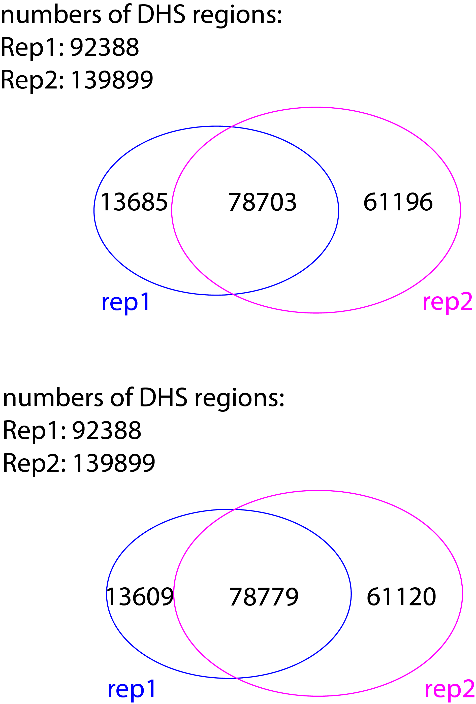 
```

The above venn plot is showing the intersected regions while intersecting rep1 vs. rep2 (count the original entry in rep1 for each overlap); the below venn plot is showing the intersected regions while intersecting rep2 vs. rep1 (count the original entry in rep2 for each overlap). \

**bw plot** \
```{r engine='bash',  class.source = "revision", eval=F, echo=TRUE}
# rep1 peak (overlapped with rep2)
module load bedtools
intersectBed -wa -a MCF7DHS_Rep1_161bp_without_motifs_123456_78_with_intensity.bed -b MCF7DHS_Rep2_161bp_without_motifs_123456_78_with_intensity.bed > overlap_rep1.bed 
# rep1 peak (non-overlapped with rep2)
intersectBed -v -wa -a MCF7DHS_Rep1_161bp_without_motifs_123456_78_with_intensity.bed -b MCF7DHS_Rep2_161bp_without_motifs_123456_78_with_intensity.bed > non_overlap_rep1.bed 


# rep2 peak (overlapped with rep1)
intersectBed -wa -a MCF7DHS_Rep2_161bp_without_motifs_123456_78_with_intensity.bed -b MCF7DHS_Rep1_161bp_without_motifs_123456_78_with_intensity.bed > overlap_rep2.bed 
# rep2 peak (non-overlapped with rep1)
intersectBed -v -wa -a MCF7DHS_Rep2_161bp_without_motifs_123456_78_with_intensity.bed -b MCF7DHS_Rep1_161bp_without_motifs_123456_78_with_intensity.bed > non_overlap_rep2.bed 

```


```{r engine='R',  class.source = "revision", eval=TRUE, echo=TRUE}
library(lattice)
library(latticeExtra)
bw.df = data.frame(matrix(nrow = 0, ncol = 5))     
for (DHS.peak in Sys.glob(file.path("./*overlap_rep*.bed"))) {
    print(DHS.peak)
    status=strsplit(strsplit(DHS.peak, "/")[[1]][2], ".bed")[[1]]
    print(status)
    temp = cbind(read.table(DHS.peak,header=F, comment.char=''), status)
    bw.df = rbind(bw.df, temp)
}
colnames(bw.df) = c("V1","V2","v3", "intensity", "status")
bw.df$status = factor(bw.df$status, levels = c("non_overlap_rep1", "overlap_rep1", "overlap_rep2", "non_overlap_rep2"))
str(bw.df)
unique(bw.df$status)

bw.df$rep <- apply(bw.df, 1, function(row) sub(".*_(rep\\d+)", "\\1", row["status"]))
unique(bw.df$rep)
bw.df$supp <- apply(bw.df, 1, function(row) sub("^(.*)_rep\\d+$", "\\1", row["status"]))

# Create a bw plot using lattice
bwplot(intensity ~ supp | rep, 
       data = bw.df, 
       ylim=c(-50,400),
       do.out=FALSE,
       main = "DHS regions (complete) intensity")
```
If we only take intersection of rep1 and rep2 DHS regions, we know that the majority in the intersection has higher intensity compared to the disgarded regions (non-overlapped). \

**closestBed** \

```{r engine='bash',  class.source = "revision", eval=F, echo=TRUE}
#cd /home/FCAM/ssun/GATA3_ChIP_PRO_July2023/ChIP_final/GAT_3mer_analaysis/ENCODE_DHS_GSE29692
# "full DHS control"
head -5 MCF7DHS_Rep1_161bp_without_motifs_123456_78.bed  #92388 
#chr1	267964	268125
#chr1	586055	586216
#chr1	629895	630056
#chr1	630155	630316
#chr1	630475	630636
head -5 MCF7DHS_Rep2_161bp_without_motifs_123456_78.bed  #139899 
#chr1	10175	10336
#chr1	16155	16316
#chr1	267904	268065
#chr1	586055	586216
#chr1	630175	630336


# "independent DHS control"
head -5 MCF7DHS_Rep1_161bp_noGATA_without_motifs_123456_78.bed  #69119 
#chr1	267964	268125
#chr1	586055	586216
#chr1	629895	630056
#chr1	630155	630316
#chr1	630475	630636
head -5 MCF7DHS_Rep2_161bp_noGATA_without_motifs_123456_78.bed  #113774
#chr1	10175	10336
#chr1	16155	16316
#chr1	267904	268065
#chr1	586055	586216
#chr1	630175	630336

# consensus DHS control-full
module load bedtools
intersectBed -a MCF7DHS_Rep1_161bp_without_motifs_123456_78.bed -b MCF7DHS_Rep2_161bp_without_motifs_123456_78.bed > MCF7DHS_consensus_without_motifs_123456_78.bed

wc -l MCF7DHS_consensus_without_motifs_123456_78.bed #78858
head -5 MCF7DHS_consensus_without_motifs_123456_78.bed
#chr1	267964	268065
#chr1	586055	586216
#chr1	630175	630316
#chr1	630475	630636
#chr1	631375	631536

# consensus DHS control-indep
intersectBed -a MCF7DHS_Rep1_161bp_noGATA_without_motifs_123456_78.bed -b MCF7DHS_Rep2_161bp_noGATA_without_motifs_123456_78.bed > MCF7DHS_consensus_noGATA_without_motifs_123456_78.bed

wc -l MCF7DHS_consensus_noGATA_without_motifs_123456_78.bed #57906
head -5 MCF7DHS_consensus_noGATA_without_motifs_123456_78.bed
#chr1	267964	268065
#chr1	586055	586216
#chr1	630175	630316
#chr1	630475	630636
#chr1	631375	631536
```

```{r engine='R',  class.source = "revision", eval=F, echo=TRUE}
full.DHS.control.consensus=center.bed(read.table("../ENCODE_DHS_GSE29692/MCF7DHS_consensus_without_motifs_123456_78.bed", header=FALSE), upstreamWindow = 0, downstreamWindow = 0)
nrow(full.DHS.control.consensus)
#[1] 78858
head(full.DHS.control.consensus)
#    V1     V2     V3
#1 chr1 268014 268015
#2 chr1 586135 586136
#3 chr1 630245 630246
#4 chr1 630555 630556
#5 chr1 631455 631456
#6 chr1 631745 631746


indep.DHS.control.consensus=center.bed(read.table("../ENCODE_DHS_GSE29692/MCF7DHS_consensus_noGATA_without_motifs_123456_78.bed", header=FALSE), upstreamWindow = 0, downstreamWindow = 0)
nrow(indep.DHS.control.consensus)
#[1] 57906
head(indep.DHS.control.consensus)
#    V1     V2     V3
#1 chr1 268014 268015
#2 chr1 586135 586136
#3 chr1 630245 630246
#4 chr1 630555 630556
#5 chr1 631455 631456
#6 chr1 631745 631746


closest.1stGAT.to.full.DHS.control.consensus=bedTools.closest(bed1 = full.DHS.control.consensus[,1:3], bed2 = all.GAT.file, opt.string = '-d -t first')
closest.1stGAT.to.indep.DHS.control.consensus=bedTools.closest(bed1 = indep.DHS.control.consensus[,1:3], bed2 = all.GAT.file, opt.string = '-d -t first')


write.table(closest.1stGAT.to.full.DHS.control.consensus,file= 'closest.1stGAT.to.full.DHS.control.consensus.bed', quote=F,sep="\t",col.names=F,row.names=F)
write.table(closest.1stGAT.to.indep.DHS.control.consensus,file= 'closest.1stGAT.to.indep.DHS.control.consensus.bed', quote=F,sep="\t",col.names=F,row.names=F)


save.image('240118_GATA3_ChIP_clsestbed4.Rdata') 
```


### positive controls

load files contains the 4 positive controls (GATA3 peak set with enriched GATA3-like motif of known structures). \

GATA3_peak_161win_with_motif_1.bed \
GATA3_peak_161win_with_motif_2.bed \
GATA3_peak_161win_with_motif_4.bed \
GATA3_peak_161win_with_motif_5.bed \
GATA3_peak_161win_with_motif_6.bed \

```{r engine='R', eval=F, echo=TRUE}
# positive control
library(bigWig)
pos.control.peak.with1=center.bed(read.table("../MAST_positive_control/GATA3_peak_161win_with_motif_1.bed", header=FALSE), upstreamWindow = 0, downstreamWindow = 0)
nrow(pos.control.peak.with1)
#[1] 12470
head(pos.control.peak.with1)
#     V1        V2        V3                    V4
#1 chr10 100072672 100072673  GATA_ChIP_peak_10714
#2 chr10 100522507 100522508  GATA_ChIP_peak_10733
#3 chr10 101380202 101380203 GATA_ChIP_peak_10758b
#4 chr10 101453916 101453917 GATA_ChIP_peak_10760b
#5 chr10 101892965 101892966  GATA_ChIP_peak_10774
#6 chr10 101893971 101893972  GATA_ChIP_peak_10775

pos.control.peak.with2=center.bed(read.table("../MAST_positive_control/GATA3_peak_161win_with_motif_2.bed", header=FALSE), upstreamWindow = 0, downstreamWindow = 0)
nrow(pos.control.peak.with2)
#[1] 11475
head(pos.control.peak.with2)
#     V1        V2        V3                    V4
#1 chr10 100301315 100301316  GATA_ChIP_peak_10723
#2 chr10 100742575 100742576  GATA_ChIP_peak_10737
#3 chr10 100857109 100857110  GATA_ChIP_peak_10738
#4 chr10 101033102 101033103  GATA_ChIP_peak_10745
#5 chr10 101310830 101310831  GATA_ChIP_peak_10754
#6 chr10 101379643 101379644 GATA_ChIP_peak_10758a

pos.control.peak.with4=center.bed(read.table("../MAST_positive_control/GATA3_peak_161win_with_motif_4.bed", header=FALSE), upstreamWindow = 0, downstreamWindow = 0)
nrow(pos.control.peak.with4)
#[1] 6505
head(pos.control.peak.with4)
#     V1        V2        V3                    V4
#1 chr10 101454261 101454262 GATA_ChIP_peak_10760c
#2 chr10 101703137 101703138 GATA_ChIP_peak_10768a
#3 chr10 101716956 101716957  GATA_ChIP_peak_10770
#4 chr10 102509735 102509736 GATA_ChIP_peak_10791b
#5 chr10   1025947   1025948   GATA_ChIP_peak_7503
#6 chr10 102714743 102714744  GATA_ChIP_peak_10801

pos.control.peak.with5=center.bed(read.table("../MAST_positive_control/GATA3_peak_161win_with_motif_5.bed", header=FALSE), upstreamWindow = 0, downstreamWindow = 0)
nrow(pos.control.peak.with5)
#[1] 4167
head(pos.control.peak.with5)
#     V1        V2        V3                    V4
#1 chr10 100139150 100139151  GATA_ChIP_peak_10715
#2 chr10 100374144 100374145 GATA_ChIP_peak_10727b
#3 chr10 100413309 100413310  GATA_ChIP_peak_10729
#4 chr10 101355474 101355475  GATA_ChIP_peak_10756
#5 chr10 101402206 101402207  GATA_ChIP_peak_10759
#6 chr10 102999635 102999636  GATA_ChIP_peak_10814

pos.control.peak.with6=center.bed(read.table("../MAST_positive_control/GATA3_peak_161win_with_motif_6.bed", header=FALSE), upstreamWindow = 0, downstreamWindow = 0)
nrow(pos.control.peak.with6)
#[1] 5363
head(pos.control.peak.with6)
#     V1        V2        V3                    V4
#1 chr10 100015134 100015135  GATA_ChIP_peak_10709
#2 chr10 101986897 101986898  GATA_ChIP_peak_10777
#3 chr10 103188065 103188066 GATA_ChIP_peak_10826b
#4 chr10 103931803 103931804  GATA_ChIP_peak_10852
#5 chr10 103979924 103979925 GATA_ChIP_peak_10857b
#6 chr10 104499153 104499154  GATA_ChIP_peak_10887
```

```{r engine='R', eval=F, echo=TRUE}
closest.1stGAT.to.pos.control.motif1=bedTools.closest(bed1 = pos.control.peak.with1[,1:3], bed2 = all.GAT.file, opt.string = '-d -t first')
closest.1stGAT.to.pos.control.motif2=bedTools.closest(bed1 = pos.control.peak.with2[,1:3], bed2 = all.GAT.file, opt.string = '-d -t first')
closest.1stGAT.to.pos.control.motif4=bedTools.closest(bed1 = pos.control.peak.with4[,1:3], bed2 = all.GAT.file, opt.string = '-d -t first')
closest.1stGAT.to.pos.control.motif5=bedTools.closest(bed1 = pos.control.peak.with5[,1:3], bed2 = all.GAT.file, opt.string = '-d -t first')
closest.1stGAT.to.pos.control.motif6=bedTools.closest(bed1 = pos.control.peak.with6[,1:3], bed2 = all.GAT.file, opt.string = '-d -t first')

write.table(closest.1stGAT.to.pos.control.motif1,file= 'closest.1stGAT.to.pos.control.motif1.bed', quote=F,sep="\t",col.names=F,row.names=F)
write.table(closest.1stGAT.to.pos.control.motif2,file= 'closest.1stGAT.to.pos.control.motif2.bed', quote=F,sep="\t",col.names=F,row.names=F)
write.table(closest.1stGAT.to.pos.control.motif4,file= 'closest.1stGAT.to.pos.control.motif4.bed', quote=F,sep="\t",col.names=F,row.names=F)
write.table(closest.1stGAT.to.pos.control.motif5,file= 'closest.1stGAT.to.pos.control.motif5.bed', quote=F,sep="\t",col.names=F,row.names=F)
write.table(closest.1stGAT.to.pos.control.motif6,file= 'closest.1stGAT.to.pos.control.motif6.bed', quote=F,sep="\t",col.names=F,row.names=F)

save.image('240116_GATA3_ChIP_clsestbed3.Rdata') 
```

<span class="highlighted">An alternative positive control could be closest GAT distance to all peaks that contains GATA3-like motifs found by MEME/STREME. Load files contains all peak with GATA3-like motifs (1 to 8): </span> \

```{r engine='bash',  class.source = "revision", eval=F, echo=TRUE}
cd /home/FCAM/ssun/GATA3_ChIP_PRO_July2023/ChIP_final/Exhaustive_MEME_MAST_round1to8/
ls with_motifs_*mast.bed
head -5 with_motifs_1_101bp_mast.bed
#chr1	1080506	1080607	GATA_ChIP_peak_45	6.37157	chr1	1080566	1080576	840.25	9.55e-05	+	1
#chr1	1238187	1238288	GATA_ChIP_peak_51	16.8938	chr1	1238219	1238229	1413	9.62e-06	-	1
#chr1	1686381	1686482	GATA_ChIP_peak_63	35.0463	chr1	1686405	1686415	1176	3.73e-05	-	1
#chr1	1741080	1741181	GATA_ChIP_peak_68	11.6965	chr1	1741170	1741180	1176	3.73e-05	-	1
#chr1	2001971	2002072	GATA_ChIP_peak_77	7.79887	chr1	2002016	2002026	1176	3.73e-05	+	1
```

with_motifs_1_101bp_mast.bed  with_motifs_5_101bp_mast.bed \
with_motifs_1_161bp_mast.bed  with_motifs_5_161bp_mast.bed \
with_motifs_2_101bp_mast.bed  with_motifs_6_101bp_mast.bed \
with_motifs_2_161bp_mast.bed  with_motifs_6_161bp_mast.bed \
with_motifs_3_101bp_mast.bed  with_motifs_7_101bp_mast.bed \
with_motifs_3_161bp_mast.bed  with_motifs_7_161bp_mast.bed \
with_motifs_4_101bp_mast.bed  with_motifs_8_101bp_mast.bed \
with_motifs_4_161bp_mast.bed \

```{r engine='R',  class.source = "revision", eval=F, echo=TRUE}
# positive control-all
library(bigWig)
pos.control.peak.with.all=data.frame()
for (mast.bed in Sys.glob(file.path("/home/FCAM/ssun/GATA3_ChIP_PRO_July2023/ChIP_final/Exhaustive_MEME_MAST_round1to8/", paste("with_motifs_", "*mast.bed", sep ='')))) {
        temp=read.table(mast.bed, header=FALSE)[, 1:5] #only take peak regions
        uniq.peak=temp[!duplicated(temp$V4), ] # make sure that the peak regions are unique
        uniq.peak.center=center.bed(uniq.peak, upstreamWindow = 0, downstreamWindow = 0) #take the summit
        pos.control.peak.with.all=rbind(pos.control.peak.with.all, uniq.peak.center)
    }


nrow(pos.control.peak.with.all)
#[1] 59560
head(pos.control.peak.with.all)
#    V1      V2      V3                V4        V5
#1 chr1 1080556 1080557 GATA_ChIP_peak_45   6.37157
#2 chr1 1238237 1238238 GATA_ChIP_peak_51  16.89380
#3 chr1 1686431 1686432 GATA_ChIP_peak_63  35.04630
#4 chr1 1741130 1741131 GATA_ChIP_peak_68  11.69650
#5 chr1 2002021 2002022 GATA_ChIP_peak_77   7.79887
#6 chr1 3127377 3127378 GATA_ChIP_peak_85 501.39400

closest.1stGAT.to.pos.control.motif.all=bedTools.closest(bed1 = pos.control.peak.with.all[,1:3], bed2 = all.GAT.file, opt.string = '-d -t first')

write.table(closest.1stGAT.to.pos.control.motif.all,file= 'closest.1stGAT.to.pos.control.motif.all.bed', quote=F,sep="\t",col.names=F,row.names=F)


save.image('240118_GATA3_ChIP_clsestbed5.Rdata') 
```


### CDFs

We are generating a cumulative distribution function to assess the proximity of a 3mer GAT to the summit of GATA3 ChIP peaks, potentially utilizing 3mer GAT as a binding sequence, across five quantile files. This evaluation aims to determine if the 3mer GAT sequences are closer to the summit of GATA3 ChIP peaks than they are to the summit of the MCF7 DHS regions, which consist of four files. Additionally, we possess four positive control peaks containing GATA3 motifs with known structures. \


#### prepare plotting data frame

In previous analysis, we have used `closestBed` to find the closest GAT to peak summit (5 quantile peak sets, 4 MCF7 DHS negative control, and 4 positive controls). \

**GATA3 peaks** \
closest.1stGAT.to.GATA.peak.quantile0.2.bed \
closest.1stGAT.to.GATA.peak.quantile0.4.bed \
closest.1stGAT.to.GATA.peak.quantile0.6.bed \
closest.1stGAT.to.GATA.peak.quantile0.8.bed \
closest.1stGAT.to.GATA.peak.quantile1.bed \

These files saved info of 1st closest GAT to GATA3 peak summits. These GATA3 peaks are peaks without MEME/MOTIF found motifs and have ranked by peak intensity. \

Notice that V1 to V3 are peak summit coordinates, V4 to V9 are `closestBed` reported **closest motif** to each peak summit. The last column (V11) is the distance from closest motif to peak summit. \
```{r engine='R', eval=TRUE, echo=TRUE}
closest.1stGAT.to.GATA.peak.quantile1=read.table('closest.1stGAT.to.GATA.peak.quantile1.bed',header=F, comment.char='')
head(closest.1stGAT.to.GATA.peak.quantile1)
closest.1stGAT.to.GATA.peak.quantile0.8=read.table('closest.1stGAT.to.GATA.peak.quantile0.8.bed',header=F, comment.char='')
head(closest.1stGAT.to.GATA.peak.quantile0.8)
closest.1stGAT.to.GATA.peak.quantile0.6=read.table('closest.1stGAT.to.GATA.peak.quantile0.6.bed',header=F, comment.char='')
head(closest.1stGAT.to.GATA.peak.quantile0.6)
closest.1stGAT.to.GATA.peak.quantile0.4=read.table('closest.1stGAT.to.GATA.peak.quantile0.4.bed',header=F, comment.char='')
head(closest.1stGAT.to.GATA.peak.quantile0.4)
closest.1stGAT.to.GATA.peak.quantile0.2=read.table('closest.1stGAT.to.GATA.peak.quantile0.2.bed',header=F, comment.char='')
head(closest.1stGAT.to.GATA.peak.quantile0.2)
```

<span class="highlighted">**negative control**</span> \
<span class="highlighted">closest.1stGAT.to.full.DHS.control.consensus.bed</span> \
<span class="highlighted">closest.1stGAT.to.indep.DHS.control.consensus.bed</span> \

```{r engine='R', class.source = "revision", eval=TRUE, echo=TRUE}
closest.1stGAT.to.full.DHS.control.consensus=read.table('closest.1stGAT.to.full.DHS.control.consensus.bed',header=F, comment.char='')
closest.1stGAT.to.indep.DHS.control.consensus=read.table('closest.1stGAT.to.indep.DHS.control.consensus.bed',header=F, comment.char='')


head(closest.1stGAT.to.full.DHS.control.consensus)
nrow(closest.1stGAT.to.full.DHS.control.consensus)
nrow(closest.1stGAT.to.full.DHS.control.consensus[closest.1stGAT.to.full.DHS.control.consensus$V9=="+",])
nrow(closest.1stGAT.to.full.DHS.control.consensus[closest.1stGAT.to.full.DHS.control.consensus$V9=="-",])

head(closest.1stGAT.to.indep.DHS.control.consensus)
nrow(closest.1stGAT.to.indep.DHS.control.consensus)
nrow(closest.1stGAT.to.indep.DHS.control.consensus[closest.1stGAT.to.indep.DHS.control.consensus$V9=="+",])
nrow(closest.1stGAT.to.indep.DHS.control.consensus[closest.1stGAT.to.indep.DHS.control.consensus$V9=="-",])
```

<span class="highlighted">**positive control**</span> \

<!--
closest.1stGAT.to.pos.control.motif1.bed \
closest.1stGAT.to.pos.control.motif2.bed \
closest.1stGAT.to.pos.control.motif4.bed \
closest.1stGAT.to.pos.control.motif5.bed \
closest.1stGAT.to.pos.control.motif6.bed \


```{r engine='R', eval=F, echo=TRUE}
closest.1stGAT.to.pos.control.motif1=read.table('closest.1stGAT.to.pos.control.motif1.bed',header=F, comment.char='')
closest.1stGAT.to.pos.control.motif2=read.table('closest.1stGAT.to.pos.control.motif2.bed',header=F, comment.char='')
closest.1stGAT.to.pos.control.motif4=read.table('closest.1stGAT.to.pos.control.motif4.bed',header=F, comment.char='')
closest.1stGAT.to.pos.control.motif5=read.table('closest.1stGAT.to.pos.control.motif5.bed',header=F, comment.char='')
closest.1stGAT.to.pos.control.motif6=read.table('closest.1stGAT.to.pos.control.motif6.bed',header=F, comment.char='')

head(closest.1stGAT.to.pos.control.motif1)
nrow(closest.1stGAT.to.pos.control.motif1)
nrow(closest.1stGAT.to.pos.control.motif1[closest.1stGAT.to.pos.control.motif1$V9=="+",])
nrow(closest.1stGAT.to.pos.control.motif1[closest.1stGAT.to.pos.control.motif1$V9=="-",])

nrow(closest.1stGAT.to.pos.control.motif2)
nrow(closest.1stGAT.to.pos.control.motif4)
nrow(closest.1stGAT.to.pos.control.motif5)
nrow(closest.1stGAT.to.pos.control.motif6)
```

-->

<span class="highlighted">While plotting the closest GAT to peak summit, we can use all peaks that contains GATA3-like motifs (found by MEME/STREME) as the positive control. Thus the latter CDF plot will only show one trace of pos control which will make the plot more concise:</span> \
```{r engine='R', class.source = "revision", eval=TRUE, echo=TRUE}
closest.1stGAT.to.pos.control.motif.all=read.table('closest.1stGAT.to.pos.control.motif.all.bed',header=F, comment.char='')


head(closest.1stGAT.to.pos.control.motif.all)
nrow(closest.1stGAT.to.pos.control.motif.all)
nrow(closest.1stGAT.to.pos.control.motif.all[closest.1stGAT.to.pos.control.motif.all$V9=="+",])
nrow(closest.1stGAT.to.pos.control.motif.all[closest.1stGAT.to.pos.control.motif.all$V9=="-",])
```

#### combine data 

GATA3 peak info + distance + status. \

```{r engine='R', class.source = "revision", eval=TRUE, echo=TRUE}
df.chip = data.frame(matrix(nrow = 0, ncol = 5))     
colnames(df.chip) = c("V1","V2","v3", "dis", "status")
for (chip.peak in Sys.glob(file.path("./closest.1stGAT.to.GATA.peak.quantile*.bed"))) {
    print(chip.peak)
    quantile.name =strsplit((strsplit(strsplit(chip.peak, "/")[[1]][length(strsplit(chip.peak, "/")[[1]])], 'closest.1stGAT.to.GATA.peak.')[[1]][2]), ".bed")[[1]][1]
    print(quantile.name)
    all.distance = cbind(read.table(chip.peak,header=F, comment.char='')[,c(1:3, 11)], quantile.name)
    df.chip = rbind(df.chip, all.distance)
}
str(df.chip)
unique(df.chip$quantile.name)
colnames(df.chip) = c("V1","V2","V3", "dis", "status")
head(df.chip)
```

negative control info + distance +status. \
```{r engine='R', class.source = "revision", eval=TRUE, echo=TRUE}
df.neg.consensus = data.frame(matrix(nrow = 0, ncol = 5))     
colnames(df.neg.consensus) = c("V1","V2","v3", "dis", "status")
for (chip.peak in Sys.glob(file.path("./closest.1stGAT.to.*DHS.control.consensus.bed"))) {
    print(chip.peak)
    rep.name =strsplit((strsplit(strsplit(chip.peak, "/")[[1]][length(strsplit(chip.peak, "/")[[1]])], 'closest.1stGAT.to.')[[1]][2]), ".consensus.bed")[[1]][1]
    print(rep.name)
    all.distance = cbind(read.table(chip.peak,header=F, comment.char='')[,c(1:3, 11)], rep.name)
    df.neg.consensus = rbind(df.neg.consensus, all.distance)
}
str(df.neg.consensus)
unique(df.neg.consensus$rep.name)
colnames(df.neg.consensus) = c("V1","V2","V3", "dis", "status")
head(df.neg.consensus)
```
positive control info + distance +status. \

```{r engine='R', class.source = "revision", eval=TRUE, echo=TRUE}
df.pos=read.table('closest.1stGAT.to.pos.control.motif.all.bed',header=F, comment.char='')[,c(1:3, 11)]
df.pos$status="pos.control.motif.all"
colnames(df.pos) = c("V1","V2","V3", "dis", "status")
str(df.pos)
unique(df.pos$status)
head(df.pos)
```

<!--
```{r engine='R', eval=F, echo=TRUE}
df.pos = data.frame(matrix(nrow = 0, ncol = 5))     
colnames(df.pos) = c("V1","V2","v3", "dis", "status")
for (chip.peak in Sys.glob(file.path("./closest.1stGAT.to.pos.control*.bed"))) {
    print(chip.peak)
    rep.name =strsplit((strsplit(strsplit(chip.peak, "/")[[1]][length(strsplit(chip.peak, "/")[[1]])], 'closest.1stGAT.to.')[[1]][2]), ".bed")[[1]][1]
    print(rep.name)
    all.distance = cbind(read.table(chip.peak,header=F, comment.char='')[,c(1:3, 11)],  rep.name) 
    df.pos = rbind(df.pos, all.distance)
}
str(df.pos)
colnames(df.pos) = c("V1","V2","V3", "dis", "status")
unique(df.pos$status)
head(df.pos)
```
-->

**merge files**. \
```{r engine='R', eval=TRUE, class.source = "revision", echo=TRUE}
df.all=rbind(df.chip, df.neg.consensus, df.pos)
unique(df.all$status)
df.all$status = factor(df.all$status, levels = c("quantile0.2", "quantile0.4", "quantile0.6", "quantile0.8", "quantile1", "full.DHS.control", "indep.DHS.control", "pos.control.motif.all"))
head(df.all)
nrow(df.all)
```

### CDF plot - single figure

**all in one plot** \
```{r engine='R',  class.source = "revision", eval=TRUE, echo=TRUE}
library(lattice)
library(latticeExtra)

ecdfplot(~log(abs(dis), base = 10), groups = status, data = df.all,
         auto.key = list(space = "right", lines=TRUE, points=FALSE, cex = 1),
         col=c(colorRampPalette(c("pink","red"))(4), "#ce228e", "grey","grey30", "green"),
         aspect = 1,
        #xlim = c(0, 50000),
         scales=list(relation="free",alternating=c(1,1,1,1)),
         ylab = 'Cumulative Distribution Function',
         xlab = expression('log'[10]~'3mer-GAT Distance from peak summit'),
                                        #index.cond = list(c(2,1)),
         between=list(y=1.0),
         type = 'a',
         xlim = c(0,2.5),
         lwd=2,
         lty=c(1),
         par.settings = list(superpose.line = list(col=c(colorRampPalette(c("pink","red"))(4), "#ce228e", "grey","grey30", "green"), lwd=3), strip.background=list(col="grey85"))
         #panel = function(...) {
         #    panel.abline(v= 1.255, lty =2) #log10(17)=1.23 #log10(17)=1.255
         #    panel.ecdfplot(...)
         #}
)
    
```

<span class="highlighted">The above cumulative distribution function (PDF) plot is showing the distance between 3mer-GAT to the summit of GATA3 ChIP peak (red), or summit of the ctrl peak set (grey: MCF7 DHS regions; green: positive control).</span> \

<span class="highlighted">For positive control (green) vs. negative control (grey), positive control shows a significant left shift which indicates that GAT is found significantly closer to GATA3 peaks with MEME/STREME found GATA3-like motifs.</span> \
<span class="highlighted">For GATA3 peaks without MEME/STREME found GATA3-like motifs (5 red traces), they also show leftward shift compared to negative controls (grey). Notice that peaks with higher intensity also shows greater left-shift.</span> \

### CDF plot - negative control (consensus)
```{r engine='R',  class.source = "revision", eval=TRUE, echo=TRUE}
ecdfplot(~log(abs(dis), base = 10), groups = status, data = df.neg.consensus,
         auto.key = list(space = "right", lines=TRUE, points=FALSE, cex = 1),
         col=c("grey","grey30"),
         aspect = 1,
        #xlim = c(0, 50000),
         scales=list(relation="free",alternating=c(1,1,1,1)),
         ylab = 'Cumulative Distribution Function',
         xlab = expression('log'[10]~'3mer-GAT Distance from peak summit'),
                                        #index.cond = list(c(2,1)),
         between=list(y=1.0),
         type = 'a',
         xlim = c(0,2.5),
         lwd=2,
         lty=c(1),
         par.settings = list(superpose.line = list(col=c("grey","grey30"), lwd=3), strip.background=list(col="grey85"))
         #panel = function(...) {
         #    panel.abline(v= , lty =2) 
         #    panel.ecdfplot(...)
         #}
)
    
```

```{r engine='R', class.source = "revision", eval=TRUE, echo=TRUE}
# Specify categories 
match = ecdf(abs(df.neg.consensus$dis)[df.neg.consensus$status == 'indep.DHS.control'])
rep = ecdf(abs(df.neg.consensus$dis)[df.neg.consensus$status == 'full.DHS.control'])
match.y = seq(0, 1450, by=1) # creating indices
rep.y = seq(0, 1450, by=1)

spl = smooth.spline(rep.y, rep(rep.y) - match(match.y))
pred = predict(spl)
pred1 = predict(spl, deriv=1)

print('The distance that CDFs are parallel or converge:')
print(rep.y[min(which(pred1$y<=0)) - 1])

# Plot graph depicting the distance determination
plot(rep.y, rep(rep.y) - match(match.y),
     xlim = c(0,60),
     cex=0.7,
     xlab = 'Distance indices (abs) between closest 3mer-GAT to peak summit (bp)',
     ylab =  'full.DHS.control CDF - indep.DHS.control CDF')
     abline(v = rep.y[min(which(pred1$y<=0)) - 1], col =2, lty =2)
      lines(pred[[1]], pred[[2]], col = 'blue')
      
# this is the same plot as above but with a longer x-axis limit
plot(rep.y, rep(rep.y) - match(match.y),
     xlim = c(0,300),
     cex=0.7,
     xlab = 'Distance indices (abs) between closest 3mer-GAT to peak summit (bp)',
     ylab = 'full.DHS.control CDF - indep.DHS.control CDF')
     abline(v = rep.y[min(which(pred1$y<=0)) - 1], col =2, lty =2)
      lines(pred[[1]], pred[[2]], col = 'blue')
```

### CDF plot - positive control vs. negative control

```{r engine='R',  class.source = "revision", eval=TRUE, echo=TRUE}
df1= rbind(df.neg.consensus, df.pos)
df1$status = factor(df1$status, levels = c("full.DHS.control", "indep.DHS.control", "pos.control.motif.all"))
ecdfplot(~log(abs(dis), base = 10), groups = status, data = df1,
         auto.key = list(space = "right", lines=TRUE, points=FALSE, cex = 1),
         col=c("grey","grey30", "green"),
         aspect = 1,
        #xlim = c(0, 50000),
         scales=list(relation="free",alternating=c(1,1,1,1)),
         ylab = 'Cumulative Distribution Function',
         xlab = expression('log'[10]~'3mer-GAT Distance from peak summit'),
                                        #index.cond = list(c(2,1)),
         between=list(y=1.0),
         type = 'a',
         xlim = c(0,2.5),
         lwd=2,
         lty=c(1),
         par.settings = list(superpose.line = list(col=c("grey","grey30", "green"), lwd=3), strip.background=list(col="grey85")),
         panel = function(...) {
             panel.abline(v= 1.204, lty =2) #log10(16)=1.204
             panel.ecdfplot(...)
         }
)
    
```


A coherence check on the positive control vs. the two negative controls. We can observe a remarkble left-shift in the cdf plot, indicates that GAT is closer to peak summit in GATA3 peaks. \

**pos vs. full.neg** \
```{r engine='R', class.source = "revision", eval=TRUE, echo=TRUE}
# Specify categories 
match = ecdf(abs(df1$dis)[df1$status == 'full.DHS.control'])
rep = ecdf(abs(df1$dis)[df1$status == 'pos.control.motif.all'])
match.y = seq(0, 1400, by=1) # creating indices
rep.y = seq(0, 1400, by=1)

spl = smooth.spline(rep.y, rep(rep.y) - match(match.y))
pred = predict(spl)
pred1 = predict(spl, deriv=1)

print('The distance that CDFs are parallel or converge:')
print(rep.y[min(which(pred1$y<=0)) - 1])

# Plot graph depicting the distance determination
plot(rep.y, rep(rep.y) - match(match.y),
     xlim = c(0,60),
     cex=0.7,
     xlab = 'Distance indices (abs) between closest 3mer-GAT to peak summit (bp)',
     ylab =  'pos.control.motif.all CDF - negative ctrl(full.DHS.control) CDF')
     abline(v = rep.y[min(which(pred1$y<=0)) - 1], col =2, lty =2)
      lines(pred[[1]], pred[[2]], col = 'blue')
      
# this is the same plot as above but with a longer x-axis limit
plot(rep.y, rep(rep.y) - match(match.y),
     xlim = c(0,300),
     cex=0.7,
     xlab = 'Distance indices (abs) between closest 3mer-GAT to peak summit (bp)',
     ylab = 'pos.control.motif.all CDF - negative ctrl(full.DHS.control) CDF')
     abline(v = rep.y[min(which(pred1$y<=0)) - 1], col =2, lty =2)
      lines(pred[[1]], pred[[2]], col = 'blue')
```

**pos vs. indep.neg** \
```{r engine='R', class.source = "revision", eval=TRUE, echo=TRUE}
# Specify categories 
match = ecdf(abs(df1$dis)[df1$status == 'indep.DHS.control'])
rep = ecdf(abs(df1$dis)[df1$status == 'pos.control.motif.all'])
match.y = seq(0, 1450, by=1) # creating indices
rep.y = seq(0, 1450, by=1)

spl = smooth.spline(rep.y, rep(rep.y) - match(match.y))
pred = predict(spl)
pred1 = predict(spl, deriv=1)

print('The distance that CDFs are parallel or converge:')
print(rep.y[min(which(pred1$y<=0)) - 1])

# Plot graph depicting the distance determination
plot(rep.y, rep(rep.y) - match(match.y),
     xlim = c(0,60),
     cex=0.7,
     xlab = 'Distance indices (abs) between closest 3mer-GAT to peak summit (bp)',
     ylab =  'pos.control.motif.all CDF - negative ctrl(indep.DHS.control) CDF')
     abline(v = rep.y[min(which(pred1$y<=0)) - 1], col =2, lty =2)
      lines(pred[[1]], pred[[2]], col = 'blue')
      
# this is the same plot as above but with a longer x-axis limit
plot(rep.y, rep(rep.y) - match(match.y),
     xlim = c(0,300),
     cex=0.7,
     xlab = 'Distance indices (abs) between closest 3mer-GAT to peak summit (bp)',
     ylab = 'pos.control.motif.all CDF - negative ctrl(indep.DHS.control) CDF')
     abline(v = rep.y[min(which(pred1$y<=0)) - 1], col =2, lty =2)
      lines(pred[[1]], pred[[2]], col = 'blue')
```
<span class="highlighted">The CDF differences between positive control and negative control reach to plateau at absolute distance==16bp. This is also saying that GAT tend to be "not randomly" found within 16bp upstream/downstream window of GATA3 peak summit. Beyond 16bp window, we have less confidence saying that GAT is significantly enriched in GATA3 peaks.</span> \

### CDF plot - GATA3 quantile vs. negative control

#### empirically determine binding distance for each quantile--quantile1

We can empirically determine the distance at which the CDFs' difference between GATA3 peak set and ctrl peak set reach the plateaus (where CDF traces became parallel or converging). \

```{r engine='R', class.source = "revision", eval=TRUE, echo=TRUE}
unique(df.all$status)
```

Comparing between MCF7 DHS regions (neg control) and GATA3 peak in quantile1 to determine the converging/parallel distance cutoff at ~13bp. \


**1) quantile1 vs. "full.DHS.control"** \
```{r engine='R', class.source = "revision", eval=TRUE, echo=TRUE}
# Specify categories to compare within df.all
match = ecdf(abs(df.all$dis)[df.all$status == 'full.DHS.control'])
rep = ecdf(abs(df.all$dis)[df.all$status == 'quantile1'])
match.y = seq(0, 1400, by=1) # creating indices
rep.y = seq(0, 1400, by=1)

spl = smooth.spline(rep.y, rep(rep.y) - match(match.y))
pred = predict(spl)
pred1 = predict(spl, deriv=1)

print('The distance that CDFs are parallel or converge:')
print(rep.y[min(which(pred1$y<=0)) - 1]) 

# Plot graph depicting the distance determination
plot(rep.y, rep(rep.y) - match(match.y),
     xlim = c(0,60),
     cex=0.7,
     xlab = 'Distance indices (abs) between closest 3mer-GAT to peak summit (bp)',
     ylab = 'GATA3 peak (quantile1) CDF - negative ctrl(full.DHS.control) CDF')
     abline(v = rep.y[min(which(pred1$y<=0)) - 1], col =2, lty =2)
      lines(pred[[1]], pred[[2]], col = 'blue')
      
# this is the same plot as above but with a longer x-axis limit
plot(rep.y, rep(rep.y) - match(match.y),
     xlim = c(0,300),
     cex=0.7,
     xlab = 'Distance indices (abs) between closest 3mer-GAT to peak summit (bp)',
     ylab = 'GATA3 peak (quantile1) CDF - negative ctrl(full.DHS.control) CDF')
     abline(v = rep.y[min(which(pred1$y<=0)) - 1], col =2, lty =2)
      lines(pred[[1]], pred[[2]], col = 'blue')
```
**2) quantile1 vs. "indep.DHS.control"** \

```{r engine='R', class.source = "revision", eval=TRUE, echo=TRUE}
# Specify categories to compare within df.all
match = ecdf(abs(df.all$dis)[df.all$status == 'indep.DHS.control'])
rep = ecdf(abs(df.all$dis)[df.all$status == 'quantile1'])
match.y = seq(0, 1400, by=1) # creating indices
rep.y = seq(0, 1400, by=1)

spl = smooth.spline(rep.y, rep(rep.y) - match(match.y))
pred = predict(spl)
pred1 = predict(spl, deriv=1)

print('The distance that CDFs are parallel or converge:')
print(rep.y[min(which(pred1$y<=0)) - 1]) 

# Plot graph depicting the distance determination
plot(rep.y, rep(rep.y) - match(match.y),
     xlim = c(0,60),
     cex=0.7,
     xlab = 'Distance indices (abs) between closest 3mer-GAT to peak summit (bp)',
     ylab = 'GATA3 peak (quantile1) CDF - negative ctrl(indep.DHS.control) CDF')
     abline(v = rep.y[min(which(pred1$y<=0)) - 1], col =2, lty =2)
      lines(pred[[1]], pred[[2]], col = 'blue')
      
# this is the same plot as above but with a longer x-axis limit
plot(rep.y, rep(rep.y) - match(match.y),
     xlim = c(0,300),
     cex=0.7,
     xlab = 'Distance indices (abs) between closest 3mer-GAT to peak summit (bp)',
     ylab = 'GATA3 peak (quantile1) CDF - negative ctrl(indep.DHS.control) CDF')
     abline(v = rep.y[min(which(pred1$y<=0)) - 1], col =2, lty =2)
      lines(pred[[1]], pred[[2]], col = 'blue')
```

By plotting the difference between the CDFs of GATA3 peaks (quantile 1) and the negative control, we can pinpoint the point where these two CDF curves converge or reach a similar trajectory. \

When comparing GATA3 peaks within quantile 1 to the full.DHS.control (MCF7 cells), we observe that at a distance of 17 from the GATA3 peak summit, there are peaks exhibiting a closer resemblance to the GAT 3mer. \
A slightly larger distance cut-off (dis==18bp) was found when comparing with the indep.DHS.control. This is expected because we already know that indep neg control are more towards right compared to full neg control. \

```{r engine='R',  class.source = "revision", eval=TRUE, echo=TRUE}
library(lattice)
library(latticeExtra)

df1=rbind(df.chip[df.chip$status=="quantile1",], df.neg.consensus)
df1$status = factor(df1$status, levels = c("quantile1", "full.DHS.control", "indep.DHS.control"))


ecdfplot(~abs(dis), groups = status, data = df1,
         auto.key = list(space = "right", lines=TRUE, points=FALSE, cex = 1),
         col=c("#ce228e", "blue4","blue"),
         aspect = 1,
        #xlim = c(0, 50000),
         scales=list(relation="free",alternating=c(1,1,1,1)),
         ylab = 'Cumulative Distribution Function',
         xlab = expression('3mer-GAT Distance (absolute) from peak summit'),
                                        #index.cond = list(c(2,1)),
         between=list(y=1.0),
         type = 'a',
         xlim = c(0,60),
         lwd=2,
         lty=c(1),
         par.settings = list(superpose.line = list(col=c("#ce228e", "blue4","blue"), lwd=3), strip.background=list(col="grey85")),
         panel = function(...) {
             panel.abline(v= 18, lty =2, col="red")
             #panel.abline(v= 18, lty =2, col="grey30")
             panel.ecdfplot(...)
         })

ecdfplot(~log(abs(dis), base = 10), groups = status, data = df1,
         auto.key = list(space = "right", lines=TRUE, points=FALSE, cex = 1),
         col=c("#ce228e", "blue4","blue"),
         aspect = 1,
        #xlim = c(0, 50000),
         scales=list(relation="free",alternating=c(1,1,1,1)),
         ylab = 'Cumulative Distribution Function',
         xlab = expression('log'[10]~'3mer-GAT Distance (absolute) from peak summit'),
                                        #index.cond = list(c(2,1)),
         between=list(y=1.0),
         type = 'a',
         xlim = c(0,2.5),
         lwd=2,
         lty=c(1),
         par.settings = list(superpose.line = list(col=c("#ce228e", "blue4","blue"), lwd=3), strip.background=list(col="grey85")),
         panel = function(...) {
             panel.abline(v= 1.255, lty =2, col="red")
             #panel.abline(v= 18, lty =2, col="grey30")
             panel.ecdfplot(...)
         })
    
```

In the above CDF plot, a noticeable left-shift is evident in the closest GAT distance to GATA3 peaks within quantile 1 compared with the negative control. At the marked red dotted line positioned at distance 18, we empirically identify the point where the positive trace converge with the negative traces. \

We can determine the fraction of peaks with closest GAT (19%): \

```{r engine='R',  class.source = "revision", eval=TRUE, echo=TRUE}

frac1=sum(df.chip[df.chip$status=="quantile1",]$dis <= 17) / length(df.chip[df.chip$status=="quantile1",]$dis)
frac2=sum(df.neg.consensus[df.neg.consensus$status=="full.DHS.control",]$dis <= 17) / length(df.neg.consensus[df.neg.consensus$status=="full.DHS.control",]$dis)
frac1-frac2

frac3=sum(df.chip[df.chip$status=="quantile1",]$dis <= 18) / length(df.chip[df.chip$status=="quantile1",]$dis)
frac4=sum(df.neg.consensus[df.neg.consensus$status=="indep.DHS.control",]$dis <= 18) / length(df.neg.consensus[df.neg.consensus$status=="indep.DHS.control",]$dis)
frac3-frac4
```

Here, indep.DHS neg control serves as a good internal control for the full.DHS neg control. Since we know full.DHS contains some regions overlapped with GATA3 ChIP peaks, we would expect to see less regions been identified as regions closer to GAT (because some regions are cancelled out). The real fraction should be 19.18%. \

#### empirically determine binding distance for each quantile--quantile0.8

**1) quantile0.8 vs. "full.DHS.control":** \
```{r engine='R', class.source = "revision", eval=TRUE, echo=TRUE}
# Specify categories to compare within df.all
match = ecdf(abs(df.all$dis)[df.all$status == 'full.DHS.control'])
rep = ecdf(abs(df.all$dis)[df.all$status == 'quantile0.8'])
match.y = seq(0, 1400, by=1) # creating indices
rep.y = seq(0, 1400, by=1)

spl = smooth.spline(rep.y, rep(rep.y) - match(match.y))
pred = predict(spl)
pred1 = predict(spl, deriv=1)

print('The distance that CDFs are parallel or converge:')
print(rep.y[min(which(pred1$y<=0)) - 1])  

# Plot graph depicting the distance determination
plot(rep.y, rep(rep.y) - match(match.y),
     xlim = c(0,60),
     cex=0.7,
     xlab = 'Distance indices (abs) between closest 3mer-GAT to peak summit (bp)',
     ylab = 'GATA3 peak (quantile0.8) CDF - negative ctrl(full.DHS.control) CDF')
     abline(v = rep.y[min(which(pred1$y<=0)) - 1], col =2, lty =2)
      lines(pred[[1]], pred[[2]], col = 'blue')
      
# this is the same plot as above but with a longer x-axis limit
plot(rep.y, rep(rep.y) - match(match.y),
     xlim = c(0,300),
     cex=0.7,
     xlab = 'Distance indices (abs) between closest 3mer-GAT to peak summit (bp)',
     ylab = 'GATA3 peak (quantile0.8) CDF - negative ctrl(full.DHS.control) CDF')
     abline(v = rep.y[min(which(pred1$y<=0)) - 1], col =2, lty =2)
      lines(pred[[1]], pred[[2]], col = 'blue')
```

**2) quantile0.8 vs. "indep.DHS.control":** \
```{r engine='R', class.source = "revision", eval=TRUE, echo=TRUE}
# Specify categories to compare within df.all
match = ecdf(abs(df.all$dis)[df.all$status == 'indep.DHS.control'])
rep = ecdf(abs(df.all$dis)[df.all$status == 'quantile0.8'])
match.y = seq(0, 1400, by=1) # creating indices
rep.y = seq(0, 1400, by=1)

spl = smooth.spline(rep.y, rep(rep.y) - match(match.y))
pred = predict(spl)
pred1 = predict(spl, deriv=1)

print('The distance that CDFs are parallel or converge:')
print(rep.y[min(which(pred1$y<=0)) - 1]) 

# Plot graph depicting the distance determination
plot(rep.y, rep(rep.y) - match(match.y),
     xlim = c(0,60),
     cex=0.7,
     xlab = 'Distance indices (abs) between closest 3mer-GAT to peak summit (bp)',
     ylab = 'GATA3 peak (quantile0.8) CDF - negative ctrl(indep.DHS.control) CDF')
     abline(v = rep.y[min(which(pred1$y<=0)) - 1], col =2, lty =2)
      lines(pred[[1]], pred[[2]], col = 'blue')
      
# this is the same plot as above but with a longer x-axis limit
plot(rep.y, rep(rep.y) - match(match.y),
     xlim = c(0,300),
     cex=0.7,
     xlab = 'Distance indices (abs) between closest 3mer-GAT to peak summit (bp)',
     ylab = 'GATA3 peak (quantile0.8) CDF - negative ctrl(indep.DHS.control) CDF')
     abline(v = rep.y[min(which(pred1$y<=0)) - 1], col =2, lty =2)
      lines(pred[[1]], pred[[2]], col = 'blue')
```
When comparing GATA3 peaks within quantile 0.8 to the two DHS control (MCF7 cells), we observe that at a distance of 9 from the GATA3 peak summit, there are peaks exhibiting a closer resemblance to the GAT 3mer. \


```{r engine='R',  class.source = "revision", eval=TRUE, echo=TRUE}
library(lattice)
library(latticeExtra)

df1=rbind(df.chip[df.chip$status=="quantile0.8",], df.neg.consensus)
df1$status = factor(df1$status, levels = c("quantile0.8", "full.DHS.control", "indep.DHS.control"))


ecdfplot(~abs(dis), groups = status, data = df1,
         auto.key = list(space = "right", lines=TRUE, points=FALSE, cex = 1),
         col=c("red", "blue4","blue"),
         aspect = 1,
        #xlim = c(0, 50000),
         scales=list(relation="free",alternating=c(1,1,1,1)),
         ylab = 'Cumulative Distribution Function',
         xlab = expression('3mer-GAT Distance from peak summit'),
                                        #index.cond = list(c(2,1)),
         between=list(y=1.0),
         type = 'a',
         xlim = c(0,60),
         lwd=2,
         lty=c(1),
         par.settings = list(superpose.line = list(col=c("red", "blue4", "blue"), lwd=3), strip.background=list(col="grey85")),
         panel = function(...) {
             panel.abline(v= 9, lty =2, col="red")
             #panel.abline(v= 18, lty =2, col="grey30")
             panel.ecdfplot(...)
         })

ecdfplot(~log(abs(dis), base = 10), groups = status, data = df1,
         auto.key = list(space = "right", lines=TRUE, points=FALSE, cex = 1),
         col=c("red", "blue4","blue"),
         aspect = 1,
        #xlim = c(0, 50000),
         scales=list(relation="free",alternating=c(1,1,1,1)),
         ylab = 'Cumulative Distribution Function',
         xlab = expression('log'[10]~'3mer-GAT Distance from peak summit'),
                                        #index.cond = list(c(2,1)),
         between=list(y=1.0),
         type = 'a',
         xlim = c(0,2.5),
         lwd=2,
         lty=c(1),
         par.settings = list(superpose.line = list(col=c("red", "blue4", "blue"), lwd=3), strip.background=list(col="grey85")),
         panel = function(...) {
             panel.abline(v= 0.954, lty =2, col="red")
             #panel.abline(v= 18, lty =2, col="grey30")
             panel.ecdfplot(...)
         })

    
```

In the above CDF plot, a noticeable left-shift is evident in the closest GAT distance to GATA3 peaks within quantile 0.8 compared with the negative control. At the marked red dotted line positioned at distance 9, we empirically identify the point where the two traces align in parallel. \

We can determine the fraction of peaks with closest GAT (6.9%): \

```{r engine='R',  class.source = "revision", eval=TRUE, echo=TRUE}
frac1=sum(df.chip[df.chip$status=="quantile0.8",]$dis <= 9) / length(df.chip[df.chip$status=="quantile0.8",]$dis)
frac2=sum(df.neg.consensus[df.neg.consensus$status=="full.DHS.control",]$dis <= 9) / length(df.neg.consensus[df.neg.consensus$status=="full.DHS.control",]$dis)
frac3=sum(df.neg.consensus[df.neg.consensus$status=="indep.DHS.control",]$dis <= 9) / length(df.neg.consensus[df.neg.consensus$status=="indep.DHS.control",]$dis)
frac1-frac2
frac1-frac3
```

Very similar fraction of peak considerred to have a closer GAT. Again, it alligns with our expectations that differences between indep and GATA3 peaks will be more than full set. \


#### empirically determine binding distance for each quantile--quantile0.6

**1) quantile0.6 vs. "full.DHS.control":** \
```{r engine='R', class.source = "revision", eval=TRUE, echo=TRUE}
# Specify categories to compare within df.all
match = ecdf(abs(df.all$dis)[df.all$status == 'full.DHS.control'])
rep = ecdf(abs(df.all$dis)[df.all$status == 'quantile0.6'])
match.y = seq(0, 1400, by=1) # creating indices
rep.y = seq(0, 1400, by=1)

spl = smooth.spline(rep.y, rep(rep.y) - match(match.y))
pred = predict(spl)
pred1 = predict(spl, deriv=1)

print('The distance that CDFs are parallel or converge:')
print(rep.y[min(which(pred1$y<=0)) - 1])  

# Plot graph depicting the distance determination
plot(rep.y, rep(rep.y) - match(match.y),
     xlim = c(0,60),
     cex=0.7,
     xlab = 'Distance indices (abs) between closest 3mer-GAT to peak summit (bp)',
     ylab = 'GATA3 peak (quantile0.6) CDF - negative ctrl(full.DHS.control) CDF')
     abline(v = rep.y[min(which(pred1$y<=0)) - 1], col =2, lty =2)
      lines(pred[[1]], pred[[2]], col = 'blue')
      
# this is the same plot as above but with a longer x-axis limit
plot(rep.y, rep(rep.y) - match(match.y),
     xlim = c(0,300),
     cex=0.7,
     xlab = 'Distance indices (abs) between closest 3mer-GAT to peak summit (bp)',
     ylab = 'GATA3 peak (quantile0.6) CDF - negative ctrl(full.DHS.control) CDF')
     abline(v = rep.y[min(which(pred1$y<=0)) - 1], col =2, lty =2)
      lines(pred[[1]], pred[[2]], col = 'blue')
```

When comparing GATA3 peaks within quantile 0.6 to the full.DHS.control (MCF7 cells), we observe that at a distance of 10 from the GATA3 peak summit, there are peaks exhibiting a closer resemblance to the GAT 3mer. \

**2) quantile0.6 vs. "indep.DHS.control":** \
```{r engine='R', class.source = "revision", eval=TRUE, echo=TRUE}
# Specify categories to compare within df.all
match = ecdf(abs(df.all$dis)[df.all$status == 'indep.DHS.control'])
rep = ecdf(abs(df.all$dis)[df.all$status == 'quantile0.6'])
match.y = seq(0, 1400, by=1) # creating indices
rep.y = seq(0, 1400, by=1)

spl = smooth.spline(rep.y, rep(rep.y) - match(match.y))
pred = predict(spl)
pred1 = predict(spl, deriv=1)

print('The distance that CDFs are parallel or converge:')
print(rep.y[min(which(pred1$y<=0)) - 1]) 

# Plot graph depicting the distance determination
plot(rep.y, rep(rep.y) - match(match.y),
     xlim = c(0,60),
     cex=0.7,
     xlab = 'Distance indices (abs) between closest 3mer-GAT to peak summit (bp)',
     ylab = 'GATA3 peak (quantile0.6) CDF - negative ctrl(indep.DHS.control) CDF')
     abline(v = rep.y[min(which(pred1$y<=0)) - 1], col =2, lty =2)
      lines(pred[[1]], pred[[2]], col = 'blue')
      
# this is the same plot as above but with a longer x-axis limit
plot(rep.y, rep(rep.y) - match(match.y),
     xlim = c(0,300),
     cex=0.7,
     xlab = 'Distance indices (abs) between closest 3mer-GAT to peak summit (bp)',
     ylab = 'GATA3 peak (quantile0.6) CDF - negative ctrl(indep.DHS.control) CDF')
     abline(v = rep.y[min(which(pred1$y<=0)) - 1], col =2, lty =2)
      lines(pred[[1]], pred[[2]], col = 'blue')
```

When comparing GATA3 peaks within quantile 0.6 to the indep.DHS.control (MCF7 cells), we observe that at a distance of 10 from the GATA3 peak summit, there are peaks exhibiting a closer resemblance to the GAT 3mer. \

```{r engine='R',  class.source = "revision", eval=TRUE, echo=TRUE}
library(lattice)
library(latticeExtra)

df1=rbind(df.chip[df.chip$status=="quantile0.6",], df.neg.consensus)
df1$status = factor(df1$status, levels = c("quantile0.6", "full.DHS.control", "indep.DHS.control"))


ecdfplot(~abs(dis), groups = status, data = df1,
         auto.key = list(space = "right", lines=TRUE, points=FALSE, cex = 1),
         col=c("red", "blue4","blue"),
         aspect = 1,
        #xlim = c(0, 50000),
         scales=list(relation="free",alternating=c(1,1,1,1)),
         ylab = 'Cumulative Distribution Function',
         xlab = expression('3mer-GAT Distance from peak summit'),
                                        #index.cond = list(c(2,1)),
         between=list(y=1.0),
         type = 'a',
         xlim = c(0,60),
         lwd=2,
         lty=c(1),
         par.settings = list(superpose.line = list(col=c("red", "blue4","blue"), lwd=3), strip.background=list(col="grey85")),
         panel = function(...) {
             panel.abline(v= 10, lty =2, col="red")
             #panel.abline(v= 18, lty =2, col="grey30")
             panel.ecdfplot(...)
         })

ecdfplot(~log(abs(dis), base = 10), groups = status, data = df1,
         auto.key = list(space = "right", lines=TRUE, points=FALSE, cex = 1),
         col=c("red", "blue4","blue"),
         aspect = 1,
        #xlim = c(0, 50000),
         scales=list(relation="free",alternating=c(1,1,1,1)),
         ylab = 'Cumulative Distribution Function',
         xlab = expression('log'[10]~'3mer-GAT Distance from peak summit'),
                                        #index.cond = list(c(2,1)),
         between=list(y=1.0),
         type = 'a',
         xlim = c(0,2.5),
         lwd=2,
         lty=c(1),
         par.settings = list(superpose.line = list(col=c("red", "blue4","blue"), lwd=3), strip.background=list(col="grey85")),
         panel = function(...) {
             panel.abline(v= 1, lty =2, col="red")
             #panel.abline(v= 18, lty =2, col="grey30")
             panel.ecdfplot(...)
         })

```

In the above CDF plot, a noticeable left-shift is evident in the closest GAT distance to GATA3 peaks within quantile 0.6 compared with the negative control. At the marked red dotted line positioned at distance 10, we empirically identify the point where the two traces align in parallel. \

We can determine the fraction of peaks with closest GAT (4.9%): \

```{r engine='R',  class.source = "revision", eval=TRUE, echo=TRUE}

frac1=sum(df.chip[df.chip$status=="quantile0.6",]$dis <= 10) / length(df.chip[df.chip$status=="quantile0.6",]$dis)
frac2=sum(df.neg.consensus[df.neg.consensus$status=="full.DHS.control",]$dis <= 10) / length(df.neg.consensus[df.neg.consensus$status=="full.DHS.control",]$dis)
frac3=sum(df.neg.consensus[df.neg.consensus$status=="indep.DHS.control",]$dis <= 10) / length(df.neg.consensus[df.neg.consensus$status=="indep.DHS.control",]$dis)
frac1-frac2
frac1-frac3
```


#### empirically determine binding distance for each quantile--quantile0.4


**1) quantile0.4 vs. "full.DHS.control":** \
```{r engine='R', class.source = "revision", eval=TRUE, echo=TRUE}
# Specify categories to compare within df.all
match = ecdf(abs(df.all$dis)[df.all$status == 'full.DHS.control'])
rep = ecdf(abs(df.all$dis)[df.all$status == 'quantile0.4'])

match.y = seq(0, 1400, by=1) # creating indices
rep.y = seq(0, 1400, by=1)

spl = smooth.spline(rep.y, rep(rep.y) - match(match.y))
pred = predict(spl)
pred1 = predict(spl, deriv=1)

print('The distance that CDFs are parallel or converge:')
print(rep.y[min(which(pred1$y<=0)) - 1])  

# Plot graph depicting the distance determination
plot(rep.y, rep(rep.y) - match(match.y),
     xlim = c(0,60),
     cex=0.7,
     xlab = 'Distance indices (abs) between closest 3mer-GAT to peak summit (bp)',
     ylab = 'GATA3 peak (quantile0.4) CDF - negative ctrl(full.DHS.control) CDF')
     abline(v = rep.y[min(which(pred1$y<=0)) - 1], col =2, lty =2)
      lines(pred[[1]], pred[[2]], col = 'blue')
      
# this is the same plot as above but with a longer x-axis limit
plot(rep.y, rep(rep.y) - match(match.y),
     xlim = c(0,300),
     cex=0.7,
     xlab = 'Distance indices (abs) between closest 3mer-GAT to peak summit (bp)',
     ylab = 'GATA3 peak (quantile0.4) CDF - negative ctrl(full.DHS.control) CDF')
     abline(v = rep.y[min(which(pred1$y<=0)) - 1], col =2, lty =2)
      lines(pred[[1]], pred[[2]], col = 'blue')
```
**2) quantile0.4 vs. "indep.DHS.control":** \
```{r engine='R', class.source = "revision", eval=TRUE, echo=TRUE}
# Specify categories to compare within df.all
match = ecdf(abs(df.all$dis)[df.all$status == 'indep.DHS.control'])
rep = ecdf(abs(df.all$dis)[df.all$status == 'quantile0.4'])
match.y = seq(0, 1400, by=1) # creating indices
rep.y = seq(0, 1400, by=1)

spl = smooth.spline(rep.y, rep(rep.y) - match(match.y))
pred = predict(spl)
pred1 = predict(spl, deriv=1)

print('The distance that CDFs are parallel or converge:')
print(rep.y[min(which(pred1$y<=0)) - 1]) 

# Plot graph depicting the distance determination
plot(rep.y, rep(rep.y) - match(match.y),
     xlim = c(0,60),
     cex=0.7,
     xlab = 'Distance indices (abs) between closest 3mer-GAT to peak summit (bp)',
     ylab = 'GATA3 peak (quantile0.4) CDF - negative ctrl(indep.DHS.control) CDF')
     abline(v = rep.y[min(which(pred1$y<=0)) - 1], col =2, lty =2)
      lines(pred[[1]], pred[[2]], col = 'blue')
      
# this is the same plot as above but with a longer x-axis limit
plot(rep.y, rep(rep.y) - match(match.y),
     xlim = c(0,300),
     cex=0.7,
     xlab = 'Distance indices (abs) between closest 3mer-GAT to peak summit (bp)',
     ylab = 'GATA3 peak (quantile0.4) CDF - negative ctrl(indep.DHS.control) CDF')
     abline(v = rep.y[min(which(pred1$y<=0)) - 1], col =2, lty =2)
      lines(pred[[1]], pred[[2]], col = 'blue')
```

When comparing GATA3 peaks within quantile 0.4 to the DHS negative controls (MCF7 cells), we observe that at a distance of 5 from the GATA3 peak summit, there are peaks exhibiting a closer resemblance to the GAT 3mer. \

```{r engine='R',  class.source = "revision", eval=TRUE, echo=TRUE}
library(lattice)
library(latticeExtra)

df1=rbind(df.chip[df.chip$status=="quantile0.4",], df.neg.consensus)
df1$status = factor(df1$status, levels = c("quantile0.4", "full.DHS.control", "indep.DHS.control"))


ecdfplot(~abs(dis), groups = status, data = df1,
         auto.key = list(space = "right", lines=TRUE, points=FALSE, cex = 1),
         col=c("red", "blue4","blue"),
         aspect = 1,
        #xlim = c(0, 50000),
         scales=list(relation="free",alternating=c(1,1,1,1)),
         ylab = 'Cumulative Distribution Function',
         xlab = expression('3mer-GAT Distance from peak summit'),
                                        #index.cond = list(c(2,1)),
         between=list(y=1.0),
         type = 'a',
         xlim = c(0,60),
         lwd=2,
         lty=c(1),
         par.settings = list(superpose.line = list(col=c("red", "blue4","blue"), lwd=3), strip.background=list(col="grey85")),
         panel = function(...) {
             panel.abline(v= 5, lty =2, col="red")
             #panel.abline(v= 18, lty =2, col="grey30")
             panel.ecdfplot(...)
         })

ecdfplot(~log(abs(dis), base = 10), groups = status, data = df1,
         auto.key = list(space = "right", lines=TRUE, points=FALSE, cex = 1),
         col=c("red", "blue4","blue"),
         aspect = 1,
        #xlim = c(0, 50000),
         scales=list(relation="free",alternating=c(1,1,1,1)),
         ylab = 'Cumulative Distribution Function',
         xlab = expression('log'[10]~'3mer-GAT Distance from peak summit'),
                                        #index.cond = list(c(2,1)),
         between=list(y=1.0),
         type = 'a',
         xlim = c(0,2.5),
         lwd=2,
         lty=c(1),
         par.settings = list(superpose.line = list(col=c("red", "blue4","blue"), lwd=3), strip.background=list(col="grey85")),
         panel = function(...) {
             panel.abline(v= 0.699, lty =2, col="red")
             #panel.abline(v= 18, lty =2, col="grey30")
             panel.ecdfplot(...)
         })

```

In the above CDF plot, the left-shift is not as prominent as previous few cdf plots. At the marked red dotted line positioned at distance 4, we empirically identify the point where the two traces align in parallel. \

We can determine the fraction of peaks with closest GAT (2.5%): \

```{r engine='R',  class.source = "revision", eval=TRUE, echo=TRUE}

frac1=sum(df.chip[df.chip$status=="quantile0.4",]$dis <= 5) / length(df.chip[df.chip$status=="quantile0.4",]$dis)
frac2=sum(df.neg.consensus[df.neg.consensus$status=="full.DHS.control",]$dis <= 5) / length(df.neg.consensus[df.neg.consensus$status=="full.DHS.control",]$dis)
frac3=sum(df.neg.consensus[df.neg.consensus$status=="indep.DHS.control",]$dis <= 5) / length(df.neg.consensus[df.neg.consensus$status=="indep.DHS.control",]$dis)
frac1-frac2
frac1-frac3

```


#### empirically determine binding distance for each quantile--quantile0.2


**1) quantile0.2 vs. "full.DHS.control":** \
```{r engine='R', class.source = "revision", eval=TRUE, echo=TRUE}
# Specify categories to compare within df.all
match = ecdf(abs(df.all$dis)[df.all$status == 'full.DHS.control'])
rep = ecdf(abs(df.all$dis)[df.all$status == 'quantile0.2'])
match.y = seq(0, 1400, by=1) # creating indices
rep.y = seq(0, 1400, by=1)

spl = smooth.spline(rep.y, rep(rep.y) - match(match.y))
pred = predict(spl)
pred1 = predict(spl, deriv=1)

print('The distance that CDFs are parallel or converge:')
print(rep.y[min(which(pred1$y<=0)) - 1])  

# Plot graph depicting the distance determination
plot(rep.y, rep(rep.y) - match(match.y),
     xlim = c(0,60),
     cex=0.7,
     xlab = 'Distance indices (abs) between closest 3mer-GAT to peak summit (bp)',
     ylab = 'GATA3 peak (quantile0.2) CDF - negative ctrl(full.DHS.control) CDF')
     abline(v = rep.y[min(which(pred1$y<=0)) - 1], col =2, lty =2)
      lines(pred[[1]], pred[[2]], col = 'blue')
      
# this is the same plot as above but with a longer x-axis limit
plot(rep.y, rep(rep.y) - match(match.y),
     xlim = c(0,300),
     cex=0.7,
     xlab = 'Distance indices (abs) between closest 3mer-GAT to peak summit (bp)',
     ylab = 'GATA3 peak (quantile0.2) CDF - negative ctrl(full.DHS.control) CDF')
     abline(v = rep.y[min(which(pred1$y<=0)) - 1], col =2, lty =2)
      lines(pred[[1]], pred[[2]], col = 'blue')
```
**2) quantile0.2 vs. "indep.DHS.control":** \
```{r engine='R', class.source = "revision", eval=TRUE, echo=TRUE}
# Specify categories to compare within df.all
match = ecdf(abs(df.all$dis)[df.all$status == 'indep.DHS.control'])
rep = ecdf(abs(df.all$dis)[df.all$status == 'quantile0.2'])
match.y = seq(0, 1400, by=1) # creating indices
rep.y = seq(0, 1400, by=1)

spl = smooth.spline(rep.y, rep(rep.y) - match(match.y))
pred = predict(spl)
pred1 = predict(spl, deriv=1)

print('The distance that CDFs are parallel or converge:')
print(rep.y[min(which(pred1$y<=0)) - 1]) 

# Plot graph depicting the distance determination
plot(rep.y, rep(rep.y) - match(match.y),
     xlim = c(0,60),
     cex=0.7,
     xlab = 'Distance indices (abs) between closest 3mer-GAT to peak summit (bp)',
     ylab = 'GATA3 peak (quantile0.2) CDF - negative ctrl(indep.DHS.control) CDF')
     abline(v = rep.y[min(which(pred1$y<=0)) - 1], col =2, lty =2)
      lines(pred[[1]], pred[[2]], col = 'blue')
      
# this is the same plot as above but with a longer x-axis limit
plot(rep.y, rep(rep.y) - match(match.y),
     xlim = c(0,300),
     cex=0.7,
     xlab = 'Distance indices (abs) between closest 3mer-GAT to peak summit (bp)',
     ylab = 'GATA3 peak (quantile0.2) CDF - negative ctrl(indep.DHS.control) CDF')
     abline(v = rep.y[min(which(pred1$y<=0)) - 1], col =2, lty =2)
      lines(pred[[1]], pred[[2]], col = 'blue')
```

When comparing GATA3 peaks within quantile 0.2 to the DHS negative controls (MCF7 cells), we observe that at a distance of 8 from the GATA3 peak summit, there are peaks exhibiting a closer resemblance to the GAT 3mer. \


```{r engine='R',  class.source = "revision", eval=TRUE, echo=TRUE}
library(lattice)
library(latticeExtra)

df1=rbind(df.chip[df.chip$status=="quantile0.2",], df.neg.consensus)
df1$status = factor(df1$status, levels = c("quantile0.2", "full.DHS.control", "indep.DHS.control"))


ecdfplot(~abs(dis), groups = status, data = df1,
         auto.key = list(space = "right", lines=TRUE, points=FALSE, cex = 1),
         col=c("red", "blue4","blue"),
         aspect = 1,
        #xlim = c(0, 50000),
         scales=list(relation="free",alternating=c(1,1,1,1)),
         ylab = 'Cumulative Distribution Function',
         xlab = expression('3mer-GAT Distance from peak summit'),
                                        #index.cond = list(c(2,1)),
         between=list(y=1.0),
         type = 'a',
         xlim = c(0,60),
         lwd=2,
         lty=c(1),
         par.settings = list(superpose.line = list(col=c("red", "blue4","blue"), lwd=3), strip.background=list(col="grey85")),
         panel = function(...) {
             panel.abline(v= 8, lty =2, col="red")
             #panel.abline(v= 18, lty =2, col="grey30")
             panel.ecdfplot(...)
         })

ecdfplot(~log(abs(dis), base = 10), groups = status, data = df1,
         auto.key = list(space = "right", lines=TRUE, points=FALSE, cex = 1),
         col=c("red", "blue4","blue"),
         aspect = 1,
        #xlim = c(0, 50000),
         scales=list(relation="free",alternating=c(1,1,1,1)),
         ylab = 'Cumulative Distribution Function',
         xlab = expression('log'[10]~'3mer-GAT Distance from peak summit'),
                                        #index.cond = list(c(2,1)),
         between=list(y=1.0),
         type = 'a',
         xlim = c(0,2.5),
         lwd=2,
         lty=c(1),
         par.settings = list(superpose.line = list(col=c("red", "blue4","blue"), lwd=3), strip.background=list(col="grey85")),
         panel = function(...) {
             panel.abline(v= 0.9, lty =2, col="red")
             #panel.abline(v= 18, lty =2, col="grey30")
             panel.ecdfplot(...)
         })
```

In the above CDF plot, left-shift is not prominent. At the marked red dotted line positioned at distance 8, we empirically identify the point where the two traces align in parallel. \

We can determine the fraction of peaks with closest GAT (1.7%): \

```{r engine='R',  class.source = "revision", eval=TRUE, echo=TRUE}

frac1=sum(df.chip[df.chip$status=="quantile0.2",]$dis <= 8) / length(df.chip[df.chip$status=="quantile0.2",]$dis)
frac2=sum(df.neg.consensus[df.neg.consensus$status=="full.DHS.control",]$dis <= 8) / length(df.neg.consensus[df.neg.consensus$status=="full.DHS.control",]$dis)

frac3=sum(df.neg.consensus[df.neg.consensus$status=="indep.DHS.control",]$dis <= 8) / length(df.neg.consensus[df.neg.consensus$status=="indep.DHS.control",]$dis)
frac1-frac2
frac1-frac3
```


### barchart summary
Summarize the fraction of peaks (in each quantile) that has a closest GAT to its peak summits. \

```{r engine='R',  class.source = "revision", eval=F, echo=TRUE}
#module load R/4.1.2
#R
library(lattice)
bar=read.csv(file ="barchart_sum.csv", header = T)
str(bar)
bar$lib=factor(bar$lib, levels=c("quantile1","quantile0.8","quantile0.6","quantile0.4","quantile0.2",))

pdf('240119_fraction_of_peaks_have_closer_GAT.pdf', width=10,height=8)
my.settings <- list(
  #superpose.polygon=list(col=c(colorRampPalette(c("red","pink"))(6),colorRampPalette(c("blue","light blue"))(3), "light grey"), border="transparent"),
  superpose.polygon=list(col=c(colorRampPalette(c("pink","red"))(4), "#ce228e"), border="transparent"),
  strip.background=list(col="grey80", cex = 0.6),
  strip.border=list(col="black")
)
print(barchart(fraction ~ lib | negctrl,        
         data = bar,
         groups = lib,
         stack = TRUE,
         ylim=c(0,0.25),
         auto.key=list(space="right"),
         scales = list(x = list(rot = 45)),
         ylab = "fraction of peak set with closer GAT to summit",
         xlab = "peaks without motifs in quantiles",
         par.settings = my.settings)
)
dev.off()

png('240119_fraction_of_peaks_have_closer_GAT.png')
my.settings <- list(
  #superpose.polygon=list(col=c(colorRampPalette(c("red","pink"))(6),colorRampPalette(c("blue","light blue"))(3), "light grey"), border="transparent"),
  superpose.polygon=list(col=c(colorRampPalette(c("pink","red"))(4), "#ce228e"), border="transparent"),
  strip.background=list(col="grey80", cex = 0.6),
  strip.border=list(col="black")
)
print(barchart(fraction ~ lib | negctrl,        
         data = bar,
         groups = lib,
         stack = TRUE,
         ylim=c(0,0.25),
         auto.key=list(space="right"),
         scales = list(x = list(rot = 45)),
         ylab = "fraction of peak set with closer GAT to summit",
         xlab = "peaks without motifs in quantiles",
         par.settings = my.settings)
)
dev.off()
```

```{r  out.width = "80%", out.height="50%", echo=F, fig.align = "center", fig.cap="fraction of peaks in each quantile with closer GAT compared to 4 different negative ctrls"}
#library(knitr)
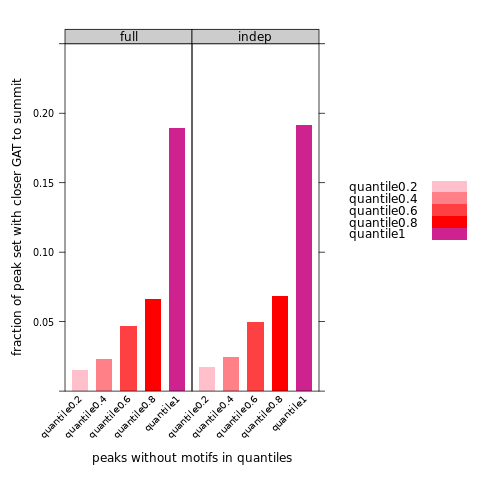 
```

```{r engine='R',  class.source = "revision", eval=F, echo=TRUE}
library(lattice)
bar=read.csv(file ="barchart_sum.csv", header = T)
str(bar)
bar$lib=factor(bar$lib, levels=c("quantile1","quantile0.8","quantile0.6","quantile0.4","quantile0.2",))

pdf('240119_fraction_of_peaks_have_closer_GAT_2.pdf', width=8,height=6)
my.settings <- list(
  #superpose.polygon=list(col=c(colorRampPalette(c("red","pink"))(6),colorRampPalette(c("blue","light blue"))(3), "light grey"), border="transparent"),
  superpose.polygon=list(col=c(colorRampPalette(c("pink","red"))(4), "#ce228e"), border="transparent"),
  strip.background=list(col="grey80", cex = 0.6),
  strip.border=list(col="black")
)
print(barchart(fraction ~ negctrl,        
         data = bar,
         groups = lib,
         stack = TRUE,
         ylim=c(0,0.50),
         auto.key=list(space="right"),
         scales = list(x = list(rot = 45)),
         ylab = "fraction of peak set with closer GAT to summit",
         xlab = "peaks without motifs in quantiles",
         par.settings = my.settings)
)
dev.off()

png('240119_fraction_of_peaks_have_closer_GAT_2.png')
my.settings <- list(
  #superpose.polygon=list(col=c(colorRampPalette(c("red","pink"))(6),colorRampPalette(c("blue","light blue"))(3), "light grey"), border="transparent"),
  superpose.polygon=list(col=c(colorRampPalette(c("pink","red"))(4), "#ce228e"), border="transparent"),
  strip.background=list(col="grey80", cex = 0.6),
  strip.border=list(col="black")
)
print(barchart(fraction ~ negctrl,        
         data = bar,
         groups = lib,
         stack = TRUE,
         ylim=c(0,0.50),
         auto.key=list(space="right"),
         scales = list(x = list(rot = 45)),
         ylab = "fraction of peak set with closer GAT to summit",
         xlab = "peaks without motifs in quantiles",
         par.settings = my.settings)
)
dev.off()
```

```{r  out.width = "80%", out.height="50%", echo=F, fig.align = "center", fig.cap="fraction of peaks in each quantile with closer GAT compared to 4 different negative ctrls2"}
#library(knitr)
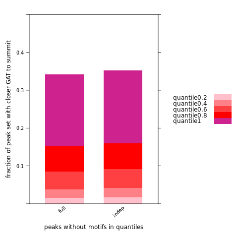 
```


## other 3mers

In the above analysis, we have used only 3mer GAT to do the analysis. \

Automate the process that concatenate the minus and plus 3mer coordinates file together. \
3mer coordinates on full hg38 use **read size==1000**. \
```{r engine='bash',  class.source = "revision", eval=F, echo=TRUE}
# Specify the directory containing the bed files
dir="/labs/Guertin/siyu/Sathyan_GATA3_ChIP_pool1_pool2/overrep_3mer/hg38_full_kmer3_rs1000/seqdump/"

# Loop through each 3mer combination
for triplet in {A,T,C,G}{A,T,C,G}{A,T,C,G} 
do
    # Define the file names for plus and minus files
    plus_file="${dir}hg38.3.3.3plus.*_${triplet}.bed"
    minus_file="${dir}hg38.3.3.3minus*_${triplet}.bed"
    
    # Concatenate the contents of plus and minus files to a new file
    cat $plus_file $minus_file > hg38.3.3.3.1000_plus_minus_${triplet}.bed
    echo "hg38.3.3.3.1000_plus_minus_${triplet}.bed"
done
```

Automate a parallel running process to find closest distance between different 3mer and our defined peak summit (positive and negative). \


First create the R file (closestBed_3mer.R) to run the closestBed job: \
```{r engine='R',  class.source = "revision", eval=F, echo=TRUE}
#!/usr/bin/env Rscript

Args=commandArgs(TRUE)

library(bigWig)
bedTools.closest <- function(functionstring="/home/FCAM/ssun/packages/bedtools2/bin/closestBed",bed1,bed2,opt.string="") {
  
  options(scipen =99) # not use scientific notation when writing out
  
  #write bed formatted data.frames to tempfile
  write.table(bed1,file= 'a.file.bed', quote=F,sep="\t",col.names=F,row.names=F)
  write.table(bed2,file= 'b.file.bed', quote=F,sep="\t",col.names=F,row.names=F)
  
  # create the command string and call the command using system()
  # the command sort a and b file by coordinates
  command1=paste('sort -k1,1 -k2,2n', 'a.file.bed', '> a.file.sorted.bed')
  cat(command1,"\n") #sort -k1,1 -k2,2n a.file.bed > a.file.sorted.bed
  try(system(command1))
  command2=paste('sort -k1,1 -k2,2n', 'b.file.bed', '> b.file.sorted.bed')
  cat(command2,"\n")
  try(system(command2))
  
  # the command call closestBed on bed1 and bed2
  command=paste(functionstring, opt.string,"-a",'a.file.sorted.bed',"-b",'b.file.sorted.bed',">",'out.file.bed',sep=" ")
  cat(command,"\n")
  try(system(command))
  
  res=read.table('out.file.bed',header=F, comment.char='')
  
  # remove intermediate files
  command3=paste('rm', 'a.file.bed', 'b.file.bed', 'a.file.sorted.bed', 'b.file.sorted.bed', 'out.file.bed')
  cat(command3,"\n")
  try(system(command3))
  
  colnames(res) = c(colnames(bed1), colnames(bed2), 'dis' )
  return(res)
}

# load 3mer bed
input_bed_file <- commandArgs(trailingOnly = TRUE)[1]
# Generate unique prefix based on the 3mer
output_prefix <- gsub(".*_(\\w+)\\.bed", "\\1", basename(input_bed_file))
print(output_prefix)

# load the 3mer coordinates file
trip.file=read.table(file = input_bed_file, sep="\t", header=FALSE)
head(trip.file)
tail(trip.file)
nrow(trip.file)


# pos control
pos.control.peak.with.all=data.frame()
for (mast.bed in Sys.glob(file.path("/home/FCAM/ssun/GATA3_ChIP_PRO_July2023/ChIP_final/Exhaustive_MEME_MAST_round1to8/", paste("with_motifs_", "*mast.bed", sep ='')))) {
  temp=read.table(mast.bed, header=FALSE)[, 1:5] #only take peak regions
  uniq.peak=temp[!duplicated(temp$V4), ] # make sure that the peak regions are unique
  uniq.peak.center=center.bed(uniq.peak, upstreamWindow = 0, downstreamWindow = 0) #take the summit
  pos.control.peak.with.all=rbind(pos.control.peak.with.all, uniq.peak.center)
}

closest.1st3mer.to.pos.control.motif.all=bedTools.closest(bed1 = pos.control.peak.with.all[,1:3], bed2 = trip.file, opt.string = '-d -t first')

write.table(closest.1st3mer.to.pos.control.motif.all,file= paste0('closest.1st',output_prefix,'.to.pos.control.motif.all.bed'), quote=F,sep="\t",col.names=F,row.names=F)


# consensus neg
full.DHS.control.consensus=center.bed(read.table("/home/FCAM/ssun/GATA3_ChIP_PRO_July2023/ChIP_final/GAT_3mer_analaysis/ENCODE_DHS_GSE29692/MCF7DHS_consensus_without_motifs_123456_78.bed", header=FALSE), upstreamWindow = 0, downstreamWindow = 0)
nrow(full.DHS.control.consensus)
head(full.DHS.control.consensus)

indep.DHS.control.consensus=center.bed(read.table("/home/FCAM/ssun/GATA3_ChIP_PRO_July2023/ChIP_final/GAT_3mer_analaysis/ENCODE_DHS_GSE29692/MCF7DHS_consensus_noGATA_without_motifs_123456_78.bed", header=FALSE), upstreamWindow = 0, downstreamWindow = 0)
nrow(indep.DHS.control.consensus)
head(indep.DHS.control.consensus)


closest.1st3mer.to.full.DHS.control.consensus=bedTools.closest(bed1 = full.DHS.control.consensus[,1:3], bed2 = trip.file, opt.string = '-d -t first')
closest.1st3mer.to.indep.DHS.control.consensus=bedTools.closest(bed1 = indep.DHS.control.consensus[,1:3], bed2 = trip.file, opt.string = '-d -t first')

write.table(closest.1st3mer.to.full.DHS.control.consensus,file= paste0('closest.1st',output_prefix,'.to.full.DHS.control.consensus.bed'), quote=F,sep="\t",col.names=F,row.names=F)
write.table(closest.1st3mer.to.indep.DHS.control.consensus,file= paste0('closest.1st',output_prefix,'.to.indep.DHS.control.consensus.bed'), quote=F,sep="\t",col.names=F,row.names=F)
```

generate a "closestBed_3mer.sh": \
```{r engine='bash',  class.source = "revision", eval=F, echo=TRUE}
#!/bin/bash
#SBATCH --job-name=closestBed_3mer.sh     # name for job
#SBATCH -N 1
#SBATCH -n 1
#SBATCH -c 16
#SBATCH -p general
#SBATCH --qos=general
#SBATCH --mem=200G
#SBATCH --mail-type=ALL
#SBATCH --mail-user=ssun@uchc.edu
#SBATCH -o closestBed_3mer.sh_%j.out
#SBATCH -e closestBed_3mer.sh_%j.err

hostname
# placeholder
triplet='XXX'

module load R/4.1.2

Rscript ../closestBed_3mer.R "/home/FCAM/ssun/GATA3_ChIP_PRO_July2023/ChIP_final/other_3mer/hg38.3.3.3.1000_plus_minus_${triplet}.bed" >> /home/FCAM/ssun/GATA3_ChIP_PRO_July2023/ChIP_final/other_3mer/ks_results_output.txt

echo "Job for ${triplet} completed."
```

Run the below chunk to submit multiple jobs in parallel: \

```{r engine='bash',  class.source = "revision", eval=F, echo=TRUE}
#!/bin/bash

# Specify the directory containing the 3mer bed files
input_directory="/home/FCAM/ssun/GATA3_ChIP_PRO_July2023/ChIP_final/other_3mer"

# Specify the output directory
output_base_directory="/home/FCAM/ssun/GATA3_ChIP_PRO_July2023/ChIP_final/other_3mer"

# Loop through each 3mer combination
for triplet in {A,T,C,G}{A,T,C,G}{A,T,C,G} 
do
    # Create a distinct output directory for each 3mer
    output_directory="${output_base_directory}/${triplet}"
    mkdir -p "${output_directory}"
    
    # Create a copy of the template script for each 3mer
    cp closestBed_3mer.sh "${output_directory}/closestBed_${triplet}.sh"
    
    # Replace the placeholder with the actual 3mer
    sed -i "s/XXX/${triplet}/" "${output_directory}/closestBed_${triplet}.sh"
    
    # Submit the job to SLURM
    cd "${output_directory}"
    sbatch "closestBed_${triplet}.sh"
    cd ..
    
    echo "Submitted job for ${triplet}."
done
```

**KS TEST** \
**CDF and PDFs** \
```{r engine='R',  class.source = "revision", eval=F, echo=TRUE}
#module load R/4.1.2
#R
directory_path <- "/home/FCAM/ssun/GATA3_ChIP_PRO_July2023/ChIP_final/other_3mer"
output_file <- "/home/FCAM/ssun/GATA3_ChIP_PRO_July2023/ChIP_final/other_3mer/p_values.txt"
output_connection <- file(output_file, "w") # Open the output file for writing
folder_names <- apply(expand.grid(c("A", "T", "C", "G"), c("A", "T", "C", "G"), c("A", "T", "C", "G")), 1, paste, collapse = "")
#folder_names <- list.dirs(directory_path, full.names = FALSE) # Get a list of folder names in the directory

library(lattice)
library(latticeExtra)
# Iterate through each folder
for (folder_name in folder_names) {
  # Set the path to the current folder
  current_folder <- file.path(directory_path, folder_name)
  
  # Read the bed files 
  neg.indep.dis <- read.table(file.path(current_folder, paste0("closest.1st",folder_name,".to.indep.DHS.control.consensus.bed")), header = FALSE)
  neg.full.dis <- read.table(file.path(current_folder, paste0("closest.1st",folder_name,".to.full.DHS.control.consensus.bed")), header = FALSE)
  pos.dis <- read.table(file.path(current_folder, paste0("closest.1st",folder_name,".to.pos.control.motif.all.bed")), header = FALSE)
  
  # Perform the ks.test for positive control vs independent negative control
  ks_test_result_bed1 <- ks.test(pos.dis[, 11], neg.indep.dis[, 11])
  
  # Perform the ks.test for positive control vs full negative control
  ks_test_result_bed2 <- ks.test(pos.dis[, 11], neg.full.dis[, 11])
  
  # Write the p-values to the output file
  cat(sprintf("%s\t%s\t%s\n", folder_name, ks_test_result_bed1$p.value, ks_test_result_bed2$p.value), file = output_connection)
  
  # Generate PDF and CDF plots for the distance info in the three bed files
  df.plot=as.data.frame(rbind(cbind(neg.indep.dis[, 11], "neg.indep"), cbind(neg.full.dis[, 11], "neg.full"), cbind(pos.dis[, 11], "pos")))
  colnames(df.plot)=c("dis","status")
  df.plot$status = factor(df.plot$status, levels = c("pos", "neg.indep", "neg.full"))
  df.plot$dis=as.numeric(df.plot$dis)
  
  # PDF plot
  pdf(file.path(current_folder, paste0("PDF_plot_1st_3mer_", folder_name, "_distance_to_summits.pdf")))
  print(densityplot( ~ abs(dis),
            groups = status,
            data = df.plot,
            auto.key = list(space = "right", lines=TRUE, points=FALSE, cex = 1),
            col=c("red", "blue4","blue"),
            aspect = 1,
            xlim=c(0,50),
            from=0,
            to=50,
            #layout=c(1,2),
            xlab = paste0("distance (bp) from 1st 3mer", folder_name, "to summit"),
            main = "GATA3 peaks (red) vs. DHS regions (blue)",
            between=list(y=1.0),
            type = "count",
            lty = c(1),
            lwd=2,
            par.settings = list(superpose.line = list(col=c("red", "blue4","blue"), lwd=3), strip.background=list(col="grey85"))
         #panel = function(...) {
             #panel.abline(v= 9, lty =2)
             #panel.abline(v= 2, lty =2)
             #panel.densityplot(...)
         #}
))
  dev.off()
  
  # CDF plot
  pdf(file.path(current_folder, paste0("CDF_plot_1st_3mer_", folder_name, "_distance_to_summits.pdf")))
  print(ecdfplot(~log(abs(dis), base = 10), groups = status, data = df.plot,
         auto.key = list(space = "right", lines=TRUE, points=FALSE, cex = 1),
         col=c("red", "blue4","blue"),
         aspect = 1,
        #xlim = c(0, 50000),
         #scales=list(relation="free",alternating=c(1,1,1,1)),
         ylab = 'Cumulative Distribution Function',
         xlab = paste0(expression('log'[10]~'3mer Distance from peak summit -'),folder_name),
                                        #index.cond = list(c(2,1)),
         between=list(y=1.0),
         type = 'a',
         xlim = c(0,2.5),
         lwd=2,
         lty=c(1),
         par.settings = list(superpose.line = list(col=c("red", "blue4","blue"), lwd=3), strip.background=list(col="grey85"))
         #panel = function(...) {
         #    panel.abline(v= 1.255, lty =2) #log10(17)=1.23 #log10(17)=1.255
         #    panel.ecdfplot(...)
         #}
))
  dev.off()
  
}

# Close the output file
close(output_connection)

# Print a message indicating the completion of the task
cat("KS tests and Plots completed. P-values are stored in", output_file, "\n")
```


The above PDF and CDF plots provide a visual inspection of the closest 3mer's distribution for each GATA3 peak/DHS regions summit. \
The densityplot() uses kernel density probability estimate to calculate the density probability of numeric variables. \
To quantatively compare the differences of 3mer enrichment near summit regions within range (0,16)(bp) between GATA3 peaks and DHS regions, we can calculate the differences of AUC within the range we selected. \
```{r engine='R',  class.source = "revision", eval=F, echo=TRUE}
#module load R/4.1.2
#R
directory_path <- "/home/FCAM/ssun/GATA3_ChIP_PRO_July2023/ChIP_final/other_3mer"
output_file <- "/home/FCAM/ssun/GATA3_ChIP_PRO_July2023/ChIP_final/other_3mer/AUC_values.txt"
output_connection <- file(output_file, "w") # Open the output file for writing
folder_names <- apply(expand.grid(c("A", "T", "C", "G"), c("A", "T", "C", "G"), c("A", "T", "C", "G")), 1, paste, collapse = "")
#folder_names <- list.dirs(directory_path, full.names = FALSE) # Get a list of folder names in the directory

#define a function to calculate AUC
library(lattice)
calculate_area_under_curve <- function(df, status, range_start, range_end) {
  # Calculate density values using the density() function
  density_values <- density(abs(df[df$status==status,]$dis), from=0, to=50)
  # Find indices corresponding to the specified range
  indices <- density_values$x >= range_start & density_values$x <= range_end
  # Subset density values within the specified range
  density_values_within_range <- density_values$y[indices]
  # Calculate the area under the curve
  area_under_curve <- sum(density_values_within_range) * diff(density_values$x)[1]
  
  return(area_under_curve)
}


# Iterate through each folder
for (folder_name in folder_names) {
  # Set the path to the current folder
  current_folder <- file.path(directory_path, folder_name)
  
  # Read the bed files 
  neg.indep.dis <- read.table(file.path(current_folder, paste0("closest.1st",folder_name,".to.indep.DHS.control.consensus.bed")), header = FALSE)
  neg.full.dis <- read.table(file.path(current_folder, paste0("closest.1st",folder_name,".to.full.DHS.control.consensus.bed")), header = FALSE)
  pos.dis <- read.table(file.path(current_folder, paste0("closest.1st",folder_name,".to.pos.control.motif.all.bed")), header = FALSE)
  
  # combine data for convenience
  df.plot=as.data.frame(rbind(cbind(neg.indep.dis[, 11], "neg.indep"), cbind(neg.full.dis[, 11], "neg.full"), cbind(pos.dis[, 11], "pos")))
  colnames(df.plot)=c("dis","status")
  df.plot$status = factor(df.plot$status, levels = c("pos", "neg.indep", "neg.full"))
  df.plot$dis=as.numeric(df.plot$dis)
  
  #get the AUC for each status
  pos.AUC=calculate_area_under_curve(df.plot, "pos", 0, 16)
  neg.full.AUC=calculate_area_under_curve(df.plot, "neg.full", 0, 16)
  neg.indep.AUC=calculate_area_under_curve(df.plot, "neg.indep", 0, 16)
  
  #get the average difference between pos.AUC vs. neg.AUC
  auc_difference <- ((pos.AUC - neg.full.AUC)+(pos.AUC - neg.indep.AUC))/2
  
  # Print the auc_difference value as needed
  cat(sprintf("%s\t%s\t%s\t%s\t%s\n", folder_name, pos.AUC, neg.full.AUC, neg.indep.AUC, auc_difference), file = output_connection)
  
}
```

Rank the difference of AUC from largest difference to smallest difference. \

```{r engine='R',  class.source = "revision", eval=TRUE, echo=TRUE}
data <- read.table("AUC_values.txt", header = FALSE, sep = "\t")

# Sort the data frame based on the fifth column in descending order
sorted_data <- data[order(-data$V5), ]
sorted_data
```

We have some expected 3mer show up in the top list. \


**Box-Whisker Plot** \
? \


## Second closest GAT

**In this section, we need to consider two things**: \
One is to define spacing/distance as the relative position of two zinc finger; \
the other is to separate the cases with different strand orientation. \


# follow-up

## MACS3 called peaks: \
-       Is IgG read depth comparable to GATA3 read depth? –YES \
```{r engine='bash', eval=F, echo=TRUE}
#cd GATA3_ChIP_PRO_July2023/ChIP_final/sorted.bam_final/read_depth/
#module load R/4.1.2
#R 
library("lattice") 
df_GATA=read.csv('GATA_sorted_bam_reads.csv')
df_IgG=read.csv('IgG_sorted_bam_reads.csv')

df_sum=rbind(df_GATA[1:3,], df_IgG)
df_sum$supp=c(rep("GATA",3), rep("IgG", 4))
df_sum$rep=c(rep(c(1,2,3),2 ),4)
df_sum$supp2=as.factor(paste(df_sum$treatment,df_sum$rep, sep = "_"))

pdf('barplot_sorted_bam_GATA_IgG_reads1.pdf',width=6,height=8)
print(barchart(aligned_reads~ supp,
         group=treatment,
         stack=T,
         data = df_sum,
         #auto.key=list(space="right"),
         scales = list(x = list(rot = 45)),
         xlab = "libraries",
         ylab = "post-alignment reads (sorted_bam)",
))
dev.off()

pdf('barplot_sorted_bam_GATA_IgG_reads.pdf',width=10,height=8)
print(barchart(aligned_reads~ supp2|supp,
         group=treatment,
         stack=T,
         data = df_sum,
         #auto.key=list(space="right"),
         scales = list(x = list(rot = 45)),
         xlab = "libraries",
         ylab = "post-alignment reads (sorted_bam)",
))
dev.off()
```

```{r  out.width = "80%", out.height="50%", echo=F, fig.align = "center", fig.cap="stacked bar plot of GATA3 libraries and IgG libraries"}
#library(knitr)
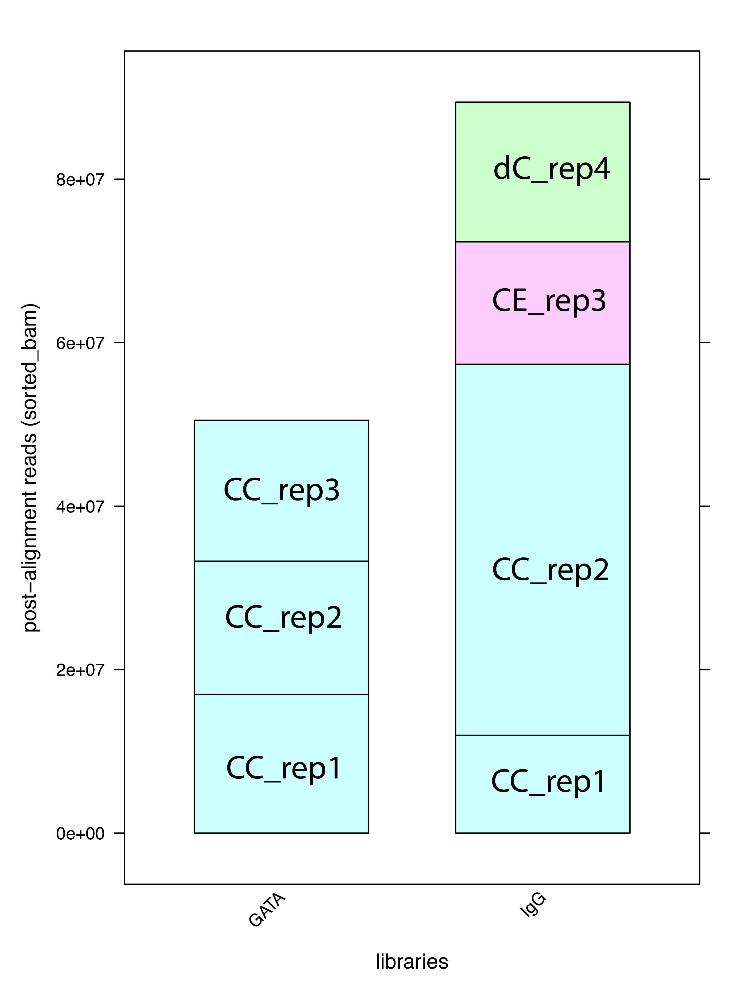 
```

The read depth in most libraries between GATA3 and IgG is comparable. However, IgG CC_rep2 exhibits higher read depth due to its sequencing in the second pool, which contains fewer samples. \

-       Saturation curve (reads vs. number of peaks) \
1) Randomly subset the GATA3 ChIP-seq data from 10% to 100%, with three replicates for each percentage. \
2) Randomly subset the control IgG ChIP-seq data from 10% to 100%, with four replicates for each percentage. \
3) Utilize MACS3 with the same parameters used for calling GATA3 peaks previously to detect peaks for each subsetted percentage. \
4) Count the number of peaks. \
5) Construct a saturation curve and fit it to an asymptotic regression model. \

```{r engine='bash', eval=F, echo=TRUE}
#! /bin/sh
#SBATCH --job-name=saturation_curve.sh    
#SBATCH -N 1
#SBATCH -n 1
#SBATCH -c 16
#SBATCH -p general
#SBATCH --qos=general
#SBATCH --mem=128G
#SBATCH --mail-type=ALL
#SBATCH --mail-user=ssun@uchc.edu
#SBATCH -o saturation_curve.sh_%j.out
#SBATCH -e saturation_curve.sh_%j.err
hostname
mkdir temp_macs

module load macs3
module load samtools/1.12

directory=/home/FCAM/ssun/GATA3_ChIP_PRO_July2023/ChIP_final/sorted.bam_final/

# Define subsampling percentages
subsample_percents=$(seq 10 10 100)

for subsample_percent in $subsample_percents
do
    subsample_val=$(echo "scale=2; $subsample_percent / 100" | bc)
    
    # Sub-sample treatment BAM files
    for treatment_file in ${directory}*_GATA_CC*sorted.bam
    do
        nm=$(echo $treatment_file | awk -F"/" '{print $NF}' | awk -F"MCF7_dTAGGATA522_" '{print $2}')
        samtools view -s $subsample_val -b $treatment_file > subsampled_${subsample_val}_${nm}
    done
    
    # Sub-sample control BAM files
    for control_file in ${directory}*IgG*sorted.bam
    do
        name=$(echo $control_file | awk -F"/" '{print $NF}' | awk -F"MCF7_dTAGGATA522_" '{print $2}')
        samtools view -s $subsample_val -b $control_file > subsampled_${subsample_val}_${name}
    done
    
    # Call peaks using MACS3 with all subsampled treatment and control BAM files
    treatment_files=$(ls subsampled_${subsample_val}_GATA*.bam | tr '\n' ' ')
    control_files=$(ls subsampled_${subsample_val}_IgG*.bam | tr '\n' ' ')

    macs3 callpeak --call-summits -t $treatment_files -c $control_files -n GATA_ChIP_subsample_${subsample_val} -g hs -q 0.01 --keep-dup all -f BAMPE --nomodel --tempdir temp_macs

    # Clean up intermediate subsampled files if needed
    rm subsampled_${subsample_val}_*.bam
done
```

```{r engine='R', eval=F, echo=TRUE}
#module load R/4.1.2 
#R 
count_peaks <- function(file_path) {
  peak_count <- system(paste("wc -l", file_path), intern = TRUE)
  return(as.numeric(strsplit(peak_count, " ")[[1]][1]))
}

# Find all summit.bed files
file_paths <- Sys.glob("/home/FCAM/ssun/GATA3_ChIP_PRO_July2023/ChIP_final/Saturation_curve/*summits*.bed")

# Initialize an empty data frame
data <- data.frame(Read_Depth = numeric(0), Peak_Number = numeric(0))

# Read data and count peaks for each file
for (i in seq_along(file_paths)) {
  peak_number <- count_peaks(file_paths[i])
  data <- rbind(data, data.frame(Read_Depth = c(100, seq(10, 90, 10))[i], Peak_Number = peak_number))
}

# Plot the saturation curve with lattice
library(lattice)
pdf('240103_saturation_curve.pdf',width=8,height=5)
print(xyplot(Peak_Number ~ Read_Depth, data = data, type = c("p", "smooth"), col = "blue"))
dev.off()


# Fit asymptotic regression
asymptotic_model <- nls(Peak_Number ~ asymptotic_formula(Read_Depth, a, b, c), 
                        data = data, 
                        start = list(a = mean(data$Peak_Number), b = 0.1, c = 10))
# Define the asymptotic formula (replace this with the formula you want to fit)
asymptotic_formula <- function(x, a, b, c) {
  a * (1 - exp(-b * x)) + c
}

# Plot the saturation curve with lattice and add fitted curve
pdf('240103_saturation_curve2.pdf',width=8,height=5)
print(xyplot(Peak_Number ~ Read_Depth, 
             data = data, 
             type = c("p", "smooth"), 
             col = "blue",
             xlim=c(0, 300),
             ylim=c(0, 150000),
             xlab="percent read depth (%)",
            panel = function(x, y, ...) {
              panel.xyplot(x, y, ...)
              panel.curve(asymptotic_formula(x, coef(asymptotic_model)["a"], coef(asymptotic_model)["b"], coef(asymptotic_model)["c"]), col = "red", add = TRUE)
                         })
)
dev.off()


png('240103_saturation_curve2.png')
print(xyplot(Peak_Number ~ Read_Depth, 
             data = data, 
             type = c("p", "smooth"), 
             col = "blue",
             xlim=c(0, 300),
             ylim=c(0, 150000),
             xlab="percent read depth (%)",
            panel = function(x, y, ...) {
              panel.xyplot(x, y, ...)
              panel.curve(asymptotic_formula(x, coef(asymptotic_model)["a"], coef(asymptotic_model)["b"], coef(asymptotic_model)["c"]), col = "red", add = TRUE)
                         })
)
dev.off()
```

```{r  out.width = "100%", out.height="50%", echo=F, fig.align = "center", fig.cap="saturation curve for GATA3 ChIP-seq peaks"}
#library(knitr)
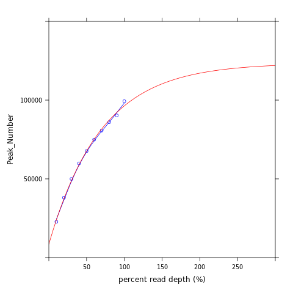 
```

<!--
```{r engine='bash', eval=F, echo=TRUE}
wget https://github.com/samtools/samtools/releases/download/1.12/samtools-1.12.tar.bz2
tar xvjf samtools-1.12.tar.bz2 
./configure --prefix=/home/FCAM/ssun/packages/samtools-1.12
make
make install
```


```{r engine='R', eval=F, echo=TRUE}
# saturation_curve.R
```

```{r engine='bash', eval=F, echo=TRUE}
#! /bin/sh
#SBATCH --job-name=saturation_curve.sh    
#SBATCH -N 1
#SBATCH -n 1
#SBATCH -c 8
#SBATCH -p general
#SBATCH --qos=general
#SBATCH --mem=64G
#SBATCH --mail-type=ALL
#SBATCH --mail-user=ssun@uchc.edu
#SBATCH -o saturation_curve.sh_%j.out
#SBATCH -e saturation_curve.sh_%j.err

hostname
mkdir temp_macs

module load R/4.1.2
module load macs3
module load samtools/1.12

directory=/home/FCAM/ssun/GATA3_ChIP_PRO_July2023/ChIP_final/sorted.bam_final/
# GATA_CC against IgG
Rscript saturation_curve.R ${directory}MCF7_dTAGGATA522_GATA_CC_rep1.sorted.bam, ${directory}MCF7_dTAGGATA522_GATA_CC_rep2.sorted.bam, ${directory}MCF7_dTAGGATA522_GATA_CC_rep3.sorted.bam ${directory}MCF7_dTAGGATA522_IgG_CC_rep1.sorted.bam, ${directory}MCF7_dTAGGATA522_IgG_CC_rep4.sorted.bam, ${directory}MCF7_dTAGGATA522_IgG_CE_rep2.sorted.bam, ${directory}MCF7_dTAGGATA522_IgG_dE_rep3.sorted.bam output_file.txt
```

plot the saturation curve: \
```{r engine='R', eval=F, echo=TRUE}
library(lattice)
data <- read.table("output_file.txt", header = TRUE, sep = "\t")

# Plot the saturation curve using lattice
xyplot(peak_count ~ read_depth, data = data,
       type = c("p", "l"), col = "blue",
       xlab = "Read Depth", ylab = "Number of Peaks",
       main = "Saturation Curve for ChIP-seq Data")
```

-->


-       Peak sensitivity and specificity using GATA3-depleted cells and untreated cells. Do sensitive peak sets have a sequence-binding element?  \

-->

## GATA3 structure
-       Homology of two GATA3 zinc fingers -N-zinc sequence, C-zinc sequences, align them. \

make sure the full structure of zinc finger; and the specificity of each zinc finger binding to the specific sequences. \
Sequence Retrieval from Uniprot P23771 · GATA3_HUMAN \
zinc finger 1: 263-287: CVNCGATSTPLWRRDGTGHYLCNAC[GLY] ; zinc finger 2: 317-341: CANCQTTTTTLWRRNANGDPVCNAC[GLY] \
NCBI BLAST Alignment: \

```{r  out.width = "80%", out.height="80%", echo=F, fig.align = "center", fig.cap="NCBI blast for the two zinc finger"}
#library(knitr)
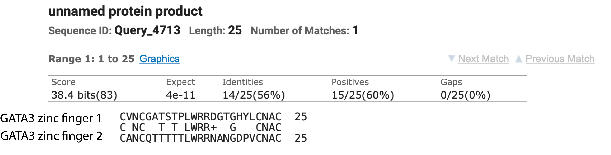 
```

The two zinc finger of GATA3 have 60% identity. \

-       What are the characteristics of the two activation domains? \
-       What are the characteristics of GATA3 zinc fingers? \

## Software to search for variable spacing motifs. \

## Functional check: \
-       Given purified zinc fingers and a DNA template, can we observe different spacing/orientations of binding patterns? (cryoEM or in silicon alphafold to find protein-DNA binding) \