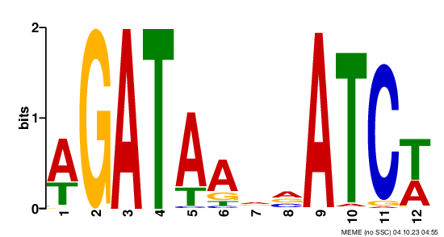

# Nov 28th

## Goal
The overall goal of this analysis is to visualize the distribution of 3mer-GAT corresponding to its closest ChIP peak summit. \
**Step1**: find the closest 3mer-GAT to each ChIP peak summit. \
**Step2**: set closest 3mer-GAT as the new anchor point; draw composite profile of 3mer-GAT distribution upstream/downstream of the anchor point. \

## Install required packages
Install `bigWig` package \
```{r engine='R', eval=TRUE, echo=F}
install.packages("devtools")
library(devtools)
devtools::install_github('andrelmartins/bigWig',
              subdir='bigWig')
library(bigWig)
```

Install `bedtools` \
```{r engine='bash', eval=F, echo=F}
/bin/bash -c "$(curl -fsSL https://raw.githubusercontent.com/Homebrew/install/HEAD/install.sh)"
brew install bedtools
```

## step1: find the closest 3mer-GAT to each ChIP peak summit
In this section, we first use `seqOutBias` to generate 3mer coordinates file, then we use Bedtools `closestbed` to find overlap/closest GAT to each provided peak summit. \

### Generate the 3mer coordinates file on the reference genome.
**3mer_df**: generating a .txt file where the first column are all 64 3mer, second column are the index, and the third column are the corresponding reversed 3mer's index (indexrc). \
```{r engine='R', eval=F, echo=TRUE}
#define function to output the reverse compliment sequence
revcomp <- function(sequence) {
  complement_mapping <- c("A" = "T", "T" = "A", "C" = "G", "G" = "C")
  complemented_sequence <- sapply(strsplit(rev(strsplit(sequence, "")[[1]]), NULL), function(base) complement_mapping[base])
  complemented_sequence <- paste(complemented_sequence, collapse = "")
  return(complemented_sequence)
}

# 64 3mer with index
all.64 = expand.grid(rep(list(c('A','C','G','T')), 3))
all.64.df = data.frame(apply(all.64, 1 , paste, collapse = ""))
all.64.df[,1] = all.64.df[order(all.64.df[,1]),]
all.64.df[,2] = 1:64

# 64 reversed 3mer with indexrc
rev.df = data.frame(as.character(all.64.df[,1]))
rev.df[] = apply(rev.df, 1, revcomp)
rev.df[,2] = 1:64
colnames(rev.df)= c('rc', 'indexrc')


colnames(all.64.df) = c('three_mer', 'index')
all.64.df.rc = merge(all.64.df, rev.df, by.x = 'three_mer', by.y = 'rc')
write.table(all.64.df.rc, file = 'all_64_df.txt', quote=FALSE, row.names =FALSE, col.names = FALSE, sep = '\t')
```

```{r engine='bash', eval=TRUE, echo=TRUE}
head all_64_df.txt
```

**Ref Genome**
Here, I use a subset of hg38 genome (2million reads of chr10) as the input reference genome; \
```{r engine='bash', eval=F, echo=TRUE}
#cd /home/FCAM/ssun/Genome/hg38/
wget https://hgdownload.cse.ucsc.edu/goldenpath/hg38/chromosomes/chr10.fa.gz
gunzip chr10.fa.gz
cat /home/FCAM/ssun/Genome/hg38/chr10.fa | head -4000000 > /home/FCAM/ssun/seqoutbias/chr10_kmer3/refreads4M/chr10_4M.fa
```

**seqOutBias**
`seqOutBias seqtable` will generate a seqtable file (.tbl) which is a compressed form that stores the mappability information as well as corresponding parameters (read length, k-mer size, and cut-site offsets). \

`seqOutBias dump` can extract info from the seqtable file and output plain txt file in a form of “chrom:start-end”. It will also list the input parameters (read-size, kmer-size, etc.) that were used to build the sequence table file. \

```{r engine='bash', eval=F, echo=TRUE}
hostname
export PATH=$PATH:/home/FCAM/ssun/packages/://home/FCAM/ssun/scripts
module load genometools/1.5.10
module load ucsc_genome/2012.05.22
module load rust

# use a small hg38 genome subset (2million reads in chr10)
genome=/home/FCAM/ssun/seqoutbias/chr10_kmer3/refreads4M/chr10_4M.fa 

seqOutBias seqtable ${genome} --read-size=30 --kmer-size=3 --plus-offset=3 --minus-offset=3 --out=chr10_4M.3.3.3.tbl
seqOutBias dump chr10_4M.3.3.3.tbl > chr10_4M.3.3.3.dump.txt
```

The output "chr10_4M.3.3.3.dump.txt" file is 2GB large, a subset of the top 500 lines from this large file is saved (head500_chr10_4M.3.3.3.dump.txt) and can be visualize here: 
```{r engine='bash', eval=T, echo=TRUE}
head -15 head500_chr10_4M.3.3.3.dump.txt
```

Then we use a python script "dump_to_kmer.py" to generate 128 (64 3mer +64 reversed 3mer) .bed files that contain the 3mer coordinates info (chr-start-end-index-inderc-strand-3mersequence). \
```{r engine='bash', eval=F, echo=TRUE}
mkdir seqdump_test
mv chr10_4M.3.3.3.dump.txt seqdump_test
mv all_64_df.txt seqdump_test
cd seqdump_test

while read line; do
 mer=$(echo $line | awk -F" " '{print $1}')
 idx=$(echo $line | awk -F" " '{print $2}')
 rcidx=$(echo $line | awk -F" " '{print $3}')
 echo $mer
 echo $idx
 echo $rcidx
 python /home/FCAM/ssun/scripts/dump_to_kmer.py -i chr10_4M.3.3.3.dump.txt -p $idx -m $rcidx -s $mer
done <all_64_df.txt
```


**coherence check** \

To test if the output .bed file indeed contains the corresponding 3mer sequence at its genome coordinates, we use `bedtools getfasta` to extract the actual sequence from reference genome based on the provided bed coordinates. \

```{r engine='bash', eval=F, echo=TRUE}
#bed to fasta (extract the actual sequence from reference genome based on the provided bed coordinates)
module load bedtools
genome=/home/FCAM/ssun/seqoutbias/chr10_kmer3/refreads4M/chr10_4M.fa 
plus_file=/labs/Guertin/siyu/Sathyan_GATA3_ChIP_pool1_pool2/overrep_3mer/seqdump_test/chr10_4M.3.3.3plus.36_GAT.bed
minus_file=/labs/Guertin/siyu/Sathyan_GATA3_ChIP_pool1_pool2/overrep_3mer/seqdump_test/chr10_4M.3.3.3minus.14_GAT.bed
bedtools getfasta -fi ${genome} -bed ${plus_file}  -fo chr10_4M.3.3.3plus.36_GAT.fasta
bedtools getfasta -fi ${genome} -bed ${minus_file}  -fo chr10_4M.3.3.3minus.14_GAT.fasta
```

The below command proved that chr10_4M.3.3.3plus.36_GAT.fasta only contains "GAT" sequence and chr10_4M.3.3.3minus.14_GAT.fasta only "ATC" sequence. \
```{r engine='bash', eval=F, echo=TRUE}
cat chr10_4M.3.3.3plus.36_GAT.fasta | grep -v ">" |grep -v "GAT" --ignore-case | wc -l # 0
cat chr10_4M.3.3.3minus.14_GAT.fasta | grep -v ">" |grep -v "atc" --ignore-case | wc -l # 0
```

**convert to bigWig** \
Since these 3mer coordinates files are one of the input in making composite profile with `bigWig` package, we need to convert them from .bed to .bigWig. We first use `bedtools genomecov -bg` to convert .bed format to .bedGraph, then use UCSC `bedGraphToBigWig` to convert from .bedGraph to .bw. \

1) plus_GAT & minus_GAT: \
```{r engine='bash', eval=F, echo=TRUE}
#GAT
plus_file=/labs/Guertin/siyu/Sathyan_GATA3_ChIP_pool1_pool2/overrep_3mer/seqdump_test/chr10_4M.3.3.3plus.36_GAT.bed
minus_file=/labs/Guertin/siyu/Sathyan_GATA3_ChIP_pool1_pool2/overrep_3mer/seqdump_test/chr10_4M.3.3.3minus.14_GAT.bed
sizes=/home/FCAM/ssun/Genome_pro/hg38.chrom.sizes
#bed to bigwig
module load bedtools
module load ucsc_genome/2012.05.22

sort -k1,1 -k2,2n ${plus_file} > testplus.36_GAT_sorted.bed
sort -k1,1 -k2,2n ${minus_file} > testminus.14_GAT_sorted.bed

bedtools genomecov -bg -i testplus.36_GAT_sorted.bed -g ${sizes} > testplus.36_GAT.bedGraph 
bedtools genomecov -bg -i testminus.14_GAT_sorted.bed -g ${sizes} > testminus.14_GAT.bedGraph 

#UCSC bedGraphToBigWig tool
bedGraphToBigWig testplus.36_GAT.bedGraph ${sizes} testplus.36_GAT.bw
bedGraphToBigWig testminus.14_GAT.bedGraph ${sizes} testminus.14_GAT.bw
```

A UCSC genome browser trackhub (http://guertinlab.cam.uchc.edu/test_hub/hub.txt) is also created to allow visualizing the 3mer position on genome. \

2) plus_ATC & minus_ATC: \
ATC is the reverse compliment of GAT, which means that plus ATC contain same info as minus GAT and minus ATC contain same info as plus GAT. Thus, this 3mer-ATC coordinate files are good resources in doing coherence check later. We will convert this 3mer coordinate bed to bigWig as well. \
```{r engine='bash', eval=F, echo=TRUE}
#ATC
plus_file=/labs/Guertin/siyu/Sathyan_GATA3_ChIP_pool1_pool2/overrep_3mer/seqdump_test/chr10_4M.3.3.3plus.14_ATC.bed
minus_file=/labs/Guertin/siyu/Sathyan_GATA3_ChIP_pool1_pool2/overrep_3mer/seqdump_test/chr10_4M.3.3.3minus.36_ATC.bed
sizes=/home/FCAM/ssun/Genome_pro/hg38.chrom.sizes
#bed to bigwig
module load bedtools
module load ucsc_genome/2012.05.22

sort -k1,1 -k2,2n ${plus_file} > testplus.14_ATC_sorted.bed
sort -k1,1 -k2,2n ${minus_file} > testminus.36_ATC_sorted.bed

bedtools genomecov -bg -i testplus.14_ATC_sorted.bed -g ${sizes} > testplus.14_ATC.bedGraph 
bedtools genomecov -bg -i testminus.36_ATC_sorted.bed -g ${sizes} > testminus.36_ATC.bedGraph 

#UCSC bedGraphToBigWig tool
bedGraphToBigWig testplus.14_ATC.bedGraph ${sizes} testplus.14_ATC.bw
bedGraphToBigWig testminus.36_ATC.bedGraph ${sizes} testminus.36_ATC.bw
```

### Prepare the peak summit file
As a positive control, we want to subset peaks with known GATA3-like de novo motif enriched. \

In previous MCF7 GATA3 ChIP-seq analysis, we identify top enriched motif to be GATA-like. In the second round of exhaustive MEME -MAST analysis, the top enriched GATA-like motif has a unique structure -- 4bp spacing between two GAT sites. \

```{r  out.width = "100%", echo=F, fig.align = "center", fig.cap="GATA3 motif variants 2"}
library(knitr)
 
```

We also use `MAST` to finding this unique motif's occurence in ChIP peak. The motif coordinaes information is stored in "mast_GATA3_PSWM_in_peaks_round2.bed".  \

Now, we can use `intersectBed` to find peak with this unique motif, and make a peak summit file. \
`intersectBed -wa` (refer to https://bedtools.readthedocs.io/en/latest/content/tools/intersect.html) reports original entry in A for each overlap. \
```{r engine='bash', eval=F, echo=TRUE}
module load bedtools
#cd /home/FCAM/ssun/GATA3_ChIP_PRO_July2023/ChIP_final/de_novo_motif/
dir=/home/FCAM/ssun/GATA3_ChIP_PRO_July2023/ChIP_final/peak_call/
motif_cor=mast_GATA3_PSWM_in_peaks_round2.bed

#peaks with motif2
intersectBed -wa -a ${dir}GATA_ChIP_summit_100window.bed -b ${motif_cor} > with_motif_2_100win.bed 
```

This bed file stores peak information of chr, start, end, peak-index, intensity. The peak coordinates have a 100bp window, we will center them to 1bp summit later. \
```{r engine='bash', eval=TRUE, echo=TRUE}
head with_motif_2_100win.bed 
```
### find the closest 3mer-GAT to peak summit with `closestBed`
In this section, we use `bedtools closestBed` (refer to: https://bedtools.readthedocs.io/en/latest/content/tools/closest.html) to find the closest GAT to each provided peak summit. \
Input: \
`-a` will be the sorted peak summit file (centered 1bp); \
`-b` will be the sorted, and concatenated GAT coordinates file (both plus and minus); \

**Prepare the input file -a: peak summit file (centered 1bp)** \

```{r engine='R', eval=TRUE, echo=TRUE}
#load files contains ChIP summit info 
chip.peak.summit=read.table("with_motif_2_100win.bed", header=FALSE)
#get the center of summit (1bp) with bigWig package
library(bigWig)
chip.peak.summit1=center.bed(chip.peak.summit, upstreamWindow = 0, downstreamWindow = 0)
#get only chr10 peak summit
chip.peak.summit.chr10.4M=chip.peak.summit1[chip.peak.summit1$V1=="chr10",] 

nrow(chip.peak.summit.chr10.4M) #580
head(chip.peak.summit.chr10.4M)
```

**Prepare the input file -b: concatenated GAT coordinates file** \

```{r engine='R', eval=TRUE, echo=TRUE}
#load files contains 3mer coordinates info
#plus
plus.GAT.file=read.table(file = "chr10_4M.3.3.3plus.36_GAT.bed", sep="\t", header=FALSE)
#minus
minus.GAT.file=read.table(file = "chr10_4M.3.3.3minus.14_GAT.bed", sep="\t", header=FALSE)
#concatenate the plus and minus file together
all.GAT.file=rbind(plus.GAT.file, minus.GAT.file)
head(all.GAT.file)
tail(all.GAT.file)
```
**bedtools closestBed** \
The below function will sort input bed1 and bed2 first, then run `bedtools closestBed` between bed1 and bed2. \
```{r engine='R', eval=TRUE, echo=TRUE}
# define function 
bedTools.closest <- function(functionstring="/usr/local/bin/closestBed",bed1,bed2,opt.string="") {
  
  options(scipen =99) # not use scientific notation when writing out
  
  #write bed formatted data.frames to tempfile
  write.table(bed1,file= 'a.file.bed', quote=F,sep="\t",col.names=F,row.names=F)
  write.table(bed2,file= 'b.file.bed', quote=F,sep="\t",col.names=F,row.names=F)
  
  # create the command string and call the command using system()
  # the command sort a and b file by coordinates
  command1=paste('sort -k1,1 -k2,2n', 'a.file.bed', '> a.file.sorted.bed')
  cat(command1,"\n") #sort -k1,1 -k2,2n a.file.bed > a.file.sorted.bed
  try(system(command1))
  command2=paste('sort -k1,1 -k2,2n', 'b.file.bed', '> b.file.sorted.bed')
  cat(command2,"\n")
  try(system(command2))
  
  # the command call closestBed on bed1 and bed2
  command=paste(functionstring, opt.string,"-a",'a.file.sorted.bed',"-b",'b.file.sorted.bed',">",'out.file.bed',sep=" ")
  cat(command,"\n")
  try(system(command))
  
  res=read.table('out.file.bed',header=F, comment.char='')
  
  # remove intermediate files
  command3=paste('rm', 'a.file.bed', 'b.file.bed', 'a.file.sorted.bed', 'b.file.sorted.bed', 'out.file.bed')
  cat(command3,"\n")
  try(system(command3))
  
  colnames(res) = c(colnames(bed1), colnames(bed2), 'dis' )
  return(res)
}
```

Parameter `-d` will report the distance from the closest GAT to the peak summit. \
```{r engine='R', eval=F, echo=TRUE}
plus.distance=bedTools.closest(bed1 = chip.peak.summit.chr10.4M[,1:3], bed2 = plus.GAT.file, opt.string = '-d')
minus.distance=bedTools.closest(bed1 = chip.peak.summit.chr10.4M[,1:3], bed2 = minus.GAT.file, opt.string = '-d')
write.table(plus.distance,file= 'plus.distance.bed', quote=F,sep="\t",col.names=F,row.names=F)
write.table(minus.distance,file= 'minus.distance.bed', quote=F,sep="\t",col.names=F,row.names=F)
```
```{r engine='R', eval=TRUE, echo=TRUE}
plus.distance=read.table('plus.distance.bed',header=F, comment.char='')
minus.distance=read.table('minus.distance.bed',header=F, comment.char='')
head(plus.distance)
head(minus.distance)
```

find the closest GAT to peak summit regardless of GAT strandedness \
```{r engine='R', eval=F, echo=TRUE}
all.distance=bedTools.closest(bed1 = chip.peak.summit.chr10.4M[,1:3], bed2 = all.GAT.file, opt.string = '-d')
write.table(all.distance,file= 'all.distance.bed', quote=F,sep="\t",col.names=F,row.names=F)
```
```{r engine='R', eval=TRUE, echo=TRUE}
all.distance=read.table('all.distance.bed',header=F, comment.char='')
head(all.distance)
```


**coherence check 1**: the number of the closest minus GAT is comparable to the number of the closest plus GAT. \

```{r engine='R', eval=TRUE, echo=TRUE}
nrow(all.distance)
nrow(all.distance[all.distance$V9=="+",])
nrow(all.distance[all.distance$V9=="-",])
```

**coherence check 2**: check for ties \
```{r engine='R', eval=TRUE, echo=TRUE}
nrow(chip.peak.summit.chr10.4M) # there are 580 unique peak (contains motif 2)


nrow(plus.distance) # has duplicated peak due to tied distance (587>580)
nrow(minus.distance)  # has duplicated peak due to tied distance (586 >580)
nrow(all.distance)  # has duplicated peak due to tied distance(600>580)
```
**coherence check 3**: taking care of tied GAT coordinates \

If tied distances occurred, `bedtools closestBed` by default will report both coordinates in b file, this is why we have duplicated peaks. Parameter `-t first/last` can report either the first in the tie or the last in the tie. \

Taking the below tied GAT coordinates as an example. GAT coordinates A: chr10:13679939:13679942 and B: chr10:13679945:13679948 have same distance to the same peak summit. If keep both A and B as closest GAT to this summit, we will end up making both of them the new anchor point. Then A will find B as closest GAT, B will find A as closest GAT. \
```{r engine='R', eval=TRUE, echo=TRUE}
#example
all.distance[all.distance$V2=="13679943",] 
```

**coherence check 4**: find the duplicated peaks due to tie \

If tie occurs, report only the first GAT with `-t first`. \
If tie occurs, report only the first GAT with `-t last`. \
```{r engine='R', eval=F, echo=TRUE}
all.distance.first=bedTools.closest(bed1 = chip.peak.summit.chr10.4M[,1:3], bed2 = all.GAT.file, opt.string = '-d -t first')
all.distance.last=bedTools.closest(bed1 = chip.peak.summit.chr10.4M[,1:3], bed2 = all.GAT.file, opt.string = '-d -t last')
write.table(all.distance.first,file= 'all.distance.first.bed', quote=F,sep="\t",col.names=F,row.names=F)
write.table(all.distance.last,file= 'all.distance.last.bed', quote=F,sep="\t",col.names=F,row.names=F)
```
```{r engine='R', eval=TRUE, echo=TRUE}
all.distance.first=read.table('all.distance.first.bed',header=F, comment.char='')
all.distance.last=read.table('all.distance.last.bed',header=F, comment.char='')
nrow(all.distance.first) #580
nrow(all.distance.last) #580
```

find peaks with different closest GAT assigned that has same distance to the summit \
```{r engine='R', eval=TRUE, echo=TRUE}
colnames(all.distance.first) <- paste0("V", 1:11)
colnames(all.distance.last) <- paste0("V", 1:11)

find_different_rows <- function(row1, row2) {
  if (any(row1 != row2)) {
    return(TRUE)
  } else {
    return(FALSE)
  }
}

# Initializing an empty list to store different rows
different_rows <- list()

# Comparing each row from df1 with corresponding row in df2
for (i in 1:nrow(all.distance.first)) {
  if (find_different_rows(all.distance.first[i, ], all.distance.last[i, ])) {
    different_rows[[length(different_rows) + 1]] <- all.distance.first[i, ]
    different_rows[[length(different_rows) + 2]] <- all.distance.last[i, ]
  }
}
# Combining the different rows into a dataframe
different_rows_df <- do.call(rbind, different_rows)
nrow(different_rows_df) # 40
head(different_rows_df)
```
20 peaks have tied closest GAT coordinates. \


## step2: making composite profile
In this section, we use the `bigWig` package to make a composite profile of GAT distribution relative to the anchored GAT (that is closest to peak summit). \
**Input**: \
**1)** two .bigWig files that contain the 3mer coordinates info. \
```{r engine='R', eval=TRUE, echo=TRUE}
library(bigWig)
bwPlus_GAT=load.bigWig('testplus.36_GAT.bw')
bwMinus_GAT=load.bigWig('testminus.14_GAT.bw')
bwPlus_ATC=load.bigWig('testplus.14_ATC.bw')
bwMinus_ATC=load.bigWig('testminus.36_ATC.bw')
```

use `query.bigWig` to search the .bigWig file in a genomic window. \

```{r engine='R', eval=TRUE, echo=TRUE}
query.bigWig(bwPlus_GAT, 'chr10', 1000000, 1000800)
query.bigWig(bwMinus_GAT, 'chr10', 1000000, 1000800)
```

**2)** a bed6 file that contains closest GAT (to peak summit) coordinates info. \

### set the closest 3mer-GAT as anchor point (bed6) then query bigWig

The bed6 file should define the following columns: "chrom - start - end - name - score - strand". `bigWig` functions don’t use name and score. \
```{r engine='R', eval=TRUE, echo=TRUE}
bed6=all.distance[, 4:9] # all.distance -- this is keeping both tied minus/plus GAT
#bed6-plus
bed6_plus=bed6[bed6$V9=="+",]
#bed6-minus
bed6_minus=bed6[bed6$V9=="-",]

nrow(bed6)
nrow(bed6_plus)
nrow(bed6_minus)
```

**PLUS** \
Take the closest **plus** 3mer-GAT as anchor point and define the new window using the anchor point. \
```{r engine='R', eval=TRUE, echo=TRUE}
#bigWig input
bwPlus=bwPlus_GAT
bwMinus=bwMinus_GAT
#bed6 input
bedTSS=bed6_plus

## define new window
bedTSSwindow=center.bed(bedTSS, upstreamWindow = 25, downstreamWindow = 25) #from anchor point, add 25bp downstream and upstream
head(bedTSS)
head(bedTSSwindow)
```
Query.bigWig \
`bed6.bpQuery` search for observations in the .bigWig file with region/range provided by each row in .bed6 file. \
`step queries` breaking the region/range up into equal size steps as defined by "step =". \
```{r engine='R', eval=TRUE, echo=TRUE}
tss.matrix = bed6.step.bpQuery.bigWig(bwPlus, bwMinus, bedTSSwindow,
                  step = 1, as.matrix=TRUE, follow.strand=TRUE)
head(tss.matrix)
colnames(tss.matrix) = seq(-25, 25, by = 1)
rownames(tss.matrix) = bedTSSwindow[,5]
#filter out rows with no signal
tss.matrix=tss.matrix[rowSums(tss.matrix) != 0,]
head(tss.matrix)
```
```{r engine='R', eval=TRUE, echo=TRUE}
plot(seq(-25, 25, by = 1),colSums(tss.matrix),
                  xlab = 'stranded 3mer (GAT) position',
                  ylab = 'observed 3mer (GAT)', type = "h")
```

`follow.strand` not invoked. \
```{r engine='R', eval=TRUE, echo=TRUE}
tss.matrix = bed6.step.bpQuery.bigWig(bwPlus, bwMinus, bedTSSwindow,
                  step = 1, as.matrix=TRUE, follow.strand=F)
#head(tss.matrix)
colnames(tss.matrix) = seq(-25, 25, by = 1)
rownames(tss.matrix) = bedTSSwindow[,5]
#filter out rows with no signal
tss.matrix=tss.matrix[rowSums(tss.matrix) != 0,]
head(tss.matrix)
```

```{r engine='R', eval=TRUE, echo=TRUE}
plot(seq(-25, 25, by = 1),colSums(tss.matrix),
                  xlab = 'stranded 3mer (GAT) position',
                  ylab = 'observed 3mer (GAT)', type = "h")
```
Since `follow.strand` only affect - strand output, the +strand outputs are not affected by this parameter. \

**MINUS** \
Take the closest **minus** 3mer-GAT as anchor point and define the new window using the anchor point. \
```{r engine='R', eval=TRUE, echo=TRUE}
#bigWig input
bwPlus=bwPlus_GAT
bwMinus=bwMinus_GAT
#bed6 input
bedTSS=bed6_minus

## define new window
bedTSSwindow=center.bed(bedTSS, upstreamWindow = 25, downstreamWindow = 25) #from anchor point, add 25bp downstream and upstream
head(bedTSS)
head(bedTSSwindow)
```

Query.bigWig \
`follow.strand` set to TRUE. This will reverse the direction of - strand output. \
```{r engine='R', eval=TRUE, echo=TRUE}
tss.matrix = bed6.step.bpQuery.bigWig(bwPlus, bwMinus, bedTSSwindow,
                  step = 1, as.matrix=TRUE, follow.strand=TRUE)
#head(tss.matrix)
colnames(tss.matrix) = seq(-25, 25, by = 1)
rownames(tss.matrix) = bedTSSwindow[,5]
#filter out rows with no signal
tss.matrix=tss.matrix[rowSums(tss.matrix) != 0,]
head(tss.matrix)
```

```{r engine='R', eval=TRUE, echo=TRUE}
plot(seq(-25, 25, by = 1),colSums(tss.matrix),
                  xlab = 'stranded 3mer (GAT) position',
                  ylab = 'observed 3mer (GAT)', type = "h")
```

`follow.strand` not invoked.\
```{r engine='R', eval=TRUE, echo=TRUE}
tss.matrix = bed6.step.bpQuery.bigWig(bwPlus, bwMinus, bedTSSwindow,
                  step = 1, as.matrix=TRUE, follow.strand=F)
#head(tss.matrix)
colnames(tss.matrix) = seq(-25, 25, by = 1)
rownames(tss.matrix) = bedTSSwindow[,5]
#filter out rows with no signal
tss.matrix=tss.matrix[rowSums(tss.matrix) != 0,]
head(tss.matrix)
```
```{r engine='R', eval=TRUE, echo=TRUE}
plot(seq(-25, 25, by = 1),colSums(tss.matrix),
                  xlab = 'stranded 3mer (GAT) position',
                  ylab = 'observed 3mer (GAT)', type = "h")
```
`follow.strand` set to be TRUE reversed the -strand output. \


**BOTH** \
Take the closest **both plus/minus** 3mer-GAT as anchor point and define the new window using the anchor point. \
```{r engine='R', eval=TRUE, echo=TRUE}
#bigWig input
bwPlus=bwPlus_GAT
bwMinus=bwMinus_GAT
#bed6 input
bedTSS=bed6

## define new window
bedTSSwindow=center.bed(bedTSS, upstreamWindow = 25, downstreamWindow = 25) #from anchor point, add 25bp downstream and upstream
head(bedTSS)
head(bedTSSwindow)
```

Query.bigWig \
`follow.strand` set to TRUE. This will reverse the direction of - strand output. \
```{r engine='R', eval=TRUE, echo=TRUE}
tss.matrix = bed6.step.bpQuery.bigWig(bwPlus, bwMinus, bedTSSwindow,
                  step = 1, as.matrix=TRUE, follow.strand=TRUE)
#head(tss.matrix)
colnames(tss.matrix) = seq(-25, 25, by = 1)
rownames(tss.matrix) = bedTSSwindow[,5]
#filter out rows with no signal
tss.matrix=tss.matrix[rowSums(tss.matrix) != 0,]
head(tss.matrix)
```
```{r engine='R', eval=TRUE, echo=TRUE}
plot(seq(-25, 25, by = 1),colSums(tss.matrix),
                  xlab = 'stranded 3mer (GAT) position',
                  ylab = 'observed 3mer (GAT)', type = "h")
```

`follow.strand` not invoked. \
```{r engine='R', eval=TRUE, echo=TRUE}
tss.matrix = bed6.step.bpQuery.bigWig(bwPlus, bwMinus, bedTSSwindow,
                  step = 1, as.matrix=TRUE, follow.strand=F)
#head(tss.matrix)
colnames(tss.matrix) = seq(-25, 25, by = 1)
rownames(tss.matrix) = bedTSSwindow[,5]
#filter out rows with no signal
tss.matrix=tss.matrix[rowSums(tss.matrix) != 0,]
head(tss.matrix)
```
```{r engine='R', eval=TRUE, echo=TRUE}
plot(seq(-25, 25, by = 1),colSums(tss.matrix),
                  xlab = 'stranded 3mer (GAT) position',
                  ylab = 'observed 3mer (GAT)', type = "h")
```

Since we aim to visualize distribution of the second GAT relative to the anchorred GAT, `follow.strand` set to be TRUE or FALSE doesn't change the conclusion. But set to be TRUE may be easier for visualizing accumulated GAT. \


### coherence check with 3mer-ATC coordinates

**PLUS**
```{r engine='R', eval=TRUE, echo=TRUE}
#bwPlus_ATC=load.bigWig('testplus.14_ATC.bw')
#bwMinus_ATC=load.bigWig('testminus.36_ATC.bw')
bedTSS=bed6_plus
bwPlus=bwMinus_ATC
bwMinus=bwPlus_ATC
bedTSSwindow=center.bed(bedTSS, upstreamWindow = 25, downstreamWindow = 25)
tss.matrix = bed6.step.bpQuery.bigWig(bwPlus, bwMinus, bedTSSwindow,
                  step = 1, as.matrix=TRUE, follow.strand=TRUE)
colnames(tss.matrix) = seq(-25, 25, by = 1)
rownames(tss.matrix) = bedTSSwindow[,5]
#filter out rows with no signal
tss.matrix=tss.matrix[rowSums(tss.matrix) != 0,]
head(tss.matrix)

plot(seq(-25, 25, by = 1),colSums(tss.matrix),
                  xlab = 'stranded 3mer (ATC) position',
                  ylab = 'observed 3mer (ATC)', type = "h")
```
**MINUS**
```{r engine='R', eval=TRUE, echo=TRUE}
#bwPlus_ATC=load.bigWig('testplus.14_ATC.bw')
#bwMinus_ATC=load.bigWig('testminus.36_ATC.bw')
bedTSS=bed6_minus
bwPlus=bwMinus_ATC
bwMinus=bwPlus_ATC
bedTSSwindow=center.bed(bedTSS, upstreamWindow = 25, downstreamWindow = 25)
tss.matrix = bed6.step.bpQuery.bigWig(bwPlus, bwMinus, bedTSSwindow,
                  step = 1, as.matrix=TRUE, follow.strand=TRUE)
colnames(tss.matrix) = seq(-25, 25, by = 1)
rownames(tss.matrix) = bedTSSwindow[,5]
#filter out rows with no signal
tss.matrix=tss.matrix[rowSums(tss.matrix) != 0,]
head(tss.matrix)

plot(seq(-25, 25, by = 1),colSums(tss.matrix),
                  xlab = 'stranded 3mer (ATC) position',
                  ylab = 'observed 3mer (ATC)', type = "h")
```

### coherence check: region or step? bp or probe?

In the above `bed6.step.bpQuery.bigWig`, I choose `bed6.step` not `bed6.region` because we want to define step=1 to count the observations of 3mer at each 1bp position. \

I also choose `bpQuery` not `probeQuery` because: `bpQuery` evaluate each base position of the original bigWig file without consider each genomic interval input. Consider the nature of our input bigWig files (which is 3mer's coordinates on genome), we want to treat each 3mer separately, and count only once without consider the genomic interval within the 3mer. \

**coherence check 1: change step from 1 to 3?** \
```{r engine='R', eval=TRUE, echo=TRUE}
library(bigWig)
bwPlus_GAT=load.bigWig('testplus.36_GAT.bw')
bwMinus_GAT=load.bigWig('testminus.14_GAT.bw')
```

```{r engine='R', eval=TRUE, echo=TRUE}
bed6=all.distance[, 4:9] # all.distance -- this is keeping both tied minus/plus GAT
#bed6-plus
bed6_plus=bed6[bed6$V9=="+",]
head(bed6_plus)
#bed6-minus
bed6_minus=bed6[bed6$V9=="-",]
```

**step=3**
```{r engine='R', eval=TRUE, echo=TRUE}
#bigWig input
bwPlus=bwPlus_GAT
bwMinus=bwMinus_GAT
#bed6 input
bedTSS=bed6_plus

## define new window
bedTSSwindow=center.bed(bedTSS, upstreamWindow = 22, downstreamWindow = 22) #from anchor point, add 25bp downstream and upstream
#head(bedTSS)
head(bedTSSwindow)
```

```{r engine='R', eval=TRUE, echo=TRUE}
tss.matrix = bed6.step.bpQuery.bigWig(bwPlus, bwMinus, bedTSSwindow,
                  step = 3, as.matrix=TRUE, follow.strand=TRUE)
head(tss.matrix)
colnames(tss.matrix) = seq(-21, 21, by = 3)
rownames(tss.matrix) = bedTSSwindow[,5]
#filter out rows with no signal
tss.matrix=tss.matrix[rowSums(tss.matrix) != 0,]
head(tss.matrix)
```
```{r engine='R', eval=TRUE, echo=TRUE}
query1=as.data.frame(t(tss.matrix[1,]))
colnames(query1) = c("297389-297391", "297392-297394","297395-297397","297398-297400","297401-297403","297404-297406","297407-297409","297410-297412","297413-297415","297416-297418","297419-297421","297422-297424","297425-297427","297428-297430","297431-297433")
head(query1)
```
```{r engine='R', eval=TRUE, echo=TRUE}
query.bigWig(bwPlus_GAT, 'chr10', 297389, 297434)
```

```{r engine='R', eval=TRUE, echo=TRUE}
plot(seq(-21, 21, by = 3),colSums(tss.matrix),
                  xlab = 'stranded 3mer (GAT) position',
                  ylab = 'observed 3mer (GAT)', type = "h")
```

**step=1**

```{r engine='R', eval=TRUE, echo=TRUE}
#bigWig input
bwPlus=bwPlus_GAT
bwMinus=bwMinus_GAT
#bed6 input
bedTSS=bed6_plus

## define new window
bedTSSwindow=center.bed(bedTSS, upstreamWindow = 22, downstreamWindow = 22) #from anchor point, add 25bp downstream and upstream
#head(bedTSS)
#head(bedTSSwindow)

tss.matrix = bed6.step.bpQuery.bigWig(bwPlus, bwMinus, bedTSSwindow,
                  step = 1, as.matrix=TRUE, follow.strand=TRUE)
#head(tss.matrix)
colnames(tss.matrix) = seq(-22, 22, by = 1)
rownames(tss.matrix) = bedTSSwindow[,5]
#filter out rows with no signal
tss.matrix=tss.matrix[rowSums(tss.matrix) != 0,]
#head(tss.matrix)
```

```{r engine='R', eval=TRUE, echo=TRUE}
query1=as.data.frame(t(tss.matrix[1,]))
colnames(query1) = seq(297389, 297433, by = 1)
head(query1)
```
```{r engine='R', eval=TRUE, echo=TRUE}
query.bigWig(bwPlus_GAT, 'chr10', 297389, 297434)
```


```{r engine='R', eval=TRUE, echo=TRUE}
plot(seq(-22, 22, by = 1),colSums(tss.matrix),
                  xlab = 'stranded 3mer (GAT) position',
                  ylab = 'observed 3mer (GAT)', type = "h")
```

**coherence check2: probeQuery instead of bpQuery** \
**probe, step=1**
```{r engine='R', eval=TRUE, echo=TRUE}
#bigWig input
bwPlus=bwPlus_GAT
bwMinus=bwMinus_GAT
#bed6 input
bedTSS=bed6_plus

## define new window
bedTSSwindow=center.bed(bedTSS, upstreamWindow = 22, downstreamWindow = 22) #from anchor point, add 25bp downstream and upstream
#head(bedTSS)
#head(bedTSSwindow)

tss.matrix = bed6.step.probeQuery.bigWig(bwPlus, bwMinus, bedTSSwindow,
                  step = 1, as.matrix=TRUE, follow.strand=TRUE)
#head(tss.matrix)
colnames(tss.matrix) = seq(-22, 22, by = 1)
rownames(tss.matrix) = bedTSSwindow[,5]
#replace all NA to 0
tss.matrix[is.na(tss.matrix)] <- 0
#filter out rows with no signal
tss.matrix=tss.matrix[rowSums(tss.matrix) != 0,]
head(tss.matrix)
```

```{r engine='R', eval=TRUE, echo=TRUE}
query1=as.data.frame(t(tss.matrix[1,]))
colnames(query1) = seq(297389, 297433, by = 1)
head(query1)
```

```{r engine='R', eval=TRUE, echo=TRUE}
query.bigWig(bwPlus_GAT, 'chr10', 297389, 297434)
```


```{r engine='R', eval=TRUE, echo=TRUE}
plot(seq(-22, 22, by = 1),colSums(tss.matrix),
                  xlab = 'stranded 3mer (GAT) position',
                  ylab = 'observed 3mer (GAT)', type = "h")
```

**probe, step=3**

```{r engine='R', eval=TRUE, echo=TRUE}
#bigWig input
bwPlus=bwPlus_GAT
bwMinus=bwMinus_GAT
#bed6 input
bedTSS=bed6_plus

## define new window
bedTSSwindow=center.bed(bedTSS, upstreamWindow = 22, downstreamWindow = 22) #from anchor point, add 25bp downstream and upstream
#head(bedTSS)
head(bedTSSwindow)
```

```{r engine='R', eval=TRUE, echo=TRUE}
tss.matrix = bed6.step.probeQuery.bigWig(bwPlus, bwMinus, bedTSSwindow,
                  step = 3, as.matrix=TRUE, follow.strand=TRUE)
head(tss.matrix)
colnames(tss.matrix) = seq(-21, 21, by = 3)
rownames(tss.matrix) = bedTSSwindow[,5]
#replace all NA to 0
tss.matrix[is.na(tss.matrix)] <- 0
#filter out rows with no signal
tss.matrix=tss.matrix[rowSums(tss.matrix) != 0,]
head(tss.matrix)
```

```{r engine='R', eval=TRUE, echo=TRUE}
query1=as.data.frame(t(tss.matrix[1,]))
colnames(query1) = c("297389-297391", "297392-297394","297395-297397","297398-297400","297401-297403","297404-297406","297407-297409","297410-297412","297413-297415","297416-297418","297419-297421","297422-297424","297425-297427","297428-297430","297431-297433")
head(query1)
```

```{r engine='R', eval=TRUE, echo=TRUE}
query.bigWig(bwPlus_GAT, 'chr10', 297389, 297434)
```

```{r engine='R', eval=TRUE, echo=TRUE}
plot(seq(-21, 21, by = 3),colSums(tss.matrix),
                  xlab = 'stranded 3mer (GAT) position',
                  ylab = 'observed 3mer (GAT)', type = "h")
```

### coherence check for tie

In this coherence check, I want to check if keep both tied "closest" GAT would result in doubling the counts. \


