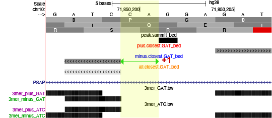
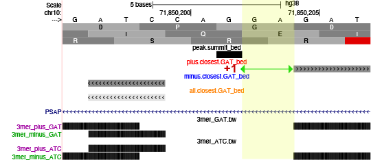

```{css, echo=FALSE}
body .main-container {
  max-width: 1200px !important;
  width: 1200px !important;
}
body {
  max-width: 1200px !important;
}

pre {
  max-height: 600px;
  overflow-y: auto;
}

pre[class] {
  max-height: 600px;
}
```

```{css, echo=FALSE}
.watch-out {
  background-color: lightcyan;
  border: 3px solid lightgrey;
  font-weight: bold;
}

.revision {
  background-color: lightpink;
  border: 3px solid lightgrey;
  font-weight: bold;
}

.highlighted
{
   color:red;
}

.highlighted2
{
  color:blue
}
```

```{r engine='R', eval=TRUE, echo=F}
knitr::opts_chunk$set(class.source = "watch-out")
```

# Nov 28th

## Goal
The overall goal of this analysis is to visualize the distribution of 3mer-GAT corresponding to its closest ChIP peak summit. \
**Step1**: find the closest 3mer-GAT to each ChIP peak summit. \
**Step2**: set closest 3mer-GAT as the new anchor point; draw composite profile of 3mer-GAT distribution upstream/downstream of the anchor point. \

## Install required packages
Install `bigWig` package \
```{r engine='R', eval=TRUE, echo=T}
install.packages("devtools")
library(devtools)
devtools::install_github('andrelmartins/bigWig',
              subdir='bigWig')
library(bigWig)

install.packages("latticeExtra")
```

Install `bedtools` \
```{r engine='bash', eval=F, echo=T}
/bin/bash -c "$(curl -fsSL https://raw.githubusercontent.com/Homebrew/install/HEAD/install.sh)"
brew install bedtools
```

## step1: find the closest 3mer-GAT to each ChIP peak summit
In this section, we first use `seqOutBias` to generate all 3mer coordinates file, then we use Bedtools `closestbed` to find overlap/closest GAT to each provided peak summit. \

### Generate the 3mer coordinates file on the reference genome.

**3mer_df**: generating a .txt file where the first column are all 64 3mer, second column are the index, and the third column are the corresponding reversed 3mer's index (indexrc). \
```{r engine='R', eval=F, echo=TRUE}
#define function to output the reverse compliment sequence
revcomp <- function(sequence) {
  complement_mapping <- c("A" = "T", "T" = "A", "C" = "G", "G" = "C")
  complemented_sequence <- sapply(strsplit(rev(strsplit(sequence, "")[[1]]), NULL), function(base) complement_mapping[base])
  complemented_sequence <- paste(complemented_sequence, collapse = "")
  return(complemented_sequence)
}

# 64 3mer with index
all.64 = expand.grid(rep(list(c('A','C','G','T')), 3))
all.64.df = data.frame(apply(all.64, 1 , paste, collapse = ""))
all.64.df[,1] = all.64.df[order(all.64.df[,1]),]
all.64.df[,2] = 1:64

# 64 reversed 3mer with indexrc
rev.df = data.frame(as.character(all.64.df[,1]))
rev.df[] = apply(rev.df, 1, revcomp)
rev.df[,2] = 1:64
colnames(rev.df)= c('rc', 'indexrc')


colnames(all.64.df) = c('three_mer', 'index')
all.64.df.rc = merge(all.64.df, rev.df, by.x = 'three_mer', by.y = 'rc')
write.table(all.64.df.rc, file = 'all_64_df.txt', quote=FALSE, row.names =FALSE, col.names = FALSE, sep = '\t')
```

```{r engine='bash', eval=TRUE, echo=TRUE}
head all_64_df.txt
```

**Ref Genome**
Here, I use a subset of hg38 genome (2million reads of chr10) as the input reference genome; \
```{r engine='bash', eval=F, echo=TRUE}
#cd /home/FCAM/ssun/Genome/hg38/
wget https://hgdownload.cse.ucsc.edu/goldenpath/hg38/chromosomes/chr10.fa.gz
gunzip chr10.fa.gz
cat /home/FCAM/ssun/Genome/hg38/chr10.fa | head -4000000 > /home/FCAM/ssun/seqoutbias/chr10_kmer3/refreads4M/chr10_4M.fa
```

**seqOutBias**
`seqOutBias seqtable` will generate a seqtable file (.tbl) which is a compressed form that stores the mappability information (if you provide aligned reads info) as well as corresponding parameters (read length, k-mer size, and cut-site offsets). \

`seqOutBias dump` can extract info from the seqtable file and output plain txt file in a form of “chrom:start-end”. It will also list the input parameters (read-size, kmer-size, etc.) that were used to build the sequence table file. \

```{r engine='bash', eval=F, echo=TRUE}
hostname
export PATH=$PATH:/home/FCAM/ssun/packages/://home/FCAM/ssun/scripts
module load genometools/1.5.10
module load ucsc_genome/2012.05.22
module load rust

# use a small hg38 genome subset (2million reads in chr10)
genome=/home/FCAM/ssun/seqoutbias/chr10_kmer3/refreads4M/chr10_4M.fa 

seqOutBias seqtable ${genome} --read-size=30 --kmer-size=3 --plus-offset=3 --minus-offset=3 --out=chr10_4M.3.3.3.tbl
seqOutBias dump chr10_4M.3.3.3.tbl > chr10_4M.3.3.3.dump.txt
```

The output "chr10_4M.3.3.3.dump.txt" file is 2GB large, a subset of the top 500 lines from this large file is saved (head500_chr10_4M.3.3.3.dump.txt) and can be visualize here: \
```{r engine='bash', eval=T, echo=TRUE}
head -15 head500_chr10_4M.3.3.3.dump.txt
```

In this dump.txt file, the first column is chromosome region (of each base position), the second and third columns are index and reversed index. We see many 0s in 2nd and 3rd columns in the above headed file, because these are Ns in the beginning of chromosome genome file. These Ns come from repetitive DNA sequences such as telomeres and centromeres that is hard for sequencer to recognize. \

In the next step, we use a python script `dump_to_kmer.py` to generate 128 (64 3mer +64 reversed 3mer) .bed files that contain the 3mer coordinates info (chr-start-end-index-inderc-strand-3mersequence). \
```{r engine='bash', eval=F, echo=TRUE}
mkdir seqdump_test
mv chr10_4M.3.3.3.dump.txt seqdump_test
mv all_64_df.txt seqdump_test
cd seqdump_test

while read line; do
 mer=$(echo $line | awk -F" " '{print $1}')
 idx=$(echo $line | awk -F" " '{print $2}')
 rcidx=$(echo $line | awk -F" " '{print $3}')
 echo $mer
 echo $idx
 echo $rcidx
 python /home/FCAM/ssun/scripts/dump_to_kmer.py -i chr10_4M.3.3.3.dump.txt -p $idx -m $rcidx -s $mer
done <all_64_df.txt
```


**coherence check** \

To test if the output .bed file indeed contains the corresponding 3mer sequence at its genome coordinates, we use `bedtools getfasta` to extract the actual sequence from reference genome based on the provided bed coordinates. \

```{r engine='bash', eval=F, echo=TRUE}
#bed to fasta (extract the actual sequence from reference genome based on the provided bed coordinates)
module load bedtools
genome=/home/FCAM/ssun/seqoutbias/chr10_kmer3/refreads4M/chr10_4M.fa 
plus_file=/labs/Guertin/siyu/Sathyan_GATA3_ChIP_pool1_pool2/overrep_3mer/seqdump_test/chr10_4M.3.3.3plus.36_GAT.bed
minus_file=/labs/Guertin/siyu/Sathyan_GATA3_ChIP_pool1_pool2/overrep_3mer/seqdump_test/chr10_4M.3.3.3minus.14_GAT.bed
bedtools getfasta -fi ${genome} -bed ${plus_file}  -fo chr10_4M.3.3.3plus.36_GAT.fasta
bedtools getfasta -fi ${genome} -bed ${minus_file}  -fo chr10_4M.3.3.3minus.14_GAT.fasta
```

Here I am doing two coherence check: \
First see if `bedtools getfasta` successfully converting .bed to .fa without losing any information. We use `wc -l` to get total number of lines in each files; \
We also want to know if the .bed coordinates represents the expected 3mer sequence, we can use `grep` and `wc -l` to get number of lines contains the expected sequence (GAT or ATC) in the .fa file. If coordinates in .bed are accurate, we should have same number of lines containing GAT or ATC in .fa file as the .bed file.\

```{r engine='bash', eval=T, echo=TRUE}
x=$(wc -l chr10_4M.3.3.3plus.36_GAT.bed | awk '{print $1}')
y=$(wc -l chr10_4M.3.3.3plus.36_GAT.fasta | awk '{print $1/2}')
z=$(cat chr10_4M.3.3.3plus.36_GAT.fasta | grep "GAT" --ignore-case | wc -l)

echo "chr10_4M.3.3.3plus.36_GAT.bed file contsins " $x "lines, bedtools getfasta converts the bed file to a fasta file, which contains " $y "lines."
echo "In chr10_4M.3.3.3plus.36_GAT.fasta file, there are " $z "GAT."

x=$(wc -l chr10_4M.3.3.3minus.14_GAT.bed |  awk '{print $1}')
y=$(wc -l chr10_4M.3.3.3minus.14_GAT.fasta | awk '{print $1/2}')
z=$(cat chr10_4M.3.3.3minus.14_GAT.fasta | grep "atc" --ignore-case | wc -l )

echo "chr10_4M.3.3.3minus.14_GAT.bed file contsins " $x "lines, bedtools getfasta converts the bed file to a fasta file, which contains " $y "lines."
echo "In chr10_4M.3.3.3minus.14_GAT.fasta file, there are " $z "GAT."
```

**convert to bigWig** \
Since these 3mer coordinates files are one of the input in making composite profile with , we need to convert them from .bed to .bigWig. We first use `bedtools genomecov -bg` to convert .bed format to .bedGraph, then use UCSC `bedGraphToBigWig` to convert from .bedGraph to .bw. \

1) plus_GAT & minus_GAT: \

view the .bed file content. \
```{r engine='bash', eval=TRUE, echo=TRUE}
#GAT
plus_file=chr10_4M.3.3.3plus.36_GAT.bed
minus_file=chr10_4M.3.3.3minus.14_GAT.bed
echo "plus_GAT (.bed)"
head -5  ${plus_file}
echo "minus_GAT (.bed)"
head -5 ${minus_file}
```
sort the .bed file: \

```{r engine='bash', eval=F, echo=TRUE}
sort -k1,1 -k2,2n ${plus_file} > testplus.36_GAT_sorted.bed
sort -k1,1 -k2,2n ${minus_file} > testminus.14_GAT_sorted.bed
```

word count and visualize the documents to make sure file are sorted without losing any information. \

```{r engine='bash', eval=TRUE, echo=TRUE}
x=$(wc -l testplus.36_GAT_sorted.bed | awk '{print $1}')
echo "The sorted plus_GAT .bed file contains" $x "lines."
head -5 testplus.36_GAT_sorted.bed

y=$(wc -l testminus.14_GAT_sorted.bed | awk '{print $1}')
echo "The sorted minus_GAT .bed file contains" $y "lines."
head -5  testminus.14_GAT_sorted.bed
```
Use `bedtools genomecov -bg` to convert .bed to .bedGraph. \

```{r engine='bash', eval=F, echo=TRUE}
module load bedtools
module load ucsc_genome/2012.05.22

sizes=/home/FCAM/ssun/Genome_pro/hg38.chrom.sizes
#bedtools genomecov tool
bedtools genomecov -bg -i testplus.36_GAT_sorted.bed -g ${sizes} > testplus.36_GAT.bedGraph 
bedtools genomecov -bg -i testminus.14_GAT_sorted.bed -g ${sizes} > testminus.14_GAT.bedGraph 
```

The below chunks are doing coherence check to see if `bedtools genomecov` converting from .bed to .bedGraph loses any information. \
```{r engine='bash', eval=TRUE, echo=TRUE}
x=$(wc -l testplus.36_GAT.bedGraph | awk '{print $1}')
y=$(cat testplus.36_GAT.bedGraph | awk '{print $4}' | sort -nr | head -1)
echo "The plus_GAT .bedGraph file contains" $x "lines; and the max coverage of this bedgraph file is" $y "."
head -5 testplus.36_GAT.bedGraph 

z=$(wc -l testminus.14_GAT.bedGraph | awk '{print $1}')
e=$(cat testminus.14_GAT.bedGraph | awk '{print $4}' | sort -nr | head -1)
echo "The minus_GAT .bedGraph file contains" $z "lines; and the max coverage of this bedgraph file is" $e "."
head -5 testminus.14_GAT.bedGraph 
```
The .bedGraph converted from .bed with `bedtools genomecov` has less genome coordinates entry. This is because the original .bed file contains adjacent regions, and `bedtools genomecov` collapse these regions into a single entry in the BEDGraph file by merging or summarizing the coverage data. See one example below: \

```{r engine='bash', eval=TRUE, echo=TRUE}
echo "the original .bed has two GAT coordinates next to each other."
head -3207  testminus.14_GAT_sorted.bed | tail -2
echo ".bedGraph has one row that spans 6bp." 
head -3154 testminus.14_GAT.bedGraph | tail -1
```

A coherence check here could be:  \
word count the original .bed file (3mer coordinates), and confirm that every coordinates entry in that file has 3 bp distance between chromosome start and end: \
```{r engine='bash', eval=TRUE, echo=TRUE}
wc -l testplus.36_GAT_sorted.bed
awk '{ if (($3 - $2) == 3) print $0 }' testplus.36_GAT_sorted.bed | wc -l

wc -l testminus.14_GAT_sorted.bed
awk '{ if (($3 - $2) == 3) print $0 }' testminus.14_GAT_sorted.bed | wc -l
```
Then we can run `awk` on .bedGraph file to output all coordinate entry that spans larger than 3bp between chr start and end.  \
We can calculate the sum of these spanned distance, then calculate how many 3mer regions are collapsed together by dividing this sum of distance by 3.  \
```{r engine='bash', eval=TRUE, echo=TRUE}
plus_collapsed_3mer=$(awk '{ if (($3 - $2) > 3) print $0 }' testplus.36_GAT.bedGraph | awk 'BEGIN{OFS="\t"} {$5=$3-$2; print}' | awk '{sum += $5} END {print sum/3}')
minus_collapsed_3mer=$(awk '{ if (($3 - $2) > 3) print $0 }' testminus.14_GAT.bedGraph | awk 'BEGIN{OFS="\t"} {$5=$3-$2; print}' | awk '{sum += $5} END {print sum/3}')

plus_entry3=$(awk '{ if (($3 - $2) == 3) print $0 }' testplus.36_GAT.bedGraph | wc -l)
minus_entry3=$(awk '{ if (($3 - $2) == 3) print $0 }' testminus.14_GAT.bedGraph | wc -l)

echo "In testplus.36_GAT.bedGraph file, " ${plus_collapsed_3mer} "3mer region are collapsed, and" ${plus_entry3} "remains the same 3bp coordinates as the original .bed file." 
echo " "
echo "Adding the two numbers together, we have" $(echo "scale=2 ; $plus_collapsed_3mer + $plus_entry3" | bc) "."
echo " "
echo " "
echo "In testminus.14_GAT.bedGraph file, " ${minus_collapsed_3mer} "3mer region are collapsed, and" ${minus_entry3} "remains the same 3bp coordinates as the original .bed file." 
echo " "
echo "Adding the two numbers together, we have" $(echo "scale=2 ; $minus_collapsed_3mer + $minus_entry3" | bc) "."
```
<span class="highlighted2">These collapsed region won't affect our downstream analysis. Because we are calling closest 3mer to peak summit only using the .bed file.</span>  \

The final step is to convert .bedGraph to .bigWig with `UCSC bedGraphToBigWig` tool. \
```{r engine='bash', eval=F, echo=TRUE}
#UCSC bedGraphToBigWig tool
bedGraphToBigWig testplus.36_GAT.bedGraph ${sizes} testplus.36_GAT.bigWig
bedGraphToBigWig testminus.14_GAT.bedGraph ${sizes} testminus.14_GAT.bigWig
```

A UCSC genome browser trackhub (http://guertinlab.cam.uchc.edu/test_hub/hub.txt) is created to allow visualizing the 3mer position on genome. \

**2) plus_ATC & minus_ATC:** \
ATC is the reverse compliment of GAT, which means that plus ATC contain same information as minus GAT; and minus ATC contain same info as plus GAT. \
Thus, this 3mer-ATC coordinate files are good resources in doing coherence check later. Here we are converting this 3mer coordinate bed to bigWig as well. \
```{r engine='bash', eval=F, echo=TRUE}
#ATC
plus_file=chr10_4M.3.3.3plus.14_ATC.bed
minus_file=chr10_4M.3.3.3minus.36_ATC.bed
sizes=/home/FCAM/ssun/Genome_pro/hg38.chrom.sizes
#bed to bigwig
module load bedtools
module load ucsc_genome/2012.05.22

sort -k1,1 -k2,2n ${plus_file} > testplus.14_ATC_sorted.bed
sort -k1,1 -k2,2n ${minus_file} > testminus.36_ATC_sorted.bed

bedtools genomecov -bg -i testplus.14_ATC_sorted.bed -g ${sizes} > testplus.14_ATC.bedGraph 
bedtools genomecov -bg -i testminus.36_ATC_sorted.bed -g ${sizes} > testminus.36_ATC.bedGraph 

#UCSC bedGraphToBigWig tool
bedGraphToBigWig testplus.14_ATC.bedGraph ${sizes} testplus.14_ATC.bigWig
bedGraphToBigWig testminus.36_ATC.bedGraph ${sizes} testminus.36_ATC.bigWig
```

```{r engine='bash',  eval=TRUE, echo=TRUE}
wc -l chr10_4M.3.3.3plus.14_ATC.bed
wc -l chr10_4M.3.3.3minus.36_ATC.bed
echo " "
wc -l testplus.14_ATC_sorted.bed
wc -l testminus.36_ATC_sorted.bed
echo " "
wc -l testplus.14_ATC.bedGraph 
wc -l testminus.36_ATC.bedGraph
```

<span class="highlighted2">Most entry in plus_GAT.bed and minus_ATC.bed are overlapped/same (they should contain same information); **however**, there are some entries **different** in the two (supposely same) files. See example below:</span> \
```{r engine='bash', eval=TRUE, echo=TRUE}
head -85 testplus.36_GAT_sorted.bed | tail -6
wc -l testplus.36_GAT_sorted.bed
echo ""
head -85 testminus.36_ATC_sorted.bed | tail -6
wc -l testminus.36_ATC_sorted.bed
```

<span class="highlighted2">**Why seqoutbias generate different 3mer coordinates for reverse complimented 3mer?**</span> \

<span class="highlighted2">This could due to the nature of how seqOutbias performs its search on the given genome read size. Since ~5% of coordinates are unique in plus_GAT and minus_ATC, this fraction of differences in the two files could affect our downstream analysis when we start to employ whole genome 3mer coordinates.</span> \

<span class="highlighted2">In the previous `seqOutbias` process while generating the 3mer coordinates relative to small subset of ref genome (chr10.4M), we have defined a read size of 30. We will try generating 3mer coordinates use <span class="highlighted">read size ==1000</span>, and see if increasing read size can decrease the number of unique 3mer regions.</span> \
```{r engine='bash', eval=F, echo=TRUE}
export PATH=$PATH:/home/FCAM/ssun/packages/://home/FCAM/ssun/scripts
module load genometools/1.5.10
module load ucsc_genome/2012.05.22
module load rust

#try a small genome subset (4million raads in chr10)
genome=/home/FCAM/ssun/seqoutbias/chr10_kmer3/refreads4M/chr10_4M.fa 

seqOutBias seqtable ${genome} --kmer-size=3 --plus-offset=3 --minus-offset=3 --read-size=1000 --out=chr10_4M.3.3.3.1000.tbl
seqOutBias dump chr10_4M.3.3.3.1000.tbl > chr10_4M.3.3.3.1000.dump.txt
mkdir seqdump_1000test
mv chr10_4M.3.3.3.1000.dump.txt seqdump_1000test
mv all_64_df.txt seqdump_1000test
cd seqdump_1000test

while read line; do
 mer=$(echo $line | awk -F" " '{print $1}')
 idx=$(echo $line | awk -F" " '{print $2}')
 rcidx=$(echo $line | awk -F" " '{print $3}')
 echo $mer
 echo $idx
 echo $rcidx
 python /home/FCAM/ssun/scripts/dump_to_kmer.py -i chr10_4M.3.3.3.1000.dump.txt -p $idx -m $rcidx -s $mer
done <all_64_df.txt
```

<span class="highlighted2">**use read size ==30**</span> \
```{r engine='bash', eval=TRUE, echo=TRUE}
wc -l chr10_4M.3.3.3minus.36_ATC.bed  
wc -l chr10_4M.3.3.3plus.36_GAT.bed
echo ""
wc -l chr10_4M.3.3.3minus.14_GAT.bed  
wc -l chr10_4M.3.3.3plus.14_ATC.bed
```
Count and extract different entries from plus_GAT and minus_ATC .bed. \
```{r engine='bash', eval=TRUE, echo=TRUE}
awk 'NR==FNR {arr[$1,$2,$3]; next} ! (($1,$2,$3) in arr)' testminus.36_ATC_sorted.bed testplus.36_GAT_sorted.bed > different_plus.36_GAT.bed
awk 'NR==FNR {arr[$1,$2,$3]; next} ! (($1,$2,$3) in arr)' testplus.36_GAT_sorted.bed testminus.36_ATC_sorted.bed > different_minus.36_ATC.bed
wc -l different_plus.36_GAT.bed
head -5 different_plus.36_GAT.bed
tail -5 different_plus.36_GAT.bed
echo ""
wc -l different_minus.36_ATC.bed
head -5 different_minus.36_ATC.bed
tail -5 different_minus.36_ATC.bed
```
<span class="highlighted">79582/1577317 ~ 5%</span> \
<span class="highlighted">73947/1571682 ~4.7%</span> \

<span class="highlighted2">**use read size ==1000**</span> \
```{r engine='bash', eval=TRUE, echo=TRUE}
wc -l chr10_4M.3.3.3.1000minus.36_ATC.bed  
wc -l chr10_4M.3.3.3.1000plus.36_GAT.bed
echo ""
wc -l chr10_4M.3.3.3.1000minus.14_GAT.bed  
wc -l chr10_4M.3.3.3.1000plus.14_ATC.bed
```
Count and extract different entries from plus_GAT and minus_ATC .bed. use read size ==1000: \
sort the two corresponding file: \
```{r engine='bash', eval=TRUE, echo=TRUE}
sort -k1,1 -k2,2n chr10_4M.3.3.3.1000plus.36_GAT.bed > testplus.36.1000_GAT_sorted.bed
sort -k1,1 -k2,2n chr10_4M.3.3.3.1000minus.36_ATC.bed > testminus.36.1000_ATC_sorted.bed 
wc -l chr10_4M.3.3.3.1000plus.36_GAT.bed
wc -l testplus.36.1000_GAT_sorted.bed
echo ""
wc -l chr10_4M.3.3.3.1000minus.36_ATC.bed
wc -l testminus.36.1000_ATC_sorted.bed
```

```{r engine='bash', eval=TRUE, echo=TRUE}
#this awk command only report different lines in file2:
awk 'NR==FNR {arr[$1,$2,$3]; next} ! (($1,$2,$3) in arr)' testminus.36.1000_ATC_sorted.bed testplus.36.1000_GAT_sorted.bed > different_plus.36.1000_GAT.bed
awk 'NR==FNR {arr[$1,$2,$3]; next} ! (($1,$2,$3) in arr)' testplus.36.1000_GAT_sorted.bed testminus.36.1000_ATC_sorted.bed > different_minus.36.1000_ATC.bed

wc -l different_plus.36.1000_GAT.bed
head -5 different_plus.36.1000_GAT.bed
tail -5 different_plus.36.1000_GAT.bed
echo ""
wc -l different_minus.36.1000_ATC.bed
head -5 different_minus.36.1000_ATC.bed
tail -5 different_minus.36.1000_ATC.bed
```

<span class="highlighted">388/1765438 ~0.02%</span> \
<span class="highlighted">400/1765450 ~0.02%</span> \

Increasing `seqOutbias` read size parameter from 30 to 1000, causes the difference between plus_GAT and minus_ATC decreases from 5% to 0.02%. \
**Conclusion**: While running `seqOutbias` to generate we should use a **large read size** to limit the differences between the two corresponding files. \

### Prepare the peak summit file
As a <span class="highlighted2">**positive control**</span>, we want to subset peaks enriched with known GATA3-like de novo motif. \

In previous MCF7 GATA3 ChIP-seq analysis, we identify top enriched motif to be GATA-like. In the second round of exhaustive MEME -MAST analysis, the top enriched GATA-like motif has a unique structure -- <span class="highlighted">**4bp spacing between a GAT site and a ATC site**</span>. \

```{r  fig.align = "center", out.width="50%", out.height="50%", echo=F, fig.align = "center", fig.cap="GATA3 motif variants 2"}
library(knitr)
 
```

**Input 1** A peak summit file. This file was originally generated with `Macs3` during peak calling step, then processed by removing peaks on contigs and within blacklisted regions, finally we use `slopBed -b 50` to make 50bp window at up/downstream of the summit, respectively. \

```{r engine='bash', eval=T, echo=TRUE}
wc -l GATA_ChIP_summits.bed
head -5 GATA_ChIP_summits.bed
echo ""
wc -l GATA_ChIP_summits_final.bed
head -5 GATA_ChIP_summits_final.bed
echo ""
wc -l GATA_ChIP_summit_100window.bed
head -5 GATA_ChIP_summit_100window.bed
```


**Input 2**  motif occurence in peak region. \

We have used `MAST` to find this unique motif's occurrence in ChIP peak. The motif coordinates information are stored in "mast_GATA3_PSWM_in_peaks_round2.bed".  \
```{r engine='bash', eval=T, echo=TRUE}
wc -l mast_GATA3_PSWM_in_peaks_round2.bed
head -5 mast_GATA3_PSWM_in_peaks_round2.bed
```
Now, we can use `intersectBed` to find peak with this unique motif, and make a peak summit file. \
`intersectBed -wa` (refer to https://bedtools.readthedocs.io/en/latest/content/tools/intersect.html) reports original entry in A for each overlap. \

```{r engine='bash', eval=F, echo=TRUE}
module load bedtools
#cd /home/FCAM/ssun/GATA3_ChIP_PRO_July2023/ChIP_final/de_novo_motif/
dir=/home/FCAM/ssun/GATA3_ChIP_PRO_July2023/ChIP_final/peak_call/
motif_cor=mast_GATA3_PSWM_in_peaks_round2.bed

#peaks with motif2
intersectBed -wa -a ${dir}GATA_ChIP_summit_100window.bed -b ${motif_cor} > with_motif_2_100win.bed 
```

This bed file stores peak information of chr, start, end, peak-index, intensity. The peak coordinates have a 100bp window, we will center them to 1bp summit later. \

```{r engine='bash', eval=TRUE, echo=TRUE}
head with_motif_2_100win.bed 
```

<span class="highlighted2">**In the above analysis, we choose an arbitrary 100bp window to query for peaks with GATA-like motif2, this is risky because we might lose information if motif exceeds this window. A better way to decide the summit window is: first use `closestBed` to find peak summit (1bp) to the closest motif; then plot the distribution of closest motif distance to summit; we also want to plot the peak intensity. Based on these analysis, we can choose an appropriate window. (do this later)**</span> \

<span class="highlighted">Two Inputs: 1) peak summit file (all the peaks); 2) motif coordinates file.</span> \

<span class="highlighted">We want to do this unbiasly and with proper control. Thus :</span> \

<span class="highlighted">First, for peak summit file, we want to use the GATA3 ChIP peak as our test peak, and a control peak set that is not enriched with GATA motifs (i.e., a ENCODE DNase-seq peak Union set);</span> \
<span class="highlighted">Next, we want to use all GATA3 motif variants we have.</span> \

<span class="highlighted">One thing to consider is that, to make this analysis less bias, we probably want to use motif coordinates that was retrieved from genome by `FIMO`. </span>


<!--
```{r engine='R', eval=F, echo=F}
# define functions

#closestbed 
bedTools.closest <- function(functionstring="/usr/local/bin/closestBed",bed1,bed2,opt.string="") {
  
  options(scipen =99) # not use scientific notation when writing out
  
  #write bed formatted data.frames to tempfile
  write.table(bed1,file= 'a.file.bed', quote=F,sep="\t",col.names=F,row.names=F)
  write.table(bed2,file= 'b.file.bed', quote=F,sep="\t",col.names=F,row.names=F)
  
  # create the command string and call the command using system()
  # the command sort a and b file by coordinates
  command1=paste('sort -k1,1 -k2,2n', 'a.file.bed', '> a.file.sorted.bed')
  cat(command1,"\n") #sort -k1,1 -k2,2n a.file.bed > a.file.sorted.bed
  try(system(command1))
  command2=paste('sort -k1,1 -k2,2n', 'b.file.bed', '> b.file.sorted.bed')
  cat(command2,"\n")
  try(system(command2))
  
  # the command call closestBed on bed1 and bed2
  command=paste(functionstring, opt.string,"-a",'a.file.sorted.bed',"-b",'b.file.sorted.bed',">",'out.file.bed',sep=" ")
  cat(command,"\n")
  try(system(command))
  
  res=read.table('out.file.bed',header=F, comment.char='')
  
  # remove intermediate files
  command3=paste('rm', 'a.file.bed', 'b.file.bed', 'a.file.sorted.bed', 'b.file.sorted.bed', 'out.file.bed')
  cat(command3,"\n")
  try(system(command3))
  
  colnames(res) = c(colnames(bed1), colnames(bed2), 'dis' )
  return(res)
}
```

```{r engine='R', class.source = "revision", eval=F, echo=F}
peak_summit=read.table("GATA_ChIP_summits.bed", header=FALSE)
motif_coor=read.table("mast_GATA3_PSWM_in_peaks_round2.bed", header=FALSE)
head(peak_summit)
head(motif_coor)
```

```{r engine='R', class.source = "revision", eval=F, echo=F}
motif.distance=bedTools.closest(bed1 = peak_summit[,1:3], bed2 = motif_coor[,c(1,2,3,6)], opt.string = '-d -t first')

write.table(motif.distance,file= 'motif.distance.bed', quote=F,sep="\t",col.names=F,row.names=F)
```
```{r engine='R', class.source = "revision",eval=F, echo=F}
motif.distance=read.table('motif.distance.bed',header=F, comment.char='')
colnames(motif.distance)[8]="dis"
head(motif.distance)
summary(motif.distance$dis) 
```

```{r engine='R', class.source = "revision", eval=F, echo=F}
library(lattice)
library(latticeExtra)
ecdfplot(~log(abs(dis), base = 10), 
         #groups = status, 
         data = motif.distance,
         #auto.key = list(space = "right", lines=TRUE, points=FALSE, cex = cex),
         #col = col.lines,
         aspect = 1,
         scales=list(relation="free",alternating=c(1,1,1,1)),
         ylab = 'Cumulative Distribution Function',
         xlab = expression('log'[10]~'GATA3 motif Distance from peak summit'),
         #main ="" ,
         between=list(y=1.0),
         type = 'a',
         xlim = c(0,8),
         lwd=2,
         lty=c(1),
         par.settings = list(superpose.line = list(col = "#2290cf", lwd=3), strip.background=list(col="grey85")),
         panel = function(...) {
             panel.abline(v= 1.7, lty =2)
             panel.ecdfplot(...)
         })
```
```{r engine='R', class.source = "revision", eval=F, echo=F}
densityplot(~ log(abs(dis), base = 10), 
            data = motif.distance,
            main = "Probability Density Function (PDF)",
            xlab = expression('log'[10]~'GATA3 motif Distance from peak summit'), 
            ylab = "Density")

```
-->


<span class="highlighted">**plot peak intensity**</span>

... \


### find the closest 3mer-GAT to peak summit with `closestBed`
In this section, we use `bedtools closestBed` (refer to: https://bedtools.readthedocs.io/en/latest/content/tools/closest.html) to find the closest GAT to each provided peak summit. \
Input: \
`-a` is the sorted peak summit file (centered 1bp); \
`-b` is the sorted, and concatenated GAT coordinates file (both plus and minus); \

**Prepare the input file -a: peak summit file (centered 1bp)** \

```{r engine='R', eval=TRUE, echo=TRUE}
#load files contains ChIP summit info 
chip.peak.summit=read.table("with_motif_2_100win.bed", header=FALSE)
head(chip.peak.summit)
nrow(chip.peak.summit)
#get the center of summit (1bp) with bigWig package
library(bigWig)
chip.peak.summit1=center.bed(chip.peak.summit, upstreamWindow = 0, downstreamWindow = 0)
head(chip.peak.summit1)
nrow(chip.peak.summit1)
```


Subset only chr10 peak summit \

```{r engine='R', eval=TRUE, echo=TRUE}
chip.peak.summit.chr10.4M=chip.peak.summit1[chip.peak.summit1$V1=="chr10",] 

nrow(chip.peak.summit.chr10.4M) #580
head(chip.peak.summit.chr10.4M)
```

**Prepare the input file -b: concatenated GAT coordinates file** \

Here I am concatenate the plus.36_GAT.bed and minus.14_GAT.bed together. \
```{r engine='R', eval=TRUE, echo=TRUE}
#load files contains 3mer coordinates info
#plus
plus.GAT.file=read.table(file = "chr10_4M.3.3.3plus.36_GAT.bed", sep="\t", header=FALSE)
#minus
minus.GAT.file=read.table(file = "chr10_4M.3.3.3minus.14_GAT.bed", sep="\t", header=FALSE)
#concatenate the plus and minus file together
all.GAT.file=rbind(plus.GAT.file, minus.GAT.file)
head(all.GAT.file)
tail(all.GAT.file)
```


**bedtools closestBed** \
The below function will sort input bed1 and bed2 first, then run `bedtools closestBed` between bed1 and bed2. \
```{r engine='R', eval=TRUE, echo=TRUE}
# define function 
bedTools.closest <- function(functionstring="/usr/local/bin/closestBed",bed1,bed2,opt.string="") {
  
  options(scipen =99) # not use scientific notation when writing out
  
  #write bed formatted data.frames to tempfile
  write.table(bed1,file= 'a.file.bed', quote=F,sep="\t",col.names=F,row.names=F)
  write.table(bed2,file= 'b.file.bed', quote=F,sep="\t",col.names=F,row.names=F)
  
  # create the command string and call the command using system()
  # the command sort a and b file by coordinates
  command1=paste('sort -k1,1 -k2,2n', 'a.file.bed', '> a.file.sorted.bed')
  cat(command1,"\n") #sort -k1,1 -k2,2n a.file.bed > a.file.sorted.bed
  try(system(command1))
  command2=paste('sort -k1,1 -k2,2n', 'b.file.bed', '> b.file.sorted.bed')
  cat(command2,"\n")
  try(system(command2))
  
  # the command call closestBed on bed1 and bed2
  command=paste(functionstring, opt.string,"-a",'a.file.sorted.bed',"-b",'b.file.sorted.bed',">",'out.file.bed',sep=" ")
  cat(command,"\n")
  try(system(command))
  
  res=read.table('out.file.bed',header=F, comment.char='')
  
  # remove intermediate files
  command3=paste('rm', 'a.file.bed', 'b.file.bed', 'a.file.sorted.bed', 'b.file.sorted.bed', 'out.file.bed')
  cat(command3,"\n")
  try(system(command3))
  
  colnames(res) = c(colnames(bed1), colnames(bed2), 'dis' )
  return(res)
}
```

Parameter `-d` will report the distance from the closest GAT to the peak summit. \
Parameter `-t last` or `-t first` will only report either the last or the first entry in bed2 file if tied distance occurred. \
Here we choose to use `-t first` to report the first coordinates when tie occurred. \

Find the closest GAT to peak summit regardless of GAT strandedness \
```{r engine='R', eval=F, echo=TRUE}
all.distance=bedTools.closest(bed1 = chip.peak.summit.chr10.4M[,1:3], bed2 = all.GAT.file, opt.string = '-d -t first')
write.table(all.distance,file= 'all.distance.bed', quote=F,sep="\t",col.names=F,row.names=F)
```
In this "all.distance' data frame, V1 to V3 are peak summit coordinates, V4 to V9 are `closestBed` reported **closest motif** to each peak summit. The last column (V11) is the distance from closest motif to peak summit. \
```{r engine='R', eval=TRUE, echo=TRUE}
all.distance=read.table('all.distance.bed',header=F, comment.char='')
head(all.distance)
```

**coherence check 1**: the number of the closest minus GAT is comparable to the number of the closest plus GAT. \


```{r engine='R',eval=TRUE, echo=TRUE}
nrow(all.distance)
nrow(all.distance[all.distance$V9=="+",])
nrow(all.distance[all.distance$V9=="-",])
```

In previous chunk we get 290 + GAT and 290 - GAT being the closest to peak summit, is this even number just a coincidence? Here I subset 100 peak to rerun `closestBed`, then check on numbers of +GAT and -GAT, they are 51 and 49.  \
```{r engine='R', eval=F, echo=TRUE}
all.distance.100=bedTools.closest(bed1 = chip.peak.summit.chr10.4M[1:100,1:3], bed2 = all.GAT.file, opt.string = '-d -t first')
nrow(all.distance.100)
nrow(all.distance.100[all.distance.100$V6=="+", ]) #51
nrow(all.distance.100[all.distance.100$V6=="-", ]) #49
```

**coherence check 2**: Since we have use `-t first` to take care of the tie, now we have equal number of unique peak with their closest plus or minus or both GAT. \
```{r engine='R', eval=TRUE, echo=TRUE}
nrow(chip.peak.summit.chr10.4M) # there are 580 unique peak (contains motif 2)
nrow(all.distance)  
```
<!--
**coherence check 3**: taking care of tied GAT coordinates \

If tied distances occurred, `bedtools closestBed` by default will report both coordinates in b file, this is why we have duplicated peaks. Parameter `-t first/last` can report either the first in the tie or the last in the tie. \

Taking the below tied GAT coordinates as an example. GAT coordinates A: chr10:13679939:13679942 and B: chr10:13679945:13679948 have same distance to the same peak summit. If keep both A and B as closest GAT to this summit, we will end up making both of them the new anchor point. Then A will find B as closest GAT, B will find A as closest GAT. \
```{r engine='R', eval=F, echo=TRUE}
#example
all.distance[all.distance$V2=="13679943",] 
```

**coherence check 4**: find the duplicated peaks due to tie \

If tie occurs, report only the first GAT with `-t first`. \
If tie occurs, report only the first GAT with `-t last`. \
```{r engine='R', eval=F, echo=TRUE}
all.distance.first=bedTools.closest(bed1 = chip.peak.summit.chr10.4M[,1:3], bed2 = all.GAT.file, opt.string = '-d -t first')
all.distance.last=bedTools.closest(bed1 = chip.peak.summit.chr10.4M[,1:3], bed2 = all.GAT.file, opt.string = '-d -t last')
write.table(all.distance.first,file= 'all.distance.first.bed', quote=F,sep="\t",col.names=F,row.names=F)
write.table(all.distance.last,file= 'all.distance.last.bed', quote=F,sep="\t",col.names=F,row.names=F)
```

```{r engine='R', eval=F, echo=TRUE}
all.distance.first=read.table('all.distance.first.bed',header=F, comment.char='')
all.distance.last=read.table('all.distance.last.bed',header=F, comment.char='')
nrow(all.distance.first) #580
nrow(all.distance.last) #580
```

find peaks with different closest GAT assigned that has same distance to the summit \
```{r engine='R', eval=F, echo=TRUE}
colnames(all.distance.first) <- paste0("V", 1:11)
colnames(all.distance.last) <- paste0("V", 1:11)

find_different_rows <- function(row1, row2) {
  if (any(row1 != row2)) {
    return(TRUE)
  } else {
    return(FALSE)
  }
}

# Initializing an empty list to store different rows
different_rows <- list()

# Comparing each row from df1 with corresponding row in df2
for (i in 1:nrow(all.distance.first)) {
  if (find_different_rows(all.distance.first[i, ], all.distance.last[i, ])) {
    different_rows[[length(different_rows) + 1]] <- all.distance.first[i, ]
    different_rows[[length(different_rows) + 2]] <- all.distance.last[i, ]
  }
}
# Combining the different rows into a dataframe
different_rows_df <- do.call(rbind, different_rows)
nrow(different_rows_df) # 40
head(different_rows_df)
```
20 peaks have tied closest GAT coordinates. \
-->

### visualize 3mer-GAT distribution relative to the defined "closest GAT" on Genome Browser
Previously, we have made a UCSC genome browser trackhub (http://guertinlab.cam.uchc.edu/test_hub/hub.txt) that has the 3mer coordinates region on ref genome. \
We will also upload custom tracks of 1) peak summit file; and 2) closestBed defined closest GAT coordinates (plus, minus, all). \
```{r engine='R', eval=F, echo=TRUE}
#1)peak summit
write.table(chip.peak.summit.chr10.4M[,1:3],file= 'chip.peak.summit.chr10.4M.bed', quote=F,sep="\t",col.names=F,row.names=F)

#2)closest 3mer.bed
write.table(plus.distance[, 4:9],file= 'plus.closest.GAT.bed', quote=F,sep="\t",col.names=F,row.names=F)
write.table(minus.distance[, 4:9],file= 'minus.closest.GAT.bed', quote=F,sep="\t",col.names=F,row.names=F)
write.table(all.distance[, 4:9],file= 'all.closest.GAT.bed', quote=F,sep="\t",col.names=F,row.names=F)
```

Add trackline: \
```{r engine='bash',  eval=F, echo=TRUE}
awk 'BEGIN {print "browser position chr10:16,000-17,000" 
            print "track type=bed name=\"peak.summit.bed\" description=\"peak.summit_bed\" visibility=full autoScale=on useScore=1 color=0,0,0"
            } {print $0}' chip.peak.summit.chr10.4M.bed > chip.peak.summit.chr10.4M_header.bed
           
awk 'BEGIN {print "browser position chr10:16,000-17,000" 
            print "track type=bed name=\"plus.closest.GAT_bed\" description=\"plus.closest.GAT_bed\" visibility=full autoScale=on useScore=1 color=255,0,0"
            } {print $0}' plus.closest.GAT.bed > plus.closest.GAT_header.bed
           
awk 'BEGIN {print "browser position chr10:16,000-17,000" 
            print "track type=bed name=\"minus.closest.GAT_bed\" description=\"minus.closest.GAT_bed\" visibility=full autoScale=on useScore=1 color=0,0,255"
            } {print $0}' minus.closest.GAT.bed > minus.closest.GAT_header.bed

awk 'BEGIN {print "browser position chr10:16,000-17,000" 
            print "track type=bed name=\"all.closest.GAT_bed\" description=\"all.closest.GAT_bed\" visibility=full autoScale=on useScore=1 color=255,128,0"
            } {print $0}' all.closest.GAT.bed > all.closest.GAT_header.bed
```

**How `closestBed` calculates distance?** \

For GAT on plus strand or minus strand, how does `closestBed` calculate the distance? Does it calculate differently considering the strandedness? Does it calculate differently considering upstream or downstream motif coordinates to peak summit? \

To locate a region to visualize on UCSC Genome Browser where the plus GAT and minus GAT has same closest distance to peak summit, Get peak region where the closest plus GAT and closest minus GAT has the same distance to peak summit defined by `bedtools closestBed`. \
```{r engine='R', eval=F, echo=TRUE}
plus.distance=bedTools.closest(bed1 = chip.peak.summit.chr10.4M[,1:3], bed2 = plus.GAT.file, opt.string = '-d -t first')
minus.distance=bedTools.closest(bed1 = chip.peak.summit.chr10.4M[,1:3], bed2 = minus.GAT.file, opt.string = '-d -t first')
write.table(plus.distance,file= 'plus.distance.bed', quote=F,sep="\t",col.names=F,row.names=F)
write.table(minus.distance,file= 'minus.distance.bed', quote=F,sep="\t",col.names=F,row.names=F)
```

```{r engine='R', eval=TRUE, echo=TRUE}
plus.distance=read.table('plus.distance.bed',header=F, comment.char='')
minus.distance=read.table('minus.distance.bed',header=F, comment.char='')
head(plus.distance)
head(minus.distance)
```

```{r engine='R',  eval=TRUE, echo=TRUE}
head(plus.distance[plus.distance$V11 == minus.distance$V11, c('V1', 'V2', 'V3', "V11")])
```

Use peak summit at chr10:71850201-71850202 as an example, plus GAT and minus GAT has same distance =3 reported by `bedtools closestBed`.  \
```{r engine='R', eval=TRUE, echo=TRUE}
minus.distance[minus.distance$V2==71850201,]
plus.distance[plus.distance$V2==71850201,]
all.distance[all.distance$V2==71850201,]
```

See UCSC genome browser shots here: \
```{r  fig.align = "center", out.width="80%", out.height="80%", echo=F, fig.align = "center", fig.cap="closest upstream GAT to peak summit"}
library(knitr)
 
```

```{r  fig.align = "center", out.width="80%", out.height="80%", echo=F, fig.align = "center", fig.cap="closest downstream GAT to peak summit"}
library(knitr)
 
```

In our usage of `closestBed`, we did not consider strandedness, only consider upstream or downstream information during its distance calculation: \

If the 3mer coordinates is <span class="highlighted2">**upstream**</span> of peak summit, `closestBed` will use the peak summit coordinates <span class="highlighted2">END</span> to subtract the 3mer coordinates <span class="highlighted2">START</span>, then <span class="highlighted2">add 1bp</span> as the distance; \
If the 3mer coordinates is <span class="highlighted2">**downstream**</span> of peak summit, `closestBed` will use 3mer coordinates <span class="highlighted2">START</span> to subtract peak summit coordinates class="highlighted2">END</span>, then <span class="highlighted2">add 1bp</span> as the distance;  \
If they have <span class="highlighted2">**overlapped**</span> base, it will report a distance of <span class="highlighted2">0</span>. \

## step2: making composite profile

In this section, we want to draw composite profile of GAT or ATC distribution relative to the anchored closest GAT. \

**We can use the `bigWig` package to query any given 3mer.bigWig file to the anchored GAT position at single base pair resolution, then draw a composite profile to visualize the distribution of the 3mer relative to closest GAT.** \

**Input 1)** two .bigWig files that contain the 3mer coordinates info. \
```{r engine='R', eval=TRUE, echo=TRUE}
library(bigWig)
#GAT on +/- strand
bwPlus_GAT=load.bigWig('testplus.36_GAT.bigWig')
bwMinus_GAT=load.bigWig('testminus.14_GAT.bigWig')

#ATC on +/- strand
bwPlus_ATC=load.bigWig('testplus.14_ATC.bigWig')
bwMinus_ATC=load.bigWig('testminus.36_ATC.bigWig')
```

We can use `query.bigWig` to search the .bigWig file in a genomic window. \

```{r engine='R', eval=TRUE, echo=TRUE}
query.bigWig(bwPlus_GAT, 'chr10', 1000000, 1000500)
query.bigWig(bwMinus_GAT, 'chr10', 1000000, 1000500)
```

**Input 2)** a .bed6 file that contains closest GAT (to peak summit) coordinates info. \

The bed6 file should define the following columns: "chrom - start - end - name - score - strand". `bigWig` functions don’t use name and score. \

```{r engine='R', eval=TRUE, echo=TRUE}
bed6=all.distance[, 4:9] # all.distance -- this is keeping both tied minus/plus GAT
#bed6-plus
bed6_plus=bed6[bed6$V9=="+",]
#bed6-minus
bed6_minus=bed6[bed6$V9=="-",]

nrow(bed6)
nrow(bed6_plus)
nrow(bed6_minus)
```

### Anchor GAT -n- GAT (+/-) 

In this section, we will set the closest 3mer-GAT as anchor point (bed6), then query the 3mer corordinates .bigWig file. \

**Anchor at PLUS closest GAT** \
Take the closest **plus** 3mer-GAT as anchor point and define a new window. \
```{r engine='R', eval=TRUE, echo=TRUE}
#bigWig input
bwPlus_GAT=load.bigWig('testplus.36_GAT.bigWig')
bwMinus_GAT=load.bigWig('testminus.14_GAT.bigWig')
#bed6 input
bedAnchor=bed6_plus

## define new window
bedAnchorwindow=center.bed(bedAnchor, upstreamWindow = 25, downstreamWindow = 25) #from anchor point, add 25bp downstream and upstream
head(bedAnchor)
head(bedAnchorwindow)
```

**Query bigWig** \
I choose to use `bed6.step.bpQuery.bigWig` in the bigWig package. \
I choose `bed6.step` not `bed6.region` because we want to define step=1 to count the observations of 3mer at each 1bp position. \
I also choose `bpQuery` not `probeQuery` because: `bpQuery` evaluate each base position of the original bigWig file without consider each genomic interval input. Consider the nature of our input bigWig files (which is 3mer's coordinates on genome), we want to treat each 3mer separately, and count only once without consider the genomic interval within the 3mer. \

`bed6.bpQuery` search for observations in the .bigWig file with region/range provided by each row in .bed6 file. \
`step queries` breaking the region/range up into equal size steps as defined by "step =". \
we use `step=1` to make single base pair resolution. \
`follow.strand` set to TRUE. This will reverse the direction of - strand output. Since we aim to visualize distribution of the second GAT relative to the anchorred GAT, `follow.strand` set to be TRUE or FALSE doesn't change the conclusion. But set to be TRUE may be easier for visualizing accumulated GAT. \

```{r engine='R', eval=TRUE, echo=TRUE}
Anchor.matrix = bed6.step.bpQuery.bigWig(bwPlus_GAT, bwMinus_GAT, bedAnchorwindow,
                 step = 1, as.matrix=TRUE, follow.strand=TRUE)

head(Anchor.matrix)
colnames(Anchor.matrix) = seq(-25, 25, by = 1)
rownames(Anchor.matrix) = bedAnchorwindow[,5]
#filter out rows with no signal
Anchor.matrix=Anchor.matrix[rowSums(Anchor.matrix) != 0,]
head(Anchor.matrix)
```

```{r engine='R', eval=TRUE, echo=TRUE}
plot(seq(-25, 25, by = 1),colSums(Anchor.matrix),
                  xlab = '3mer (GAT) position',
                  ylab = 'observed 3mer (GAT)', type = "h")
```

<span class="highlighted">In this composite profile, we anchor at the closest **plus GAT**.</span> \
<span class="highlighted">The highest accumulation of observed GAT is at -1, 0, and 1 position. This is because `bed6.step.bpQuery.bigWig` is only querying in **plus GAT.bigWig** file. Thus, each anchored +GAT will find an overlapped +GAT: There are 290 anchored +GAT, so we will see those same 290 plus GAT accumulate at the anchor point.</span>  \

<span class="highlighted">The smaller accumulation at other position, can tell us in **plus strand**, where are the other GAT relative to the anchor point.</span> \


**Anchor at MINUS closest GAT** \

Take the closest **minus** 3mer-GAT as anchor point and define the new window. \
```{r engine='R', eval=TRUE, echo=TRUE}
#bigWig input
bwPlus_GAT=load.bigWig('testplus.36_GAT.bigWig')
bwMinus_GAT=load.bigWig('testminus.14_GAT.bigWig')
#bed6 input
bedAnchor=bed6_minus

## define new window
bedAnchorwindow=center.bed(bedAnchor, upstreamWindow = 25, downstreamWindow = 25) #from anchor point, add 25bp downstream and upstream
head(bedAnchor)
head(bedAnchorwindow)
```

Query.bigWig: \
Notice that `follow.strand` is set to be TRUE. This will reverse the direction of - strand output. \
```{r engine='R', eval=TRUE, echo=TRUE}
Anchor.matrix = bed6.step.bpQuery.bigWig(bwPlus_GAT, bwMinus_GAT, bedAnchorwindow,
                 step = 1, as.matrix=TRUE, follow.strand=TRUE)

head(Anchor.matrix)
colnames(Anchor.matrix) = seq(-25, 25, by = 1)
rownames(Anchor.matrix) = bedAnchorwindow[,5]
#filter out rows with no signal
Anchor.matrix=Anchor.matrix[rowSums(Anchor.matrix) != 0,]
head(Anchor.matrix)
```

```{r engine='R', eval=TRUE, echo=TRUE}
plot(seq(-25, 25, by = 1),colSums(Anchor.matrix),
                  xlab = '3mer (GAT) position',
                  ylab = 'observed 3mer (GAT)', type = "h")
```
<span class="highlighted">In this composite profile, we are seeing similar results.</span> \

<span class="highlighted">This time, we anchor at the closest **minus GAT**.</span> \
<span class="highlighted">The highest accumulation of observed GAT is at -1, 0, and 1 position. This is because `bed6.step.bpQuery.bigWig` is only querying in **minus GAT.bigWig** file. Thus, each anchored -GAT will find an overlapped -GAT: There are 290 anchored -GAT, so we will see those same 290 minus GAT accumulate at the anchor point.</span>  \

<span class="highlighted">The smaller accumulation at other position, can tell us in **minus strand**, where are the other GAT relative to the anchor point.</span> \


**Anchor at closest GAT--BOTH MINUS and PLUS ** \ \

Take the closest 3mer-GAT (**both plus/minus** ) as anchor point and define the new window. \
```{r engine='R', eval=TRUE, echo=TRUE}
#bigWig input
bwPlus_GAT=load.bigWig('testplus.36_GAT.bigWig')
bwMinus_GAT=load.bigWig('testminus.14_GAT.bigWig')
#bed6 input
bedAnchor=bed6

## define new window
bedAnchorwindow=center.bed(bedAnchor, upstreamWindow = 25, downstreamWindow = 25) #from anchor point, add 25bp downstream and upstream
head(bedAnchor)
head(bedAnchorwindow)
```

Query.bigWig \
`follow.strand` set to TRUE. This will reverse the direction of - strand output. \
coherence check (reverse the input minus and plus bigWig) \

```{r engine='R', eval=TRUE, echo=TRUE}
Anchor.matrix = bed6.step.bpQuery.bigWig( bwPlus_GAT, bwMinus_GAT, bedAnchorwindow,
                 step = 1, as.matrix=TRUE, follow.strand=TRUE)

head(Anchor.matrix)
colnames(Anchor.matrix) = seq(-25, 25, by = 1)
rownames(Anchor.matrix) = bedAnchorwindow[,5]
#filter out rows with no signal
Anchor.matrix=Anchor.matrix[rowSums(Anchor.matrix) != 0,]
head(Anchor.matrix)
```

```{r engine='R', eval=TRUE, echo=TRUE}
plot(seq(-25, 25, by = 1),colSums(Anchor.matrix),
                  xlab = '3mer (GAT) position',
                  ylab = 'observed 3mer (GAT)', type = "h")
```

<span class="highlighted">This composite profile is simply the previous two composite plot add together (note the y axis, now the highest accumulation counts for observed GAT is 580). Now we are taking consider of both plus and minus strand, to see where other GAT locate relative to the anchored closest GAT. </span> \


### Anchor GAT -n- ATC (+/-) \
In this section, we want to draw composite profile of ATC distribution relative to the anchored closest GAT. \
Recall that our peak set are enriched with a GATA3 motif look like this: \

```{r  fig.align = "center", out.width="50%", out.height="50%", echo=F, fig.align = "center", fig.cap="GATA3 motif variants 2"}
#library(knitr)
 
```

This motif has a specific structure, that is 3mer-GAT followed by 4 fixed spacings, then a 3mer-ATC. Thus, we have some expectation on the composite profile we are going to plot. \

**Anchor at closest PLUS GAT**, and query the plus ATC. \
```{r engine='R', class.source = "revision", eval=TRUE, echo=TRUE}
#bwPlus_ATC=load.bigWig('testplus.14_ATC.bw')
#bwMinus_ATC=load.bigWig('testminus.36_ATC.bw')
bedAnchor=bed6_plus

## define new window
bedAnchorwindow=center.bed(bedAnchor, upstreamWindow = 25, downstreamWindow = 25) #from anchor point, add 25bp downstream and upstream
#head(bedAnchor)
#head(bedAnchorwindow)

Anchor.matrix = bed6.step.bpQuery.bigWig(bwPlus_ATC, bwMinus_ATC, bedAnchorwindow,
                 step = 1, as.matrix=TRUE, follow.strand=TRUE)

#head(Anchor.matrix)
colnames(Anchor.matrix) = seq(-25, 25, by = 1)
rownames(Anchor.matrix) = bedAnchorwindow[,5]
#filter out rows with no signal
Anchor.matrix=Anchor.matrix[rowSums(Anchor.matrix) != 0,]
#head(Anchor.matrix)

plot(seq(-25, 25, by = 1),colSums(Anchor.matrix),
                  xlab = '3mer (ATC) position',
                  ylab = 'observed 3mer (ATC)', type = "h")
```

<span class="highlighted">Through plotting the previous three composite profiles of GAT distribution relative to GAT, we know that **the anchored GAT is at -1, 0 and 1 position**.</span> \

<span class="highlighted">When we query the 3mer-ATC, notice that:</span> \
<span class="highlighted">If we think A, T, C, G as to have equal chance to be observed at each position, then position 0,1,2 will have 25% chance to find observation of ATC. Because position 0 and 1 is "A" and "T", there are 25% chance that position 3 being a "C", in which case we would observe an "ATC".</span> \
<span class="highlighted">In the other hand, position -1 will have 0% chance to find observation of ATC, because it is a "G".</span> \


<span class="highlighted">Regardless of the situation listed above, in this composite profile, we can clearly see the highest accumulation of observation start at position 6, this is **4 bp away** from the anchor point at position 1. Which is exacylt what we expect based on the known motif structure.</span> \

<span class="highlighted">The smaller accumulation at other position, can tell us in **plus strand**, where are the other ATC relative to the anchor point.</span> \


**Anchor at closest MINUS GAT**, and query the **minus ATC**. \
```{r engine='R', class.source = "revision", eval=TRUE, echo=TRUE}
#bwPlus_ATC=load.bigWig('testplus.14_ATC.bw')
#bwMinus_ATC=load.bigWig('testminus.36_ATC.bw')
bedAnchor=bed6_minus

## define new window
bedAnchorwindow=center.bed(bedAnchor, upstreamWindow = 25, downstreamWindow = 25) #from anchor point, add 25bp downstream and upstream
#head(bedAnchor)
#head(bedAnchorwindow)

Anchor.matrix = bed6.step.bpQuery.bigWig(bwPlus_ATC, bwMinus_ATC, bedAnchorwindow,
                 step = 1, as.matrix=TRUE, follow.strand=TRUE)

#head(Anchor.matrix)
colnames(Anchor.matrix) = seq(-25, 25, by = 1)
rownames(Anchor.matrix) = bedAnchorwindow[,5]
#filter out rows with no signal
Anchor.matrix=Anchor.matrix[rowSums(Anchor.matrix) != 0,]
#head(Anchor.matrix)

plot(seq(-25, 25, by = 1),colSums(Anchor.matrix),
                  xlab = '3mer (ATC) position',
                  ylab = 'observed 3mer (ATC)', type = "h")
```

<span class="highlighted">This composte profile is similar as the previous one, this can tell us in **minus strand**, where are the ATC relative to the anchor point.</span> \
<span class="highlighted">Again, as expected, we see the most observation of ATC relative to anchor point is 4bp away.</span> \


**Anchor at closest GAT**, and query both **plus/minus ATC**. \

```{r engine='R', class.source = "revision", eval=TRUE, echo=TRUE}
#bwPlus_ATC=load.bigWig('testplus.14_ATC.bw')
#bwMinus_ATC=load.bigWig('testminus.36_ATC.bw')
bedAnchor=bed6

## define new window
bedAnchorwindow=center.bed(bedAnchor, upstreamWindow = 25, downstreamWindow = 25) #from anchor point, add 25bp downstream and upstream
#head(bedAnchor)
#head(bedAnchorwindow)

Anchor.matrix = bed6.step.bpQuery.bigWig(bwPlus_ATC, bwMinus_ATC, bedAnchorwindow,
                 step = 1, as.matrix=TRUE, follow.strand=TRUE)

#head(Anchor.matrix)
colnames(Anchor.matrix) = seq(-25, 25, by = 1)
rownames(Anchor.matrix) = bedAnchorwindow[,5]
#filter out rows with no signal
Anchor.matrix=Anchor.matrix[rowSums(Anchor.matrix) != 0,]
#head(Anchor.matrix)

plot(seq(-25, 25, by = 1),colSums(Anchor.matrix),
                  xlab = '3mer (ATC) position',
                  ylab = 'observed 3mer (ATC)', type = "h")
```

<span class="highlighted">This composte profile is the add up of the previous two profiles. This is plotting all ATC on genome relative to the anchored GAT.</span> \
<span class="highlighted">We see the most ATC accumulated 4bp away from the GAT.</span> \


# Dec 1st

## Generating 3mer coordinates file on full hg38

**3mer_df**: generating a .txt file where the first column are all 64 3mer, second column are the index, and the third column are the corresponding reversed 3mer's index (indexrc). \
```{r engine='R', eval=F, echo=TRUE}
#define function to output the reverse compliment sequence
revcomp <- function(sequence) {
  complement_mapping <- c("A" = "T", "T" = "A", "C" = "G", "G" = "C")
  complemented_sequence <- sapply(strsplit(rev(strsplit(sequence, "")[[1]]), NULL), function(base) complement_mapping[base])
  complemented_sequence <- paste(complemented_sequence, collapse = "")
  return(complemented_sequence)
}

# 64 3mer with index
all.64 = expand.grid(rep(list(c('A','C','G','T')), 3))
all.64.df = data.frame(apply(all.64, 1 , paste, collapse = ""))
all.64.df[,1] = all.64.df[order(all.64.df[,1]),]
all.64.df[,2] = 1:64

# 64 reversed 3mer with indexrc
rev.df = data.frame(as.character(all.64.df[,1]))
rev.df[] = apply(rev.df, 1, revcomp)
rev.df[,2] = 1:64
colnames(rev.df)= c('rc', 'indexrc')


colnames(all.64.df) = c('three_mer', 'index')
all.64.df.rc = merge(all.64.df, rev.df, by.x = 'three_mer', by.y = 'rc')
write.table(all.64.df.rc, file = 'all_64_df.txt', quote=FALSE, row.names =FALSE, col.names = FALSE, sep = '\t')
```

**Ref Genome**
Here, I use the full hg38 genome as the input reference genome; \
```{r engine='bash', eval=F, echo=TRUE}
#cd /home/FCAM/ssun/Genome/
wget https://hgdownload.cse.ucsc.edu/goldenpath/hg38/bigZips/hg38.fa.gz
gunzip hg38.fa.gz
```

**seqOutBias**
`seqOutBias seqtable` will generate a seqtable file (.tbl) which is a compressed form that stores the mappability information (if you provide aligned reads info) as well as corresponding parameters (read length, k-mer size, and cut-site offsets). \

`seqOutBias dump` can extract info from the seqtable file and output plain txt file in a form of “chrom:start-end”. It will also list the input parameters (read-size, kmer-size, etc.) that were used to build the sequence table file. \

<span class="highlighted2">use  read-size=1000 --kmer-size=3 --plus-offset=3 --minus-offset=3</span> \
```{r engine='R', eval=F, echo=TRUE}
#! /bin/sh

#SBATCH --job-name=getfull3mer_1000.sh     
#SBATCH -N 1                  
#SBATCH -n 1                 
#SBATCH -c 32                  
#SBATCH -p himem           
#SBATCH --qos=himem      
#SBATCH --mem=128G               
#SBATCH --mail-type=ALL 
#SBATCH --mail-user=ssun@uchc.edu
#SBATCH -o getfull3mer_1000.sh_%j.out
#SBATCH -e getfull3mer_1000.sh_%j.err

hostname
export PATH=$PATH:/home/FCAM/ssun/packages/://home/FCAM/ssun/scripts
module load genometools/1.5.10
module load ucsc_genome/2012.05.22
module load rust

genome=/home/FCAM/ssun/Genome/hg38.fa

seqOutBias seqtable ${genome} --read-size=1000 --kmer-size=3 --plus-offset=3 --minus-offset=3 --out=hg38.3.3.3.tbl
seqOutBias dump hg38.3.3.3.tbl > hg38.3.3.3.dump.txt
mkdir seqdump
mv hg38.3.3.3.dump.txt seqdump
mv all_64_df.txt seqdump
cd seqdump

while read line; do
 mer=$(echo $line | awk -F" " '{print $1}')
 idx=$(echo $line | awk -F" " '{print $2}')
 rcidx=$(echo $line | awk -F" " '{print $3}')
 echo $mer
 echo $idx
 echo $rcidx
 python /home/FCAM/ssun/scripts/dump_to_kmer.py -i hg38.3.3.3.dump.txt -p $idx -m $rcidx -s $mer
done <all_64_df.txt
```


